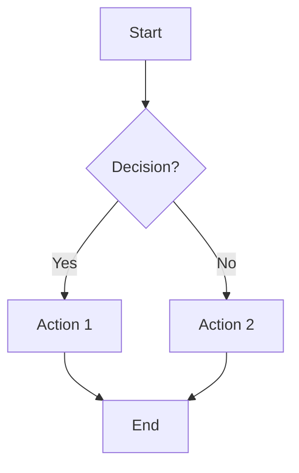

# Folder Structure Documentation Standard

## Overview

This document establishes the mandatory folder structure documentation pattern that applies to every directory in the Research Project Template. Every directory must follow this pattern to ensure consistent, documentation across the entire codebase.

## Core Documentation Pattern

### Mandatory Files

Every directory **must** contain exactly two documentation files:

1. **`AGENTS.md`** - technical documentation
2. **`README.md`** - Quick human reference guide

### Pattern Enforcement

This pattern is **mandatory** at all folder levels:

```
directory/
├── AGENTS.md          # REQUIRED: technical documentation for AI agents and developers
├── README.md          # REQUIRED: Quick reference with signposting and Mermaid diagrams
├── [optional].md      # OPTIONAL: Additional specialized documentation
└── [code files]
```

**Violation of this pattern** is considered a documentation standard breach and must be corrected immediately.

## AGENTS.md Requirements

### Purpose
- **technical documentation** for understanding and working with directory contents
- **AI agent friendly** - structured for automated parsing and comprehension
- **Developer reference** - details for implementation and maintenance

### Content Structure
1. **Overview** (50-100 words) - What this directory does, why it exists, who uses it
2. **Key Concepts** (optional) - Terminology, architecture, important principles
3. **Directory Structure** - File organization and purpose of each file
4. **Installation/Setup** (if applicable) - Prerequisites, installation steps, configuration
5. **Usage Examples** - Common tasks, real-world scenarios, copy-paste ready examples
6. **Configuration** (if applicable) - All options, environment variables, config files
7. **Testing** (for directories with tests) - How to run tests, test structure, writing tests
8. **API Reference** (for modules) - Key classes, functions, import statements, parameters, returns
9. **Troubleshooting** - Common issues, solutions, debug tips
10. **Best Practices** - Do's and don'ts, performance tips, security considerations
11. **See Also / References** - Related documentation, external resources, cross-references

### Length Guidelines
- **Minimum**: 100 lines for simple directories
- **Typical**: 200-500 lines for most directories
- **Maximum**: 600 lines (split into specialized files if exceeded)

## README.md Requirements

### Purpose
- **Quick human reference** - fast lookup of common tasks and key information
- **Signposting** - clear navigation to detailed documentation
- **Visual elements** - Mermaid diagrams for architecture and workflows

### Content Structure
1. **Title** - One-line description of directory purpose
2. **Quick Start** - Minimal working example (5-10 lines)
3. **Key Features** - 3-5 bullet points highlighting capabilities
4. **Installation** - Copy-paste ready commands (if applicable)
5. **Common Commands** - 3-5 most frequently used operations
6. **More Information** - Link to AGENTS.md for details

### Length Guidelines
- **Typical**: 50-150 lines
- **Focus**: Concise, actionable information
- **Diagrams**: Include Mermaid diagrams for complex workflows or architectures

## Directory Structure Standards

### Root Level Directories

| Directory | AGENTS.md | README.md | Purpose |
|-----------|-----------|-----------|---------|
| `infrastructure/` | ✅ module documentation | ✅ Quick reference | Generic build/validation tools |
| `scripts/` | ✅ Entry point documentation | ✅ Quick reference | Orchestration scripts |
| `tests/` | ✅ Testing philosophy | ✅ Quick reference | Test suites |
| `project/` | ✅ Project structure guide | ✅ Quick reference | Research code |
| `docs/` | ✅ Documentation organization | ✅ Quick reference | Documentation hub |
| `.cursorrules/` | ✅ Standards overview | ✅ Quick reference | Development guidelines |

### Infrastructure Subdirectories

All `infrastructure/` subdirectories follow the pattern:

```
infrastructure/module/
├── __init__.py           # Public API exports
├── AGENTS.md            # REQUIRED: technical documentation
├── README.md            # REQUIRED: Quick reference
├── core.py              # Core functionality
├── cli.py               # Command-line interface (optional)
├── config.py            # Configuration (optional)
├── [other files]
```

### Project Subdirectories

All `project/` subdirectories follow the pattern:

```
project/subdir/
├── AGENTS.md            # REQUIRED: Directory documentation
├── README.md            # REQUIRED: Quick reference
├── [code files]
├── [config files]
```

### Documentation Subdirectories

All `docs/` subdirectories follow the pattern:

```
docs/section/
├── AGENTS.md            # REQUIRED: Section documentation
├── README.md            # REQUIRED: Quick reference
├── [topic files]
```

## Integration with Development Standards

### Cross-References

This standard integrates with:

- [`.cursorrules/documentation_standards.md`](documentation_standards.md) - Detailed AGENTS.md/README.md writing guidelines
- [`.cursorrules/AGENTS.md`](AGENTS.md) - System overview and navigation
- [Root `AGENTS.md`](../AGENTS.md) - Directory-level documentation section

### Quality Assurance

Documentation quality is verified through:

1. **Manual review** - Pull request reviews check for AGENTS.md/README.md presence
2. **Automated checks** - Pre-commit hooks can validate documentation structure
3. **Consistency audits** - Regular reviews ensure standards compliance

### Update Triggers

Update documentation when:

- **Architecture changes** - New directories, file reorganization
- **API changes** - New functions, parameters, return types
- **Feature additions** - New capabilities, usage patterns
- **Breaking changes** - API modifications, migration requirements
- **Bug fixes** - Important fixes with changed behavior

## Optional Specialized Documentation

### When to Add Additional .md Files

Additional documentation files should only be added when:

1. **Content exceeds reasonable length** (>600 lines in AGENTS.md)
2. **Specialized audience needs** (e.g., API.md for external users)
3. **Maintenance benefits** (e.g., CHANGELOG.md for versioned modules)

### Recommended Optional Files

| File | Purpose | When to Use |
|------|---------|-------------|
| `CHANGELOG.md` | Version history, migration notes | Versioned infrastructure modules |
| `EXAMPLES.md` | Extended usage examples | Complex modules with many use cases |
| `TROUBLESHOOTING.md` | Detailed troubleshooting | Error-prone modules (LLM, rendering) |
| `API.md` | API reference | Large public-facing modules |
| `DESIGN.md` | Design decisions, rationale | Complex architectural decisions |
| `DEPENDENCIES.md` | External dependencies | Modules with complex requirements |

## Mermaid Diagram Standards

### README.md Diagram Requirements

README.md files should include Mermaid diagrams for:

- **Architecture diagrams** - showing relationships between components
- **Workflow diagrams** - illustrating processes and data flow
- **Decision trees** - for complex conditional logic

### Diagram Guidelines



- Use descriptive node names (no spaces in IDs)
- Include clear labels for decision points
- Use consistent arrow styles
- Keep diagrams focused and readable

## Examples from Repository

### Infrastructure Module Example

```
infrastructure/llm/
├── __init__.py
├── AGENTS.md          # LLM integration documentation
├── README.md          # Quick LLM setup and usage
├── core/
│   ├── __init__.py
│   ├── AGENTS.md      # Core LLM functionality
│   ├── README.md      # Quick core reference
│   └── [python files]
├── templates/
│   ├── AGENTS.md      # Template system documentation
│   ├── README.md      # Quick template reference
│   └── [python files]
└── [other subdirs]
```

### Project Directory Example

```
project/src/
├── __init__.py
├── AGENTS.md          # research code documentation
├── README.md          # Quick research code reference
├── data_processing.py
├── simulation.py
├── visualization.py
└── [other files]
```

## Quality Checklist

Before committing folder structure changes:

- [ ] Every directory has `AGENTS.md` and `README.md`
- [ ] AGENTS.md follows standard section structure
- [ ] README.md includes Mermaid diagrams where appropriate
- [ ] Cross-references are accurate and working
- [ ] Optional files have clear justification
- [ ] Documentation is up-to-date with code changes
- [ ] No orphaned documentation files

## See Also

- [documentation_standards.md](documentation_standards.md) - Detailed AGENTS.md/README.md writing guidelines
- [AGENTS.md](AGENTS.md) - Overview of all development standards
- [../AGENTS.md](../AGENTS.md) - Root documentation structure
- [../docs/](../docs/) - Main documentation hub

---

**Version**: 1.0.0
**Last Updated**: 2025-01-01
**Status**: Active standard - mandatory compliance
**Maintainer**: Template Team