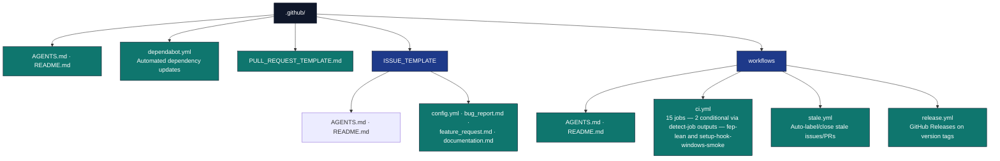

# GitHub Integration

## Overview

The `.github/` directory contains GitHub-specific configuration and automation for the Research Project Template. This includes continuous integration workflows, issue templates, PR templates, and other GitHub integrations that ensure code quality and collaborative development.

**Human entry point:** [README.md](README.md) — GitHub overview, doc map, and [Agent & automation entry point](README.md#agent--automation-entry-point). **This file (`AGENTS.md`):** job names, paths, and thresholds for automation and agents.

## Publication

**Title**: *A template/ approach to Reproducible Generative Research: Architecture and Ergonomics from Configuration through Publication*
**DOI**: [10.5281/zenodo.19139090](https://doi.org/10.5281/zenodo.19139090)
**Record**: [zenodo.org/records/19139090](https://zenodo.org/records/19139090)
**License**: Apache 2.0

Public exemplar GitHub/Zenodo records are generated into [`.github/README.md`](README.md#published-exemplars--pipeline-productivity-advanced-provenance-and-autopoiesis) from [`../docs/_generated/publication_records.md`](../docs/_generated/publication_records.md). Refresh them with:

```bash
uv run python scripts/docgen/publication_records.py --refresh-external
```

## Directory Structure



## Continuous Integration (CI/CD)

### CI Pipeline (`workflows/ci.yml`)

**Triggers:** push to `main`, pull requests targeting `main`, weekly scheduled run (Sunday midnight UTC), manual **`workflow_dispatch`** (no inputs).
**Concurrency:** Running builds for the same ref are cancelled when a new commit arrives.

**Pipeline jobs** (job ids in `ci.yml`; display names differ — use `name:` for branch protection):

**15 jobs total; 2 are conditional, gated by the `detect` job's outputs
(`needs.detect.outputs.*`) — NOT a job-level `hashFiles()` (that is invalid
in a job `if:` and rejects the whole workflow at parse).**

| # | Job id | Display name (representative) | Depends on | Python | Runner |
| --- | --- | --- | --- | --- | --- |
| 1 | `detect` | Detect optional projects | — | — | ubuntu (always) |
| 2 | `detect-projects` | Detect public exemplars | — | — | ubuntu (always) |
| 3 | `actionlint` | Actionlint | — | — | ubuntu (always) |
| 4 | `lint` | Lint & Type Check | — | 3.12 | ubuntu |
| 5 | `health` | Static Health Report | lint | 3.12 | ubuntu |
| 6 | `verify-no-mocks` | Verify No Mocks Policy | lint | 3.12 | ubuntu |
| 7 | `setup-hook-windows-smoke` | Setup hook (Windows smoke) | verify-no-mocks, detect | 3.12 | windows · runs iff `needs.detect.outputs.setup_hook == 'true'` |
| 8 | `test-infra` | Infra Tests (matrix) | verify-no-mocks | 3.10–3.13 | ubuntu (×3.10/3.11/3.12/3.13) + macOS (3.12 only) — 5 cells |
| 9 | `test-regression` | Regression Tier (claim-binding pins) | verify-no-mocks | 3.12 | ubuntu |
| 10 | `test-project` | Project Tests (per-project matrix) | verify-no-mocks, detect-projects | 3.10 + 3.12 | ubuntu only — one cell per live public exemplar × 2 Python versions; roster from `PUBLIC_PROJECT_NAMES` |
| 11 | `fep-lean` | fep_lean (gauss + lake) | verify-no-mocks, detect | 3.12 | ubuntu · runs iff `needs.detect.outputs.fep_lean == 'true'` |
| 12 | `validate` | Validate Manuscripts | lint | 3.12 | ubuntu |
| 13 | `security` | Security Scan | lint | 3.12 | ubuntu |
| 14 | `docs-lint` | Documentation Lint | lint | 3.12 | ubuntu |
| 15 | `performance` | Performance Check | test-infra + test-project | 3.12 | ubuntu |

**Lint job** also runs `uv run python -m infrastructure.skills check-all-exports` (MED5 `__all__` gate), `scripts/audit/check_tracked_generated_artifacts.py` (rejects generated outputs and local `.codegraph/` indexes), and **`scripts/audit/check_tracked_all.py`** — the **confidentiality guard** that fails CI if any path outside the public allowlists for `projects/`, `fonds/`, `rules/`, or `tools/` is git-tracked (this is a public repo; confidential/rotating resources are local-only). **`validate`** runs manuscript markdown validation (one dir per invocation, looped over `projects/*/manuscript/`), `scripts/docgen/api_reference.py --check`, and imports each `projects.{name}.src`. **`security`** runs blocking **`pip-audit`** (IDs from [`.github/pip-audit-ignore.txt`](pip-audit-ignore.txt), up to 3 retries on failure) and **`bandit -c bandit.yaml -r -ll`** over `infrastructure/`, `scripts/`, and `projects/`. Path exclusions (the non-rendered subfolders `projects/working/`, `projects/published/`, `projects/archive/`, `projects/other/`, plus `.venv`, `site-packages`, `.lake`, and the rotating research projects under `projects/active/`) live in [`bandit.yaml`](../bandit.yaml) (`exclude_dirs`).

**Display name (branch protection):** the optional fep_lean job is reported as **`fep_lean (gauss + lake)`** (`ci.yml` `name:` on job id `fep-lean`). It runs only when the `detect` job sets `fep_lean == 'true'` (`if: needs.detect.outputs.fep_lean == 'true'`) — a job-level `hashFiles()` is **invalid** in a job `if:` and would reject the whole workflow at parse, which is why the `detect` job exists. When fep_lean lives under `projects/working/`, `detect` reports `false` and the job is skipped. Promote with `mv projects/working/fep_lean projects/active/fep_lean` to activate CI. **Branch protection must NOT mark the two conditional jobs (`fep-lean`, `setup-hook-windows-smoke`) as required** — they are skipped (not failed) when their project is absent, so requiring them would wedge every PR.

Coverage is uploaded to **Codecov** after each test job (3.12/ubuntu-latest only).

The `verify-no-mocks` job runs [`scripts/audit/verify_no_mocks.py`](../scripts/audit/verify_no_mocks.py) at the repository root (not under `.github/`).

### Stale Workflow (`workflows/stale.yml`)

Runs daily. Issues → stale after 60 days, closed after 14 more. PRs → stale after 30 days, closed after 14 more. Exempt labels: `pinned`, `security`, `in-progress`, `blocked`, `do-not-close`.

### Release Workflow (`workflows/release.yml`)

Triggered by `v*.*.*` tag pushes or manual dispatch with a tag. It resolves the requested tag before checkout, checks out that exact ref, proves `HEAD` matches the dereferenced tag commit, runs the root release contract, and only then builds. The release uses `softprops/action-gh-release@v3.0.2`, writes a short git-log excerpt to `body_path`, and keeps **`generate_release_notes`** off so GitHub does not duplicate the body.

## Dependabot (`dependabot.yml`)

[`dependabot.yml`](dependabot.yml) at the repository root: **GitHub Actions** (`package-ecosystem: github-actions`, `directory: /`) and **Python** (`package-ecosystem: pip`, `directory: /`) both read the root **`pyproject.toml`** / lockfile — compatible with **uv**. Weekly **Monday 09:00 UTC**, max **5** open PRs per ecosystem. Groups: **`actions-minor`** (Actions minor/patch), **`dev-tools`** and **`scientific-core`** (Python).

## Quality Gates

| Gate | Threshold |
| --- | --- |
| Ruff lint | zero violations |
| Ruff format | zero diffs |
| mypy strict gate | zero errors across the generated public source scope |
| Mock-framework lexical gate | zero prohibited imports/calls (`--inventory` debt remains advisory) |
| Infrastructure coverage | ≥ 60% |
| Project coverage (per-project standalone) | ≥ 90% |
| Combined-union public-project gate (`DEFAULT_FAIL_UNDER`) | ≥ 75% via local `01_run_tests.py --project-only --all-projects --public-projects` (CI `test-project` enforces per-exemplar 90% only) |
| pip-audit | zero known vulns not listed in `.github/pip-audit-ignore.txt` |
| Bandit MEDIUM+ (`-c bandit.yaml`) | zero findings |
| Mermaid diagrams render under `mmdc` | zero failures |
| Markdown cross-links resolve on disk | zero broken links |
| Permanent-template folders carry `AGENTS.md` + `README.md` | zero missing pairs |
| `N Python (sub)packages` claims match reality | zero stale counts |
| Rotating projects in long-lived docs are conditional | zero ghost references |
| Import time | ≤ 5 s |
| Module line count (`scripts/gates/module_line_count_check.py`) | warn ≥ 800 / fail ≥ 950 for `infrastructure/` + `scripts/`; warn ≥ 150 / fail ≥ 250 for `projects/*/scripts/` |

## Local Pre-Push Parity (`.pre-commit-config.yaml`)

The repo ships a [`.pre-commit-config.yaml`](../.pre-commit-config.yaml) with
**seven pre-push hooks** that mirror (or partially mirror) CI gates so pushes
that would fail CI fail locally first:

| Hook id | Mirrors CI step | Typical runtime |
| --- | --- | :-: |
| `pre-push-quick` | `verify-no-mocks` + `check_tracked_all` + `tests/infra_tests/git_hook_smoke/` | ~3 s |
| `docs-contract-guard` | `check_template_drift.py --strict` + AGENTS personal-memory test | ~5 s |
| `bandit-quick` | `security` job Bandit step (`-c bandit.yaml -r -ll`) | ~5–30 s |
| `skills-check` | `infrastructure.skills check` (manifest freshness) | <1 s |
| `operations-check` | `infrastructure.skills operations-check` (operation-manifest freshness) | <1 s |
| `all-exports-check` | `infrastructure.skills check-all-exports` (lint job MED5 gate) | <1 s |
| `skill-reachability-check` | docs-lint skill front-door and index completeness gate | <1 s |

The lint job also runs the deterministic source-only publication audit across
the generated public roster:

```bash
uv run python -m infrastructure.validation.cli publication-audit --all-public --strict --format json
```

For release sign-off, add `--rendered` after running each exemplar's canonical
pipeline; that mode makes artifact manifests, evidence registries, and figure
registries blocking requirements. Subjective editorial findings remain
`review_required` and are reported without weakening deterministic failures.

The lint hooks (`ruff-ci`, `mypy-ci`) run on the **pre-commit** stage, not
pre-push, to keep `git commit` fast. A separate manual-stage `bandit-low`
hook provides a stricter LOW+MEDIUM+HIGH sweep against `bandit.yaml`'s
allow-list — invoke with `pre-commit run --hook-stage manual bandit-low`. To
run the full pre-push gate manually:

```bash
pre-commit run --hook-stage pre-push --all-files
```

A new MEDIUM Bandit finding fails `git push` locally with the same scope and
severity as the CI `security` job, so contributors hear it before CI does.

## Branch Protection (Recommended)

Required checks must match the **`name:`** field of each job in [`workflows/ci.yml`](workflows/ci.yml). `main` is currently unprotected, so the contexts below are **illustrative**. Matrix jobs expand to one check per cell:

- **`test-infra`** → **Infra Tests (`<os>`, Python `<ver>`)** — 5 cells: `ubuntu-latest × 3.10/3.11/3.12/3.13` plus `macos-latest × 3.12`.
- **`test-project`** → **Project Tests (`<project>`, py`<ver>`)** — one cell for each public exemplar from [`../docs/_generated/active_projects.md`](../docs/_generated/active_projects.md) (`templates/template_*`) on each of `py3.10` and `py3.12`, ubuntu-latest only.

Require the combinations you care about, or use GitHub rulesets that treat required checks flexibly.

```yaml
required_status_checks:
  contexts:
    - "Lint & Type Check"
    - "Verify No Mocks Policy"
    - "Infra Tests (ubuntu-latest, Python 3.10)"
    - "Infra Tests (ubuntu-latest, Python 3.11)"
    - "Infra Tests (ubuntu-latest, Python 3.12)"
    - "Infra Tests (ubuntu-latest, Python 3.13)"
    - "Infra Tests (macos-latest, Python 3.12)"
    # test-project expands dynamically: "Project Tests (<project>, py<ver>)"
    # for each live templates/template_* exemplar on py3.10 and py3.12. Examples:
    - "Project Tests (templates/template_active_inference, py3.12)"
    - "Project Tests (templates/template_code_project, py3.10)"
    # ... (one check per exemplar × {py3.10, py3.12})
    # Optional: only when fep_lean job runs (skipped if no lean-toolchain file)
    # - "fep_lean (gauss + lake)"
    - "Static Health Report"
    - "Validate Manuscripts"
    - "Security Scan"
    - "Documentation Lint"
    - "Performance Check"
required_pull_request_reviews:
  required_approving_review_count: 1
```

Branch protection is an external GitHub control and must also require the
`Regression Tier (claim-binding pins)` check. Changes under the sensitive
workflow/configuration paths listed in [`sensitive-ownership.yaml`](sensitive-ownership.yaml)
must receive the generated CODEOWNERS review. The current single-maintainer
exceptions are documented in that policy file; they are risk disclosures, not
permission to bypass the required status checks or sensitive-area review.

## Issue Templates

| Template | Labels | Use for |
| --- | --- | --- |
| Bug Report | `bug`, `needs-triage` | Reproducible errors with log output |
| Feature Request | `enhancement`, `needs-triage` | New capabilities and improvements |
| Documentation Update | `documentation`, `needs-triage` | Incorrect or missing docs |

Blank issues are disabled. General questions should go to **GitHub Discussions**.
See [`ISSUE_TEMPLATE/AGENTS.md`](ISSUE_TEMPLATE/AGENTS.md) for local editing rules.

## Troubleshooting

```bash
# Fix linting locally
uv run python -m infrastructure.project.public_scope lint-paths | xargs uv run ruff check --fix
uv run python -m infrastructure.project.public_scope lint-paths | xargs uv run ruff format

# Run tests locally (mirror the exact fast CI lane)
COVERAGE_FILE=.coverage.infra uv run pytest tests/infra_tests/ \
  -n auto --dist worksteal --benchmark-disable \
  --cov=infrastructure --cov-report=term-missing --cov-fail-under=60 \
  --durations=10 \
  -m "not requires_ollama and not requires_docker and not network and not slow and not bench and not benchmark and not performance" \
  --timeout=120
# Uncached serial diagnostic oracle: remove the xdist flags above.
uv sync --group public-exemplars
COVERAGE_FILE=.coverage.project uv run python scripts/pipeline/stage_01_test.py --project-only --all-projects --public-projects --non-strict --include-slow
uv run coverage xml -o coverage-project.xml

# Security scan locally (mirror CI)
IGNORE_ARGS=()
while IFS= read -r raw; do [[ "$raw" =~ ^[[:space:]]*# ]] && continue; line="${raw%%#*}"; line="$(echo "$line" | xargs)"; [ -z "$line" ] || IGNORE_ARGS+=(--ignore-vuln "$line"); done < .github/pip-audit-ignore.txt
uv run pip-audit "${IGNORE_ARGS[@]}"
uv run bandit -c bandit.yaml -r -ll infrastructure/ scripts/ projects/
# Module line count (also in `uv run python -m infrastructure.core.health --gates=module-line-count`):
uv run python scripts/gates/module_line_count_check.py
# Strict LOW+MEDIUM+HIGH sweep against the documented allow-list:
uv run bandit -c bandit.yaml -r --severity-level low infrastructure/ scripts/

# Check workflow status via GitHub CLI
gh workflow list
gh run list --workflow=CI --limit=5
gh run view <run-id> --log
```

## See Also

- [`README.md`](README.md) — Contributor-oriented GitHub integration guide
- [`workflows/AGENTS.md`](workflows/AGENTS.md) — Detailed CI/CD workflow documentation
- [`../AGENTS.md`](../AGENTS.md) — Root system overview
- [GitHub Actions Documentation](https://docs.github.com/en/actions)
- [uv Documentation](https://docs.astral.sh/uv/)
