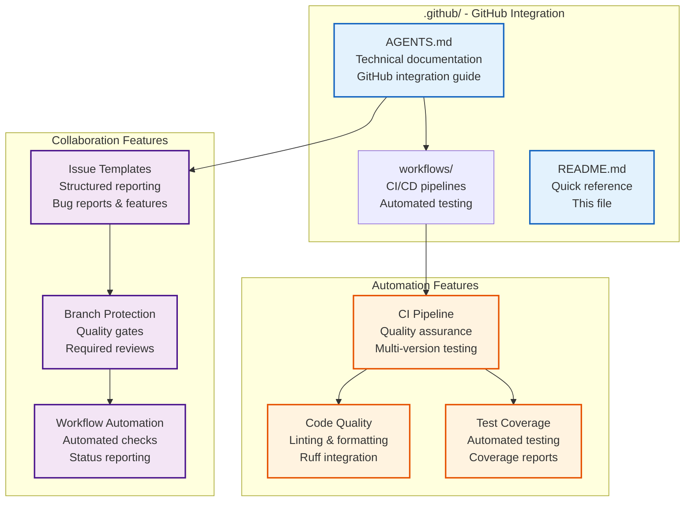

# .github/ - GitHub Integration

GitHub-specific configuration and automation ensuring code quality, collaborative development, and continuous integration. Includes CI/CD workflows, issue templates, and integration features.

## Overview



## Quick Start

### CI/CD Status
```bash
# Check workflow status
gh workflow list

# View recent runs
gh run list --workflow=CI

# Check current branch status
gh workflow view CI --ref=main
```

### Local CI Simulation
```bash
# Simulate CI environment locally
export CI=true
export GITHUB_ACTIONS=true

# Run linting (matches CI)
uvx ruff check infrastructure/ projects/act_inf_metaanalysis/src/
uvx ruff format --check infrastructure/ projects/act_inf_metaanalysis/src/

# Run tests with coverage (matches CI)
uv run pytest tests/infra_tests/ --cov=infrastructure --cov-fail-under=60
uv run pytest projects/act_inf_metaanalysis/tests/ --cov=projects/act_inf_metaanalysis/src --cov-fail-under=90
```

## Key Features

### Continuous Integration
- **Automated testing** across Python versions (3.10, 3.11, 3.12)
- **Code quality checks** with Ruff linting and formatting
- **Coverage validation** (60% infrastructure, 90% project minimum)
- **Multi-platform support** (Ubuntu latest)

### Quality Assurance
- **Branch protection** with required status checks
- **Automated PR validation** before merge
- **Coverage reporting** with codecov integration
- **Security scanning** (future enhancement)

### Collaboration Tools
- **Issue templates** for structured bug reports
- **PR templates** for consistent pull requests
- **Automated labeling** and triage
- **Status reporting** for all contributions

## CI Pipeline

### Workflow Triggers
```yaml
on:
  push:
    branches: [main]
  pull_request:
    branches: [main]
```

### Pipeline Jobs

#### Lint & Type Check (`lint`)
- **Python Version:** 3.12
- **Scope:** `infrastructure/` and `projects/act_inf_metaanalysis/src/`
- **Tools:** Ruff (linting + formatting), mypy (type checking)
- **Duration:** ~30 seconds

#### Infrastructure Tests (`test-infra`)
- **Python Versions:** 3.10, 3.11, 3.12 (matrix)
- **Scope:** `tests/infra_tests/` with 60% coverage minimum
- **Duration:** ~2-3 minutes per version

#### Project Tests (`test-project`)
- **Python Versions:** 3.10, 3.11, 3.12 (matrix)
- **Scope:** `projects/act_inf_metaanalysis/tests/` with 90% coverage minimum
- **Duration:** ~2-3 minutes per version

#### Validate Manuscripts (`validate`)
- **Python Version:** 3.12
- **Scope:** Manuscript markdown validation and project import verification
- **Depends on:** `lint`

#### Security Scan (`security`)
- **Python Version:** 3.12
- **Scope:** Dependency audit (`pip-audit`) and code scan (`bandit`)
- **Depends on:** `lint`

#### Performance Check (`performance`)
- **Python Version:** 3.12
- **Scope:** Import time benchmarks (must complete under 5 seconds)
- **Depends on:** `test-infra`, `test-project`

### Status Checks
```bash
# Required status checks for main branch
- lint (Python 3.12)
- test-infra (Python 3.10, 3.11, 3.12)
- test-project (Python 3.10, 3.11, 3.12)
- validate
- security
- performance
```

## Branch Protection

### Recommended Setup
```yaml
# GitHub Branch Protection Rules
required_status_checks:
  - lint
  - test-infra (3.10)
  - test-infra (3.11)
  - test-infra (3.12)
  - test-project (3.10)
  - test-project (3.11)
  - test-project (3.12)
  - validate
  - security
  - performance

required_pull_request_reviews:
  required_approving_review_count: 1

restrictions: null
```

### Quality Gates
- **Code must pass linting** (Ruff check + format)
- **Tests must pass** on both Python versions
- **Coverage requirements** must be met
- **PR review required** before merge

## Issue Templates

### Available Templates
- **Bug Report:** Structured bug reporting with reproduction steps
- **Feature Request:** Feature proposals with use cases
- **Documentation:** Documentation improvements and corrections

### Template Structure
```markdown
## Description
Brief description of the issue/feature

## Expected Behavior
What should happen?

## Actual Behavior
What actually happens?

## Steps to Reproduce
1. Step 1
2. Step 2
3. Step 3

## Environment
- OS: [e.g., macOS, Ubuntu]
- Python: [e.g., 3.10, 3.11]
- Browser: [if applicable]
```

## Pull Request Template

### Required Sections
- **Description:** Brief description of changes
- **Type of Change:** Bug fix, new feature, documentation update, etc.
- **Testing:** What tests were added/modified
- **Checklist:** Code standards, documentation updates, etc.

## Workflow Management

### Common Commands
```bash
# List workflows
gh workflow list

# View workflow details
gh workflow view CI

# Run workflow manually (if workflow_dispatch enabled)
gh workflow run CI

# Check workflow status
gh run list --workflow=CI --limit=5
```

### Debugging Failures
```bash
# View failed run logs
gh run view <run-id> --log

# Download artifacts
gh run download <run-id>

# Rerun failed jobs
gh run rerun <run-id>
```

## Integration Points

### With Repository
- **Automatic execution** on pushes to main and pull requests
- **Status reporting** to GitHub UI
- **Coverage badges** linked to codecov
- **Branch protection** integration

### With Development
- **Pre-merge validation** ensures code quality
- **Automated feedback** on pull requests
- **Coverage tracking** over time
- **Multi-version compatibility** assurance

## Customization

### Adding New Workflows
```yaml
# .github/workflows/new-workflow.yml
name: New Workflow
on:
  push:
    branches: [main]

jobs:
  new-job:
    runs-on: ubuntu-latest
    steps:
      - uses: actions/checkout@v4
      - name: New step
        run: echo "Custom workflow logic"
```

### Modifying CI Pipeline
1. Edit `workflows/ci.yml`
2. Test changes locally first
3. Commit and create pull request
4. Monitor CI results
5. Update documentation if needed

## Troubleshooting

### Common Issues

#### Workflow Not Triggering
```bash
# Check workflow file syntax
gh workflow run --list

# Verify trigger conditions match
# Check branch name, file paths, etc.
```

#### Linting Failures
```bash
# Fix locally first
uvx ruff check infrastructure/ projects/act_inf_metaanalysis/src/ --fix
uvx ruff format infrastructure/ projects/act_inf_metaanalysis/src/

# Commit fixes
git add .
git commit -m "fix: linting issues"
```

#### Test Failures
```bash
# Run infrastructure tests locally
uv run pytest tests/infra_tests/ -v

# Run project tests locally
uv run pytest projects/act_inf_metaanalysis/tests/ -v

# Debug specific test
uv run pytest tests/infra_tests/test_specific.py::TestClass::test_method -s
```

#### Coverage Issues
```bash
# Check infrastructure coverage locally
uv run pytest tests/infra_tests/ --cov=infrastructure --cov-report=html
open htmlcov/index.html

# Check project coverage locally
uv run pytest projects/act_inf_metaanalysis/tests/ --cov=projects/act_inf_metaanalysis/src --cov-report=html
open htmlcov/index.html
```

## Security

### Secret Management
- **GitHub Secrets:** Encrypted storage for tokens
- **Environment Variables:** Secure value injection
- **Access Control:** Minimal required permissions
- **Audit Logging:** Secret access tracking

### Security Scanning
```yaml
# Active in CI security job
- name: Dependency audit
  run: uv run pip-audit
- name: Code security scan
  run: uv run bandit -r infrastructure/ projects/act_inf_metaanalysis/src/
```

## Monitoring

### Pipeline Metrics
- **Success Rate:** Percentage of successful builds
- **Build Duration:** Average execution time
- **Coverage Trends:** Test coverage over time
- **Failure Patterns:** Common failure modes

### Integration Monitoring
- **Status Checks:** Real-time build status
- **Coverage Reports:** Automated coverage uploads
- **Performance Tracking:** Build time monitoring
- **Quality Metrics:** Automated quality assessment

## See Also

- [`AGENTS.md`](AGENTS.md) - Complete GitHub integration guide
- [`workflows/AGENTS.md`](workflows/AGENTS.md) - CI/CD workflow documentation
- [`../docs/development/CONTRIBUTING.md`](../docs/development/CONTRIBUTING.md) - Contribution guidelines
- [`../docs/operational/CI_CD_INTEGRATION.md`](../docs/operational/CI_CD_INTEGRATION.md) - CI/CD integration guide