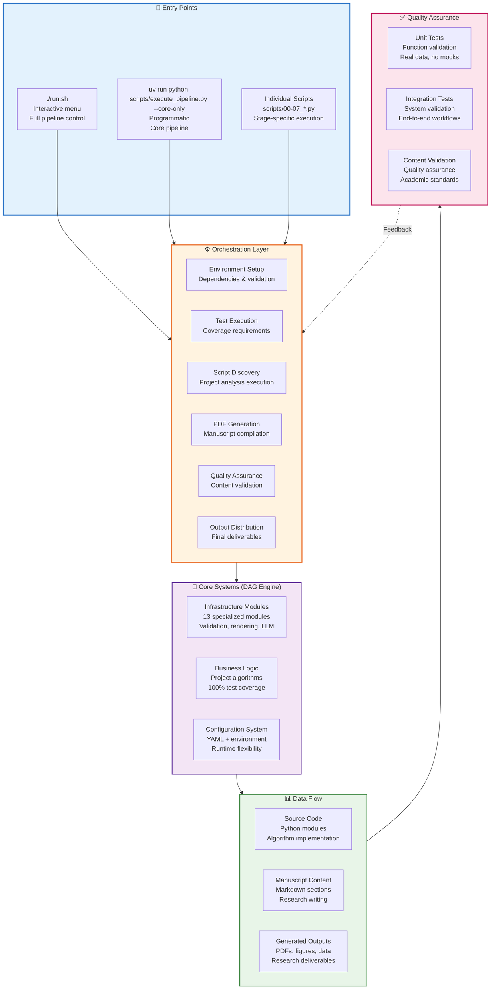
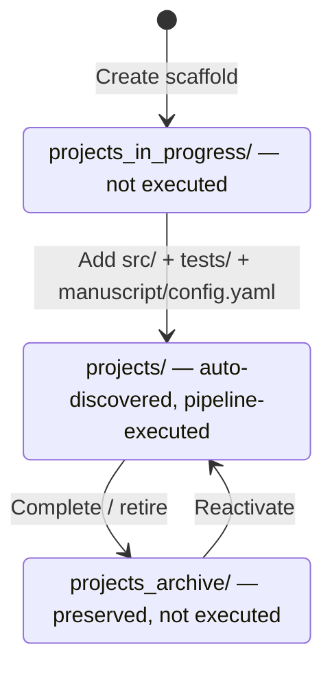
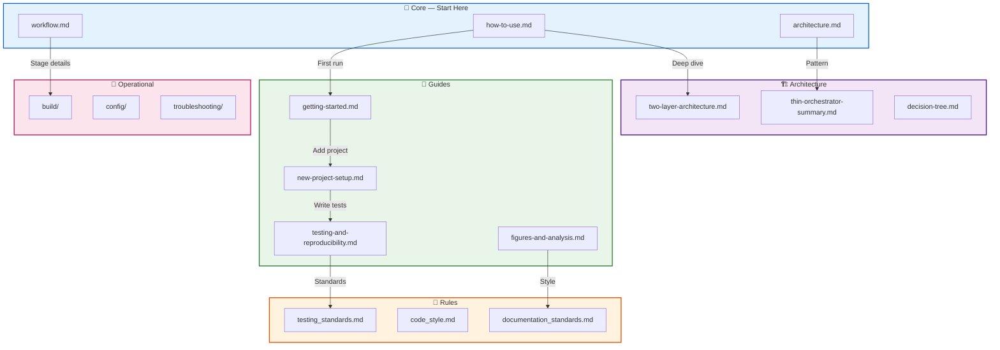
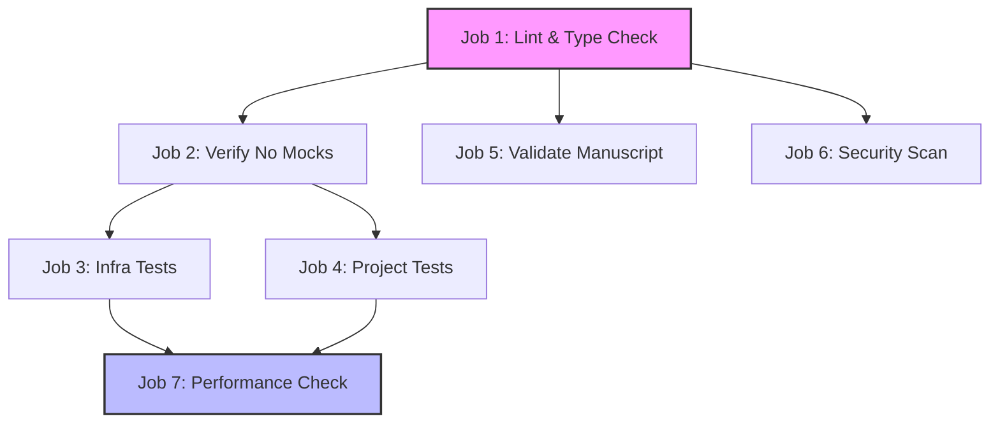

<!-- markdownlint-disable MD013 MD033 MD041 MD051 MD060 -->
<div align="center">

# 🔬 Docxology Template

**Production-grade scaffold for reproducible computational research**
Pipelines · Manuscripts · Cryptographic Provenance · AI-Agent Collaboration

[](https://github.com/docxology/template/actions/workflows/ci.yml)
[](https://www.python.org/)
[](https://docs.astral.sh/uv/)
[](https://docs.astral.sh/ruff/)
[](../LICENSE)
[](../pyproject.toml)
[](https://doi.org/10.5281/zenodo.19139090)

> **📄 Published**: [*A template/ approach to Reproducible Generative Research: Architecture and Ergonomics from Configuration through Publication*](https://zenodo.org/records/19139090) — DOI: [10.5281/zenodo.19139090](https://doi.org/10.5281/zenodo.19139090)

[**⚡ Quick Start**](#quick-start) · [**📐 Architecture**](#architecture) · [**🔄 Pipeline**](#pipeline) · [**🤖 AI Collaboration**](#ai-collaboration) · [**🔒 Provenance**](#security-provenance) · [**📚 Docs**](#documentation-hub)

</div>

---

## About `.github/`

This folder is the **GitHub integration surface**: Actions workflows, Dependabot, and issue/PR templates. It is not importable application code.

| Document | Use |
| --- | --- |
| **This file** | Human overview while browsing the repo on GitHub |
| [`AGENTS.md`](AGENTS.md) | Technical index: job names, triggers, coverage thresholds |
| [`workflows/README.md`](workflows/README.md) | CI job graph and commands to mirror CI locally |

**Related (repo root):** [`.cursor/skill_manifest.json`](../.cursor/skill_manifest.json) lists agent `SKILL.md` descriptors. After adding or editing `infrastructure/**/SKILL.md`, run `uv run python -m infrastructure.skills write` and commit the updated manifest (see [`infrastructure/skills/`](../infrastructure/skills/)).

---

## What Is This?

The **Docxology Template** solves the structural root of research irreproducibility: fragmentation between code, tests, manuscripts, and provenance. Instead of patching tools together, it enforces integrity at the architectural level.

| You get | How |
| --- | --- |
| **Reproducible builds** | 10-stage DAG pipeline from env setup → tests → PDF → hashed artifact |
| **Real test enforcement** | Zero-Mock policy · ≥90% project coverage · ≥60% infra coverage |
| **Cryptographic provenance** | SHA-256/512 hashing + steganographic watermarking on every PDF |
| **Horizontal scaling** | N independent projects share one infrastructure layer — no coupling |
| **AI-agent-ready codebase** | `AGENTS.md` + `README.md` per directory; `SKILL.md` + [`.cursor/skill_manifest.json`](../.cursor/skill_manifest.json) for routing |
| **Interactive orchestration** | `run.sh` TUI menu for humans · `--pipeline` flag for CI |

---

## ⚡ Quick Start

```bash
# 1. Create your research repo from this template
gh repo create my-research --template docxology/template --private
cd my-research

# 2. Install dependencies
uv sync

# 3. Run the interactive pipeline menu
./run.sh

# 4. Or run non-interactively against the exemplar project
./run.sh --pipeline --project code_project

# Outputs → output/code_project/
```

> **Don't have `uv`?** → `curl -Ls https://astral.sh/uv/install.sh | sh`

See the full walkthrough in [**docs/RUN_GUIDE.md**](../docs/RUN_GUIDE.md) and [**docs/guides/getting-started.md**](../docs/guides/getting-started.md).

---

## 📐 Architecture

The repository is organized into two strictly separated layers — shared infrastructure that never changes per-project, and self-contained project workspaces that know nothing about each other.


```mermaid
graph TD
    Root["/ (Repository Root)"] --> Infra["infrastructure/ (Layer 1 — Shared)"]
    Root --> Scripts["scripts/ (Pipeline Stage Scripts)"]
    Root --> Projects["projects/ (Layer 2 — Project Workspaces)"]
    Root --> Docs["docs/ (Documentation Hub — 90+ files)"]
    Root --> Output["output/ (Final Deliverables)"]

    subgraph "Layer 1 · 13 infrastructure subpackages · ~150 Python modules"
        Infra --> Core["core/ — logging, config, exceptions"]
        Infra --> Rendering["rendering/ — Pandoc + XeLaTeX"]
        Infra --> Stego["steganography/ — SHA-256 + watermarking"]
        Infra --> Valid["validation/ — PDF + Markdown integrity"]
        Infra --> LLM["llm/ — Ollama review + translation"]
        Infra --> More["+ publishing, reporting, scientific, project, documentation…"]
    end

    subgraph "Layer 2 · Active Project Workspaces"
        Projects --> CP["code_project/ ← Master exemplar (100% cov · 45 tests)"]
        Projects --> BB["blake_bimetalism/ ← 18-part digital humanities manuscript"]
        Projects --> TP["template/ ← Meta-documentation (94.4% cov · 65 tests)"]
        Projects --> Dots["your_project/ ← Drop in; auto-discovered"]
    end
```

### Directory Reference

| Path | Persistence | Purpose |
| --- | :---: | --- |
| `infrastructure/` | Permanent | 13 subpackages (+ hub `SKILL.md`); see [`infrastructure/SKILL.md`](../infrastructure/SKILL.md) |
| `projects/` | Permanent | **Active** projects — discovered and executed by pipeline |
| `projects_in_progress/` | Transient | Staging area: scaffold here before promoting to `projects/` |
| `projects_archive/` | Permanent | Completed/retired work — preserved, not executed |
| `scripts/` | Permanent | 8 generic pipeline stage scripts (Stages 00–07) |
| `output/` | Disposable | Final PDFs, dashboards, reports — cleaned on each run |
| `docs/` | Permanent | 90+ documentation files across 13 subdirectories |
| `tests/` | Permanent | Infrastructure-level test suite (≥ 60% coverage gate) |

> **Key invariant:** All domain logic lives in `projects/{name}/src/`. Scripts are **thin orchestrators** — they import and call, never implement. See [docs/architecture/thin-orchestrator-summary.md](../docs/architecture/thin-orchestrator-summary.md).

---

## 📁 Active Projects

### `code_project` — Master Numerical Exemplar

> **`projects/code_project/`** is the canonical example of a complete, working project. Use it as the reference when building your own.

| Feature | Implementation |
| --- | --- |
| Gradient descent optimization | `src/code_project/optimizer.py` |
| Scientific benchmarking | uses `infrastructure.scientific` |
| 45 tests, 100% coverage | `tests/` — Zero-Mock, real operations only |
| 6 publication-quality figures | generated in `scripts/`, registered via `FigureManager` |
| Full pipeline output | PDF rendered, validated, steganographically signed |
| Complete documentation | `AGENTS.md` + `README.md` throughout |

→ **Details**: [projects/code_project/AGENTS.md](../projects/code_project/AGENTS.md) · [projects/code_project/README.md](../projects/code_project/README.md)

### `template` — Meta-Documentation Project

> **`projects/template/`** is a self-referential manuscript that programmatically documents this very repository.

| Feature | Implementation |
| --- | --- |
| Repository introspection | `src/template/introspection.py` — discovers modules, projects, stages |
| Metrics injection | `src/template/metrics.py` + `inject_metrics.py` — `${var}` substitution |
| 65 tests, 94.4% coverage | `tests/` — Zero-Mock, real filesystem |
| 4 architecture figures | `scripts/generate_architecture_viz.py` — generated from live data |
| 21-chapter manuscript | ~13,500 words covering Two-Layer Architecture, pipeline, provenance |

→ **Details**: [projects/template/AGENTS.md](../projects/template/AGENTS.md) · [projects/template/README.md](../projects/template/README.md)

### `blake_bimetalism` — Digital Humanities Synthesis

> **`projects/blake_bimetalism/`** is an 18-part scholarly manuscript synthesizing William Blake's poetic critique with historical 18th-century bimetallism.

| Feature | Implementation |
| --- | --- |
| Data-driven manuscript | 18 markdown chapters injected with script-generated esoteric metrics |
| Custom visualization suite | Module-based plotting logic in `src/viz/` |
| Rigorous testing | Zero-Mock validation of pipeline stages and semantic generation |
| Cryptographic signing | Validated and steganographically watermarked as a final artifact |

→ **Details**: [projects/blake_bimetalism/AGENTS.md](../projects/blake_bimetalism/AGENTS.md) · [projects/blake_bimetalism/README.md](../projects/blake_bimetalism/README.md)

### Project Directory Layout

```text
projects/{name}/
├── src/{name}/            # All domain logic (algorithms, analysis)
├── tests/                 # Real tests — no mocks (≥ 90% coverage)
├── scripts/               # Thin orchestrators calling src/
├── manuscript/            # Markdown chapters + config.yaml
├── output/                # Pipeline artifacts (generated)
└── AGENTS.md              # AI-agent context for this project
```

### System Architecture Overview


```mermaid
graph TB
    subgraph Entry["🚀 Entry Points"]
        RUNSH[./run.sh\nInteractive menu\nFull pipeline control]
        RUNALL[uv run python scripts/execute_pipeline.py --core-only\nProgrammatic\nCore pipeline]
        INDIVIDUAL[Individual Scripts\nscripts/00-07_*.py\nStage-specific execution]
    end

    subgraph Orchestration["⚙️ Orchestration Layer"]
        SETUP[Environment Setup\nDependencies & validation]
        TESTING[Test Execution\nCoverage requirements]
        ANALYSIS[Script Discovery\nProject analysis execution]
        RENDERING[PDF Generation\nManuscript compilation]
        VALIDATION[Quality Assurance\nContent validation]
        DELIVERY[Output Distribution\nFinal deliverables]
    end

    subgraph Core["🧠 Core Systems (DAG Engine)"]
        INFRASTRUCTURE[Infrastructure Modules\n13 specialized modules\nValidation, rendering, LLM]
        BUSINESS_LOGIC[Business Logic\nProject algorithms\n100% test coverage]
        CONFIGURATION[Configuration System\nYAML + environment\nRuntime flexibility]
    end

    subgraph Data["📊 Data Flow"]
        SOURCE_CODE[Source Code\nPython modules\nAlgorithm implementation]
        MANUSCRIPT_CONTENT[Manuscript Content\nMarkdown sections\nResearch writing]
        GENERATED_OUTPUTS[Generated Outputs\nPDFs, figures, data\nResearch deliverables]
    end

    subgraph Quality["✅ Quality Assurance"]
        UNIT_TESTS[Unit Tests\nFunction validation\nReal data, no mocks]
        INTEGRATION_TESTS[Integration Tests\nSystem validation\nEnd-to-end workflows]
        VALIDATION_CHECKS[Content Validation\nQuality assurance\nAcademic standards]
    end

    RUNSH --> Orchestration
    RUNALL --> Orchestration
    INDIVIDUAL --> Orchestration

    Orchestration --> Core
    Core --> Data
    Data --> Quality

    Quality -.->|Feedback| Orchestration

    classDef entry fill:#e3f2fd,stroke:#1565c0,stroke-width:2px
    classDef orchestration fill:#fff3e0,stroke:#e65100,stroke-width:2px
    classDef core fill:#f3e5f5,stroke:#4a148c,stroke-width:2px
    classDef data fill:#e8f5e8,stroke:#2e7d32,stroke-width:2px
    classDef quality fill:#fce4ec,stroke:#c2185b,stroke-width:2px

    class Entry entry
    class Orchestration orchestration
    class Core core
    class Data data
    class Quality quality
```

To add your own project, follow [docs/guides/new-project-setup.md](../docs/guides/new-project-setup.md).

### Project Lifecycle


```mermaid
stateDiagram-v2
    [*] --> InProgress: Create scaffold
    InProgress --> Active: Add src/ + tests/ + manuscript/config.yaml
    Active --> Archive: Complete / retire
    Archive --> Active: Reactivate

    InProgress : projects_in_progress/ — not executed
    Active : projects/ — auto-discovered, pipeline-executed
    Archive : projects_archive/ — preserved, not executed
```

---

## 🔄 Pipeline

`run.sh` executes a **10-stage declarative DAG pipeline** configured via `pipeline.yaml`. `secure_run.sh` appends steganographic post-processing.

```mermaid
flowchart TD
    subgraph Input["📥 Input Data"]
        SOURCE_CODE[Source Code\nprojects/{name}/src/*.py\nAlgorithm implementations]
        ANALYSIS_SCRIPTS[Analysis Scripts\nprojects/{name}/scripts/*.py\nWorkflow orchestrators]
        MANUSCRIPT_FILES[Manuscript Files\nprojects/{name}/manuscript/*.md\nResearch content]
        CONFIG_FILES[Configuration\nconfig.yaml\nRuntime parameters]
    end

    subgraph Processing["⚙️ 10-Stage DAG Pipeline"]
        STAGE0[00 Clean\nRemove old outputs]
        STAGE1[01 Setup\nEnvironment validation]
        STAGE2[02 Infra Tests\nCoverage verification]
        STAGE3[03 Project Tests\nCoverage verification]
        STAGE4[04 Analysis\nScript execution]
        STAGE5[05 Render\nPDF generation]
        STAGE6[06 Validate\nQuality checks]
        STAGE7[07 LLM Reviews\nAI Scientific Review]
        STAGE8[08 LLM Translations\nMulti-lang generation]
        STAGE9[09 Copy Outputs\nDistribution]
    end

    subgraph Output["📤 Generated Outputs"]
        PDF_DOCS[PDF Documents\noutput/{name}/pdf/*.pdf\nProfessional manuscripts]
        FIGURES[Figures\noutput/{name}/figures/*.png\nPublication-quality plots]
        DATA_FILES[Data Files\noutput/{name}/data/*.csv\nAnalysis results]
        REPORTS[Reports\noutput/{name}/reports/*.md\nValidation summaries]
    end

    SOURCE_CODE --> STAGE3
    ANALYSIS_SCRIPTS --> STAGE4
    MANUSCRIPT_FILES --> STAGE5
    CONFIG_FILES --> STAGE1

    STAGE0 --> STAGE1 
    STAGE1 --> STAGE2
    STAGE1 --> STAGE3
    STAGE3 --> STAGE4
    STAGE4 --> STAGE5
    STAGE5 --> STAGE6
    STAGE6 --> STAGE7
    STAGE6 --> STAGE8
    STAGE6 --> STAGE9

    STAGE4 --> FIGURES
    STAGE4 --> DATA_FILES
    STAGE5 --> PDF_DOCS
    STAGE6 --> REPORTS

    classDef input fill:#e3f2fd,stroke:#1565c0,stroke-width:2px
    classDef process fill:#fff3e0,stroke:#e65100,stroke-width:2px
    classDef output fill:#e8f5e8,stroke:#2e7d32,stroke-width:2px

    class Input input
    class Processing process
    class Output output
```

| Stage | Script | Failure Mode |
| --- | --- | :---: |
| **00** Clean | `PipelineExecutor` built-in | Soft fail |
| **01** Setup | `00_setup_environment.py` | Hard fail |
| **02** Infra Tests | `01_run_tests.py --infra-only` | Configurable tolerance |
| **03** Project Tests| `01_run_tests.py --project-only` | Configurable tolerance |
| **04** Analysis | `02_run_analysis.py` | Hard fail |
| **05** Render PDF | `03_render_pdf.py` | Hard fail |
| **06** Validate | `04_validate_output.py` | Warning + report |
| **07** LLM Reviews | `06_llm_review.py --reviews-only` | Skippable (requires Ollama) |
| **08** LLM Translations| `06_llm_review.py --translations-only`| Skippable (requires Ollama) |
| **09** Copy | `05_copy_outputs.py` | Soft fail |

Full stage details: [docs/core/workflow.md](../docs/core/workflow.md) · [docs/core/how-to-use.md](../docs/core/how-to-use.md).

---

## 🤖 AI Collaboration

Every directory at every level contains **two documentation files**:

- **`README.md`** — Human-readable overview and quick-start
- **`AGENTS.md`** — Machine-readable spec for AI coding assistants: API tables, dependency graphs, architectural constraints, naming conventions

Under `infrastructure/`, each subpackage also has **`SKILL.md`** (YAML frontmatter). The aggregated list for editors is [`.cursor/skill_manifest.json`](../.cursor/skill_manifest.json) (regenerate with `uv run python -m infrastructure.skills write`). Cursor project rules live under [`.cursor/rules/`](../.cursor/rules/).

```
CLAUDE.md (root)          ← Global constraints: Zero-Mock, Thin Orchestrator, naming
  └── AGENTS.md (per dir) ← Local API surfaces, file inventories, integration patterns
        └── README.md     ← Human navigation and quick-start
```

See [docs/rules/](../docs/rules/) for standards and [`infrastructure/SKILL.md`](../infrastructure/SKILL.md) for the infrastructure skill hub.

---

## 🔒 Security & Provenance

Every rendered PDF is automatically processed by the steganographic pipeline via `secure_run.sh`:

| Layer | Mechanism | Survives |
| --- | --- | --- |
| **PDF Metadata** | XMP + Info dictionary (author, DOI, ORCID, build timestamp) | All viewers |
| **Hash manifest** | SHA-256 + SHA-512 in `*.hashes.json` | External verification |
| **Alpha overlay** | Low-opacity text per page (build time + commit hash) | Standard PDF operations, printing |
| **QR code** | Repository URL injected on final page | Redistribution |

Full specification: [docs/security/steganography.md](../docs/security/steganography.md) · [docs/security/hashing_and_manifests.md](../docs/security/hashing_and_manifests.md) · [docs/security/secure_execution.md](../docs/security/secure_execution.md).

---

## 🧪 Testing Standards

| Standard | Requirement |
| --- | --- |
| **Zero-Mock policy** | No `MagicMock`, `mocker.patch`, or `unittest.mock` anywhere |
| **Real operations** | Tests use real filesystem, subprocess, and HTTP calls |
| **Infrastructure coverage** | ≥ 60% (currently achieving 83%+) |
| **Project coverage** | ≥ 90% (`code_project` achieves 100% · `template` achieves 94.4%) |
| **Optional service skipping** | `@pytest.mark.requires_ollama` for graceful degradation |

```bash
# Mirror CI locally
uv run pytest tests/infra_tests/ --cov=infrastructure --cov-fail-under=60 -m "not requires_ollama"
uv run pytest projects/code_project/tests/ --cov-fail-under=90 -m "not requires_ollama"
python scripts/verify_no_mocks.py
```

See [docs/development/testing/](../docs/development/testing/) and [docs/guides/testing-and-reproducibility.md](../docs/guides/testing-and-reproducibility.md).

---

## 📚 Documentation Hub


```mermaid
graph TD
    subgraph Core["📂 Core — Start Here"]
        HOW[how-to-use.md]
        WORK[workflow.md]
        ARCH[architecture.md]
    end

    subgraph Build["🏗️ Architecture"]
        TLA[two-layer-architecture.md]
        THIN[thin-orchestrator-summary.md]
        DECIDE[decision-tree.md]
    end

    subgraph Learn["📖 Guides"]
        START[getting-started.md]
        NEW[new-project-setup.md]
        TEST[testing-and-reproducibility.md]
        FIG[figures-and-analysis.md]
    end

    subgraph Enforce["📏 Rules"]
        TSTD[testing_standards.md]
        CODE[code_style.md]
        DOC[documentation_standards.md]
    end

    subgraph Operate["🔧 Operational"]
        BUILD[build/]
        CONF[config/]
        TROUBLE[troubleshooting/]
    end

    HOW -->|"Deep dive"| TLA
    HOW -->|"First run"| START
    WORK -->|"Stage details"| BUILD
    ARCH -->|"Pattern"| THIN
    START -->|"Add project"| NEW
    NEW -->|"Write tests"| TEST
    TEST -->|"Standards"| TSTD
    FIG -->|"Style"| DOC

    classDef core fill:#e3f2fd,stroke:#1565c0,stroke-width:2px
    classDef build fill:#f3e5f5,stroke:#4a148c,stroke-width:2px
    classDef learn fill:#e8f5e8,stroke:#2e7d32,stroke-width:2px
    classDef enforce fill:#fff3e0,stroke:#e65100,stroke-width:2px
    classDef operate fill:#fce4ec,stroke:#c2185b,stroke-width:2px

    class Core core
    class Build build
    class Learn learn
    class Enforce enforce
    class Operate operate
```

The `docs/` directory contains **90+ files** across **13 subdirectories**. Every subdirectory has its own `README.md` and `AGENTS.md`. Start at [**docs/README.md**](../docs/README.md) or [**docs/documentation-index.md**](../docs/documentation-index.md).

### 📂 Core (`docs/core/`)

Essential start-here docs — read these first.

| File | Purpose |
| --- | --- |
| [how-to-use.md](../docs/core/how-to-use.md) | Step-by-step usage guide for the full system |
| [workflow.md](../docs/core/workflow.md) | Pipeline workflow: stages, flags, modes |
| [architecture.md](../docs/core/architecture.md) | Two-Layer Architecture overview |

### 🏗️ Architecture (`docs/architecture/`)

Design decisions, patterns, and migration guides.

| File | Purpose |
| --- | --- |
| [two-layer-architecture.md](../docs/architecture/two-layer-architecture.md) | Deep dive into the Layer 1 / Layer 2 separation |
| [thin-orchestrator-summary.md](../docs/architecture/thin-orchestrator-summary.md) | The Thin Orchestrator pattern — why and how |
| [testing-strategy.md](../docs/architecture/testing-strategy.md) | Testing architecture and Zero-Mock rationale |
| [decision-tree.md](../docs/architecture/decision-tree.md) | Where does new code go? Decision guide |
| [migration-from-flat.md](../docs/architecture/migration-from-flat.md) | Migrating a flat repo to the Two-Layer model |

### 📖 Guides (`docs/guides/`)

Progressive tutorials from first project to advanced automation.

| File | Purpose |
| --- | --- |
| [getting-started.md](../docs/guides/getting-started.md) | First-time setup and first pipeline run |
| [new-project-setup.md](../docs/guides/new-project-setup.md) | Full checklist for adding a new project |
| [figures-and-analysis.md](../docs/guides/figures-and-analysis.md) | Generating, registering, and embedding figures |
| [testing-and-reproducibility.md](../docs/guides/testing-and-reproducibility.md) | Writing real tests, coverage, markers |
| [extending-and-automation.md](../docs/guides/extending-and-automation.md) | Customizing the pipeline, adding CI stages |

### 📏 Rules (`docs/rules/`)

Authoritative standards enforced across the codebase.

| File | Purpose |
| --- | --- |
| [testing_standards.md](../docs/rules/testing_standards.md) | Zero-Mock policy, coverage thresholds, markers |
| [code_style.md](../docs/rules/code_style.md) | Ruff config, formatting, naming conventions |
| [documentation_standards.md](../docs/rules/documentation_standards.md) | AGENTS.md / README.md duality requirements |
| [manuscript_style.md](../docs/rules/manuscript_style.md) | Chapter structure, figure captions, citations |
| [api_design.md](../docs/rules/api_design.md) | Module API conventions, dataclass patterns |
| [error_handling.md](../docs/rules/error_handling.md) | Exception hierarchy, pipeline flow control |
| [security.md](../docs/rules/security.md) | Dependency pinning, secrets management |
| [llm_standards.md](../docs/rules/llm_standards.md) | Ollama integration, prompt templates, markers |
| [python_logging.md](../docs/rules/python_logging.md) | Structured logging via `get_logger` |
| [type_hints_standards.md](../docs/rules/type_hints_standards.md) | mypy-compatible type annotation requirements |
| [infrastructure_modules.md](../docs/rules/infrastructure_modules.md) | Module API contracts and extension patterns |
| [git_workflow.md](../docs/rules/git_workflow.md) | Branch strategy, commit conventions, PRs |
| [folder_structure.md](../docs/rules/folder_structure.md) | Directory layout invariants |

### 🔧 Operational (`docs/operational/`)

Build, config, logging, and troubleshooting.

| Directory / File | Purpose |
| --- | --- |
| [build/](../docs/operational/build/) | Build system internals and stage details |
| [config/](../docs/operational/config/) | `config.yaml` reference, environment variables |
| [logging/](../docs/operational/logging/) | Logging configuration, log levels, rotation |
| [troubleshooting/](../docs/operational/troubleshooting/) | Common errors, rendering issues, coverage gaps |
| [error-handling-guide.md](../docs/operational/error-handling-guide.md) | Pipeline error handling patterns |
| [reporting-guide.md](../docs/operational/reporting-guide.md) | Executive reports, coverage JSON, dashboards |

### 📦 Modules (`docs/modules/`)

Infrastructure subpackage documentation.

| File | Purpose |
| --- | --- |
| [modules-guide.md](../docs/modules/modules-guide.md) | Overview of infrastructure subpackages |
| [pdf-validation.md](../docs/modules/pdf-validation.md) | `infrastructure.validation` — PDF integrity checking |
| [scientific-simulation-guide.md](../docs/modules/scientific-simulation-guide.md) | `infrastructure.scientific` — stability, benchmarking |
| [guides/](../docs/modules/guides/) | Per-module usage guides |

### 📝 Usage (`docs/usage/`)

Manuscript authoring, style, and content guides.

| File | Purpose |
| --- | --- |
| [markdown-template-guide.md](../docs/usage/markdown-template-guide.md) | Chapter structure, frontmatter, Pandoc quirks |
| [style-guide.md](../docs/usage/style-guide.md) | Voice, tense, academic writing conventions |
| [manuscript-numbering-system.md](../docs/usage/manuscript-numbering-system.md) | Section/figure/table numbering |
| [visualization-guide.md](../docs/usage/visualization-guide.md) | Figure accessibility standards (16pt floor, colorblind palettes) |
| [image-management.md](../docs/usage/image-management.md) | Figure registration, paths, captions |
| [examples.md](../docs/usage/examples.md) | Worked example manuscript snippets |
| [examples-showcase.md](../docs/usage/examples-showcase.md) | Gallery of generated figures from exemplar projects |

### 📐 Best Practices (`docs/best-practices/`)

Project hygiene, version control, and multi-project management.

| File | Purpose |
| --- | --- |
| [best-practices.md](../docs/best-practices/best-practices.md) | Consolidated best practices across all concerns |
| [multi-project-management.md](../docs/best-practices/multi-project-management.md) | Managing N projects, discovery rules, isolation |
| [version-control.md](../docs/best-practices/version-control.md) | Git workflow, tagging, output tracking |
| [migration-guide.md](../docs/best-practices/migration-guide.md) | Upgrading the template across major versions |
| [backup-recovery.md](../docs/best-practices/backup-recovery.md) | Output preservation, disaster recovery |

### 🛠️ Development (`docs/development/`)

Contributing, testing internals, roadmap.

| File | Purpose |
| --- | --- |
| [contributing.md](../docs/development/contributing.md) | How to contribute — branch, test, PR |
| [testing/](../docs/development/testing/) | Test writing guide, coverage analysis, patterns |
| [coverage-gaps.md](../docs/development/coverage-gaps.md) | Known low-coverage modules and improvement plans |
| [roadmap.md](../docs/development/roadmap.md) | Feature roadmap and planned improvements |
| [security.md](../docs/development/security.md) | Security disclosure policy |
| [code-of-conduct.md](../docs/development/code-of-conduct.md) | Community standards |

### 🤖 Prompts (`docs/prompts/`)

Reusable AI agent prompt templates for common tasks.

| File | Purpose |
| --- | --- |
| [infrastructure_module.md](../docs/prompts/infrastructure_module.md) | Creating a new infrastructure subpackage |
| [feature_addition.md](../docs/prompts/feature_addition.md) | Adding a feature to an existing module |
| [test_creation.md](../docs/prompts/test_creation.md) | Writing Zero-Mock tests |
| [manuscript_creation.md](../docs/prompts/manuscript_creation.md) | Authoring a new manuscript chapter |
| [refactoring.md](../docs/prompts/refactoring.md) | Safe refactoring with test preservation |
| [validation_quality.md](../docs/prompts/validation_quality.md) | Adding validation and quality gates |
| [documentation_creation.md](../docs/prompts/documentation_creation.md) | Writing AGENTS.md / README.md |
| [code_development.md](../docs/prompts/code_development.md) | General code development patterns |
| [comprehensive_assessment.md](../docs/prompts/comprehensive_assessment.md) | Full pipeline + codebase audit |

### 📖 Reference (`docs/reference/`)

API reference, glossary, cheatsheets, and FAQ.

| File | Purpose |
| --- | --- |
| [api-reference.md](../docs/reference/api-reference.md) | Public API reference for infrastructure modules |
| [api-project-modules.md](../docs/reference/api-project-modules.md) | Project-level module patterns and conventions |
| [glossary.md](../docs/reference/glossary.md) | Definitions for all template-specific terms |
| [faq.md](../docs/reference/faq.md) | Frequently asked questions |
| [quick-start-cheatsheet.md](../docs/reference/quick-start-cheatsheet.md) | One-page command reference |
| [common-workflows.md](../docs/reference/common-workflows.md) | Recipes for common research tasks |
| [copypasta.md](../docs/reference/copypasta.md) | Copy-paste code snippets for common patterns |

### 🔒 Security (`docs/security/`)

Steganography, hashing, and secure execution.

| File | Purpose |
| --- | --- |
| [steganography.md](../docs/security/steganography.md) | Watermarking layers, alpha overlay, QR injection |
| [hashing_and_manifests.md](../docs/security/hashing_and_manifests.md) | SHA-256/512 hash manifests and tamper detection |
| [secure_execution.md](../docs/security/secure_execution.md) | `secure_run.sh`, steganography config, output files |

### 🔍 Audit (`docs/audit/`)

Documentation review reports and filepath audits.

| File | Purpose |
| --- | --- |
| [documentation-review-report.md](../docs/audit/documentation-review-report.md) | Comprehensive documentation audit results |
| [filepath-audit-report.md](../docs/audit/filepath-audit-report.md) | File path accuracy and broken link report |

### 🚀 Top-Level Docs

| File | Purpose |
| --- | --- |
| [docs/README.md](../docs/README.md) | Documentation hub index and navigation |
| [docs/documentation-index.md](../docs/documentation-index.md) | Full inventory of all 90+ documentation files |
| [docs/RUN_GUIDE.md](../docs/RUN_GUIDE.md) | Complete run guide: modes, flags, troubleshooting |
| [docs/CLOUD_DEPLOY.md](../docs/CLOUD_DEPLOY.md) | Cloud deployment guide (AWS, GCP, Azure, Docker) |
| [docs/PAI.md](../docs/PAI.md) | Personal AI Infrastructure integration guide |

---

## 🔧 CI/CD

### Workflows

| Workflow | Trigger | Purpose |
| --- | --- | --- |
| [`ci.yml`](workflows/ci.yml) | push · PR · weekly · manual | Full 7-job quality gate |
| [`stale.yml`](workflows/stale.yml) | Daily 01:00 UTC | Close inactive issues/PRs |
| [`release.yml`](workflows/release.yml) | `v*.*.*` tag · manual | GitHub Release with changelog |

### CI Job Flow


```mermaid
graph TD
    L[Job 1: Lint & Type Check] --> VNM[Job 2: Verify No Mocks]
    VNM --> TI[Job 3: Infra Tests]
    VNM --> TP[Job 4: Project Tests]
    L --> VM[Job 5: Validate Manuscript]
    L --> SS[Job 6: Security Scan]
    TI --> PC[Job 7: Performance Check]
    TP --> PC

    style L fill:#f9f,stroke:#333,stroke-width:2px
    style PC fill:#bbf,stroke:#333,stroke-width:2px
```

### Quality Gates

| Gate | Tool | Threshold |
| --- | --- | :---: |
| Code style | Ruff | zero violations |
| Formatting | Ruff | zero diffs |
| Type safety | mypy | no errors |
| No mocks | `verify_no_mocks.py` | zero mock usage |
| Infra coverage | pytest-cov | **≥ 60%** |
| Project coverage | pytest-cov | **≥ 90%** |
| Security | Bandit MEDIUM+ | zero findings |
| Performance | import timer | **≤ 5 s** |

### Simulate CI Locally

```bash
# Lint + format check
uv run ruff check infrastructure/ projects/*/src/
uv run ruff format --check infrastructure/ projects/*/src/

# Tests (skip Ollama-requiring tests)
uv run pytest tests/infra_tests/ --cov=infrastructure --cov-fail-under=60 -m "not requires_ollama"
uv run pytest projects/code_project/tests/ --cov-fail-under=90 -m "not requires_ollama"

# Security
uv run pip-audit
uv run bandit -r -ll infrastructure/ scripts/ projects/ \
  --exclude projects_archive,projects_in_progress
```

### Branch Protection

Set in **Settings → Branches → main**:

```text
Required status checks:
  Lint & Type Check
  Infra Tests (ubuntu-latest, Python 3.10/3.11/3.12)
  Project Tests (ubuntu-latest, Python 3.10/3.11/3.12)
  Validate Manuscripts · Security Scan · Performance Check

Require PR review before merging: 1 approver
```

| Secret | Required for |
| --- | --- |
| `CODECOV_TOKEN` | Coverage upload to Codecov (optional) |

---

## 📋 Issue & PR Templates

### Issues → [New Issue](https://github.com/docxology/template/issues/new/choose)

| Template | Labels | Best for |
| --- | --- | --- |
| [🐛 Bug Report](ISSUE_TEMPLATE/bug_report.md) | `bug` · `needs-triage` | Reproducible errors with log output and pipeline stage |
| [✨ Feature Request](ISSUE_TEMPLATE/feature_request.md) | `enhancement` · `needs-triage` | New capabilities with priority and alternatives |
| [📝 Documentation](ISSUE_TEMPLATE/documentation.md) | `documentation` · `needs-triage` | Incorrect, missing, or outdated docs with file paths |

> 💬 **Questions?** Use [GitHub Discussions](https://github.com/docxology/template/discussions) — blank issues are disabled.

### PR Checklist → [PULL_REQUEST_TEMPLATE.md](PULL_REQUEST_TEMPLATE.md)

- ✅ Linked issue · type-of-change label · pipeline stage(s) affected
- ✅ Test evidence — local run confirmation with pass rates
- ✅ **Zero-Mock confirmation** — no `MagicMock` / `mocker.patch`
- ✅ Thin Orchestrator compliance — no logic in scripts

---

## 📦 Dependency Management

[`dependabot.yml`](dependabot.yml) — weekly automated PRs:

| Ecosystem | Group | Max PRs |
| --- | --- | :---: |
| GitHub Actions | all minor/patch batched | 5 |
| Python (uv) | `dev-tools` (pytest, mypy, ruff…) | 5 |
| Python (uv) | `scientific-core` (numpy, scipy…) | 5 |

---

## 🔍 Troubleshooting

```bash
# CI status
gh run list --workflow=CI --limit=5
gh run view <run-id> --log-failed
gh run rerun <run-id> --failed

# Fix lint locally
uvx ruff check infrastructure/ projects/*/src/ --fix
uvx ruff format infrastructure/ projects/*/src/
```

Common issues: [docs/operational/troubleshooting/](../docs/operational/troubleshooting/) · [docs/reference/faq.md](../docs/reference/faq.md).

---

<div align="center">

**[📖 AGENTS.md](../AGENTS.md)** · **[🚀 Run Guide](../docs/RUN_GUIDE.md)** · **[📐 Architecture](../docs/architecture/two-layer-architecture.md)** · **[📋 Rules](../docs/rules/)** · **[🐛 Issues](https://github.com/docxology/template/issues)** · **[💬 Discussions](https://github.com/docxology/template/discussions)**

*Reproducibility as architecture, not afterthought.*

</div>
