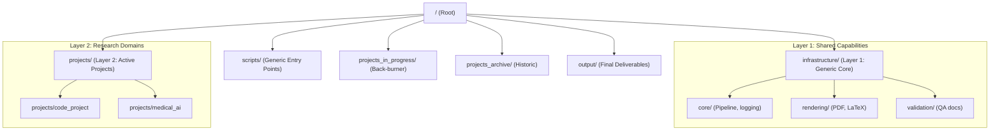
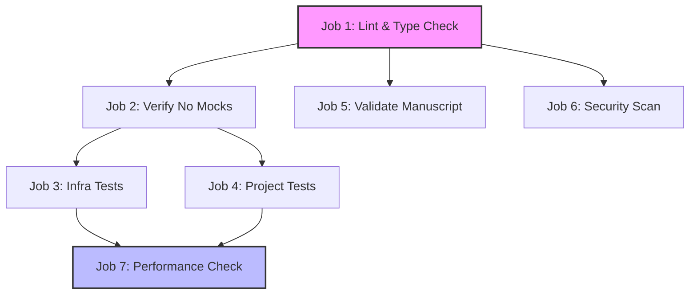
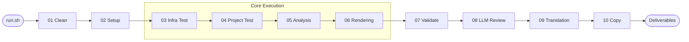

<div align="center">

# 🔬 Research Project Template

**Production-grade scaffold for reproducible academic research**

[](https://github.com/docxology/template/actions/workflows/ci.yml)
[](https://www.python.org/)
[](https://docs.astral.sh/uv/)
[](https://docs.astral.sh/ruff/)
[](../LICENSE)
[](../pyproject.toml)

[**⚡ Quick Start**](#quick-start) · [**📐 Architecture**](#architecture) · [**🔄 CI/CD Pipeline**](#cicd-pipeline) · [**📋 Templates**](#issue--pr-templates) · [**🔧 Configuration**](#configuration)

</div>

---

## ⚡ Quick Start

```bash
# 1. Clone / use template
gh repo create my-research --template docxology/template --private
cd my-research

# 2. Install dependencies (uv required)
uv sync

# 3. Run the full 10-stage pipeline
./run.sh --pipeline

# 4. Outputs land in output/{project-name}/
```

> **Don't have `uv`?** Install it: `curl -Ls https://astral.sh/uv/install.sh | sh`

---

## 📐 Architecture

The repository follows a **Two-Layer Architecture** designed for modularity and project isolation.


```mermaid
graph TD
    Root["/ (Root)"] --> Infra["infrastructure/ (Layer 1: Generic Core)"]
    Root --> Scripts["scripts/ (Generic Entry Points)"]
    Root --> Projects["projects/ (Layer 2: Active Projects)"]
    Root --> ProjectsIP["projects_in_progress/ (Back-burner)"]
    Root --> ProjectsArch["projects_archive/ (Historic)"]
    Root --> Output["output/ (Final Deliverables)"]

    subgraph "Layer 1: Shared Capabilities"
        Infra --> Core["core/ (Pipeline, logging)"]
        Infra --> Render["rendering/ (PDF, LaTeX)"]
        Infra --> Valid["validation/ (QA docs)"]
    end

    subgraph "Layer 2: Research Domains"
        Projects --> P1["projects/code_project"]
        Projects --> P2["projects/medical_ai"]
    end
```

### Directory Roles

| Path | Persistence | Purpose |
| --- | --- | --- |
| `infrastructure/` | Permanent | Reusable core logic (Layer 1) |
| `projects/` | Permanent | **Active** research projects; rendered by pipeline |
| `projects_in_progress/` | Transient | Staging area for drafting new projects |
| `projects_archive/` | Permanent | Preserved historical work (not executed) |
| `scripts/` | Permanent | Generic orchestrators for the pipeline |
| `output/` | Disposable | Final artifacts (PDFs, dashboards) |

**Key pattern:** business logic lives in `projects/{name}/src/` — scripts are **thin orchestrators** that import and call it. Violating this breaks the architecture.

---

## 🔄 CI/CD Pipeline

### Workflows

| Workflow | Trigger | Purpose |
|---|---|---|
| [`ci.yml`](workflows/ci.yml) | push · PR · weekly · manual | Full 7-job quality gate |
| [`stale.yml`](workflows/stale.yml) | Daily 01:00 UTC | Close inactive issues/PRs |
| [`release.yml`](workflows/release.yml) | `v*.*.*` tag · manual | GitHub Release with changelog |

### CI Job Flow

The GitHub Actions workflow implements a strictly-gated 7-job pipeline.


```mermaid
graph TD
    L[Job 1: Lint & Type Check] --> VNM[Job 2: Verify No Mocks]
    VNM --> TI[Job 3: Infra Tests]
    VNM --> TP[Job 4: Project Tests]
    L --> VM[Job 5: Validate Manuscript]
    L --> SS[Job 6: Security Scan]
    TI --> PC[Job 7: Performance Check]
    TP --> PC
    
    style L fill:#f9f,stroke:#333,stroke-width:2px
    style PC fill:#bbf,stroke:#333,stroke-width:2px
```

### Quality Gates

| Gate | Tool | Threshold |
| --- | --- | --- |
| Code style | Ruff | zero violations |
| Formatting | Ruff | zero diffs |
| Type safety | mypy | no errors |
| No mocks | `verify_no_mocks.py` | zero mock usage |
| Infra coverage | pytest-cov | **≥ 60%** |
| Project coverage | pytest-cov | **≥ 90%** |
| Security | Bandit MEDIUM+ | zero findings |
| Performance | import timer | **≤ 5 s** |

### Simulate CI Locally

```bash
# Lint
uv run ruff check infrastructure/ projects/*/src/ && uv run ruff format --check infrastructure/ projects/*/src/

# Run tests locally (mirror CI)
uv run pytest tests/infra_tests/ --cov=infrastructure --cov-fail-under=60 -m "not requires_ollama"
uv run pytest projects/*/tests/ --cov-fail-under=90 -m "not requires_ollama"

# Security
uv run pip-audit && uv run bandit -r -ll infrastructure/ scripts/ projects/ --exclude projects_archive,projects_in_progress
```

---

## 🚀 Pipeline Lifecycle

The master orchestration script (`run.sh`) executes a 10-stage pipeline to ensure research integrity from environment setup to final delivery.


```mermaid
flowchart LR
    Start([run.sh]) --> S1[01 Clean]
    S1 --> S2[02 Setup]
    S2 --> S3[03 Infra Test]
    S3 --> S4[04 Project Test]
    S4 --> S5[05 Analysis]
    S5 --> S6[06 Rendering]
    S6 --> S7[07 Validate]
    S7 --> S8[08 LLM Review]
    S8 --> S9[09 Translation]
    S9 --> S10[10 Copy]
    S10 --> End([Deliverables])

    subgraph "Core Execution"
        S3
        S4
        S5
        S6
    end
```

---

## 📂 Project Lifecycle

Projects transition through three distinct directory states to maintain focus and historical auditability.

```mermaid
stateDiagram-v2
    [*] --> InProgress: Draft Scaffolding
    InProgress --> Active: Promotion (src/ + tests/)
    Active --> Archive: Completion / Retirement
    Archive --> Active: Reactivation
    
    state InProgress {
        direction LR
        Drafting --> Validation
    }
    
    state Active {
        direction LR
        Execute --> Validate --> Build
    }
```

## 📦 Dependency Management

[`dependabot.yml`](dependabot.yml) — weekly automated PRs for both ecosystems:

| Ecosystem | Group | Max open PRs |
| --- | --- | --- |
| GitHub Actions | all minor/patch batched | 5 |
| Python (pip/uv) | `dev-tools` (pytest, mypy, ruff…) | 5 |
| Python (pip/uv) | `scientific-core` (numpy, scipy…) | 5 |

Labels added automatically: `dependencies` · `automated` · ecosystem tag.

---

## 📋 Issue & PR Templates

### Issues → [New Issue](https://github.com/docxology/template/issues/new/choose)

| Template | Labels | Best for |
| --- | --- | --- |
| [🐛 Bug Report](ISSUE_TEMPLATE/bug_report.md) | `bug` · `needs-triage` | Reproducible errors with log output and pipeline stage |
| [✨ Feature Request](ISSUE_TEMPLATE/feature_request.md) | `enhancement` · `needs-triage` | New capabilities with priority and alternatives |
| [📝 Documentation](ISSUE_TEMPLATE/documentation.md) | `documentation` · `needs-triage` | Incorrect, missing, or outdated docs with file paths |

> 💬 **Questions?** Use [GitHub Discussions](https://github.com/docxology/template/discussions) — blank issues are disabled.

### Pull Requests → [PR Template](PULL_REQUEST_TEMPLATE.md)

The PR template enforces:

- ✅ Linked issue(s)
- ✅ Type-of-change classification
- ✅ Pipeline stage(s) affected
- ✅ Test evidence (local run confirmation)
- ✅ **No-mocks policy confirmation** (zero `MagicMock`/`mocker.patch`)
- ✅ Thin Orchestrator pattern compliance

---

## 🔧 Configuration

### Branch Protection (Recommended)

Set in **Settings → Branches → main**:

```
Required status checks:
  Lint & Type Check
  Infra Tests (ubuntu-latest, Python 3.10)
  Infra Tests (ubuntu-latest, Python 3.11)
  Infra Tests (ubuntu-latest, Python 3.12)
  Project Tests (ubuntu-latest, Python 3.10)
  Project Tests (ubuntu-latest, Python 3.11)
  Project Tests (ubuntu-latest, Python 3.12)
  Validate Manuscripts
  Security Scan
  Performance Check

Require PR review before merging: 1 approver
```

### Secrets Needed

| Secret | Required for |
|---|---|
| `CODECOV_TOKEN` | Coverage upload to Codecov (optional but recommended) |

---

## 🔍 Troubleshooting

```bash
# Workflow status
gh workflow list
gh run list --workflow=CI --limit=5

# View failure logs
gh run view <run-id> --log-failed

# Re-run failed jobs only
gh run rerun <run-id> --failed

# Fix linting locally
uvx ruff check infrastructure/ projects/*/src/ --fix
uvx ruff format infrastructure/ projects/*/src/
```

---

## 📂 Navigation

| Directory | Purpose |
|---|---|
| [`workflows/`](workflows/) | CI/CD workflow YAML files |
| [`ISSUE_TEMPLATE/`](ISSUE_TEMPLATE/) | Structured issue templates |
| [`PULL_REQUEST_TEMPLATE.md`](PULL_REQUEST_TEMPLATE.md) | PR checklist |
| [`dependabot.yml`](dependabot.yml) | Automated dependency updates |
| [`AGENTS.md`](AGENTS.md) | Deep technical CI/CD documentation |
| [`workflows/AGENTS.md`](workflows/AGENTS.md) | Per-workflow technical docs |

---

<div align="center">

**[📖 Root AGENTS.md](../AGENTS.md)** · **[🚀 How To Use](../docs/core/how-to-use.md)** · **[🏗️ Architecture](../docs/core/architecture.md)** · **[🐛 Issues](https://github.com/docxology/template/issues)** · **[💬 Discussions](https://github.com/docxology/template/discussions)**

</div>
