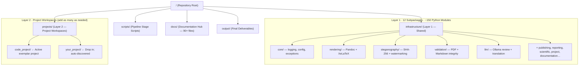
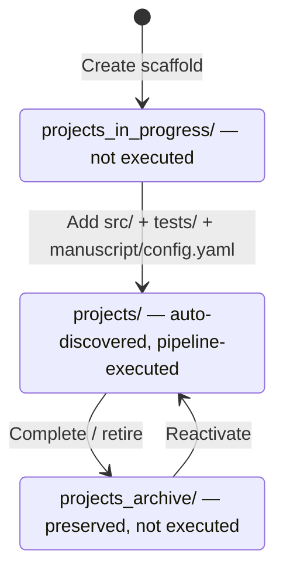
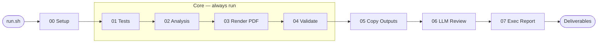
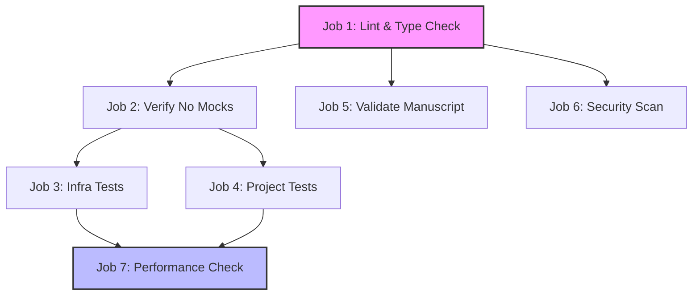

<div align="center">

# 🔬 Docxology Template

**Production-grade scaffold for reproducible computational research**
Pipelines · Manuscripts · Cryptographic Provenance · AI-Agent Collaboration

[](https://github.com/docxology/template/actions/workflows/ci.yml)
[](https://www.python.org/)
[](https://docs.astral.sh/uv/)
[](https://docs.astral.sh/ruff/)
[](../LICENSE)
[](../pyproject.toml)

[**⚡ Quick Start**](#quick-start) · [**📐 Architecture**](#architecture) · [**🔄 Pipeline**](#pipeline) · [**🤖 AI Collaboration**](#ai-collaboration) · [**🔒 Provenance**](#security--provenance) · [**📚 Docs**](#documentation-hub)

</div>

---

## What Is This?

The **Docxology Template** solves the structural root of research irreproducibility: fragmentation between code, tests, manuscripts, and provenance. Instead of patching tools together, it enforces integrity at the architectural level.

| You get | How |
|---------|-----|
| **Reproducible builds** | 8-stage pipeline from env setup → PDF → hashed artifact |
| **Real test enforcement** | Zero-Mock policy · ≥90% project coverage · ≥60% infra coverage |
| **Cryptographic provenance** | SHA-256/512 hashing + steganographic watermarking on every PDF |
| **Horizontal scaling** | N independent projects share one infrastructure layer — no coupling |
| **AI-agent-ready codebase** | `AGENTS.md` + `README.md` at every single directory level |
| **Interactive orchestration** | `run.sh` TUI menu for humans · `--pipeline` flag for CI |

---

## ⚡ Quick Start

```bash
# 1. Create your research repo from this template
gh repo create my-research --template docxology/template --private
cd my-research

# 2. Install dependencies
uv sync

# 3. Run the interactive pipeline menu
./run.sh

# 4. Or run non-interactively against the exemplar project
./run.sh --pipeline --project code_project

# Outputs → output/code_project/
```

> **Don't have `uv`?** → `curl -Ls https://astral.sh/uv/install.sh | sh`

See the full walkthrough in [**docs/RUN_GUIDE.md**](../docs/RUN_GUIDE.md) and [**docs/guides/getting-started.md**](../docs/guides/getting-started.md).

---

## 📐 Architecture

The repository is organized into two strictly separated layers — shared infrastructure that never changes per-project, and self-contained project workspaces that know nothing about each other.


```mermaid
graph TD
    Root["/ (Repository Root)"] --> Infra["infrastructure/ (Layer 1 — Shared)"]
    Root --> Scripts["scripts/ (Pipeline Stage Scripts)"]
    Root --> Projects["projects/ (Layer 2 — Project Workspaces)"]
    Root --> Docs["docs/ (Documentation Hub — 90+ files)"]
    Root --> Output["output/ (Final Deliverables)"]

    subgraph "Layer 1 · 12 Subpackages · ~150 Python Modules"
        Infra --> Core["core/ — logging, config, exceptions"]
        Infra --> Rendering["rendering/ — Pandoc + XeLaTeX"]
        Infra --> Stego["steganography/ — SHA-256 + watermarking"]
        Infra --> Valid["validation/ — PDF + Markdown integrity"]
        Infra --> LLM["llm/ — Ollama review + translation"]
        Infra --> More["+ publishing, reporting, scientific, project, documentation…"]
    end

    subgraph "Layer 2 · Project Workspaces (add as many as needed)"
        Projects --> CP["code_project/ ← Active exemplar project"]
        Projects --> Dots["your_project/ ← Drop in; auto-discovered"]
    end
```

### Directory Reference

| Path | Persistence | Purpose |
|------|:-----------:|---------|
| `infrastructure/` | Permanent | 12 reusable subpackages — Layer 1 core |
| `projects/` | Permanent | **Active** projects — discovered and executed by pipeline |
| `projects_in_progress/` | Transient | Staging area: scaffold here before promoting |
| `projects_archive/` | Permanent | Completed/retired work — preserved, not executed |
| `scripts/` | Permanent | 8 generic pipeline stage scripts (Stages 00–07) |
| `output/` | Disposable | Final PDFs, dashboards, reports |
| `docs/` | Permanent | 90+ documentation files across 13 subdirectories |

> **Key invariant:** All domain logic lives in `projects/{name}/src/`. Scripts are **thin orchestrators** — they import and call, never implement. See [docs/architecture/thin-orchestrator-summary.md](../docs/architecture/thin-orchestrator-summary.md).

---

## 📁 Active Exemplar Project: `code_project`

> **`projects/code_project/`** is the canonical example of a complete, working project in this template. Use it as the reference when building your own.

It demonstrates:

| Feature | Implementation |
|---------|---------------|
| Gradient descent optimization | `src/code_project/optimizer.py` |
| Scientific benchmarking | uses `infrastructure.scientific` |
| 39 tests, 100% coverage | `tests/` — Zero-Mock, real operations only |
| 6 publication-quality figures | generated in `scripts/`, registered via `FigureManager` |
| Full pipeline output | PDF rendered, validated, steganographically signed |
| Complete documentation | `AGENTS.md` + `README.md` throughout |

```text
projects/code_project/
├── src/code_project/      # All domain logic (optimizer, analysis)
├── tests/                 # 39 real tests — no mocks
├── scripts/               # Thin orchestrators calling src/
├── manuscript/            # Markdown chapters + config.yaml
├── output/                # Pipeline artifacts (generated)
└── AGENTS.md              # AI-agent context for this project
```

To add your own project, follow [docs/guides/new-project-setup.md](../docs/guides/new-project-setup.md).

### Project Lifecycle


```mermaid
stateDiagram-v2
    [*] --> InProgress: Create scaffold
    InProgress --> Active: Add src/ + tests/ + manuscript/config.yaml
    Active --> Archive: Complete / retire
    Archive --> Active: Reactivate

    InProgress : projects_in_progress/ — not executed
    Active : projects/ — auto-discovered, pipeline-executed
    Archive : projects_archive/ — preserved, not executed
```

---

## 🔄 Pipeline

`run.sh` executes an **8-stage pipeline** (Scripts 00–07). `secure_run.sh` appends steganographic post-processing.


```mermaid
flowchart LR
    Start([run.sh]) --> S0[00 Setup]
    S0 --> S1[01 Tests]
    S1 --> S2[02 Analysis]
    S2 --> S3[03 Render PDF]
    S3 --> S4[04 Validate]
    S4 --> S5[05 Copy Outputs]
    S5 --> S6[06 LLM Review]
    S6 --> S7[07 Exec Report]
    S7 --> End([Deliverables])

    subgraph "Core — always run"
        S1
        S2
        S3
        S4
    end
```

| Stage | Script | Failure Mode |
|-------|--------|:------------:|
| **00** Setup | `00_setup_environment.py` | Hard fail |
| **01** Tests | `01_run_tests.py` | Configurable tolerance |
| **02** Analysis | `02_run_analysis.py` | Hard fail |
| **03** Render PDF | `03_render_pdf.py` | Hard fail |
| **04** Validate | `04_validate_output.py` | Warning + report |
| **05** Copy | `05_copy_outputs.py` | Soft fail |
| **06** LLM Review | `06_llm_review.py` | Skippable (requires Ollama) |
| **07** Exec Report | `07_generate_executive_report.py` | Soft fail |

Full stage details: [docs/core/workflow.md](../docs/core/workflow.md) · [docs/core/how-to-use.md](../docs/core/how-to-use.md).

---

## 🤖 AI Collaboration

Every directory at every level contains **two documentation files**:

- **`README.md`** — Human-readable overview and quick-start
- **`AGENTS.md`** — Machine-readable spec for AI coding assistants: API tables, dependency graphs, architectural constraints, naming conventions

```
CLAUDE.md (root)          ← Global constraints: Zero-Mock, Thin Orchestrator, naming
  └── AGENTS.md (per dir) ← Local API surfaces, file inventories, integration patterns
        └── README.md     ← Human navigation and quick-start
```

AI agents can navigate, modify, and extend the codebase with full architectural awareness without hallucinating APIs or violating architectural invariants. See [docs/rules/](../docs/rules/) for the complete set of standards.

---

## 🔒 Security & Provenance

Every rendered PDF is automatically processed by the steganographic pipeline via `secure_run.sh`:

| Layer | Mechanism | Survives |
|-------|-----------|---------|
| **PDF Metadata** | XMP + Info dictionary (author, DOI, ORCID, build timestamp) | All viewers |
| **Hash manifest** | SHA-256 + SHA-512 in `*.hashes.json` | External verification |
| **Alpha overlay** | Low-opacity text per page (build time + commit hash) | Standard PDF operations, printing |
| **QR code** | Repository URL injected on final page | Redistribution |

Full specification: [docs/security/steganography.md](../docs/security/steganography.md) · [docs/security/hashing_and_manifests.md](../docs/security/hashing_and_manifests.md) · [docs/security/secure_execution.md](../docs/security/secure_execution.md).

---

## 🧪 Testing Standards

| Standard | Requirement |
|----------|-------------|
| **Zero-Mock policy** | No `MagicMock`, `mocker.patch`, or `unittest.mock` anywhere |
| **Real operations** | Tests use real filesystem, subprocess, and HTTP calls |
| **Infrastructure coverage** | ≥ 60% (currently achieving 83%+) |
| **Project coverage** | ≥ 90% (currently achieving 100% in `code_project`) |
| **Optional service skipping** | `@pytest.mark.requires_ollama` for graceful degradation |

```bash
# Mirror CI locally
uv run pytest tests/infra_tests/ --cov=infrastructure --cov-fail-under=60 -m "not requires_ollama"
uv run pytest projects/code_project/tests/ --cov-fail-under=90 -m "not requires_ollama"
python .github/verify_no_mocks.py
```

See [docs/development/testing/](../docs/development/testing/) and [docs/guides/testing-and-reproducibility.md](../docs/guides/testing-and-reproducibility.md).

---

## 📚 Documentation Hub

The `docs/` directory contains **90+ files** across **13 subdirectories**. Every subdirectory has its own `README.md` and `AGENTS.md`. Start at [**docs/README.md**](../docs/README.md) or [**docs/documentation-index.md**](../docs/documentation-index.md).

### 📂 Core (`docs/core/`)

Essential start-here docs — read these first.

| File | Purpose |
|------|---------|
| [how-to-use.md](../docs/core/how-to-use.md) | Step-by-step usage guide for the full system |
| [workflow.md](../docs/core/workflow.md) | Pipeline workflow: stages, flags, modes |
| [architecture.md](../docs/core/architecture.md) | Two-Layer Architecture overview |

### 🏗️ Architecture (`docs/architecture/`)

Design decisions, patterns, and migration guides.

| File | Purpose |
|------|---------|
| [two-layer-architecture.md](../docs/architecture/two-layer-architecture.md) | Deep dive into the Layer 1 / Layer 2 separation |
| [thin-orchestrator-summary.md](../docs/architecture/thin-orchestrator-summary.md) | The Thin Orchestrator pattern — why and how |
| [testing-strategy.md](../docs/architecture/testing-strategy.md) | Testing architecture and Zero-Mock rationale |
| [decision-tree.md](../docs/architecture/decision-tree.md) | Where does new code go? Decision guide |
| [migration-from-flat.md](../docs/architecture/migration-from-flat.md) | Migrating a flat repo to the Two-Layer model |

### 📖 Guides (`docs/guides/`)

Progressive tutorials from first project to advanced automation.

| File | Purpose |
|------|---------|
| [getting-started.md](../docs/guides/getting-started.md) | First-time setup and first pipeline run |
| [new-project-setup.md](../docs/guides/new-project-setup.md) | Full checklist for adding a new project |
| [figures-and-analysis.md](../docs/guides/figures-and-analysis.md) | Generating, registering, and embedding figures |
| [testing-and-reproducibility.md](../docs/guides/testing-and-reproducibility.md) | Writing real tests, coverage, markers |
| [extending-and-automation.md](../docs/guides/extending-and-automation.md) | Customizing the pipeline, adding CI stages |

### 📏 Rules (`docs/rules/`)

Authoritative standards enforced across the codebase.

| File | Purpose |
|------|---------|
| [testing_standards.md](../docs/rules/testing_standards.md) | Zero-Mock policy, coverage thresholds, markers |
| [code_style.md](../docs/rules/code_style.md) | Ruff config, formatting, naming conventions |
| [documentation_standards.md](../docs/rules/documentation_standards.md) | AGENTS.md / README.md duality requirements |
| [manuscript_style.md](../docs/rules/manuscript_style.md) | Chapter structure, figure captions, citations |
| [api_design.md](../docs/rules/api_design.md) | Module API conventions, dataclass patterns |
| [error_handling.md](../docs/rules/error_handling.md) | Exception hierarchy, pipeline flow control |
| [security.md](../docs/rules/security.md) | Dependency pinning, secrets management |
| [llm_standards.md](../docs/rules/llm_standards.md) | Ollama integration, prompt templates, markers |
| [python_logging.md](../docs/rules/python_logging.md) | Structured logging via `get_logger` |
| [type_hints_standards.md](../docs/rules/type_hints_standards.md) | mypy-compatible type annotation requirements |
| [infrastructure_modules.md](../docs/rules/infrastructure_modules.md) | Module API contracts and extension patterns |
| [git_workflow.md](../docs/rules/git_workflow.md) | Branch strategy, commit conventions, PRs |
| [folder_structure.md](../docs/rules/folder_structure.md) | Directory layout invariants |

### 🔧 Operational (`docs/operational/`)

Build, config, logging, and troubleshooting.

| Directory / File | Purpose |
|-----------------|---------|
| [build/](../docs/operational/build/) | Build system internals and stage details |
| [config/](../docs/operational/config/) | `config.yaml` reference, environment variables |
| [logging/](../docs/operational/logging/) | Logging configuration, log levels, rotation |
| [troubleshooting/](../docs/operational/troubleshooting/) | Common errors, rendering issues, coverage gaps |
| [error-handling-guide.md](../docs/operational/error-handling-guide.md) | Pipeline error handling patterns |
| [reporting-guide.md](../docs/operational/reporting-guide.md) | Executive reports, coverage JSON, dashboards |

### 📦 Modules (`docs/modules/`)

Infrastructure subpackage documentation.

| File | Purpose |
|------|---------|
| [modules-guide.md](../docs/modules/modules-guide.md) | Overview of all 12 infrastructure subpackages |
| [pdf-validation.md](../docs/modules/pdf-validation.md) | `infrastructure.validation` — PDF integrity checking |
| [scientific-simulation-guide.md](../docs/modules/scientific-simulation-guide.md) | `infrastructure.scientific` — stability, benchmarking |
| [guides/](../docs/modules/guides/) | Per-module usage guides |

### 📝 Usage (`docs/usage/`)

Manuscript authoring, style, and content guides.

| File | Purpose |
|------|---------|
| [markdown-template-guide.md](../docs/usage/markdown-template-guide.md) | Chapter structure, frontmatter, Pandoc quirks |
| [style-guide.md](../docs/usage/style-guide.md) | Voice, tense, academic writing conventions |
| [manuscript-numbering-system.md](../docs/usage/manuscript-numbering-system.md) | Section/figure/table numbering |
| [visualization-guide.md](../docs/usage/visualization-guide.md) | Figure accessibility standards (16pt floor, colorblind palettes) |
| [image-management.md](../docs/usage/image-management.md) | Figure registration, paths, captions |
| [examples.md](../docs/usage/examples.md) | Worked example manuscript snippets |
| [examples-showcase.md](../docs/usage/examples-showcase.md) | Gallery of generated figures from exemplar projects |

### 📐 Best Practices (`docs/best-practices/`)

Project hygiene, version control, and multi-project management.

| File | Purpose |
|------|---------|
| [best-practices.md](../docs/best-practices/best-practices.md) | Consolidated best practices across all concerns |
| [multi-project-management.md](../docs/best-practices/multi-project-management.md) | Managing N projects, discovery rules, isolation |
| [version-control.md](../docs/best-practices/version-control.md) | Git workflow, tagging, output tracking |
| [migration-guide.md](../docs/best-practices/migration-guide.md) | Upgrading the template across major versions |
| [backup-recovery.md](../docs/best-practices/backup-recovery.md) | Output preservation, disaster recovery |

### 🛠️ Development (`docs/development/`)

Contributing, testing internals, roadmap.

| File | Purpose |
|------|---------|
| [contributing.md](../docs/development/contributing.md) | How to contribute — branch, test, PR |
| [testing/](../docs/development/testing/) | Test writing guide, coverage analysis, patterns |
| [coverage-gaps.md](../docs/development/coverage-gaps.md) | Known low-coverage modules and improvement plans |
| [roadmap.md](../docs/development/roadmap.md) | Feature roadmap and planned improvements |
| [security.md](../docs/development/security.md) | Security disclosure policy |
| [code-of-conduct.md](../docs/development/code-of-conduct.md) | Community standards |

### 🤖 Prompts (`docs/prompts/`)

Reusable AI agent prompt templates for common tasks.

| File | Purpose |
|------|---------|
| [infrastructure_module.md](../docs/prompts/infrastructure_module.md) | Creating a new infrastructure subpackage |
| [feature_addition.md](../docs/prompts/feature_addition.md) | Adding a feature to an existing module |
| [test_creation.md](../docs/prompts/test_creation.md) | Writing Zero-Mock tests |
| [manuscript_creation.md](../docs/prompts/manuscript_creation.md) | Authoring a new manuscript chapter |
| [refactoring.md](../docs/prompts/refactoring.md) | Safe refactoring with test preservation |
| [validation_quality.md](../docs/prompts/validation_quality.md) | Adding validation and quality gates |
| [documentation_creation.md](../docs/prompts/documentation_creation.md) | Writing AGENTS.md / README.md |
| [code_development.md](../docs/prompts/code_development.md) | General code development patterns |
| [comprehensive_assessment.md](../docs/prompts/comprehensive_assessment.md) | Full pipeline + codebase audit |

### 📖 Reference (`docs/reference/`)

API reference, glossary, cheatsheets, and FAQ.

| File | Purpose |
|------|---------|
| [api-reference.md](../docs/reference/api-reference.md) | Full public API for all 12 infrastructure subpackages |
| [api-project-modules.md](../docs/reference/api-project-modules.md) | Project-level module patterns and conventions |
| [glossary.md](../docs/reference/glossary.md) | Definitions for all template-specific terms |
| [faq.md](../docs/reference/faq.md) | Frequently asked questions |
| [quick-start-cheatsheet.md](../docs/reference/quick-start-cheatsheet.md) | One-page command reference |
| [common-workflows.md](../docs/reference/common-workflows.md) | Recipes for common research tasks |
| [copypasta.md](../docs/reference/copypasta.md) | Copy-paste code snippets for common patterns |

### 🔒 Security (`docs/security/`)

Steganography, hashing, and secure execution.

| File | Purpose |
|------|---------|
| [steganography.md](../docs/security/steganography.md) | Watermarking layers, alpha overlay, QR injection |
| [hashing_and_manifests.md](../docs/security/hashing_and_manifests.md) | SHA-256/512 hash manifests and tamper detection |
| [secure_execution.md](../docs/security/secure_execution.md) | `secure_run.sh`, steganography config, output files |

### 🔍 Audit (`docs/audit/`)

Documentation review reports and filepath audits.

| File | Purpose |
|------|---------|
| [documentation-review-report.md](../docs/audit/documentation-review-report.md) | Comprehensive documentation audit results |
| [filepath-audit-report.md](../docs/audit/filepath-audit-report.md) | File path accuracy and broken link report |

### 🚀 Top-Level Docs

| File | Purpose |
|------|---------|
| [docs/README.md](../docs/README.md) | Documentation hub index and navigation |
| [docs/documentation-index.md](../docs/documentation-index.md) | Full inventory of all 90+ documentation files |
| [docs/RUN_GUIDE.md](../docs/RUN_GUIDE.md) | Complete run guide: modes, flags, troubleshooting |
| [docs/CLOUD_DEPLOY.md](../docs/CLOUD_DEPLOY.md) | Cloud deployment guide (AWS, GCP, Azure, Docker) |
| [docs/PAI.md](../docs/PAI.md) | Personal AI Infrastructure integration guide |

---

## 🔧 CI/CD

### Workflows

| Workflow | Trigger | Purpose |
|----------|---------|---------|
| [`ci.yml`](workflows/ci.yml) | push · PR · weekly · manual | Full 7-job quality gate |
| [`stale.yml`](workflows/stale.yml) | Daily 01:00 UTC | Close inactive issues/PRs |
| [`release.yml`](workflows/release.yml) | `v*.*.*` tag · manual | GitHub Release with changelog |

### CI Job Flow


```mermaid
graph TD
    L[Job 1: Lint & Type Check] --> VNM[Job 2: Verify No Mocks]
    VNM --> TI[Job 3: Infra Tests]
    VNM --> TP[Job 4: Project Tests]
    L --> VM[Job 5: Validate Manuscript]
    L --> SS[Job 6: Security Scan]
    TI --> PC[Job 7: Performance Check]
    TP --> PC

    style L fill:#f9f,stroke:#333,stroke-width:2px
    style PC fill:#bbf,stroke:#333,stroke-width:2px
```

### Quality Gates

| Gate | Tool | Threshold |
|------|------|:---------:|
| Code style | Ruff | zero violations |
| Formatting | Ruff | zero diffs |
| Type safety | mypy | no errors |
| No mocks | `verify_no_mocks.py` | zero mock usage |
| Infra coverage | pytest-cov | **≥ 60%** |
| Project coverage | pytest-cov | **≥ 90%** |
| Security | Bandit MEDIUM+ | zero findings |
| Performance | import timer | **≤ 5 s** |

### Simulate CI Locally

```bash
# Lint + format check
uv run ruff check infrastructure/ projects/*/src/
uv run ruff format --check infrastructure/ projects/*/src/

# Tests (skip Ollama-requiring tests)
uv run pytest tests/infra_tests/ --cov=infrastructure --cov-fail-under=60 -m "not requires_ollama"
uv run pytest projects/code_project/tests/ --cov-fail-under=90 -m "not requires_ollama"

# Security
uv run pip-audit
uv run bandit -r -ll infrastructure/ scripts/ projects/ \
  --exclude projects_archive,projects_in_progress
```

### Branch Protection

Set in **Settings → Branches → main**:

```text
Required status checks:
  Lint & Type Check
  Infra Tests (ubuntu-latest, Python 3.10/3.11/3.12)
  Project Tests (ubuntu-latest, Python 3.10/3.11/3.12)
  Validate Manuscripts · Security Scan · Performance Check

Require PR review before merging: 1 approver
```

| Secret | Required for |
|--------|-------------|
| `CODECOV_TOKEN` | Coverage upload to Codecov (optional) |

---

## 📋 Issue & PR Templates

### Issues → [New Issue](https://github.com/docxology/template/issues/new/choose)

| Template | Labels | Best for |
|----------|--------|----------|
| [🐛 Bug Report](ISSUE_TEMPLATE/bug_report.md) | `bug` · `needs-triage` | Reproducible errors with log output and pipeline stage |
| [✨ Feature Request](ISSUE_TEMPLATE/feature_request.md) | `enhancement` · `needs-triage` | New capabilities with priority and alternatives |
| [📝 Documentation](ISSUE_TEMPLATE/documentation.md) | `documentation` · `needs-triage` | Incorrect, missing, or outdated docs with file paths |

> 💬 **Questions?** Use [GitHub Discussions](https://github.com/docxology/template/discussions) — blank issues are disabled.

### PR Checklist → [PULL_REQUEST_TEMPLATE.md](PULL_REQUEST_TEMPLATE.md)

- ✅ Linked issue · type-of-change label · pipeline stage(s) affected
- ✅ Test evidence — local run confirmation with pass rates
- ✅ **Zero-Mock confirmation** — no `MagicMock` / `mocker.patch`
- ✅ Thin Orchestrator compliance — no logic in scripts

---

## 📦 Dependency Management

[`dependabot.yml`](dependabot.yml) — weekly automated PRs:

| Ecosystem | Group | Max PRs |
|-----------|-------|:-------:|
| GitHub Actions | all minor/patch batched | 5 |
| Python (uv) | `dev-tools` (pytest, mypy, ruff…) | 5 |
| Python (uv) | `scientific-core` (numpy, scipy…) | 5 |

---

## 🔍 Troubleshooting

```bash
# CI status
gh run list --workflow=CI --limit=5
gh run view <run-id> --log-failed
gh run rerun <run-id> --failed

# Fix lint locally
uvx ruff check infrastructure/ projects/*/src/ --fix
uvx ruff format infrastructure/ projects/*/src/
```

Common issues: [docs/operational/troubleshooting/](../docs/operational/troubleshooting/) · [docs/reference/faq.md](../docs/reference/faq.md).

---

<div align="center">

**[📖 AGENTS.md](../AGENTS.md)** · **[🚀 Run Guide](../docs/RUN_GUIDE.md)** · **[📐 Architecture](../docs/architecture/two-layer-architecture.md)** · **[📋 Rules](../docs/rules/)** · **[🐛 Issues](https://github.com/docxology/template/issues)** · **[💬 Discussions](https://github.com/docxology/template/discussions)**

*Reproducibility as architecture, not afterthought.*

</div>
