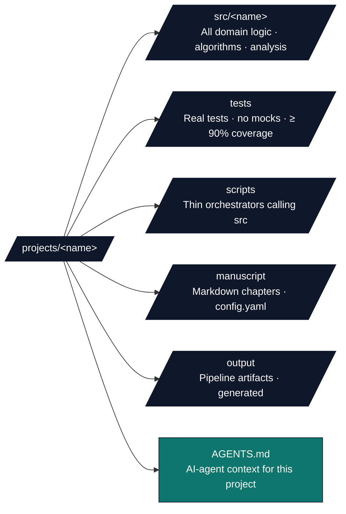
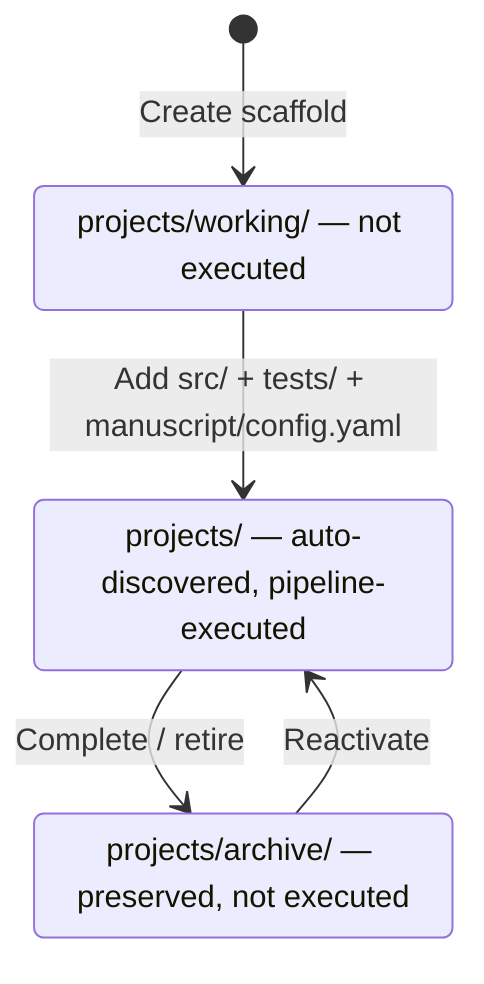
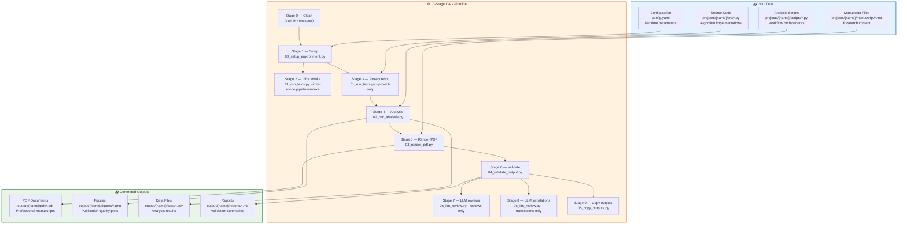
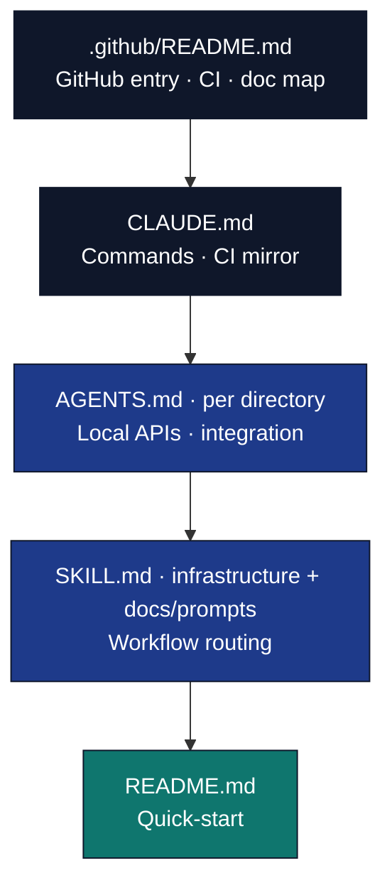
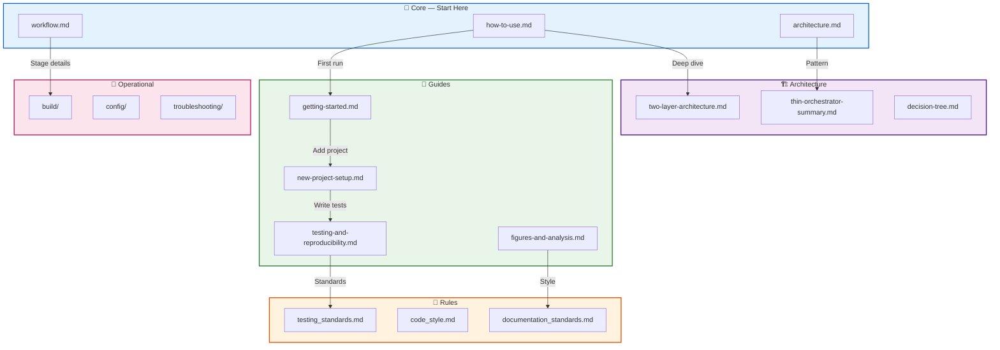
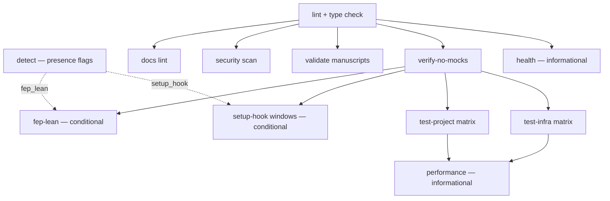

<!-- markdownlint-disable MD013 MD033 MD041 MD051 MD060 -->
<div align="center">

# 🔬 Research Project Template

**Production-grade scaffold for reproducible computational research**
Pipelines · Manuscripts · Cryptographic Provenance · AI-Agent Collaboration

[](https://github.com/docxology/template/actions/workflows/ci.yml)
[](https://www.python.org/)
[](https://docs.astral.sh/uv/)
[](https://docs.astral.sh/ruff/)
[](../LICENSE)
[](../pyproject.toml)
[](https://doi.org/10.5281/zenodo.19139090)

> **📄 Published**: [*A template/ approach to Reproducible Generative Research: Architecture and Ergonomics from Configuration through Publication*](https://zenodo.org/records/19139090) — DOI: [10.5281/zenodo.19139090](https://doi.org/10.5281/zenodo.19139090)

[**🧭 Choose path**](#choose-your-path) · [**🤖 Agents**](#agent--automation-entry-point) · [**⚡ Quick Start**](#quick-start) · [**📐 Architecture**](#architecture) · [**🔄 Pipeline**](#pipeline) · [**🔒 Provenance**](#security--provenance) · [**📚 Docs**](#documentation-hub) · [**🔧 CI/CD**](#cicd)

</div>

---

## Table of contents

| Section | Audience |
| --- | --- |
| [About this document](#about-this-document) | Everyone — scope of this README vs root [`README.md`](../README.md) |
| [Choose your path](#choose-your-path) | Humans — goal-based deep links |
| [Agent & automation entry point](#agent--automation-entry-point) | Cursor, Claude Code, Codex, CI bots — read order, skills, commands |
| [Quick Start](#quick-start) | First clone → first pipeline run |
| [Architecture](#architecture) | Two-layer layout, directories, lifecycle |
| [Active projects](#active-projects) | Exemplars and rotating roster |
| [Pipeline](#pipeline) | Stage DAG, scripts, flags |
| [AI collaboration](#ai-collaboration) | `AGENTS.md` / `SKILL.md` conventions |
| [Security & provenance](#security--provenance) | Steganography, hashing, `secure_run.sh` |
| [Testing standards](#testing-standards) | No-mocks policy, coverage floors |
| [Documentation hub](#documentation-hub) | Full `docs/` map with deep links |
| [CI/CD](#cicd) | Workflows, jobs, local parity, branch protection |
| [Issue & PR templates](#issue--pr-templates) | Contributing on GitHub |
| [Troubleshooting](#troubleshooting) | `gh` CLI, common fixes |

---

## About this document

This file lives under [`.github/`](.) but serves as the **primary GitHub-rendered entry point** for the repository: badges, architecture diagrams, pipeline reference, documentation map, and CI inventory — optimized for browsing on github.com and for agents that land here first.

| Document | Use |
| --- | --- |
| **This file** | Human + agent overview on GitHub (you are here) |
| [`AGENTS.md`](AGENTS.md) | CI job ids, display names, thresholds, local parity commands |
| [`workflows/README.md`](workflows/README.md) · [`workflows/AGENTS.md`](workflows/AGENTS.md) | Step-level CI detail |
| [`ISSUE_TEMPLATE/README.md`](ISSUE_TEMPLATE/README.md) | Issue template inventory |
| [`../README.md`](../README.md) | Clone-first quickstart and honest positioning |
| [`../AGENTS.md`](../AGENTS.md) | Full system manual (pipeline semantics, modules, troubleshooting index) |
| [`../CLAUDE.md`](../CLAUDE.md) | Copy-paste command cheat sheet |
| [`.cursorrules`](../.cursorrules) | Cursor agent constraints (architecture, CI scope) |

**Ground truth (do not hard-code rotating names or counts):** [`docs/_generated/active_projects.md`](../docs/_generated/active_projects.md) · [`docs/_generated/canonical_facts.md`](../docs/_generated/canonical_facts.md) · [`STATUS.md`](../STATUS.md) · [`docs/documentation-index.md`](../docs/documentation-index.md)

**Skills manifest:** [`.cursor/skill_manifest.json`](../.cursor/skill_manifest.json) — regenerate after editing any `**/SKILL.md` with `uv run python -m infrastructure.skills write` (human index: [`docs/_generated/skills_index.md`](../docs/_generated/skills_index.md)).

---

## Choose your path

Pick the entry that matches your goal — each link is stable for deep navigation from issues, PRs, and agent transcripts.

| Goal | Start here | Then |
| --- | --- | --- |
| **Clone and run** | [Quick Start](#quick-start) | [`docs/RUN_GUIDE.md`](../docs/RUN_GUIDE.md) · [`docs/guides/getting-started.md`](../docs/guides/getting-started.md) |
| **Add a research project** | [`docs/guides/new-project-setup.md`](../docs/guides/new-project-setup.md) | Start from the closest public exemplar: [`template_active_inference`](../projects/templates/template_active_inference/), [`template_autoresearch_project`](../projects/templates/template_autoresearch_project/), [`template_code_project`](../projects/templates/template_code_project/), [`template_prose_project`](../projects/templates/template_prose_project/), [`template_sia`](../projects/templates/template_sia/), or [`template_template`](../projects/templates/template_template/) |
| **Debug a failed pipeline stage** | [`docs/prompts/pipeline-debugging/SKILL.md`](../docs/prompts/pipeline-debugging/SKILL.md) | [`docs/operational/troubleshooting/`](../docs/operational/troubleshooting/) |
| **Write or fix tests** | [`docs/rules/testing_standards.md`](../docs/rules/testing_standards.md) | [`docs/prompts/test-creation/SKILL.md`](../docs/prompts/test-creation/SKILL.md) |
| **Manuscript / PDF / citations** | [`docs/guides/manuscript-semantics.md`](../docs/guides/manuscript-semantics.md) | [`docs/prompts/manuscript-cross-references/SKILL.md`](../docs/prompts/manuscript-cross-references/SKILL.md) |
| **Contribute / open a PR** | [CI/CD](#cicd) · [Issue & PR templates](#issue--pr-templates) | [`docs/development/contributing.md`](../docs/development/contributing.md) |
| **Mirror CI locally** | [Simulate CI locally](#simulate-ci-locally) | [`docs/maintenance/ci-local.md`](../docs/maintenance/ci-local.md) · [`scripts/ci_local.sh`](../scripts/ci_local.sh) |
| **Cloud / headless deploy** | [`docs/CLOUD_DEPLOY.md`](../docs/CLOUD_DEPLOY.md) | [`infrastructure/docker/`](../infrastructure/docker/) |
| **Full system reference** | [`../AGENTS.md`](../AGENTS.md) | [`docs/documentation-index.md`](../docs/documentation-index.md) |

---

## Agent & automation entry point

Structured routing for coding agents, review bots, and CI automation. **Read in this order** unless the user task is narrowly scoped.

### 1 — Read order

| Priority | File | When |
| ---: | --- | --- |
| 1 | [`.cursorrules`](../.cursorrules) | Cursor — architecture, thin orchestrator, no-mocks, CI scope |
| 2 | [`CLAUDE.md`](../CLAUDE.md) | Exact shell commands, CI mirror, common patterns |
| 3 | [`AGENTS.md`](../AGENTS.md) | Pipeline stages, validation, configuration, troubleshooting index |
| 4 | **Directory `AGENTS.md`** | API surfaces for the tree you are editing (`infrastructure/`, `projects/<name>/`, `docs/`, …) |
| 5 | [`.github/AGENTS.md`](AGENTS.md) | GitHub Actions job names, branch protection, local CI parity |

### 2 — Workflow skill router

Natural-language tasks map to one child skill under [`docs/prompts/`](../docs/prompts/). Hub: [`docs/prompts/SKILL.md`](../docs/prompts/SKILL.md).

| Symptom or goal | Skill |
| --- | --- |
| Pipeline stage failed / stuck | [`pipeline-debugging`](../docs/prompts/pipeline-debugging/SKILL.md) |
| Regenerate-from-clean / determinism | [`reproducibility-audit`](../docs/prompts/reproducibility-audit/SKILL.md) |
| Triple-check manuscript claims | [`manuscript-claim-verification`](../docs/prompts/manuscript-claim-verification/SKILL.md) |
| `[[FIG:]]` / registry / cross-refs | [`manuscript-cross-references`](../docs/prompts/manuscript-cross-references/SKILL.md) |
| New manuscript + project from brief | [`manuscript-creation`](../docs/prompts/manuscript-creation/SKILL.md) |
| Full repo health audit | [`comprehensive-assessment`](../docs/prompts/comprehensive-assessment/SKILL.md) |
| Validation CLI / markdown / PDF gates | [`validation-quality`](../docs/prompts/validation-quality/SKILL.md) |
| New module or algorithm | [`code-development`](../docs/prompts/code-development/SKILL.md) |
| Tests (no mocks) | [`test-creation`](../docs/prompts/test-creation/SKILL.md) |
| End-to-end feature | [`feature-addition`](../docs/prompts/feature-addition/SKILL.md) |
| New `infrastructure/*` package | [`infrastructure-module`](../docs/prompts/infrastructure-module/SKILL.md) |
| Directory docs (`AGENTS.md` / `README.md`) | [`documentation-creation`](../docs/prompts/documentation-creation/SKILL.md) |

**Ambiguous intent:** load the hub [`docs/prompts/SKILL.md`](../docs/prompts/SKILL.md) and pick **one** child — do not improvise without it.

### 3 — Non-negotiable invariants

- **Thin orchestrator:** business logic only in `infrastructure/` or `projects/{name}/src/` — never in `scripts/`.
- **No mocks:** no `unittest.mock`, `MagicMock`, or `mocker.patch` — use real data, temp files, `pytest-httpserver`, subprocess.
- **Coverage:** infrastructure ≥ 60%, project `src/` ≥ 90% per project ([`docs/_generated/canonical_facts.md`](../docs/_generated/canonical_facts.md)).
- **Public repo confidentiality:** only the public exemplar set in [`infrastructure.project.public_scope.PUBLIC_PROJECT_NAMES`](../infrastructure/project/public_scope.py) may be git-tracked under `projects/` — [`scripts/check_tracked_projects.py`](../scripts/check_tracked_projects.py) enforces in CI and pre-push.
- **Rotating paths:** never hard-code private or rotating project names — link [`docs/_generated/active_projects.md`](../docs/_generated/active_projects.md).

### 4 — Command cheat sheet (agents)

```bash
uv sync                                                          # install deps
./run.sh --pipeline --project template_code_project --core-only  # 8-stage core DAG
uv run python scripts/01_run_tests.py --project template_code_project
uv run python -m infrastructure.project.public_scope source-paths | xargs uvx ruff check
uv run python -m infrastructure.validation.cli markdown projects/templates/template_code_project/manuscript/
uv run python -m infrastructure.skills check                     # manifest freshness
pre-commit run --hook-stage pre-push --all-files                 # local CI subset
```

Full command matrix: [`CLAUDE.md`](../CLAUDE.md) · [`docs/reference/quick-start-cheatsheet.md`](../docs/reference/quick-start-cheatsheet.md)

---

## What Is This?

The **Research Project Template** addresses the structural root of research irreproducibility: fragmentation between code, tests, manuscripts, and provenance. Instead of patching tools together, it enforces integrity at the architectural level.

| You get | How |
| --- | --- |
| **Reproducible builds** | 10-stage DAG pipeline from env setup → tests → PDF → hashed artifact |
| **Real test enforcement** | Zero-Mock policy · ≥90% project coverage · ≥60% infra coverage |
| **Cryptographic provenance** | SHA-256/512 hashing + steganographic watermarking on every PDF |
| **Horizontal scaling** | N independent projects share one infrastructure layer — no coupling |
| **AI-agent-ready codebase** | `AGENTS.md` + `README.md` per directory; `SKILL.md` + [`.cursor/skill_manifest.json`](../.cursor/skill_manifest.json) for routing |
| **Interactive orchestration** | `run.sh` TUI menu for humans · `--pipeline` flag for CI |

---

## ⚡ Quick Start

```bash
# 1. Create your research repo from this template
gh repo create my-research --template docxology/template --private
cd my-research

# 2. Install dependencies
uv sync

# 3. Run the interactive pipeline menu
./run.sh

# 4. Or run non-interactively against the exemplar project
./run.sh --pipeline --project template_code_project

# Outputs → output/template_code_project/
```

> **Don't have `uv`?** → `curl -Ls https://astral.sh/uv/install.sh | sh`

See the full walkthrough in [**docs/RUN_GUIDE.md**](../docs/RUN_GUIDE.md) and [**docs/guides/getting-started.md**](../docs/guides/getting-started.md).

---

## 📐 Architecture

The repository is organized into two strictly separated layers — shared infrastructure that never changes per-project, and self-contained project workspaces that know nothing about each other.


```mermaid
graph TD
    Root["/ (Repository Root)"] --> Infra["infrastructure/ (Layer 1 — Shared)"]
    Root --> Scripts["scripts/ (Pipeline Stage Scripts)"]
    Root --> Projects["projects/ (Layer 2 — Project Workspaces)"]
    Root --> Docs["docs/ (see documentation-index.md)"]
    Root --> Output["output/ (Final Deliverables)"]

    subgraph "Layer 1 · 19 importable Python packages under infrastructure/ (+ config/docker templates) · docs/modules/"
        Infra --> Core["core/ — logging, config, exceptions"]
        Infra --> Rendering["rendering/ — Pandoc + XeLaTeX"]
        Infra --> Stego["steganography/ — SHA-256 + watermarking"]
        Infra --> Valid["validation/ — PDF + Markdown integrity"]
        Infra --> LLM["llm/ — Ollama review + translation"]
        Infra --> More["+ publishing, reporting, scientific, project, documentation…"]
    end

    subgraph "Layer 2 · Active Project Workspaces"
        Projects --> AP["template_autoresearch_project/ ← AutoResearch exemplar"]
        Projects --> CP["template_code_project/ ← Code exemplar"]
        Projects --> PP["template_prose_project/ ← Prose exemplar"]
        Projects --> Dots["Rotating projects ← Auto-discovered"]
    end
```

Authoritative slugs: [`docs/_generated/active_projects.md`](../docs/_generated/active_projects.md). Archived or local-only exemplars live under [`projects/archive/`](../projects/archive/) when present.

### Directory Reference

| Path | Persistence | Purpose |
| --- | :---: | --- |
| `infrastructure/` | Permanent | Top-level Python packages under `infrastructure/` (plus config/documentation-only directories); live count in [docs/_generated/canonical_facts.md](../docs/_generated/canonical_facts.md), documented areas in [docs/modules/modules-guide.md](../docs/modules/modules-guide.md), and package details in [infrastructure/AGENTS.md](../infrastructure/AGENTS.md) |
| `projects/` | Permanent | **Active** projects — discovered and executed by pipeline ([`docs/_generated/active_projects.md`](../docs/_generated/active_projects.md)) |
| `projects/working/` | Transient | Staging area: scaffold here before promoting to `projects/` |
| `projects/archive/` | Permanent | Completed/retired work — preserved, not executed |
| `scripts/` | Permanent | 8 generic pipeline stage scripts (Stages 00–07) |
| `output/` | Disposable | Final PDFs, dashboards, reports — cleaned on each run |
| `docs/` | Permanent | Large documentation hub — inventory in [`docs/documentation-index.md`](../docs/documentation-index.md) (counts vary; do not rely on a single “N files” figure across READMEs) |
| `tests/` | Permanent | Infrastructure-level test suite (≥ 60% coverage gate) |

> **Key invariant:** All domain logic lives in `projects/{name}/src/`. Scripts are **thin orchestrators** — they import and call, never implement. See [docs/architecture/thin-orchestrator-summary.md](../docs/architecture/thin-orchestrator-summary.md).

---

## 📁 Active Projects

### `template_code_project` — Code Exemplar

> **`projects/templates/template_code_project/`** is the canonical example of a complete, working project. Use it as the reference when building your own.

| Feature | Implementation |
| --- | --- |
| Gradient descent optimization | `projects/templates/template_code_project/src/optimizer.py` |
| Scientific benchmarking | uses `infrastructure.scientific` |
| Project test suite | `tests/` — real operations only, coverage gated at 90% |
| 6 publication-quality figures | generated in `scripts/`, registered via `FigureManager` |
| Full pipeline output | PDF rendered, validated, steganographically signed |
| Complete documentation | `AGENTS.md` + `README.md` throughout |

→ **Details**: [projects/templates/template_code_project/AGENTS.md](../projects/templates/template_code_project/AGENTS.md) · [projects/templates/template_code_project/README.md](../projects/templates/template_code_project/README.md)

### Published exemplars — pipeline productivity, advanced provenance, and autopoiesis

The repository ships **seven** public template projects. Six are independently published as **their own GitHub repository + Zenodo deposit** (versioned, authored by Daniel Ari Friedman); `template_newspaper` ships in-repo as a layout/typography exemplar. Each demonstrates the pipeline end-to-end on real, citable artifacts.

The table below is auto-injected from public project config files plus optional GitHub/Zenodo API refreshes. Do not hand-edit it.

<!-- BEGIN:PUBLICATION_RECORDS -->
<!-- This block is generated by scripts/generate_publication_records_doc.py. Do not hand-edit. -->

| Exemplar | Config version | GitHub | Latest release | Zenodo concept DOI | Latest version DOI |
| --- | --- | --- | --- | --- | --- |
| [`templates/template_active_inference`](../projects/templates/template_active_inference/) | 0.3.0 | [docxology/template_active_inference](https://github.com/docxology/template_active_inference) | not checked | [10.5281/zenodo.20417021](https://doi.org/10.5281/zenodo.20417021) | [10.5281/zenodo.20420352](https://doi.org/10.5281/zenodo.20420352) |
| [`templates/template_autoresearch_project`](../projects/templates/template_autoresearch_project/) | 0.3.0 | [docxology/template_autoresearch_project](https://github.com/docxology/template_autoresearch_project) | not checked | [10.5281/zenodo.20417016](https://doi.org/10.5281/zenodo.20417016) | [10.5281/zenodo.20420357](https://doi.org/10.5281/zenodo.20420357) |
| [`templates/template_code_project`](../projects/templates/template_code_project/) | 2.5.0 | [docxology/template_code_project](https://github.com/docxology/template_code_project) | not checked | [10.5281/zenodo.20417136](https://doi.org/10.5281/zenodo.20417136) | [10.5281/zenodo.20420368](https://doi.org/10.5281/zenodo.20420368) |
| [`templates/template_newspaper`](../projects/templates/template_newspaper/) | 1.0.0 | [docxology/template_newspaper](https://github.com/docxology/template_newspaper) | not checked | [10.5281/zenodo.20533675](https://doi.org/10.5281/zenodo.20533675) | [10.5281/zenodo.20533676](https://doi.org/10.5281/zenodo.20533676) |
| [`templates/template_prose_project`](../projects/templates/template_prose_project/) | 0.4.0 | [docxology/template_prose_project](https://github.com/docxology/template_prose_project) | not checked | [10.5281/zenodo.20417104](https://doi.org/10.5281/zenodo.20417104) | [10.5281/zenodo.20420342](https://doi.org/10.5281/zenodo.20420342) |
| [`templates/template_sia`](../projects/templates/template_sia/) | 0.1.0 | [docxology/template](https://github.com/docxology/template) | not checked | [10.5281/zenodo.20453879](https://doi.org/10.5281/zenodo.20453879) | [10.5281/zenodo.20453880](https://doi.org/10.5281/zenodo.20453880) |
| [`templates/template_template`](../projects/templates/template_template/) | 1.0.6 | [docxology/template_template](https://github.com/docxology/template_template) | not checked | [10.5281/zenodo.20419007](https://doi.org/10.5281/zenodo.20419007) | [10.5281/zenodo.20420387](https://doi.org/10.5281/zenodo.20420387) |
| [`templates/template_textbook`](../projects/templates/template_textbook/) | n/a | n/a | not checked | [10.5281/zenodo.20533125](https://doi.org/10.5281/zenodo.20533125) | [10.5281/zenodo.20533126](https://doi.org/10.5281/zenodo.20533126) |

Full generated matrix: [`docs/_generated/publication_records.md`](../docs/_generated/publication_records.md).

<!-- END:PUBLICATION_RECORDS -->

**Productive** — every exemplar above is the *output* of running this repo's own pipeline (`./run.sh --pipeline`): tested (≥90 % project coverage), rendered to a validated PDF, then released. The artifacts are not hand-authored — they are produced by the DAG they describe.

**Advanced — double-referenced provenance.** Each release is cross-linked both ways: the GitHub release body cites the Zenodo DOI + PDF SHA-256, and the Zenodo record carries a `related_identifiers: isSupplementTo` back to the GitHub release. The DOI resolves to the archived PDF; the repo resolves to the source — neither is orphaned. Releases are versioned (concept DOI for "always-latest" + per-version DOIs).

**Autopoietic — `template_template`.** The meta-template exemplar is a *self-referential* research project: its manuscript is generated by programmatically introspecting this repository's own `infrastructure/` (module inventory, pipeline DAG, public-exemplar roster) via [`src/template_template/introspection.py`](../projects/templates/template_template/src/template_template/) and injecting the live metrics into its prose. The pipeline documents itself, renders that documentation, and publishes it — a system that produces a description of its own production. Its introspection is scoped to `PUBLIC_PROJECT_NAMES` only (a confidentiality invariant enforced by a negative-control test), so the published artifact never embeds private/rotating project data.

### Rotating projects

Beyond the permanent public exemplars, other projects rotate between
`projects/working/`, `projects/`, and `projects/archive/` as work
progresses (meta-documentation, domain catalogues, Lean-toolchain projects,
case studies). Their paths are deliberately **not** hard-coded here — per the
repo-wide rule also stated in the root [`README.md`](../README.md) and
[`../AGENTS.md`](../AGENTS.md), the single authoritative roster is
[`docs/_generated/active_projects.md`](../docs/_generated/active_projects.md)
(regenerated from `infrastructure.project.public_scope`), with measured facts in
[`docs/_generated/canonical_facts.md`](../docs/_generated/canonical_facts.md).
This keeps the docs-lint "zero ghost references" gate green without per-line
`noqa` suppressions.

### Archived exemplars

Retired or sample projects are kept under [`projects/archive/`](../projects/archive/) when present, but that roster is checkout-specific and not executed by `./run.sh` until moved back into `projects/`.

### Project Directory Layout


```mermaid
flowchart LR
    P[/projects/&lt;name&gt;/]
    P --> SRC[/src/&lt;name&gt;<br/>All domain logic · algorithms · analysis/]
    P --> T[/tests<br/>Real tests · no mocks · ≥ 90% coverage/]
    P --> SC[/scripts<br/>Thin orchestrators calling src/]
    P --> M[/manuscript<br/>Markdown chapters · config.yaml/]
    P --> O[/output<br/>Pipeline artifacts · generated/]
    P --> AG[AGENTS.md<br/>AI-agent context for this project]

    classDef d fill:#0f172a,stroke:#0f172a,color:#fff
    classDef f fill:#0f766e,stroke:#0f172a,color:#fff
    class P,SRC,T,SC,M,O d
    class AG f
```

### System Architecture Overview


```mermaid
graph TB
    subgraph Entry["🚀 Entry Points"]
        RUNSH[./run.sh<br/>Interactive menu<br/>Full pipeline control]
        RUNALL[uv run python scripts/execute_pipeline.py --core-only<br/>Programmatic<br/>Core pipeline]
        INDIVIDUAL[Individual Scripts<br/>scripts/00-07_*.py<br/>Stage-specific execution]
    end

    subgraph Orchestration["⚙️ Orchestration Layer"]
        SETUP[Environment Setup<br/>Dependencies & validation]
        TESTING[Test Execution<br/>Coverage requirements]
        ANALYSIS[Script Discovery<br/>Project analysis execution]
        RENDERING[PDF Generation<br/>Manuscript compilation]
        VALIDATION[Quality Assurance<br/>Content validation]
        DELIVERY[Output Distribution<br/>Final deliverables]
    end

    subgraph Core["🧠 Core Systems (DAG Engine)"]
        INFRASTRUCTURE[Infrastructure Modules<br/>19 Python packages<br/>Validation, rendering, LLM, methods]
        BUSINESS_LOGIC[Business Logic<br/>Project algorithms<br/>100% test coverage]
        CONFIGURATION[Configuration System<br/>YAML + environment<br/>Runtime flexibility]
    end

    subgraph Data["📊 Data Flow"]
        SOURCE_CODE[Source Code<br/>Python modules<br/>Algorithm implementation]
        MANUSCRIPT_CONTENT[Manuscript Content<br/>Markdown sections<br/>Research writing]
        GENERATED_OUTPUTS[Generated Outputs<br/>PDFs, figures, data<br/>Research deliverables]
    end

    subgraph Quality["✅ Quality Assurance"]
        UNIT_TESTS[Unit Tests<br/>Function validation<br/>Real data, no mocks]
        INTEGRATION_TESTS[Integration Tests<br/>System validation<br/>End-to-end workflows]
        VALIDATION_CHECKS[Content Validation<br/>Quality assurance<br/>Academic standards]
    end

    RUNSH --> Orchestration
    RUNALL --> Orchestration
    INDIVIDUAL --> Orchestration

    Orchestration --> Core
    Core --> Data
    Data --> Quality

    Quality -.->|Feedback| Orchestration

    classDef entry fill:#e3f2fd,stroke:#1565c0,stroke-width:2px
    classDef orchestration fill:#fff3e0,stroke:#e65100,stroke-width:2px
    classDef core fill:#f3e5f5,stroke:#4a148c,stroke-width:2px
    classDef data fill:#e8f5e8,stroke:#2e7d32,stroke-width:2px
    classDef quality fill:#fce4ec,stroke:#c2185b,stroke-width:2px

    class Entry entry
    class Orchestration orchestration
    class Core core
    class Data data
    class Quality quality
```

To add your own project, follow [docs/guides/new-project-setup.md](../docs/guides/new-project-setup.md).

### Project Lifecycle


```mermaid
stateDiagram-v2
    [*] --> InProgress: Create scaffold
    InProgress --> Active: Add src/ + tests/ + manuscript/config.yaml
    Active --> Archive: Complete / retire
    Archive --> Active: Reactivate

    InProgress : projects/working/ — not executed
    Active : projects/ — auto-discovered, pipeline-executed
    Archive : projects/archive/ — preserved, not executed
```

---

## 🔄 Pipeline

`run.sh` executes a **10-stage declarative DAG pipeline** configured via `pipeline.yaml`. `secure_run.sh` appends steganographic post-processing.


```mermaid
flowchart TD
    subgraph Input["📥 Input Data"]
        SOURCE_CODE["Source Code<br/>projects/{name}/src/*.py<br/>Algorithm implementations"]
        ANALYSIS_SCRIPTS["Analysis Scripts<br/>projects/{name}/scripts/*.py<br/>Workflow orchestrators"]
        MANUSCRIPT_FILES["Manuscript Files<br/>projects/{name}/manuscript/*.md<br/>Research content"]
        CONFIG_FILES[Configuration<br/>config.yaml<br/>Runtime parameters]
    end

    subgraph Processing["⚙️ 10-Stage DAG Pipeline"]
        STAGE0["Stage 0 — Clean<br/>(built-in / executor)"]
        STAGE1["Stage 1 — Setup<br/>00_setup_environment.py"]
        STAGE2["Stage 2 — Infra smoke<br/>01_run_tests.py --infra-scope pipeline-smoke"]
        STAGE3["Stage 3 — Project tests<br/>01_run_tests.py --project-only"]
        STAGE4["Stage 4 — Analysis<br/>02_run_analysis.py"]
        STAGE5["Stage 5 — Render PDF<br/>03_render_pdf.py"]
        STAGE6["Stage 6 — Validate<br/>04_validate_output.py"]
        STAGE7["Stage 7 — LLM reviews<br/>06_llm_review.py --reviews-only"]
        STAGE8["Stage 8 — LLM translations<br/>06_llm_review.py --translations-only"]
        STAGE9["Stage 9 — Copy outputs<br/>05_copy_outputs.py"]
    end

    subgraph Output["📤 Generated Outputs"]
        PDF_DOCS["PDF Documents<br/>output/{name}/pdf/*.pdf<br/>Professional manuscripts"]
        FIGURES["Figures<br/>output/{name}/figures/*.png<br/>Publication-quality plots"]
        DATA_FILES["Data Files<br/>output/{name}/data/*.csv<br/>Analysis results"]
        REPORTS["Reports<br/>output/{name}/reports/*.md<br/>Validation summaries"]
    end

    SOURCE_CODE --> STAGE3
    ANALYSIS_SCRIPTS --> STAGE4
    MANUSCRIPT_FILES --> STAGE5
    CONFIG_FILES --> STAGE1

    STAGE0 --> STAGE1 
    STAGE1 --> STAGE2
    STAGE1 --> STAGE3
    STAGE3 --> STAGE4
    STAGE4 --> STAGE5
    STAGE5 --> STAGE6
    STAGE6 --> STAGE7
    STAGE6 --> STAGE8
    STAGE6 --> STAGE9

    STAGE4 --> FIGURES
    STAGE4 --> DATA_FILES
    STAGE5 --> PDF_DOCS
    STAGE6 --> REPORTS

    classDef input fill:#e3f2fd,stroke:#1565c0,stroke-width:2px
    classDef process fill:#fff3e0,stroke:#e65100,stroke-width:2px
    classDef output fill:#e8f5e8,stroke:#2e7d32,stroke-width:2px

    class Input input
    class Processing process
    class Output output
```

Stage indices **0–9** are pipeline positions; they **do not** match `scripts/NN_*.py` numeric prefixes (e.g. stage 2 uses `01_run_tests.py`). The table below is authoritative.

<!-- BEGIN:STAGE_TABLE -->
<!-- This block is generated from [`infrastructure/core/pipeline/pipeline.yaml`](../infrastructure/core/pipeline/pipeline.yaml) by `scripts/generate_stage_table_doc.py`. Do not hand-edit. Stage indices are **0-based positions in the YAML** and intentionally do **not** match the `scripts/NN_*.py` numeric prefixes (for example, stage 9 runs `05_copy_outputs.py`). -->

| Stage | Script | Tags | Failure mode |
| ----- | ------ | ---- | ------------ |
| **0** Clean Output Directories | built-in `_run_clean_outputs` | `core`, `clean` | soft fail |
| **1** Environment Setup | `00_setup_environment.py` | `core` | hard fail |
| **2** Infrastructure Tests | `01_run_tests.py --infra-only --verbose --infra-scope pipeline-smoke` | `core`, `tests` | configurable tolerance |
| **3** Project Tests | `01_run_tests.py --project-only --verbose` | `core`, `tests` | configurable tolerance |
| **4** Project Analysis | `02_run_analysis.py` | `core` | hard fail |
| **5** PDF Rendering | `03_render_pdf.py` | `core` | hard fail |
| **6** Output Validation | `04_validate_output.py` | `core` | warning + report |
| **7** LLM Scientific Review | `06_llm_review.py --reviews-only` | `llm` | skipped if Ollama absent |
| **8** LLM Translations | `06_llm_review.py --translations-only` | `llm` | skipped if Ollama absent |
| **9** Copy Outputs | `05_copy_outputs.py` | `core` | soft fail |
| **10** Executable Bundle | `08_executable_bundle.py` | `bundle` | soft fail |
| **11** Archival Publication | `09_archive_publication.py` | `archival` | soft fail |
<!-- END:STAGE_TABLE -->

Full stage details: [docs/core/workflow.md](../docs/core/workflow.md) · [docs/core/how-to-use.md](../docs/core/how-to-use.md).

---

## AI collaboration

Every permanent directory carries **`README.md`** (human navigation) and **`AGENTS.md`** (machine-readable API tables, constraints, file inventories). `infrastructure/` subpackages add **`SKILL.md`** for agent routing.


```mermaid
flowchart TB
    GH[".github/README.md<br/>GitHub entry · CI · doc map"]
    CL["CLAUDE.md<br/>Commands · CI mirror"]
    AG["AGENTS.md · per directory<br/>Local APIs · integration"]
    SK["SKILL.md · infrastructure + docs/prompts<br/>Workflow routing"]
    RD["README.md<br/>Quick-start"]

    GH --> CL --> AG
    AG --> SK --> RD

    classDef root fill:#0f172a,stroke:#0f172a,color:#fff
    classDef tech fill:#1e3a8a,stroke:#0f172a,color:#fff
    classDef hum fill:#0f766e,stroke:#0f172a,color:#fff
    class GH,CL root
    class AG,SK tech
    class RD hum
```

| Layer | Entry |
| --- | --- |
| Workflow skills (14 tasks) | [`docs/prompts/SKILL.md`](../docs/prompts/SKILL.md) · [Agent router](#agent--automation-entry-point) |
| Infrastructure skills | [`infrastructure/SKILL.md`](../infrastructure/SKILL.md) · [`docs/_generated/skills_index.md`](../docs/_generated/skills_index.md) |
| Editor manifest | [`.cursor/skill_manifest.json`](../.cursor/skill_manifest.json) — `uv run python -m infrastructure.skills write` |
| Contributor norms | [`docs/rules/`](../docs/rules/) · [`.cursorrules`](../.cursorrules) |
| PAI integration | [`docs/PAI.md`](../docs/PAI.md) |
| Skill eval harness (synthetic) | [`docs/prompts/_skill-eval/AGENTS.md`](../docs/prompts/_skill-eval/AGENTS.md) |

---

## 🔒 Security & Provenance

Every rendered PDF is automatically processed by the steganographic pipeline via `secure_run.sh`:

| Layer | Mechanism | Survives |
| --- | --- | --- |
| **PDF Metadata** | XMP + Info dictionary (author, DOI, ORCID, build timestamp) | All viewers |
| **Hash manifest** | SHA-256 + SHA-512 in `*.hashes.json` | External verification |
| **Alpha overlay** | Low-opacity text per page (build time + commit hash) | Standard PDF operations, printing |
| **QR code** | Repository URL injected on final page | Redistribution |

Full specification: [docs/security/steganography.md](../docs/security/steganography.md) · [docs/security/hashing_and_manifests.md](../docs/security/hashing_and_manifests.md) · [docs/security/secure_execution.md](../docs/security/secure_execution.md).

---

## 🧪 Testing Standards

| Standard | Requirement |
| --- | --- |
| **Zero-Mock policy** | No `MagicMock`, `mocker.patch`, or `unittest.mock` anywhere |
| **Real operations** | Tests use real filesystem, subprocess, and HTTP calls |
| **Infrastructure coverage** | ≥ 60% (live % → [`docs/development/coverage-gaps.md`](../docs/development/coverage-gaps.md)) |
| **Project coverage** | ≥ 90% for public exemplar `src/` trees; confirm live figures in [`docs/_generated/canonical_facts.md`](../docs/_generated/canonical_facts.md) |
| **Optional service skipping** | `@pytest.mark.requires_ollama` for graceful degradation |

```bash
# Mirror CI locally
uv run pytest tests/infra_tests/ --cov=infrastructure --cov-fail-under=60 -m "not requires_ollama"
uv run pytest projects/templates/template_code_project/tests/ --cov-fail-under=90 -m "not requires_ollama"
python scripts/verify_no_mocks.py
```

See [docs/development/testing/](../docs/development/testing/) and [docs/guides/testing-and-reproducibility.md](../docs/guides/testing-and-reproducibility.md).

---

## 📚 Documentation Hub


```mermaid
graph TD
    subgraph Core["📂 Core — Start Here"]
        HOW[how-to-use.md]
        WORK[workflow.md]
        ARCH[architecture.md]
    end

    subgraph Build["🏗️ Architecture"]
        TLA[two-layer-architecture.md]
        THIN[thin-orchestrator-summary.md]
        DECIDE[decision-tree.md]
    end

    subgraph Learn["📖 Guides"]
        START[getting-started.md]
        NEW[new-project-setup.md]
        TEST[testing-and-reproducibility.md]
        FIG[figures-and-analysis.md]
    end

    subgraph Enforce["📏 Rules"]
        TSTD[testing_standards.md]
        CODE[code_style.md]
        DOC[documentation_standards.md]
    end

    subgraph Operate["🔧 Operational"]
        BUILD[build/]
        CONF[config/]
        TROUBLE[troubleshooting/]
    end

    HOW -->|"Deep dive"| TLA
    HOW -->|"First run"| START
    WORK -->|"Stage details"| BUILD
    ARCH -->|"Pattern"| THIN
    START -->|"Add project"| NEW
    NEW -->|"Write tests"| TEST
    TEST -->|"Standards"| TSTD
    FIG -->|"Style"| DOC

    classDef core fill:#e3f2fd,stroke:#1565c0,stroke-width:2px
    classDef build fill:#f3e5f5,stroke:#4a148c,stroke-width:2px
    classDef learn fill:#e8f5e8,stroke:#2e7d32,stroke-width:2px
    classDef enforce fill:#fff3e0,stroke:#e65100,stroke-width:2px
    classDef operate fill:#fce4ec,stroke:#c2185b,stroke-width:2px

    class Core core
    class Build build
    class Learn learn
    class Enforce enforce
    class Operate operate
```

The `docs/` directory spans many files across multiple subdirectories — see [**docs/documentation-index.md**](../docs/documentation-index.md) for the authoritative live inventory (counts drift; do not hard-code a subdir or file total here). Every subdirectory has its own `README.md` and `AGENTS.md`. Start at [**docs/README.md**](../docs/README.md).

### 📂 Core (`docs/core/`)

Essential start-here docs — read these first.

| File | Purpose |
| --- | --- |
| [how-to-use.md](../docs/core/how-to-use.md) | Step-by-step usage guide for the full system |
| [workflow.md](../docs/core/workflow.md) | Pipeline workflow: stages, flags, modes |
| [architecture.md](../docs/core/architecture.md) | Two-Layer Architecture overview |

### 🏗️ Architecture (`docs/architecture/`)

Design decisions, patterns, and migration guides.

| File | Purpose |
| --- | --- |
| [two-layer-architecture.md](../docs/architecture/two-layer-architecture.md) | Deep dive into the Layer 1 / Layer 2 separation |
| [thin-orchestrator-summary.md](../docs/architecture/thin-orchestrator-summary.md) | The Thin Orchestrator pattern — why and how |
| [testing-strategy.md](../docs/architecture/testing-strategy.md) | Testing architecture and Zero-Mock rationale |
| [decision-tree.md](../docs/architecture/decision-tree.md) | Where does new code go? Decision guide |
| [migration-from-flat.md](../docs/architecture/migration-from-flat.md) | Migrating a flat repo to the Two-Layer model |

### 📖 Guides (`docs/guides/`)

Progressive tutorials from first project to advanced automation.

| File | Purpose |
| --- | --- |
| [getting-started.md](../docs/guides/getting-started.md) | First-time setup and first pipeline run |
| [new-project-setup.md](../docs/guides/new-project-setup.md) | Full checklist for adding a new project |
| [figures-and-analysis.md](../docs/guides/figures-and-analysis.md) | Generating, registering, and embedding figures |
| [testing-and-reproducibility.md](../docs/guides/testing-and-reproducibility.md) | Writing real tests, coverage, markers |
| [extending-and-automation.md](../docs/guides/extending-and-automation.md) | Customizing the pipeline, adding CI stages |

### 📏 Rules (`docs/rules/`)

Authoritative standards enforced across the codebase.

| File | Purpose |
| --- | --- |
| [testing_standards.md](../docs/rules/testing_standards.md) | Zero-Mock policy, coverage thresholds, markers |
| [code_style.md](../docs/rules/code_style.md) | Ruff config, formatting, naming conventions |
| [documentation_standards.md](../docs/rules/documentation_standards.md) | AGENTS.md / README.md duality requirements |
| [manuscript_style.md](../docs/rules/manuscript_style.md) | Chapter structure, figure captions, citations |
| [api_design.md](../docs/rules/api_design.md) | Module API conventions, dataclass patterns |
| [error_handling.md](../docs/rules/error_handling.md) | Exception hierarchy, pipeline flow control |
| [security.md](../docs/rules/security.md) | Dependency pinning, secrets management |
| [llm_standards.md](../docs/rules/llm_standards.md) | Ollama integration, prompt templates, markers |
| [python_logging.md](../docs/rules/python_logging.md) | Structured logging via `get_logger` |
| [type_hints_standards.md](../docs/rules/type_hints_standards.md) | mypy-compatible type annotation requirements |
| [infrastructure_modules.md](../docs/rules/infrastructure_modules.md) | Module API contracts and extension patterns |
| [git_workflow.md](../docs/rules/git_workflow.md) | Branch strategy, commit conventions, PRs |
| [folder_structure.md](../docs/rules/folder_structure.md) | Directory layout invariants |

### 🔧 Operational (`docs/operational/`)

Build, config, logging, and troubleshooting.

| Directory / File | Purpose |
| --- | --- |
| [build/](../docs/operational/build/) | Build system internals and stage details |
| [config/](../docs/operational/config/) | `config.yaml` reference, environment variables |
| [logging/](../docs/operational/logging/) | Logging configuration, log levels, rotation |
| [troubleshooting/](../docs/operational/troubleshooting/) | Common errors, rendering issues, coverage gaps |
| [error-handling-guide.md](../docs/operational/error-handling-guide.md) | Pipeline error handling patterns |
| [reporting-guide.md](../docs/operational/reporting-guide.md) | Executive reports, coverage JSON, dashboards |

### 📦 Modules (`docs/modules/`)

Infrastructure subpackage documentation.

| File | Purpose |
| --- | --- |
| [modules-guide.md](../docs/modules/modules-guide.md) | Overview of infrastructure subpackages |
| [pdf-validation.md](../docs/modules/pdf-validation.md) | `infrastructure.validation` — PDF integrity checking |
| [scientific-simulation-guide.md](../docs/modules/scientific-simulation-guide.md) | `infrastructure.scientific` — stability, benchmarking |
| [guides/](../docs/modules/guides/) | Per-module usage guides |

### 📝 Usage (`docs/usage/`)

Manuscript authoring, style, and content guides.

| File | Purpose |
| --- | --- |
| [markdown-template-guide.md](../docs/usage/markdown-template-guide.md) | Chapter structure, frontmatter, Pandoc quirks |
| [style-guide.md](../docs/usage/style-guide.md) | Voice, tense, academic writing conventions |
| [manuscript-numbering-system.md](../docs/usage/manuscript-numbering-system.md) | Section/figure/table numbering |
| [visualization-guide.md](../docs/usage/visualization-guide.md) | Figure accessibility standards (16pt floor, colorblind palettes) |
| [image-management.md](../docs/usage/image-management.md) | Figure registration, paths, captions |
| [examples.md](../docs/usage/examples.md) | Worked example manuscript snippets |
| [examples-showcase.md](../docs/usage/examples-showcase.md) | Gallery of generated figures from exemplar projects |

### 📐 Best Practices (`docs/best-practices/`)

Project hygiene, version control, and multi-project management.

| File | Purpose |
| --- | --- |
| [best-practices.md](../docs/best-practices/best-practices.md) | Consolidated best practices across all concerns |
| [multi-project-management.md](../docs/best-practices/multi-project-management.md) | Managing N projects, discovery rules, isolation |
| [version-control.md](../docs/best-practices/version-control.md) | Git workflow, tagging, output tracking |
| [migration-guide.md](../docs/best-practices/migration-guide.md) | Upgrading the template across major versions |
| [backup-recovery.md](../docs/best-practices/backup-recovery.md) | Output preservation, disaster recovery |

### 🛠️ Development (`docs/development/`)

Contributing, testing internals, roadmap.

| File | Purpose |
| --- | --- |
| [contributing.md](../docs/development/contributing.md) | How to contribute — branch, test, PR |
| [testing/](../docs/development/testing/) | Test writing guide, coverage analysis, patterns |
| [coverage-gaps.md](../docs/development/coverage-gaps.md) | Known low-coverage modules and improvement plans |
| [roadmap.md](../docs/development/roadmap.md) | Feature roadmap and planned improvements |
| [security.md](../docs/development/security.md) | Security disclosure policy |
| [code-of-conduct.md](../docs/development/code-of-conduct.md) | Community standards |

### Prompts / workflow skills (`docs/prompts/`)

Discoverable agent skills — **hub + 14 workflow directories** — for template-compliant tasks. Invoke in natural language; indexed in [`.cursor/skill_manifest.json`](../.cursor/skill_manifest.json). **Agent router:** [Agent & automation entry point](#agent--automation-entry-point).

Hub and index: [`docs/prompts/SKILL.md`](../docs/prompts/SKILL.md), [`docs/prompts/README.md`](../docs/prompts/README.md), [`docs/prompts/AGENTS.md`](../docs/prompts/AGENTS.md).

| Skill directory | Purpose |
| --- | --- |
| [code-development/](../docs/prompts/code-development/SKILL.md) | New modules, algorithms, or utilities |
| [comprehensive-assessment/](../docs/prompts/comprehensive-assessment/SKILL.md) | Wide audit: tests, docs, manuscript, pipeline |
| [documentation-creation/](../docs/prompts/documentation-creation/SKILL.md) | AGENTS.md / README.md for a directory |
| [feature-addition/](../docs/prompts/feature-addition/SKILL.md) | End-to-end feature work across layers |
| [infrastructure-module/](../docs/prompts/infrastructure-module/SKILL.md) | New or extended `infrastructure/*` packages |
| [literature-synthesis/](../docs/prompts/literature-synthesis/SKILL.md) | LLM blocks for per-paper and corpus synthesis |
| [manuscript-claim-verification/](../docs/prompts/manuscript-claim-verification/SKILL.md) | Triple-check every manuscript claim |
| [manuscript-creation/](../docs/prompts/manuscript-creation/SKILL.md) | New manuscript + project from a research brief |
| [manuscript-cross-references/](../docs/prompts/manuscript-cross-references/SKILL.md) | Registry/token cross-ref audits |
| [pipeline-debugging/](../docs/prompts/pipeline-debugging/SKILL.md) | DAG-stage triage when pipeline fails |
| [refactoring/](../docs/prompts/refactoring/SKILL.md) | Clean-break refactors with migration |
| [reproducibility-audit/](../docs/prompts/reproducibility-audit/SKILL.md) | Determinism + regenerate-from-clean |
| [test-creation/](../docs/prompts/test-creation/SKILL.md) | Tests under the no-mocks policy |
| [validation-quality/](../docs/prompts/validation-quality/SKILL.md) | Validation CLI, gates, output checks |

Regenerate manifest after skill edits: `uv run python -m infrastructure.skills write`.

### 📖 Reference (`docs/reference/`)

API reference, glossary, cheatsheets, and FAQ.

| File | Purpose |
| --- | --- |
| [api-reference.md](../docs/reference/api-reference.md) | Public API reference for infrastructure modules |
| [api-project-modules.md](../docs/reference/api-project-modules.md) | Project-level module patterns and conventions |
| [glossary.md](../docs/reference/glossary.md) | Definitions for all template-specific terms |
| [faq.md](../docs/reference/faq.md) | Frequently asked questions |
| [quick-start-cheatsheet.md](../docs/reference/quick-start-cheatsheet.md) | One-page command reference |
| [common-workflows.md](../docs/reference/common-workflows.md) | Recipes for common research tasks |
| [copypasta.md](../docs/reference/copypasta.md) | Copy-paste code snippets for common patterns |

### 🔒 Security (`docs/security/`)

Steganography, hashing, and secure execution.

| File | Purpose |
| --- | --- |
| [steganography.md](../docs/security/steganography.md) | Watermarking layers, alpha overlay, QR injection |
| [hashing_and_manifests.md](../docs/security/hashing_and_manifests.md) | SHA-256/512 hash manifests and tamper detection |
| [secure_execution.md](../docs/security/secure_execution.md) | `secure_run.sh`, steganography config, output files |

### 🔍 Audit (`docs/audit/`)

Documentation review reports and filepath audits.

| File | Purpose |
| --- | --- |
| [Live doc linter](../scripts/lint_docs.py) | `uv run python scripts/lint_docs.py` — mermaid + cross-link + consistency (replaces stale audit snapshots) |
| [audit/archived/](../docs/audit/archived/) | Historical audit snapshots with `-YYYY-MM-DD.md` suffix (point-in-time, not current state) |

### 🚀 Top-Level Docs

| File | Purpose |
| --- | --- |
| [docs/README.md](../docs/README.md) | Documentation hub index and navigation |
| [docs/AGENTS.md](../docs/AGENTS.md) | Technical guide for the `docs/` tree |
| [docs/documentation-index.md](../docs/documentation-index.md) | Full inventory of documentation files (authoritative count) |
| [docs/RUN_GUIDE.md](../docs/RUN_GUIDE.md) | Complete run guide: modes, flags, troubleshooting |
| [docs/CLOUD_DEPLOY.md](../docs/CLOUD_DEPLOY.md) | Cloud deployment guide (AWS, GCP, Azure, Docker) |
| [docs/PAI.md](../docs/PAI.md) | Personal AI Infrastructure integration guide |

### 🔧 Maintenance (`docs/maintenance/`)

Long-horizon viability — toolchain migration, local CI, archival targets, regression testing.

| File | Purpose |
| --- | --- |
| [docs/maintenance/README.md](../docs/maintenance/README.md) | Maintenance hub index |
| [docs/maintenance/ci-local.md](../docs/maintenance/ci-local.md) | Reproduce GitHub Actions with `act` / [`scripts/ci_local.sh`](../scripts/ci_local.sh) |
| [docs/maintenance/regression-testing.md](../docs/maintenance/regression-testing.md) | Pinned numerical outputs for claim binding |
| [docs/maintenance/archival-targets.md](../docs/maintenance/archival-targets.md) | Stage 11 Zenodo / Software Heritage / IPFS |
| [docs/maintenance/private-projects-repo.md](../docs/maintenance/private-projects-repo.md) | Private `active/` / `working/` / `published/` / `archive/` / `other/` lifecycle |
| [docs/maintenance/stage-10-executable-bundle.md](../docs/maintenance/stage-10-executable-bundle.md) | Opt-in executable bundle stage |

### 📋 Repo meta (root)

| File | Purpose |
| --- | --- |
| [STATUS.md](../STATUS.md) | Per-subsystem manual E2E verification ledger |
| [MAINTAINERS.md](../MAINTAINERS.md) | Ownership and contact |
| [CHANGELOG.md](../CHANGELOG.md) | Template repository (Layer 1) release history |
| [.pre-commit-config.yaml](../.pre-commit-config.yaml) | Local Ruff, mypy, Bandit, pre-push gates |

---

## 🔧 CI/CD

### Workflows

| Workflow | Trigger | Purpose |
| --- | --- | --- |
| [`ci.yml`](workflows/ci.yml) | push/PR to `main` · weekly (Sun 00:00 UTC) · manual | **12 jobs** (2 conditional) — see the full table below |
| [`stale.yml`](workflows/stale.yml) | Daily schedule | Close inactive issues/PRs (`actions/stale`) |
| [`release.yml`](workflows/release.yml) | `v*.*.*` tag · manual dispatch | GitHub Release with generated changelog |

### CI Jobs (`ci.yml`) — complete inventory

The repo-wide `permissions:` is `contents: read`; every job re-declares its own minimal scope. **Conditional jobs are gated by the `detect` job's outputs** — *not* by a job-level `hashFiles()` (that is invalid in a job-level `if:` and rejects the entire workflow at parse time).

| # | Job (`id`) | `needs` | Runs when | Purpose |
| - | --- | --- | --- | --- |
| 1 | `detect` | — | always | Emits presence flags (`setup_hook`, `fep_lean`) for the optional jobs |
| 2 | `lint` | — | always | `ruff check` + `ruff format` + `mypy` (CI scope) + `__all__` audit + tracked-generated-artifact guard (`output/`, `.codegraph/`, package metadata) + **confidentiality guard** (`check_tracked_projects.py` — only public template projects may be tracked) |
| 3 | `health` | `lint` | always | Unified health report (informational, non-blocking) |
| 4 | `verify-no-mocks` | `lint` | always | Enforces the zero-mock policy (`scripts/verify_no_mocks.py`) |
| 5 | `setup-hook-windows-smoke` | `verify-no-mocks`, `detect` | `needs.detect.outputs.setup_hook == 'true'` | Windows smoke test of `projects/**/scripts/setup_hook.py` |
| 6 | `test-infra` | `verify-no-mocks` | always | Infra suite, matrix Ubuntu/macOS × Py 3.10–3.12, `--cov-fail-under=60` (macOS leg `continue-on-error`) |
| 7 | `test-project` | `verify-no-mocks` | always | Per-project suites, same matrix; per-project ≥90 / combined-union ≥75 |
| 8 | `fep-lean` | `verify-no-mocks`, `detect` | `needs.detect.outputs.fep_lean == 'true'` | Lean-toolchain project build + tests (`--cov-fail-under=89` rotating exception) |
| 9 | `validate` | `lint` | always | Manuscript/output validation (`infrastructure.validation.cli`) |
| 10 | `security` | `lint` | always | Bandit MEDIUM+ (`bandit.yaml`) over `infrastructure/ scripts/ projects/` |
| 11 | `docs-lint` | `lint` | always | Mermaid render + relative-link resolution + doc-pair + consistency |
| 12 | `performance` | `test-infra`, `test-project` | always | Benchmarks + coverage-history dashboard (informational) |

**Required status checks** for branch protection on `main` are documented in [`AGENTS.md`](AGENTS.md) (the conditional jobs `setup-hook-windows-smoke` / `fep-lean` must NOT be required — they are skipped, not failed, when their project is absent). Reproduce every gate locally with the commands in [`AGENTS.md`](AGENTS.md) → "Local CI parity" and the root [`CLAUDE.md`](../CLAUDE.md) Quick Reference.

### CI Job Flow


```mermaid
flowchart TB
    D[detect — presence flags]
    L[lint + type check]
    H[health — informational]
    VNM[verify-no-mocks]
    SH[setup-hook windows — conditional]
    TI[test-infra matrix]
    TP[test-project matrix]
    FL[fep-lean — conditional]
    VM[validate manuscripts]
    SS[security scan]
    DL[docs lint]
    PC[performance — informational]
    L --> H
    L --> VNM
    L --> VM
    L --> SS
    L --> DL
    VNM --> TI
    VNM --> TP
    VNM --> SH
    VNM --> FL
    D -. setup_hook .-> SH
    D -. fep_lean .-> FL
    TI --> PC
    TP --> PC
```

See [`workflows/AGENTS.md`](workflows/AGENTS.md) for step-level detail (`pip-audit` ignore file, `bandit.yaml`, `01_run_tests.py`).

### Quality Gates

| Gate | Tool | Threshold |
| --- | --- | :---: |
| Code style | Ruff | zero violations |
| Formatting | Ruff | zero diffs |
| Type safety | mypy | no errors |
| No mocks | `verify_no_mocks.py` | zero mock usage |
| Exports audit | `infrastructure.skills check-all-exports` | zero violations |
| Infra coverage | pytest-cov | **≥ 60%** |
| Project coverage | pytest-cov | **≥ 90%** |
| pip-audit | blocking | zero unignored vulns |
| Security | Bandit `-c bandit.yaml` MEDIUM+ | zero findings |
| Docs lint | `scripts/lint_docs.py` | Mermaid, links, consistency, and doc pairs clean |
| Performance | import timer | **≤ 5 s** |

### Simulate CI Locally

**One command (act + fallback):** [`scripts/ci_local.sh`](../scripts/ci_local.sh) — see [`docs/maintenance/ci-local.md`](../docs/maintenance/ci-local.md).

```bash
# Lint + format check (mirror CI)
uv run python -m infrastructure.project.public_scope source-paths | xargs uvx ruff check
uv run python -m infrastructure.project.public_scope source-paths | xargs uvx ruff format --check
uv run python -m infrastructure.project.public_scope source-paths | xargs uv run mypy

# Tests (skip Ollama-requiring tests)
uv run pytest tests/infra_tests/ --cov=infrastructure --cov-fail-under=60 -m "not requires_ollama"
uv sync --group rendering --group monitoring --group discopy
COVERAGE_FILE=.coverage.project uv run python scripts/01_run_tests.py --project-only --all-projects --public-projects --non-strict --include-slow

# Security (mirror CI)
IGNORE_ARGS=()
while IFS= read -r raw || [ -n "$raw" ]; do
  [[ "$raw" =~ ^[[:space:]]*# ]] && continue
  line="${raw%%#*}"; line="$(echo "$line" | xargs)"
  [ -z "$line" ] || IGNORE_ARGS+=(--ignore-vuln "$line")
done < .github/pip-audit-ignore.txt
uv run pip-audit "${IGNORE_ARGS[@]}"
uv run bandit -c bandit.yaml -r -ll infrastructure/ scripts/ projects/

# Pre-push hook bundle (fast local gate)
pre-commit run --hook-stage pre-push --all-files
```

### Branch Protection

Set in **Settings → Branches → main**:

```text
Required status checks:
  Lint & Type Check
  Infra Tests (ubuntu-latest, Python 3.10/3.11/3.12)
  Project Tests (ubuntu-latest, Python 3.10/3.11/3.12)
  Validate Manuscripts · Security Scan · Documentation Lint · Performance Check
  # Optional informational artefact: Unified Health Report (informational)

Require PR review before merging: 1 approver
```

| Secret | Required for |
| --- | --- |
| `CODECOV_TOKEN` | Coverage upload to Codecov (optional) |

---

## 📋 Issue & PR Templates

### Issues → [New Issue](https://github.com/docxology/template/issues/new/choose)

| Template | Labels | Best for |
| --- | --- | --- |
| [🐛 Bug Report](ISSUE_TEMPLATE/bug_report.md) | `bug` · `needs-triage` | Reproducible errors with log output and pipeline stage |
| [✨ Feature Request](ISSUE_TEMPLATE/feature_request.md) | `enhancement` · `needs-triage` | New capabilities with priority and alternatives |
| [📝 Documentation](ISSUE_TEMPLATE/documentation.md) | `documentation` · `needs-triage` | Incorrect, missing, or outdated docs with file paths |

> 💬 **Questions?** Use [GitHub Discussions](https://github.com/docxology/template/discussions) — blank issues are disabled.

### PR Checklist → [PULL_REQUEST_TEMPLATE.md](PULL_REQUEST_TEMPLATE.md)

- ✅ Linked issue · type-of-change label · pipeline stage(s) affected
- ✅ Test evidence — local run confirmation with pass rates
- ✅ **Zero-Mock confirmation** — no `MagicMock` / `mocker.patch`
- ✅ Thin Orchestrator compliance — no logic in scripts

---

## 📦 Dependency Management

[`dependabot.yml`](dependabot.yml) — weekly automated PRs:

| Ecosystem | Group | Max PRs |
| --- | --- | :---: |
| GitHub Actions | all minor/patch batched | 5 |
| Python (uv) | `dev-tools` (pytest, mypy, ruff…) | 5 |
| Python (uv) | `scientific-core` (numpy, scipy…) | 5 |

Current pinned GitHub Actions use the Node 24 action runtime. GitHub-hosted runners satisfy this; self-hosted runners must be Actions runner `v2.327.1` or newer.

---

## 🔍 Troubleshooting

```bash
# CI status
gh run list --workflow=CI --limit=5
gh run view <run-id> --log-failed
gh run rerun <run-id> --failed

# Fix lint locally
uv run python -m infrastructure.project.public_scope source-paths | xargs uvx ruff check --fix
uv run python -m infrastructure.project.public_scope source-paths | xargs uvx ruff format
```

Common issues: [docs/operational/troubleshooting/](../docs/operational/troubleshooting/) · [docs/reference/faq.md](../docs/reference/faq.md).

---

<div align="center">

**[🤖 Agent entry](#agent--automation-entry-point)** · **[📖 AGENTS.md](../AGENTS.md)** · **[⌨️ CLAUDE.md](../CLAUDE.md)** · **[🚀 Run Guide](../docs/RUN_GUIDE.md)** · **[📐 Architecture](../docs/architecture/two-layer-architecture.md)** · **[📋 Rules](../docs/rules/)** · **[🔧 CI AGENTS.md](AGENTS.md)** · **[📊 STATUS](../STATUS.md)** · **[🐛 Issues](https://github.com/docxology/template/issues)** · **[💬 Discussions](https://github.com/docxology/template/discussions)**

*Reproducibility as architecture, not afterthought.*

</div>
