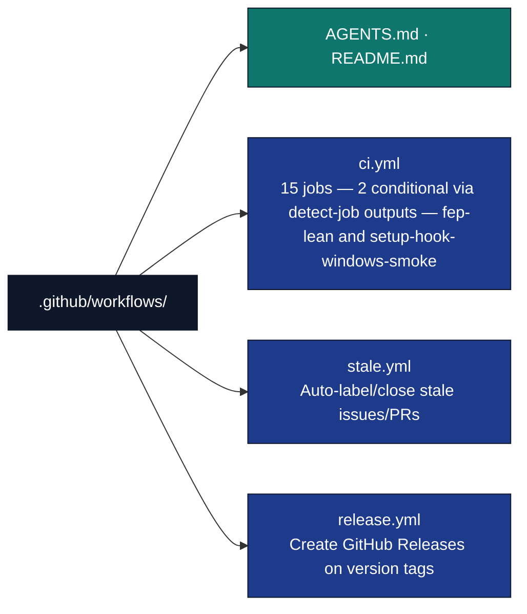
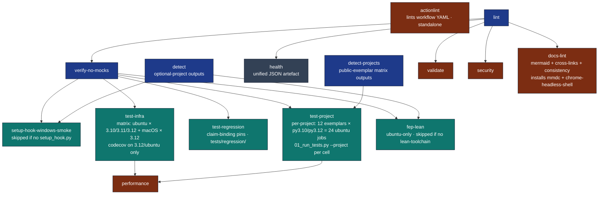

# CI/CD Workflows

## Overview

The `workflows/` directory contains GitHub Actions workflows that automate the continuous integration and delivery pipeline for the Research Project Template. These workflows ensure code quality, test reliability, and compatibility across environments.

## Directory Structure



## CI Pipeline (`ci.yml`)

### Triggers

| Trigger | Condition |
|---|---|
| `push` | Commits to `main` |
| `pull_request` | PRs targeting `main` |
| `schedule` | Weekly Sunday midnight UTC (CVE catch-up) |
| `workflow_dispatch` | Manual trigger (no inputs) |

**Concurrency:** `cancel-in-progress: true` — stale runs are cancelled automatically when a new commit is pushed.

**Global env:** `UV_FROZEN=true`, `MPLBACKEND=Agg` (non-interactive matplotlib backend).

### Job Graph

`health` depends on **`lint`** only (informational). `validate`, `security`, and `docs-lint` depend on **`lint` only** (parallel with the `verify-no-mocks` subtree). `setup-hook-windows-smoke` depends on **`verify-no-mocks`** and **`detect`** and is **skipped** unless `needs.detect.outputs.setup_hook == 'true'`. `test-infra`, `test-regression`, `test-project`, and `fep-lean` depend on **`verify-no-mocks`**.



### Shared setup — `setup-python-env` composite action

The 12 jobs that need Python all share one local composite action,
[`.github/actions/setup-python-env`](../actions/setup-python-env/action.yml),
which runs `astral-sh/setup-uv` (with `uv.lock` cache) + `actions/setup-python`.
The pinned action SHAs and cache config live there once instead of being
copy-pasted per job. Usage (checkout **must** come first — a local action's
files only exist after checkout):

```yaml
steps:
  - uses: actions/checkout@<sha>
  - uses: ./.github/actions/setup-python-env       # defaults to Python 3.12
    # with: { python-version: ${{ matrix.python-version }} }  # matrix jobs only
  - run: uv sync                                    # per-job groups stay explicit
```

`detect` and `actionlint` are checkout-only and do not use it. Each job keeps
its own `uv sync …` line so optional groups (`rendering`/`monitoring`/`discopy`)
remain visible per job. When bumping a setup action's SHA, edit the composite
action — not each job.

### Job Details

#### 1. Lint & Type Check (`lint`)

- **Runner:** `ubuntu-latest` / Python 3.12
- **Tools:** `uv run ruff check`, `uv run ruff format --check`, `uv run mypy`, `uv run python -m infrastructure.skills check-all-exports`
- **Scope:** Ruff uses public lint paths from `infrastructure.project.public_scope lint-paths`; mypy uses its narrower `source-paths` output.

#### 2. Unified Health Report (`health`)

- **Runner:** `ubuntu-latest` / Python 3.12
- **Depends on:** `lint`
- **Purpose:** Runs `uv run python -m infrastructure.core.health --json --quiet` → `health-report.json` artefact (non-blocking for merge; dedicated jobs enforce gates).

#### 3. Verify No Mocks Policy (`verify-no-mocks`)

- **Runner:** `ubuntu-latest` / Python 3.12
- **Script:** [`scripts/audit/verify_no_mocks.py`](../../scripts/audit/verify_no_mocks.py) (repository root)
- **Enforced policy:** no configured prohibited mock-framework imports/calls
  (`MagicMock`, `mocker.patch`, `unittest.mock`, and related lexical forms) in
  test files.
- **Boundary:** `--inventory` separately classifies permitted environment
  isolation and semantic dependency replacement. CI enforces a zero ceiling
  for dependency replacements; environment isolation remains permitted.

#### 3b. Setup hook — Windows smoke (`setup-hook-windows-smoke`)

- **Runner:** `windows-latest` / Python 3.12
- **Depends on:** `verify-no-mocks`
- **Conditional:** `if: needs.detect.outputs.setup_hook == 'true'` — no-op skip when no project ships [`infrastructure.project.setup_hook`](../../infrastructure/project/setup_hook.py). The `detect` job computes this because job-level `hashFiles()` is invalid in GitHub Actions.
- **Step:** `uv run pytest tests/infra_tests/project/test_setup_hook.py` with `PYTHONUTF8=1`

#### 4. Infrastructure Tests (`test-infra`)

- **Matrix:** `ubuntu-latest` × `3.10`, `3.11`, `3.12`, plus an `include:` of `macos-latest` × `3.12` (4 cells). macOS legs are ~10x cost and rarely surface OS-specific breakage beyond the 3.12 cell, so only the 3.12 smoke runs there.
- **Coverage threshold:** 60% (`--cov-fail-under=60`)
- **Coverage file:** `.coverage.infra` (isolated from project coverage)
- **Exclusions:** Tests marked `requires_ollama` are skipped (`-m "not requires_ollama"`)
- **Codecov upload:** On Python 3.12 / ubuntu-latest only to avoid duplicate reports

#### 4b. Regression Tier — claim-binding pins (`test-regression`)

- **Depends on:** `verify-no-mocks`, `timeout-minutes: 20`, ubuntu-only.
- **Sync:** `uv sync --group rendering --group monitoring`.
- **What it runs:** `uv run pytest tests/regression/ -q --no-cov --timeout=120`, serial (no `-n auto`) — see [`docs/maintenance/regression-testing.md`](../../docs/maintenance/regression-testing.md) for why (exemplars ship colliding top-level `src` packages resolved via per-project aliases + temporary `sys.meta_path` finders whose isolation is collection-order-sensitive).
- **Exit-code tolerance:** exit `5` (no tests collected on a clean scaffold) is treated as success so a future empty tier doesn't hard-fail the build; any real failure (exit `1`) still fails the job.

#### 5. Project Tests (`test-project`)

- **Sync:** `uv sync --group rendering --group monitoring --group discopy` — same packages as a fresh local `uv sync` at the repo root for DisCoPy string-diagram tests: root **`default-groups`** are `dev`, `rendering`, and **`discopy`**, so `uv sync` already installs **DisCoPy**; this job adds **monitoring** (not in `default-groups`). **Hypothesis** comes from the **dev** group (parametric tests), not from `discopy` (see root `pyproject.toml` `[dependency-groups]` and `default-groups`).
- **Matrix:** **Per-project split** — `runs-on: ubuntu-latest` (no macOS) × `python-version: [3.10, 3.12]` × each public exemplar in [`../../docs/_generated/active_projects.md`](../../docs/_generated/active_projects.md) (`templates/template_*`) = **24 parallel jobs**. Each exemplar runs in its own job, so wall-clock is the slowest single project rather than the sequential sum. py3.10 (floor) + py3.12 (ceiling) give cross-version coverage; macOS breadth is handled by `test-infra`. Job `timeout-minutes: 45`.
- **Coverage threshold:** Each job enforces **that project's own ≥ 90%** floor on its `src/` (per CLAUDE.md). There is **no longer** a combined-union run or `--cov-append` — every project is isolated in its own job, which also removes the old `code_project`/`fep_lean` conftest plugin-name collision.
- **Coverage file:** `.coverage.project` (isolated; removed at the start of each job before the run)
- **Scope:** [`scripts/pipeline/stage_01_test.py`](../../scripts/pipeline/stage_01_test.py) `--project <name> --project-only --include-slow` (one invocation per matrix cell), then `coverage xml -o coverage-project.xml`. Rotating local projects are not part of this public-repo gate; dedicated project jobs own their own toolchains.
- **Codecov upload:** On Python 3.12 only

#### 6. fep_lean — real Open Gauss + Lake (`fep-lean`)

- **Conditional:** Job is **skipped** unless `projects/fep_lean/lean/lean-toolchain` exists and the `detect` job emits `fep_lean == 'true'`. When fep_lean lives under `projects/working/`, `detect` reports `false` and the job is skipped. Promote with `mv projects/working/fep_lean projects/fep_lean` to activate.
- **Runner:** `ubuntu-latest` / Python 3.12 only; job `timeout-minutes: 60`
- **Depends on:** `verify-no-mocks`
- **Working directory (when present):** `projects/fep_lean` for pytest; `projects/fep_lean/lean` for Lake warm-up
- **Toolchain:** elan + pinned `lean-toolchain`, `lake build` warm-up
- **Open Gauss:** clone [math-inc/OpenGauss](https://github.com/math-inc/OpenGauss), `./scripts/install.sh --plain --noninteractive --skip-system-packages`, `gauss doctor`
- **Tests:** `uv run pytest tests/ --timeout=1200 --cov=src --cov-fail-under=89` with `COVERAGE_FILE: ../../.coverage.fep_lean`
- **Scaling:** Full catalogue × Lean is expensive; if runtime grows past the job budget, split slow integration tests behind a pytest marker or shard topics in a follow-up workflow.

#### 7. Validate Manuscripts (`validate`)

- **Runner:** `ubuntu-latest` / Python 3.12
- **Steps:**
  1. `infrastructure.validation.cli markdown projects/*/manuscript/` — validates all active project manuscripts
  2. `scripts/docgen/api_reference.py --check` — API reference drift gate
  3. Dynamic project import check — imports the public project source paths from `infrastructure.project.public_scope`

#### 8. Security Scan (`security`)

- **Runner:** `ubuntu-latest` / Python 3.12
- **pip-audit:** blocking; builds `--ignore-vuln` args from [`.github/pip-audit-ignore.txt`](../pip-audit-ignore.txt); retries up to **3** times with backoff on failure (transient OSV/network issues)
- **bandit:** `bandit -c bandit.yaml -r -ll`, covers `infrastructure/`, `scripts/`, `projects/`; path exclusions are in `bandit.yaml` (`exclude_dirs`, including archive/WIP roots and `.venv` / `site-packages` so local trees are not scanned)

#### 9. Documentation Lint (`docs-lint`)

- **Runner:** `ubuntu-latest` / Python 3.12 / Node 24-compatible actions
- **Depends on:** `lint`
- **Timeout:** 15 minutes
- **External tools (real, not mocked):**
  - `mmdc` (mermaid-cli) — `npm install -g @mermaid-js/mermaid-cli`
  - `chrome-headless-shell` — `npx puppeteer browsers install chrome-headless-shell`, exported via `CHROME_EXECUTABLE_PATH`
- **Linters (thin orchestrator [`scripts/audit/lint_docs.py`](../../scripts/audit/lint_docs.py)):**
  1. **Mermaid** — every fenced \`\`\`mermaid block in `docs/`, `infrastructure/`, `.github/`, `scripts/`, and root `*.md` is rendered with the real `mmdc` binary. Failure exits non-zero.
  2. **Cross-links** — every relative Markdown link must resolve on disk; fenced and inline-code spans are skipped.
  3. **Consistency** — `N Python (sub)packages` claims must match the live count under `infrastructure/`; rotating project names (`fep_lean`, `cogant`, …) must be conditionally framed in long-lived docs.
  4. **Doc pairs** — permanent-template content folders must carry paired `AGENTS.md` and `README.md`; generated/local paths and rotating projects are excluded.
- **Escape hatch:** append `<!-- noqa: docs-lint -->` to a Markdown line to suppress consistency or broken-link warnings on that line.
- **Scope guarantees:** the linter skips generated/local paths such as `output/`, `.venv/`, `.claude/`, `projects/archive/`, `projects/working/`, `htmlcov/`, and `node_modules/`.
- **Module:** [`infrastructure/validation/docs/`](../../infrastructure/validation/docs/) — `mermaid_lint.py`, `cross_link_lint.py`, `consistency_lint.py`, `doc_pair_lint.py`.

#### 10. Performance Check (`performance`)

- **Runner:** `ubuntu-latest` / Python 3.12
- **Depends on:** `test-infra` + `test-project`
- **Threshold:** each `infrastructure.core` or public project `src` cold import from `infrastructure.project.public_scope` must complete in ≤ 5 seconds
- **Per-module timing** and the roster-dependent total are reported to stdout for trend analysis

### Quality Gates

| Gate | Threshold | Enforced by |
|---|---|---|
| Ruff linting | zero violations | `lint` job |
| Ruff formatting | zero diffs | `lint` job |
| mypy type ratchet | no unratcheted errors, new error-bearing files, or package-ceiling growth | `lint` job |
| Mock-framework lexical gate | zero prohibited imports/calls | `verify-no-mocks` job |
| Infrastructure coverage | ≥ 60% | `test-infra` job |
| Per-project coverage (standalone) | ≥ 90% | each project's own pytest gate |
| Combined-union public-project coverage | ≥ 75% | `test-project` job (`DEFAULT_FAIL_UNDER`) |
| fep_lean coverage | ≥ 89% | `fep-lean` job (skipped if `projects/fep_lean/lean/lean-toolchain` absent) |
| pip-audit | no unignored vulnerabilities | `security` job |
| Bandit MEDIUM+ (`bandit.yaml`) | zero findings | `security` job |
| Import time | ≤ 5 seconds total | `performance` job |

---

## Stale Workflow (`stale.yml`)

Runs daily at 01:00 UTC using `actions/stale@v10.3.0`.

| Item | Stale after | Closed after |
|---|---|---|
| Issues | 60 days inactive | + 14 days |
| Pull Requests | 30 days inactive | + 14 days |

**Exempt labels:** `pinned`, `security`, `in-progress`, `blocked`, `do-not-close`

---

## Release Workflow (`release.yml`)

Triggers on `v*.*.*` tag push or `workflow_dispatch` (with tag input).

1. Verifies the requested tag exists in the checkout
2. Generates a commit-based changelog excerpt since the previous tag
3. Creates a GitHub Release using `softprops/action-gh-release@v3.0.0` with **`generate_release_notes: false`** so the body is the git-log excerpt only (no duplicate auto-generated section)
4. Auto-marks as pre-release if tag contains `-rc`, `-beta`, or `-alpha`

Current pinned GitHub Actions use the Node 24 action runtime. GitHub-hosted runners satisfy this; self-hosted runners must be Actions runner `v2.327.1` or newer.

---

## Local CI Simulation

```bash
# Reproduce lint locally
uv sync
uv run python -m infrastructure.project.public_scope lint-paths | xargs uv run ruff check
uv run python -m infrastructure.project.public_scope lint-paths | xargs uv run ruff format --check
uv run python -m infrastructure.project.public_scope source-paths | xargs uv run mypy

# Reproduce infrastructure tests locally
COVERAGE_FILE=.coverage.infra uv run pytest tests/infra_tests/ \
  --cov=infrastructure \
  --cov-fail-under=60 \
  -m "not requires_ollama"

# Reproduce project tests locally (matrix job ignores fep_lean). Root `default-groups` include
# `discopy` and `rendering`; CI also installs `monitoring` — use:
#   uv sync --group monitoring
# or full explicit parity: uv sync --group rendering --group monitoring --group discopy
uv sync --group rendering --group monitoring --group discopy
COVERAGE_FILE=.coverage.project uv run python scripts/pipeline/stage_01_test.py --project-only --all-projects --public-projects --non-strict --include-slow
uv run coverage xml -o coverage-project.xml

# fep_lean only — requires gauss, lake, lean on PATH (see that project's tests/AGENTS.md when present)
(cd projects/fep_lean && COVERAGE_FILE=../../.coverage.fep_lean uv run pytest tests/ \
  --timeout=900 \
  --cov=src \
  --cov-fail-under=89 \
  -m "not requires_ollama")

# Reproduce security scan locally (mirror CI — build ignores from file)
IGNORE_ARGS=()
while IFS= read -r raw || [ -n "$raw" ]; do
  [[ "$raw" =~ ^[[:space:]]*# ]] && continue
  line="${raw%%#*}"
  line="$(echo "$line" | xargs)"
  [ -z "$line" ] && continue
  IGNORE_ARGS+=(--ignore-vuln "$line")
done < .github/pip-audit-ignore.txt
uv run pip-audit "${IGNORE_ARGS[@]}"
uv run bandit -c bandit.yaml -r -ll infrastructure/ scripts/ projects/
```

---

## Troubleshooting

### Linting failures
```bash
uv run python -m infrastructure.project.public_scope lint-paths | xargs uv run ruff check --fix
uv run python -m infrastructure.project.public_scope lint-paths | xargs uv run ruff format
```

### Test failures
```bash
# Infrastructure
uv run pytest tests/infra_tests/ -v --tb=long -s

# Project tests — prefer the orchestrator (runs one pytest per project; avoids conftest/package collisions):
uv run python scripts/pipeline/stage_01_test.py --project template_code_project

# Advanced / blanket globs — running **all** `projects/*/tests/` in **one** pytest process can fail when multiple projects ship `tests/conftest` packages with identical names; use per-project directories instead.

uv run pytest projects/*/tests/ -v --tb=long -s

# Single test
uv run pytest tests/infra_tests/test_foo.py::TestClass::test_method -s --pdb
```

### Coverage below threshold
```bash
# Infrastructure report
COVERAGE_FILE=.coverage.infra uv run pytest tests/infra_tests/ \
  --cov=infrastructure --cov-report=html
open htmlcov/index.html

# Project report — replace SRC_PATH with `projects/<name>/src` from _generated/active_projects.md when benchmarking coverage manually:
COVERAGE_FILE=.coverage.project uv run pytest projects/templates/template_code_project/tests/ \
  --cov=projects/templates/template_code_project/src --cov-report=html
open htmlcov/index.html
```

### Performance check slow
```bash
# Profile imports
uv run python -c "
import cProfile, pstats, io
pr = cProfile.Profile()
pr.enable()
import infrastructure.core
pr.disable()
s = io.StringIO()
ps = pstats.Stats(pr, stream=s).sort_stats('cumulative')
ps.print_stats(20)
print(s.getvalue())
"
```

---

## See Also

- [`../README.md`](../README.md) — `.github/` human guide (workflows, Dependabot, templates)
- [`../AGENTS.md`](../AGENTS.md) — GitHub integration overview
- [`../../AGENTS.md`](../../AGENTS.md) — Root system overview and pipeline stages
- [GitHub Actions Documentation](https://docs.github.com/en/actions)
- [uv Documentation](https://docs.astral.sh/uv/)
- [Codecov Documentation](https://docs.codecov.com/)
