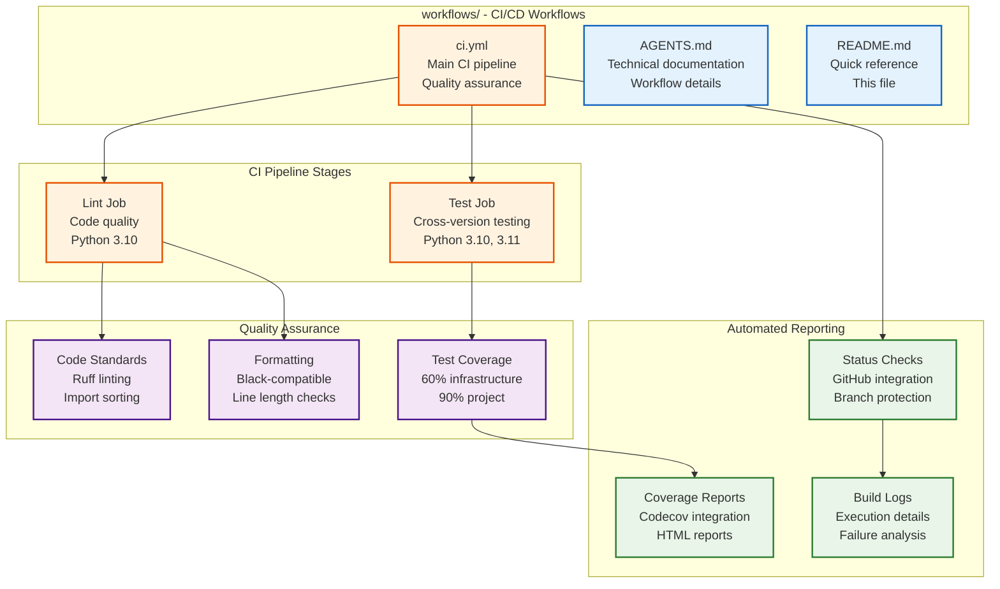

# workflows/ - CI/CD Pipelines

GitHub Actions workflows for automated quality assurance, testing, and deployment. Ensures code reliability across Python versions and enforces development standards.

## Overview



## Quick Start

### Check Pipeline Status
```bash
# View workflow runs
gh run list --workflow=CI --limit=5

# Check current status
gh workflow view CI --ref=main

# View latest run details
gh run view --workflow=CI
```

### Local Pipeline Testing
```bash
# Simulate linting (matches CI)
cd project
uv run ruff check .
uv run ruff format --check .

# Simulate testing (matches CI)
cd project
uv run pytest tests/ --cov=src
```

## CI Pipeline (ci.yml)

### Workflow Triggers
```yaml
on:
  push:
    branches: [main]
  pull_request:
    branches: [main]
```

### Pipeline Jobs

#### 1. Code Quality (Lint)
**Purpose:** Enforce coding standards and formatting

**Configuration:**
- **Runner:** `ubuntu-latest`
- **Python:** 3.10
- **Working Directory:** `project/`

**Steps:**
1. **Checkout** - Get repository code
2. **Setup Python** - Install Python 3.10
3. **Install uv** - Package manager
4. **Sync Dependencies** - Install project dependencies
5. **Ruff Check** - Code linting and quality
6. **Ruff Format Check** - Code formatting validation

#### 2. Testing (Tests)
**Purpose:** Validate functionality across Python versions

**Matrix Configuration:**
```yaml
strategy:
  fail-fast: false
  matrix:
    python-version: ["3.10", "3.11"]
```

**Per-Version Steps:**
1. **Checkout** - Get repository code
2. **Setup Python** - Install matrix Python version
3. **Install uv** - Package manager
4. **Sync Dependencies** - Install test dependencies
5. **Run Tests** - Execute test suite with coverage
6. **Upload Coverage** - Send results to codecov

### Quality Requirements

#### Code Standards
- **Ruff Rules:** Comprehensive Python code quality
- **Import Sorting:** Consistent import organization
- **Type Checking:** Basic type annotation validation
- **Error Detection:** Static error identification

#### Formatting Standards
- **Line Length:** 88 characters (Black compatible)
- **Quote Style:** Double quotes preferred
- **Trailing Commas:** Consistent usage
- **Indentation:** 4 spaces standard

#### Test Coverage
- **Infrastructure:** 60% minimum coverage
- **Project:** 90% minimum coverage
- **Real Data:** No mock methods allowed
- **Integration:** Cross-module testing

### Execution Time
- **Lint Job:** ~30 seconds
- **Test Job:** ~2-3 minutes per Python version
- **Total Pipeline:** ~5-7 minutes

## Status Checks

### Required Checks for Main Branch
```bash
# Status checks required before merge
- lint
- tests (3.10)
- tests (3.11)
```

### Branch Protection Setup
```yaml
required_status_checks:
  - lint
  - tests (3.10)
  - tests (3.11)

required_pull_request_reviews:
  required_approving_review_count: 1
```

## Coverage Reporting

### Codecov Integration
```yaml
- name: Upload coverage reports
  uses: codecov/codecov-action@v3
  with:
    file: ./coverage.xml
    flags: unittests
    name: codecov-umbrella
```

### Coverage Reports
- **Terminal:** `pytest --cov-report=term-missing`
- **HTML:** `pytest --cov-report=html` (opens in browser)
- **Online:** Codecov dashboard with trend analysis

## Workflow Management

### Common Commands
```bash
# List all workflows
gh workflow list

# View workflow details
gh workflow view CI

# View workflow YAML
gh workflow view CI --yaml

# Run workflow manually (if workflow_dispatch enabled)
gh workflow run CI
```

### Debugging Workflows
```bash
# View failed run logs
gh run view <run-id> --log

# Download artifacts
gh run download <run-id>

# View job logs specifically
gh run view <run-id> --job=<job-id>

# Rerun failed jobs
gh run rerun <run-id> --failed
```

## Local Development

### Simulating CI Locally
```bash
# Set CI environment variables
export CI=true
export GITHUB_ACTIONS=true
export GITHUB_WORKFLOW=CI

# Run linting (matches CI exactly)
cd project
uv run ruff check .
uv run ruff format --check .

# Run tests with coverage (matches CI)
cd project
uv run pytest tests/ --cov=infrastructure --cov=src
```

### Pre-commit Checks
```bash
# Run before committing
cd project
uv run ruff check . --fix
uv run ruff format .
uv run pytest tests/ --cov=src --cov-fail-under=90
```

## Troubleshooting

### Common Pipeline Issues

#### Linting Failures
```bash
# Fix linting issues locally
cd project
uv run ruff check . --fix  # Auto-fix issues
uv run ruff format .       # Format code

# Check what would be fixed
uv run ruff check . --diff
```

#### Test Failures
```bash
# Run tests locally with details
cd project
uv run pytest tests/ -v

# Debug specific test
uv run pytest tests/test_specific.py::TestClass::test_method -s --pdb

# Run only failed tests
uv run pytest tests/ --lf
```

#### Coverage Issues
```bash
# Check coverage locally
cd project
uv run pytest tests/ --cov=src --cov-report=html --cov-report=term-missing
open htmlcov/index.html

# Verify minimum requirements
uv run pytest tests/ --cov=src --cov-fail-under=90
```

#### Python Version Issues
```bash
# Test with specific Python version
python3.10 -m pytest tests/
python3.11 -m pytest tests/
```

### Workflow Debugging
```bash
# Check workflow syntax
gh workflow run --list

# View workflow logs
gh run view <run-id> --log-failed

# Test workflow changes locally first
# Then commit and monitor CI results
```

## Customization

### Adding New Jobs
```yaml
jobs:
  new-job:
    runs-on: ubuntu-latest
    steps:
      - uses: actions/checkout@v4
      - name: New quality check
        run: uv run python scripts/custom_check.py
        working-directory: project
```

### Modifying Quality Gates
```yaml
# Add new linting rules
- name: Additional checks
  run: uv run python scripts/extra_checks.py
  working-directory: project
```

### Environment Variables
```bash
# Add to workflow environment
env:
  CUSTOM_VAR: value
  LOG_LEVEL: 0
```

## Security Considerations

### Secret Management
- **GitHub Secrets:** Encrypted token storage
- **Environment Variables:** Secure value injection
- **Minimal Permissions:** Least privilege access
- **Audit Logging:** Access tracking

### Dependency Security
```yaml
# Future: Security scanning
- name: Security audit
  run: |
    uv run safety check
    uv run bandit -r src/
```

## Performance Optimization

### Execution Time Reduction
- **Parallel Jobs:** Matrix strategy for concurrent execution
- **Dependency Caching:** uv cache utilization
- **Selective Testing:** Targeted test execution
- **Resource Optimization:** Efficient runner usage

### Monitoring
- **Build Duration Tracking:** Pipeline execution time monitoring
- **Success Rate Analysis:** Build reliability tracking
- **Resource Usage:** CPU and memory monitoring
- **Failure Pattern Analysis:** Common issue identification

## Integration Points

### With Repository
- **Branch Protection:** Quality gates for main branch
- **Pull Request Validation:** Automated PR checks
- **Status Reporting:** Real-time build status
- **Coverage Badges:** Repository quality indicators

### With Development Tools
- **IDE Integration:** Local linting matches CI
- **Pre-commit Hooks:** Automated quality checks
- **Code Formatting:** Consistent with CI standards
- **Test Coverage:** Local coverage matches CI requirements

## Future Enhancements

### Planned Improvements
- **Multi-OS Testing:** Windows and macOS compatibility
- **Performance Regression:** Automated performance monitoring
- **Security Scanning:** Advanced vulnerability detection
- **Container Testing:** Docker-based integration testing
- **Dependency Updates:** Automated dependency management

## See Also

- [`AGENTS.md`](AGENTS.md) - Complete CI/CD workflow documentation
- [`../AGENTS.md`](../AGENTS.md) - GitHub integration overview
- [`../../docs/operational/CI_CD_INTEGRATION.md`](../../docs/operational/CI_CD_INTEGRATION.md) - CI/CD integration guide
- [`../../docs/development/CONTRIBUTING.md`](../../docs/development/CONTRIBUTING.md) - Contribution guidelines