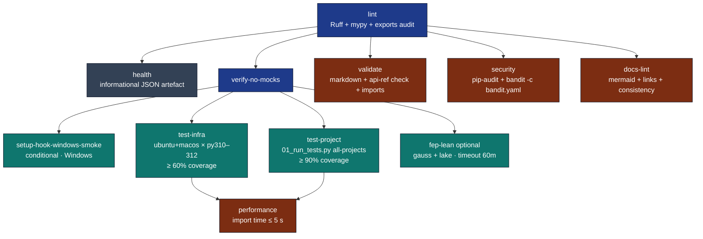

# workflows/ — CI/CD Pipelines

GitHub Actions workflows for automated quality assurance, testing, and deployment. Enforces development standards across Python versions and environments.

For Dependabot, issue/PR templates, and the full GitHub integration picture, see **[`../README.md`](../README.md)** in the parent `.github/` folder.

## Workflows

| File | Trigger | Purpose |
|---|---|---|
| [`ci.yml`](ci.yml) | push/PR to `main`, weekly, manual | **12 jobs** (2 conditional via the `detect` job's outputs — `needs.detect.outputs.*`: **`fep-lean`** and **`setup-hook-windows-smoke`**; job-level `hashFiles()` is invalid and was removed; see [`AGENTS.md`](AGENTS.md)) |
| [`stale.yml`](stale.yml) | Daily 01:00 UTC | Auto-label and close stale issues/PRs |
| [`release.yml`](release.yml) | `v*.*.*` tag push or manual | Generate GitHub Release with changelog |

## CI Pipeline (`ci.yml`)

### Job Graph

`health`, `validate`, `security`, and `docs-lint` fan out from **`lint`**; `verify-no-mocks` gates the test matrix; **`performance`** waits on **`test-infra`** + **`test-project`**. See [`AGENTS.md`](AGENTS.md).


```mermaid
flowchart TB
    LINT[lint<br/>Ruff + mypy + exports audit] --> HEALTH[health<br/>informational JSON artefact]
    LINT --> VNM[verify-no-mocks]
    LINT --> VAL[validate<br/>markdown + api-ref check + imports]
    LINT --> SEC[security<br/>pip-audit + bandit -c bandit.yaml]
    LINT --> DL[docs-lint<br/>mermaid + links + consistency]
    VNM --> SHW[setup-hook-windows-smoke<br/>conditional · Windows]
    VNM --> TI[test-infra<br/>ubuntu+macos × py310–312<br/>≥ 60% coverage]
    VNM --> TP[test-project<br/>01_run_tests.py all-projects<br/>≥ 90% coverage]
    VNM --> FL[fep-lean optional<br/>gauss + lake · timeout 60m]
    TI --> PERF[performance<br/>import time ≤ 5 s]
    TP --> PERF

    classDef gate fill:#1e3a8a,stroke:#0f172a,color:#fff
    classDef matrix fill:#0f766e,stroke:#0f172a,color:#fff
    classDef terminal fill:#7c2d12,stroke:#0f172a,color:#fff
    classDef info fill:#334155,stroke:#0f172a,color:#fff
    class LINT,VNM gate
    class TI,TP,FL,SHW matrix
    class VAL,SEC,DL,PERF terminal
    class HEALTH info
```

### Quality Gates

| Gate | Threshold |
|---|---|
| Ruff lint | zero violations |
| Ruff format | zero diffs |
| mypy | no errors |
| `check-all-exports` | zero violations |
| No-mocks policy | zero mock usage |
| Infrastructure coverage | ≥ 60% |
| Project coverage | ≥ 90% |
| pip-audit | blocking (ignore IDs from `.github/pip-audit-ignore.txt`; retries in CI) |
| Bandit MEDIUM+ (`bandit.yaml`) | zero findings |
| Docs lint | mermaid + cross-links + consistency + doc-pair coverage clean |
| Import time | ≤ 5 s total |

### Local CI Simulation

```bash
# Lint
uvx ruff check infrastructure/ projects/*/src/
uvx ruff format --check infrastructure/ projects/*/src/
uv run mypy infrastructure/ projects/*/src/

# Infrastructure tests
uv run pytest tests/infra_tests/ \
  --cov=infrastructure --cov-datafile=.coverage.infra --cov-fail-under=60 \
  -m "not requires_ollama"

uv sync --group rendering --group monitoring --group discopy
COVERAGE_FILE=.coverage.project uv run python scripts/01_run_tests.py --project-only --all-projects --non-strict --include-slow
uv run coverage xml -o coverage-project.xml

# Security (mirror CI — ignores file + bandit.yaml)
IGNORE_ARGS=()
while IFS= read -r raw || [ -n "$raw" ]; do
  [[ "$raw" =~ ^[[:space:]]*# ]] && continue
  line="${raw%%#*}"; line="$(echo "$line" | xargs)"
  [ -z "$line" ] || IGNORE_ARGS+=(--ignore-vuln "$line")
done < .github/pip-audit-ignore.txt
uv run pip-audit "${IGNORE_ARGS[@]}"
uv run bandit -c bandit.yaml -r -ll infrastructure/ scripts/ projects/
```

## Stale Workflow (`stale.yml`)

| Item | Stale after | Closed after |
|---|---|---|
| Issues | 60 days | + 14 days |
| PRs | 30 days | + 14 days |

Exempt labels: `pinned` · `security` · `in-progress` · `blocked` · `do-not-close`

## Release Workflow (`release.yml`)

Triggered on `v*.*.*` tag push or `workflow_dispatch`. Writes a git-log excerpt to the release body (`generate_release_notes: false`). Uses `softprops/action-gh-release@v2`. Tags containing `-rc`/`-beta`/`-alpha` are auto-marked as pre-release.

## Troubleshooting

```bash
# Fix linting
uvx ruff check infrastructure/ projects/*/src/ --fix
uvx ruff format infrastructure/ projects/*/src/

# View CI run logs
gh run list --workflow=CI --limit=5
gh run view <run-id> --log-failed

# Re-run failed jobs
gh run rerun <run-id> --failed

# Debug specific test
uv run pytest tests/infra_tests/test_foo.py::TestClass::test_method -s --pdb

# Coverage HTML report
uv run pytest projects/template_code_project/tests/ --cov=projects/template_code_project/src --cov-report=html
open htmlcov/index.html
```

## Adding New Jobs

```yaml
jobs:
  new-job:
    runs-on: ubuntu-latest
    needs: [lint]
    permissions:
      contents: read
    steps:
      - uses: actions/checkout@v4
      - uses: astral-sh/setup-uv@v6
        with:
          enable-cache: true
          cache-dependency-glob: "**/uv.lock"
      - uses: actions/setup-python@v5
        with:
          python-version: "3.12"
      - name: Sync dependencies
        run: uv sync
      - name: Custom check
        run: uv run python scripts/custom_check.py
```

## See Also

- [`../README.md`](../README.md) — Full `.github/` guide (templates, Dependabot, CI overview)
- [`AGENTS.md`](AGENTS.md) — Full CI/CD technical documentation
- [`../AGENTS.md`](../AGENTS.md) — GitHub integration overview
- [`../../AGENTS.md`](../../AGENTS.md) — Root system overview
