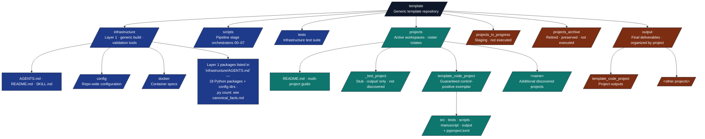
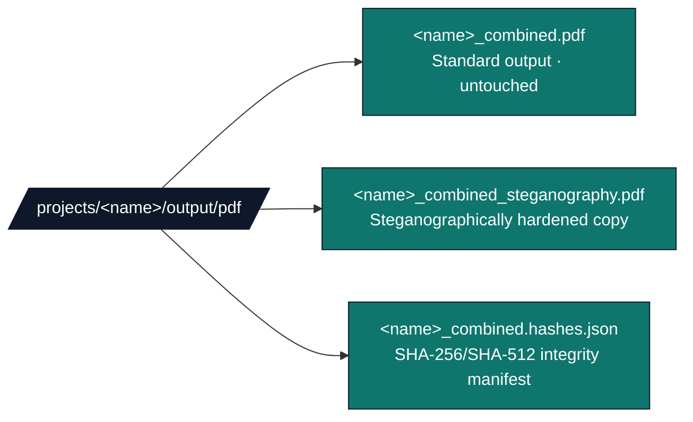
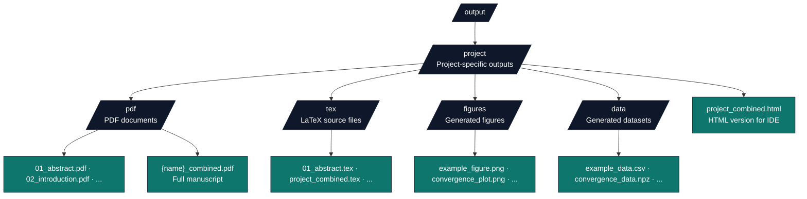

# 🤖 AGENTS.md - System Documentation

## 🎯 System Overview

This document provides documentation for the Research Project Template system, ensuring understanding of all functionality, configuration options, and operational procedures.

### 📄 Publication

**Title**: *A template/ approach to Reproducible Generative Research: Architecture and Ergonomics from Configuration through Publication*
**DOI**: [10.5281/zenodo.19139090](https://doi.org/10.5281/zenodo.19139090) · **Record**: [zenodo.org/records/19139090](https://zenodo.org/records/19139090)

`template/` applies Infrastructure as Code to the research lifecycle: version-controlled manuscripts, tests, provenance, and a declared pipeline DAG. **Layer 1** (`infrastructure/`) is separated from **Layer 2** (self-contained projects under `projects/`). Current measured counts and stage facts live in [`docs/_generated/canonical_facts.md`](docs/_generated/canonical_facts.md); re-derive them instead of copying literals into prose. Each directory carries `README.md` + `AGENTS.md`; infrastructure packages usually add `SKILL.md` for agent routing. Full paper, metrics, and claims: Zenodo record above and root [`README.md`](README.md).

### Documentation map

| Entry | Role |
| --- | --- |
| [`README.md`](README.md) | Onboarding, documentation hub links, exemplar table |
| [`.cursorrules`](.cursorrules) | Cursor agents: layer rules, CI scope, editing discipline |
| [`CLAUDE.md`](CLAUDE.md) | Command cheat sheet, patterns; keep in sync with this file for pipeline wording |
| **This file (`AGENTS.md`)** | Full reference: stages, validation, modules, troubleshooting |
| [`docs/documentation-index.md`](docs/documentation-index.md) | Flat index of long-lived docs |
| [`docs/_generated/active_projects.md`](docs/_generated/active_projects.md) | Authoritative public CI/documentation project names — never hard-code rotating private paths in docs |
| [`docs/_generated/canonical_facts.md`](docs/_generated/canonical_facts.md) | Measured coverage and counts; refresh after changing gates or discovery |
| [`.github/README.md`](.github/README.md) | GitHub: CI overview, templates, Dependabot |
| [`.github/AGENTS.md`](.github/AGENTS.md) | Actions job names, coverage gates, local reproduction commands |

## For assistants and automation

**Read order:** [`README.md`](README.md) → [`CLAUDE.md`](CLAUDE.md) → this file for anything not covered there.

**Ground truth:** Public CI/documentation project names come from [`docs/_generated/active_projects.md`](docs/_generated/active_projects.md) (`infrastructure.project.public_scope`). Runtime `discover_projects()` remains broader for local private symlinked workspaces. Measured numbers for documentation claims belong in [`docs/_generated/canonical_facts.md`](docs/_generated/canonical_facts.md); avoid inventing statistics.

**Definition of done (code):** Ruff + mypy clean on the public CI source paths from `uv run python -m infrastructure.project.public_scope source-paths`; tests exercise real behaviour (no mocks); coverage still meets 60% (infra) / 90% (project `src/`) unless CI documents a rotating-project exception ([`.github/AGENTS.md`](.github/AGENTS.md)).

**Hooks:** [`.pre-commit-config.yaml`](.pre-commit-config.yaml) — commit stage runs Ruff and mypy; pre-push adds no-mocks verification, a short pytest smoke module, Bandit (`-c bandit.yaml`, exclusions in YAML), and `infrastructure.skills check` + `check-all-exports`. Install: `pre-commit install` and `pre-commit install --hook-type pre-push` after `uv sync`.

**Architecture:** Business logic only in `infrastructure/` or `projects/{name}/src/`. Scripts orchestrate; violating this breaks the test and documentation contract ([Thin orchestrator pattern](#thin-orchestrator-pattern)).

## Learned User Preferences

- When a "Plan" / "Implementation Plan" file is attached, treat the existing todos as authoritative: do not recreate them, do not edit the plan file, mark each in_progress as you work, and do not stop until every todo is complete.
- Purge legacy / historical / outdated / deprecated narrative from docs, manuscripts, and code on every review pass; never leave superseded references behind.
- When pointing users to past Cursor agent transcripts, cite only **parent** transcript files (UUID link text with a short title, UUID without the `.jsonl` suffix in the path); do not cite or discuss subagent transcripts or their IDs.
- Prefer understated, semantically necessary wording in docs and names; trim hype adjectives such as "enhanced", "real", and "new" unless they change meaning.
- In manuscript introductions and related work, prefer building on, juxtaposing, and extending prior work over oppositional "against" framing; show, do not tell.
- Prefer registry-backed or injected manuscript cross-references (`[[FIG:…]]` / `[[EQ:…]]` / citekeys / `[[VAR:…]]` where the project defines them) over hard-coded numeric figure, equation, or section strings in prose.
- Keep root [`CHANGELOG.md`](CHANGELOG.md) scoped to this **template repository** (Layer 1, root orchestration, CI, repo-level documentation). Do not use it for workspace-specific narratives under `projects/`—those trees are often absent from a checkout, gitignored, or confidential.
- For large multi-unit manuscript deep reviews, wire publication canon (repository URL, DOI, config, front matter) before unit-prioritized content audit passes—not a single rewrite of every chapter file at once. Curriculum-scale manuscripts treat cover/suggest-citation DOI, figure captions, table auto-numbering, and `\cref{fig:…}` / mermaid alt-text pairs as publication-quality gates alongside automated invariant tests.
- When render or pipeline fixes span multiple projects, stabilize the affected public exemplars first, then apply learnings to rotating/private projects. Deep structural audits on private, passive, or archive trees use `thermo-nuclear-code-quality-review`; land remediation commits in `/Users/4d/Documents/GitHub/projects/`, not public template commits unless the change is shared Layer 1 infrastructure.
- Treat infra/repo work as complete only when pytest reports zero failures and zero skips except explicitly opt-in markers (e.g. `requires_ollama`).

## Learned Workspace Facts

- PAI local alignment (2026-05-15): upstream target is `danielmiessler/Personal_AI_Infrastructure` `v5.0.0`. Active `~/.claude` carries Algorithm `v6.3.0`, the ISA skill, and Pulse on port `31337`; `~/.claude/settings.json` agrees with `PAI/ALGORITHM/LATEST`. Docxology intake via `~/.claude/PAI/TOOLS/DocxologyIntake.ts` (public context ≠ private TELOS; weekly Pulse job `docxology-context-sync`). Use ISA-first language; treat PRD-era PAI loop wording as historical.
- Manuscript metrics, counts, and variables are auto-injected from per-project `output/data/manuscript_variables.json` at render time; never hand-author values that should be injected. For `template_code_project`, the default pipeline path calls `generate_variables(..., require_analysis_outputs=True)` via `scripts/z_generate_manuscript_variables.py` and fails when `output/data/optimization_results.csv` is absent; pass `--allow-draft` only for intentional early drafts that may use `"N/A"` fallbacks. PDF Publishing Information reads `publication.doi`, optional `publication.repository_url`, and `publication.repository_label` from `projects/{name}/manuscript/config.yaml` via `infrastructure/rendering/_pdf_latex_helpers.py` (`_latex_href_url()` preserves underscores in GitHub URLs).
- **Rotating Lean-toolchain project (e.g. `fep_lean`, when checked out under `projects/`)**: real Lean 4 + Mathlib via `lake build`, OpenGauss `gauss` CLI, and the Hermes LLM pipeline (no mocks); validate end-to-end through `./run.sh`. Combined-PDF link colours come from `hyperref` / `\hypersetup` in the project's `manuscript/preamble.md` (red `fepred` for link, URL, and citation colours). Hermes and per-topic Gauss reports are built from the pipeline stage payload (`TopicRunResult.as_dict()`), not SQLite re-reads—that dict must include `tokens_used`, `explanation`, `refined_lean_sketch`, `hermes_model`, `cache_hit`, and `hermes_lean_compiles`. Topic sketches live in `scripts/catalogue_sketches.py` and `config/topics.yaml`; `lean/FepSketches/` holds `Basic.lean`, `fep_all.lean`, and ephemeral `_verify_*` files only. The manuscript emits unified `09z_unified_formalism_catalogue.md`; `scripts/theorem_latex_signatures.py` drives display-math aligned with Lean. The manuscript-variables injector reads only `run_*/verification_manifest.json` (not `verify_*/` standalone runs), so the abstract compile-rate reflects the Hermes-refined run.
- Content-validation diagnostics use stable dotted IDs from `infrastructure/validation/content/diagnostic_codes.py` (`MarkdownCode`, `BibtexCode`); every new `DiagnosticEvent` must pass `code=…`, and renaming an existing code is a breaking change for downstream `jq`/`rg` filters on `diagnostics.json`. Fast manuscript pre-flight: `uv run python -m infrastructure.validation.cli prerender projects/<project>/manuscript --repo-root .`. `DocumentationScanner` delegates to `run_verification_checks()`. Mermaid: unquoted `//` line comments; stadium nodes `[/label/]` close with `/]`; combined PDF Mermaid via Chrome headless or `mmdc`, else verbatim figure fallback.
- **CONFIDENTIALITY INVARIANT (this is a PUBLIC repo).** `.gitignore` ignores `projects/*` and negates **only** `projects/template_autoresearch_project/`, `projects/template_code_project/`, and `projects/template_prose_project/` (plus the repo-level `projects/*.md` docs). Those public canonical exemplars are the **only** project trees ever git-tracked/pushed. Confidential/private work lives in the sibling private repo `/Users/4d/Documents/GitHub/projects/` with `active/`, `passive/`, and `archive/`; `run.sh`/`infrastructure.orchestration` sync `active/*` into `template/projects/*`, `passive/*` into `template/projects_in_progress/*`, and `archive/*` into `template/projects_archive/*` as symlinks before discovery. Only `projects/*` is discovered/rendered by default; passive/archive mirrors are for local inspection or explicit targeted work. Every non-template project visible under `projects/` — rotating research, client/confidential work, symlinked active work, and the optional `template_search_project` literature-search exemplar — is **local-only and must never be committed**. This is enforced, not just conventional: `scripts/check_tracked_projects.py` fails the CI `lint` job and the pre-push `pre-push-quick` hook if any non-template project path is tracked (a `git add -f` cannot slip past it). `template_search_project` rests in [`projects_archive/template_search_project/`](projects_archive/template_search_project/); copy it under `projects/` **locally** to exercise the literature-search workflow, but never commit it. Consult [`docs/_generated/active_projects.md`](docs/_generated/active_projects.md) before hard-coding any other project paths in docs (every non-template path may rotate between `projects/`, `projects_in_progress/`, `projects_archive/`, or the sibling private repo). Running **all** `projects/*/tests/` in **one** pytest process fails when projects each ship `tests/conftest` under the `tests.conftest` package name; run **one project test directory per pytest invocation** (with `--cov-append` to merge coverage) or follow `.github/workflows/ci.yml` (e.g. `fep_lean` in its own job).
- WIP resolution: `infrastructure.project.discovery.resolve_project_root` prefers `projects/<name>/` when that tree has `src/`, `tests/`, `scripts/`, and `manuscript/`; otherwise the same name under `projects_in_progress/` (nested WIP: pass e.g. `cognitive_integrity/cogsec_multiagent_1_theory`; bare `cogsec_multiagent_*` resolves only under `projects/`). Symlinked private projects under `projects/` carry their own operational canon in that tree's `AGENTS.md`; consult [`docs/_generated/active_projects.md`](docs/_generated/active_projects.md) instead of hard-coding rotating paths in root docs.
- `bandit.yaml` lists `exclude_dirs` (`projects_archive`, `projects_in_progress`, `.venv`, `site-packages`, `.lake`, and the rotating research projects under `projects/` — same rotating-project exemption as coverage/mypy) so Bandit stays strict on `infrastructure/`, `scripts/`, and the public canonical exemplars while non-authored / rotating trees are skipped; CI and hooks rely on that config instead of repeating long `--exclude` lists on the command line.
- `docs/prompts/` hosts discoverable agent skills: hub [`docs/prompts/SKILL.md`](docs/prompts/SKILL.md) (`template-workflows`) plus 13 `template-*` workflow subdirs; in `infrastructure.skills.discovery.DEFAULT_SKILL_SEARCH_ROOTS`; regenerate via `uv run python -m infrastructure.skills write` (+ `write-index`). Synthetic skill-eval harness at [`docs/prompts/_skill-eval/`](docs/prompts/_skill-eval/) — excluded from default docs lint via `SKILL_EVAL_DIR_NAME` in `infrastructure/validation/docs/scan_scope.py`; keyword grader, not live agent evals.
- **`biology_textbook` (active private curriculum):** standalone repo at `/Users/4d/Documents/GitHub/projects/active/biology_textbook`, symlinked as `projects/biology_textbook` — commit project changes there, not in public `template/`. Unit intros/appendices use Pandoc `{#sec:…}` / `\label{sec:…}`; front-matter reading paths use `\nameref{sec:…}` while in-chapter labs prefer `\cref`. Enrichment scripts default to dry-run; pass `--write` to persist. Operational canon lives in that tree's `AGENTS.md`.
- **PDF front matter / `\nameref` with titlesec:** `fix_starred_section_nameref_labels()` in `infrastructure/rendering/_pdf_combined_renderer.py` runs after `inject_latex_preamble()` because titlesec prevents hyperref from storing titles on `\section*`, leaving `\nameref{sec:...}` empty for Pandoc `\section*{Title}\label{sec:...}` front matter. `check_pdf_log` may still flag front-matter `\nameref` ordering while the combined PDF renders correctly.
- `run.sh` and `secure_run.sh` source only [`scripts/shell_bootstrap.sh`](scripts/shell_bootstrap.sh) (shared `uv` bootstrap and sandbox env); menu and argparse live in `infrastructure.orchestration`. [`scripts/bash_utils.sh`](scripts/bash_utils.sh) serves backup/health scripts and tests, not pipeline entrypoints. Integration tests: `tests/integration/test_run_sh.py`, `tests/integration/test_secure_run_sh.py`.
- Exemplar doc/code drift is checked by `scripts/check_template_drift.py` → `infrastructure.project.drift.run_drift_checks()` for the public exemplar set in `infrastructure.project.public_scope.PUBLIC_PROJECT_NAMES`; use `--project` and `--strict` for focused gates. The drift runner applies `check_project_scripts` / `check_repo_scripts` (AST + line-count) in `infrastructure.project.drift.orchestrator` to root `scripts/` and project `scripts/`. Infra test supplements merge via `scripts/merge_test_supplements.py`; `00_preflight.py` is excluded from Stage 02 analysis discovery (`_NON_ANALYSIS_SCRIPT_NAMES`). Mechanical Python hygiene fixes live in `infrastructure/core/source_improve.py` (used by `scripts/batch_cogsec_improve.py`), not under `infrastructure/scientific/`. Layer 1 module size is gated by `infrastructure/validation/line_count.py` via `scripts/gates/module_line_count_check.py` (warn ≥800, fail ≥950 for `infrastructure/` + `scripts/`; warn ≥150, fail ≥250 for `projects/*/scripts/`) and wired into `uv run python -m infrastructure.core.health` as `module-line-count`. CI `validate` also runs `scripts/generate_api_reference_doc.py --check` on [`docs/reference/api-reference.md`](docs/reference/api-reference.md) (regenerate with `--write` from package `__all__`). Root [`STATUS.md`](STATUS.md) is the per-subsystem manual E2E verification ledger (`.github/README.md` links it). Opt-in gates under `scripts/gates/` (`gate_cache`, `security_scan`, etc.) plus `infrastructure/core/cache_gate.py` (Hermes-only) and `infrastructure/validation/security_gate.py` are not in default `./run.sh` or CI; missing security tools report `status: "skipped"` under `skipped_tools`, not as clean scans.

### PAI Pulse Re-Enablement (Daemon Only)

- Preserve this rollback-first posture: do not overlay pre-v5 hooks, skill logic, or config into active `~/.claude` unless explicitly requested.
- Before enabling any disabled Pulse job, run `cd /Users/4d/.claude/PAI/PULSE && bun run run-job.ts pulse-self-audit`; proceed only when the report at `/Users/4d/.claude/PAI/MEMORY/PAISYSTEMUPDATES/pulse-self-audit.json` has zero critical findings and no missing target for the job being enabled.
- Use `http://127.0.0.1:31337/readiness` or `GET /api/pulse/self-audit` as the phase dashboard. Current expected status is baseline ready, doctrine ready, runtime ready, Phase 1 assistant ready, Phase 2 monitors attention, and Phase 3 communications ready.
- Keep DA assistant jobs disabled until re-enabled deliberately using this three-phase rollout:

  - Phase 1: enable DA assistant cron jobs one-at-a-time in the PAI Pulse config (`PULSE.toml`, outside this repo): `assistant-heartbeat`, `assistant-tasks`, `assistant-diary`, `assistant-growth`. A conservative scaffold exists at `/Users/4d/.claude/PAI/PULSE/Assistant/`; validate each job manually before flipping its `enabled` flag.
  - Phase 2: enable low-risk observability modules in the PAI Pulse config (`PULSE.toml`, outside this repo): `performance`, `syslog`, plus one monitor at a time from:
    - `notification-governor-status`
    - `poller-meta-monitor`
    - `staleness-review`
    - `compute-gap`
    - `monitor-toofless`
    - `monitor-band-tours`
    - `monitor-author-tours`
    - `monitor-meetups-ai-sec`
    - `monitor-amazon-orders`
    - `monitor-bills`
    - `monitor-newark-permits`
    - `monitor-newark-council`
  - Phase 3: enable optional communication integrations in the PAI Pulse config (`PULSE.toml`, outside this repo): `telegram` and `imessage` after stable baseline is maintained for 72 hours.

- Voice is expected to remain desktop notifications only until an ElevenLabs key is provisioned.

## 📋 Table of Contents

**Assistants:** [For assistants and automation](#for-assistants-and-automation)

1. [Core Architecture](#core-architecture)
2. [Directory-Level Documentation](#directory-level-documentation)
3. [Configuration System](#configuration-system)
4. [Rendering Pipeline](#rendering-pipeline)
5. [Validation Systems](#validation-systems)
6. [Testing Framework](#testing-framework)
7. [Output Formats](#output-formats)
8. [Advanced Modules](#advanced-modules)
9. [Troubleshooting](#troubleshooting)
10. [Maintenance](#maintenance)

## 🏗️ Core Architecture

### Two-Layer Architecture

#### Layer 1: Infrastructure (Generic - Reusable)

- `infrastructure/` - Generic build/validation tools (reusable across projects)
- `scripts/` - Entry point orchestrators (core pipeline or full pipeline via `./run.sh`)
- `tests/` - Infrastructure and integration tests

#### Layer 2: Projects (Project-Specific - Customizable)

- `projects/{name}/src/` - Research algorithms and analysis (domain-specific per project)
- `projects/{name}/tests/` - Project test suite
- `projects/{name}/scripts/` - Project analysis scripts (thin orchestrators)
- `projects/{name}/manuscript/` - Research manuscript
- `projects/{name}/output/` - Working outputs during pipeline execution
- `output/{name}/...` - Final deliverables after pipeline completion

### Thin Orchestrator Pattern

**CRITICAL**: All business logic resides in `projects/{name}/src/` modules. Scripts are **thin orchestrators** that:

**Root Entry Points (Generic):**

- Coordinate build pipeline stages
- Discover and invoke `projects/{name}/scripts/` for specified project
- Handle I/O, orchestration only
- Work with ANY project structure (single or multi-project)

**Project Scripts (Project-Specific):**

- Import from `projects/{name}/src/` for computation
- Import from `infrastructure/` for utilities
- Orchestrate domain-specific workflows
- Handle I/O and visualization

**Violation of this pattern breaks the architecture**.

### Multi-Project Support

The template now supports **multiple independent projects** within a single repository:

**Project Discovery:**

- Projects are discovered automatically from `projects/` directory
- Each project must have `src/` and `tests/` directories
- Projects are validated for structural completeness

**Project Isolation:**

- Each project has its own source code, tests, manuscript, and scripts
- Working outputs are stored in `projects/{name}/output/`
- Final deliverables are organized in `output/{name}/...`

**Orchestration Options:**

- Run individual projects: `--project {name}`
- Run all projects sequentially: `--all-projects`
- Interactive project selection menu
- Backward compatibility with single-project workflows

**Active projects** (under `projects/`): the set **rotates** as workspaces are promoted, archived, or moved. Authoritative names **at any moment** are only in [`docs/_generated/active_projects.md`](docs/_generated/active_projects.md) (regenerate after layout changes). The **only** path **guaranteed** to remain the **control-positive** exemplar for docs and commands is `projects/template_code_project/` (optimization research exemplar).

Private projects normally live in the sibling repo
`/Users/4d/Documents/GitHub/projects/` and are symlinked by lifecycle:
`active/*` into `template/projects/*` for discovery/rendering, `passive/*` into
`template/projects_in_progress/*`, and `archive/*` into
`template/projects_archive/*` for inspection. Use
`uv run python -m infrastructure.orchestration link-projects --dry-run` to
inspect the planned links, `TEMPLATE_PRIVATE_PROJECTS_ROOT` or
`.private_projects_root` to override the sibling repo, and
`TEMPLATE_SKIP_LINK_SYNC=1` to disable auto-sync for a command.

**Note:** Exemplars such as `blake_bimetalism`, `traditional_newspaper`, `area_handbook`, `density_bioscales` may live under [`projects_archive/`](projects_archive/). In-progress trees live under [`projects_in_progress/`](projects_in_progress/) until promoted (roster varies by checkout). Active names are listed in [`docs/_generated/active_projects.md`](docs/_generated/active_projects.md).

## 📂 Project Organization: Active vs Archived

### Active Projects (`projects/`)

Projects in the `projects/` directory are **actively discovered and executed** by infrastructure:

- **Discovered** by `infrastructure.project.discovery.discover_projects()`
- **Listed** in `run.sh` interactive menu
- **Executed** by all pipeline scripts (`01_run_tests.py`, `02_run_analysis.py`, etc.)
- **Outputs** generated in `projects/{name}/output/` and copied to `output/{name}/`

### Archived Projects (`projects_archive/`)

Projects in the `projects_archive/` directory are **preserved but not executed**:

- **NOT discovered** by infrastructure discovery functions
- **NOT listed** in `run.sh` menu
- **NOT executed** by any pipeline scripts
- **Preserved** for historical reference and potential reactivation

### Project Lifecycle

**Archiving:** Move `projects/{name}/` → `projects_archive/{name}/`
**Reactivation:** Move `projects_archive/{name}/` → `projects/{name}/`

Projects are automatically discovered when moved to the `projects/` directory.

### Projects In Progress (`projects_in_progress/`)

An optional intermediate staging area for projects that are under active development but not yet ready to run through the full pipeline. Projects here:

- **NOT discovered** by infrastructure discovery functions
- **NOT listed** in `run.sh` menu
- **NOT executed** by any pipeline scripts
- Useful for drafting new project scaffolding before promoting to `projects/`

**Current projects in progress:** the roster rotates every checkout, so it is deliberately **not** hard-coded here — run `ls projects_in_progress/` for the live set (not executed by `./run.sh` until promoted to `projects/`). **Active** projects under `projects/` are listed only in [`docs/_generated/active_projects.md`](docs/_generated/active_projects.md).

**To promote:** Move `projects_in_progress/{name}/` → `projects/{name}/`

## 📚 Repository Structure

The template separates **generic infrastructure** from **project-specific code**:



## 📚 Directory-Level Documentation

Each directory contains documentation for easy navigation:

### Generic Infrastructure (Reusable)

| Directory | AGENTS.md | README.md | Purpose |
| --------- | --------- | --------- | ------- |
| [`infrastructure/`](infrastructure/) | [AGENTS.md](infrastructure/AGENTS.md) | [README.md](infrastructure/README.md) | Generic build/validation tools (Layer 1) |
| [`scripts/`](scripts/) | [AGENTS.md](scripts/AGENTS.md) | [README.md](scripts/README.md) | Generic entry point orchestrators |
| [`tests/`](tests/) | [AGENTS.md](tests/AGENTS.md) | [README.md](tests/README.md) | Infrastructure test suite |

### Project-Specific (Customizable)

| Directory | AGENTS.md | README.md | Purpose |
| --------- | --------- | --------- | ------- |
| [`projects/template_code_project/`](projects/template_code_project/) | [AGENTS.md](projects/template_code_project/AGENTS.md) | [README.md](projects/template_code_project/README.md) | Code-centric exemplar (canonical, always present) |
| [`projects/template_prose_project/`](projects/template_prose_project/) | [AGENTS.md](projects/template_prose_project/AGENTS.md) | [README.md](projects/template_prose_project/README.md) | Prose-centric exemplar (canonical, always present) |
| [`projects/template_autoresearch_project/`](projects/template_autoresearch_project/) | [AGENTS.md](projects/template_autoresearch_project/AGENTS.md) | [README.md](projects/template_autoresearch_project/README.md) | AutoResearch exemplar (canonical, always present) |
| [`projects_archive/template_search_project/`](projects_archive/template_search_project/) | [AGENTS.md](projects_archive/template_search_project/AGENTS.md) | [README.md](projects_archive/template_search_project/README.md) | Literature-search exemplar — **local-only, NOT git-tracked**; copy under `projects/` locally to run, never commit |
| Rotating projects (e.g. `fep_lean`, `actinf_policy_entanglement_lean`) | see project tree when checked out under `projects/` | see project tree when checked out under `projects/` | See [`docs/_generated/active_projects.md`](docs/_generated/active_projects.md) for current roster; rotates between `projects_in_progress/` and `projects_archive/` |

**In-progress projects** live under [`projects_in_progress/`](projects_in_progress/) and are not executed by the pipeline until promoted to `projects/`. The roster rotates every checkout, so it is deliberately **not** hard-coded here (cf. the rotation rule above — hard-coding rotating project paths is the recurring staleness defect this guidance prevents): run `ls projects_in_progress/` for the live set, and see [`docs/_generated/active_projects.md`](docs/_generated/active_projects.md) for the active `projects/` roster.

**Archived projects** live under [`projects_archive/`](projects_archive/) when present, but the roster is checkout-specific and is not discovered or executed until a project is moved to `projects/`. Use `ls projects_archive/` for local inspection. The authoritative list of active projects is in [`docs/_generated/active_projects.md`](docs/_generated/active_projects.md). Regenerate it after layout changes: `uv run python scripts/generate_active_projects_doc.py`.

### Documentation Directories

| Directory | AGENTS.md | README.md | Purpose |
| --------- | --------- | --------- | ------- |
| [`docs/`](docs/) | [AGENTS.md](docs/AGENTS.md) | [README.md](docs/README.md) | Project documentation hub |

### Documentation Navigation

**For detailed information:**

- Read directory-specific **AGENTS.md** files for details
- Each AGENTS.md covers architecture, usage, and best practices

**For quick reference:**

- Check directory-specific **README.md** files for fast answers
- Each README.md provides quick start and essential commands

**Root documentation:**

- This file (root **AGENTS.md**) - System overview
- [README.md](README.md) - Project quick start and introduction

### Directory Structure

```mermaid
flowchart TB
    ROOT[/template<br/>Generic Template/]

    ROOT --> INFRA[/infrastructure<br/>Layer 1 · generic build/validation tools/]
    ROOT --> DOCS[/docs<br/>Documentation hub/]
    ROOT --> CUR[/.cursor<br/>Editor configuration/]
    ROOT --> SCR[/scripts<br/>Pipeline stage entry points/]
    ROOT --> TS[/tests<br/>Infrastructure tests/]
    ROOT --> PR[/projects<br/>Multiple research projects/]
    ROOT --> WIP[/projects_in_progress<br/>Work-in-progress · not discovered/]
    ROOT --> ARC[/projects_archive<br/>Archived · preserved/]
    ROOT --> PYPROJ[pyproject.toml<br/>Root configuration]

    INFRA --> I_DOCS[AGENTS.md · README.md · SKILL.md]
    INFRA --> I_CFG[/config<br/>.env.template · secure_config.yaml/]
    INFRA --> I_DOCKER[/docker<br/>Dockerfile · docker-compose.yml/]
    INFRA --> I_MODULES[build_verifier.py · figure_manager.py · ...]

    DOCS --> D_FILES[AGENTS.md · README.md ·<br/>CLOUD_DEPLOY.md · PAI.md · RUN_GUIDE.md]

    CUR --> C_FILES[.cursorrules · .cursorignore · README.md]

    SCR --> S_DOCS[AGENTS.md · README.md]
    SCR --> S_STAGES[00_setup_environment.py<br/>01_run_tests.py<br/>02_run_analysis.py<br/>03_render_pdf.py<br/>04_validate_output.py<br/>05_copy_outputs.py]

    TS --> T_FILES[AGENTS.md · README.md · test_*.py]

    PR --> PR_CODE[/template_code_project<br/>Optimization exemplar · active/]
    PR --> PR_OTHER[/&lt;name&gt;<br/>additional discovered projects/]
    PR_CODE --> PRC_LAYOUT[/src · tests · scripts ·<br/>manuscript · output<br/>+ pyproject.toml/]

    classDef root fill:#0f172a,stroke:#0f172a,color:#fff
    classDef l1 fill:#1e3a8a,stroke:#0f172a,color:#fff
    classDef l2 fill:#0f766e,stroke:#0f172a,color:#fff
    classDef gen fill:#7c2d12,stroke:#0f172a,color:#fff
    class ROOT,PYPROJ root
    class INFRA,DOCS,CUR,SCR,TS,I_DOCS,I_CFG,I_DOCKER,I_MODULES,D_FILES,C_FILES,S_DOCS,S_STAGES,T_FILES l1
    class PR,PR_CODE,PR_OTHER,PRC_LAYOUT l2
    class WIP,ARC gen
```



**Documentation in each directory:**

- **AGENTS.md** - Detailed directory-specific documentation
- **README.md** - Quick reference and navigation

**Note on src/ directory:**

- Root `src/` no longer exists (was empty shells)
- All code is in `infrastructure/` (generic) or `projects/{name}/src/` (project-specific)
- This separation enables reusability across projects

## ⚙️ Configuration System

### Configuration File (Recommended)

The system supports configuration through a YAML file, providing a centralized, version-controllable way to manage all paper metadata.

**Location**: `projects/{name}/manuscript/config.yaml`
**Template**: `projects/{name}/manuscript/config.yaml.example`

**Example configuration**:

```yaml
paper:
  title: "Novel Optimization Framework"
  subtitle: ""  # Optional
  version: "1.0"

authors:
  - name: "Dr. Jane Smith"
    orcid: "0000-0000-0000-1234"
    email: "jane.smith@university.edu"
    affiliation: "University of Example"
    corresponding: true

publication:
  doi: "10.5281/zenodo.12345678"  # Optional
  journal: ""  # Optional
  volume: ""  # Optional
  pages: ""  # Optional

keywords:
  - "optimization"
  - "machine learning"

metadata:
  license: "Apache-2.0"
  language: "en"

# LLM Review Settings (optional)
llm:
  reviews:
    enabled: true
    types:
      - executive_summary  # Default: single review
      # Uncomment to enable additional reviews:
      # - quality_review
      # - methodology_review
      # - improvement_suggestions
  translations:
    enabled: true  # Set to false to disable translation generation
    languages:
      - zh  # Default: single translation (Chinese Simplified)
      # Uncomment to enable additional languages:
      # - hi  # Hindi
      # - ru  # Russian
```

**Benefits**:

- ✅ Version controllable (can be committed to git)
- ✅ Single file for all metadata
- ✅ Supports multiple authors with affiliations
- ✅ Structured format (YAML)
- ✅ Easy to edit and maintain

### Environment Variables (Alternative Method)

Environment variables are supported as an alternative configuration method and take precedence over config file values:

| Variable | Default | Description |
|----------|---------|-------------|
| `AUTHOR_NAME` | `"Project Author"` | Primary author name |
| `AUTHOR_ORCID` | `"0000-0000-0000-0000"` | Author ORCID identifier |
| `AUTHOR_EMAIL` | `"author@example.com"` | Author contact email |
| `DOI` | `""` | Digital Object Identifier (optional) |
| `PROJECT_TITLE` | `"Project Title"` | Project/research title |
| `LOG_LEVEL` | `1` | Logging verbosity (0=DEBUG, 1=INFO, 2=WARN, 3=ERROR) |

**Priority order**:

1. Environment variables (highest priority - override config file)
2. Config file (`projects/{name}/manuscript/config.yaml`)
3. Default values (lowest priority)

### Configuration Examples

#### Using Configuration File (Recommended)

```bash
# Edit projects/{name}/manuscript/config.yaml with your information
vim projects/{name}/manuscript/config.yaml

# Build with config file values
uv run python scripts/03_render_pdf.py --project {name}
```

#### Using Environment Variables

```bash
export AUTHOR_NAME="Dr. Jane Smith"
export PROJECT_TITLE="Novel Optimization Framework"
export AUTHOR_EMAIL="jane.smith@university.edu"
export AUTHOR_ORCID="0000-0000-0000-1234"
export DOI="10.5281/zenodo.12345678"  # Optional

uv run python scripts/03_render_pdf.py
```

#### Verbose Logging

```bash
export LOG_LEVEL=0  # Show all debug messages
uv run python scripts/03_render_pdf.py
```

### Runtime Configuration

Configuration is read at runtime by `scripts/03_render_pdf.py` and applied to:

- PDF metadata (title, author, date)
- LaTeX document properties
- Generated file headers
- Cross-reference systems
- Title page generation

## 🚀 Rendering Pipeline

### Pipeline Execution

The template provides **three entry points** for pipeline execution:

#### Main Entry Point (Recommended)

```bash
# Routes to manuscript operations
./run.sh
```

#### Manuscript Operations

```bash
# Interactive menu with manuscript operations
./run.sh

# Non-interactive: default full pipeline — 10 core+LLM stages; pipeline.yaml declares two additional opt-in bundle/archival stages. --core-only drops the two LLM stages and leaves 8.
./run.sh --pipeline
```

LLM review stages use the local Ollama workflow documented in
`infrastructure/llm/README.md`. Canonical smoke commands:

```bash
ollama serve
ollama pull gemma3:4b
uv run pytest tests/infra_tests/llm/ -m requires_ollama -v
```

### Secure Pipeline (`secure_run.sh`)

**Two steps:** (1) **Pipeline run** — the **same DAG** as the normal pipeline through Python
[`PipelineRunner`](infrastructure/orchestration/pipeline_runner.py) /
[`PipelineExecutor`](infrastructure/core/pipeline/executor.py) — **not** by shelling out to `./run.sh`; (2) **Steganography pass** — run
[`SteganographyProcessor`](infrastructure/steganography/) on the resulting PDFs.

**Pipeline run** is skipped when `--steganography-only`. When the pipeline run executes, **`--project <name>` is required** (single project per invocation). For steganography-only with no `--project`, PDFs for **all** discovered projects are processed.

For argv shaping into the `secure` subcommand from the same thin shell as `./run.sh`, use **`./run.sh --secure-run`** (see [`run.sh`](run.sh)). **`./secure_run.sh`** always execs `python -m infrastructure.orchestration secure` and does not replicate the full interactive main menu by itself.

**Steganography pass:** post-processes PDFs (companion `*_steganography.pdf`, `.hashes.json` manifest). Original PDFs stay untouched.

```bash
# Interactive path that forwards to the secure subcommand (same orchestration CLI as ./run.sh)
./run.sh --secure-run

# Full pipeline + steganography for one project
./secure_run.sh --project template_code_project

# Core DAG only (no LLM stages) + steganography
./secure_run.sh --project template_code_project --core-only

# Re-process existing PDFs only (omit --project to cover every discovered project)
./secure_run.sh --steganography-only --project template_code_project

# Multi-project: run pipelines separately, then harden all PDFs without re-running pipelines
./secure_run.sh --steganography-only
```

**Output files:**



**Steganographic techniques:** diagonal watermark overlays, QR + barcode strips, PDF
metadata/XMP injection, SHA-256/SHA-512 hash manifests, invisible text layers, optional
AES-256 password encryption.

**Configuration** (`infrastructure/config/secure_config.yaml`):

Controls all steganography settings. Any `steganography:` block in a project's
`manuscript/config.yaml` overrides these repo-level defaults. Key fields:

```yaml
steganography:
  overlays_enabled: true       # Diagonal watermark
  barcodes_enabled: true       # QR + Code128 strip
  metadata_enabled: true       # PDF metadata + XMP
  hashing_enabled: true        # SHA-256/512 manifest
  encryption_enabled: false    # AES-256 password (set pdf_password to enable)
  overlay_mode: "text"         # "text" | "qr" | "none"
  overlay_text: "CONFIDENTIAL"
  overlay_opacity: 0.08        # 0.02 subtle → 0.30 strong
  output_suffix: "_steganography"
```

**See also:** [`scripts/AGENTS.md`](scripts/AGENTS.md) · [`infrastructure/steganography/`](infrastructure/steganography/)

#### Entry Point Comparison

- **`./run.sh`**: Main entry point — interactive menu or pipeline run. Bash progress: `[0/9]` clean, then `[1/9]`–`[9/9]` for nine tracked steps (labels from [`STAGE_NAMES`](infrastructure/orchestration/menu.py), kept in sync with [`pipeline.yaml`](infrastructure/core/pipeline/pipeline.yaml)).
- **`./run.sh --pipeline`**: Non-interactive full DAG; optional LLM stages may skip if Ollama is unavailable.
- **`./run.sh --secure-run`**: Forwards to the `secure` orchestration subcommand (same Python CLI as bare `./run.sh`; use when you want argv shaping from the main shell).
- **`./secure_run.sh`**: Ensures steganography extras (`uv sync --group steganography`), then `python -m infrastructure.orchestration secure`. **`--project`** is required when running the pipeline phase (omit only for `--steganography-only` across all projects). See [Secure Pipeline](#secure-pipeline-secure_runsh) above.
- **`uv run python scripts/execute_pipeline.py --project {name} --core-only`**: Core DAG only — **8** stages in default [`infrastructure/core/pipeline/pipeline.yaml`](infrastructure/core/pipeline/pipeline.yaml) (LLM-tagged stages excluded); no LLM dependencies.

### Pipeline Stages

**Full Pipeline Stages** — the default `pipeline.yaml` declares **12 named stages**: 8 core stages, 2 optional LLM stages, and 2 opt-in bundle/archival stages. Default full runs include the 10 core+LLM stages (`Clean Output Directories` plus nine numbered stages). `run.sh` displays that default path as `[0/9]` for clean and `[1/9]`–`[9/9]` for the nine numbered stages. `--core-only` runs **8 stages** by excluding the two LLM-tagged stages.

- **[0/9] Clean Output Directories** - Clean working and final output directories (pre-step)
1. **Environment Setup** - Verify system requirements and dependencies
2. **Infrastructure Tests** - Run the focused `pipeline-smoke` infrastructure contract (may be skipped; full coverage gate is explicit)
3. **Project Tests** - Run project test suite (90% coverage minimum)
4. **Project Analysis** - Execute `projects/{name}/scripts/` analysis workflows
5. **PDF Rendering** - Generate manuscript PDFs and figures
6. **Output Validation** - Validate all generated outputs
7. **LLM Scientific Review** - AI-powered manuscript analysis (optional, requires Ollama)
8. **LLM Translations** - Multi-language technical abstract generation (optional, requires Ollama)
9. **Copy Outputs** - Copy final deliverables to root `output/` directory

**Opt-in long-horizon stages** (added 2026-05-20; NOT in default core or `--core-only` runs — enable via `--tags bundle` or `--tags archival`):

10. **Executable Bundle** (`scripts/08_executable_bundle.py`, tag `bundle`) — Produce a container + lockfile + agent-runnable `manifest.json` for the project, parallel to PDF as the durable artifact. Design: [`docs/maintenance/stage-10-executable-bundle.md`](docs/maintenance/stage-10-executable-bundle.md).
11. **Archival Publication** (`scripts/09_archive_publication.py`, tag `archival`) — Mirror the executable bundle to multiple independent archival targets (Zenodo, Software Heritage, IPFS via Pinata/Web3.Storage). Defaults to dry-run; pass `--commit` to actually deposit. Design: [`docs/maintenance/archival-targets.md`](docs/maintenance/archival-targets.md).

**Infrastructure Tests Behavior:**

- **Single project pipeline mode**: Stage 2 runs `scripts/01_run_tests.py --infra-only --infra-scope pipeline-smoke`, a focused real suite for DAG execution, advisory controls, evidence/profile/benchmark extension points, doc invariants, and tracked-artifact guards. This keeps project rebuilds fast without hiding the full repo gate.
- **Full infrastructure gate**: Run `uv run python scripts/01_run_tests.py --infra-only --infra-scope full` (or the direct pytest command in the verification guide) for the coverage-bearing repository suite.
- **Multi-project mode** (`--all-projects`): Infrastructure tests run **once** for all projects at the start, then are **skipped** for individual project executions to avoid redundant testing. This is shown in logs as "Running infrastructure tests once for all projects..." followed by "Skipping stage: Infrastructure Tests" for each project.

**Multi-Project Executive Reporting** (`--all-projects` mode only):

- **Executive Reporting** - Cross-project metrics, summaries, and visual dashboards (generated after all projects, not as a numbered stage)

**Stage numbering (canonical phrasing — keep in sync with CLAUDE.md and README.md):**

> The default [`pipeline.yaml`](infrastructure/core/pipeline/pipeline.yaml) declares **12 named stages**: 8 core stages, 2 optional LLM stages, and 2 opt-in bundle/archival stages. Default full runs include the 10 core+LLM stages (`Clean Output Directories` plus nine numbered stages). `--core-only` runs **8 stages** by excluding the two LLM-tagged stages. Bundle and archival stages are declared for contracts but invoked separately when needed.

### Manual Execution Options

**Individual Stage Execution:**

```bash
# Environment setup
uv run python scripts/00_setup_environment.py --project {name}

# Test execution (combined infra + project)
uv run python scripts/01_run_tests.py --project {name}

# Project analysis scripts
uv run python scripts/02_run_analysis.py --project {name}

# PDF rendering
uv run python scripts/03_render_pdf.py --project {name}

# Output validation
uv run python scripts/04_validate_output.py --project {name}

# Copy outputs
uv run python scripts/05_copy_outputs.py --project {name}

# LLM manuscript review (optional, requires Ollama)
uv run python scripts/06_llm_review.py --project {name}

# Generate executive report (multi-project only)
uv run python scripts/07_generate_executive_report.py --project {name}
```

**Validation Tools:**

```bash
# Validate markdown files
uv run python -m infrastructure.validation.cli markdown projects/{name}/manuscript/

# Validate PDF outputs
uv run python -m infrastructure.validation.cli pdf output/{name}/pdf/{name}_combined.pdf
```

## Validation Systems

### PDF Validation

```bash
# Validate generated PDF for issues (per-project)
uv run python -m infrastructure.validation.cli pdf output/{name}/pdf/{name}_combined.pdf

# With verbose output
uv run python -m infrastructure.validation.cli pdf output/{name}/pdf/{name}_combined.pdf --verbose

# Specific PDF file
uv run python -m infrastructure.validation.cli pdf output/{name}/pdf/{name}_combined.pdf
```

**Validation Checks**:

- Unresolved references (`??`)
- Missing citations (`[?]`)
- LaTeX warnings and errors
- Document structure integrity
- Word count and content preview

### Markdown Validation

```bash
# Validate all markdown files
uv run python -m infrastructure.validation.cli markdown projects/{name}/manuscript/

# Strict mode (fail on any issues)
uv run python -m infrastructure.validation.cli markdown projects/{name}/manuscript/ --strict
```

**Validation Checks**:

- Image reference resolution
- Cross-reference integrity
- Equation label validation
- Link formatting
- Mathematical notation

### Test Coverage

See `docs/_generated/canonical_facts.md` for current status from live test runs.

```bash
# Run via orchestrator
uv run python scripts/01_run_tests.py --project {name}

# Manual with reports
uv run pytest tests/infra_tests/ --cov=infrastructure --cov-report=html
uv run pytest projects/{name}/tests/ --cov=projects/{name}/src --cov-report=html
```

**Requirements**:

- projects/{name}/src/ : 90% minimum (per-project standalone gate; exemplars meet it)
- combined-union public-project gate (`01_run_tests.py --project-only --all-projects --public-projects`, `DEFAULT_FAIL_UNDER`) : 75% — deliberately lower than the per-project floor because per-project suites only cover their own `src/` while the union denominator spans the public exemplar source set. Local `--all-projects` without `--public-projects` still runs every discovered project, including rotating private symlinks. Per-project floors remain authoritative.
- infrastructure/ : 60% minimum

Tests use real data and computation.

## Testing Framework

### ABSOLUTE PROHIBITION: No Mocks Policy

**CRITICAL REQUIREMENT**: Under no circumstances use `MagicMock`, `mocker.patch`, `unittest.mock`, or any mocking framework. All tests must use data and computations only.

This policy ensures:

- Tests validate actual behavior, not mocked behavior
- Integration points are truly tested
- Code is tested in realistic conditions
- No false confidence from mocked tests

### No-Mocks Implementation Patterns

**HTTP API Testing**: Use `pytest-httpserver` for local test servers

```python
# BEFORE (mocked)
with patch('requests.post') as mock_post:
    mock_post.return_value = MagicMock(status_code=200, json=lambda: {"result": "ok"})

# AFTER (HTTP)
def test_api_call(ollama_test_server):
    # ollama_test_server fixture provides HTTP server
    config = OllamaClientConfig(base_url=ollama_test_server.url_for("/"))
    client = LLMClient(config)
    response = client.query("test")  # HTTP request
    assert "response" in response.lower()
```

**CLI Testing**: Execute subprocess commands instead of mocking sys.argv

```python
# BEFORE (mocked)
with patch('sys.argv', ['cli.py', 'validate', 'file.pdf']):
    cli.main()

# AFTER (subprocess)
result = subprocess.run(
    ['python', '-m', 'infrastructure.validation.cli', 'validate', 'file.pdf'],
    capture_output=True, text=True
)
assert result.returncode == 0
```

**PDF Generation**: Create PDFs with reportlab instead of mocking PDF libraries

```python
# BEFORE (mocked)
with patch.dict('sys.modules', {'pdfplumber': mock_pdfplumber}):
    result = extract_text(pdf_file)

# AFTER (PDF)
from reportlab.pdfgen import canvas
c = canvas.Canvas(str(pdf_file))
c.drawString(100, 750, "Test content")
c.save()

result = extract_text(pdf_file)  # PDF processing
assert "Test content" in result
```

**File System Operations**: Use temp files and directories

```python
# BEFORE (mocked)
with patch('builtins.open') as mock_open:
    mock_open.return_value.__enter__.return_value.read.return_value = "content"

# AFTER (files)
def test_file_operation(tmp_path):
    test_file = tmp_path / "test.txt"
    test_file.write_text("content")
    result = read_file(test_file)  # File operation
    assert result == "content"
```

**External Tool Testing**: Keep default tests deterministic; mark opt-in tool/credential tests or fail with setup guidance

```python
# BEFORE (mocked subprocess)
with patch('subprocess.run') as mock_run:
    mock_run.return_value = MagicMock(returncode=0)

# AFTER (tool execution in an opt-in marker group)
@pytest.mark.requires_latex
def test_pandoc_conversion(tmp_path):
    pandoc = shutil.which('pandoc')
    assert pandoc, "Install pandoc before running requires_latex tests"
    md_file = tmp_path / "test.md"
    md_file.write_text("# Test")
    pdf_file = tmp_path / "test.pdf"

    result = subprocess.run([pandoc, str(md_file), '-o', str(pdf_file)])
    assert result.returncode == 0
    assert pdf_file.exists()
```

### Test Structure

Tests follow the **thin orchestrator pattern** principles:

- Import methods from `projects/{name}/src/` or `infrastructure/` modules
- Use data and computation
- Validate actual behavior (no mocks)
- Ensure reproducible, deterministic results

### Test Categories

1. **Unit Tests** (`test_*.py`) - Individual function validation
2. **Integration Tests** - Script and pipeline integration
3. **Validation Tests** - PDF and markdown quality checks

### Running Tests

```bash
# All tests via orchestrator (recommended)
uv run python scripts/01_run_tests.py

# Specific test file
uv run pytest projects/{name}/tests/test_example.py -v

# Infrastructure tests with coverage
uv run pytest tests/infra_tests/ --cov=infrastructure --cov-report=html

# Project tests with coverage
uv run pytest projects/{name}/tests/ --cov=projects/{name}/src --cov-report=html
```

## 📤 Output Formats

### Generated Files Structure



### PDF Versions

1. **Standard PDF** (`{project}_combined.pdf`, e.g. `template_code_project_combined.pdf`)
   - Professional printing format
   - Optimized for LaTeX rendering
   - Cross-references and citations

2. **IDE-Friendly PDF** (`project_combined_ide_friendly.pdf`)
   - for text editor viewing
   - Better font rendering in IDEs
   - Simplified layout for screen reading

3. **HTML Version** (`project_combined.html`)
   - Web browser compatible
   - IDE integration
   - Interactive features (when available)

## 🧪 **Advanced Modules**

The template includes reusable infrastructure modules for scientific development; see
[`docs/modules/modules-guide.md`](docs/modules/modules-guide.md) and
[`docs/_generated/canonical_facts.md`](docs/_generated/canonical_facts.md) for the
live module list and counts. Selected module examples:

### 🔒 Core Utilities (`infrastructure/core/`)

Enterprise-grade security and system monitoring.

**Key Features:**

- **Input Sanitization**: LLM prompt validation and threat detection
- **Security Monitoring**: Security event tracking and alerting
- **Rate Limiting**: Configurable request rate limiting with monitoring
- **Health Checks**: System health monitoring with component-level status
- **Security Headers**: HTTP security header implementation

**Usage:**

```python
from infrastructure.llm.core.sanitization import sanitize_llm_input
from infrastructure.core.security import get_security_validator
from infrastructure.core import SystemHealthChecker

# Validate LLM input with security checks
sanitized = sanitize_llm_input(user_prompt)

# Perform system health check
checker = SystemHealthChecker()
if checker.is_healthy():
    status = checker.get_health_status()
```

### 🔍 Validation System (`infrastructure/validation/`)

Comprehensive file integrity, manuscript structures, cross-references, and output validation.

**Key Features:**

- **File Integrity**: Hash-based verification of output files
- **Cross-Reference Validation**: LaTeX reference integrity checking
- **Data Consistency**: Format and structure validation
- **Academic Standards**: Compliance with writing standards
- **Build Artifact Verification**: Output validation

**Usage:**

```python
from infrastructure.validation.integrity import verify_output_integrity, generate_integrity_report

report = verify_output_integrity(output_dir)
print(generate_integrity_report(report))
```

### 🔬 Scientific Development (`infrastructure/scientific/`)

Scientific computing best practices and tools.

**Modular Structure:**

- `stability.py` - Numerical stability checking
- `benchmarking.py` - Performance benchmarking
- `documentation.py` - API documentation generation
- `validation.py` - Best practices validation
- `templates.py` - Research workflow templates

**Key Features:**

- **Numerical Stability**: Algorithm stability testing
- **Performance Benchmarking**: Execution time and memory analysis
- **Scientific Documentation**: API documentation generation
- **Best Practices Validation**: Code quality assessment
- **Research Workflow Templates**: Reproducible experiment templates

**Usage:**

```python
from infrastructure.scientific import check_numerical_stability, benchmark_function

stability = check_numerical_stability(your_function, test_inputs)
benchmark = benchmark_function(your_function, test_inputs)
```

### 🤖 LLM Integration (`infrastructure/llm/`)

Local LLM assistance for research workflows.

**Key Features:**

- **Ollama Integration**: Local model support (privacy-first)
- **Template System**: Pre-built prompts for common research tasks
- **Context Management**: Multi-turn conversation handling
- **Streaming Support**: Response generation
- **Model Fallback**: Automatic fallback to alternative models
- **Token Counting**: Track usage and costs

**Research Templates:**

- Abstract summarization
- Code documentation
- Data interpretation
- Section drafting assistance
- Citation formatting
- Technical abstract translation (Chinese, Hindi, Russian)

**Usage:**

```python
from infrastructure.llm import LLMClient

client = LLMClient()
summary = client.apply_template("summarize_abstract", text=abstract)
response = client.query("What are the key findings?")
```

### 🎨 Rendering System (`infrastructure/rendering/`)

Multi-format output generation from single source.

**Key Features:**

- **PDF Rendering**: Professional LaTeX-based PDFs
- **Presentation Slides**: Beamer (PDF) and reveal.js (HTML) slides
- **Web Output**: Interactive HTML with MathJax
- **Scientific Posters**: Large-format poster generation
- **Format-Agnostic**: Single source, multiple outputs
- **Quality Validation**: Automated output checking

**Usage:**

```python
from infrastructure.rendering import RenderManager

manager = RenderManager()
pdf = manager.render_pdf("manuscript.tex")
slides = manager.render_slides("presentation.md", format="revealjs")
html = manager.render_web("manuscript.md")
all_outputs = manager.render_all("manuscript.md")
```

### 🚀 Publishing Module (`infrastructure/publishing/`)

Automated publishing to academic platforms.

**Module Structure:**

- `core.py` - Publication metadata extraction, DOI validation, citation generation
- `api.py` - Platform API clients (Zenodo, arXiv, GitHub)
- `citations.py` - Citation format generation (BibTeX, APA, MLA)
- `metadata.py` - Publication metadata management
- `platforms.py` - Platform-specific integration logic

**Key Features:**

- **Zenodo Integration**: Upload with DOI minting
- **arXiv Preparation**: Submission package creation
- **GitHub Releases**: Automated release management
- **Metrics Tracking**: Download and citation tracking
- **Distribution Packages**: Publication bundles

**Usage:**

```python
from infrastructure.publishing import (
    extract_publication_metadata,
    publish_to_zenodo,
    create_github_release,
    prepare_arxiv_submission
)

# Extract metadata
metadata = extract_publication_metadata([Path("manuscript.md")])

# Publish to Zenodo
doi = publish_to_zenodo(metadata, files, token)

# Create GitHub release
release = create_github_release(metadata, files, token)

# Prepare arXiv submission
package = prepare_arxiv_submission(metadata, files)
```

### **Module Integration**

All advanced modules follow the **thin orchestrator pattern**:

- **Business logic** in `infrastructure/` modules with test coverage
- **Orchestration** in separate utility scripts
- **Integration** with existing build pipeline
- **Testing** ensuring reliability
- **Documentation** for each module's functionality

**Testing Coverage:** measured per module in [`docs/development/coverage-gaps.md`](docs/development/coverage-gaps.md); suite locations under `tests/infra_tests/`.

- ✅ **Security** — `tests/infra_tests/core/`
- ✅ **Health Check** — `tests/infra_tests/core/`
- ✅ **Input Sanitization** — `tests/infra_tests/llm/`
- ✅ **Integrity** — `tests/infra_tests/validation/`
- ✅ **Publishing** — `tests/infra_tests/publishing/`
- ✅ **Scientific Dev** — `tests/infra_tests/scientific/`
- ✅ **Build Verifier** — `tests/infra_tests/validation/`
- ✅ **LLM Integration** — `tests/infra_tests/llm/` (measured coverage → [`docs/development/coverage-gaps.md`](docs/development/coverage-gaps.md))
- ✅ **Rendering System** — `tests/infra_tests/rendering/` (measured coverage → [`docs/development/coverage-gaps.md`](docs/development/coverage-gaps.md))
- ✅ **Reporting** — `tests/infra_tests/reporting/` (measured coverage → [`docs/development/coverage-gaps.md`](docs/development/coverage-gaps.md))

### Accessing Outputs

```bash
# Open combined PDF
open output/{name}/pdf/{name}_combined.pdf

# Open HTML version in browser
open output/{name}/{name}_combined.html

# List all generated files
ls -la output/{name}/

# Check PDF validation
uv run python -m infrastructure.validation.cli pdf output/{name}/pdf/{name}_combined.pdf
```

## 🔧 Troubleshooting

### Quick Reference

- **General Troubleshooting**: [`docs/operational/troubleshooting/`](docs/operational/troubleshooting/)
- **Common Errors**: [`docs/operational/troubleshooting/common-errors.md`](docs/operational/troubleshooting/common-errors.md)
- **LLM Review Issues**: [`docs/operational/troubleshooting/llm-review.md`](docs/operational/troubleshooting/llm-review.md)
- **Checkpoint/Resume**: [`docs/operational/config/checkpoint-resume.md`](docs/operational/config/checkpoint-resume.md)
- **Performance Issues**: [`docs/operational/config/performance-optimization.md`](docs/operational/config/performance-optimization.md)
- **Headless / Cloud Deploy**: [`docs/CLOUD_DEPLOY.md`](docs/CLOUD_DEPLOY.md) ☁️

### Common Issues

#### Tests Failing

```bash
# Ensure coverage requirements met for both suites
uv run python scripts/01_run_tests.py

# Or run individually with coverage reports
uv run pytest tests/infra_tests/ --cov=infrastructure --cov-fail-under=60
uv run pytest projects/{name}/tests/ --cov=projects/{name}/src --cov-fail-under=90
```

#### Project Fails In `--all-projects` But Passes Standalone

A multi-project run (`./run.sh --all-projects`) executes projects sequentially over a long
wall time; a project can fail there yet pass when re-run on its own. Triage:

```bash
# Re-run only the failed project (the multi-project summary prints this command)
./run.sh --project {name} --pipeline --core-only --skip-infra

# Or resume the whole run from the last good checkpoint
./run.sh --all-projects --pipeline --resume
```

- **`FileNotFoundError: .../projects/{name}/.venv/bin/python` at Project Tests** — the
  project's `.venv/` directory survived with a *dangling* `bin/python` symlink (its base
  interpreter was moved/removed, e.g. a relocated miniforge/uv install). The test runner now
  detects this via `resolve_test_python()` (`infrastructure/core/runtime/_python_env.py`):
  it only uses the project interpreter when that file actually exists and otherwise falls
  back to the workspace interpreter, so a stale `.venv/` no longer crashes the stage. To
  remove the stale env entirely: `rm -rf projects/{name}/.venv` (it is regenerated on demand;
  the analysis stage uses `uv run` which self-heals it).
- **Transient Project Tests / PDF Rendering failures under load** — flaky failures during a
  38-min multi-project sweep that do not reproduce standalone. Confirm health directly:
  a project's own gate (`projects/{name}/output/reports/test_results.json` →
  `total_failed: 0`) and render artifacts (`projects/{name}/output/pdf/*_combined.pdf`
  or `output/{name}/pdf/*_combined.pdf` present, with no `^! ` lines in adjacent
  `.log` files). If clean, re-run that single project.

#### `validate_docs_and_figures.py` exit 1 at Project Analysis (rotating project)

Some rotating/private projects ship a read-only self-validator. Its run-report,
session, and output-link checks often assert a **completed canonical run**
(`run_all.py` / later pipeline stages). Run as a plain analysis script it should
treat not-yet-generated artifacts as non-blocking warnings; pass `--strict` to
require the full canonical run as a hard gate. Keep project-specific artifact
paths in the project docs, not in this root manual.

#### Scripts Failing

```bash
# Run scripts individually to debug
uv run python scripts/02_run_analysis.py --project {name}

# Check import errors
uv run python -c "import importlib; importlib.import_module('projects.{name}.src')"
```

#### PDF Generation Issues

```bash
# Check LaTeX installation
which xelatex

# Validate LaTeX packages (pre-flight check)
uv run python -m infrastructure.rendering.latex_package_validator

# Validate markdown first
uv run python -m infrastructure.validation.cli markdown projects/{name}/manuscript/

# Check compilation logs
ls projects/{name}/output/pdf/*_compile.log output/{name}/pdf/*_compile.log
```

**Missing LaTeX Package Errors**:

If you see "File *.sty not found" during PDF rendering:

1. **Identify the missing package** from the error message
2. **Install via tlmgr** (BasicTeX package manager):

   ```bash
   sudo tlmgr update --self
   sudo tlmgr install multirow cleveref doi newunicodechar
   ```

3. **Verify installation**:

   ```bash
   /usr/local/texlive/2025basic/bin/universal-darwin/kpsewhich multirow.sty
   ```

4. **Run pre-flight validation**:

   ```bash
   uv run python -m infrastructure.rendering.latex_package_validator
   ```

**Common missing packages in BasicTeX**:

- `multirow`, `cleveref`, `doi`, `newunicodechar` - Require installation
- `bm`, `subcaption` - Already included (part of `tools` and `caption`)

**Alternative**: Install full MacTeX (~4 GB) instead of BasicTeX (~100 MB):

```bash
brew install --cask mactex
```

#### Missing Dependencies

```bash
# Install system dependencies
# Ubuntu/Debian:
sudo apt-get install -y pandoc texlive-xetex texlive-fonts-recommended fonts-dejavu

# macOS (BasicTeX - minimal):
brew install pandoc
brew install --cask basictex
sudo tlmgr update --self
sudo tlmgr install multirow cleveref doi newunicodechar

# macOS (MacTeX):
brew install pandoc
brew install --cask mactex
```

### Debug Mode

```bash
# Enable verbose logging
export LOG_LEVEL=0
uv run python scripts/03_render_pdf.py --project {name}

# Run with debug output
uv run python -m infrastructure.validation.cli pdf output/{name}/pdf/{name}_combined.pdf --verbose
```

### Log Files

Key log files for debugging:

- `projects/{name}/output/pdf/*_compile.log` - working LaTeX compilation logs
- `projects/{name}/output/pdf/_combined_manuscript.md` - combined markdown source when retained by the renderer
- `output/{name}/pdf/` - final copied PDF deliverables
- Test output from pytest runs

## 🛠️ Maintenance

### System Updates

1. **Update Dependencies**

   ```bash
   # Update Python packages
   uv sync

   # Update system packages
   sudo apt-get update && sudo apt-get upgrade
   ```

2. **Version Control**

   ```bash
   # Check current status
   git status

   # Stage changes
   git add .

   # Commit with descriptive message
   git commit -m "feat: add validation feature"
   ```

3. **Backup Strategy**

   ```bash
   # Clean outputs before backup
   uv run python -c "from pathlib import Path; from infrastructure.core.files.operations import clean_output_directories; clean_output_directories(Path('.'), '{name}')"

   # Backup source files only
   tar -czf project_backup.tar.gz projects/{name}/src/ projects/{name}/tests/ projects/{name}/scripts/ projects/{name}/manuscript/ docs/
   ```

### Adding Features

1. **Business Logic** → Add to `projects/{name}/src/`
2. **Tests** → Add to `projects/{name}/tests/`
3. **Scripts** → Add to `projects/{name}/scripts/` (use `projects/{name}/src/` methods)
4. **Documentation** → Update relevant `.md` files
5. **Validation** → Ensure coverage requirements met

### Performance Optimization

- **Parallel Testing**: Use `pytest-xdist` for faster test runs
- **Caching**: Enable pytest caching for repeated runs
- **Incremental Builds**: Only rebuild changed components
- **Performance Monitoring**: Automatic bottleneck detection in pipeline summary
- **Resource Tracking**: Memory and CPU usage reporting (when enabled)

See [`docs/operational/config/performance-optimization.md`](docs/operational/config/performance-optimization.md) for optimization guide.

### Checkpoint and Resume

The pipeline includes automatic checkpointing for resume capability:

```bash
# Resume from last checkpoint
uv run python scripts/execute_pipeline.py --project {name} --core-only --resume
./run.sh --pipeline --resume

# Start fresh (clears checkpoint on success)
uv run python scripts/execute_pipeline.py --project {name} --core-only
./run.sh --pipeline
```

**Features**:

- Automatic checkpoint after each successful stage
- Checkpoint validation before resume
- Graceful handling of corrupted checkpoints
- Preserves pipeline start time and stage durations

See [`docs/operational/config/checkpoint-resume.md`](docs/operational/config/checkpoint-resume.md) for documentation.

## 📚 References

### Internal Documentation

- [`README.md`](README.md) - Project overview and quick start
- [`docs/CLOUD_DEPLOY.md`](docs/CLOUD_DEPLOY.md) - **Headless / cloud server deployment** ☁️
- [`docs/RUN_GUIDE.md`](docs/RUN_GUIDE.md) - Full pipeline orchestration reference
- [`docs/core/how-to-use.md`](docs/core/how-to-use.md) - Usage guide
- [`docs/core/architecture.md`](docs/core/architecture.md) - System design details
- [`docs/core/workflow.md`](docs/core/workflow.md) - Development workflow
- [`projects/README.md`](projects/README.md) - Multi-project management guide
- [`docs/documentation-index.md`](docs/documentation-index.md) - Full documentation hub

### External Resources

- [Pandoc Manual](https://pandoc.org/MANUAL.html) - Document conversion
- [LaTeX Wikibook](https://en.wikibooks.org/wiki/LaTeX) - LaTeX documentation
- [Python Testing](https://docs.pytest.org/) - Testing framework

## 🎯 Best Practices

### Development Workflow

1. Write tests first (TDD)
2. Ensure coverage requirements met
3. Follow thin orchestrator pattern
4. Validate all outputs
5. Update documentation
6. Commit with clear messages

### Project Structure

- **Working outputs**: `projects/{name}/output/` (generated during pipeline)
- **Final deliverables**: `output/{name}/` (copied by stage 5)
- **Source code**: `projects/{name}/src/`
- **Tests**: `projects/{name}/tests/`
- **Scripts**: `projects/{name}/scripts/`
- **Manuscript**: `projects/{name}/manuscript/`

### Code Quality

- **Type Hints**: All public APIs must have type annotations
- **Documentation**: Clear docstrings for all functions
- **Error Handling**: Graceful failure with informative messages
- **Consistency**: Follow established patterns and conventions

### System Reliability

- **Deterministic Outputs**: All generation must be reproducible
- **Validation**: Check all aspects of output quality
- **Error Recovery**: Handle failures gracefully with clear messages
- **Performance Monitoring**: Track execution time and resource usage

---

## ✅ System Status: OPERATIONAL

**All systems confirmed functional with exemplar projects:**

- ✅ **Multi-project pipeline**: default **10**-stage DAG in `pipeline.yaml` (including LLM stages) + optional executive reporting for `--all-projects`
- ✅ **Test coverage excellence**: All active projects meet coverage requirements
- ✅ **Publication-quality outputs**: Professional PDFs, cross-referenced manuscripts, automated figures
- ✅ **Mathematical rigor**: Advanced equations, theorem proofs, convergence analysis
- ✅ **Testing**: Edge cases, performance benchmarks, type safety validation
- ✅ **Documentation**: AGENTS.md/README.md across all directories
- ✅ **Data testing**: Zero mocks, integration testing
- ✅ **Infrastructure robustness**: Fixed critical bugs, improved error handling

**Environment Management:**

- ✅ Matplotlib auto-configuration (headless operation via MPLBACKEND=Agg)
- ✅ Optional dependency handling (python-dotenv graceful fallback)
- ✅ Test failure tolerance (MAX_TEST_FAILURES environment variable)
- ✅ LaTeX path management (BasicTeX/MacTeX support)
- ✅ Docker containerization (`infrastructure/docker/Dockerfile` + `docker-compose.yml`)

**Modules (v2.1):**

- ✅ Security System (tests) - Input sanitization and monitoring
- ✅ Health Check System (tests) - System health monitoring
- ✅ Input Sanitization (tests) - LLM prompt validation
- ✅ LLM Integration — tests in `tests/infra_tests/llm/` (measured coverage → [`docs/development/coverage-gaps.md`](docs/development/coverage-gaps.md))
- ✅ Rendering System — tests in `tests/infra_tests/rendering/` (measured coverage → [`docs/development/coverage-gaps.md`](docs/development/coverage-gaps.md))
- ✅ Publishing API (integrated) - Zenodo, arXiv, GitHub automation
- ✅ Multi-project architecture (projects/{name}/ structure)

**Audit Status:**

- ✅ **High code coverage** across infrastructure and project gates (live % → [`docs/_generated/canonical_facts.md`](docs/_generated/canonical_facts.md), [`docs/development/coverage-gaps.md`](docs/development/coverage-gaps.md))
- ✅ Zero mock methods - all tests use data and HTTP calls
- ✅ All .cursorrules standards implemented
- ✅ compliance with thin orchestrator pattern
- ✅ Production-ready build pipeline (core pipeline + full pipeline with optional LLM stages)
- ✅ Reproducible outputs (deterministic with fixed seeds)
- ✅ Graceful degradation for optional features
- ✅ Multi-project support (projects/{name}/ structure)
- ✅ manuscript reference validation (all citations, figures, equations, sections resolved)
- ✅ HTTP testing with pytest-httpserver (no mocks for API calls)
