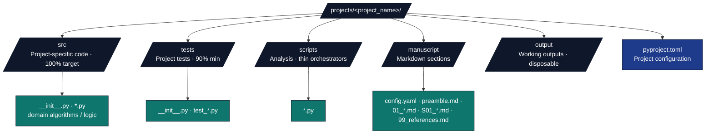
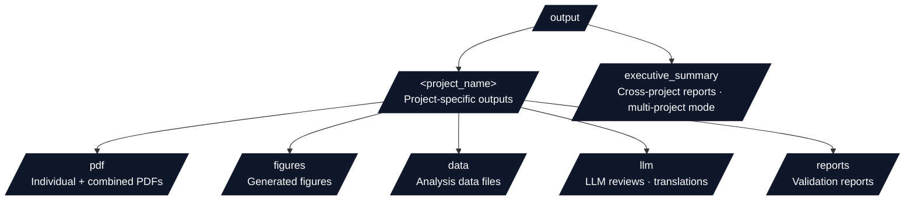

# CLAUDE.md

This file provides guidance to Claude Code (claude.ai/code) when working with code in this repository.

## Overview

This is a research project template with a test-driven development workflow, automated PDF generation, and multi-project support. It uses a two-layer architecture separating generic infrastructure (Layer 1) from project-specific code (Layer 2), following a thin orchestrator pattern.

### How this file fits with other entry points

| File | Use when you need |
| --- | --- |
| [`README.md`](README.md) | First-time setup, documentation map, contributor links |
| **This file (`CLAUDE.md`)** | Copy-paste commands, CI parity, common code patterns |
| [`AGENTS.md`](AGENTS.md) | Full pipeline semantics, validation, configuration reference, troubleshooting index |
| [`.cursorrules`](.cursorrules) | Cursor-focused agent rules (overlap with this file by design) |
| [`.github/AGENTS.md`](.github/AGENTS.md) | Exact CI job names, coverage thresholds, branch protection hints |

## Quick Reference

| Task | Command |
| --- | --- |
| Interactive menu | `./run.sh` |
| Secure workflow via main shell (`secure` subcommand) | `./run.sh --secure-run` |
| Full pipeline | `./run.sh --pipeline` |
| Core pipeline (no LLM) | `uv run python scripts/execute_pipeline.py --project {name} --core-only` |
| Incremental pipeline (opt-in stage skipping) | `uv run python scripts/execute_pipeline.py --project {name} --incremental` (also `python -m infrastructure.orchestration pipeline --project {name} --incremental`; default off) |
| Project pipeline tests | `uv run python scripts/01_run_tests.py --project {name}` |
| Full infrastructure gate | `uv run python scripts/01_run_tests.py --infra-only --infra-scope full` |
| Single test | `uv run pytest path/to/test.py::test_function -v` |
| Install deps | `uv sync` (root `default-groups`: `dev`, `rendering`, `discopy`, `steganography`; add `--group monitoring` to mirror CI extras) |
| Editor Python | `.venv/bin/python` after `uv sync` (see `.vscode/settings.json`) |
| Public CI source paths | `uv run python -m infrastructure.project.public_scope source-paths` |
| Ruff (CI scope) | `uv run python -m infrastructure.project.public_scope source-paths \| xargs uvx ruff check --fix && uv run python -m infrastructure.project.public_scope source-paths \| xargs uvx ruff format` |
| Mypy (CI scope) | `uv run python -m infrastructure.project.public_scope source-paths \| xargs uv run mypy` |
| Bandit (CI / security job) | `uv run bandit -c bandit.yaml -r -ll infrastructure/ scripts/ projects/` (exclusions in `bandit.yaml` → `exclude_dirs`) |
| Pre-commit (lint stage) | `pre-commit run --all-files` |
| Pre-push hooks | `pre-commit run --hook-stage pre-push --all-files` |
| Local CI reproduction (act + fallback) | `./scripts/ci_local.sh` (added 2026-05-20; see [`docs/maintenance/ci-local.md`](docs/maintenance/ci-local.md)) |
| Executable bundle (opt-in Stage 10) | `uv run python scripts/08_executable_bundle.py --project {name}` |
| Archive publication dry-run (opt-in Stage 11) | `uv run python scripts/09_archive_publication.py --project {name}` |
| Archive publication real deposit | `uv run python scripts/09_archive_publication.py --project {name} --providers zenodo software_heritage ipfs_pinata --commit` (requires credentials — see [`docs/maintenance/archival-targets.md`](docs/maintenance/archival-targets.md)) |
| Unified project release (GitHub + Zenodo + DOI) | `uv run python scripts/publish_project_release.py --project {name} --tag v1.0.0 --repo owner/repo` (opt-in; see [`docs/guides/publishing-guide.md`](docs/guides/publishing-guide.md)) |
| Reproduction bundle (single / all public exemplars) | `uv run python scripts/10_repro_bundle.py build {name}` or `... build --all-public --out output/repro_bundles` (verify with `... verify <manifest>`) |
| Regression tests (claim-binding tier) | `uv run pytest tests/regression/ -v` (see [`docs/maintenance/regression-testing.md`](docs/maintenance/regression-testing.md)) |
| Repo-wide doc linter | `uv run python scripts/lint_docs.py` |
| Exemplar drift checker | `uv run python scripts/check_template_drift.py` (add `--strict` for focused gates) |
| Module line count gate | `uv run python scripts/gates/module_line_count_check.py` |
| CodeGraph local commands | `uv run python scripts/maintenance/codegraph_local.py commands .` (optional; see [`docs/guides/codegraph-local.md`](docs/guides/codegraph-local.md)) |
| Unified health CLI | `uv run python -m infrastructure.core.health` (optional `--gates=module-line-count`) |
| Release-readiness dashboard (no network) | `uv run python -m infrastructure.reporting.release_readiness --out output/release_readiness.md` (add `--format html`; aggregates version/coverage/pipeline/docs-lint/evidence-graph from local artifacts only) |
| Opt-in security scan | `uv run python scripts/gates/security_scan.py` (not default pipeline/CI; missing tools report `skipped`, not clean) |
| Deep research dispatch (opt-in, **PAID** ≈$2/report OpenAI, ≈$25 Gemini) | `uv sync --group deep-research`, then `uv run python -m infrastructure.search.deep_research providers\|submit\|poll\|run-project` — cost model + multi-project loop recipe in [`infrastructure/search/deep_research/README.md`](infrastructure/search/deep_research/README.md); never default pipeline/CI |

### CI mirror (GitHub Actions)

Workflow definitions: [`.github/workflows/ci.yml`](.github/workflows/ci.yml). Job names, matrix (Ubuntu/macOS × Python 3.10–3.12), coverage floors (infra 60%, project 90%), and local reproduction commands: [`.github/AGENTS.md`](.github/AGENTS.md).

## Common Commands

### Pipeline Execution

```bash
# Interactive menu (recommended)
./run.sh

# Secure orchestration (same Python CLI as ./run.sh; forwards to `secure` subcommand)
./run.sh --secure-run

# Dedicated secure shell: ensures `uv sync --group steganography`, then `python -m infrastructure.orchestration secure`
# Pipeline phase requires `--project`; omit `--project` only with `--steganography-only` (all discovered projects).
./secure_run.sh --project {project_name}
./secure_run.sh --project {project_name} --core-only
./secure_run.sh --steganography-only --project {project_name}
./secure_run.sh --steganography-only

# Full pipeline default path (10 core+LLM stages; pipeline.yaml declares two additional opt-in bundle/archival stages)
./run.sh --pipeline

# Core pipeline only (8 stages — LLM review and LLM translations excluded)
uv run python scripts/execute_pipeline.py --project {project_name} --core-only

# Resume from checkpoint
./run.sh --pipeline --resume

# Deterministic steganography timestamps (also strips `--deterministic` in secure_run.sh)
./secure_run.sh --deterministic --project {project_name}
```

### Testing

```bash
# Run all tests (infrastructure + project)
uv run python scripts/01_run_tests.py --project {project_name}

# Infrastructure tests only (60% coverage minimum)
uv run pytest tests/infra_tests/ --cov=infrastructure --cov-fail-under=60

# Faster infra run: parallelize across cores with pytest-xdist (CI uses -n auto).
# The suite is parallel-safe (per-test tmp_path + random-port httpserver);
# pytest-cov combines per-worker data before the coverage gate.
# On loaded dev machines (resident Ollama/LLM server, many cores) -n auto can
# trip the wall-clock timeouts of real LaTeX/subprocess tests nondeterministically;
# drop to a fixed worker count (e.g. -n 6) — failures that vanish serially are
# load contention, not code defects.
uv run pytest tests/infra_tests/ -n auto --cov=infrastructure --cov-fail-under=60

# Project tests only (90% coverage minimum)
uv run pytest projects/{project_name}/tests/ --cov=projects/{project_name}/src --cov-fail-under=90

# Run specific test file
uv run pytest tests/infra_tests/test_specific.py -v

# Run single test function
uv run pytest tests/infra_tests/test_specific.py::test_function_name -v

# Coverage files are isolated per suite (.coverage.infra, .coverage.project)
```

### Development Tools

```bash
# Install dependencies
uv sync

# Workspace management
uv run python scripts/maintenance/manage_workspace.py status
uv run python scripts/maintenance/manage_workspace.py add <package> --project <name>

# Linting and type checking (mirror CI `lint` job)
uv run python -m infrastructure.project.public_scope source-paths | xargs uvx ruff check --fix
uv run python -m infrastructure.project.public_scope source-paths | xargs uvx ruff format
uv run python -m infrastructure.project.public_scope source-paths | xargs uv run mypy

# Security scan (mirror CI `security` job Bandit step)
uv run bandit -c bandit.yaml -r -ll infrastructure/ scripts/ projects/

# Validate markdown
uv run python -m infrastructure.validation.cli markdown projects/{project_name}/manuscript/

# Validate PDFs
uv run python -m infrastructure.validation.cli pdf output/{project_name}/pdf/

# Local Ollama workflow
ollama serve
ollama pull gemma3:4b
uv run pytest tests/infra_tests/llm/ -m requires_ollama -v

# Optional local CodeGraph index (not a CI or publication dependency)
uv run python scripts/maintenance/codegraph_local.py commands .
codegraph init "$(pwd)" --index
codegraph files "$(pwd)" --json | uv run python scripts/maintenance/codegraph_local.py verify-scope

# Generate API documentation (positional SRC_DIR GLOSSARY_MD; no --project flag)
uv run python -m infrastructure.documentation.generate_glossary_cli projects/{project_name}/src projects/{project_name}/manuscript/98_symbols_glossary.md

# Agent SKILL.md manifest (Cursor / editors)
uv run python -m infrastructure.skills write
uv run python -m infrastructure.skills check
```

### Multi-Project Operations

```bash
# Run all projects with full pipeline
./run.sh --all-projects --pipeline

# Run all projects with core pipeline only
uv run python scripts/execute_multi_project.py --no-llm

# List available projects
uv run python -c "from infrastructure.project.discovery import discover_projects; from pathlib import Path; print([p.name for p in discover_projects(Path('.'))])"
```

**Public active projects:** Authoritative list → [`docs/_generated/active_projects.md`](docs/_generated/active_projects.md) (`infrastructure.project.public_scope`). Runtime `discover_projects()` may include local private symlinks.

**🔒 CONFIDENTIALITY INVARIANT (public repo).** Only these public canonical
exemplars — all under the git-tracked `projects/templates/` typed subfolder — are
ever git-tracked/pushed:
- [`projects/templates/template_active_inference/`](projects/templates/template_active_inference/) — Active Inference multi-track template (analytical, pymdp, sheaf manuscript, Lean/GNN/ontology)
- [`projects/templates/template_autoresearch_project/`](projects/templates/template_autoresearch_project/) — deterministic AutoResearch template
- [`projects/templates/template_autoscientists/`](projects/templates/template_autoscientists/) — deterministic coordination-mechanism testbed exemplar (arXiv:2605.28655 primitives)
- [`projects/templates/template_code_project/`](projects/templates/template_code_project/) — code-centric template
- [`projects/templates/template_newspaper/`](projects/templates/template_newspaper/) — data-driven large-format newspaper layout engine (ReportLab broadsheet)
- [`projects/templates/template_prose_project/`](projects/templates/template_prose_project/) — prose-centric template
- [`projects/templates/template_sia/`](projects/templates/template_sia/) — SIA self-improvement harness template (fixture replay by default)
- [`projects/templates/template_template/`](projects/templates/template_template/) — autopoietic meta-template (introspects infrastructure and public exemplar roster)
- [`projects/templates/template_textbook/`](projects/templates/template_textbook/) — modular, fillable book-length manuscript scaffold (config-driven parts/chapters/labs)

`.gitignore` ignores `projects/*` and negates **only** `projects/templates/`
(the public exemplars) plus the repo-level `projects/*.md` docs. **Every other
path under `projects/` — optional `active/` hot-seat render set, the `working/`
and `archive/` sidecar mirrors, optional legacy `published/` and `other/`
lifecycle folders, plus the optional
`template_search_project` literature-search exemplar — is LOCAL-ONLY and must
never be committed.** This is enforced, not conventional:
`scripts/check_tracked_projects.py` fails the CI `lint` job and the pre-push
`pre-push-quick` hook on any non-template tracked project (a `git add -f`
cannot slip past it). `template_search_project` rests in
[`projects/archive/template_search_project/`](projects/archive/template_search_project/);
copy it under `projects/active/` **locally** to exercise the literature-search
workflow, then never commit it.

Private work lives outside this public repo, usually at the sibling
`$TEMPLATE_PRIVATE_PROJECTS_ROOT`/`../projects` sidecar. The current simplified
sidecar uses `working/` and `archive/`; optional legacy `active/`, `published/`,
and `other/` folders are still supported when present. `run.sh` and
`python -m infrastructure.orchestration` auto-sync existing folders as symlinks
into matching typed subfolders under `projects/`: `working/*` →
`projects/working/*`, `archive/*` → `projects/archive/*`, and optional
`active/*` → `projects/active/*` (discovered + rendered alongside the
`templates/` exemplars). Inspect with
`uv run python -m infrastructure.orchestration link-projects --dry-run`;
override the root with `TEMPLATE_PRIVATE_PROJECTS_ROOT` or `.private_projects_root`;
disable one command with `TEMPLATE_SKIP_LINK_SYNC=1`. Rotating sidecar projects
usually move between `working/` and `archive/`; never hard-code their paths in
long-lived docs.
**Backburner & archived projects:** remain non-rendered unless rendered through
an explicit qualified command such as `--project working/<name>` (see
[`docs/maintenance/private-projects-repo.md`](docs/maintenance/private-projects-repo.md)).

## Architecture

### Two-Layer System

#### Layer 1: Infrastructure (Generic, Reusable)

- `infrastructure/` - Generic build and validation tools
- `scripts/` - Entry point orchestrators (00-07)
- `tests/` - Infrastructure test suite

#### Layer 2: Projects (Domain-Specific)

- `projects/{name}/src/` - Project-specific algorithms and code
- `projects/{name}/tests/` - Project test suite
- `projects/{name}/scripts/` - Analysis scripts (thin orchestrators)
- `projects/{name}/manuscript/` - Markdown manuscript sections
- `projects/{name}/output/` - Working outputs (disposable)
- `output/{name}/` - Final deliverables

### Thin Orchestrator Pattern

**CRITICAL PRINCIPLE**: All business logic resides in either `infrastructure/` (generic) or `projects/{name}/src/` (project-specific). Scripts are lightweight coordinators that:

1. Import methods from infrastructure or project modules
2. Handle I/O, visualization, and orchestration
3. Never implement algorithms or business logic
4. Use tested methods for all computation

**Example**:

```python
# BAD: Logic in script
def calculate_average(data):
    return sum(data) / len(data)

# GOOD: Script imports from src/
from projects.my_project.src.statistics import calculate_average

data = [1, 2, 3, 4, 5]
avg = calculate_average(data)  # Use tested method
```

### Infrastructure Modules

- `infrastructure/config/` - Repository-wide configuration and defaults
- `infrastructure/core/` - Core utilities (logging, exceptions, file operations, pipeline, telemetry, security)
- `infrastructure/docker/` - Docker containerization settings and configuration
- `infrastructure/doctor/` - Repository health diagnostics and self-check tooling
- `infrastructure/documentation/` - Figure management, API docs, glossary generation
- `infrastructure/llm/` - Local LLM integration (Ollama) for reviews and translations
- `infrastructure/orchestration/` - Pipeline/multi-project/secure CLI entrypoints (`python -m infrastructure.orchestration`)
- `infrastructure/project/` - Multi-project discovery and management
- `infrastructure/prose/` - Prose-manuscript analysis helpers (prose-centric projects)
- `infrastructure/publishing/` - Academic publishing tools (DOI, citations, Zenodo, arXiv)
- `infrastructure/reference/` - Citation and reference-management utilities
- `infrastructure/rendering/` - Multi-format rendering (PDF, HTML, slides)
- `infrastructure/reporting/` - Pipeline reporting and error aggregation
- `infrastructure/scientific/` - Scientific computing best practices and benchmarking
- `infrastructure/search/` - Literature search and reference discovery
- `infrastructure/skills/` - Programmatic AI skill discovery and manifest generation
- `infrastructure/steganography/` - Cryptographic PDF watermarking and verification
- `infrastructure/validation/` - PDF, output, and markdown integrity validation

## Project Structure

### Typed Subfolders under `projects/`

All project lifecycle state is expressed as typed subfolders under `projects/`:

- **`projects/templates/`** — public exemplars from [`docs/_generated/active_projects.md`](docs/_generated/active_projects.md), git-tracked in this repo (discovered + rendered).
- **`projects/active/`** — optional hot-seat render set: symlinks to deliberately reintroduced private `active/` projects (discovered + rendered alongside exemplars when present).
- **`projects/working/`** — non-rendered symlinks to the private sidecar's `working/` projects; render explicitly with qualified names such as `working/<name>`.
- **`projects/archive/`** — non-rendered symlinks to the private sidecar's `archive/` projects (retired / historical).
- **`projects/published/` and `projects/other/`** — optional legacy non-rendered mirrors when those sidecar folders exist.
- **Private `docxology/projects` repo** — the primary home for real projects, with simplified default folders `working/` and `archive/`. See [`docs/maintenance/private-projects-repo.md`](docs/maintenance/private-projects-repo.md).

Discovery renders only `projects/templates/*` and optional `projects/active/*` (qualified names `templates/<name>` and `active/<name>`); `working/` and `archive/` are linked for explicit targeted work but never default-rendered.

**Current active projects:** See [`docs/_generated/active_projects.md`](docs/_generated/active_projects.md) (do not hard-code names in docs).
**Backburner / archived projects:** in the private repo's `working/` and `archive/` folders.

To render a private working project: sync links, then run an explicit qualified command such as `uv run python scripts/03_render_pdf.py --project working/<name>`.
To retire one: move it from sidecar `working/` to sidecar `archive/`.

### Standard Project Layout



### Output Organization



## Pipeline Stages

### Full Pipeline (default 10-stage path; 12 declared stages)

0. **Clean Output Directories** - Remove previous outputs for a fresh run
1. **Environment Setup** - Validate dependencies, discover projects
2. **Infrastructure Tests** - Run the focused `pipeline-smoke` infrastructure contract by default; use `--infra-scope full` for the coverage-bearing repo gate
3. **Project Tests** - Project test suite (90% coverage minimum)
4. **Run Analysis** - Execute `projects/{name}/scripts/` to generate figures/data
5. **Render PDF** - Convert markdown to professional PDFs
6. **Validate Output** - Quality checks on PDFs and content
7. **LLM Scientific Review** - AI-powered manuscript analysis (optional, requires Ollama)
8. **LLM Translations** - Multi-language technical abstract generation (optional, requires Ollama)
9. **Copy Outputs** - Copy final deliverables to `output/<name>/`

**Stage numbering (canonical phrasing — keep in sync with AGENTS.md and README.md):**

> The default [`pipeline.yaml`](infrastructure/core/pipeline/pipeline.yaml) declares **12 named stages**: 8 core stages, 2 optional LLM stages, and 2 opt-in bundle/archival stages. Default full runs include the 10 core+LLM stages (`Clean Output Directories` plus nine numbered stages). `--core-only` runs **8 stages** by excluding the two LLM-tagged stages. Bundle and archival stages are declared for contracts but invoked separately when needed.

**Note:** Executive Report (cross-project metrics and dashboards) runs automatically in multi-project mode when 2+ projects are executed (not counted as a numbered stage).

## Testing Requirements

### No Mocks Policy

**ABSOLUTE REQUIREMENT**: Never use `MagicMock`, `mocker.patch`, `unittest.mock`, or any mocking framework. All tests must use data and computations.

**Patterns**:

- HTTP testing: Use `pytest-httpserver` for local test servers
- CLI testing: Execute subprocess commands
- PDF testing: Create PDFs with `reportlab`
- File operations: Use real temp files with `tmp_path` fixture

### Coverage Requirements

- **Infrastructure**: 60% minimum (measured baseline → [`docs/development/coverage-gaps.md`](docs/development/coverage-gaps.md))
- **Projects (per-project standalone)**: 90% minimum. Exemplar measured coverage → [`docs/_generated/canonical_facts.md`](docs/_generated/canonical_facts.md). Per-project gate: `uv run pytest projects/{name}/tests/ --cov=projects/{name}/src --cov-fail-under=90`.
  - **Rotating-project exceptions**: a CI matrix job may pin a lower floor for a checked-out rotating project (e.g. an 89% gate for a Lean-toolchain project) when its Lean build + live external CLI + Ollama-gated paths carry CI-only surface below the 90% floor. The exception applies only while that project is checked out under `projects/`; raise back to 90% once that surface is covered.
- **Combined-union public-project gate**: 75% (`scripts/01_run_tests.py --project-only --all-projects --public-projects`; `DEFAULT_FAIL_UNDER` in `infrastructure/core/test_runner.py`). Deliberately lower than the per-project floor: per-project suites only cover their own `src/`, so the union denominator spans the public exemplar source set. Local `--all-projects` without `--public-projects` still runs every discovered project in the checkout and may include rotating private symlinks. Per-project floors are unchanged and remain authoritative.
- **No mocks**: All tests use real numerical examples
- **Deterministic**: Fixed RNG seeds for reproducibility

### Running Tests

```bash
# All tests
uv run python scripts/01_run_tests.py --project {project_name}

# With coverage report
uv run pytest tests/infra_tests/ --cov=infrastructure --cov-report=html
uv run pytest projects/{name}/tests/ --cov=projects/{name}/src --cov-report=html

# Specific test
uv run pytest tests/infra_tests/test_specific.py::test_function -v
```

## Configuration

### Project Metadata (`projects/{name}/manuscript/config.yaml`)

```yaml
paper:
  title: "Your Research Title"
  version: "1.0"

authors:
  - name: "Author Name"
    orcid: "0000-0000-0000-0000"
    email: "author@example.com"
    affiliation: "Institution"
    corresponding: true

publication:
  doi: "10.5281/zenodo.12345678"  # Optional

keywords:
  - "keyword1"
  - "keyword2"

llm:
  translations:
    enabled: true
    languages: [zh, hi, ru]
```

### Environment Variables

- `LOG_LEVEL` - Logging verbosity (0=DEBUG, 1=INFO, 2=WARN, 3=ERROR)
- `AUTHOR_NAME` - Override config file author
- `PROJECT_TITLE` - Override config file title
- `MPLBACKEND=Agg` - Headless matplotlib (automatically set)

### IDE Integration

```bash
# Set Python path for IDE/editor integration
export PYTHONPATH=".:infrastructure:projects/templates/template_code_project/src"
```

## Development Workflow

### Adding Features

1. Write tests first (TDD) in `projects/{name}/tests/` or `tests/infra_tests/`
2. Implement in `projects/{name}/src/` or `infrastructure/`
3. Ensure coverage requirements met
4. Update documentation if needed
5. Run full pipeline to validate

### Creating New Projects

```bash
# Create project structure
mkdir -p projects/my_project/{src,tests,scripts,manuscript}
touch projects/my_project/src/__init__.py
touch projects/my_project/tests/__init__.py

# Copy config template
cp projects/templates/template_code_project/manuscript/config.yaml projects/my_project/manuscript/

# Create pyproject.toml (see existing projects for template)

# Run pipeline
./run.sh --project my_project --pipeline
```

### Working with Scripts

Scripts in `projects/{name}/scripts/` should:

- Import from `projects/{name}/src/` for computation
- Import from `infrastructure/` for utilities
- Handle only I/O, visualization, and orchestration
- Print output paths to stdout for manifest collection
- Use `MPLBACKEND=Agg` for headless plotting
- Generate deterministic outputs with fixed seeds

## Key Architectural Principles

1. **Single Source of Truth**: Business logic lives only in `infrastructure/` or `projects/{name}/src/`
2. **Test-Driven Development**: 90%+ coverage enforced before PDF generation
3. **Thin Orchestrator Pattern**: Scripts coordinate, modules implement
4. **No Mocks**: All tests use data and computations
5. **Multi-Project Support**: One repository, multiple independent projects
6. **Reproducibility**: Deterministic outputs with fixed seeds
7. **Disposable Outputs**: Everything in `output/` is regeneratable

## Common Patterns

### Adding a New Analysis Script

```python
#!/usr/bin/env python3
"""Analysis script following thin orchestrator pattern."""

from pathlib import Path
from projects.my_project.src.analysis import run_analysis
from infrastructure.core.logging.utils import get_logger

logger = get_logger(__name__)

def main():
    output_dir = Path("projects/my_project/output/figures")
    output_dir.mkdir(parents=True, exist_ok=True)

    # Use project methods for computation
    results = run_analysis()  # From src/

    # Script handles visualization only
    import matplotlib.pyplot as plt
    plt.figure()
    plt.plot(results)
    output_path = output_dir / "analysis.png"
    plt.savefig(output_path)

    # Print path for manifest collection
    print(str(output_path))

if __name__ == "__main__":
    main()
```

### Adding a Test

```python
#!/usr/bin/env python3
"""Test following no-mocks policy."""

import pytest
from pathlib import Path
from projects.my_project.src.analysis import run_analysis

def test_analysis_produces_correct_output(tmp_path):
    """Test with data and computation."""
    # Use data
    input_data = [1.0, 2.0, 3.0, 4.0, 5.0]

    # Execute computation
    result = run_analysis(input_data)

    # Validate real output
    assert len(result) == 5
    assert abs(result[0] - 1.0) < 1e-6
```

### Adding Infrastructure Module

```python
#!/usr/bin/env python3
"""New infrastructure module.

All infrastructure modules must:
1. Have docstrings
2. Include type hints on all public APIs
3. Be generic and reusable across projects
4. Have 60%+ test coverage
"""

from pathlib import Path
from typing import List

def process_files(input_dir: Path) -> List[Path]:
    """Process files in directory.

    Args:
        input_dir: Directory containing files to process

    Returns:
        List of processed file paths
    """
    # Implementation
    pass
```

## Troubleshooting

### Common Issues

**Tests Failing**: Check coverage requirements met (60% infra, 90% project)

```bash
uv run pytest --cov=infrastructure --cov-report=term-missing
```

**PDF Generation Fails**: Validate LaTeX packages

```bash
uv run python -m infrastructure.rendering.latex_package_validator
sudo tlmgr install multirow cleveref doi newunicodechar
```

**Import Errors**: Ensure project structure correct

```bash
uv run python -c "import sys; sys.path.insert(0, 'projects/{name}/src'); import {module}"
```

**Markdown Validation Errors**: Check image paths and references

```bash
uv run python -m infrastructure.validation.cli markdown projects/{name}/manuscript/
```

### Debug Mode

```bash
export LOG_LEVEL=0  # Enable debug logging
uv run python scripts/03_render_pdf.py --project {name}
```

## Documentation Resources

- **README.md** - Project overview and quick start
- **.cursorrules** - Cursor agent rules (overlap with this file on commands and architecture)
- **AGENTS.md** - System reference (configuration, modules, troubleshooting details)
- **.github/README.md** / **.github/AGENTS.md** - CI workflows, Dependabot, PR templates; local parity via **`.pre-commit-config.yaml`**
- **[docs/RUN_GUIDE.md](docs/RUN_GUIDE.md)** - Pipeline execution documentation
- **docs/core/architecture.md** - Detailed architecture guide
- **docs/core/workflow.md** - Development workflow details
- **docs/core/how-to-use.md** - Usage guide (12 skill levels)
- **docs/documentation-index.md** - Documentation inventory (authoritative file list)

## Important Notes

- All files in `output/` are disposable and regeneratable
- Never commit generated outputs to version control
- Install **pre-commit** hooks after `uv sync` so Ruff, mypy, Bandit, and push-time checks run locally (see `.pre-commit-config.yaml`)
- Always run tests before committing changes
- Follow thin orchestrator pattern strictly
- No mocks allowed in tests (use `pytest-httpserver` for HTTP, real files for I/O)
- Maintain 90%+ test coverage for project code, 60%+ for infrastructure
- Use `uv` for dependency management (recommended)
- Pipeline can be resumed from checkpoints with `--resume`
- Tests timeout after 10 seconds by default (configurable in pyproject.toml)


<!-- BEGIN:STAGE_TABLE -->
<!-- This block is generated from [`infrastructure/core/pipeline/pipeline.yaml`](infrastructure/core/pipeline/pipeline.yaml) by `scripts/generate_stage_table_doc.py`. Do not hand-edit. Stage indices are **0-based positions in the YAML** and intentionally do **not** match the `scripts/NN_*.py` numeric prefixes (for example, stage 9 runs `05_copy_outputs.py`). -->

| Stage | Script | Tags | Failure mode |
| ----- | ------ | ---- | ------------ |
| **0** Clean Output Directories | built-in `_run_clean_outputs` | `core`, `clean` | soft fail |
| **1** Environment Setup | `00_setup_environment.py` | `core` | hard fail |
| **2** Infrastructure Tests | `01_run_tests.py --infra-only --verbose --infra-scope pipeline-smoke` | `core`, `tests` | configurable tolerance |
| **3** Project Tests | `01_run_tests.py --project-only --verbose` | `core`, `tests` | configurable tolerance |
| **4** Project Analysis | `02_run_analysis.py` | `core` | hard fail |
| **5** PDF Rendering | `03_render_pdf.py` | `core` | hard fail |
| **6** Output Validation | `04_validate_output.py` | `core` | warning + report |
| **7** LLM Scientific Review | `06_llm_review.py --reviews-only` | `llm` | skipped if Ollama absent |
| **8** LLM Translations | `06_llm_review.py --translations-only` | `llm` | skipped if Ollama absent |
| **9** Copy Outputs | `05_copy_outputs.py` | `core` | soft fail |
| **10** Executable Bundle | `08_executable_bundle.py` | `bundle` | soft fail |
| **11** Archival Publication | `09_archive_publication.py` | `archival` | soft fail |
<!-- END:STAGE_TABLE -->
