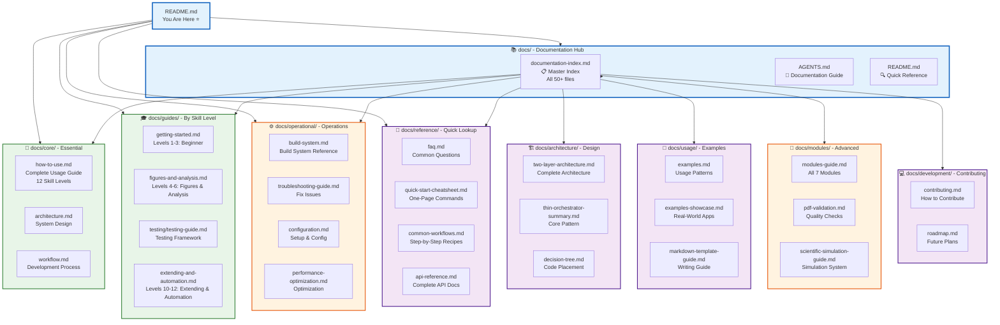
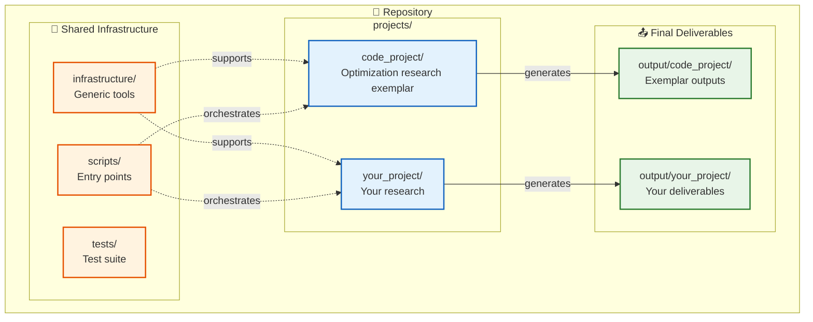
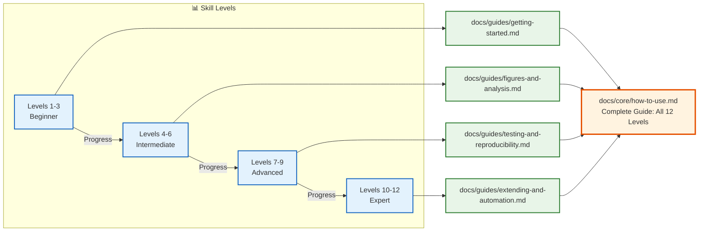
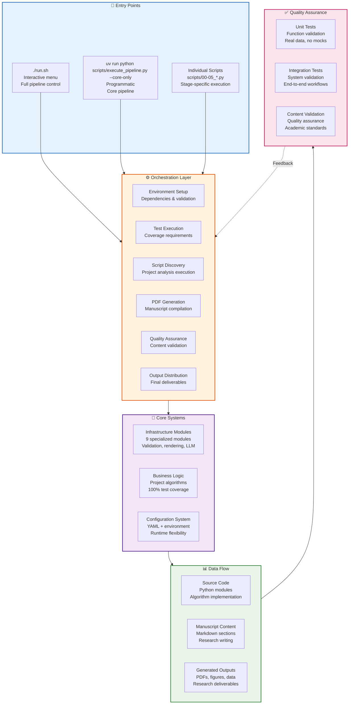
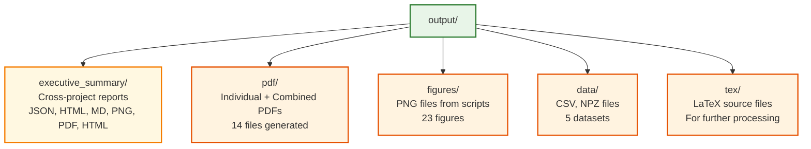
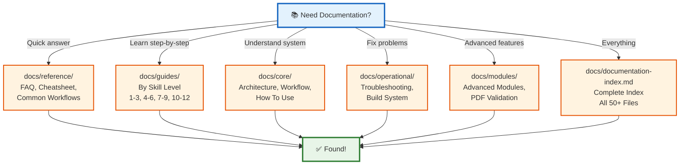

# 🚀 Research Project Template

<!-- Badges below are manually updated after each pipeline run. Run `uv run pytest` to get current coverage numbers. -->
[](docs/RUN_GUIDE.md)
[](docs/RUN_GUIDE.md)
[-brightgreen)](docs/RUN_GUIDE.md)
[](docs/documentation-index.md)
[](https://doi.org/10.5281/zenodo.19139090)

> **📄 Published**: [*A template/ approach to Reproducible Generative Research: Architecture and Ergonomics from Configuration through Publication*](https://zenodo.org/records/19139090) — DOI: [10.5281/zenodo.19139090](https://doi.org/10.5281/zenodo.19139090)
>
> **Template Repository** - Click "Use this template" to create a research project with this structure

A system for research and development projects. This template provides a test-driven structure with automated PDF generation, professional documentation, and validated build pipelines.

## 🎯 What This Template Provides

This is a **GitHub Template Repository** that gives you:

- ✅ **Multi-project support** - Run multiple projects in one repository
- ✅ **Project structure** with clear separation of concerns
- ✅ **Test-driven development** setup with coverage requirements
- ✅ **Automated PDF generation** from markdown sources
- ✅ **Thin orchestrator pattern** for maintainable code
- ✅ **Ready-to-use utilities** for any research project
- ✅ **Professional documentation** structure (50+ guides)
- ✅ **Advanced quality analysis** and document metrics
- ✅ **Reproducibility tools** for scientific workflows
- ✅ **Integrity verification** and validation
- ✅ **Publishing tools** for academic dissemination
- ✅ **Scientific development** best practices
- ✅ **Reporting** with error aggregation and performance metrics

## 🗺️ Choose Your Path

**Select your experience level to get started:**


```mermaid
flowchart TD
    START["👋 Welcome!\nWhat do you need?"]

    START -->|"New to the template"| NEW_USER["📚 New User Path"]
    START -->|"Adding code/figures"| DEVELOPER["💻 Developer Path"]
    START -->|"Contributing code"| CONTRIBUTOR["🤝 Contributor Path"]
    START -->|"Deep technical dive"| ADVANCED["🔬 Advanced Path"]

    NEW_USER --> NS1["📖 docs/guides/getting-started.md\nLevels 1-3: Write Documents"]
    NEW_USER --> NS2["📋 docs/reference/quick-start-cheatsheet.md\nOne-Page Commands"]
    NEW_USER --> NS3["📝 docs/reference/common-workflows.md\nStep-by-Step Recipes"]
    NEW_USER --> NS4["❓ docs/reference/faq.md\nCommon Questions"]

    DEVELOPER --> DS1["🏗️ docs/core/architecture.md\nSystem Design"]
    DEVELOPER --> DS2["📐 docs/architecture/thin-orchestrator-summary.md\nCore Pattern"]
    DEVELOPER --> DS3["⚙️ docs/core/workflow.md\nDevelopment Process"]
    DEVELOPER --> DS4["📝 docs/usage/markdown-template-guide.md\nWriting Guide"]

    CONTRIBUTOR --> CS1["🤝 docs/development/contributing.md\nHow to Contribute"]
    CONTRIBUTOR --> CS2["📋 docs/development/code-of-conduct.md\nCommunity Standards"]
    CONTRIBUTOR --> CS3["🗺️ docs/development/roadmap.md\nFuture Plans"]
    CONTRIBUTOR --> CS4["🧪 docs/development/testing/testing-guide.md\nTesting Framework"]

    ADVANCED --> AS1["📚 AGENTS.md\nComplete System Reference"]
    ADVANCED --> AS2["🔧 docs/RUN_GUIDE.md\nPipeline Orchestration"]
    ADVANCED --> AS3["📑 docs/documentation-index.md\nAll 50+ Files"]
    ADVANCED --> AS4["🔬 docs/modules/modules-guide.md\nAll 7 Modules"]

    classDef start fill:#e3f2fd,stroke:#1565c0,stroke-width:3px
    classDef path fill:#fff3e0,stroke:#e65100,stroke-width:2px
    classDef doc fill:#e8f5e8,stroke:#2e7d32,stroke-width:2px

    class START start
    class NEW_USER,DEVELOPER,CONTRIBUTOR,ADVANCED path
    class NS1,NS2,NS3,NS4,DS1,DS2,DS3,DS4,CS1,CS2,CS3,CS4,AS1,AS2,AS3,AS4 doc
```

### 📚 New Users - Just Getting Started

**Goal:** Write documents and generate PDFs without programming

| Step | Document | Purpose |
|------|---------|---------|
| 1 | **[Quick Start](#quick-start)** | Get running in 5 minutes |
| 2 | **[docs/guides/getting-started.md](docs/guides/getting-started.md)** | Beginner's guide (Levels 1-3) |
| 3 | **[docs/reference/quick-start-cheatsheet.md](docs/reference/quick-start-cheatsheet.md)** | One-page command reference |
| 4 | **[docs/reference/common-workflows.md](docs/reference/common-workflows.md)** | Step-by-step recipes for common tasks |
| 5 | **[docs/core/how-to-use.md](docs/core/how-to-use.md)** | Usage from basic to advanced |
| 6 | **[docs/usage/examples-showcase.md](docs/usage/examples-showcase.md)** | Applications |
| 7 | **[docs/reference/faq.md](docs/reference/faq.md)** | Common questions answered |

**Learn by example:** See **[docs/usage/template-description.md](docs/usage/template-description.md)** and **[docs/usage/examples.md](docs/usage/examples.md)**

### 💻 Developers - Adding Code & Figures

**Goal:** Generate figures, add data analysis, and automate workflows

| Step | Document | Purpose |
|------|---------|---------|
| 1 | **[docs/core/architecture.md](docs/core/architecture.md)** | System design overview |
| 2 | **[docs/architecture/thin-orchestrator-summary.md](docs/architecture/thin-orchestrator-summary.md)** | Core architecture pattern |
| 3 | **[docs/core/workflow.md](docs/core/workflow.md)** | Development process |
| 4 | **[docs/usage/markdown-template-guide.md](docs/usage/markdown-template-guide.md)** | Writing and formatting guide |
| 5 | **[docs/guides/figures-and-analysis.md](docs/guides/figures-and-analysis.md)** | Add figures and automation (Levels 4-6) |

**Advanced topics:** Check **[docs/RUN_GUIDE.md](docs/RUN_GUIDE.md)** and **[docs/modules/pdf-validation.md](docs/modules/pdf-validation.md)**

### 🤝 Contributors - Contributing Code

**Goal:** Improve the template for everyone

| Step | Document | Purpose |
|------|---------|---------|
| 1 | **[docs/development/contributing.md](docs/development/contributing.md)** | How to contribute |
| 2 | **[docs/development/code-of-conduct.md](docs/development/code-of-conduct.md)** | Community standards |
| 3 | **[docs/development/roadmap.md](docs/development/roadmap.md)** | Future plans |
| 4 | **[docs/development/security.md](docs/development/security.md)** | Security practices |

**Recent improvements:** See **[docs/RUN_GUIDE.md](docs/RUN_GUIDE.md)**

### 🔬 Advanced Users - Technical Deep Dive

**Goal:** Understand system internals and additional features

| Step | Document | Purpose |
|------|---------|---------|
| 1 | **[AGENTS.md](AGENTS.md)** | System reference |
| 2 | **[docs/RUN_GUIDE.md](docs/RUN_GUIDE.md)** | Pipeline orchestration reference |
| 3 | **[docs/usage/manuscript-numbering-system.md](docs/usage/manuscript-numbering-system.md)** | Section organization |
| 4 | **[docs/documentation-index.md](docs/documentation-index.md)** | Documentation index |
| 5 | **[docs/modules/modules-guide.md](docs/modules/modules-guide.md)** | All 7 modules |

**Technical resources:** See **[docs/reference/copypasta.md](docs/reference/copypasta.md)** for LaTeX preamble examples

## 🧭 Documentation Hub

**📚 [Documentation Index](docs/documentation-index.md)** | **📖 [Documentation Guide](docs/AGENTS.md)** | **🔍 [Quick Reference](docs/README.md)**

The template includes **105+ documentation files** organized in the `docs/` directory. Use the visual map below to navigate:


```mermaid
graph TB
    README[README.md\nYou Are Here ⭐]

    subgraph DocsHub["📚 docs/ - Documentation Hub"]
        DOC_INDEX[documentation-index.md\n📋 Master Index\nAll 50+ files]
        DOC_AGENTS[AGENTS.md\n📖 Documentation Guide]
        DOC_README[README.md\n🔍 Quick Reference]
    end

    subgraph Core["📖 docs/core/ - Essential"]
        HOW_TO[how-to-use.md\nComplete Usage Guide\n12 Skill Levels]
        ARCH[architecture.md\nSystem Design]
        WORKFLOW[workflow.md\nDevelopment Process]
    end

    subgraph Guides["🎓 docs/guides/ - By Skill Level"]
        GETTING_STARTED[getting-started.md\nLevels 1-3: Beginner]
        FIGURES[figures-and-analysis.md\nLevels 4-6: Figures & Analysis]
        TESTING[testing-and-reproducibility.md\nLevels 7-9: Testing & Reproducibility]
        EXTENDING[extending-and-automation.md\nLevels 10-12: Extending & Automation]
    end

    subgraph Operational["⚙️ docs/operational/ - Operations"]
        BUILD_SYS[build-system.md\nBuild System Reference]
        TROUBLESHOOTING[troubleshooting-guide.md\nFix Issues]
        CONFIG[configuration.md\nSetup & Config]
        PERF[performance-optimization.md\nOptimization]
    end

    subgraph Reference["📑 docs/reference/ - Quick Lookup"]
        FAQ[faq.md\nCommon Questions]
        CHEATSHEET[quick-start-cheatsheet.md\nOne-Page Commands]
        WORKFLOWS[common-workflows.md\nStep-by-Step Recipes]
        API[api-reference.md\nComplete API Docs]
    end

    subgraph Architecture["🏗️ docs/architecture/ - Design"]
        TWO_LAYER[two-layer-architecture.md\nComplete Architecture]
        THIN_ORCH[thin-orchestrator-summary.md\nCore Pattern]
        DECISION[decision-tree.md\nCode Placement]
    end

    subgraph Usage["📝 docs/usage/ - Examples"]
        EXAMPLES[examples.md\nUsage Patterns]
        SHOWCASE[examples-showcase.md\nReal-World Apps]
        MARKDOWN[markdown-template-guide.md\nWriting Guide]
    end

    subgraph Modules["🔬 docs/modules/ - Advanced"]
        ADV_MODULES[modules-guide.md\nAll 7 Modules]
        PDF_VAL[pdf-validation.md\nQuality Checks]
        SCI_SIM[scientific-simulation-guide.md\nSimulation System]
    end

    subgraph Development["💻 docs/development/ - Contributing"]
        CONTRIB[contributing.md\nHow to Contribute]
        TESTING[testing/testing-guide.md\nTesting Framework]
        ROADMAP[roadmap.md\nFuture Plans]
    end

    README --> DocsHub
    README --> Core
    README --> Guides
    README --> Operational
    README --> Reference

    DocsHub --> DOC_INDEX
    DOC_INDEX --> Core
    DOC_INDEX --> Guides
    DOC_INDEX --> Operational
    DOC_INDEX --> Reference
    DOC_INDEX --> Architecture
    DOC_INDEX --> Usage
    DOC_INDEX --> Modules
    DOC_INDEX --> Development

    classDef hub fill:#e3f2fd,stroke:#1565c0,stroke-width:3px
    classDef essential fill:#e8f5e8,stroke:#2e7d32,stroke-width:2px
    classDef operational fill:#fff3e0,stroke:#e65100,stroke-width:2px
    classDef reference fill:#f3e5f5,stroke:#4a148c,stroke-width:2px

    class README,DocsHub hub
    class Core,Guides essential
    class Operational,Modules operational
    class Reference,Architecture,Usage,Development reference
```

## 🔀 Multi-Project Support

This template now supports **multiple research projects** in a single repository. Each project is isolated with its own:

- Source code (`src/`), tests (`tests/`), manuscript (`manuscript/`), and scripts (`scripts/`)
- Working outputs (`projects/{name}/output/`)
- Final deliverables (`output/{name}/...`)


```mermaid
graph TB
    subgraph Repository["📁 Repository"]
        subgraph Projects["projects/"]
            P1[code_project/<br/>Optimization research exemplar]
            PN[your_project/<br/>Your research]
        end

        subgraph Shared["🔧 Shared Infrastructure"]
            INFRA[infrastructure/<br/>Generic tools]
            SCRIPTS[scripts/<br/>Entry points]
            TESTS[tests/<br/>Test suite]
        end

        subgraph Output["📤 Final Deliverables"]
            OUT1[output/code_project/<br/>Exemplar outputs]
            OUTN[output/your_project/<br/>Your deliverables]
        end
    end

    P1 -->|generates| OUT1
    PN -->|generates| OUTN

    INFRA -.->|supports| P1
    INFRA -.->|supports| PN

    SCRIPTS -.->|orchestrates| P1
    SCRIPTS -.->|orchestrates| PN

    classDef project fill:#e3f2fd,stroke:#1565c0,stroke-width:2px
    classDef shared fill:#fff3e0,stroke:#e65100,stroke-width:2px
    classDef output fill:#e8f5e8,stroke:#2e7d32,stroke-width:2px

    class P1,PN project
    class INFRA,SCRIPTS,TESTS shared
    class OUT1,OUTN output
```

### Example Projects

Active projects under `projects/` (discovered by `./run.sh`; list may change):

- **`projects/code_project/`** — Optimization research exemplar
- **`projects/fep_lean/`** — Formal / Lean-oriented manuscript
- **`projects/template/`** — Meta-documentation for the template

**Note:** More exemplars (e.g. `traditional_newspaper`, `medical_ai`, `area_handbook`) live under `projects_archive/` until moved into `projects/`. See [`docs/_generated/active_projects.md`](docs/_generated/active_projects.md) for a generated list from `discover_projects()`.

### Usage

```bash
# Interactive project selection
./run.sh

# Run specific project
./run.sh --project code_project --pipeline

# Run all projects sequentially
./run.sh --all-projects --pipeline
```

### Adding New Projects

Create a new directory under `projects/` with the required structure:

```bash
mkdir -p projects/my_research/{src,tests,manuscript,scripts}
# Add __init__.py files, write code, manuscripts, tests...
```

### 📂 Project Organization: Active vs Archived

The template distinguishes between **active projects** and **archived projects**:

#### ✅ **Active Projects (`projects/`)**

Projects in `projects/` are **actively discovered and executed**:

- **Discovered** by `run.sh` and infrastructure discovery
- **Executed** by all pipeline scripts
- **Listed** in interactive menus
- **Outputs** generated and organized in `output/{name}/`

#### 📦 **Archived Projects (`projects_archive/`)**

Projects in `projects_archive/` are **preserved but not executed**:

- **NOT discovered** by infrastructure
- **NOT executed** by pipeline scripts
- **NOT listed** in menus
- **Available** for historical reference

**Current Active Projects:**

- `code_project/` — Optimization research exemplar
- `fep_lean/` — Formal / Lean-oriented manuscript
- `template/` — Meta-documentation

**To archive a project:** `mv projects/{name}/ projects_archive/{name}/`
**To reactivate:** `mv projects_archive/{name}/ projects/{name}/`

## 🚀 Quick Start {#quick-start}

### Option 1: Use This Template (Recommended)

1. **Click "Use this template"** above to create a new repository
2. **Clone your new repository**
3. **Install dependencies**: `uv sync`
4. **Generate your first document**: `uv run scripts/03_render_pdf.py`

> 🖥️ **Running on a headless cloud server?** See **[docs/CLOUD_DEPLOY.md](docs/CLOUD_DEPLOY.md)** — uv is
> installed automatically when you run `./run.sh --pipeline`.

**📖 Need help?** See **[Getting Started Guide](docs/guides/getting-started.md)** for beginners, **[Quick Start Cheatsheet](docs/reference/quick-start-cheatsheet.md)** for quick reference, or **[How To Use Guide](docs/core/how-to-use.md)** for guidance from basic usage to advanced workflows.

### Option 2: Quick Commands Reference

```bash
# Interactive menu (recommended) - routes to manuscript operations
./run.sh

# Or run the manuscript pipeline directly (includes optional LLM review)
./run.sh --pipeline

# Alternative: Core 10-stage declarative DAG pipeline (no LLM dependencies)
uv run scripts/execute_pipeline.py --core-only

# Run tests with coverage (infrastructure + project)
uv run scripts/01_run_tests.py

# Open generated manuscript
open output/pdf/project_combined.pdf
```

## 📊 System Health & Metrics

**Current Build Status** (See **[RUN_GUIDE.md](docs/RUN_GUIDE.md)** for pipeline details):

```mermaid
graph LR
    subgraph Status["✅ System Status"]
        TESTS[Tests: 3025 passing\n2569 infra [5 skipped] + 456 project\n100% success rate]
        COV[Coverage: 100% project\n83.33% infra\nExceeds requirements]
        BUILD[Build Time: 53s\nOptimal performance\n(without LLM review)]
        PDFS[PDFs: 14/14 generated\nAll sections]
    end

    subgraph Documentation["📚 Documentation"]
        DOCS[105+ documentation files\nComprehensive coverage]
        CROSS[Cross-referencing\nAll links validated]
        EXAMPLES[Examples\nMultiple use cases]
    end

    TESTS --> VERIFIED[✅ System\nOperational]
    COV --> VERIFIED
    BUILD --> VERIFIED
    PDFS --> VERIFIED
    DOCS --> VERIFIED
    CROSS --> VERIFIED
    EXAMPLES --> VERIFIED

    classDef success fill:#e8f5e8,stroke:#2e7d32,stroke-width:3px
    classDef metrics fill:#e3f2fd,stroke:#1565c0,stroke-width:2px

    class VERIFIED success
    class Status,Documentation metrics
```

**Key Metrics:**

- **Test Coverage**: 100% project, 83.33% infrastructure (exceeds requirements) - [Pipeline Guide](docs/RUN_GUIDE.md)
- **Build Time**: 84 seconds (with full test suite) - [Performance Optimization](docs/operational/config/performance-optimization.md)
- **Tests Passing**: 3025 tests (2569 infrastructure [5 skipped] + 456 project) - [Testing Guide](docs/development/testing/testing-guide.md)
- **PDFs Generated**: 14 (all sections) - [Pipeline Guide](docs/RUN_GUIDE.md)
- **Documentation**: 105+ files - [Documentation Index](docs/documentation-index.md)

## 🎓 Skill-Based Learning Paths

**Progressive learning paths** from beginner to expert, organized by skill level:


```mermaid
flowchart LR
    subgraph Levels["📊 Skill Levels"]
        L1[Levels 1-3\nBeginner]
        L2[Levels 4-6\nIntermediate]
        L3[Levels 7-9\nAdvanced]
        L4[Levels 10-12\nExpert]
    end

    L1 -->|Progress| L2
    L2 -->|Progress| L3
    L3 -->|Progress| L4

    L1 --> DOC1[docs/guides/getting-started.md]
    L2 --> DOC2[docs/guides/figures-and-analysis.md]
    L3 --> DOC3[docs/guides/testing-and-reproducibility.md]
    L4 --> DOC4[docs/guides/extending-and-automation.md]

    DOC1 --> MASTER[docs/core/how-to-use.md\nComplete Guide: All 12 Levels]
    DOC2 --> MASTER
    DOC3 --> MASTER
    DOC4 --> MASTER

    classDef level fill:#e3f2fd,stroke:#1565c0,stroke-width:2px
    classDef doc fill:#e8f5e8,stroke:#2e7d32,stroke-width:2px
    classDef master fill:#fff3e0,stroke:#e65100,stroke-width:3px

    class L1,L2,L3,L4 level
    class DOC1,DOC2,DOC3,DOC4 doc
    class MASTER master
```

### 📝 Path 1: Document Creation (Levels 1-3)

**Goal:** Create professional documents without coding

→ **[docs/guides/getting-started.md](docs/guides/getting-started.md)** | **[docs/usage/markdown-template-guide.md](docs/usage/markdown-template-guide.md)** | **[docs/usage/examples.md](docs/usage/examples.md)**

### 🔧 Path 2: Figures & Automation (Levels 4-6)

**Goal:** Generate figures and automate workflows

→ **[docs/guides/figures-and-analysis.md](docs/guides/figures-and-analysis.md)** | **[docs/architecture/thin-orchestrator-summary.md](docs/architecture/thin-orchestrator-summary.md)** | **[docs/usage/examples-showcase.md](docs/usage/examples-showcase.md)**

### 🧪 Path 3: Test-Driven Development (Levels 7-9)

**Goal:** Build with test coverage and automation

→ **[docs/guides/testing-and-reproducibility.md](docs/guides/testing-and-reproducibility.md)** | **[docs/core/architecture.md](docs/core/architecture.md)** | **[docs/core/workflow.md](docs/core/workflow.md)** | **[docs/RUN_GUIDE.md](docs/RUN_GUIDE.md)**

### 🏗️ Path 4: System Architecture (Levels 10-12)

**Goal:** Deep dive into architecture and advanced features

→ **[docs/guides/extending-and-automation.md](docs/guides/extending-and-automation.md)** | **[AGENTS.md](AGENTS.md)** | **[docs/architecture/two-layer-architecture.md](docs/architecture/two-layer-architecture.md)** | **[docs/modules/modules-guide.md](docs/modules/modules-guide.md)**

**📖 Guide:** **[docs/core/how-to-use.md](docs/core/how-to-use.md)** covers all 12 skill levels from basic to expert

## 🏗️ Project Structure

The project follows a **two-layer architecture** with clear separation of concerns:

```mermaid
graph TB
    subgraph L1["🔧 Layer 1: Infrastructure (Generic, Reusable)"]
        INFRA[infrastructure/\nGeneric tools\nBuild and validation\n📖 infrastructure/AGENTS.md]
        INFRA_SCRIPTS[scripts/\nEntry point orchestrators\ncore pipeline or full pipeline\n📖 scripts/AGENTS.md]
        TESTS[tests/\nTest suite\nComprehensive coverage\n📖 tests/AGENTS.md]
    end

    subgraph L2["🔬 Layer 2: Project-Specific (Customizable)"]
        SRC[projects/{name}/src/\nScientific algorithms\n100% tested]
        SCRIPTS[projects/{name}/scripts/\nAnalysis scripts\nThin orchestrators]
        PROJECT_TESTS[projects/{name}/tests/\nProject test suite]
    end

    subgraph DOCS["📚 Documentation Hub"]
        DOCS_DIR[docs/\n50+ guides\n📖 docs/documentation-index.md]
    end

    subgraph CONTENT["📝 Content & Output"]
        MANUSCRIPT[projects/{name}/manuscript/\nResearch sections\nGenerate PDFs]
        OUTPUT[output/\nGenerated files\nPDFs, figures, data\nAll files disposable]
    end

    SRC -->|import and use| SCRIPTS
    SRC -->|import and use| INFRA_SCRIPTS
    INFRA -->|provide utilities| SCRIPTS
    SCRIPTS -->|generate| OUTPUT
    INFRA_SCRIPTS -->|orchestrate pipeline| TESTS
    INFRA_SCRIPTS -->|orchestrate pipeline| SCRIPTS
    MANUSCRIPT -->|reference| OUTPUT
    TESTS -->|validate| SRC
    PROJECT_TESTS -->|validate| SRC
    DOCS_DIR -.->|documents| INFRA
    DOCS_DIR -.->|documents| SRC

    classDef layer1 fill:#e1f5fe,stroke:#01579b,stroke-width:2px
    classDef layer2 fill:#f3e5f5,stroke:#4a148c,stroke-width:2px
    classDef docs fill:#fff3e0,stroke:#e65100,stroke-width:3px
    classDef content fill:#e8f5e8,stroke:#1b5e20,stroke-width:2px

    class INFRA,INFRA_SCRIPTS,TESTS layer1
    class SRC,SCRIPTS,PROJECT_TESTS layer2
    class DOCS_DIR docs
    class MANUSCRIPT,OUTPUT content
```

### System Architecture Overview


```mermaid
graph TB
    subgraph Entry["🚀 Entry Points"]
        RUNSH[./run.sh\nInteractive menu\nFull pipeline control]
        RUNALL[uv run python scripts/execute_pipeline.py --core-only\nProgrammatic\nCore pipeline]
        INDIVIDUAL[Individual Scripts\nscripts/00-05_*.py\nStage-specific execution]
    end

    subgraph Orchestration["⚙️ Orchestration Layer"]
        SETUP[Environment Setup\nDependencies & validation]
        TESTING[Test Execution\nCoverage requirements]
        ANALYSIS[Script Discovery\nProject analysis execution]
        RENDERING[PDF Generation\nManuscript compilation]
        VALIDATION[Quality Assurance\nContent validation]
        DELIVERY[Output Distribution\nFinal deliverables]
    end

    subgraph Core["🧠 Core Systems"]
        INFRASTRUCTURE[Infrastructure Modules\n9 specialized modules\nValidation, rendering, LLM]
        BUSINESS_LOGIC[Business Logic\nProject algorithms\n100% test coverage]
        CONFIGURATION[Configuration System\nYAML + environment\nRuntime flexibility]
    end

    subgraph Data["📊 Data Flow"]
        SOURCE_CODE[Source Code\nPython modules\nAlgorithm implementation]
        MANUSCRIPT_CONTENT[Manuscript Content\nMarkdown sections\nResearch writing]
        GENERATED_OUTPUTS[Generated Outputs\nPDFs, figures, data\nResearch deliverables]
    end

    subgraph Quality["✅ Quality Assurance"]
        UNIT_TESTS[Unit Tests\nFunction validation\nReal data, no mocks]
        INTEGRATION_TESTS[Integration Tests\nSystem validation\nEnd-to-end workflows]
        VALIDATION_CHECKS[Content Validation\nQuality assurance\nAcademic standards]
    end

    RUNSH --> Orchestration
    RUNALL --> Orchestration
    INDIVIDUAL --> Orchestration

    Orchestration --> Core
    Core --> Data
    Data --> Quality

    Quality -.->|Feedback| Orchestration

    classDef entry fill:#e3f2fd,stroke:#1565c0,stroke-width:2px
    classDef orchestration fill:#fff3e0,stroke:#e65100,stroke-width:2px
    classDef core fill:#f3e5f5,stroke:#4a148c,stroke-width:2px
    classDef data fill:#e8f5e8,stroke:#2e7d32,stroke-width:2px
    classDef quality fill:#fce4ec,stroke:#c2185b,stroke-width:2px

    class Entry entry
    class Orchestration orchestration
    class Core core
    class Data data
    class Quality quality
```

### Module Dependency Graph

```mermaid
graph TD
    subgraph CoreDeps["Core Dependencies"]
        EXCEPTIONS[exceptions.py\nException hierarchy\nContext preservation]
        LOGGING[logging_utils.py\nUnified logging\nEnvironment configuration]
        CONFIG[config_loader.py\nConfiguration loading\nYAML + environment]
    end

    subgraph InfrastructureModules["Infrastructure Modules"]
        VALIDATION[validation/\nQuality assurance\nPDF, markdown validation]
        RENDERING[rendering/\nMulti-format output\nPDF, HTML, slides]
        LLM[llm/\nAI assistance\nOllama integration]
        PUBLISHING[publishing/\nAcademic dissemination\nZenodo, arXiv, GitHub]
        DOCUMENTATION[documentation/\nFigure management\nAPI documentation]
        SCIENTIFIC[scientific/\nResearch utilities\nBenchmarking, validation]
        REPORTING[reporting/\nPipeline reporting\nError aggregation]
    end

    subgraph ProjectLayer["Project Layer"]
        PROJECT_SRC[projects/{name}/src/\nResearch algorithms\nDomain-specific logic]
        PROJECT_SCRIPTS[projects/{name}/scripts/\nAnalysis workflows\nThin orchestrators]
        PROJECT_MANUSCRIPT[projects/{name}/manuscript/\nResearch content\nMarkdown sections]
    end

    EXCEPTIONS --> InfrastructureModules
    LOGGING --> InfrastructureModules
    CONFIG --> InfrastructureModules

    InfrastructureModules --> PROJECT_SCRIPTS
    PROJECT_SRC --> PROJECT_SCRIPTS

    PROJECT_SCRIPTS --> PROJECT_MANUSCRIPT
    InfrastructureModules --> PROJECT_MANUSCRIPT

    classDef core fill:#e1f5fe,stroke:#01579b,stroke-width:2px
    classDef infra fill:#f3e5f5,stroke:#4a148c,stroke-width:2px
    classDef project fill:#e8f5e8,stroke:#2e7d32,stroke-width:2px

    class CoreDeps core
    class InfrastructureModules infra
    class ProjectLayer project
```

### Data Flow Through Pipeline Stages

```mermaid
flowchart TD
    subgraph Input["📥 Input Data"]
        SOURCE_CODE[Source Code\nprojects/{name}/src/*.py\nAlgorithm implementations]
        ANALYSIS_SCRIPTS[Analysis Scripts\nprojects/{name}/scripts/*.py\nWorkflow orchestrators]
        MANUSCRIPT_FILES[Manuscript Files\nprojects/{name}/manuscript/*.md\nResearch content]
        CONFIG_FILES[Configuration\nconfig.yaml\nRuntime parameters]
    end

    subgraph Processing["⚙️ Processing Pipeline"]
        STAGE0[Stage 0\nClean\nRemove old outputs]
        STAGE1[Stage 1\nSetup\nEnvironment validation]
        STAGE2[Stage 2\nTest\nCoverage verification]
        STAGE3[Stage 3\nAnalysis\nScript execution]
        STAGE4[Stage 4\nRender\nPDF generation]
        STAGE5[Stage 5\nValidate\nQuality checks]
        STAGE6[Stage 6\nCopy\nOutput distribution]
    end

    subgraph Output["📤 Generated Outputs"]
        PDF_DOCS[PDF Documents\noutput/pdf/*.pdf\nProfessional manuscripts]
        FIGURES[Figures\noutput/figures/*.png\nPublication-quality plots]
        DATA_FILES[Data Files\noutput/data/*.csv\nAnalysis results]
        REPORTS[Reports\noutput/reports/*.md\nValidation summaries]
        HTML_OUTPUT[HTML Output\noutput/web/*.html\nWeb-compatible versions]
    end

    SOURCE_CODE --> STAGE2
    ANALYSIS_SCRIPTS --> STAGE3
    MANUSCRIPT_FILES --> STAGE4
    CONFIG_FILES --> STAGE1

    STAGE0 --> STAGE1 --> STAGE2 --> STAGE3 --> STAGE4 --> STAGE5 --> STAGE6

    STAGE3 --> FIGURES
    STAGE3 --> DATA_FILES
    STAGE4 --> PDF_DOCS
    STAGE4 --> HTML_OUTPUT
    STAGE5 --> REPORTS

    classDef input fill:#e3f2fd,stroke:#1565c0,stroke-width:2px
    classDef process fill:#fff3e0,stroke:#e65100,stroke-width:2px
    classDef output fill:#e8f5e8,stroke:#2e7d32,stroke-width:2px

    class Input input
    class Processing process
    class Output output
```

### Configuration System Flow

```mermaid
flowchart TD
    subgraph Sources["Configuration Sources"]
        YAML_FILE[config.yaml\nprojects/{name}/manuscript/config.yaml\nVersion-controlled settings]
        ENV_VARS[Environment Variables\nAUTHOR_NAME, PROJECT_TITLE\nRuntime overrides]
        DEFAULTS[Default Values\nTemplate defaults\nFallback values]
    end

    subgraph Processing["Configuration Processing"]
        LOAD_YAML[Load YAML\nParse config.yaml\nValidate structure]
        MERGE_ENV[Merge Environment\nOverride with env vars\nPriority: env > yaml > defaults]
        VALIDATE_CONFIG[Validate Configuration\nCheck required fields\nType validation]
        FORMAT_DATA[Format Data\nAuthor formatting\nMetadata preparation]
    end

    subgraph Usage["Configuration Usage"]
        PDF_METADATA[PDF Metadata\nTitle, author, date\nDocument properties]
        LATEX_VARS[LaTeX Variables\nPreamble settings\nStyling options]
        FIGURE_LABELS[Figure Labels\nAutomatic numbering\nCross-references]
        VALIDATION_RULES[Validation Rules\nQuality thresholds\nFormat requirements]
    end

    YAML_FILE --> LOAD_YAML
    ENV_VARS --> MERGE_ENV
    DEFAULTS --> MERGE_ENV

    LOAD_YAML --> MERGE_ENV --> VALIDATE_CONFIG --> FORMAT_DATA

    FORMAT_DATA --> PDF_METADATA
    FORMAT_DATA --> LATEX_VARS
    FORMAT_DATA --> FIGURE_LABELS
    FORMAT_DATA --> VALIDATION_RULES

    classDef sources fill:#e3f2fd,stroke:#1565c0,stroke-width:2px
    classDef processing fill:#fff3e0,stroke:#e65100,stroke-width:2px
    classDef usage fill:#e8f5e8,stroke:#2e7d32,stroke-width:2px

    class Sources sources
    class Processing processing
    class Usage usage
```

**Directory Overview with Documentation Links:**

| Directory | Purpose | Documentation |
|-----------|---------|---------------|
| **`infrastructure/`** | Generic build/validation tools (Layer 1) | [infrastructure/AGENTS.md](infrastructure/AGENTS.md) |
| **`scripts/`** | Entry point orchestrators | [scripts/AGENTS.md](scripts/AGENTS.md) |
| **`tests/`** | Infrastructure test suite | [tests/AGENTS.md](tests/AGENTS.md) |
| **`projects/{name}/src/`** | Project-specific scientific code (Layer 2) | Per-project `AGENTS.md` |
| **`projects/{name}/tests/`** | Project test suite | Per-project `AGENTS.md` |
| **`docs/`** | **Documentation hub (89 guides)** | **[docs/documentation-index.md](docs/documentation-index.md)** |
| **`projects/{name}/manuscript/`** | Research manuscript sections | Per-project `AGENTS.md` |
| **`output/`** | Generated outputs (disposable) | Regenerated by build pipeline |

**📚 Explore Documentation:** See **[docs/documentation-index.md](docs/documentation-index.md)** for documentation structure

## 🔑 Key Architectural Principles

### Thin Orchestrator Pattern

**[Details](docs/architecture/thin-orchestrator-summary.md)** | **[Architecture Overview](docs/core/architecture.md)**

The project follows a **thin orchestrator pattern** where:

- **`infrastructure/`** and **`projects/{name}/src/`** contain **ALL** business logic, algorithms, and implementations
- **`scripts/`** are **lightweight wrappers** that coordinate pipeline stages
- **`tests/`** ensure coverage of all functionality
- **`run.sh`** provides the main entry point for manuscript operations (interactive menu and pipeline orchestration)

**Benefits:** [Read more](docs/core/architecture.md#thin-orchestrator-pattern)

- **Maintainability**: Single source of truth for business logic
- **Testability**: tested core functionality
- **Reusability**: Scripts can use any `src/` method
- **Clarity**: Clear separation of concerns
- **Quality**: Automated validation of the entire system

### Scripts as Integration Examples

**[Guide](scripts/AGENTS.md)** | **[Writing Guide](docs/usage/markdown-template-guide.md)**

Scripts in `projects/{name}/scripts/` demonstrate proper integration with `projects/{name}/src/` modules:

- **Import** scientific functions from `projects/{name}/src/` modules
- **Use** tested methods for all computation
- **Handle** visualization, I/O, and orchestration
- **Generate** figures and data outputs
- **Validate** that module integration works correctly

**Example**: Analysis scripts import algorithms from project `src/` modules and use them to process data before visualization.

## ✨ Key Features

### Test-Driven Development

**[Guide](docs/core/workflow.md)**

All source code must meet **test coverage requirements** (90% project, 60% infrastructure) before PDF generation proceeds. This ensures that the methods used by scripts are validated.

**Current Coverage**: 100% project, 83.33% infrastructure (exceeds requirements by 39%!) - [Testing Guide](docs/development/testing/testing-guide.md)

### Automated Script Execution

**[Script guide](scripts/AGENTS.md)** | **[Examples](docs/usage/examples-showcase.md)**

Project-specific scripts in the `projects/{name}/scripts/` directory are automatically executed to generate figures and data. These scripts **import and use** the tested methods from `projects/{name}/src/`, demonstrating proper integration patterns.

### Markdown to PDF Pipeline

**[Markdown guide](docs/usage/markdown-template-guide.md)** | **[PDF validation](docs/modules/pdf-validation.md)**

Manuscript sections are converted to individual PDFs with proper figure integration, and a combined manuscript document is generated with cross-referencing.

**Build Performance**: 53 seconds for regeneration (without optional LLM review) - [Performance Optimization](docs/operational/config/performance-optimization.md)

### Build System Validation

**[Pipeline Orchestration](docs/RUN_GUIDE.md)** - Reference (stages, flags, entry points)

The build system has been validated:

- All 14 PDFs generate successfully
- No critical errors or warnings
- Optimized 84-second build time (without optional LLM review)
- Documentation of system health

### Generic and Reusable

**[Template description](docs/usage/template-description.md)** | **[Copypasta](docs/reference/copypasta.md)**

The utility scripts can be used with any project that follows this structure, making it easy to adopt research projects.

## 🔒 Security & Monitoring

**[Security Guide](docs/development/security.md)** | **[Health Monitoring](infrastructure/core/runtime/health_check.py)**

The template includes enterprise-grade security features:

- **Input Sanitization**: LLM prompt validation and sanitization
- **Security Monitoring**: Security event tracking and threat detection
- **Rate Limiting**: Configurable request rate limiting
- **Health Checks**: System health monitoring with component-level status
- **Security Headers**: HTTP security header implementation

**Usage:**

```python
from infrastructure.core.runtime.security import validate_llm_input, get_security_validator
from infrastructure.core.runtime.health_check import quick_health_check, get_health_status

# Validate LLM input
sanitized = validate_llm_input(user_prompt)

# Check system health
if quick_health_check():
    status = get_health_status()
```

## 🛠️ Installation & Setup

### 1. Prerequisites

Install required system dependencies:

```bash
# Ubuntu/Debian
sudo apt-get install -y pandoc texlive-xetex texlive-fonts-recommended fonts-dejavu

# macOS (using Homebrew)
brew install pandoc
brew install --cask mactex
```

### 2. Python Dependencies

```bash
# Using uv (recommended) - installs workspace dependencies
uv sync
```

After `uv sync`, the project interpreter is **`.venv/bin/python`** (Python **3.12** per [`.python-version`](.python-version)). VS Code and Cursor pick this up from [`.vscode/settings.json`](.vscode/settings.json); otherwise choose that interpreter manually.

```bash
# Workspace management
uv run python scripts/manage_workspace.py status  # Check workspace status
uv run python scripts/manage_workspace.py add <package> --project <name>  # Add project-specific dependency

# Or using pip (if uv is not available)
pip install -e .
```

### 3. Generate Manuscript

```bash
# Interactive menu (recommended) - routes to manuscript operations
./run.sh

# Or run the manuscript pipeline (9 stages displayed as [1/9] to [9/9], with an initial clean step shown as [0/9])
./run.sh --pipeline

# Alternative: Core 10-stage DAG pipeline (stages 00-05, no LLM dependencies)
uv run python scripts/execute_pipeline.py --core-only

# Or run stages individually (using generic entry point orchestrators)
uv run python scripts/00_setup_environment.py      # Setup environment
uv run python scripts/01_run_tests.py              # Run tests (infrastructure + project)
uv run python scripts/02_run_analysis.py           # Execute projects/{name}/scripts/
uv run python scripts/03_render_pdf.py             # Render PDFs
uv run python scripts/04_validate_output.py        # Validate output
uv run python scripts/05_copy_outputs.py           # Copy final deliverables
```

**Pipeline Entry Points:**

- **`./run.sh`**: Main entry point - Interactive menu or pipeline run (9 stages displayed as [1/9] to [9/9], with an initial clean step shown as [0/9])
- **`./run.sh --pipeline`**: Same stage display as above; optional LLM stages run when enabled/configured
- **`uv run python scripts/execute_pipeline.py --core-only`**: 10-stage DAG — Core pipeline only, no LLM dependencies

**See [How To Use Guide](docs/core/how-to-use.md) for setup instructions at all skill levels.**

**Architecture Note:** The project uses a **two-layer architecture**:

- **Layer 1 (infrastructure/)**: Generic, reusable tools
- **Layer 2 (projects/{name}/)**: Project-specific scientific code

The root-level `scripts/` directory contains generic entry point orchestrators that discover and coordinate project-specific code in `projects/{name}/scripts/`.

## 🐳 Docker Support

The template includes Docker configuration for reproducible development environments:

**Quick Start:**

```bash
# Build and run with Docker Compose
docker-compose up

# Or build Docker image directly
docker build -t research-template .
docker run -it research-template
```

**Features:**

- Pre-configured environment with all dependencies
- Integrated Ollama LLM server support
- Persistent volume for models and outputs
- Hot-reload development mode

See `Dockerfile` and `docker-compose.yml` for configuration details.

## 🔧 Customization

### Project Metadata Configuration

**[Configuration guide](AGENTS.md#configuration-system)**

The system supports **two configuration methods**:

#### Method 1: Configuration File (Recommended)

Edit `projects/{name}/manuscript/config.yaml` with your paper metadata:

```yaml
paper:
  title: "Your Project Title"

authors:
  - name: "Your Name"
    orcid: "0000-0000-0000-0000"
    email: "your.email@example.com"
    affiliation: "Your Institution"
    corresponding: true

publication:
  doi: "10.5281/zenodo.12345678"  # Optional
```

See `projects/{name}/manuscript/config.yaml.example` for all available options.

#### Method 2: Environment Variables (Alternative)

```bash
# Basic configuration
export AUTHOR_NAME="Your Name"
export AUTHOR_ORCID="0000-0000-0000-0000"
export AUTHOR_EMAIL="your.email@example.com"
export PROJECT_TITLE="Your Project Title"

# Optional DOI (if available)
export DOI="10.5281/zenodo.12345678"

# Generate with custom configuration
uv run python scripts/03_render_pdf.py
```

**Priority**: Environment variables override config file values.

**Configuration is applied to:**

- PDF metadata (title, author, creation date)
- LaTeX document properties (see [docs/reference/copypasta.md](docs/reference/copypasta.md) for preamble examples)
- Generated file headers
- Cross-reference systems

### Adding Project-Specific Scripts

**[Script architecture guide](scripts/AGENTS.md)** | **[Thin orchestrator pattern](docs/architecture/thin-orchestrator-summary.md)**

Place Python scripts in the `projects/{name}/scripts/` directory. They should:

- **Import methods from `projects/{name}/src/` modules** (thin orchestrator pattern)
- **Use `projects/{name}/src/` methods for all computation** (never implement algorithms)
- **Generate figures/data** using tested methods
- **Print file paths to stdout**
- **Handle errors gracefully**
- **Save outputs to appropriate directories**

Example script structure:

```python
#!/usr/bin/env python3
"""Example project script demonstrating thin orchestrator pattern."""

from project.src.example import add_numbers, calculate_average  # Import from src/

def main():
    # Use src/ methods for computation
    data = [1, 2, 3, 4, 5]
    avg = calculate_average(data)  # From projects/{name}/src/algorithms.py

    # Script handles visualization and output
    # ... visualization code ...

    # Print paths for the system to capture
    print("projects/{name}/output/generated/file.png")

if __name__ == "__main__":
    main()
```

### Manuscript Structure

**[Numbering system](docs/usage/manuscript-numbering-system.md)**

- `preamble.md` - LaTeX preamble and styling (see archived projects for examples)
- `01_abstract.md` through `06_conclusion.md` - Main sections
- `S01_supplemental_methods.md` - Supplemental sections
- `98_symbols_glossary.md` - Auto-generated API reference
- `99_references.md` - Bibliography

**Recent improvement**: Simplified structure with `markdown/` directory eliminated (see [Manuscript Numbering System](docs/usage/manuscript-numbering-system.md) for details)

## 📊 Testing

**[Testing guide](tests/AGENTS.md)** | **[Workflow](docs/core/workflow.md)**

The system enforces test coverage using TDD principles:

```bash
# Run all tests with coverage (infrastructure + project)
uv run python scripts/01_run_tests.py

# Or run manually with coverage reports
pytest tests/infra_tests/ --cov=infrastructure --cov-report=html
pytest projects/{name}/tests/ --cov=projects/{name}/src --cov-report=html

# Generate detailed coverage report with missing lines
pytest tests/infra_tests/ --cov=infrastructure --cov-report=term-missing
pytest projects/{name}/tests/ --cov=projects/{name}/src --cov-report=term-missing

# Verify coverage requirements (infrastructure modules)
pytest tests/infra_tests/ --cov=infrastructure --cov-fail-under=60
```

**Test Requirements (Infrastructure Layer - Layer 1):**

- **60% minimum coverage**: Currently achieving 83.33% (exceeds stretch goal!)
- **No mocks**: All tests use data and computations
- **Deterministic**: Fixed RNG seeds for reproducible results
- **Integration testing**: Cross-module interaction validation

**Test Requirements (Project Layer - Layer 2):**

- **90% minimum coverage**: Currently achieving 100%
- **Data testing**: Use actual domain data, not synthetic test data
- **Reproducible**: Fixed seeds and deterministic computation

**Current Status**: 3025 tests passing (2569 infra [5 skipped] + 456 project), 100% project coverage - [Pipeline Guide](docs/RUN_GUIDE.md)

## 📤 Output

**[Pipeline Orchestration](docs/RUN_GUIDE.md)** | **[PDF validation](docs/modules/pdf-validation.md)**

Generated outputs are organized in the `output/` directory:


```mermaid
graph TD
    OUTPUT[output/] --> EXEC[executive_summary/\nCross-project reports\nJSON, HTML, MD, PNG, PDF, HTML]
    OUTPUT --> PDFS[pdf/\nIndividual + Combined PDFs\n14 files generated]
    OUTPUT --> FIGS[figures/\nPNG files from scripts\n23 figures]
    OUTPUT --> DATA[data/\nCSV, NPZ files\n5 datasets]
    OUTPUT --> TEX[tex/\nLaTeX source files\nFor further processing]

    classDef dir fill:#e8f5e8,stroke:#2e7d32,stroke-width:2px
    classDef files fill:#fff3e0,stroke:#e65100,stroke-width:2px
    classDef exec fill:#fff8e1,stroke:#f57c00,stroke-width:2px

    class OUTPUT dir
    class PDFS,FIGS,DATA,TEX files
    class EXEC exec
```

- **`output/executive_summary/`** - Cross-project executive reports and visual dashboards (multi-project mode)
- **`output/pdf/`** - Individual manuscript section PDFs and combined manuscript PDF
- **`output/tex/`** - LaTeX source files
- **`output/data/`** - Data files (CSV, NPZ, etc.)
- **`output/figures/`** - Generated figures (PNG, etc.)

**All files in `output/` are disposable and regenerated by the build pipeline.**

**Generation Time**: 53 seconds for rebuild (without optional LLM review) - [Performance Optimization](docs/operational/config/performance-optimization.md)

## 🔍 How It Works

**[Workflow](docs/core/workflow.md)** | **[Architecture](docs/core/architecture.md)** | **[Run Guide](docs/RUN_GUIDE.md)**

The template provides **two main entry points** for pipeline operations:

### Entry Point 1: Main Entry Point (`./run.sh`)

**Main entry point** that routes to manuscript operations:

```bash
./run.sh  # Routes to manuscript operations
```

### Entry Point 2: Extended Pipeline (`./run.sh --pipeline`)

**Pipeline** (9 stages displayed as [1/9] to [9/9], with an initial clean step shown as [0/9]) with optional LLM review:

```mermaid
flowchart TD
    START([./run.sh --pipeline]) --> STAGE0[Pre-step: Clean Output Directories\n[0/9]]
    STAGE0 --> STAGE1[Stage 1: Environment Setup\n[1/9]]
    STAGE1 --> STAGE2[Stage 2: Infrastructure Tests\n[2/9]\n60%+ coverage required]
    STAGE2 --> STAGE3[Stage 3: Project Tests\n[3/9]\n90%+ coverage required]
    STAGE3 --> STAGE4[Stage 4: Project Analysis\n[4/9]\nExecute projects/{name}/scripts/]
    STAGE4 --> STAGE5[Stage 5: PDF Rendering\n[5/9]\nGenerate manuscript PDFs]
    STAGE5 --> STAGE6[Stage 6: Output Validation\n[6/9]\nQuality checks]
    STAGE6 --> STAGE7[Stage 7: LLM Scientific Review\n[7/9]\nOptional, requires Ollama]
    STAGE7 --> STAGE8[Stage 8: LLM Translations\n[8/9]\nOptional, requires Ollama]
    STAGE8 --> STAGE9[Stage 9: Copy Outputs\n[9/9]\nFinal deliverables]
    STAGE9 --> SUCCESS[✅ Build\n~84s core + LLM time]

    STAGE1 -->|Fail| FAIL[❌ Pipeline Failed]
    STAGE2 -->|Fail| FAIL
    STAGE3 -->|Fail| FAIL
    STAGE4 -->|Fail| FAIL
    STAGE5 -->|Fail| FAIL
    STAGE6 -->|Fail| FAIL
    STAGE7 -->|Skip| STAGE8[Graceful degradation]
    STAGE8 -->|Skip| SUCCESS[Optional stages skipped]

    FAIL --> END([Exit with error])
    SUCCESS --> END

    classDef success fill:#e8f5e8,stroke:#2e7d32,stroke-width:2px
    classDef failure fill:#ffebee,stroke:#c62828,stroke-width:2px
    classDef process fill:#e3f2fd,stroke:#1565c0,stroke-width:2px
    classDef optional fill:#fff3e0,stroke:#e65100,stroke-width:2px

    class SUCCESS success
    class FAIL failure
    class STAGE0,STAGE1,STAGE2,STAGE3,STAGE4,STAGE5,STAGE6,STAGE7,STAGE8,STAGE9 process
    class STAGE7,STAGE8 optional
```

### Entry Point 2: Core Pipeline (`uv run python scripts/execute_pipeline.py --core-only`)

**10-stage declarative pipeline** (stages 00-05) without LLM dependencies:

| Stage | Script | Purpose |
|-------|--------|---------|
| 00 | `00_setup_environment.py` | Environment setup & validation |
| 01 | `01_run_tests.py` | Run test suite (infrastructure + project) |
| 02 | `02_run_analysis.py` | Discover & run `projects/{name}/scripts/` |
| 03 | `03_render_pdf.py` | PDF rendering orchestration |
| 04 | `04_validate_output.py` | Output validation & reporting |
| 05 | `05_copy_outputs.py` | Copy final deliverables to `output/` |

**Stage Numbering:**

- `./run.sh`: 9 stages displayed as [1/9] to [9/9] in logs, with clean shown as [0/9]
- `execute_pipeline.py --core-only`: Core pipeline stages (no LLM stages)

**See [docs/RUN_GUIDE.md](docs/RUN_GUIDE.md) for pipeline documentation.**

## 📚 Documentation Index

### Core Documentation (Essential Reading)

- **[AGENTS.md](AGENTS.md)** - System reference - Everything you need to know
- **[docs/core/how-to-use.md](docs/core/how-to-use.md)** - usage guide from basic to advanced (12 skill levels)
- **[docs/core/architecture.md](docs/core/architecture.md)** - System design and architecture overview
- **[docs/core/workflow.md](docs/core/workflow.md)** - Development workflow and best practices
- **[docs/documentation-index.md](docs/documentation-index.md)** - documentation index

### Getting Started

- **[docs/guides/getting-started.md](docs/guides/getting-started.md)** - beginner's guide (Levels 1-3)
- **[docs/reference/quick-start-cheatsheet.md](docs/reference/quick-start-cheatsheet.md)** - One-page command reference
- **[docs/reference/common-workflows.md](docs/reference/common-workflows.md)** - Step-by-step recipes for common tasks
- **[docs/usage/template-description.md](docs/usage/template-description.md)** - Template overview and features
- **[docs/usage/examples.md](docs/usage/examples.md)** - Usage examples and customization patterns
- **[docs/usage/examples-showcase.md](docs/usage/examples-showcase.md)** - Real-world usage examples across domains
- **[docs/reference/faq.md](docs/reference/faq.md)** - Frequently asked questions and solutions

### Build System & Quality

- **[docs/RUN_GUIDE.md](docs/RUN_GUIDE.md)** - pipeline reference (stages, flags, entry points)
- **[docs/modules/pdf-validation.md](docs/modules/pdf-validation.md)** - PDF quality validation system

### Development & Architecture

- **[docs/architecture/thin-orchestrator-summary.md](docs/architecture/thin-orchestrator-summary.md)** - Thin orchestrator pattern implementation
- **[docs/usage/markdown-template-guide.md](docs/usage/markdown-template-guide.md)** - Markdown writing and cross-referencing guide
- **[docs/rules/manuscript_style.md](docs/rules/manuscript_style.md)** - Manuscript formatting standards and best practices
- **[docs/usage/manuscript-numbering-system.md](docs/usage/manuscript-numbering-system.md)** - Section organization system

### Community & Contribution

- **[docs/development/contributing.md](docs/development/contributing.md)** - Contribution guidelines and process
- **[docs/development/code-of-conduct.md](docs/development/code-of-conduct.md)** - Community standards and behavior
- **[docs/development/security.md](docs/development/security.md)** - Security policy and vulnerability reporting
- **[docs/development/roadmap.md](docs/development/roadmap.md)** - Development roadmap and future plans

### Reference & Resources

- **[docs/reference/copypasta.md](docs/reference/copypasta.md)** - Shareable content for promoting the template and LaTeX preamble examples

### Directory-Specific Documentation

- **[infrastructure/AGENTS.md](infrastructure/AGENTS.md)** - Infrastructure layer documentation
- **[infrastructure/README.md](infrastructure/README.md)** - Infrastructure quick reference
- **[tests/AGENTS.md](tests/AGENTS.md)** - Testing philosophy and guide
- **[tests/README.md](tests/README.md)** - Testing quick reference
- **[scripts/AGENTS.md](scripts/AGENTS.md)** - Entry point orchestrators documentation
- **[scripts/README.md](scripts/README.md)** - Entry points quick reference
- **`projects/{name}/src/AGENTS.md`** - Project code documentation (per-project)
- **`projects/{name}/scripts/AGENTS.md`** - Project scripts documentation (per-project)
- **`projects/{name}/manuscript/AGENTS.md`** - Manuscript structure guide (per-project)
- **[docs/AGENTS.md](docs/AGENTS.md)** - Documentation organization guide
- **[docs/README.md](docs/README.md)** - Documentation quick reference

### Advanced Modules

- **[docs/modules/modules-guide.md](docs/modules/modules-guide.md)** - Guide for all modules
- **[docs/reference/api-reference.md](docs/reference/api-reference.md)** - API documentation for all modules
- **[infrastructure/validation/integrity/integrity.py](infrastructure/validation/integrity/integrity.py)** - File integrity and cross-reference validation
- **[infrastructure/publishing/metadata.py](infrastructure/publishing/metadata.py)** - Publication metadata extraction utilities
- **[infrastructure/publishing/api.py](infrastructure/publishing/api.py)** - Publishing API clients (Zenodo/GitHub/arXiv)
- **[infrastructure/scientific/](infrastructure/scientific/)** - Scientific computing best practices (modular: stability, benchmarking, documentation, validation, templates)
- **[infrastructure/reporting/](infrastructure/reporting/)** - Pipeline reporting and error aggregation

### Scientific Computing Modules

- **[docs/modules/scientific-simulation-guide.md](docs/modules/scientific-simulation-guide.md)** - Scientific simulation and analysis system guide
- **[docs/usage/visualization-guide.md](docs/usage/visualization-guide.md)** - Visualization system for publication-quality figures
- **[docs/usage/image-management.md](docs/usage/image-management.md)** - Image insertion, captioning, and cross-referencing guide
- **Data Processing** (`projects/{name}/src/`): `data_generator.py`, `data_processing.py`, `statistics.py`, `metrics.py`, `validation.py`
- **Visualization** (`projects/{name}/src/` + `infrastructure/documentation/`): `visualization.py`, `plots.py`, `figure_manager.py`, `image_manager.py`, `markdown_integration.py`
- **Simulation** (`projects/{name}/src/`): `simulation.py`, `parameters.py`, `performance.py`, `reporting.py`

### Operational Guides

- **[README.md](README.md)** - `uv` installation and dependency management
- **[docs/operational/config/performance-optimization.md](docs/operational/config/performance-optimization.md)** - Build time optimization and caching strategies
- **[.github/README.md](.github/README.md)** - GitHub Actions and CI/CD automation
- **[docs/operational/troubleshooting/README.md](docs/operational/troubleshooting/README.md)** - troubleshooting entry point

### Best Practices & Reference

- **[docs/best-practices/best-practices.md](docs/best-practices/best-practices.md)** - Consolidated best practices compilation
- **[docs/best-practices/version-control.md](docs/best-practices/version-control.md)** - Git workflows and version control best practices
- **[docs/best-practices/multi-project-management.md](docs/best-practices/multi-project-management.md)** - Managing multiple projects using the template
- **[docs/best-practices/migration-guide.md](docs/best-practices/migration-guide.md)** - Step-by-step migration from other templates
- **[docs/best-practices/backup-recovery.md](docs/best-practices/backup-recovery.md)** - Backup strategies and recovery procedures

## 🤝 Contributing

**[contribution guide](docs/development/contributing.md)** | **[Code of conduct](docs/development/code-of-conduct.md)** | **[Roadmap](docs/development/roadmap.md)**

We welcome contributions! To contribute:

1. Ensure all tests pass with coverage requirements met - [Testing Guide](tests/AGENTS.md)
2. Follow the established project structure - [Architecture](docs/core/architecture.md)
3. Add tests for new functionality - [Workflow](docs/core/workflow.md)
4. Update documentation as needed - [Documentation Guide](docs/AGENTS.md)
5. **Maintain thin orchestrator pattern** - scripts use src/ methods - [Pattern Guide](docs/architecture/thin-orchestrator-summary.md)

**Recent Improvements:**

   - Build system optimizations - [Performance Optimization](docs/operational/config/performance-optimization.md)
- Test suite enhancements
- Simplified directory structure with markdown/ elimination

## 📄 License

This project is licensed under the Apache License 2.0. See the [LICENSE](LICENSE) file for details.

## 📚 Citation

If you use this template in your research, please cite:

[](https://doi.org/10.5281/zenodo.16903352)

Archived as `docxology/template` 0.3 — DOI `10.5281/zenodo.16903351` (<https://zenodo.org/records/17857724>).

**BibTeX:**

```bibtex
@software{friedman_daniel_ari_2025_16903352,
  author       = {Daniel Ari Friedman},
  title        = {docxology/template: 0.1},
  month        = aug,
  year         = 2025,
  publisher    = {Zenodo},
  version      = {0.1},
  doi          = {10.5281/zenodo.16903352},
  url          = {https://doi.org/10.5281/zenodo.16903352}
}
```

**Plain text:**
Daniel Ari Friedman. (2025). docxology/template: 0.1 (0.1). Zenodo. <https://doi.org/10.5281/zenodo.16903352>

## 🆘 Troubleshooting

**[troubleshooting guide](docs/operational/troubleshooting/README.md)** | **[FAQ](docs/reference/faq.md)** | **[Run Guide](docs/RUN_GUIDE.md)**

### Common Issues

- **Tests Fail**: Ensure coverage requirements met and all tests pass - [Testing Guide](tests/AGENTS.md)
- **Scripts Fail**: Check Python dependencies and error handling - [Script Guide](scripts/AGENTS.md)
- **PDF Generation Fails**: Verify pandoc and xelatex installation - [Build Tools](docs/operational/troubleshooting/build-tools.md)
- **Coverage Below 100%**: Add tests for uncovered code - [Workflow](docs/core/workflow.md)
- **Build System Issues**: Check recent fixes - [Run Guide](docs/RUN_GUIDE.md)
- **PDF Quality Issues**: Run validation - [PDF Validation](docs/modules/pdf-validation.md)
- **Reference Issues**: Check markdown validation - [Markdown Guide](docs/usage/markdown-template-guide.md)

### Getting Help

- Check the **[FAQ](docs/reference/faq.md)** for common questions and solutions
- Review the **[Run Guide](docs/RUN_GUIDE.md)** for pipeline entry points
- Review the **[scripts/README.md](scripts/README.md)** for entry point information
- Review the test output for specific error messages
- Ensure all required dependencies are installed
- See **[documentation-index.md](docs/documentation-index.md)** for reference

### Debug Resources

- **Run Guide**: [RUN_GUIDE.md](docs/RUN_GUIDE.md) - pipeline entry points and flags
- **PDF Quality**: [pdf-validation.md](docs/modules/pdf-validation.md)

## 🔄 Migration from Other Projects

To adapt this template for your existing project:

1. Copy the `infrastructure/` and `scripts/` directories to your project
2. Adapt the `projects/{name}/src/`, `projects/{name}/tests/`, and `projects/{name}/scripts/` structure
3. Update manuscript markdown files to match the expected format - [Markdown Guide](docs/usage/markdown-template-guide.md)
4. Set appropriate environment variables for your project - [Configuration](AGENTS.md#configuration-system)
5. Run the entry points to validate the setup - [Scripts Guide](scripts/AGENTS.md)

**See [examples.md](docs/usage/examples.md) for project customization patterns.**

## 🏗️ Architecture Benefits

**[architecture guide](docs/core/architecture.md)** | **[Thin orchestrator pattern](docs/architecture/thin-orchestrator-summary.md)**

The thin orchestrator pattern provides:

- **Maintainability**: Single source of truth for business logic
- **Testability**: tested core functionality (100% project coverage)
- **Reusability**: Scripts can use any module's methods
- **Clarity**: Clear separation of concerns
- **Quality**: Automated validation of the entire system
- **Performance**: 84-second build time for regeneration (without optional LLM review)
- **Reliability**: 3025 tests passing (100% success rate)

**System Status**: ✅ **OPERATIONAL** - [Run Guide](docs/RUN_GUIDE.md)

---

## 🎯 Quick Navigation by Task

**Find documentation by what you want to do:**


```mermaid
graph TB
    TASK[What do you want to do?]

    TASK -->|Write documents| WRITE[docs/guides/getting-started.md\ndocs/usage/markdown-template-guide.md]
    TASK -->|Add figures| FIGURES[docs/guides/figures-and-analysis.md\ndocs/usage/visualization-guide.md]
    TASK -->|Fix issues| FIX[docs/operational/troubleshooting/README.md\ndocs/reference/faq.md]
    TASK -->|Understand architecture| ARCH[docs/core/architecture.md\ndocs/architecture/two-layer-architecture.md]
    TASK -->|Configure system| CONFIG[docs/operational/configuration.md\nAGENTS.md#configuration-system]
    TASK -->|Run pipeline| PIPELINE[docs/RUN_GUIDE.md]
    TASK -->|Contribute code| CONTRIB[docs/development/contributing.md\n.cursorrules/AGENTS.md]
    TASK -->|Find all docs| INDEX[docs/documentation-index.md\ndocs/AGENTS.md]

    classDef task fill:#e3f2fd,stroke:#1565c0,stroke-width:2px
    classDef doc fill:#e8f5e8,stroke:#2e7d32,stroke-width:2px

    class TASK task
    class WRITE,FIGURES,FIX,ARCH,CONFIG,PIPELINE,CONTRIB,INDEX doc
```

### 📚 Documentation Discovery

**Not sure where to start?** Use this visual guide:


```mermaid
flowchart TD
    START[📚 Need Documentation?]

    START -->|Quick answer| QUICK[docs/reference/\nFAQ, Cheatsheet,\nCommon Workflows]
    START -->|Learn step-by-step| LEARN[docs/guides/\nBy Skill Level\n1-3, 4-6, 7-9, 10-12]
    START -->|Understand system| UNDERSTAND[docs/core/\nArchitecture, Workflow,\nHow To Use]
    START -->|Fix problems| FIX_PROB[docs/operational/\nTroubleshooting,\nBuild System]
    START -->|Advanced features| ADVANCED[docs/modules/\nAdvanced Modules,\nPDF Validation]
    START -->|Everything| EVERYTHING[docs/documentation-index.md\nComplete Index\nAll 50+ Files]

    QUICK --> FOUND[✅ Found!]
    LEARN --> FOUND
    UNDERSTAND --> FOUND
    FIX_PROB --> FOUND
    ADVANCED --> FOUND
    EVERYTHING --> FOUND

    classDef start fill:#e3f2fd,stroke:#1565c0,stroke-width:3px
    classDef category fill:#fff3e0,stroke:#e65100,stroke-width:2px
    classDef found fill:#e8f5e8,stroke:#2e7d32,stroke-width:3px

    class START start
    class QUICK,LEARN,UNDERSTAND,FIX_PROB,ADVANCED,EVERYTHING category
    class FOUND found
```

---

## 🎉 Get Started Now

**Ready to begin?** Choose your path:

1. **New User?** → Start with **[Quick Start](#quick-start)** or **[docs/guides/getting-started.md](docs/guides/getting-started.md)**
2. **Developer?** → Read **[docs/core/architecture.md](docs/core/architecture.md)** and **[docs/core/workflow.md](docs/core/workflow.md)**
3. **Need Help?** → Check **[docs/reference/faq.md](docs/reference/faq.md)** or **[docs/operational/troubleshooting/README.md](docs/operational/troubleshooting/README.md)**
4. **Explore All Docs?** → Browse **[docs/documentation-index.md](docs/documentation-index.md)**

**📚 Documentation Hub:** All documentation is organized in the **[docs/](docs/)** directory with guides for every aspect of the template.
