# 🚀 Research Project Template

[](docs/operational/BUILD_SYSTEM.md)
[](docs/operational/BUILD_SYSTEM.md)
[-brightgreen)](docs/operational/BUILD_SYSTEM.md)
[](docs/DOCUMENTATION_INDEX.md)
[](https://doi.org/10.5281/zenodo.16903352)

> **Template Repository** - Click "Use this template" to create a research project with this structure

A system for research and development projects. This template provides a test-driven structure with automated PDF generation, professional documentation, and validated build pipelines.

## 🎯 What This Template Provides

This is a **GitHub Template Repository** that gives you:

- ✅ **Multi-project support** - Run multiple projects in one repository
- ✅ **Project structure** with clear separation of concerns
- ✅ **Test-driven development** setup with coverage requirements
- ✅ **Automated PDF generation** from markdown sources
- ✅ **Thin orchestrator pattern** for maintainable code
- ✅ **Ready-to-use utilities** for any research project
- ✅ **Professional documentation** structure (50+ guides)
- ✅ **Advanced quality analysis** and document metrics
- ✅ **Reproducibility tools** for scientific workflows
- ✅ **Integrity verification** and validation
- ✅ **Publishing tools** for academic dissemination
- ✅ **Scientific development** best practices
- ✅ **Reporting** with error aggregation and performance metrics

## 🗺️ Choose Your Path

**Select your experience level to get started:**

```mermaid
flowchart TD
    START["👋 Welcome!\nWhat do you need?"]

    START -->|"New to the template"| NEW_USER["📚 New User Path"]
    START -->|"Adding code/figures"| DEVELOPER["💻 Developer Path"]
    START -->|"Contributing code"| CONTRIBUTOR["🤝 Contributor Path"]
    START -->|"Deep technical dive"| ADVANCED["🔬 Advanced Path"]

    NEW_USER --> NS1["📖 docs/guides/GETTING_STARTED.md\nLevels 1-3: Write Documents"]
    NEW_USER --> NS2["📋 docs/reference/QUICK_START_CHEATSHEET.md\nOne-Page Commands"]
    NEW_USER --> NS3["📝 docs/reference/COMMON_WORKFLOWS.md\nStep-by-Step Recipes"]
    NEW_USER --> NS4["❓ docs/reference/FAQ.md\nCommon Questions"]

    DEVELOPER --> DS1["🏗️ docs/core/ARCHITECTURE.md\nSystem Design"]
    DEVELOPER --> DS2["📐 docs/architecture/THIN_ORCHESTRATOR_SUMMARY.md\nCore Pattern"]
    DEVELOPER --> DS3["⚙️ docs/core/WORKFLOW.md\nDevelopment Process"]
    DEVELOPER --> DS4["📝 docs/usage/MARKDOWN_TEMPLATE_GUIDE.md\nWriting Guide"]

    CONTRIBUTOR --> CS1["🤝 docs/development/CONTRIBUTING.md\nHow to Contribute"]
    CONTRIBUTOR --> CS2["📋 docs/development/CODE_OF_CONDUCT.md\nCommunity Standards"]
    CONTRIBUTOR --> CS3["🗺️ docs/development/ROADMAP.md\nFuture Plans"]
    CONTRIBUTOR --> CS4["🧪 docs/development/TESTING_GUIDE.md\nTesting Framework"]

    ADVANCED --> AS1["📚 AGENTS.md\nComplete System Reference"]
    ADVANCED --> AS2["🔧 docs/operational/BUILD_SYSTEM.md\nBuild System Details"]
    ADVANCED --> AS3["📑 docs/DOCUMENTATION_INDEX.md\nAll 50+ Files"]
    ADVANCED --> AS4["🔬 docs/modules/MODULES_GUIDE.md\nAll 7 Modules"]

    classDef start fill:#e3f2fd,stroke:#1565c0,stroke-width:3px
    classDef path fill:#fff3e0,stroke:#e65100,stroke-width:2px
    classDef doc fill:#e8f5e8,stroke:#2e7d32,stroke-width:2px

    class START start
    class NEW_USER,DEVELOPER,CONTRIBUTOR,ADVANCED path
    class NS1,NS2,NS3,NS4,DS1,DS2,DS3,DS4,CS1,CS2,CS3,CS4,AS1,AS2,AS3,AS4 doc
```



### 📚 New Users - Just Getting Started

**Goal:** Write documents and generate PDFs without programming

| Step | Document | Purpose |
|------|---------|---------|
| 1 | **[Quick Start](#quick-start)** | Get running in 5 minutes |
| 2 | **[docs/guides/GETTING_STARTED.md](docs/guides/GETTING_STARTED.md)** | Beginner's guide (Levels 1-3) |
| 3 | **[docs/reference/QUICK_START_CHEATSHEET.md](docs/reference/QUICK_START_CHEATSHEET.md)** | One-page command reference |
| 4 | **[docs/reference/COMMON_WORKFLOWS.md](docs/reference/COMMON_WORKFLOWS.md)** | Step-by-step recipes for common tasks |
| 5 | **[docs/core/HOW_TO_USE.md](docs/core/HOW_TO_USE.md)** | Usage from basic to advanced |
| 6 | **[docs/usage/EXAMPLES_SHOWCASE.md](docs/usage/EXAMPLES_SHOWCASE.md)** | Applications |
| 7 | **[docs/reference/FAQ.md](docs/reference/FAQ.md)** | Common questions answered |

**Learn by example:** See **[docs/usage/TEMPLATE_DESCRIPTION.md](docs/usage/TEMPLATE_DESCRIPTION.md)** and **[docs/usage/EXAMPLES.md](docs/usage/EXAMPLES.md)**

### 💻 Developers - Adding Code & Figures

**Goal:** Generate figures, add data analysis, and automate workflows

| Step | Document | Purpose |
|------|---------|---------|
| 1 | **[docs/core/ARCHITECTURE.md](docs/core/ARCHITECTURE.md)** | System design overview |
| 2 | **[docs/architecture/THIN_ORCHESTRATOR_SUMMARY.md](docs/architecture/THIN_ORCHESTRATOR_SUMMARY.md)** | Core architecture pattern |
| 3 | **[docs/core/WORKFLOW.md](docs/core/WORKFLOW.md)** | Development process |
| 4 | **[docs/usage/MARKDOWN_TEMPLATE_GUIDE.md](docs/usage/MARKDOWN_TEMPLATE_GUIDE.md)** | Writing and formatting guide |
| 5 | **[docs/guides/FIGURES_AND_ANALYSIS.md](docs/guides/FIGURES_AND_ANALYSIS.md)** | Add figures and automation (Levels 4-6) |

**Advanced topics:** Check **[docs/operational/BUILD_SYSTEM.md](docs/operational/BUILD_SYSTEM.md)** and **[docs/modules/PDF_VALIDATION.md](docs/modules/PDF_VALIDATION.md)**

### 🤝 Contributors - Contributing Code

**Goal:** Improve the template for everyone

| Step | Document | Purpose |
|------|---------|---------|
| 1 | **[docs/development/CONTRIBUTING.md](docs/development/CONTRIBUTING.md)** | How to contribute |
| 2 | **[docs/development/CODE_OF_CONDUCT.md](docs/development/CODE_OF_CONDUCT.md)** | Community standards |
| 3 | **[docs/development/ROADMAP.md](docs/development/ROADMAP.md)** | Future plans |
| 4 | **[docs/development/SECURITY.md](docs/development/SECURITY.md)** | Security practices |
| 5 | **[docs/development/CONTRIBUTING.md](docs/development/CONTRIBUTING.md)** | How to contribute |

**Recent improvements:** See **[docs/operational/BUILD_SYSTEM.md](docs/operational/BUILD_SYSTEM.md)**

### 🔬 Advanced Users - Technical Deep Dive

**Goal:** Understand system internals and additional features

| Step | Document | Purpose |
|------|---------|---------|
| 1 | **[AGENTS.md](AGENTS.md)** | System reference |
| 2 | **[docs/operational/BUILD_SYSTEM.md](docs/operational/BUILD_SYSTEM.md)** | Build system reference |
| 3 | **[docs/usage/MANUSCRIPT_NUMBERING_SYSTEM.md](docs/usage/MANUSCRIPT_NUMBERING_SYSTEM.md)** | Section organization |
| 4 | **[docs/DOCUMENTATION_INDEX.md](docs/DOCUMENTATION_INDEX.md)** | Documentation index |
| 5 | **[docs/modules/MODULES_GUIDE.md](docs/modules/MODULES_GUIDE.md)** | All 7 modules |

**Technical resources:** See **[docs/reference/COPYPASTA.md](docs/reference/COPYPASTA.md)** for LaTeX preamble examples

## 🧭 Documentation Hub

**📚 [Documentation Index](docs/DOCUMENTATION_INDEX.md)** | **📖 [Documentation Guide](docs/AGENTS.md)** | **🔍 [Quick Reference](docs/README.md)**

The template includes **86+ documentation files** organized in the `docs/` directory. Use the visual map below to navigate:

```mermaid
graph TB
    README[README.md\nYou Are Here ⭐]

    subgraph DocsHub["📚 docs/ - Documentation Hub"]
        DOC_INDEX[DOCUMENTATION_INDEX.md\n📋 Master Index\nAll 50+ files]
        DOC_AGENTS[AGENTS.md\n📖 Documentation Guide]
        DOC_README[README.md\n🔍 Quick Reference]
    end

    subgraph Core["📖 docs/core/ - Essential"]
        HOW_TO[HOW_TO_USE.md\nComplete Usage Guide\n12 Skill Levels]
        ARCH[ARCHITECTURE.md\nSystem Design]
        WORKFLOW[WORKFLOW.md\nDevelopment Process]
    end

    subgraph Guides["🎓 docs/guides/ - By Skill Level"]
        GETTING_STARTED[GETTING_STARTED.md\nLevels 1-3: Beginner]
        FIGURES[FIGURES_AND_ANALYSIS.md\nLevels 4-6: Figures & Analysis]
        TESTING[TESTING_AND_REPRODUCIBILITY.md\nLevels 7-9: Testing & Reproducibility]
        EXTENDING[EXTENDING_AND_AUTOMATION.md\nLevels 10-12: Extending & Automation]
    end

    subgraph Operational["⚙️ docs/operational/ - Operations"]
        BUILD_SYS[BUILD_SYSTEM.md\nBuild System Reference]
        TROUBLESHOOTING[TROUBLESHOOTING_GUIDE.md\nFix Issues]
        CONFIG[CONFIGURATION.md\nSetup & Config]
        PERF[PERFORMANCE_OPTIMIZATION.md\nOptimization]
    end

    subgraph Reference["📑 docs/reference/ - Quick Lookup"]
        FAQ[FAQ.md\nCommon Questions]
        CHEATSHEET[QUICK_START_CHEATSHEET.md\nOne-Page Commands]
        WORKFLOWS[COMMON_WORKFLOWS.md\nStep-by-Step Recipes]
        API[API_REFERENCE.md\nComplete API Docs]
    end

    subgraph Architecture["🏗️ docs/architecture/ - Design"]
        TWO_LAYER[TWO_LAYER_ARCHITECTURE.md\nComplete Architecture]
        THIN_ORCH[THIN_ORCHESTRATOR_SUMMARY.md\nCore Pattern]
        DECISION[DECISION_TREE.md\nCode Placement]
    end

    subgraph Usage["📝 docs/usage/ - Examples"]
        EXAMPLES[EXAMPLES.md\nUsage Patterns]
        SHOWCASE[EXAMPLES_SHOWCASE.md\nReal-World Apps]
        MARKDOWN[MARKDOWN_TEMPLATE_GUIDE.md\nWriting Guide]
    end

    subgraph Modules["🔬 docs/modules/ - Advanced"]
        ADV_MODULES[MODULES_GUIDE.md\nAll 7 Modules]
        PDF_VAL[PDF_VALIDATION.md\nQuality Checks]
        SCI_SIM[SCIENTIFIC_SIMULATION_GUIDE.md\nSimulation System]
    end

    subgraph Development["💻 docs/development/ - Contributing"]
        CONTRIB[CONTRIBUTING.md\nHow to Contribute]
        TESTING[TESTING_GUIDE.md\nTesting Framework]
        ROADMAP[ROADMAP.md\nFuture Plans]
    end

    README --> DocsHub
    README --> Core
    README --> Guides
    README --> Operational
    README --> Reference

    DocsHub --> DOC_INDEX
    DOC_INDEX --> Core
    DOC_INDEX --> Guides
    DOC_INDEX --> Operational
    DOC_INDEX --> Reference
    DOC_INDEX --> Architecture
    DOC_INDEX --> Usage
    DOC_INDEX --> Modules
    DOC_INDEX --> Development

    classDef hub fill:#e3f2fd,stroke:#1565c0,stroke-width:3px
    classDef essential fill:#e8f5e8,stroke:#2e7d32,stroke-width:2px
    classDef operational fill:#fff3e0,stroke:#e65100,stroke-width:2px
    classDef reference fill:#f3e5f5,stroke:#4a148c,stroke-width:2px

    class README,DocsHub hub
    class Core,Guides essential
    class Operational,Modules operational
    class Reference,Architecture,Usage,Development reference
```



## 🔀 Multi-Project Support

This template now supports **multiple research projects** in a single repository. Each project is isolated with its own:

- Source code (`src/`), tests (`tests/`), manuscript (`manuscript/`), and scripts (`scripts/`)
- Working outputs (`projects/{name}/output/`)
- Final deliverables (`output/{name}/...`)

```mermaid
graph TB
    subgraph Repository["📁 Repository"]
        subgraph Projects["projects/"]
            P1[code_project/<br/>Code-focused research]
            P2[active_inference_meta_pragmatic/<br/>Active inference research]
            P3[ento_linguistics/<br/>Ento-linguistic research]
            PN[your_project/<br/>Your research]
        end

        subgraph Shared["🔧 Shared Infrastructure"]
            INFRA[infrastructure/<br/>Generic tools]
            SCRIPTS[scripts/<br/>Entry points]
            TESTS[tests/<br/>Test suite]
        end

        subgraph Output["📤 Final Deliverables"]
            OUT1[output/code_project/<br/>Code project outputs]
            OUT2[output/active_inference_meta_pragmatic/<br/>Active inference outputs]
            OUT3[output/ento_linguistics/<br/>Ento-linguistics outputs]
            OUTN[output/your_project/<br/>Your deliverables]
        end
    end

    P1 -->|generates| OUT1
    P2 -->|generates| OUT2
    P3 -->|generates| OUT3
    PN -->|generates| OUTN

    INFRA -.->|supports| P1
    INFRA -.->|supports| P2
    INFRA -.->|supports| P3
    INFRA -.->|supports| PN

    SCRIPTS -.->|orchestrates| P1
    SCRIPTS -.->|orchestrates| P2
    SCRIPTS -.->|orchestrates| P3
    SCRIPTS -.->|orchestrates| PN

    classDef project fill:#e3f2fd,stroke:#1565c0,stroke-width:2px
    classDef shared fill:#fff3e0,stroke:#e65100,stroke-width:2px
    classDef output fill:#e8f5e8,stroke:#2e7d32,stroke-width:2px

    class P1,P2,P3,PN project
    class INFRA,SCRIPTS,TESTS shared
    class OUT1,OUT2,OUT3,OUTN output
```



### Example Projects

The template includes active example projects:

- **`projects/code_project/`** - Code-focused with analysis pipeline
- **`projects/active_inference_meta_pragmatic/`** - Active inference and meta-pragmatic research
- **`projects/ento_linguistics/`** - Ento-linguistic research project

**Note:** Archived projects (e.g., `prose_project/`) are preserved in `projects_archive/` for reference but are not actively executed.

### Usage

```bash
# Interactive project selection
./run.sh

# Run specific project
./run.sh --project code_project --pipeline

# Run all projects sequentially
./run.sh --all-projects --pipeline
```

### Adding New Projects

Create a new directory under `projects/` with the required structure:

```bash
mkdir -p projects/my_research/{src,tests,manuscript,scripts}
# Add __init__.py files, write code, manuscripts, tests...
```

### 📂 Project Organization: Active vs Archived

The template distinguishes between **active projects** and **archived projects**:

#### ✅ **Active Projects (`projects/`)**
Projects in `projects/` are **actively discovered and executed**:
- **Discovered** by `run.sh` and infrastructure discovery
- **Executed** by all pipeline scripts
- **Listed** in interactive menus
- **Outputs** generated and organized in `output/{name}/`

#### 📦 **Archived Projects (`projects_archive/`)**
Projects in `projects_archive/` are **preserved but not executed**:
- **NOT discovered** by infrastructure
- **NOT executed** by pipeline scripts
- **NOT listed** in menus
- **Available** for historical reference

**Current Active Projects:**
- `code_project/` - Optimization algorithms research
- `active_inference_meta_pragmatic/` - Active inference and meta-pragmatic research
- `ento_linguistics/` - Ento-linguistic research project

**To archive a project:** `mv projects/{name}/ projects_archive/{name}/`
**To reactivate:** `mv projects_archive/{name}/ projects/{name}/`

## 🚀 Quick Start {#quick-start}

### Option 1: Use This Template (Recommended)

1. **Click "Use this template"** above to create a new repository
2. **Clone your new repository**
3. **Install dependencies**: `uv sync`
4. **Generate your first document**: `python3 scripts/03_render_pdf.py`

**📖 Need help?** See **[Getting Started Guide](docs/guides/GETTING_STARTED.md)** for beginners, **[Quick Start Cheatsheet](docs/reference/QUICK_START_CHEATSHEET.md)** for quick reference, or **[How To Use Guide](docs/core/HOW_TO_USE.md)** for guidance from basic usage to advanced workflows.

### Option 2: Quick Commands Reference

```bash
# Interactive menu (recommended) - routes to manuscript operations
./run.sh

# Or run full 10-stage manuscript pipeline directly (includes optional LLM review)
./run.sh --pipeline

# Alternative: Core 6-stage pipeline (no LLM dependencies)
python3 scripts/execute_pipeline.py --core-only

# Run tests with coverage (infrastructure + project)
python3 scripts/01_run_tests.py

# Open generated manuscript
open output/pdf/project_combined.pdf
```

## 📊 System Health & Metrics

**Current Build Status** (See **[Build System](docs/operational/BUILD_SYSTEM.md)** for analysis):

```mermaid
graph LR
    subgraph Status["✅ System Status"]
        TESTS[Tests: 2116 passing\n1796 infra [2 skipped] + 320 project\n100% success rate]
        COV[Coverage: 100% project\n83.33% infra\nExceeds requirements]
        BUILD[Build Time: 53s\nOptimal performance\n(without LLM review)]
        PDFS[PDFs: 14/14 generated\nAll sections]
    end

    subgraph Documentation["📚 Documentation"]
        DOCS[86+ documentation files\nComprehensive coverage]
        CROSS[Cross-referencing\nAll links validated]
        EXAMPLES[Examples\nMultiple use cases]
    end

    TESTS --> VERIFIED[✅ System\nOperational]
    COV --> VERIFIED
    BUILD --> VERIFIED
    PDFS --> VERIFIED
    DOCS --> VERIFIED
    CROSS --> VERIFIED
    EXAMPLES --> VERIFIED

    classDef success fill:#e8f5e8,stroke:#2e7d32,stroke-width:3px
    classDef metrics fill:#e3f2fd,stroke:#1565c0,stroke-width:2px

    class VERIFIED success
    class Status,Documentation metrics
```

**Key Metrics:**
- **Test Coverage**: 100% project, 83.33% infrastructure (exceeds requirements) - [Details](docs/operational/BUILD_SYSTEM.md#-detailed-performance-analysis)
- **Build Time**: 84 seconds (with full test suite) - [Performance Analysis](docs/operational/BUILD_SYSTEM.md#-detailed-performance-analysis)
- **Tests Passing**: 2116 tests (1796 infrastructure [2 skipped] + 320 project) - [Test Report](docs/operational/BUILD_SYSTEM.md#-detailed-performance-analysis)
- **PDFs Generated**: 14 (all sections) - [Output Summary](docs/operational/BUILD_SYSTEM.md#-generated-files)
- **Documentation**: 86+ files - [Documentation Index](docs/DOCUMENTATION_INDEX.md)

## 🎓 Skill-Based Learning Paths

**Progressive learning paths** from beginner to expert, organized by skill level:


### 📝 Path 1: Document Creation (Levels 1-3)
**Goal:** Create professional documents without coding

→ **[docs/guides/GETTING_STARTED.md](docs/guides/GETTING_STARTED.md)** | **[docs/usage/MARKDOWN_TEMPLATE_GUIDE.md](docs/usage/MARKDOWN_TEMPLATE_GUIDE.md)** | **[docs/usage/EXAMPLES.md](docs/usage/EXAMPLES.md)**

### 🔧 Path 2: Figures & Automation (Levels 4-6)
**Goal:** Generate figures and automate workflows

→ **[docs/guides/FIGURES_AND_ANALYSIS.md](docs/guides/FIGURES_AND_ANALYSIS.md)** | **[docs/architecture/THIN_ORCHESTRATOR_SUMMARY.md](docs/architecture/THIN_ORCHESTRATOR_SUMMARY.md)** | **[docs/usage/EXAMPLES_SHOWCASE.md](docs/usage/EXAMPLES_SHOWCASE.md)**

### 🧪 Path 3: Test-Driven Development (Levels 7-9)
**Goal:** Build with test coverage and automation

→ **[docs/guides/TESTING_AND_REPRODUCIBILITY.md](docs/guides/TESTING_AND_REPRODUCIBILITY.md)** | **[docs/core/ARCHITECTURE.md](docs/core/ARCHITECTURE.md)** | **[docs/core/WORKFLOW.md](docs/core/WORKFLOW.md)** | **[docs/operational/BUILD_SYSTEM.md](docs/operational/BUILD_SYSTEM.md)**

### 🏗️ Path 4: System Architecture (Levels 10-12)
**Goal:** Deep dive into architecture and advanced features

→ **[docs/guides/EXTENDING_AND_AUTOMATION.md](docs/guides/EXTENDING_AND_AUTOMATION.md)** | **[AGENTS.md](AGENTS.md)** | **[docs/architecture/TWO_LAYER_ARCHITECTURE.md](docs/architecture/TWO_LAYER_ARCHITECTURE.md)** | **[docs/modules/MODULES_GUIDE.md](docs/modules/MODULES_GUIDE.md)**

**📖 Guide:** **[docs/core/HOW_TO_USE.md](docs/core/HOW_TO_USE.md)** covers all 12 skill levels from basic to expert

## 🏗️ Project Structure

The project follows a **two-layer architecture** with clear separation of concerns:


### System Architecture Overview


### Module Dependency Graph


### Data Flow Through Pipeline Stages

```mermaid
flowchart TD
    subgraph Input["📥 Input Data"]
        SOURCE_CODE[Source Code\nprojects/{name}/src/*.py\nAlgorithm implementations]
        ANALYSIS_SCRIPTS[Analysis Scripts\nprojects/code_project/scripts/*.py\nWorkflow orchestrators]
        MANUSCRIPT_FILES[Manuscript Files\nprojects/code_project/manuscript/*.md\nResearch content]
        CONFIG_FILES[Configuration\nconfig.yaml\nRuntime parameters]
    end

    subgraph Processing["⚙️ Processing Pipeline"]
        STAGE0[Stage 0\nClean\nRemove old outputs]
        STAGE1[Stage 1\nSetup\nEnvironment validation]
        STAGE2[Stage 2\nTest\nCoverage verification]
        STAGE3[Stage 3\nAnalysis\nScript execution]
        STAGE4[Stage 4\nRender\nPDF generation]
        STAGE5[Stage 5\nValidate\nQuality checks]
        STAGE6[Stage 6\nCopy\nOutput distribution]
    end

    subgraph Output["📤 Generated Outputs"]
        PDF_DOCS[PDF Documents\noutput/pdf/*.pdf\nProfessional manuscripts]
        FIGURES[Figures\noutput/figures/*.png\nPublication-quality plots]
        DATA_FILES[Data Files\noutput/data/*.csv\nAnalysis results]
        REPORTS[Reports\noutput/reports/*.md\nValidation summaries]
        HTML_OUTPUT[HTML Output\noutput/web/*.html\nWeb-compatible versions]
    end

    SOURCE_CODE --> STAGE2
    ANALYSIS_SCRIPTS --> STAGE3
    MANUSCRIPT_FILES --> STAGE4
    CONFIG_FILES --> STAGE1

    STAGE0 --> STAGE1 --> STAGE2 --> STAGE3 --> STAGE4 --> STAGE5 --> STAGE6

    STAGE3 --> FIGURES
    STAGE3 --> DATA_FILES
    STAGE4 --> PDF_DOCS
    STAGE4 --> HTML_OUTPUT
    STAGE5 --> REPORTS

    classDef input fill:#e3f2fd,stroke:#1565c0,stroke-width:2px
    classDef process fill:#fff3e0,stroke:#e65100,stroke-width:2px
    classDef output fill:#e8f5e8,stroke:#2e7d32,stroke-width:2px

    class Input input
    class Processing process
    class Output output
```

### Configuration System Flow


**Directory Overview with Documentation Links:**

| Directory | Purpose | Documentation |
|-----------|---------|---------------|
| **`infrastructure/`** | Generic build/validation tools (Layer 1) | [infrastructure/AGENTS.md](infrastructure/AGENTS.md) |
| **`scripts/`** | Entry point orchestrators | [scripts/AGENTS.md](scripts/AGENTS.md) |
| **`tests/`** | Infrastructure test suite | [tests/AGENTS.md](tests/AGENTS.md) |
| **`projects/code_project/src/`** | Project-specific scientific code (Layer 2) | [projects/code_project/src/AGENTS.md](projects/code_project/src/AGENTS.md) |
| **`projects/code_project/scripts/`** | Project-specific analysis scripts | [projects/code_project/scripts/AGENTS.md](projects/code_project/scripts/AGENTS.md) |
| **`projects/code_project/tests/`** | Project test suite | [projects/code_project/tests/AGENTS.md](projects/code_project/tests/AGENTS.md) |
| **`docs/`** | **Documentation hub (89 guides)** | **[docs/DOCUMENTATION_INDEX.md](docs/DOCUMENTATION_INDEX.md)** |
| **`projects/code_project/manuscript/`** | Research manuscript sections | [projects/code_project/manuscript/AGENTS.md](projects/code_project/manuscript/AGENTS.md) |
| **`output/`** | Generated outputs (disposable) | Regenerated by build pipeline |

**📚 Explore Documentation:** See **[docs/DOCUMENTATION_INDEX.md](docs/DOCUMENTATION_INDEX.md)** for documentation structure

## 🔑 Key Architectural Principles

### Thin Orchestrator Pattern

**[Details](docs/architecture/THIN_ORCHESTRATOR_SUMMARY.md)** | **[Architecture Overview](docs/core/ARCHITECTURE.md)**

The project follows a **thin orchestrator pattern** where:

- **`infrastructure/`** and **`projects/{name}/src/`** contain **ALL** business logic, algorithms, and implementations
- **`scripts/`** are **lightweight wrappers** that coordinate pipeline stages
- **`tests/`** ensure coverage of all functionality
- **`run.sh`** provides the main entry point for manuscript operations (interactive menu and pipeline orchestration)

**Benefits:** [Read more](docs/core/ARCHITECTURE.md#thin-orchestrator-pattern)

- **Maintainability**: Single source of truth for business logic
- **Testability**: tested core functionality
- **Reusability**: Scripts can use any `src/` method
- **Clarity**: Clear separation of concerns
- **Quality**: Automated validation of the entire system

### Scripts as Integration Examples

**[Guide](scripts/AGENTS.md)** | **[Writing Guide](docs/usage/MARKDOWN_TEMPLATE_GUIDE.md)**

Scripts in `projects/{name}/scripts/` demonstrate proper integration with `projects/{name}/src/` modules:

- **Import** scientific functions from `projects/{name}/src/` modules
- **Use** tested methods for all computation
- **Handle** visualization, I/O, and orchestration
- **Generate** figures and data outputs
- **Validate** that module integration works correctly

**Example**: Analysis scripts import algorithms from project `src/` modules and use them to process data before visualization.

## ✨ Key Features

### Test-Driven Development
**[Guide](docs/core/WORKFLOW.md)**

All source code must meet **test coverage requirements** (90% project, 60% infrastructure) before PDF generation proceeds. This ensures that the methods used by scripts are validated.

**Current Coverage**: 100% project, 83.33% infrastructure (exceeds requirements by 39%!) - [Test Report](docs/operational/BUILD_SYSTEM.md#-detailed-performance-analysis)

### Automated Script Execution
**[Script guide](scripts/AGENTS.md)** | **[Examples](docs/usage/EXAMPLES_SHOWCASE.md)**

Project-specific scripts in the `projects/{name}/scripts/` directory are automatically executed to generate figures and data. These scripts **import and use** the tested methods from `projects/{name}/src/`, demonstrating proper integration patterns.

### Markdown to PDF Pipeline
**[Markdown guide](docs/usage/MARKDOWN_TEMPLATE_GUIDE.md)** | **[PDF validation](docs/modules/PDF_VALIDATION.md)**

Manuscript sections are converted to individual PDFs with proper figure integration, and a combined manuscript document is generated with cross-referencing.

**Build Performance**: 53 seconds for regeneration (without optional LLM review) - [Performance Analysis](docs/operational/BUILD_SYSTEM.md#-detailed-performance-analysis)

### Build System Validation
**[Build System](docs/operational/BUILD_SYSTEM.md)** - Reference (status, performance, fixes)

The build system has been validated:
- All 14 PDFs generate successfully
- No critical errors or warnings
- Optimized 84-second build time (without optional LLM review)
- Documentation of system health

### Generic and Reusable
**[Template description](docs/usage/TEMPLATE_DESCRIPTION.md)** | **[Copypasta](docs/reference/COPYPASTA.md)**

The utility scripts can be used with any project that follows this structure, making it easy to adopt research projects.

## 🔒 Security & Monitoring

**[Security Guide](docs/development/SECURITY.md)** | **[Health Monitoring](infrastructure/core/health_check.py)**

The template includes enterprise-grade security features:

- **Input Sanitization**: LLM prompt validation and sanitization
- **Security Monitoring**: Security event tracking and threat detection
- **Rate Limiting**: Configurable request rate limiting
- **Health Checks**: System health monitoring with component-level status
- **Security Headers**: HTTP security header implementation

**Usage:**
```python
from infrastructure.core.security import validate_llm_input, get_security_validator
from infrastructure.core.health_check import quick_health_check, get_health_status

# Validate LLM input
sanitized = validate_llm_input(user_prompt)

# Check system health
if quick_health_check():
    status = get_health_status()
```

## 🛠️ Installation & Setup

### 1. Prerequisites

Install required system dependencies:

```bash
# Ubuntu/Debian
sudo apt-get install -y pandoc texlive-xetex texlive-fonts-recommended fonts-dejavu

# macOS (using Homebrew)
brew install pandoc
brew install --cask mactex
```

### 2. Python Dependencies

```bash
# Using uv (recommended) - installs workspace dependencies
uv sync

# Workspace management
uv run python scripts/manage_workspace.py status  # Check workspace status
uv run python scripts/manage_workspace.py add <package> --project <name>  # Add project-specific dependency

# Or using pip (if uv is not available)
pip install -e .
```

### 3. Generate Manuscript

```bash
# Interactive menu (recommended) - routes to manuscript operations
./run.sh

# Or run full 9-stage manuscript pipeline directly (displayed as [1/9] to [9/9], includes optional LLM)
./run.sh --pipeline

# Alternative: Core 6-stage pipeline (stages 00-05, no LLM dependencies)
python3 scripts/execute_pipeline.py --core-only

# Or run stages individually (using generic entry point orchestrators)
python3 scripts/00_setup_environment.py      # Setup environment
python3 scripts/01_run_tests.py              # Run tests (infrastructure + project)
python3 scripts/02_run_analysis.py           # Execute projects/{name}/scripts/
python3 scripts/03_render_pdf.py             # Render PDFs
python3 scripts/04_validate_output.py        # Validate output
python3 scripts/05_copy_outputs.py           # Copy final deliverables
```

**Pipeline Entry Points:**
- **`./run.sh`**: Main entry point - Interactive menu or extended pipeline (9 stages displayed as [1/9] to [9/9]) with optional LLM review and translations
- **`./run.sh --pipeline`**: 9 stages displayed as [1/9] to [9/9] - Extended pipeline with optional LLM review and translations
- **`python3 scripts/execute_pipeline.py --core-only`**: 6 stages (00-05) - Core pipeline only, no LLM dependencies

**See [How To Use Guide](docs/core/HOW_TO_USE.md) for setup instructions at all skill levels.**

**Architecture Note:** The project uses a **two-layer architecture**:
- **Layer 1 (infrastructure/)**: Generic, reusable tools
- **Layer 2 (projects/{name}/)**: Project-specific scientific code

The root-level `scripts/` directory contains generic entry point orchestrators that discover and coordinate project-specific code in `projects/{name}/scripts/`.

## 🐳 Docker Support

The template includes Docker configuration for reproducible development environments:

**Quick Start:**
```bash
# Build and run with Docker Compose
docker-compose up

# Or build Docker image directly
docker build -t research-template .
docker run -it research-template
```

**Features:**
- Pre-configured environment with all dependencies
- Integrated Ollama LLM server support
- Persistent volume for models and outputs
- Hot-reload development mode

See `Dockerfile` and `docker-compose.yml` for configuration details.

## 🔧 Customization

### Project Metadata Configuration

**[Configuration guide](AGENTS.md#configuration-system)**

The system supports **two configuration methods**:

#### Method 1: Configuration File (Recommended)

Edit `projects/{name}/manuscript/config.yaml` with your paper metadata:

```yaml
paper:
  title: "Your Project Title"

authors:
  - name: "Your Name"
    orcid: "0000-0000-0000-0000"
    email: "your.email@example.com"
    affiliation: "Your Institution"
    corresponding: true

publication:
  doi: "10.5281/zenodo.12345678"  # Optional
```

See `projects/{name}/manuscript/config.yaml.example` for all available options.

#### Method 2: Environment Variables (Alternative)

```bash
# Basic configuration
export AUTHOR_NAME="Your Name"
export AUTHOR_ORCID="0000-0000-0000-0000"
export AUTHOR_EMAIL="your.email@example.com"
export PROJECT_TITLE="Your Project Title"

# Optional DOI (if available)
export DOI="10.5281/zenodo.12345678"

# Generate with custom configuration
python3 scripts/03_render_pdf.py
```

**Priority**: Environment variables override config file values.

**Configuration is applied to:**
- PDF metadata (title, author, creation date)
- LaTeX document properties (see [docs/reference/COPYPASTA.md](docs/reference/COPYPASTA.md) for preamble examples)
- Generated file headers
- Cross-reference systems

### Adding Project-Specific Scripts

**[Script architecture guide](scripts/AGENTS.md)** | **[Thin orchestrator pattern](docs/architecture/THIN_ORCHESTRATOR_SUMMARY.md)**

Place Python scripts in the `projects/{name}/scripts/` directory. They should:

- **Import methods from `projects/{name}/src/` modules** (thin orchestrator pattern)
- **Use `projects/{name}/src/` methods for all computation** (never implement algorithms)
- **Generate figures/data** using tested methods
- **Print file paths to stdout**
- **Handle errors gracefully**
- **Save outputs to appropriate directories**

Example script structure:

```python
#!/usr/bin/env python3
"""Example project script demonstrating thin orchestrator pattern."""

from project.src.example import add_numbers, calculate_average  # Import from src/

def main():
    # Use src/ methods for computation
    data = [1, 2, 3, 4, 5]
    avg = calculate_average(data)  # From projects/{name}/src/algorithms.py

    # Script handles visualization and output
    # ... visualization code ...

    # Print paths for the system to capture
    print("projects/{name}/output/generated/file.png")

if __name__ == "__main__":
    main()
```

### Manuscript Structure

**[Manuscript guide](projects/code_project/manuscript/AGENTS.md)** | **[Numbering system](docs/usage/MANUSCRIPT_NUMBERING_SYSTEM.md)**

- `preamble.md` - LaTeX preamble and styling (see archived projects for examples)
- `01_abstract.md` through `06_conclusion.md` - Main sections
- `S01_supplemental_methods.md` - Supplemental sections
- `98_symbols_glossary.md` - Auto-generated API reference
- `99_references.md` - Bibliography

**Recent improvement**: Simplified structure with `markdown/` directory eliminated (see [Manuscript Numbering System](docs/usage/MANUSCRIPT_NUMBERING_SYSTEM.md) for details)

## 📊 Testing

**[Testing guide](tests/AGENTS.md)** | **[Workflow](docs/core/WORKFLOW.md)**

The system enforces test coverage using TDD principles:

```bash
# Run all tests with coverage (infrastructure + project)
python3 scripts/01_run_tests.py

# Or run manually with coverage reports
pytest tests/infrastructure/ --cov=infrastructure --cov-report=html
pytest projects/code_project/tests/ --cov=projects/code_project/src --cov-report=html

# Generate detailed coverage report with missing lines
pytest tests/infrastructure/ --cov=infrastructure --cov-report=term-missing
pytest projects/code_project/tests/ --cov=projects/code_project/src --cov-report=term-missing

# Verify coverage requirements (infrastructure modules)
pytest tests/infrastructure/ --cov=infrastructure --cov-fail-under=60
```

**Test Requirements (Infrastructure Layer - Layer 1):**
- **60% minimum coverage**: Currently achieving 83.33% (exceeds stretch goal!)
- **No mocks**: All tests use data and computations
- **Deterministic**: Fixed RNG seeds for reproducible results
- **Integration testing**: Cross-module interaction validation

**Test Requirements (Project Layer - Layer 2):**
- **90% minimum coverage**: Currently achieving 100%
- **Data testing**: Use actual domain data, not synthetic test data
- **Reproducible**: Fixed seeds and deterministic computation

**Current Status**: 2116 tests passing (1796 infra [2 skipped] + 320 project), 100% project coverage - [Full Analysis](docs/operational/BUILD_SYSTEM.md#-detailed-performance-analysis)

## 📤 Output

**[Build System](docs/operational/BUILD_SYSTEM.md)** | **[PDF validation](docs/modules/PDF_VALIDATION.md)**

Generated outputs are organized in the `output/` directory:


- **`output/executive_summary/`** - Cross-project executive reports and visual dashboards (multi-project mode)
- **`output/pdf/`** - Individual manuscript section PDFs and combined manuscript PDF
- **`output/tex/`** - LaTeX source files
- **`output/data/`** - Data files (CSV, NPZ, etc.)
- **`output/figures/`** - Generated figures (PNG, etc.)

**All files in `output/` are disposable and regenerated by the build pipeline.**

**Generation Time**: 53 seconds for rebuild (without optional LLM review) - [Performance Details](docs/operational/BUILD_SYSTEM.md#-detailed-performance-analysis)

## 🔍 How It Works

**[Workflow](docs/core/WORKFLOW.md)** | **[Architecture](docs/core/ARCHITECTURE.md)** | **[Build System](docs/operational/BUILD_SYSTEM.md)** | **[Run Guide](RUN_GUIDE.md)**

The template provides **two main entry points** for pipeline operations:

### Entry Point 1: Main Entry Point (`./run.sh`)

**Main entry point** that routes to manuscript operations:

```bash
./run.sh  # Routes to manuscript operations
```

### Entry Point 2: Extended Pipeline (`./run.sh --pipeline`)

**9-stage pipeline** (displayed as [1/9] to [9/9]) with optional LLM review:

```mermaid
flowchart TD
    START([./run.sh --pipeline]) --> STAGE1[Stage 1: Clean Output Directories\n[1/9]]
    STAGE1 --> STAGE2[Stage 2: Environment Setup\n[2/9]]
    STAGE2 --> STAGE3[Stage 3: Infrastructure Tests\n[3/9]\n60%+ coverage required]
    STAGE3 --> STAGE4[Stage 4: Project Tests\n[4/9]\n90%+ coverage required]
    STAGE4 --> STAGE5[Stage 5: Project Analysis\n[5/9]\nExecute projects/{name}/scripts/]
    STAGE5 --> STAGE6[Stage 6: PDF Rendering\n[6/9]\nGenerate manuscript PDFs]
    STAGE6 --> STAGE7[Stage 7: Output Validation\n[7/9]\nQuality checks]
    STAGE7 --> STAGE8[Stage 8: LLM Scientific Review\n[8/9]\nOptional, requires Ollama]
    STAGE8 --> STAGE9[Stage 9: LLM Translations\n[9/9]\nOptional, requires Ollama]
    STAGE9 --> STAGE10[Stage 10: Copy Outputs\nFinal deliverables]
    STAGE10 --> SUCCESS[✅ Build\n~84s core + LLM time]

    STAGE2 -->|Fail| FAIL[❌ Pipeline Failed]
    STAGE3 -->|Fail| FAIL
    STAGE4 -->|Fail| FAIL
    STAGE5 -->|Fail| FAIL
    STAGE6 -->|Fail| FAIL
    STAGE7 -->|Fail| FAIL
    STAGE8 -->|Skip| STAGE9[Graceful degradation]
    STAGE9 -->|Skip| SUCCESS[Optional stages skipped]

    FAIL --> END([Exit with error])
    SUCCESS --> END

    classDef success fill:#e8f5e8,stroke:#2e7d32,stroke-width:2px
    classDef failure fill:#ffebee,stroke:#c62828,stroke-width:2px
    classDef process fill:#e3f2fd,stroke:#1565c0,stroke-width:2px
    classDef optional fill:#fff3e0,stroke:#e65100,stroke-width:2px

    class SUCCESS success
    class FAIL failure
    class STAGE1,STAGE2,STAGE3,STAGE4,STAGE5,STAGE6,STAGE7,STAGE8,STAGE9,STAGE10 process
    class STAGE8,STAGE9 optional
```

### Entry Point 2: Core Pipeline (`python3 scripts/execute_pipeline.py --core-only`)

**6-stage core pipeline** (stages 00-05) without LLM dependencies:

| Stage | Script | Purpose |
|-------|--------|---------|
| 00 | `00_setup_environment.py` | Environment setup & validation |
| 01 | `01_run_tests.py` | Run test suite (infrastructure + project) |
| 02 | `02_run_analysis.py` | Discover & run `projects/{name}/scripts/` |
| 03 | `03_render_pdf.py` | PDF rendering orchestration |
| 04 | `04_validate_output.py` | Output validation & reporting |
| 05 | `05_copy_outputs.py` | Copy final deliverables to `output/` |

**Stage Numbering:**
- `./run.sh`: 9 stages displayed as [1/9] to [9/9] in logs (Clean Output Directories through Copy Outputs)
- `execute_pipeline.py --core-only`: Core pipeline stages (no LLM stages)

**See [RUN_GUIDE.md](RUN_GUIDE.md) for pipeline documentation.**

## 📚 Documentation Index

### Core Documentation (Essential Reading)
- **[AGENTS.md](AGENTS.md)** - System reference - Everything you need to know
- **[docs/core/HOW_TO_USE.md](docs/core/HOW_TO_USE.md)** - usage guide from basic to advanced (12 skill levels)
- **[docs/core/ARCHITECTURE.md](docs/core/ARCHITECTURE.md)** - System design and architecture overview
- **[docs/core/WORKFLOW.md](docs/core/WORKFLOW.md)** - Development workflow and best practices
- **[docs/DOCUMENTATION_INDEX.md](docs/DOCUMENTATION_INDEX.md)** - documentation index

### Getting Started
- **[docs/guides/GETTING_STARTED.md](docs/guides/GETTING_STARTED.md)** - beginner's guide (Levels 1-3)
- **[docs/reference/QUICK_START_CHEATSHEET.md](docs/reference/QUICK_START_CHEATSHEET.md)** - One-page command reference
- **[docs/reference/COMMON_WORKFLOWS.md](docs/reference/COMMON_WORKFLOWS.md)** - Step-by-step recipes for common tasks
- **[docs/usage/TEMPLATE_DESCRIPTION.md](docs/usage/TEMPLATE_DESCRIPTION.md)** - Template overview and features
- **[docs/usage/EXAMPLES.md](docs/usage/EXAMPLES.md)** - Usage examples and customization patterns
- **[docs/usage/EXAMPLES_SHOWCASE.md](docs/usage/EXAMPLES_SHOWCASE.md)** - Real-world usage examples across domains
- **[docs/reference/FAQ.md](docs/reference/FAQ.md)** - Frequently asked questions and solutions

### Build System & Quality
- **[docs/operational/BUILD_SYSTEM.md](docs/operational/BUILD_SYSTEM.md)** - build system reference (status, performance, fixes)
- **[docs/modules/PDF_VALIDATION.md](docs/modules/PDF_VALIDATION.md)** - PDF quality validation system

### Development & Architecture
- **[docs/architecture/THIN_ORCHESTRATOR_SUMMARY.md](docs/architecture/THIN_ORCHESTRATOR_SUMMARY.md)** - Thin orchestrator pattern implementation
- **[docs/usage/MARKDOWN_TEMPLATE_GUIDE.md](docs/usage/MARKDOWN_TEMPLATE_GUIDE.md)** - Markdown writing and cross-referencing guide
- **[.cursorrules/manuscript_style.md](.cursorrules/manuscript_style.md)** - Manuscript formatting standards and best practices
- **[docs/usage/MANUSCRIPT_NUMBERING_SYSTEM.md](docs/usage/MANUSCRIPT_NUMBERING_SYSTEM.md)** - Section organization system

### Community & Contribution
- **[docs/development/CONTRIBUTING.md](docs/development/CONTRIBUTING.md)** - Contribution guidelines and process
- **[docs/development/CODE_OF_CONDUCT.md](docs/development/CODE_OF_CONDUCT.md)** - Community standards and behavior
- **[docs/development/SECURITY.md](docs/development/SECURITY.md)** - Security policy and vulnerability reporting
- **[docs/development/ROADMAP.md](docs/development/ROADMAP.md)** - Development roadmap and future plans

### Reference & Resources
- **[docs/reference/COPYPASTA.md](docs/reference/COPYPASTA.md)** - Shareable content for promoting the template and LaTeX preamble examples

### Directory-Specific Documentation
- **[infrastructure/AGENTS.md](infrastructure/AGENTS.md)** - Infrastructure layer documentation
- **[infrastructure/README.md](infrastructure/README.md)** - Infrastructure quick reference
- **[tests/AGENTS.md](tests/AGENTS.md)** - Testing philosophy and guide
- **[tests/README.md](tests/README.md)** - Testing quick reference
- **[scripts/AGENTS.md](scripts/AGENTS.md)** - Entry point orchestrators documentation
- **[scripts/README.md](scripts/README.md)** - Entry points quick reference
- **[projects/code_project/src/AGENTS.md](projects/code_project/src/AGENTS.md)** - Project code documentation
- **[projects/code_project/src/README.md](projects/code_project/src/README.md)** - Project code quick reference
- **[projects/code_project/scripts/AGENTS.md](projects/code_project/scripts/AGENTS.md)** - Project scripts documentation
- **[projects/code_project/scripts/README.md](projects/code_project/scripts/README.md)** - Project scripts quick reference
- **[projects/code_project/manuscript/AGENTS.md](projects/code_project/manuscript/AGENTS.md)** - Manuscript structure guide
- **[projects/code_project/manuscript/README.md](projects/code_project/manuscript/README.md)** - Manuscript quick reference
- **[docs/AGENTS.md](docs/AGENTS.md)** - Documentation organization guide
- **[docs/README.md](docs/README.md)** - Documentation quick reference

### Advanced Modules
- **[docs/modules/MODULES_GUIDE.md](docs/modules/MODULES_GUIDE.md)** - Guide for all modules
- **[docs/reference/API_REFERENCE.md](docs/reference/API_REFERENCE.md)** - API documentation for all modules
- **[infrastructure/validation/integrity.py](infrastructure/validation/integrity.py)** - File integrity and cross-reference validation
- **[infrastructure/publishing/core.py](infrastructure/publishing/core.py)** - Academic publishing workflow tools
- **[infrastructure/scientific/](infrastructure/scientific/)** - Scientific computing best practices (modular: stability, benchmarking, documentation, validation, templates)
- **[infrastructure/reporting/](infrastructure/reporting/)** - Pipeline reporting and error aggregation

### Scientific Computing Modules
- **[docs/modules/SCIENTIFIC_SIMULATION_GUIDE.md](docs/modules/SCIENTIFIC_SIMULATION_GUIDE.md)** - Scientific simulation and analysis system guide
- **[docs/usage/VISUALIZATION_GUIDE.md](docs/usage/VISUALIZATION_GUIDE.md)** - Visualization system for publication-quality figures
- **[docs/usage/IMAGE_MANAGEMENT.md](docs/usage/IMAGE_MANAGEMENT.md)** - Image insertion, captioning, and cross-referencing guide
- **Data Processing** (`projects/{name}/src/`): `data_generator.py`, `data_processing.py`, `statistics.py`, `metrics.py`, `validation.py`
- **Visualization** (`projects/{name}/src/` + `infrastructure/documentation/`): `visualization.py`, `plots.py`, `figure_manager.py`, `image_manager.py`, `markdown_integration.py`
- **Simulation** (`projects/{name}/src/`): `simulation.py`, `parameters.py`, `performance.py`, `reporting.py`

### Operational Guides
- **[docs/operational/DEPENDENCY_MANAGEMENT.md](docs/operational/DEPENDENCY_MANAGEMENT.md)** - guide for uv package manager
- **[docs/operational/PERFORMANCE_OPTIMIZATION.md](docs/operational/PERFORMANCE_OPTIMIZATION.md)** - Build time optimization and caching strategies
- **[docs/operational/CI_CD_INTEGRATION.md](docs/operational/CI_CD_INTEGRATION.md)** - GitHub Actions and CI/CD integration guide
- **[docs/operational/TROUBLESHOOTING_GUIDE.md](docs/operational/TROUBLESHOOTING_GUIDE.md)** - troubleshooting guide

### Best Practices & Reference
- **[docs/best-practices/BEST_PRACTICES.md](docs/best-practices/BEST_PRACTICES.md)** - Consolidated best practices compilation
- **[docs/best-practices/VERSION_CONTROL.md](docs/best-practices/VERSION_CONTROL.md)** - Git workflows and version control best practices
- **[docs/best-practices/MULTI_PROJECT_MANAGEMENT.md](docs/best-practices/MULTI_PROJECT_MANAGEMENT.md)** - Managing multiple projects using the template
- **[docs/best-practices/MIGRATION_GUIDE.md](docs/best-practices/MIGRATION_GUIDE.md)** - Step-by-step migration from other templates
- **[docs/best-practices/BACKUP_RECOVERY.md](docs/best-practices/BACKUP_RECOVERY.md)** - Backup strategies and recovery procedures

## 🤝 Contributing

**[contribution guide](docs/development/CONTRIBUTING.md)** | **[Code of conduct](docs/development/CODE_OF_CONDUCT.md)** | **[Roadmap](docs/development/ROADMAP.md)**

We welcome contributions! To contribute:

1. Ensure all tests pass with coverage requirements met - [Testing Guide](tests/AGENTS.md)
2. Follow the established project structure - [Architecture](docs/core/ARCHITECTURE.md)
3. Add tests for new functionality - [Workflow](docs/core/WORKFLOW.md)
4. Update documentation as needed - [Documentation Guide](docs/AGENTS.md)
5. **Maintain thin orchestrator pattern** - scripts use src/ methods - [Pattern Guide](docs/architecture/THIN_ORCHESTRATOR_SUMMARY.md)

**Recent Improvements:**
- Build system optimizations - [Details](docs/operational/BUILD_SYSTEM.md#-historical-fixes)
- Test suite enhancements
- Simplified directory structure with markdown/ elimination

## 📄 License

This project is licensed under the Apache License 2.0. See the [LICENSE](LICENSE) file for details.

## 📚 Citation

If you use this template in your research, please cite:

[](https://doi.org/10.5281/zenodo.16903352)

Archived as `docxology/template` 0.3 — DOI `10.5281/zenodo.16903351` (https://zenodo.org/records/17857724).

**BibTeX:**
```bibtex
@software{friedman_daniel_ari_2025_16903352,
  author       = {Daniel Ari Friedman},
  title        = {docxology/template: 0.1},
  month        = aug,
  year         = 2025,
  publisher    = {Zenodo},
  version      = {0.1},
  doi          = {10.5281/zenodo.16903352},
  url          = {https://doi.org/10.5281/zenodo.16903352}
}
```

**Plain text:**
Daniel Ari Friedman. (2025). docxology/template: 0.1 (0.1). Zenodo. https://doi.org/10.5281/zenodo.16903352

## 🆘 Troubleshooting

**[troubleshooting guide](docs/operational/TROUBLESHOOTING_GUIDE.md)** | **[FAQ](docs/reference/FAQ.md)** | **[Build System](docs/operational/BUILD_SYSTEM.md)**

### Common Issues

- **Tests Fail**: Ensure coverage requirements met and all tests pass - [Testing Guide](tests/AGENTS.md)
- **Scripts Fail**: Check Python dependencies and error handling - [Script Guide](scripts/AGENTS.md)
- **PDF Generation Fails**: Verify pandoc and xelatex installation - [Build System](docs/operational/BUILD_SYSTEM.md#troubleshooting)
- **Coverage Below 100%**: Add tests for uncovered code - [Workflow](docs/core/WORKFLOW.md)
- **Build System Issues**: Check recent fixes - [Build System](docs/operational/BUILD_SYSTEM.md#-historical-fixes)
- **PDF Quality Issues**: Run validation - [PDF Validation](docs/modules/PDF_VALIDATION.md)
- **Reference Issues**: Check markdown validation - [Markdown Guide](docs/usage/MARKDOWN_TEMPLATE_GUIDE.md)

### Getting Help

- Check the **[FAQ](docs/reference/FAQ.md)** for common questions and solutions
- Review the **[Build System](docs/operational/BUILD_SYSTEM.md)** for system status
- Review the **[scripts/README.md](scripts/README.md)** for entry point information
- Review the test output for specific error messages
- Ensure all required dependencies are installed
- See **[DOCUMENTATION_INDEX.md](docs/DOCUMENTATION_INDEX.md)** for reference

### Debug Resources

- **Build System**: [BUILD_SYSTEM.md](docs/operational/BUILD_SYSTEM.md) - reference (performance, status, fixes)
- **PDF Quality**: [PDF_VALIDATION.md](docs/modules/PDF_VALIDATION.md)

## 🔄 Migration from Other Projects

To adapt this template for your existing project:

1. Copy the `infrastructure/` and `scripts/` directories to your project
2. Adapt the `projects/{name}/src/`, `projects/{name}/tests/`, and `projects/{name}/scripts/` structure
3. Update manuscript markdown files to match the expected format - [Markdown Guide](docs/usage/MARKDOWN_TEMPLATE_GUIDE.md)
4. Set appropriate environment variables for your project - [Configuration](AGENTS.md#configuration-system)
5. Run the entry points to validate the setup - [Scripts Guide](scripts/AGENTS.md)

**See [EXAMPLES.md](docs/usage/EXAMPLES.md) for project customization patterns.**

## 🏗️ Architecture Benefits

**[architecture guide](docs/core/ARCHITECTURE.md)** | **[Thin orchestrator pattern](docs/architecture/THIN_ORCHESTRATOR_SUMMARY.md)**

The thin orchestrator pattern provides:

- **Maintainability**: Single source of truth for business logic
- **Testability**: tested core functionality (100% project coverage)
- **Reusability**: Scripts can use any module's methods
- **Clarity**: Clear separation of concerns
- **Quality**: Automated validation of the entire system
- **Performance**: 84-second build time for regeneration (without optional LLM review)
- **Reliability**: 2118 tests passing (100% success rate)

**System Status**: ✅ **OPERATIONAL** - [Build System](docs/operational/BUILD_SYSTEM.md)

---

## 🎯 Quick Navigation by Task

**Find documentation by what you want to do:**


### 📚 Documentation Discovery

**Not sure where to start?** Use this visual guide:


---

## 🎉 Get Started Now

**Ready to begin?** Choose your path:

1. **New User?** → Start with **[Quick Start](#quick-start)** or **[docs/guides/GETTING_STARTED.md](docs/guides/GETTING_STARTED.md)**
2. **Developer?** → Read **[docs/core/ARCHITECTURE.md](docs/core/ARCHITECTURE.md)** and **[docs/core/WORKFLOW.md](docs/core/WORKFLOW.md)**
3. **Need Help?** → Check **[docs/reference/FAQ.md](docs/reference/FAQ.md)** or **[docs/operational/TROUBLESHOOTING_GUIDE.md](docs/operational/TROUBLESHOOTING_GUIDE.md)**
4. **Explore All Docs?** → Browse **[docs/DOCUMENTATION_INDEX.md](docs/DOCUMENTATION_INDEX.md)**

**📚 Documentation Hub:** All documentation is organized in the **[docs/](docs/)** directory with guides for every aspect of the template.
