# 🚀 Research Project Template

[](docs/BUILD_SYSTEM.md)
[](docs/BUILD_SYSTEM.md)
[](docs/BUILD_SYSTEM.md)
[](docs/DOCUMENTATION_INDEX.md)
[](https://doi.org/10.5281/zenodo.16903352)

> **Template Repository** - Click "Use this template" to create a new research project with this structure

A revolutionary system for research and development projects. This template provides a comprehensive, test-driven structure with automated PDF generation, professional documentation, and validated build pipelines.

## 🎯 What This Template Provides

This is a **GitHub Template Repository** that gives you:

- ✅ **Complete project structure** with clear separation of concerns
- ✅ **Test-driven development** setup with 100% coverage requirements
- ✅ **Automated PDF generation** from markdown sources
- ✅ **Thin orchestrator pattern** for maintainable code
- ✅ **Ready-to-use utilities** for any research project
- ✅ **Professional documentation** structure (42+ comprehensive guides)
- ✅ **Advanced quality analysis** and document metrics
- ✅ **Reproducibility tools** for scientific workflows
- ✅ **Integrity verification** and validation
- ✅ **Publishing tools** for academic dissemination
- ✅ **Scientific development** best practices

## 🗺️ Choose Your Path

**Select your experience level to get started:**

<table>
<tr>
<td width="50%" valign="top">

### 📚 For New Users
**Just getting started?**

1. **[Quick Start Guide](#quick-start)** - Get running in 5 minutes
2. **[How To Use Guide](docs/HOW_TO_USE.md)** - Complete usage from basic to advanced
3. **[Examples Showcase](docs/EXAMPLES_SHOWCASE.md)** - Real-world applications
4. **[FAQ](docs/FAQ.md)** - Common questions answered

**Learn by example:** See **[Template Description](docs/TEMPLATE_DESCRIPTION.md)** and **[Examples](docs/EXAMPLES.md)**

</td>
<td width="50%" valign="top">

### 💻 For Developers
**Ready to build?**

1. **[Architecture Guide](docs/ARCHITECTURE.md)** - System design overview
2. **[Thin Orchestrator Pattern](docs/THIN_ORCHESTRATOR_SUMMARY.md)** - Core architecture
3. **[Development Workflow](docs/WORKFLOW.md)** - Complete development process
4. **[Markdown Guide](docs/MARKDOWN_TEMPLATE_GUIDE.md)** - Writing and formatting

**Advanced topics:** Check **[Build System](docs/BUILD_SYSTEM.md)** and **[PDF Validation](docs/PDF_VALIDATION.md)**

</td>
</tr>
<tr>
<td width="50%" valign="top">

### 🤝 For Contributors
**Want to contribute?**

1. **[Contributing Guidelines](docs/CONTRIBUTING.md)** - How to contribute
2. **[Code of Conduct](docs/CODE_OF_CONDUCT.md)** - Community standards
3. **[Development Roadmap](docs/ROADMAP.md)** - Future plans
4. **[Security Policy](docs/SECURITY.md)** - Security practices

**Recent improvements:** See **[Build System](docs/BUILD_SYSTEM.md)** and **[Test Improvements](docs/TEST_IMPROVEMENTS_SUMMARY.md)**

</td>
<td width="50%" valign="top">

### 🔬 For Advanced Users
**Need technical details?**

1. **[Complete System Reference](AGENTS.md)** - Everything you need to know
2. **[Build System](docs/BUILD_SYSTEM.md)** - Complete build system reference
3. **[Manuscript Numbering](docs/MANUSCRIPT_NUMBERING_SYSTEM.md)** - Section organization
4. **[Documentation Index](docs/DOCUMENTATION_INDEX.md)** - Complete reference

**Technical resources:** See **[LaTeX Preamble](manuscript/preamble.md)** and **[Copypasta](docs/COPYPASTA.md)**

</td>
</tr>
</table>

## 🧭 Documentation Navigation Map

```mermaid
graph TB
    README[README.md<br/>You Are Here]
    
    subgraph Core["📖 Core Documentation"]
        AGENTS[AGENTS.md<br/>Complete System Reference]
        HOW_TO[HOW_TO_USE.md<br/>Usage Guide: Basic to Advanced]
        ARCH[ARCHITECTURE.md<br/>System Design]
        WORKFLOW[WORKFLOW.md<br/>Development Process]
    end
    
    subgraph Build["🔧 Build & Quality"]
        BUILD_SYS[BUILD_SYSTEM.md<br/>Complete Build Reference]
        PDF_VAL[PDF_VALIDATION.md<br/>Quality Checks]
    end
    
    subgraph Dev["💻 Development"]
        THIN_ORCH[THIN_ORCHESTRATOR_SUMMARY.md<br/>Architecture Pattern]
        MARKDOWN[MARKDOWN_TEMPLATE_GUIDE.md<br/>Writing Guide]
        MANUSCRIPT[MANUSCRIPT_NUMBERING_SYSTEM.md<br/>Section Organization]
        ELIM[Simplified Structure<br/>(Archived)]
    end
    
    subgraph Community["🤝 Community"]
        CONTRIB[CONTRIBUTING.md<br/>How to Contribute]
        COC[CODE_OF_CONDUCT.md<br/>Community Standards]
        ROADMAP[ROADMAP.md<br/>Future Plans]
        SECURITY[SECURITY.md<br/>Security Policy]
    end
    
    subgraph Examples["📚 Examples & Help"]
        EXAMPLES[EXAMPLES.md<br/>Usage Patterns]
        SHOWCASE[EXAMPLES_SHOWCASE.md<br/>Real-World Apps]
        FAQ_DOC[FAQ.md<br/>Common Questions]
        TEMPLATE_DESC[TEMPLATE_DESCRIPTION.md<br/>Overview]
    end
    
    subgraph Reference["📑 Reference"]
        DOC_INDEX[DOCUMENTATION_INDEX.md<br/>Complete Index]
        COPYPASTA[COPYPASTA.md<br/>Shareable Content]
        PREAMBLE[preamble.md<br/>LaTeX Styling]
        TEST_IMP[TEST_IMPROVEMENTS_SUMMARY.md<br/>Testing Enhancements]
    end
    
    README --> Core
    README --> Build
    README --> Dev
    README --> Community
    README --> Examples
    README --> Reference
    
    classDef default fill:#e3f2fd,stroke:#1565c0,stroke-width:2px
    classDef core fill:#e8f5e8,stroke:#2e7d32,stroke-width:2px
    classDef build fill:#fff3e0,stroke:#e65100,stroke-width:2px
    classDef community fill:#f3e5f5,stroke:#4a148c,stroke-width:2px
    
    class Core core
    class Build build
    class Community community
```

## 🚀 Quick Start {#quick-start}

### Option 1: Use This Template (Recommended)

1. **Click "Use this template"** above to create a new repository
2. **Clone your new repository**
3. **Install dependencies**: `uv sync`
4. **Generate your first document**: `./repo_utilities/render_pdf.sh`

**📖 Need help?** See **[How To Use Guide](docs/HOW_TO_USE.md)** for comprehensive guidance from basic usage to advanced workflows.

### Option 2: Quick Commands Reference

```bash
# Clean previous outputs
./repo_utilities/clean_output.sh

# Generate everything (tests + scripts + PDFs)
./repo_utilities/render_pdf.sh

# Run tests with coverage
pytest tests/ --cov=src --cov-report=html

# Open generated manuscript
./repo_utilities/open_manuscript.sh
```

## 📊 System Health & Metrics

**Current Build Status** (See **[Build System](docs/BUILD_SYSTEM.md)** for complete analysis):

```mermaid
graph LR
    subgraph Status["✅ System Status"]
        TESTS[Tests: 320/322 passing<br/>99.4% success rate]
        COV[Coverage: 81.90%<br/>Exceeds 70% requirement]
        BUILD[Build Time: 75s<br/>Optimal performance]
        PDFS[PDFs: 13/13 generated<br/>All sections complete]
    end
    
    subgraph Documentation["📚 Documentation"]
        DOCS[42+ documentation files<br/>Comprehensive coverage]
        CROSS[Complete cross-referencing<br/>All links validated]
        EXAMPLES[Real-world examples<br/>Multiple use cases]
    end
    
    TESTS --> VERIFIED[✅ System Fully<br/>Operational]
    COV --> VERIFIED
    BUILD --> VERIFIED
    PDFS --> VERIFIED
    DOCS --> VERIFIED
    CROSS --> VERIFIED
    EXAMPLES --> VERIFIED
    
    classDef success fill:#e8f5e8,stroke:#2e7d32,stroke-width:3px
    classDef metrics fill:#e3f2fd,stroke:#1565c0,stroke-width:2px
    
    class VERIFIED success
    class Status,Documentation metrics
```



**Key Metrics:**
- **Test Coverage**: 81.90% (exceeds 70% requirement) - [Details](docs/BUILD_SYSTEM.md#stage-1-test-suite-27-seconds)
- **Build Time**: 75 seconds (optimal) - [Performance Analysis](docs/BUILD_SYSTEM.md#stage-breakdown)
- **Tests Passing**: 320 out of 322 (99.4%) - [Test Report](docs/BUILD_SYSTEM.md#stage-1-test-suite-27-seconds)
- **PDFs Generated**: 13 (all sections) - [Output Summary](docs/BUILD_SYSTEM.md#generated-files)
- **Documentation**: 42+ comprehensive files - [Documentation Index](docs/DOCUMENTATION_INDEX.md)

## 🎓 Learning Paths

Choose your learning path based on your goals:

```mermaid
flowchart TD
    START[What do you need?]
    
    START -->|Just write documents| PATH1[üìù Basic Usage Path]
    START -->|Add code + figures| PATH2[üîß Intermediate Path]
    START -->|Full TDD workflow| PATH3[üß™ Advanced Path]
    START -->|Understand system| PATH4[🏗️ Architecture Path]
    START -->|Contribute code| PATH5[🤝 Contributor Path]
    
    PATH1 --> HOW_TO1[HOW_TO_USE.md<br/>Levels 1-3:<br/>Document Creation]
    PATH1 --> MARKDOWN1[MARKDOWN_TEMPLATE_GUIDE.md<br/>Writing & Formatting]
    PATH1 --> EXAMPLES1[EXAMPLES.md<br/>Usage Patterns]
    
    PATH2 --> HOW_TO2[HOW_TO_USE.md<br/>Levels 4-6:<br/>Figures & Automation]
    PATH2 --> THIN_ORCH2[THIN_ORCHESTRATOR_SUMMARY.md<br/>Architecture Pattern]
    PATH2 --> SHOWCASE2[EXAMPLES_SHOWCASE.md<br/>Real-World Apps]
    
    PATH3 --> HOW_TO3[HOW_TO_USE.md<br/>Levels 7-9:<br/>Test-Driven Dev]
    PATH3 --> ARCH3[ARCHITECTURE.md<br/>System Design]
    PATH3 --> WORKFLOW3[WORKFLOW.md<br/>Development Process]
    PATH3 --> BUILD3[BUILD_SYSTEM.md<br/>Performance Metrics]
    
    PATH4 --> AGENTS4[AGENTS.md<br/>Complete Reference]
    PATH4 --> ARCH4[ARCHITECTURE.md<br/>Design Overview]
    PATH4 --> THIN_ORCH4[THIN_ORCHESTRATOR_SUMMARY.md<br/>Core Pattern]
    
    PATH5 --> CONTRIB5[CONTRIBUTING.md<br/>Contribution Guide]
    PATH5 --> COC5[CODE_OF_CONDUCT.md<br/>Community Standards]
    PATH5 --> ROADMAP5[ROADMAP.md<br/>Development Plans]
    PATH5 --> TEST_IMP5[TEST_IMPROVEMENTS_SUMMARY.md<br/>Testing Details]
    
    classDef path fill:#e3f2fd,stroke:#1565c0,stroke-width:2px
    classDef doc fill:#e8f5e8,stroke:#2e7d32,stroke-width:2px
    
    class PATH1,PATH2,PATH3,PATH4,PATH5 path
    class HOW_TO1,HOW_TO2,HOW_TO3,MARKDOWN1,EXAMPLES1,THIN_ORCH2,SHOWCASE2,ARCH3,WORKFLOW3,BUILD3,AGENTS4,ARCH4,THIN_ORCH4,CONTRIB5,COC5,ROADMAP5,TEST_IMP5 doc
```



### Path 1: Just Write Documents
**Goal:** Create professional documents without coding

1. Read **[HOW_TO_USE.md](docs/HOW_TO_USE.md)** (Levels 1-3)
2. Check **[MARKDOWN_TEMPLATE_GUIDE.md](docs/MARKDOWN_TEMPLATE_GUIDE.md)** for formatting
3. See **[EXAMPLES.md](docs/EXAMPLES.md)** for usage patterns

### Path 2: Add Figures and Analysis
**Goal:** Generate figures and automate workflows

1. Read **[HOW_TO_USE.md](docs/HOW_TO_USE.md)** (Levels 4-6)
2. Study **[THIN_ORCHESTRATOR_SUMMARY.md](docs/THIN_ORCHESTRATOR_SUMMARY.md)** for architecture
3. Review **[EXAMPLES_SHOWCASE.md](docs/EXAMPLES_SHOWCASE.md)** for real-world apps

### Path 3: Full Test-Driven Development
**Goal:** Build with 100% test coverage and automation

1. Read **[HOW_TO_USE.md](docs/HOW_TO_USE.md)** (Levels 7-9)
2. Study **[ARCHITECTURE.md](docs/ARCHITECTURE.md)** and **[WORKFLOW.md](docs/WORKFLOW.md)**
3. Review **[BUILD_SYSTEM.md](docs/BUILD_SYSTEM.md)** for metrics

### Path 4: Understand the System
**Goal:** Deep dive into architecture and design

1. Read **[AGENTS.md](AGENTS.md)** - Complete system reference
2. Study **[ARCHITECTURE.md](docs/ARCHITECTURE.md)** for design overview
3. Review **[THIN_ORCHESTRATOR_SUMMARY.md](docs/THIN_ORCHESTRATOR_SUMMARY.md)** for core pattern

### Path 5: Contribute to Template
**Goal:** Improve the template for everyone

1. Read **[CONTRIBUTING.md](docs/CONTRIBUTING.md)** and **[CODE_OF_CONDUCT.md](docs/CODE_OF_CONDUCT.md)**
2. Check **[ROADMAP.md](docs/ROADMAP.md)** for planned features
3. Review **[TEST_IMPROVEMENTS_SUMMARY.md](docs/TEST_IMPROVEMENTS_SUMMARY.md)** for testing standards

## 🏗️ Project Structure

The project follows a standardized structure with clear separation of concerns:


**Directory Overview:**

- **`src/`** - **Core business logic** with comprehensive test coverage (100% required) - [Details](src/AGENTS.md)
- **`tests/`** - Test files ensuring all `src/` functionality works correctly - [Testing Guide](tests/AGENTS.md)
- **`scripts/`** - **Thin orchestrators** that use `src/` methods to generate figures and data - [Script Guide](scripts/AGENTS.md)
- **`docs/`** - Package-level documentation (42+ guides) - [Documentation Index](docs/DOCUMENTATION_INDEX.md)
- **`manuscript/`** - Research manuscript sections (generate PDFs) - [Manuscript Guide](manuscript/AGENTS.md)
- **`output/`** - Generated outputs (PDFs, figures, data) - **All files disposable**
- **`repo_utilities/`** - Generic utility scripts for any project - [Utilities Guide](repo_utilities/AGENTS.md)

## 🔑 Key Architectural Principles

### Thin Orchestrator Pattern

**[Complete details](docs/THIN_ORCHESTRATOR_SUMMARY.md)** | **[Architecture Overview](docs/ARCHITECTURE.md)**

The project follows a **thin orchestrator pattern** where:

- **`src/`** contains **ALL** business logic, algorithms, and mathematical implementations
- **`scripts/`** are **lightweight wrappers** that import and use `src/` methods
- **`tests/`** ensure **100% coverage** of `src/` functionality
- **`render_pdf.sh`** orchestrates the entire pipeline

**Benefits:** [Read more](docs/ARCHITECTURE.md#thin-orchestrator-pattern)

- **Maintainability**: Single source of truth for business logic
- **Testability**: Fully tested core functionality
- **Reusability**: Scripts can use any `src/` method
- **Clarity**: Clear separation of concerns
- **Quality**: Automated validation of the entire system

### Scripts as Integration Examples

**[Complete guide](scripts/AGENTS.md)** | **[Writing Guide](docs/MARKDOWN_TEMPLATE_GUIDE.md)**

Scripts in `scripts/` demonstrate proper integration with `src/` modules:

- **Import** mathematical functions from `src/example.py`
- **Use** tested methods for all computation
- **Handle** visualization, I/O, and orchestration
- **Generate** figures and data outputs
- **Validate** that `src/` integration works correctly

**Example**: `example_figure.py` imports `add_numbers()`, `calculate_average()`, etc. from `src/example.py` and uses them to process data before visualization.

## ✨ Key Features

### Test-Driven Development
**[Complete guide](docs/WORKFLOW.md)** | **[Testing improvements](docs/TEST_IMPROVEMENTS_SUMMARY.md)**

All source code in `src/` must have **100% test coverage** before PDF generation proceeds. This ensures that the methods used by scripts are fully validated.

**Current Coverage**: 81.90% (exceeds 70% requirement) - [Test Report](docs/BUILD_SYSTEM.md#stage-1-test-suite-27-seconds)

### Automated Script Execution
**[Script guide](scripts/AGENTS.md)** | **[Examples](docs/EXAMPLES_SHOWCASE.md)**

Project-specific scripts in the `scripts/` directory are automatically executed to generate figures and data. These scripts **import and use** the tested methods from `src/`, demonstrating proper integration patterns.

### Markdown to PDF Pipeline
**[Markdown guide](docs/MARKDOWN_TEMPLATE_GUIDE.md)** | **[PDF validation](docs/PDF_VALIDATION.md)**

Manuscript sections are converted to individual PDFs with proper figure integration, and a combined manuscript document is generated with comprehensive cross-referencing.

**Build Performance**: 75 seconds for complete regeneration - [Performance Analysis](docs/BUILD_SYSTEM.md#stage-breakdown)

### Build System Validation
**[Build System](docs/BUILD_SYSTEM.md)** - Complete reference (status, performance, fixes)

The build system has been comprehensively validated:
- All 13 PDFs generate successfully
- No critical errors or warnings
- Optimized 75-second build time
- Complete documentation of system health

### Generic and Reusable
**[Template description](docs/TEMPLATE_DESCRIPTION.md)** | **[Copypasta](docs/COPYPASTA.md)**

The utility scripts can be used with any project that follows this structure, making it easy to adopt for new research projects.

## 🛠️ Installation & Setup

### 1. Prerequisites

Install required system dependencies:

```bash
# Ubuntu/Debian
sudo apt-get install -y pandoc texlive-xetex texlive-fonts-recommended fonts-dejavu

# macOS (using Homebrew)
brew install pandoc
brew install --cask mactex
```

### 2. Python Dependencies

```bash
# Using uv (recommended)
uv sync

# Or using pip
pip install -r requirements.txt
```

### 3. Generate Manuscript

```bash
# Recommended: Enhanced from-scratch build (includes cleanup and validation)
./generate_pdf_from_scratch.sh

# With options (verbose logging, log file)
./generate_pdf_from_scratch.sh --verbose --log-file build.log

# Alternative: Manual steps
./repo_utilities/clean_output.sh
./repo_utilities/render_pdf.sh
```

**See [How To Use Guide](docs/HOW_TO_USE.md) for comprehensive setup instructions at all skill levels.**

## 🔧 Customization

### Project Metadata Configuration

**[Complete configuration guide](AGENTS.md#configuration-system)**

The system supports **two configuration methods**:

#### Method 1: Configuration File (Recommended)

Edit `manuscript/config.yaml` with your paper metadata:

```yaml
paper:
  title: "Your Project Title"

authors:
  - name: "Your Name"
    orcid: "0000-0000-0000-0000"
    email: "your.email@example.com"
    affiliation: "Your Institution"
    corresponding: true

publication:
  doi: "10.5281/zenodo.12345678"  # Optional
```

See `manuscript/config.yaml.example` for all available options.

#### Method 2: Environment Variables (Backward Compatible)

```bash
# Basic configuration
export AUTHOR_NAME="Your Name"
export AUTHOR_ORCID="0000-0000-0000-0000"
export AUTHOR_EMAIL="your.email@example.com"
export PROJECT_TITLE="Your Project Title"

# Optional DOI (if available)
export DOI="10.5281/zenodo.12345678"

# Generate with custom configuration
./repo_utilities/render_pdf.sh
```

**Priority**: Environment variables override config file values.

**Configuration is applied to:**
- PDF metadata (title, author, creation date)
- LaTeX document properties - [Preamble details](manuscript/preamble.md)
- Generated file headers
- Cross-reference systems

### Adding Project-Specific Scripts

**[Script architecture guide](scripts/AGENTS.md)** | **[Thin orchestrator pattern](docs/THIN_ORCHESTRATOR_SUMMARY.md)**

Place Python scripts in the `scripts/` directory. They should:

- **Import methods from `src/` modules** (thin orchestrator pattern)
- **Use `src/` methods for all computation** (never implement algorithms)
- **Generate figures/data** using tested methods
- **Print file paths to stdout**
- **Handle errors gracefully**
- **Save outputs to appropriate directories**

Example script structure:

```python
#!/usr/bin/env python3
"""Example project script demonstrating thin orchestrator pattern."""

from example import add_numbers, calculate_average  # Import from src/

def main():
    # Use src/ methods for computation
    data = [1, 2, 3, 4, 5]
    avg = calculate_average(data)  # From src/example.py
    
    # Script handles visualization and output
    # ... visualization code ...
    
    # Print paths for the system to capture
    print("path/to/generated/file.png")

if __name__ == "__main__":
    main()
```

### Manuscript Structure

**[Manuscript guide](manuscript/AGENTS.md)** | **[Numbering system](docs/MANUSCRIPT_NUMBERING_SYSTEM.md)**

- `preamble.md` - LaTeX preamble and styling - [Details](manuscript/preamble.md)
- `01_abstract.md` through `06_conclusion.md` - Main sections
- `S01_supplemental_methods.md` - Supplemental sections
- `98_symbols_glossary.md` - Auto-generated API reference
- `99_references.md` - Bibliography

**Recent improvement**: Simplified structure with `markdown/` directory eliminated - ~~[Details](docs/MARKDOWN_DIRECTORY_ELIMINATION.md)~~ (archived)

## 📊 Testing

**[Testing guide](tests/AGENTS.md)** | **[Workflow](docs/WORKFLOW.md)** | **[Test improvements](docs/TEST_IMPROVEMENTS_SUMMARY.md)**

The system enforces comprehensive test coverage:

```bash
# Run tests with coverage
pytest tests/ --cov=src --cov-report=html

# Or using uv
uv run pytest tests/ --cov=src --cov-report=html

# Generate detailed coverage report
pytest tests/ --cov=src --cov-report=term-missing
```

**Test Requirements:**
- **Statement coverage**: 100% of all code lines executed
- **Branch coverage**: 100% of all conditional branches taken
- **No mocks**: All tests use real numerical examples
- **Deterministic**: Fixed RNG seeds for reproducible results

**Current Status**: 81.90% coverage, 320/322 tests passing - [Full Analysis](docs/BUILD_SYSTEM.md#stage-1-test-suite-27-seconds)

## 📤 Output

**[Build System](docs/BUILD_SYSTEM.md)** | **[PDF validation](docs/PDF_VALIDATION.md)**

Generated outputs are organized in the `output/` directory:


- **`output/pdf/`** - Individual manuscript section PDFs and combined manuscript PDF
- **`output/tex/`** - LaTeX source files
- **`output/data/`** - Data files (CSV, NPZ, etc.)
- **`output/figures/`** - Generated figures (PNG, etc.)

**All files in `output/` are disposable and regenerated by the build pipeline.**

**Generation Time**: 75 seconds for complete rebuild - [Performance Details](docs/BUILD_SYSTEM.md#stage-breakdown)

## 🔍 How It Works

**[Complete workflow](docs/WORKFLOW.md)** | **[Architecture](docs/ARCHITECTURE.md)** | **[Build System](docs/BUILD_SYSTEM.md)**


**Pipeline Stages:**

1. **Test Validation**: Ensures 100% test coverage - [Test Report](docs/BUILD_SYSTEM.md#stage-1-test-suite-27-seconds)
2. **Script Execution**: Runs all Python scripts in `scripts/` (validating src/ integration) - [Script Details](docs/BUILD_SYSTEM.md#stage-2-script-execution-1-2-seconds)
3. **Repository Utilities**: Generates glossary and validates markdown - [Utility Details](docs/BUILD_SYSTEM.md#stage-3-repository-utilities-1-second)
4. **Markdown Discovery**: Finds manuscript `.md` files in `manuscript/` - [Numbering System](docs/MANUSCRIPT_NUMBERING_SYSTEM.md)
5. **PDF Generation**: Creates individual manuscript section PDFs and combined manuscript PDF - [PDF Analysis](docs/BUILD_SYSTEM.md#stage-4-individual-module-pdfs-32-35-seconds)
6. **Output Validation**: Validates PDF quality - [PDF Validation](docs/PDF_VALIDATION.md)
7. **Output Organization**: Places outputs in organized subdirectories

## 📚 Complete Documentation Index

### Core Documentation (Essential Reading)
- **[AGENTS.md](AGENTS.md)** - Complete system reference - Everything you need to know
- **[docs/HOW_TO_USE.md](docs/HOW_TO_USE.md)** - Complete usage guide from basic to advanced (12 skill levels)
- **[docs/ARCHITECTURE.md](docs/ARCHITECTURE.md)** - System design and architecture overview
- **[docs/WORKFLOW.md](docs/WORKFLOW.md)** - Development workflow and best practices
- **[docs/DOCUMENTATION_INDEX.md](docs/DOCUMENTATION_INDEX.md)** - Complete documentation index

### Getting Started
- **[docs/TEMPLATE_DESCRIPTION.md](docs/TEMPLATE_DESCRIPTION.md)** - Template overview and features
- **[docs/EXAMPLES.md](docs/EXAMPLES.md)** - Usage examples and customization patterns
- **[docs/EXAMPLES_SHOWCASE.md](docs/EXAMPLES_SHOWCASE.md)** - Real-world usage examples across domains
- **[docs/FAQ.md](docs/FAQ.md)** - Frequently asked questions and solutions

### Build System & Quality
- **[docs/BUILD_SYSTEM.md](docs/BUILD_SYSTEM.md)** - Complete build system reference (status, performance, fixes)
- **[docs/PDF_VALIDATION.md](docs/PDF_VALIDATION.md)** - PDF quality validation system

### Development & Architecture
- **[docs/THIN_ORCHESTRATOR_SUMMARY.md](docs/THIN_ORCHESTRATOR_SUMMARY.md)** - Thin orchestrator pattern implementation
- **[docs/MARKDOWN_TEMPLATE_GUIDE.md](docs/MARKDOWN_TEMPLATE_GUIDE.md)** - Markdown writing and cross-referencing guide
- **[docs/MANUSCRIPT_NUMBERING_SYSTEM.md](docs/MANUSCRIPT_NUMBERING_SYSTEM.md)** - Section organization system
- ~~**[docs/MARKDOWN_DIRECTORY_ELIMINATION.md](docs/archive/MARKDOWN_DIRECTORY_ELIMINATION.md)**~~ - Historical: Simplified build structure (archived)

### Community & Contribution
- **[docs/CONTRIBUTING.md](docs/CONTRIBUTING.md)** - Contribution guidelines and process
- **[docs/CODE_OF_CONDUCT.md](docs/CODE_OF_CONDUCT.md)** - Community standards and behavior
- **[docs/SECURITY.md](docs/SECURITY.md)** - Security policy and vulnerability reporting
- **[docs/ROADMAP.md](docs/ROADMAP.md)** - Development roadmap and future plans

### Reference & Resources
- **[docs/COPYPASTA.md](docs/COPYPASTA.md)** - Shareable content for promoting the template
- **[manuscript/preamble.md](manuscript/preamble.md)** - LaTeX preamble and styling configuration
- **[docs/TEST_IMPROVEMENTS_SUMMARY.md](docs/TEST_IMPROVEMENTS_SUMMARY.md)** - Testing enhancements and standards

### Directory-Specific Documentation
- **[src/AGENTS.md](src/AGENTS.md)** - Source code module documentation
- **[src/README.md](src/README.md)** - Source code quick reference
- **[tests/AGENTS.md](tests/AGENTS.md)** - Testing philosophy and guide
- **[tests/README.md](tests/README.md)** - Testing quick reference
- **[scripts/AGENTS.md](scripts/AGENTS.md)** - Script architecture and patterns
- **[scripts/README.md](scripts/README.md)** - Script quick reference
- **[manuscript/AGENTS.md](manuscript/AGENTS.md)** - Manuscript structure guide
- **[manuscript/README.md](manuscript/README.md)** - Manuscript quick reference
- **[docs/AGENTS.md](docs/AGENTS.md)** - Documentation organization guide
- **[docs/README.md](docs/README.md)** - Documentation quick reference
- **[repo_utilities/AGENTS.md](repo_utilities/AGENTS.md)** - Build utilities documentation
- **[repo_utilities/README.md](repo_utilities/README.md)** - Utilities quick reference

### Advanced Modules
- **[docs/ADVANCED_MODULES_GUIDE.md](docs/ADVANCED_MODULES_GUIDE.md)** - Comprehensive guide for all 6 advanced modules
- **[docs/API_REFERENCE.md](docs/API_REFERENCE.md)** - Complete API documentation for all src/ modules
- **[src/quality_checker.py](src/quality_checker.py)** - Document quality analysis and metrics
- **[src/reproducibility.py](src/reproducibility.py)** - Build reproducibility and environment tracking
- **[src/integrity.py](src/integrity.py)** - File integrity and cross-reference validation
- **[src/publishing.py](src/publishing.py)** - Academic publishing workflow tools
- **[src/scientific_dev.py](src/scientific_dev.py)** - Scientific computing best practices
- **[src/build_verifier.py](src/build_verifier.py)** - Build process validation and verification

### Scientific Computing Modules
- **[docs/SCIENTIFIC_SIMULATION_GUIDE.md](docs/SCIENTIFIC_SIMULATION_GUIDE.md)** - Scientific simulation and analysis system guide
- **[docs/VISUALIZATION_GUIDE.md](docs/VISUALIZATION_GUIDE.md)** - Visualization system for publication-quality figures
- **[docs/IMAGE_MANAGEMENT.md](docs/IMAGE_MANAGEMENT.md)** - Image insertion, captioning, and cross-referencing guide
- **Data Processing**: `data_generator.py`, `data_processing.py`, `statistics.py`, `metrics.py`, `validation.py`
- **Visualization**: `visualization.py`, `plots.py`, `figure_manager.py`, `image_manager.py`, `markdown_integration.py`
- **Simulation**: `simulation.py`, `parameters.py`, `performance.py`, `reporting.py`

### Operational Guides
- **[docs/DEPENDENCY_MANAGEMENT.md](docs/DEPENDENCY_MANAGEMENT.md)** - Complete guide for uv package manager
- **[docs/PERFORMANCE_OPTIMIZATION.md](docs/PERFORMANCE_OPTIMIZATION.md)** - Build time optimization and caching strategies
- **[docs/CI_CD_INTEGRATION.md](docs/CI_CD_INTEGRATION.md)** - GitHub Actions and CI/CD integration guide
- **[docs/TROUBLESHOOTING_GUIDE.md](docs/TROUBLESHOOTING_GUIDE.md)** - Comprehensive troubleshooting guide

### Best Practices & Reference
- **[docs/BEST_PRACTICES.md](docs/BEST_PRACTICES.md)** - Consolidated best practices compilation
- **[docs/VERSION_CONTROL.md](docs/VERSION_CONTROL.md)** - Git workflows and version control best practices
- **[docs/MULTI_PROJECT_MANAGEMENT.md](docs/MULTI_PROJECT_MANAGEMENT.md)** - Managing multiple projects using the template
- **[docs/MIGRATION_GUIDE.md](docs/MIGRATION_GUIDE.md)** - Step-by-step migration from other templates
- **[docs/BACKUP_RECOVERY.md](docs/BACKUP_RECOVERY.md)** - Backup strategies and recovery procedures
- ~~**[CHANGELOG.md](CHANGELOG.md)**~~ - Changelog (to be created)

## 🤝 Contributing

**[Complete contribution guide](docs/CONTRIBUTING.md)** | **[Code of conduct](docs/CODE_OF_CONDUCT.md)** | **[Roadmap](docs/ROADMAP.md)**

We welcome contributions! To contribute:

1. Ensure all tests pass with 100% coverage - [Testing Guide](tests/AGENTS.md)
2. Follow the established project structure - [Architecture](docs/ARCHITECTURE.md)
3. Add tests for new functionality - [Workflow](docs/WORKFLOW.md)
4. Update documentation as needed - [Documentation Guide](docs/AGENTS.md)
5. **Maintain thin orchestrator pattern** - scripts use src/ methods - [Pattern Guide](docs/THIN_ORCHESTRATOR_SUMMARY.md)

**Recent Improvements:**
- Build system optimizations - [Details](docs/BUILD_SYSTEM.md#historical-fixes)
- Test suite enhancements - [Details](docs/TEST_IMPROVEMENTS_SUMMARY.md)
- Simplified directory structure - ~~[Historical](docs/archive/MARKDOWN_DIRECTORY_ELIMINATION.md)~~ (archived)

## 📄 License

This project is licensed under the Apache License 2.0. See the [LICENSE](LICENSE) file for details.

## 📚 Citation

If you use this template in your research, please cite:

[](https://doi.org/10.5281/zenodo.16903352)

**BibTeX:**
```bibtex
@software{friedman_daniel_ari_2025_16903352,
  author       = {Daniel Ari Friedman},
  title        = {docxology/template: 0.1},
  month        = aug,
  year         = 2025,
  publisher    = {Zenodo},
  version      = {0.1},
  doi          = {10.5281/zenodo.16903352},
  url          = {https://doi.org/10.5281/zenodo.16903352}
}
```

**Plain text:**
Daniel Ari Friedman. (2025). docxology/template: 0.1 (0.1). Zenodo. https://doi.org/10.5281/zenodo.16903352

## 🆘 Troubleshooting

**[Complete troubleshooting guide](docs/TROUBLESHOOTING_GUIDE.md)** | **[FAQ](docs/FAQ.md)** | **[Build System](docs/BUILD_SYSTEM.md)**

### Common Issues

- **Tests Fail**: Ensure 100% coverage and all tests pass - [Testing Guide](tests/AGENTS.md) | [Test Improvements](docs/TEST_IMPROVEMENTS_SUMMARY.md)
- **Scripts Fail**: Check Python dependencies and error handling - [Script Guide](scripts/AGENTS.md)
- **PDF Generation Fails**: Verify pandoc and xelatex installation - [Build System](docs/BUILD_SYSTEM.md#troubleshooting)
- **Coverage Below 100%**: Add tests for uncovered code - [Workflow](docs/WORKFLOW.md)
- **Build System Issues**: Check recent fixes - [Build System](docs/BUILD_SYSTEM.md#historical-fixes)
- **PDF Quality Issues**: Run validation - [PDF Validation](docs/PDF_VALIDATION.md)
- **Reference Issues**: Check markdown validation - [Markdown Guide](docs/MARKDOWN_TEMPLATE_GUIDE.md)

### Getting Help

- Check the **[FAQ](docs/FAQ.md)** for common questions and solutions
- Review the **[Build System](docs/BUILD_SYSTEM.md)** for system status
- Check the **[repo_utilities/README.md](repo_utilities/README.md)** for detailed troubleshooting
- Review the test output for specific error messages
- Ensure all required dependencies are installed
- See **[DOCUMENTATION_INDEX.md](docs/DOCUMENTATION_INDEX.md)** for complete reference

### Debug Resources

- **Build System**: [BUILD_SYSTEM.md](docs/BUILD_SYSTEM.md) - Complete reference (performance, status, fixes)
- **PDF Quality**: [PDF_VALIDATION.md](docs/PDF_VALIDATION.md)

## 🔄 Migration from QuadMath

This template was adapted from the QuadMath project. To migrate your existing project:

1. Copy the `repo_utilities/` folder to your project
2. Adapt the `src/`, `tests/`, and `scripts/` structure
3. Update markdown files to match the expected format - [Markdown Guide](docs/MARKDOWN_TEMPLATE_GUIDE.md)
4. Set appropriate environment variables for your project - [Configuration](AGENTS.md#configuration-system)
5. Run the utility scripts to validate the setup - [Utilities Guide](repo_utilities/AGENTS.md)

**See [EXAMPLES.md](docs/EXAMPLES.md) for project customization patterns.**

## 🏗️ Architecture Benefits

**[Complete architecture guide](docs/ARCHITECTURE.md)** | **[Thin orchestrator pattern](docs/THIN_ORCHESTRATOR_SUMMARY.md)**

The thin orchestrator pattern provides:

- **Maintainability**: Single source of truth for business logic
- **Testability**: Fully tested core functionality (81.90% coverage)
- **Reusability**: Scripts can use any `src/` method
- **Clarity**: Clear separation of concerns
- **Quality**: Automated validation of the entire system
- **Performance**: 75-second build time for complete regeneration
- **Reliability**: 320/322 tests passing (99.4% success rate)

**System Status**: ✅ **FULLY OPERATIONAL** - [Build System](docs/BUILD_SYSTEM.md)

---

## 🎯 Quick Links by User Type

### New Users
- [Quick Start Guide](#quick-start)
- [How To Use (Complete)](docs/HOW_TO_USE.md)
- [Examples Showcase](docs/EXAMPLES_SHOWCASE.md)
- [FAQ](docs/FAQ.md)

### Developers
- [Architecture Overview](docs/ARCHITECTURE.md)
- [Thin Orchestrator Pattern](docs/THIN_ORCHESTRATOR_SUMMARY.md)
- [Development Workflow](docs/WORKFLOW.md)
- [Build System](docs/BUILD_SYSTEM.md)

### Contributors
- [Contributing Guidelines](docs/CONTRIBUTING.md)
- [Code of Conduct](docs/CODE_OF_CONDUCT.md)
- [Development Roadmap](docs/ROADMAP.md)
- [Test Improvements](docs/TEST_IMPROVEMENTS_SUMMARY.md)

### Advanced Users
- [Complete System Reference](AGENTS.md)
- [Build System](docs/BUILD_SYSTEM.md)
- [PDF Validation](docs/PDF_VALIDATION.md)
- [Documentation Index](docs/DOCUMENTATION_INDEX.md)

---

**Happy coding and writing! 🎉**

**Need help?** Start with **[How To Use Guide](docs/HOW_TO_USE.md)** or check the **[FAQ](docs/FAQ.md)**
