# 🚀 Research Project Template

[](docs/operational/BUILD_SYSTEM.md)
[](docs/operational/BUILD_SYSTEM.md)
[-brightgreen)](docs/operational/BUILD_SYSTEM.md)
[](docs/DOCUMENTATION_INDEX.md)
[](https://doi.org/10.5281/zenodo.16903352)

> **Template Repository** - Click "Use this template" to create a new research project with this structure

A revolutionary system for research and development projects. This template provides a comprehensive, test-driven structure with automated PDF generation, professional documentation, and validated build pipelines.

## 🎯 What This Template Provides

This is a **GitHub Template Repository** that gives you:

- ✅ **Complete project structure** with clear separation of concerns
- ✅ **Test-driven development** setup with comprehensive coverage requirements
- ✅ **Automated PDF generation** from markdown sources
- ✅ **Thin orchestrator pattern** for maintainable code
- ✅ **Ready-to-use utilities** for any research project
- ✅ **Professional documentation** structure (50+ comprehensive guides)
- ✅ **Advanced quality analysis** and document metrics
- ✅ **Reproducibility tools** for scientific workflows
- ✅ **Integrity verification** and validation
- ✅ **Publishing tools** for academic dissemination
- ✅ **Scientific development** best practices
- ✅ **Comprehensive reporting** with error aggregation and performance metrics

## 🗺️ Choose Your Path

**Select your experience level to get started:**

```mermaid
flowchart TD
    START[👋 Welcome!<br/>What do you need?]
    
    START -->|New to the template| NEW_USER[📚 New User Path]
    START -->|Adding code/figures| DEVELOPER[💻 Developer Path]
    START -->|Contributing code| CONTRIBUTOR[🤝 Contributor Path]
    START -->|Deep technical dive| ADVANCED[🔬 Advanced Path]
    
    NEW_USER --> NS1[📖 docs/guides/GETTING_STARTED.md<br/>Levels 1-3: Write Documents]
    NEW_USER --> NS2[📋 docs/reference/QUICK_START_CHEATSHEET.md<br/>One-Page Commands]
    NEW_USER --> NS3[📝 docs/reference/COMMON_WORKFLOWS.md<br/>Step-by-Step Recipes]
    NEW_USER --> NS4[❓ docs/reference/FAQ.md<br/>Common Questions]
    
    DEVELOPER --> DS1[🏗️ docs/core/ARCHITECTURE.md<br/>System Design]
    DEVELOPER --> DS2[📐 docs/architecture/THIN_ORCHESTRATOR_SUMMARY.md<br/>Core Pattern]
    DEVELOPER --> DS3[⚙️ docs/core/WORKFLOW.md<br/>Development Process]
    DEVELOPER --> DS4[📝 docs/usage/MARKDOWN_TEMPLATE_GUIDE.md<br/>Writing Guide]
    
    CONTRIBUTOR --> CS1[🤝 docs/development/CONTRIBUTING.md<br/>How to Contribute]
    CONTRIBUTOR --> CS2[📋 docs/development/CODE_OF_CONDUCT.md<br/>Community Standards]
    CONTRIBUTOR --> CS3[🗺️ docs/development/ROADMAP.md<br/>Future Plans]
    CONTRIBUTOR --> CS4[🧪 docs/development/TESTING_GUIDE.md<br/>Testing Framework]
    
    ADVANCED --> AS1[📚 AGENTS.md<br/>Complete System Reference]
    ADVANCED --> AS2[🔧 docs/operational/BUILD_SYSTEM.md<br/>Build System Details]
    ADVANCED --> AS3[📑 docs/DOCUMENTATION_INDEX.md<br/>All 50+ Files]
    ADVANCED --> AS4[🔬 docs/modules/ADVANCED_MODULES_GUIDE.md<br/>All 7 Advanced Modules]
    
    classDef start fill:#e3f2fd,stroke:#1565c0,stroke-width:3px
    classDef path fill:#fff3e0,stroke:#e65100,stroke-width:2px
    classDef doc fill:#e8f5e8,stroke:#2e7d32,stroke-width:2px
    
    class START start
    class NEW_USER,DEVELOPER,CONTRIBUTOR,ADVANCED path
    class NS1,NS2,NS3,NS4,DS1,DS2,DS3,DS4,CS1,CS2,CS3,CS4,AS1,AS2,AS3,AS4 doc
```



### 📚 New Users - Just Getting Started

**Goal:** Write documents and generate PDFs without programming

| Step | Document | Purpose |
|------|---------|---------|
| 1 | **[Quick Start](#quick-start)** | Get running in 5 minutes |
| 2 | **[docs/guides/GETTING_STARTED.md](docs/guides/GETTING_STARTED.md)** | Complete beginner's guide (Levels 1-3) |
| 3 | **[docs/reference/QUICK_START_CHEATSHEET.md](docs/reference/QUICK_START_CHEATSHEET.md)** | One-page command reference |
| 4 | **[docs/reference/COMMON_WORKFLOWS.md](docs/reference/COMMON_WORKFLOWS.md)** | Step-by-step recipes for common tasks |
| 5 | **[docs/core/HOW_TO_USE.md](docs/core/HOW_TO_USE.md)** | Complete usage from basic to advanced |
| 6 | **[docs/usage/EXAMPLES_SHOWCASE.md](docs/usage/EXAMPLES_SHOWCASE.md)** | Real-world applications |
| 7 | **[docs/reference/FAQ.md](docs/reference/FAQ.md)** | Common questions answered |

**Learn by example:** See **[docs/usage/TEMPLATE_DESCRIPTION.md](docs/usage/TEMPLATE_DESCRIPTION.md)** and **[docs/usage/EXAMPLES.md](docs/usage/EXAMPLES.md)**

### 💻 Developers - Adding Code & Figures

**Goal:** Generate figures, add data analysis, and automate workflows

| Step | Document | Purpose |
|------|---------|---------|
| 1 | **[docs/core/ARCHITECTURE.md](docs/core/ARCHITECTURE.md)** | System design overview |
| 2 | **[docs/architecture/THIN_ORCHESTRATOR_SUMMARY.md](docs/architecture/THIN_ORCHESTRATOR_SUMMARY.md)** | Core architecture pattern |
| 3 | **[docs/core/WORKFLOW.md](docs/core/WORKFLOW.md)** | Complete development process |
| 4 | **[docs/usage/MARKDOWN_TEMPLATE_GUIDE.md](docs/usage/MARKDOWN_TEMPLATE_GUIDE.md)** | Writing and formatting guide |
| 5 | **[docs/guides/INTERMEDIATE_USAGE.md](docs/guides/INTERMEDIATE_USAGE.md)** | Add figures and automation (Levels 4-6) |

**Advanced topics:** Check **[docs/operational/BUILD_SYSTEM.md](docs/operational/BUILD_SYSTEM.md)** and **[docs/modules/PDF_VALIDATION.md](docs/modules/PDF_VALIDATION.md)**

### 🤝 Contributors - Contributing Code

**Goal:** Improve the template for everyone

| Step | Document | Purpose |
|------|---------|---------|
| 1 | **[docs/development/CONTRIBUTING.md](docs/development/CONTRIBUTING.md)** | How to contribute |
| 2 | **[docs/development/CODE_OF_CONDUCT.md](docs/development/CODE_OF_CONDUCT.md)** | Community standards |
| 3 | **[docs/development/ROADMAP.md](docs/development/ROADMAP.md)** | Future plans |
| 4 | **[docs/development/SECURITY.md](docs/development/SECURITY.md)** | Security practices |
| 5 | **[.cursorrules/AGENTS.md](.cursorrules/AGENTS.md)** | Development standards |

**Recent improvements:** See **[docs/operational/BUILD_SYSTEM.md](docs/operational/BUILD_SYSTEM.md)**

### 🔬 Advanced Users - Technical Deep Dive

**Goal:** Understand system internals and advanced features

| Step | Document | Purpose |
|------|---------|---------|
| 1 | **[AGENTS.md](AGENTS.md)** | Complete system reference |
| 2 | **[docs/operational/BUILD_SYSTEM.md](docs/operational/BUILD_SYSTEM.md)** | Complete build system reference |
| 3 | **[docs/usage/MANUSCRIPT_NUMBERING_SYSTEM.md](docs/usage/MANUSCRIPT_NUMBERING_SYSTEM.md)** | Section organization |
| 4 | **[docs/DOCUMENTATION_INDEX.md](docs/DOCUMENTATION_INDEX.md)** | Complete documentation index |
| 5 | **[docs/modules/ADVANCED_MODULES_GUIDE.md](docs/modules/ADVANCED_MODULES_GUIDE.md)** | All 7 advanced modules |

**Technical resources:** See **[project/manuscript/preamble.md](project/manuscript/preamble.md)** and **[docs/reference/COPYPASTA.md](docs/reference/COPYPASTA.md)**

## 🧭 Documentation Hub

**📚 [Complete Documentation Index](docs/DOCUMENTATION_INDEX.md)** | **📖 [Documentation Guide](docs/AGENTS.md)** | **🔍 [Quick Reference](docs/README.md)**

The template includes **50+ comprehensive documentation files** organized in the `docs/` directory. Use the visual map below to navigate:

```mermaid
graph TB
    README[README.md<br/>You Are Here ⭐]
    
    subgraph DocsHub["📚 docs/ - Documentation Hub"]
        DOC_INDEX[DOCUMENTATION_INDEX.md<br/>📋 Master Index<br/>All 50+ files]
        DOC_AGENTS[AGENTS.md<br/>📖 Documentation Guide]
        DOC_README[README.md<br/>🔍 Quick Reference]
    end
    
    subgraph Core["📖 docs/core/ - Essential"]
        HOW_TO[HOW_TO_USE.md<br/>Complete Usage Guide<br/>12 Skill Levels]
        ARCH[ARCHITECTURE.md<br/>System Design]
        WORKFLOW[WORKFLOW.md<br/>Development Process]
    end
    
    subgraph Guides["🎓 docs/guides/ - By Skill Level"]
        GETTING_STARTED[GETTING_STARTED.md<br/>Levels 1-3: Beginner]
        INTERMEDIATE[INTERMEDIATE_USAGE.md<br/>Levels 4-6: Intermediate]
        ADVANCED[ADVANCED_USAGE.md<br/>Levels 7-9: Advanced]
        EXPERT[EXPERT_USAGE.md<br/>Levels 10-12: Expert]
    end
    
    subgraph Operational["⚙️ docs/operational/ - Operations"]
        BUILD_SYS[BUILD_SYSTEM.md<br/>Build System Reference]
        TROUBLESHOOTING[TROUBLESHOOTING_GUIDE.md<br/>Fix Issues]
        CONFIG[CONFIGURATION.md<br/>Setup & Config]
        PERF[PERFORMANCE_OPTIMIZATION.md<br/>Optimization]
    end
    
    subgraph Reference["📑 docs/reference/ - Quick Lookup"]
        FAQ[FAQ.md<br/>Common Questions]
        CHEATSHEET[QUICK_START_CHEATSHEET.md<br/>One-Page Commands]
        WORKFLOWS[COMMON_WORKFLOWS.md<br/>Step-by-Step Recipes]
        API[API_REFERENCE.md<br/>Complete API Docs]
    end
    
    subgraph Architecture["🏗️ docs/architecture/ - Design"]
        TWO_LAYER[TWO_LAYER_ARCHITECTURE.md<br/>Complete Architecture]
        THIN_ORCH[THIN_ORCHESTRATOR_SUMMARY.md<br/>Core Pattern]
        DECISION[DECISION_TREE.md<br/>Code Placement]
    end
    
    subgraph Usage["📝 docs/usage/ - Examples"]
        EXAMPLES[EXAMPLES.md<br/>Usage Patterns]
        SHOWCASE[EXAMPLES_SHOWCASE.md<br/>Real-World Apps]
        MARKDOWN[MARKDOWN_TEMPLATE_GUIDE.md<br/>Writing Guide]
    end
    
    subgraph Modules["🔬 docs/modules/ - Advanced"]
        ADV_MODULES[ADVANCED_MODULES_GUIDE.md<br/>All 7 Modules]
        PDF_VAL[PDF_VALIDATION.md<br/>Quality Checks]
        SCI_SIM[SCIENTIFIC_SIMULATION_GUIDE.md<br/>Simulation System]
    end
    
    subgraph Development["💻 docs/development/ - Contributing"]
        CONTRIB[CONTRIBUTING.md<br/>How to Contribute]
        TESTING[TESTING_GUIDE.md<br/>Testing Framework]
        ROADMAP[ROADMAP.md<br/>Future Plans]
    end
    
    README --> DocsHub
    README --> Core
    README --> Guides
    README --> Operational
    README --> Reference
    
    DocsHub --> DOC_INDEX
    DOC_INDEX --> Core
    DOC_INDEX --> Guides
    DOC_INDEX --> Operational
    DOC_INDEX --> Reference
    DOC_INDEX --> Architecture
    DOC_INDEX --> Usage
    DOC_INDEX --> Modules
    DOC_INDEX --> Development
    
    classDef hub fill:#e3f2fd,stroke:#1565c0,stroke-width:3px
    classDef essential fill:#e8f5e8,stroke:#2e7d32,stroke-width:2px
    classDef operational fill:#fff3e0,stroke:#e65100,stroke-width:2px
    classDef reference fill:#f3e5f5,stroke:#4a148c,stroke-width:2px
    
    class README,DocsHub hub
    class Core,Guides essential
    class Operational,Modules operational
    class Reference,Architecture,Usage,Development reference
```



## 🚀 Quick Start {#quick-start}

### Option 1: Use This Template (Recommended)

1. **Click "Use this template"** above to create a new repository
2. **Clone your new repository**
3. **Install dependencies**: `uv sync`
4. **Generate your first document**: `python3 scripts/03_render_pdf.py`

**📖 Need help?** See **[Getting Started Guide](docs/guides/GETTING_STARTED.md)** for beginners, **[Quick Start Cheatsheet](docs/reference/QUICK_START_CHEATSHEET.md)** for quick reference, or **[How To Use Guide](docs/core/HOW_TO_USE.md)** for comprehensive guidance from basic usage to advanced workflows.

### Option 2: Quick Commands Reference

```bash
# Interactive menu (recommended) - routes to manuscript operations
./run.sh

# Or run full 10-stage manuscript pipeline directly (includes optional LLM review)
./run.sh --pipeline

# Alternative: Core 6-stage pipeline (no LLM dependencies)
python3 scripts/run_all.py

# Run tests with coverage (infrastructure + project)
python3 scripts/01_run_tests.py

# Open generated manuscript
open output/pdf/project_combined.pdf
```

## 📊 System Health & Metrics

**Current Build Status** (See **[Build System](docs/operational/BUILD_SYSTEM.md)** for complete analysis):

```mermaid
graph LR
    subgraph Status["✅ System Status"]
        TESTS[Tests: 2245/2245 passing<br/>1894 infra [8 skipped] + 351 project<br/>100% success rate]
        COV[Coverage: 99.88% project<br/>61.48% infra<br/>Exceeds requirements]
        BUILD[Build Time: 84s<br/>Optimal performance<br/>(without LLM review)]
        PDFS[PDFs: 14/14 generated<br/>All sections complete]
    end
    
    subgraph Documentation["📚 Documentation"]
        DOCS[50+ documentation files<br/>Comprehensive coverage]
        CROSS[Complete cross-referencing<br/>All links validated]
        EXAMPLES[Real-world examples<br/>Multiple use cases]
    end
    
    TESTS --> VERIFIED[✅ System Fully<br/>Operational]
    COV --> VERIFIED
    BUILD --> VERIFIED
    PDFS --> VERIFIED
    DOCS --> VERIFIED
    CROSS --> VERIFIED
    EXAMPLES --> VERIFIED
    
    classDef success fill:#e8f5e8,stroke:#2e7d32,stroke-width:3px
    classDef metrics fill:#e3f2fd,stroke:#1565c0,stroke-width:2px
    
    class VERIFIED success
    class Status,Documentation metrics
```

**Key Metrics:**
- **Test Coverage**: 99.88% project, 61.48% infrastructure (exceeds requirements) - [Details](docs/operational/BUILD_SYSTEM.md#stage-1-test-suite-27-seconds)
- **Build Time**: 84 seconds (optimal, without optional LLM review) - [Performance Analysis](docs/operational/BUILD_SYSTEM.md#stage-breakdown)
- **Tests Passing**: 2245 tests (1894 infrastructure [8 skipped] + 351 project) - [Test Report](docs/operational/BUILD_SYSTEM.md#stage-1-test-suite-27-seconds)
- **PDFs Generated**: 14 (all sections) - [Output Summary](docs/operational/BUILD_SYSTEM.md#generated-files)
- **Documentation**: 50+ comprehensive files - [Documentation Index](docs/DOCUMENTATION_INDEX.md)

## 🎓 Skill-Based Learning Paths

**Progressive learning paths** from beginner to expert, organized by skill level:


### 📝 Path 1: Document Creation (Levels 1-3)
**Goal:** Create professional documents without coding

→ **[docs/guides/GETTING_STARTED.md](docs/guides/GETTING_STARTED.md)** | **[docs/usage/MARKDOWN_TEMPLATE_GUIDE.md](docs/usage/MARKDOWN_TEMPLATE_GUIDE.md)** | **[docs/usage/EXAMPLES.md](docs/usage/EXAMPLES.md)**

### 🔧 Path 2: Figures & Automation (Levels 4-6)
**Goal:** Generate figures and automate workflows

→ **[docs/guides/INTERMEDIATE_USAGE.md](docs/guides/INTERMEDIATE_USAGE.md)** | **[docs/architecture/THIN_ORCHESTRATOR_SUMMARY.md](docs/architecture/THIN_ORCHESTRATOR_SUMMARY.md)** | **[docs/usage/EXAMPLES_SHOWCASE.md](docs/usage/EXAMPLES_SHOWCASE.md)**

### 🧪 Path 3: Test-Driven Development (Levels 7-9)
**Goal:** Build with comprehensive test coverage and automation

→ **[docs/guides/ADVANCED_USAGE.md](docs/guides/ADVANCED_USAGE.md)** | **[docs/core/ARCHITECTURE.md](docs/core/ARCHITECTURE.md)** | **[docs/core/WORKFLOW.md](docs/core/WORKFLOW.md)** | **[docs/operational/BUILD_SYSTEM.md](docs/operational/BUILD_SYSTEM.md)**

### 🏗️ Path 4: System Architecture (Levels 10-12)
**Goal:** Deep dive into architecture and advanced features

→ **[docs/guides/EXPERT_USAGE.md](docs/guides/EXPERT_USAGE.md)** | **[AGENTS.md](AGENTS.md)** | **[docs/architecture/TWO_LAYER_ARCHITECTURE.md](docs/architecture/TWO_LAYER_ARCHITECTURE.md)** | **[docs/modules/ADVANCED_MODULES_GUIDE.md](docs/modules/ADVANCED_MODULES_GUIDE.md)**

**📖 Complete Guide:** **[docs/core/HOW_TO_USE.md](docs/core/HOW_TO_USE.md)** covers all 12 skill levels from basic to expert

## 🏗️ Project Structure

The project follows a **two-layer architecture** with clear separation of concerns:

```mermaid
graph TB
    subgraph L1["🔧 Layer 1: Infrastructure (Generic, Reusable)"]
        INFRA[infrastructure/<br/>Generic tools<br/>Build and validation<br/>📖 infrastructure/AGENTS.md]
        INFRA_SCRIPTS[scripts/<br/>Entry point orchestrators<br/>6-stage core or 10-stage extended<br/>📖 scripts/AGENTS.md]
        TESTS[tests/<br/>Test suite<br/>Comprehensive coverage<br/>📖 tests/AGENTS.md]
    end
    
    subgraph L2["🔬 Layer 2: Project-Specific (Customizable)"]
        SRC[project/src/<br/>Scientific algorithms<br/>99.88% tested<br/>📖 project/src/AGENTS.md]
        SCRIPTS[project/scripts/<br/>Analysis scripts<br/>Thin orchestrators<br/>📖 project/scripts/AGENTS.md]
        PROJECT_TESTS[project/tests/<br/>Project test suite<br/>📖 project/tests/AGENTS.md]
    end
    
    subgraph DOCS["📚 Documentation Hub"]
        DOCS_DIR[docs/<br/>50+ comprehensive guides<br/>📖 docs/DOCUMENTATION_INDEX.md]
    end
    
    subgraph CONTENT["📝 Content & Output"]
        MANUSCRIPT[project/manuscript/<br/>Research sections<br/>Generate PDFs<br/>📖 project/manuscript/AGENTS.md]
        OUTPUT[output/<br/>Generated files<br/>PDFs, figures, data<br/>All files disposable]
    end
    
    SRC -->|import and use| SCRIPTS
    SRC -->|import and use| INFRA_SCRIPTS
    INFRA -->|provide utilities| SCRIPTS
    SCRIPTS -->|generate| OUTPUT
    INFRA_SCRIPTS -->|orchestrate pipeline| TESTS
    INFRA_SCRIPTS -->|orchestrate pipeline| SCRIPTS
    MANUSCRIPT -->|reference| OUTPUT
    TESTS -->|validate| SRC
    PROJECT_TESTS -->|validate| SRC
    DOCS_DIR -.->|documents| INFRA
    DOCS_DIR -.->|documents| SRC
    
    classDef layer1 fill:#e1f5fe,stroke:#01579b,stroke-width:2px
    classDef layer2 fill:#f3e5f5,stroke:#4a148c,stroke-width:2px
    classDef docs fill:#fff3e0,stroke:#e65100,stroke-width:3px
    classDef content fill:#e8f5e8,stroke:#1b5e20,stroke-width:2px
    
    class INFRA,INFRA_SCRIPTS,TESTS layer1
    class SRC,SCRIPTS,PROJECT_TESTS layer2
    class DOCS_DIR docs
    class MANUSCRIPT,OUTPUT content
```



**Directory Overview with Documentation Links:**

| Directory | Purpose | Documentation |
|-----------|---------|---------------|
| **`infrastructure/`** | Generic build/validation tools (Layer 1) | [infrastructure/AGENTS.md](infrastructure/AGENTS.md) |
| **`scripts/`** | Entry point orchestrators | [scripts/AGENTS.md](scripts/AGENTS.md) |
| **`tests/`** | Infrastructure test suite | [tests/AGENTS.md](tests/AGENTS.md) |
| **`project/src/`** | Project-specific scientific code (Layer 2) | [project/src/AGENTS.md](project/src/AGENTS.md) |
| **`project/scripts/`** | Project-specific analysis scripts | [project/scripts/AGENTS.md](project/scripts/AGENTS.md) |
| **`project/tests/`** | Project test suite | [project/tests/AGENTS.md](project/tests/AGENTS.md) |
| **`docs/`** | **Documentation hub (50+ guides)** | **[docs/DOCUMENTATION_INDEX.md](docs/DOCUMENTATION_INDEX.md)** |
| **`project/manuscript/`** | Research manuscript sections | [project/manuscript/AGENTS.md](project/manuscript/AGENTS.md) |
| **`output/`** | Generated outputs (disposable) | Regenerated by build pipeline |

**📚 Explore Documentation:** See **[docs/DOCUMENTATION_INDEX.md](docs/DOCUMENTATION_INDEX.md)** for complete documentation structure

## 🔑 Key Architectural Principles

### Thin Orchestrator Pattern

**[Complete details](docs/architecture/THIN_ORCHESTRATOR_SUMMARY.md)** | **[Architecture Overview](docs/core/ARCHITECTURE.md)**

The project follows a **thin orchestrator pattern** where:

- **`infrastructure/`** and **`project/src/`** contain **ALL** business logic, algorithms, and implementations
- **`scripts/`** are **lightweight wrappers** that coordinate pipeline stages
- **`tests/`** ensure **comprehensive coverage** of all functionality
- **`run.sh`** provides the main entry point for manuscript operations (interactive menu and pipeline orchestration)

**Benefits:** [Read more](docs/core/ARCHITECTURE.md#thin-orchestrator-pattern)

- **Maintainability**: Single source of truth for business logic
- **Testability**: Fully tested core functionality
- **Reusability**: Scripts can use any `src/` method
- **Clarity**: Clear separation of concerns
- **Quality**: Automated validation of the entire system

### Scripts as Integration Examples

**[Complete guide](scripts/AGENTS.md)** | **[Writing Guide](docs/usage/MARKDOWN_TEMPLATE_GUIDE.md)**

Scripts in `project/scripts/` demonstrate proper integration with `project/src/` modules:

- **Import** scientific functions from `project/src/` modules
- **Use** tested methods for all computation
- **Handle** visualization, I/O, and orchestration
- **Generate** figures and data outputs
- **Validate** that module integration works correctly

**Example**: `example_figure.py` imports `add_numbers()`, `calculate_average()`, etc. from `project/src/example.py` and uses them to process data before visualization.

## ✨ Key Features

### Test-Driven Development
**[Complete guide](docs/core/WORKFLOW.md)** | **[Testing improvements](docs/development/TEST_IMPROVEMENTS_SUMMARY.md)**

All source code must meet **test coverage requirements** (90% project, 60% infrastructure) before PDF generation proceeds. This ensures that the methods used by scripts are fully validated.

**Current Coverage**: 99.88% project, 61.48% infrastructure (exceeds requirements) - [Test Report](docs/operational/BUILD_SYSTEM.md#stage-1-test-suite-27-seconds)

### Automated Script Execution
**[Script guide](scripts/AGENTS.md)** | **[Examples](docs/usage/EXAMPLES_SHOWCASE.md)**

Project-specific scripts in the `project/scripts/` directory are automatically executed to generate figures and data. These scripts **import and use** the tested methods from `project/src/`, demonstrating proper integration patterns.

### Markdown to PDF Pipeline
**[Markdown guide](docs/usage/MARKDOWN_TEMPLATE_GUIDE.md)** | **[PDF validation](docs/modules/PDF_VALIDATION.md)**

Manuscript sections are converted to individual PDFs with proper figure integration, and a combined manuscript document is generated with comprehensive cross-referencing.

**Build Performance**: 84 seconds for complete regeneration (without optional LLM review) - [Performance Analysis](docs/operational/BUILD_SYSTEM.md#stage-breakdown)

### Build System Validation
**[Build System](docs/operational/BUILD_SYSTEM.md)** - Complete reference (status, performance, fixes)

The build system has been comprehensively validated:
- All 14 PDFs generate successfully
- No critical errors or warnings
- Optimized 84-second build time (without optional LLM review)
- Complete documentation of system health

### Generic and Reusable
**[Template description](docs/usage/TEMPLATE_DESCRIPTION.md)** | **[Copypasta](docs/reference/COPYPASTA.md)**

The utility scripts can be used with any project that follows this structure, making it easy to adopt for new research projects.

## 🛠️ Installation & Setup

### 1. Prerequisites

Install required system dependencies:

```bash
# Ubuntu/Debian
sudo apt-get install -y pandoc texlive-xetex texlive-fonts-recommended fonts-dejavu

# macOS (using Homebrew)
brew install pandoc
brew install --cask mactex
```

### 2. Python Dependencies

```bash
# Using uv (recommended)
uv sync

# Or using pip (if uv is not available)
pip install -e .
```

### 3. Generate Manuscript

```bash
# Interactive menu (recommended) - routes to manuscript operations
./run.sh

# Or run full 10-stage manuscript pipeline directly (stages 0-9, includes optional LLM)
./run.sh --pipeline

# Alternative: Core 6-stage pipeline (stages 00-05, no LLM dependencies)
python3 scripts/run_all.py

# Or run stages individually (using generic entry point orchestrators)
python3 scripts/00_setup_environment.py      # Setup environment
python3 scripts/01_run_tests.py              # Run tests (infrastructure + project)
python3 scripts/02_run_analysis.py           # Execute project/scripts/
python3 scripts/03_render_pdf.py             # Render PDFs
python3 scripts/04_validate_output.py        # Validate output
python3 scripts/05_copy_outputs.py           # Copy final deliverables
```

**Pipeline Entry Points:**
- **`./run.sh`**: Main entry point - Interactive menu or extended pipeline (10 stages: 0-9) with optional LLM review and translations
- **`./run.sh --pipeline`**: 10 stages (0-9) - Extended pipeline with optional LLM review and translations
- **`python3 scripts/run_all.py`**: 6 stages (00-05) - Core pipeline only, no LLM dependencies

**See [How To Use Guide](docs/core/HOW_TO_USE.md) for comprehensive setup instructions at all skill levels.**

**Architecture Note:** The project uses a **two-layer architecture**:
- **Layer 1 (infrastructure/)**: Generic, reusable tools
- **Layer 2 (project/)**: Project-specific scientific code

The root-level `scripts/` directory contains generic entry point orchestrators that discover and coordinate project-specific code in `project/scripts/`.

## 🔧 Customization

### Project Metadata Configuration

**[Complete configuration guide](AGENTS.md#configuration-system)**

The system supports **two configuration methods**:

#### Method 1: Configuration File (Recommended)

Edit `project/manuscript/config.yaml` with your paper metadata:

```yaml
paper:
  title: "Your Project Title"

authors:
  - name: "Your Name"
    orcid: "0000-0000-0000-0000"
    email: "your.email@example.com"
    affiliation: "Your Institution"
    corresponding: true

publication:
  doi: "10.5281/zenodo.12345678"  # Optional
```

See `project/manuscript/config.yaml.example` for all available options.

#### Method 2: Environment Variables (Alternative)

```bash
# Basic configuration
export AUTHOR_NAME="Your Name"
export AUTHOR_ORCID="0000-0000-0000-0000"
export AUTHOR_EMAIL="your.email@example.com"
export PROJECT_TITLE="Your Project Title"

# Optional DOI (if available)
export DOI="10.5281/zenodo.12345678"

# Generate with custom configuration
python3 scripts/03_render_pdf.py
```

**Priority**: Environment variables override config file values.

**Configuration is applied to:**
- PDF metadata (title, author, creation date)
- LaTeX document properties - [Preamble details](project/manuscript/preamble.md)
- Generated file headers
- Cross-reference systems

### Adding Project-Specific Scripts

**[Script architecture guide](scripts/AGENTS.md)** | **[Thin orchestrator pattern](docs/architecture/THIN_ORCHESTRATOR_SUMMARY.md)**

Place Python scripts in the `project/scripts/` directory. They should:

- **Import methods from `project/src/` modules** (thin orchestrator pattern)
- **Use `project/src/` methods for all computation** (never implement algorithms)
- **Generate figures/data** using tested methods
- **Print file paths to stdout**
- **Handle errors gracefully**
- **Save outputs to appropriate directories**

Example script structure:

```python
#!/usr/bin/env python3
"""Example project script demonstrating thin orchestrator pattern."""

from project.src.example import add_numbers, calculate_average  # Import from src/

def main():
    # Use src/ methods for computation
    data = [1, 2, 3, 4, 5]
    avg = calculate_average(data)  # From project/src/example.py
    
    # Script handles visualization and output
    # ... visualization code ...
    
    # Print paths for the system to capture
    print("project/output/generated/file.png")

if __name__ == "__main__":
    main()
```

### Manuscript Structure

**[Manuscript guide](project/manuscript/AGENTS.md)** | **[Numbering system](docs/usage/MANUSCRIPT_NUMBERING_SYSTEM.md)**

- `preamble.md` - LaTeX preamble and styling - [Details](project/manuscript/preamble.md)
- `01_abstract.md` through `06_conclusion.md` - Main sections
- `S01_supplemental_methods.md` - Supplemental sections
- `98_symbols_glossary.md` - Auto-generated API reference
- `99_references.md` - Bibliography

**Recent improvement**: Simplified structure with `markdown/` directory eliminated (see [Manuscript Numbering System](docs/usage/MANUSCRIPT_NUMBERING_SYSTEM.md) for details)

## 📊 Testing

**[Testing guide](tests/AGENTS.md)** | **[Workflow](docs/core/WORKFLOW.md)** | **[Test improvements](docs/development/TEST_IMPROVEMENTS_SUMMARY.md)**

The system enforces comprehensive test coverage using TDD principles:

```bash
# Run all tests with coverage (infrastructure + project)
python3 scripts/01_run_tests.py

# Or run manually with coverage reports
pytest tests/infrastructure/ --cov=infrastructure --cov-report=html
pytest project/tests/ --cov=project/src --cov-report=html

# Generate detailed coverage report with missing lines
pytest tests/infrastructure/ --cov=infrastructure --cov-report=term-missing
pytest project/tests/ --cov=project/src --cov-report=term-missing

# Verify coverage requirements (infrastructure modules)
pytest tests/infrastructure/ --cov=infrastructure --cov-fail-under=60
```

**Test Requirements (Infrastructure Layer - Layer 1):**
- **60% minimum coverage**: Currently achieving 61.48%
- **No mocks**: All tests use real data and computations
- **Deterministic**: Fixed RNG seeds for reproducible results
- **Integration testing**: Cross-module interaction validation

**Test Requirements (Project Layer - Layer 2):**
- **90% minimum coverage**: Currently achieving 99.88%
- **Real data testing**: Use actual domain data, not synthetic test data
- **Reproducible**: Fixed seeds and deterministic computation

**Current Status**: 2245 tests passing (1894 infra [8 skipped] + 351 project), 99.88% project coverage - [Full Analysis](docs/operational/BUILD_SYSTEM.md#stage-1-test-suite-27-seconds)

## 📤 Output

**[Build System](docs/operational/BUILD_SYSTEM.md)** | **[PDF validation](docs/modules/PDF_VALIDATION.md)**

Generated outputs are organized in the `output/` directory:


- **`output/pdf/`** - Individual manuscript section PDFs and combined manuscript PDF
- **`output/tex/`** - LaTeX source files
- **`output/data/`** - Data files (CSV, NPZ, etc.)
- **`output/figures/`** - Generated figures (PNG, etc.)

**All files in `output/` are disposable and regenerated by the build pipeline.**

**Generation Time**: 84 seconds for complete rebuild (without optional LLM review) - [Performance Details](docs/operational/BUILD_SYSTEM.md#stage-breakdown)

## 🔍 How It Works

**[Complete workflow](docs/core/WORKFLOW.md)** | **[Architecture](docs/core/ARCHITECTURE.md)** | **[Build System](docs/operational/BUILD_SYSTEM.md)** | **[Run Guide](RUN_GUIDE.md)**

The template provides **two main entry points** for pipeline operations:

### Entry Point 1: Main Entry Point (`./run.sh`)

**Main entry point** that routes to manuscript operations:

```bash
./run.sh  # Routes to manuscript operations
```

### Entry Point 2: Extended Pipeline (`./run.sh --pipeline`)

**10-stage pipeline** (stages 0-9) with optional LLM review:

```mermaid
flowchart TD
    START([./run.sh --pipeline]) --> STAGE0[Stage 0: Clean Output Directories]
    STAGE0 --> STAGE1[Stage 1: Setup Environment]
    STAGE1 --> STAGE2[Stage 2: Infrastructure Tests<br/>60%+ coverage required]
    STAGE2 --> STAGE3[Stage 3: Project Tests<br/>90%+ coverage required]
    STAGE3 --> STAGE4[Stage 4: Project Analysis<br/>Execute project/scripts/]
    STAGE4 --> STAGE5[Stage 5: PDF Rendering<br/>Generate manuscript PDFs]
    STAGE5 --> STAGE6[Stage 6: Output Validation<br/>Quality checks]
    STAGE6 --> STAGE7[Stage 7: Copy Outputs<br/>Final deliverables]
    STAGE7 --> STAGE8[Stage 8: LLM Scientific Review<br/>Optional, requires Ollama]
    STAGE8 --> STAGE9[Stage 9: LLM Translations<br/>Optional, requires Ollama]
    STAGE9 --> SUCCESS[✅ Build Complete<br/>~84s core + LLM time]
    
    STAGE2 -->|Fail| FAIL[❌ Pipeline Failed]
    STAGE3 -->|Fail| FAIL
    STAGE4 -->|Fail| FAIL
    STAGE5 -->|Fail| FAIL
    STAGE6 -->|Fail| FAIL
    STAGE7 -->|Fail| FAIL
    STAGE8 -->|Skip| STAGE9[Graceful degradation]
    STAGE9 -->|Skip| SUCCESS[Optional stages skipped]
    
    FAIL --> END([Exit with error])
    SUCCESS --> END
    
    classDef success fill:#e8f5e8,stroke:#2e7d32,stroke-width:2px
    classDef failure fill:#ffebee,stroke:#c62828,stroke-width:2px
    classDef process fill:#e3f2fd,stroke:#1565c0,stroke-width:2px
    classDef optional fill:#fff3e0,stroke:#e65100,stroke-width:2px
    
    class SUCCESS success
    class FAIL failure
    class STAGE0,STAGE1,STAGE2,STAGE3,STAGE4,STAGE5,STAGE6,STAGE7 process
    class STAGE8,STAGE9 optional
```



### Entry Point 3: Core Pipeline (`python3 scripts/run_all.py`)

**6-stage core pipeline** (stages 00-05) without LLM dependencies:

| Stage | Script | Purpose |
|-------|--------|---------|
| 00 | `00_setup_environment.py` | Environment setup & validation |
| 01 | `01_run_tests.py` | Run complete test suite (infrastructure + project) |
| 02 | `02_run_analysis.py` | Discover & run `project/scripts/` |
| 03 | `03_render_pdf.py` | PDF rendering orchestration |
| 04 | `04_validate_output.py` | Output validation & reporting |
| 05 | `05_copy_outputs.py` | Copy final deliverables to `output/` |

**Stage Numbering:**
- `./run.sh`: Stages 0-9 (10 total). Stage 0 is cleanup (not tracked in progress), stages 1-9 are displayed as [1/9] to [9/9] in logs
- `run_all.py`: Stages 00-05 (zero-padded Python convention, 6 core stages)

**See [RUN_GUIDE.md](RUN_GUIDE.md) for complete pipeline documentation.**

## 📚 Complete Documentation Index

### Core Documentation (Essential Reading)
- **[AGENTS.md](AGENTS.md)** - Complete system reference - Everything you need to know
- **[docs/core/HOW_TO_USE.md](docs/core/HOW_TO_USE.md)** - Complete usage guide from basic to advanced (12 skill levels)
- **[docs/core/ARCHITECTURE.md](docs/core/ARCHITECTURE.md)** - System design and architecture overview
- **[docs/core/WORKFLOW.md](docs/core/WORKFLOW.md)** - Development workflow and best practices
- **[docs/DOCUMENTATION_INDEX.md](docs/DOCUMENTATION_INDEX.md)** - Complete documentation index

### Getting Started
- **[docs/guides/GETTING_STARTED.md](docs/guides/GETTING_STARTED.md)** - Complete beginner's guide (Levels 1-3)
- **[docs/reference/QUICK_START_CHEATSHEET.md](docs/reference/QUICK_START_CHEATSHEET.md)** - One-page command reference
- **[docs/reference/COMMON_WORKFLOWS.md](docs/reference/COMMON_WORKFLOWS.md)** - Step-by-step recipes for common tasks
- **[docs/usage/TEMPLATE_DESCRIPTION.md](docs/usage/TEMPLATE_DESCRIPTION.md)** - Template overview and features
- **[docs/usage/EXAMPLES.md](docs/usage/EXAMPLES.md)** - Usage examples and customization patterns
- **[docs/usage/EXAMPLES_SHOWCASE.md](docs/usage/EXAMPLES_SHOWCASE.md)** - Real-world usage examples across domains
- **[docs/reference/FAQ.md](docs/reference/FAQ.md)** - Frequently asked questions and solutions

### Build System & Quality
- **[docs/operational/BUILD_SYSTEM.md](docs/operational/BUILD_SYSTEM.md)** - Complete build system reference (status, performance, fixes)
- **[docs/modules/PDF_VALIDATION.md](docs/modules/PDF_VALIDATION.md)** - PDF quality validation system

### Development & Architecture
- **[docs/architecture/THIN_ORCHESTRATOR_SUMMARY.md](docs/architecture/THIN_ORCHESTRATOR_SUMMARY.md)** - Thin orchestrator pattern implementation
- **[docs/usage/MARKDOWN_TEMPLATE_GUIDE.md](docs/usage/MARKDOWN_TEMPLATE_GUIDE.md)** - Markdown writing and cross-referencing guide
- **[.cursorrules/manuscript_style.md](.cursorrules/manuscript_style.md)** - Manuscript formatting standards and best practices
- **[docs/usage/MANUSCRIPT_NUMBERING_SYSTEM.md](docs/usage/MANUSCRIPT_NUMBERING_SYSTEM.md)** - Section organization system

### Community & Contribution
- **[docs/development/CONTRIBUTING.md](docs/development/CONTRIBUTING.md)** - Contribution guidelines and process
- **[docs/development/CODE_OF_CONDUCT.md](docs/development/CODE_OF_CONDUCT.md)** - Community standards and behavior
- **[docs/development/SECURITY.md](docs/development/SECURITY.md)** - Security policy and vulnerability reporting
- **[docs/development/ROADMAP.md](docs/development/ROADMAP.md)** - Development roadmap and future plans

### Reference & Resources
- **[docs/reference/COPYPASTA.md](docs/reference/COPYPASTA.md)** - Shareable content for promoting the template
- **[project/manuscript/preamble.md](project/manuscript/preamble.md)** - LaTeX preamble and styling configuration
- **[docs/development/TEST_IMPROVEMENTS_SUMMARY.md](docs/development/TEST_IMPROVEMENTS_SUMMARY.md)** - Testing enhancements and standards

### Directory-Specific Documentation
- **[infrastructure/AGENTS.md](infrastructure/AGENTS.md)** - Infrastructure layer documentation
- **[infrastructure/README.md](infrastructure/README.md)** - Infrastructure quick reference
- **[tests/AGENTS.md](tests/AGENTS.md)** - Testing philosophy and guide
- **[tests/README.md](tests/README.md)** - Testing quick reference
- **[scripts/AGENTS.md](scripts/AGENTS.md)** - Entry point orchestrators documentation
- **[scripts/README.md](scripts/README.md)** - Entry points quick reference
- **[project/src/AGENTS.md](project/src/AGENTS.md)** - Project code documentation
- **[project/src/README.md](project/src/README.md)** - Project code quick reference
- **[project/scripts/AGENTS.md](project/scripts/AGENTS.md)** - Project scripts documentation
- **[project/scripts/README.md](project/scripts/README.md)** - Project scripts quick reference
- **[project/manuscript/AGENTS.md](project/manuscript/AGENTS.md)** - Manuscript structure guide
- **[project/manuscript/README.md](project/manuscript/README.md)** - Manuscript quick reference
- **[docs/AGENTS.md](docs/AGENTS.md)** - Documentation organization guide
- **[docs/README.md](docs/README.md)** - Documentation quick reference

### Advanced Modules
- **[docs/modules/ADVANCED_MODULES_GUIDE.md](docs/modules/ADVANCED_MODULES_GUIDE.md)** - Comprehensive guide for all advanced modules
- **[docs/reference/API_REFERENCE.md](docs/reference/API_REFERENCE.md)** - Complete API documentation for all modules
- **[infrastructure/validation/integrity.py](infrastructure/validation/integrity.py)** - File integrity and cross-reference validation
- **[infrastructure/publishing/core.py](infrastructure/publishing/core.py)** - Academic publishing workflow tools
- **[infrastructure/scientific/](infrastructure/scientific/)** - Scientific computing best practices (modular: stability, benchmarking, documentation, validation, templates)
- **[infrastructure/reporting/](infrastructure/reporting/)** - Pipeline reporting and error aggregation

### Scientific Computing Modules
- **[docs/modules/SCIENTIFIC_SIMULATION_GUIDE.md](docs/modules/SCIENTIFIC_SIMULATION_GUIDE.md)** - Scientific simulation and analysis system guide
- **[docs/usage/VISUALIZATION_GUIDE.md](docs/usage/VISUALIZATION_GUIDE.md)** - Visualization system for publication-quality figures
- **[docs/usage/IMAGE_MANAGEMENT.md](docs/usage/IMAGE_MANAGEMENT.md)** - Image insertion, captioning, and cross-referencing guide
- **Data Processing** (`project/src/`): `data_generator.py`, `data_processing.py`, `statistics.py`, `metrics.py`, `validation.py`
- **Visualization** (`project/src/` + `infrastructure/documentation/`): `visualization.py`, `plots.py`, `figure_manager.py`, `image_manager.py`, `markdown_integration.py`
- **Simulation** (`project/src/`): `simulation.py`, `parameters.py`, `performance.py`, `reporting.py`

### Operational Guides
- **[docs/operational/DEPENDENCY_MANAGEMENT.md](docs/operational/DEPENDENCY_MANAGEMENT.md)** - Complete guide for uv package manager
- **[docs/operational/PERFORMANCE_OPTIMIZATION.md](docs/operational/PERFORMANCE_OPTIMIZATION.md)** - Build time optimization and caching strategies
- **[docs/operational/CI_CD_INTEGRATION.md](docs/operational/CI_CD_INTEGRATION.md)** - GitHub Actions and CI/CD integration guide
- **[docs/operational/TROUBLESHOOTING_GUIDE.md](docs/operational/TROUBLESHOOTING_GUIDE.md)** - Comprehensive troubleshooting guide

### Best Practices & Reference
- **[docs/best-practices/BEST_PRACTICES.md](docs/best-practices/BEST_PRACTICES.md)** - Consolidated best practices compilation
- **[docs/best-practices/VERSION_CONTROL.md](docs/best-practices/VERSION_CONTROL.md)** - Git workflows and version control best practices
- **[docs/best-practices/MULTI_PROJECT_MANAGEMENT.md](docs/best-practices/MULTI_PROJECT_MANAGEMENT.md)** - Managing multiple projects using the template
- **[docs/best-practices/MIGRATION_GUIDE.md](docs/best-practices/MIGRATION_GUIDE.md)** - Step-by-step migration from other templates
- **[docs/best-practices/BACKUP_RECOVERY.md](docs/best-practices/BACKUP_RECOVERY.md)** - Backup strategies and recovery procedures

## 🤝 Contributing

**[Complete contribution guide](docs/development/CONTRIBUTING.md)** | **[Code of conduct](docs/development/CODE_OF_CONDUCT.md)** | **[Roadmap](docs/development/ROADMAP.md)**

We welcome contributions! To contribute:

1. Ensure all tests pass with coverage requirements met - [Testing Guide](tests/AGENTS.md)
2. Follow the established project structure - [Architecture](docs/core/ARCHITECTURE.md)
3. Add tests for new functionality - [Workflow](docs/core/WORKFLOW.md)
4. Update documentation as needed - [Documentation Guide](docs/AGENTS.md)
5. **Maintain thin orchestrator pattern** - scripts use src/ methods - [Pattern Guide](docs/architecture/THIN_ORCHESTRATOR_SUMMARY.md)

**Recent Improvements:**
- Build system optimizations - [Details](docs/operational/BUILD_SYSTEM.md#historical-fixes)
- Test suite enhancements - [Details](docs/development/TEST_IMPROVEMENTS_SUMMARY.md)
- Simplified directory structure with markdown/ elimination

## 📄 License

This project is licensed under the Apache License 2.0. See the [LICENSE](LICENSE) file for details.

## 📚 Citation

If you use this template in your research, please cite:

[](https://doi.org/10.5281/zenodo.16903352)

Archived as `docxology/template` 0.3 — DOI `10.5281/zenodo.16903351` (https://zenodo.org/records/17857724).

**BibTeX:**
```bibtex
@software{friedman_daniel_ari_2025_16903352,
  author       = {Daniel Ari Friedman},
  title        = {docxology/template: 0.1},
  month        = aug,
  year         = 2025,
  publisher    = {Zenodo},
  version      = {0.1},
  doi          = {10.5281/zenodo.16903352},
  url          = {https://doi.org/10.5281/zenodo.16903352}
}
```

**Plain text:**
Daniel Ari Friedman. (2025). docxology/template: 0.1 (0.1). Zenodo. https://doi.org/10.5281/zenodo.16903352

## 🆘 Troubleshooting

**[Complete troubleshooting guide](docs/operational/TROUBLESHOOTING_GUIDE.md)** | **[FAQ](docs/reference/FAQ.md)** | **[Build System](docs/operational/BUILD_SYSTEM.md)**

### Common Issues

- **Tests Fail**: Ensure coverage requirements met and all tests pass - [Testing Guide](tests/AGENTS.md) | [Test Improvements](docs/development/TEST_IMPROVEMENTS_SUMMARY.md)
- **Scripts Fail**: Check Python dependencies and error handling - [Script Guide](scripts/AGENTS.md)
- **PDF Generation Fails**: Verify pandoc and xelatex installation - [Build System](docs/operational/BUILD_SYSTEM.md#troubleshooting)
- **Coverage Below 100%**: Add tests for uncovered code - [Workflow](docs/core/WORKFLOW.md)
- **Build System Issues**: Check recent fixes - [Build System](docs/operational/BUILD_SYSTEM.md#historical-fixes)
- **PDF Quality Issues**: Run validation - [PDF Validation](docs/modules/PDF_VALIDATION.md)
- **Reference Issues**: Check markdown validation - [Markdown Guide](docs/usage/MARKDOWN_TEMPLATE_GUIDE.md)

### Getting Help

- Check the **[FAQ](docs/reference/FAQ.md)** for common questions and solutions
- Review the **[Build System](docs/operational/BUILD_SYSTEM.md)** for system status
- Review the **[scripts/README.md](scripts/README.md)** for entry point information
- Review the test output for specific error messages
- Ensure all required dependencies are installed
- See **[DOCUMENTATION_INDEX.md](docs/DOCUMENTATION_INDEX.md)** for complete reference

### Debug Resources

- **Build System**: [BUILD_SYSTEM.md](docs/operational/BUILD_SYSTEM.md) - Complete reference (performance, status, fixes)
- **PDF Quality**: [PDF_VALIDATION.md](docs/modules/PDF_VALIDATION.md)

## 🔄 Migration from Other Projects

To adapt this template for your existing project:

1. Copy the `infrastructure/` and `scripts/` directories to your project
2. Adapt the `project/src/`, `project/tests/`, and `project/scripts/` structure
3. Update manuscript markdown files to match the expected format - [Markdown Guide](docs/usage/MARKDOWN_TEMPLATE_GUIDE.md)
4. Set appropriate environment variables for your project - [Configuration](AGENTS.md#configuration-system)
5. Run the entry points to validate the setup - [Scripts Guide](scripts/AGENTS.md)

**See [EXAMPLES.md](docs/EXAMPLES.md) for project customization patterns.**

## 🏗️ Architecture Benefits

**[Complete architecture guide](docs/core/ARCHITECTURE.md)** | **[Thin orchestrator pattern](docs/architecture/THIN_ORCHESTRATOR_SUMMARY.md)**

The thin orchestrator pattern provides:

- **Maintainability**: Single source of truth for business logic
- **Testability**: Fully tested core functionality (99.88% project coverage)
- **Reusability**: Scripts can use any module's methods
- **Clarity**: Clear separation of concerns
- **Quality**: Automated validation of the entire system
- **Performance**: 84-second build time for complete regeneration (without optional LLM review)
- **Reliability**: 2245 tests passing (100% success rate)

**System Status**: ✅ **FULLY OPERATIONAL** - [Build System](docs/operational/BUILD_SYSTEM.md)

---

## 🎯 Quick Navigation by Task

**Find documentation by what you want to do:**


### 📚 Documentation Discovery

**Not sure where to start?** Use this visual guide:


---

## 🎉 Get Started Now

**Ready to begin?** Choose your path:

1. **New User?** → Start with **[Quick Start](#quick-start)** or **[docs/guides/GETTING_STARTED.md](docs/guides/GETTING_STARTED.md)**
2. **Developer?** → Read **[docs/core/ARCHITECTURE.md](docs/core/ARCHITECTURE.md)** and **[docs/core/WORKFLOW.md](docs/core/WORKFLOW.md)**
3. **Need Help?** → Check **[docs/reference/FAQ.md](docs/reference/FAQ.md)** or **[docs/operational/TROUBLESHOOTING_GUIDE.md](docs/operational/TROUBLESHOOTING_GUIDE.md)**
4. **Explore All Docs?** → Browse **[docs/DOCUMENTATION_INDEX.md](docs/DOCUMENTATION_INDEX.md)**

**📚 Documentation Hub:** All documentation is organized in the **[docs/](docs/)** directory with comprehensive guides for every aspect of the template.
