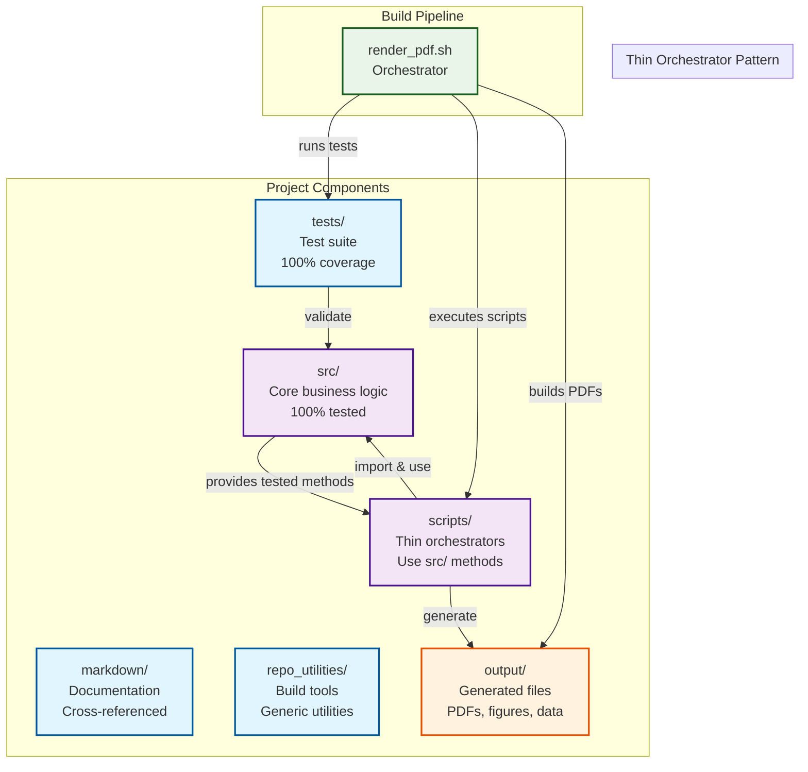

# 🚀 Research Project Template

> **Template Repository** - Click "Use this template" to create a new research project with this structure

A revolutionary system for solving complex problems. This template provides a standardized structure that can be adapted for any research or development project.

## 🎯 What This Template Provides

This is a **GitHub Template Repository** that gives you:

- ✅ **Complete project structure** with clear separation of concerns
- ✅ **Test-driven development** setup with 100% coverage requirements
- ✅ **Automated PDF generation** from markdown sources
- ✅ **Thin orchestrator pattern** for maintainable code
- ✅ **Ready-to-use utilities** for any research project
- ✅ **Professional documentation** structure

## 🚀 Quick Start

1. **Click "Use this template"** above to create a new repository
2. **Clone your new repository**
3. **Customize the project name** and configuration
4. **Start building your research project!**

## Project Structure

The project follows a standardized structure with clear separation of concerns:



- **`src/`** - **Core business logic** with comprehensive test coverage (100% required)
- **`tests/`** - Test files ensuring all `src/` functionality works correctly
- **`scripts/`** - **Thin orchestrators** that use `src/` methods to generate figures and data
- **`markdown/`** - Source markdown files for the manuscript
- **`output/`** - Generated outputs (PDFs, figures, data)
- **`repo_utilities/`** - Generic utility scripts for any project

## Key Architectural Principles

### 🏗️ **Thin Orchestrator Pattern**
The project follows a **thin orchestrator pattern** where:

- **`src/`** contains **ALL** business logic, algorithms, and mathematical implementations
- **`scripts/`** are **lightweight wrappers** that import and use `src/` methods
- **`tests/`** ensure **100% coverage** of `src/` functionality
- **`render_pdf.sh`** orchestrates the entire pipeline

### 🔗 **Scripts as Integration Examples**
Scripts in `scripts/` demonstrate proper integration with `src/` modules:

- **Import** mathematical functions from `src/example.py`
- **Use** tested methods for all computation
- **Handle** visualization, I/O, and orchestration
- **Generate** figures and data outputs
- **Validate** that `src/` integration works correctly

**Example**: `example_figure.py` imports `add_numbers()`, `calculate_average()`, etc. from `src/example.py` and uses them to process data before visualization.

## Key Features

### Test-Driven Development
All source code in `src/` must have **100% test coverage** before PDF generation proceeds. This ensures that the methods used by scripts are fully validated.

### Automated Script Execution
Project-specific scripts in the `scripts/` directory are automatically executed to generate figures and data. These scripts **import and use** the tested methods from `src/`, demonstrating proper integration patterns.

### Markdown to PDF Pipeline
Individual markdown modules are converted to PDFs with proper figure integration, and a combined document is generated with comprehensive cross-referencing.

### Generic and Reusable
The utility scripts can be used with any project that follows this structure, making it easy to adopt for new research projects.

## 🛠️ Quick Start

### 1. Prerequisites

Install required system dependencies:

```bash
# Ubuntu/Debian
sudo apt-get install -y pandoc texlive-xetex texlive-fonts-recommended fonts-dejavu

# macOS (using Homebrew)
brew install pandoc
brew install --cask mactex
```

### 2. Python Dependencies

```bash
# Using uv (recommended)
uv sync

# Or using pip
pip install -r requirements.txt
```

### 3. Generate Manuscript

```bash
# Clean previous outputs
./repo_utilities/clean_output.sh

# Generate everything (tests + scripts + PDFs)
./repo_utilities/render_pdf.sh
```

## 🔧 Customization

### Project Metadata

Set environment variables to customize output:

```bash
export AUTHOR_NAME="Your Name"
export AUTHOR_ORCID="0000-0000-0000-0000"
export AUTHOR_EMAIL="your.email@example.com"
export DOI="10.5281/zenodo.12345678"
export PROJECT_TITLE="Your Project Title"
```

### Adding Project-Specific Scripts

Place Python scripts in the `scripts/` directory. They should:

- **Import methods from `src/` modules** (thin orchestrator pattern)
- **Use `src/` methods for all computation** (never implement algorithms)
- **Generate figures/data** using tested methods
- **Print file paths to stdout**
- **Handle errors gracefully**
- **Save outputs to appropriate directories**

Example script structure:

```python
#!/usr/bin/env python3
"""Example project script demonstrating thin orchestrator pattern."""

from example import add_numbers, calculate_average  # Import from src/

def main():
    # Use src/ methods for computation
    data = [1, 2, 3, 4, 5]
    avg = calculate_average(data)  # From src/example.py
    
    # Script handles visualization and output
    # ... visualization code ...
    
    # Print paths for the system to capture
    print("path/to/generated/file.png")

if __name__ == "__main__":
    main()
```

### Markdown Structure

- `00_preamble.md` - LaTeX preamble and styling
- `01_introduction.md` - Project introduction
- Additional numbered markdown files for sections

## 📊 Testing

The system enforces 100% test coverage:

```bash
# Run tests with coverage
pytest tests/ --cov=src --cov-report=html

# Or using uv
uv run pytest tests/ --cov=src --cov-report=html
```

## 📤 Output

Generated outputs are organized in the `output/` directory:


- **`output/pdf/`** - Individual and combined PDFs
- **`output/tex/`** - LaTeX source files
- **`output/data/`** - Data files (CSV, NPZ, etc.)
- **`output/figures/`** - Generated figures (PNG, etc.)

## 🔍 How It Works


1. **Test Validation**: Ensures 100% test coverage
2. **Script Execution**: Runs all Python scripts in `scripts/` (validating src/ integration)
3. **Markdown Discovery**: Finds all `.md` files in `markdown/`
4. **PDF Generation**: Creates individual and combined PDFs
5. **Output Organization**: Places outputs in organized subdirectories

## 📚 Documentation

- **`repo_utilities/README.md`** - Detailed utility documentation
- **`ARCHITECTURE.md`** - System architecture overview
- **`WORKFLOW.md`** - Development workflow guide
- **`MARKDOWN_TEMPLATE_GUIDE.md`** - Markdown and cross-referencing guide
- **`EXAMPLES.md`** - Project renaming examples
- **`THIN_ORCHESTRATOR_SUMMARY.md`** - Thin orchestrator pattern implementation

## 🤝 Contributing

1. Ensure all tests pass with 100% coverage
2. Follow the established project structure
3. Add tests for new functionality
4. Update documentation as needed
5. **Maintain thin orchestrator pattern** - scripts use src/ methods

## 📄 License

This project is licensed under the Apache License 2.0. See the [LICENSE](LICENSE) file for details.

## 🆘 Troubleshooting

### Common Issues

- **Tests Fail**: Ensure 100% coverage and all tests pass
- **Scripts Fail**: Check Python dependencies and error handling
- **PDF Generation Fails**: Verify pandoc and xelatex installation
- **Coverage Below 100%**: Add tests for uncovered code

### Getting Help

- Check the `repo_utilities/README.md` for detailed troubleshooting
- Review the test output for specific error messages
- Ensure all required dependencies are installed

## 🔄 Migration from QuadMath

This template was adapted from the QuadMath project. To migrate your existing project:

1. Copy the `repo_utilities/` folder to your project
2. Adapt the `src/`, `tests/`, and `scripts/` structure
3. Update markdown files to match the expected format
4. Set appropriate environment variables for your project
5. Run the utility scripts to validate the setup

## 🏗️ Architecture Benefits

The thin orchestrator pattern provides:

- **Maintainability**: Single source of truth for business logic
- **Testability**: Fully tested core functionality
- **Reusability**: Scripts can use any `src/` method
- **Clarity**: Clear separation of concerns
- **Quality**: Automated validation of the entire system

---

**Happy coding and writing! 🎉**