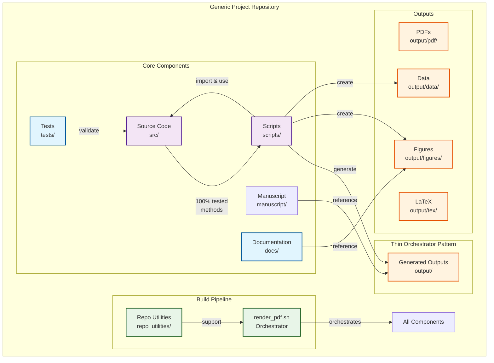
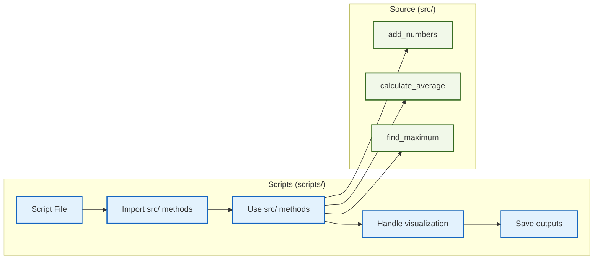
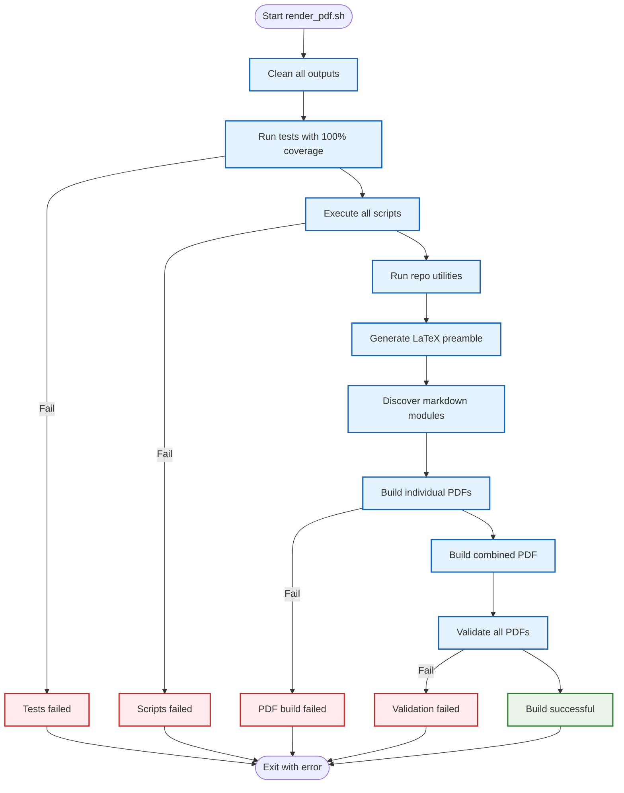
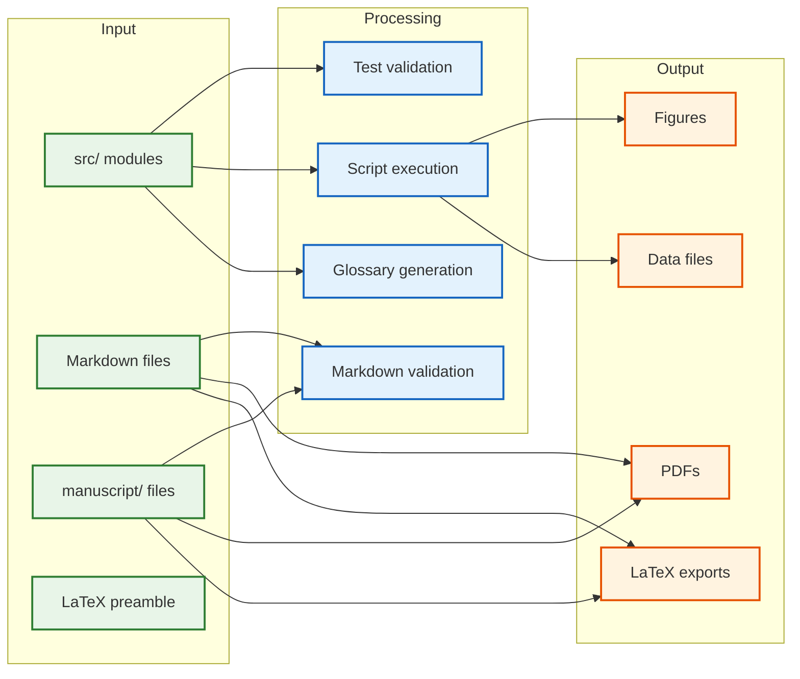

# Generic Project Architecture: Complete System Overview

This document provides a comprehensive overview of how the generic project template architecture works, explaining the connections between source code, tests, documentation, and the build pipeline. For related information, see **[`HOW_TO_USE.md`](HOW_TO_USE.md)** for complete usage guidance, **[`WORKFLOW.md`](WORKFLOW.md)**, **[`THIN_ORCHESTRATOR_SUMMARY.md`](THIN_ORCHESTRATOR_SUMMARY.md)**, and **[`README.md`](README.md)**.

## Development Rules

For specific architectural rules and standards during development, see:

- **[`.cursorrules/core_architecture.md`](../.cursorrules/core_architecture.md)** - Architectural principles and core design
- **[`.cursorrules/thin_orchestrator.md`](../.cursorrules/thin_orchestrator.md)** - Thin orchestrator pattern implementation
- **[`.cursorrules/README.md`](../.cursorrules/README.md)** - Development rules overview

## System Architecture Overview



## Component Interactions

### 1. Source Code (`src/`)
**Purpose**: Implements mathematical functionality and business logic with comprehensive test coverage.

**Key Modules**:
- `example.py`: Basic mathematical functions (add, multiply, average, etc.)
- `glossary_gen.py`: API documentation generation utilities
- Additional modules can be added for specific project needs

**Responsibilities**:
- Provide clean, well-typed APIs for mathematical operations
- Ensure numerical stability and exact arithmetic where appropriate
- Maintain mathematical consistency across all modules
- **CRITICAL**: Contain ALL business logic and algorithms

### 2. Test Suite (`tests/`)
**Purpose**: Validates all source code functionality with 100% coverage.

**Coverage Requirements**:
- **Statement coverage**: 100% of all code lines executed
- **Branch coverage**: 100% of all conditional branches taken
- **No mocks**: All tests use real numerical examples
- **Deterministic**: Fixed RNG seeds for reproducible results

**Validation Scope**:
- Mathematical correctness of all functions
- Import compatibility between modules
- Output generation and path management
- Integration with generation scripts

### 3. Generation Scripts (`scripts/`)
**Purpose**: **Thin orchestrators** that import and use `src/` methods to generate figures and data.

**Key Scripts**:
- `example_figure.py`: Basic integration example using src/ methods
- `generate_research_figures.py`: Advanced integration example

**Thin Orchestrator Pattern**:


**Workflow**:
1. Import required functions from `src/` modules
2. Use src/ methods for all computation (never implement algorithms)
3. Handle visualization, I/O, and orchestration
4. Generate deterministic outputs with fixed seeds
5. Save figures to `output/figures/`
6. Save data to `output/data/`
7. Print output paths for manifest collection

### 4. Documentation (`docs/`)
**Purpose**: Document mathematical concepts with references to implemented code.

**Structure**:
- `manuscript/preamble.md`: LaTeX preamble and styling
- `manuscript/01_introduction.md`: Project introduction and overview
- `manuscript/02_methodology.md`: Mathematical framework and equations
- `manuscript/03_experimental_results.md`: Results with figure references
- `manuscript/04_discussion.md`: Discussion and cross-references
- `manuscript/05_conclusion.md`: Summary and conclusions
- `manuscript/10_symbols_glossary.md`: Auto-generated API reference from `src/`

**Content Requirements**:
- Reference source code using inline code formatting
- Display generated figures from `output/figures/`
- Use descriptive links (no bare URLs)
- Pass all validation checks
- Include proper LaTeX equation environments

## The render_pdf.sh Pipeline

### Complete Pipeline Flow



### Phase 1: Code Validation
```bash
# Run all generation scripts to validate src/ code works
uv run python scripts/example_figure.py
uv run python scripts/generate_research_figures.py
```

**Purpose**: Ensures that all source code modules can be imported and used successfully by generation scripts.

### Phase 2: Markdown Validation
```bash
# Validate all markdown references and images
uv run python repo_utilities/validate_markdown.py
```

**Checks**:
- All referenced images exist in output directories
- Internal links have valid anchors
- Equations have unique labels
- No bare URLs (use informative link text)

### Phase 3: Documentation Generation
```bash
# Auto-generate glossary from current src/ API
uv run python repo_utilities/generate_glossary.py
```

**Purpose**: Keeps documentation automatically synchronized with source code changes.

### Phase 4: Output Generation
```bash
# Build individual PDFs from validated markdown
pandoc [markdown_file] -o [output_pdf]

# Build combined PDF from all sections
pandoc [combined_markdown] -o project_combined.pdf

# Export LaTeX for further processing
pandoc [markdown_file] -o [output_tex]
```

## Data Flow and Dependencies

### Input Dependencies
1. **Source code** (`src/`) - Mathematical implementations
2. **Markdown files** (`manuscript/`) - Manuscript content
3. **LaTeX preamble** (`manuscript/preamble.md`) - Formatting

### Processing Pipeline


1. **Scripts import from src/** → Validate code functionality
2. **Scripts generate outputs** → Create figures and data
3. **Markdown references outputs** → Link documentation to results
4. **Validation ensures coherence** → All references are valid
5. **PDF generation** → Create final documentation

### Output Structure
```
output/
├── figures/          # PNG/MP4/SVG files from scripts
├── data/             # CSV/NPZ files and manifests
├── pdf/              # Individual and combined PDFs
└── tex/              # Exported LaTeX files
```

## Quality Assurance Mechanisms

### 1. Test Coverage Enforcement
- **100% coverage required** via `.coveragerc`
- **Automated validation** in build pipeline
- **Real numerical examples** ensure mathematical correctness

### 2. Markdown Validation
- **Image reference validation** - All figures must exist
- **Link validation** - Internal references must be valid
- **Equation validation** - Proper LaTeX formatting required

### 3. Pipeline Validation
- **Script execution** - All generation scripts must succeed
- **Output generation** - All expected files must be created
- **PDF compilation** - All markdown must generate valid PDFs

### 4. Reproducibility
- **Deterministic RNG** - Fixed seeds for all random operations
- **Headless plotting** - `MPLBACKEND=Agg` for CI compatibility
- **Path management** - Consistent output directory structure

### 5. Automatic Numbering and Cross-Referencing
- **Figure numbering**: Automatically managed by LaTeX/pandoc
- **Equation numbering**: LaTeX equation environments with `\label{}` and `\eqref{}`
- **Section numbering**: Automatic section numbering with `--number-sections`
- **Table of contents**: Auto-generated TOC with `--toc` and `--toc-depth=3`
- **Cross-references**: Use `\ref{}` for figures and `\eqref{}` for equations

**Example markdown usage**:
```markdown
\begin{figure}[h]
\centering
\includegraphics[width=0.8\textwidth]{../output/figures/figure.png}
\caption{Figure caption}
\label{fig:example}
\end{figure}

\begin{equation}\label{eq:example}
E = mc^2
\end{equation}

See Figure \ref{fig:example} and Equation \eqref{eq:example}.
```

## Development Workflow

### 1. Code Changes
```bash
# Write tests first (TDD)
# Implement functionality
# Ensure 100% test coverage
# Update documentation if needed
```

### 2. Validation
```bash
# Run complete test suite
uv run pytest tests/ --cov=src --cov-report=term-missing

# Generate figures and validate
uv run python scripts/example_figure.py
uv run python repo_utilities/validate_markdown.py
```

### 3. Integration
```bash
# Run complete pipeline
python3 scripts/run_all.py

# Or individual stages
python3 scripts/03_render_pdf.py  # PDF generation

# Verify all outputs are generated
# Check that PDFs build successfully
```

## Benefits of This Architecture

1. **Coherence**: Source code, tests, and documentation stay synchronized
2. **Validation**: Automatic checking of all references and outputs
3. **Reproducibility**: Deterministic generation of all artifacts
4. **Maintainability**: Clear separation of concerns with unified workflow
5. **Quality**: 100% test coverage enforced automatically
6. **Documentation**: Auto-generated API references and validation
7. **Thin Orchestrator Pattern**: Scripts use tested src/ methods, not duplicate logic

## Key Principles

1. **Single Source of Truth**: Source code is the authoritative implementation
2. **Test-Driven Development**: Tests validate functionality before implementation
3. **Automated Validation**: All components are automatically checked for coherence
4. **Reproducible Outputs**: All results are deterministic and verifiable
5. **Integrated Workflow**: One command (`render_pdf.sh`) validates the entire system
6. **Thin Orchestrator Pattern**: Scripts import and use src/ methods, never implement algorithms

## Thin Orchestrator Pattern

The architecture enforces a **thin orchestrator pattern** where:

- **`src/`** contains ALL business logic, algorithms, and mathematical implementations
- **`scripts/`** are lightweight wrappers that import and use `src/` methods
- **`tests/`** ensures 100% coverage of `src/` functionality
- **`render_pdf.sh`** orchestrates the entire pipeline

This ensures:
- **Maintainability**: Single source of truth for business logic
- **Testability**: Fully tested core functionality
- **Reusability**: Scripts can use any `src/` method
- **Clarity**: Clear separation of concerns
- **Quality**: Automated validation of the entire system

This architecture ensures that the generic project template maintains the highest standards of code quality, documentation coherence, and maintainability while providing a clear, scalable structure for development and collaboration.

For more details on implementation, see **[`THIN_ORCHESTRATOR_SUMMARY.md`](THIN_ORCHESTRATOR_SUMMARY.md)** and **[`WORKFLOW.md`](WORKFLOW.md)**.