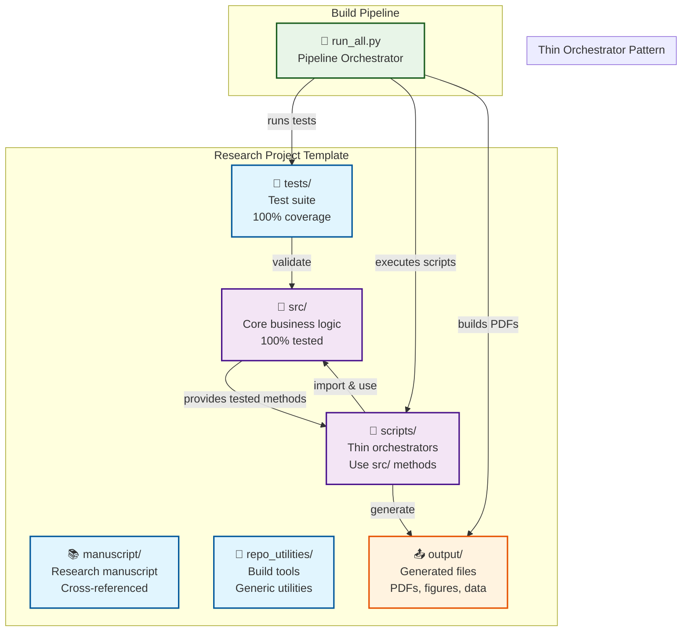
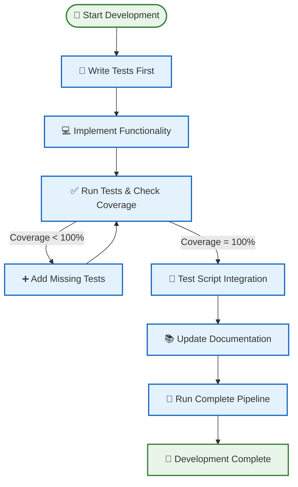
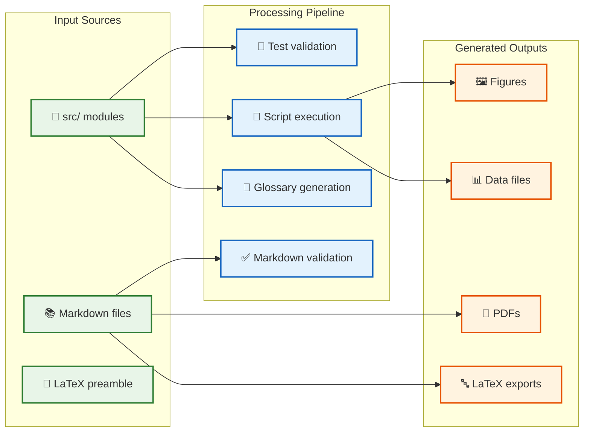

# 📋 COPYPASTA.md - Ready-to-Use Content for Sharing

This file contains pre-written, copyable content for sharing the **[Research Project Template](https://github.com/docxology/template)** in forums, social media, documentation, and other platforms. All content is optimized for easy copying and pasting.

**🔗 Quick Links:**
- **[GitHub Template](https://github.com/docxology/template)** - Click "Use this template"
- **[How To Use Guide](https://github.com/docxology/template/blob/main/HOW_TO_USE.md)** - **Complete usage guide** from basic to advanced
- **[Documentation](https://github.com/docxology/template#readme)** - Complete project overview
- **[Architecture Guide](https://github.com/docxology/template/blob/main/ARCHITECTURE.md)** - System design details
- **[Workflow Guide](https://github.com/docxology/template/blob/main/WORKFLOW.md)** - Development process

## 🚀 **One-Sentence Descriptions**

### **Short & Punchy**
- **GitHub Template**: A comprehensive research project template with test-driven development, automated PDF generation, and professional documentation structure.
- **Research Workflow**: Complete template for academic papers with 100% test coverage, automated figure generation, and LaTeX/PDF output.
- **Academic Template**: Professional research project structure with thin orchestrator pattern, automated testing, and publication-ready PDF generation.
- **Science Template**: Test-driven development template for research projects with automated documentation, figure generation, and LaTeX compilation.

### **Feature-Focused**
- **Automated Research**: Template that automatically generates PDFs from markdown with integrated figures, cross-references, and professional formatting.
- **Test-Driven Science**: Research template enforcing 100% test coverage with thin orchestrator pattern for maintainable scientific code.
- **Publication Ready**: Academic template that generates publication-ready PDFs with proper LaTeX formatting, figure integration, and cross-referencing.

## 📝 **One-Paragraph Descriptions**

### **Technical Overview** 🔧
This **[comprehensive GitHub template](https://github.com/docxology/template)** implements a **[thin orchestrator pattern](https://github.com/docxology/template/blob/main/THIN_ORCHESTRATOR_SUMMARY.md)** with **100% test coverage requirements**. The template automatically generates publication-ready PDFs from markdown sources, includes automated figure generation from Python scripts, and maintains perfect coherence between source code, tests, and documentation. It's perfect for academic papers, scientific documentation, technical reports, and any project requiring professional output with automated quality assurance. The **[architecture](https://github.com/docxology/template/blob/main/ARCHITECTURE.md)** ensures maintainable, testable code while keeping scripts lightweight and focused.

### **Academic Focus** 🎓
A revolutionary research project template that transforms how scientists and researchers approach documentation. It provides a standardized structure with **[test-driven development](https://github.com/docxology/template/blob/main/WORKFLOW.md)**, automated PDF generation from markdown, and professional LaTeX formatting. The template includes cross-referencing systems, automated glossary generation from source code, and ensures all figures and data are properly integrated. Perfect for thesis projects, research papers, and scientific documentation. The **[markdown guide](https://github.com/docxology/template/blob/main/MARKDOWN_TEMPLATE_GUIDE.md)** shows how to create publication-ready content with proper equations and references.

### **Developer Experience** 💻
Built for developers who need professional research output, this template enforces clean architecture through the **[thin orchestrator pattern](https://github.com/docxology/template/blob/main/THIN_ORCHESTRATOR_SUMMARY.md)** where scripts import and use tested methods from source modules. It includes comprehensive testing with 100% coverage requirements, automated build pipelines, and generates multiple output formats including PDF, LaTeX, and HTML. The template maintains perfect synchronization between code, tests, and documentation. The **[workflow guide](https://github.com/docxology/template/blob/main/WORKFLOW.md)** shows the complete development process from tests to publication.

### **Quick Start** ⚡
Get started immediately with this **[research project template](https://github.com/docxology/template)** that provides everything you need: complete project structure, test-driven development setup, automated PDF generation, and professional documentation workflows. Simply click "Use this template" on GitHub, customize your project details, and start building. The template includes comprehensive examples, automated testing, and generates publication-ready outputs with minimal configuration. Check the **[how to use guide](https://github.com/docxology/template/blob/main/HOW_TO_USE.md)** for step-by-step instructions and the **[examples showcase](https://github.com/docxology/template/blob/main/EXAMPLES_SHOWCASE.md)** for real-world usage patterns.

## 🔧 **Code Snippets**

### **🚀 Running the Build Pipeline**
```bash
# Clean all outputs and regenerate everything
python3 scripts/run_all.py
```

### **🧪 Running Tests**
```bash
# Run tests with coverage (100% required)
uv run pytest tests/ --cov=src --cov-report=term-missing

# Or with pip
pytest tests/ --cov=src --cov-report=term-missing
```

### **🏷️ Renaming the Project**
```bash
# Edit configuration in the script first, then run:
./repo_utilities/rename_project.sh
```

### **⚡ Quick Setup Commands**
```bash
# Install dependencies
uv sync

# Run complete pipeline
python3 scripts/run_all.py

# Run complete pipeline (includes cleanup)
python3 scripts/run_all.py
```

### **📊 Development Workflow**
```bash
# 1. Make changes to src/ code
# 2. Run tests to ensure 100% coverage
uv run pytest tests/ --cov=src --cov-report=term-missing

# 3. Generate figures and validate
uv run python scripts/example_figure.py
uv run python repo_utilities/validate_markdown.py

# 4. Build complete pipeline
python3 scripts/run_all.py
```

## 📱 **Social Media Posts**

### **🐦 Twitter/X (280 chars)**
🚀 New research project template! Test-driven development + automated PDF generation + professional LaTeX output. Perfect for academic papers, thesis projects, and scientific documentation. 100% test coverage enforced. #Research #Academic #OpenSource

### **💼 LinkedIn Post**
Excited to share this **[comprehensive research project template](https://github.com/docxology/template)** I've been working on! It provides a standardized structure for research projects with **[test-driven development](https://github.com/docxology/template/blob/main/WORKFLOW.md)**, automated PDF generation from markdown, and professional documentation workflows. Perfect for academics, researchers, and developers who need publication-ready outputs. The template enforces clean architecture through the **[thin orchestrator pattern](https://github.com/docxology/template/blob/main/THIN_ORCHESTRATOR_SUMMARY.md)** and includes comprehensive testing with 100% coverage requirements. Check it out and let me know what you think!

### **📱 Reddit Post Title**
[GitHub Template] Research Project Template with Test-Driven Development, Automated PDF Generation, and Professional Documentation Structure

### **📱 Reddit Post Body**
I've created a **[comprehensive GitHub template](https://github.com/docxology/template)** for research projects that I think could be really useful for the community. It includes:

✅ **Test-driven development** with 100% coverage requirements  
✅ **Automated PDF generation** from markdown with LaTeX  
✅ **Thin orchestrator pattern** for maintainable code  
✅ **Professional documentation** structure  
✅ **Automated figure generation** from Python scripts  
✅ **Cross-referencing system** for complex documents  

The template is designed for academic papers, scientific documentation, thesis projects, and any research requiring professional output. It automatically validates code quality, generates figures, and creates publication-ready PDFs. Check out the **[examples showcase](https://github.com/docxology/template/blob/main/EXAMPLES_SHOWCASE.md)** for real-world usage patterns.

Would love feedback from researchers and developers who might use this!

## 💬 **Forum Responses**

### **🔍 Stack Overflow Answer**
Here's a **[comprehensive research project template](https://github.com/docxology/template)** that handles exactly what you're looking for:

**🚀 Key Features:**
✅ Test-driven development with 100% coverage  
✅ Automated PDF generation from markdown  
✅ Professional LaTeX output with cross-referencing  
✅ Automated figure generation from Python scripts  
✅ Thin orchestrator pattern for maintainable code  

**⚡ Quick Start:**
```bash
# Clone and setup
git clone https://github.com/docxology/template.git
cd template
uv sync

# Generate everything
python3 scripts/run_all.py
```

The template automatically handles LaTeX compilation, figure integration, and generates publication-ready PDFs. Perfect for academic papers and research documentation. Check the **[how to use guide](https://github.com/docxology/template/blob/main/HOW_TO_USE.md)** for comprehensive step-by-step instructions and the **[architecture guide](https://github.com/docxology/template/blob/main/ARCHITECTURE.md)** for detailed system design.

### **🐙 GitHub Discussion Response**
This **[template](https://github.com/docxology/template)** solves exactly the problem you're describing! It provides:

🔧 **1. Standardized Structure**: Clear separation between source code, tests, scripts, and documentation  
🧪 **2. Automated Quality**: 100% test coverage enforcement and automated validation  
📚 **3. Professional Output**: Publication-ready PDFs with proper LaTeX formatting  
🖼️ **4. Figure Integration**: Automated generation and integration of figures from Python scripts  
🔗 **5. Cross-Referencing**: Built-in system for equations, figures, and sections  

The **[thin orchestrator pattern](https://github.com/docxology/template/blob/main/THIN_ORCHESTRATOR_SUMMARY.md)** ensures your scripts use tested methods from source modules, making the codebase maintainable and reliable. Perfect for research projects where accuracy and reproducibility matter. The **[how to use guide](https://github.com/docxology/template/blob/main/HOW_TO_USE.md)** provides comprehensive step-by-step instructions, and the **[workflow guide](https://github.com/docxology/template/blob/main/WORKFLOW.md)** shows the complete development process.

### **🎓 Academic Forum Post**
I've developed a **[research project template](https://github.com/docxology/template)** that addresses many of the workflow issues we discuss here. It implements:

**🔬 Core Principles:**
✅ Test-driven development with enforced 100% coverage  
✅ Automated documentation generation from source code  
✅ Professional PDF output with LaTeX compilation  
✅ Integrated figure and data generation  
✅ Cross-referencing and glossary systems  

**🎯 Benefits for Researchers:**
✅ Consistent project structure across teams  
✅ Automated quality assurance  
✅ Publication-ready outputs  
✅ Reproducible research workflows  
✅ Integration with existing Python ecosystems  

The template is designed for academic papers, thesis projects, and scientific documentation. It automatically validates code quality and generates professional outputs, saving significant time on formatting and quality assurance. The **[how to use guide](https://github.com/docxology/template/blob/main/HOW_TO_USE.md)** provides comprehensive step-by-step instructions, and the **[examples showcase](https://github.com/docxology/template/blob/main/EXAMPLES_SHOWCASE.md)** demonstrates real-world applications across different research domains.

## 📧 **Email Templates**

### **Professional Introduction**
Subject: Research Project Template - Automated Quality Assurance and Professional Output

Hi [Name],

I wanted to share a research project template I've developed that I think could be valuable for your team. It provides:

- **Automated Quality Assurance**: 100% test coverage enforcement
- **Professional Documentation**: Publication-ready PDFs with LaTeX
- **Standardized Workflow**: Consistent project structure and processes
- **Figure Integration**: Automated generation and integration of research figures
- **Cross-Referencing**: Built-in systems for equations, figures, and sections

The template is designed for research projects requiring professional output and maintains perfect synchronization between code, tests, and documentation.

You can find it at: [GitHub Template](https://github.com/docxology/template)

The **[how to use guide](https://github.com/docxology/template/blob/main/HOW_TO_USE.md)** provides comprehensive step-by-step instructions for getting started at any level of complexity.

Would be happy to discuss how this might fit into your research workflow.

Best regards,
[Your Name]

### **Collaboration Request**
Subject: Feedback Request - Research Project Template

Hi [Name],

I've developed a comprehensive research project template and would value your feedback as someone working in [field/area]. The template includes:

- Test-driven development with automated quality assurance
- Professional PDF generation from markdown sources
- Automated figure generation and integration
- Cross-referencing and glossary systems
- Standardized project structure

It's designed for academic papers and research documentation, with a focus on reproducibility and professional output.

The **[how to use guide](https://github.com/docxology/template/blob/main/HOW_TO_USE.md)** shows how it can be used at different levels of complexity, from basic document creation to advanced test-driven development.

Could you take a look and let me know what you think? Any suggestions for improvements would be greatly appreciated.

Template: [GitHub Link](https://github.com/docxology/template)

Thanks!
[Your Name]

## 🎯 **Marketing Copy**

### **📢 Headline Options**
🚀 "Transform Your Research Workflow with Automated Quality Assurance"  
⚡ "Professional Research Outputs with Zero Configuration"  
🧪 "Test-Driven Development Meets Academic Publishing"  
📚 "Automated PDF Generation for Research Projects"  
✅ "Research Template with 100% Test Coverage"  

### **💎 Value Propositions**
⏰ **Save Time**: Automated PDF generation eliminates manual formatting  
🔒 **Ensure Quality**: 100% test coverage enforced automatically  
📖 **Professional Output**: Publication-ready LaTeX and PDF generation  
🔄 **Maintain Consistency**: Standardized structure across all projects  
🤝 **Enable Collaboration**: Clear workflows for team research projects  

### **🎬 Call-to-Action Options**
🚀 "Click 'Use this template' and start building in minutes"  
⚡ "Transform your research workflow today"  
🤝 "Join the community of researchers using this template"  
📚 "Get started with professional research outputs"  
🔮 "Experience the future of research project management"  

## 🗺️ **System Architecture Diagrams**

### **🏗️ Complete System Overview**


### **⚡ Development Workflow**


### **📊 Output Generation Flow**


## 🔗 **Quick Links Section**

### **🌐 Essential URLs**
🔗 **[GitHub Template](https://github.com/docxology/template)** - Click "Use this template"  
📚 **[Documentation](https://github.com/docxology/template#readme)** - Complete project overview  
🐛 **[Issues](https://github.com/docxology/template/issues)** - Report bugs & request features  
💬 **[Discussions](https://github.com/docxology/template/discussions)** - Join the community  

### **🚀 Key Features to Highlight**
✅ **Test-driven development** with 100% coverage  
✅ **Automated PDF generation** from markdown  
✅ **Professional LaTeX output** with cross-referencing  
✅ **Automated figure generation** from Python scripts  
✅ **Cross-referencing system** for equations & figures  
✅ **Standardized project structure** for consistency  
✅ **Thin orchestrator pattern** for maintainability  
✅ **Publication-ready outputs** for academic use  

### **📖 Documentation Navigation**
🚀 **[How To Use Guide](https://github.com/docxology/template/blob/main/HOW_TO_USE.md)** - **Complete usage guide** from basic to advanced  
🏗️ **[Architecture Guide](https://github.com/docxology/template/blob/main/ARCHITECTURE.md)** - System design overview  
⚡ **[Workflow Guide](https://github.com/docxology/template/blob/main/WORKFLOW.md)** - Development process  
📝 **[Markdown Guide](https://github.com/docxology/template/blob/main/MARKDOWN_TEMPLATE_GUIDE.md)** - Writing & formatting  
🎯 **[Examples Showcase](https://github.com/docxology/template/blob/main/EXAMPLES_SHOWCASE.md)** - Real-world usage  
🔧 **[Thin Orchestrator Summary](https://github.com/docxology/template/blob/main/THIN_ORCHESTRATOR_SUMMARY.md)** - Pattern implementation  
🗺️ **[Development Roadmap](https://github.com/docxology/template/blob/main/ROADMAP.md)** - Future plans  
🤝 **[Contributing Guide](https://github.com/docxology/template/blob/main/CONTRIBUTING.md)** - How to contribute  
❓ **[FAQ](https://github.com/docxology/template/blob/main/FAQ.md)** - Common questions

## 📊 **Feature Comparison Table**

| Feature | Traditional Approach | This Template | Benefit |
|---------|---------------------|---------------|---------|
| **Project Structure** | Manual organization | 🏗️ Standardized structure | Consistency across projects |
| **Testing** | Optional coverage | 🧪 100% coverage enforced | Reliable, bug-free code |
| **Documentation** | Manual updates | 📚 Auto-synchronized | Code-doc always in sync |
| **PDF Generation** | Manual LaTeX editing | 🚀 Automated from markdown | Save hours of formatting |
| **Figure Integration** | Manual file management | 🖼️ Automated generation | Seamless figure inclusion |
| **Cross-referencing** | Manual numbering | 🔗 Automatic system | Professional academic output |
| **Quality Assurance** | Manual review | ✅ Automated validation | Consistent high quality |
| **Collaboration** | Ad-hoc workflows | 🤝 Standardized processes | Team efficiency |

## 🎯 **Use Cases & Applications**

### **🎓 Academic Research**
- **Thesis & Dissertation Projects** - Professional formatting with automated quality
- **Research Papers** - Publication-ready outputs with proper citations
- **Lab Reports** - Consistent structure with integrated data visualization
- **Grant Proposals** - Professional appearance with automated validation

### **🏭 Industry Applications**
- **Technical Documentation** - Professional reports with code integration
- **Research & Development** - Reproducible workflows with quality assurance
- **Data Analysis Projects** - Automated figure generation with statistical rigor
- **Software Documentation** - Code-doc synchronization with automated testing

### **🔬 Scientific Computing**
- **Numerical Analysis** - Tested algorithms with reproducible results
- **Machine Learning** - Validated models with automated documentation
- **Statistical Research** - Rigorous testing with professional output
- **Computational Science** - Quality-assured code with publication-ready results

---

## 🚀 **Getting Started Checklist**

### **⚡ Immediate Actions**
- [ ] Click **[Use this template](https://github.com/docxology/template)** on GitHub
- [ ] Clone your new repository
- [ ] Run `uv sync` to install dependencies
- [ ] Execute `python3 scripts/run_all.py` to test the pipeline

### **🔧 Customization Steps**
- [ ] Edit `repo_utilities/rename_project.sh` with your project details
- [ ] Run `./repo_utilities/rename_project.sh` to customize
- [ ] Update manuscript files with your content
- [ ] Add your business logic to `src/` modules
- [ ] Create tests in `tests/` directory (100% coverage required)

**📖 Need guidance?** See **[`HOW_TO_USE.md`](https://github.com/docxology/template/blob/main/HOW_TO_USE.md)** for step-by-step instructions at your experience level.

### **📚 Learning Resources**
- [ ] Read **[HOW_TO_USE.md](https://github.com/docxology/template/blob/main/HOW_TO_USE.md)** for **complete usage guide**
- [ ] Read **[README.md](https://github.com/docxology/template#readme)** for overview
- [ ] Study **[ARCHITECTURE.md](https://github.com/docxology/template/blob/main/ARCHITECTURE.md)** for system design
- [ ] Follow **[WORKFLOW.md](https://github.com/docxology/template/blob/main/WORKFLOW.md)** for development process
- [ ] Check **[EXAMPLES_SHOWCASE.md](https://github.com/docxology/template/blob/main/EXAMPLES_SHOWCASE.md)** for real-world usage

---

**🎉 Ready to Transform Your Research Workflow?**

All content in this file is ready for copy-paste use. Customize as needed for your specific context and audience. The **[Research Project Template](https://github.com/docxology/template)** is available at: https://github.com/docxology/template

**🔗 Quick Start**: Click "Use this template" and start building in minutes!  
**📚 Documentation**: Comprehensive guides for every aspect of the system  
**🤝 Community**: Join discussions and contribute to the project  
**⭐ Support**: Star the repository if you find it useful!
