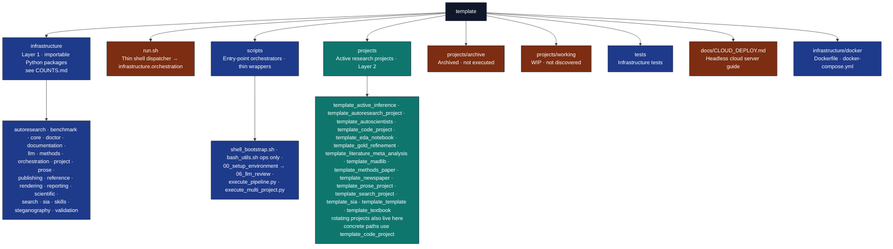

# PAI.md — Personal AI Infrastructure Context

## Identity

- **System**: Research Project Template
- **Role**: Standardized Research Execution Environment
- **Type**: Core Infrastructure / Skill
- **Version**: Default [`pipeline.yaml`](../infrastructure/core/pipeline/pipeline.yaml) declares **14** stages: 8 core stages, 2 optional LLM stages, 2 opt-in ebook/metadata stages, and 2 opt-in bundle/archival stages. Default full runs execute the 10 core+LLM stages; `--core-only` executes the 8 core stages — see [`RUN_GUIDE.md`](RUN_GUIDE.md).
- **Signposting**: This repository is a PAI “template” node; it is intended to be self-describing via `AGENTS.md` and `docs/`.

---

## Purpose

This repository is the **canonical template** for all research projects in the Personal AI
Infrastructure (PAI). It provides a reproducible, zero-mock, agent-friendly environment for:

1. **Standardized Structure** — `infrastructure/` for generic tools, `projects/{name}/src/` for domain logic.
2. **Thin Orchestration** — Scripts coordinate; all business logic lives in src/ modules.
3. **Multi-Project Support** — Multiple independent research projects in a single repo.
4. **Zero-Mock Testing** — Absolute prohibition on mocks; tests use real execution only.
5. **Agent-Friendly Documentation** — Each documented directory carries `README.md` and `AGENTS.md` where the tree policy requires it; PAI-oriented context lives in root-adjacent `PAI.md` files (e.g. this file, [`../infrastructure/PAI.md`](../infrastructure/PAI.md), [`../scripts/PAI.md`](../scripts/PAI.md), [`../tests/PAI.md`](../tests/PAI.md), [`../projects/PAI.md`](../projects/PAI.md)), not in every subdirectory.
6. **Headless Cloud Deployment** — `./run.sh --pipeline` bootstraps uv automatically on any server.

---

## PAI v5 Alignment

As of 2026-05-15, this repository treats upstream PAI `v5.0.0` as the current Life Operating System doctrine: DA-centered operation, Pulse on port `31337`, Algorithm `v6.6.0`, and ISA-first execution. For non-trivial work, articulate the Ideal State Artifact before implementation; PRD language is historical only and should not be presented as current PAI doctrine.

Operational smoke checks for the local PAI install live outside this template's Python APIs:

- `~/.claude/PAI/PAI_SYSTEM_PROMPT.md`
- `~/.claude/PAI/ALGORITHM/v6.6.0.md`
- `~/.claude/skills/ISA/SKILL.md`
- `http://localhost:31337/api/pulse/health`
- `http://localhost:31337/readiness`

The active local PAI also has a controlled Docxology public-context intake at `~/.claude/PAI/TOOLS/DocxologyIntake.ts`. It refreshes canonical public data from `danielarifriedman.com`, writes snapshots under `~/.claude/PAI/MEMORY/REFERENCE/DOCXOLOGY/`, and promotes only curated notes into `MEMORY/KNOWLEDGE/`.

The 2026-05-15 PAI preflight, installer, migration, and verification notes were a point-in-time audit snapshot retired from the public `docs/audit/` archive. No template Python API changed as part of the PAI upgrade.

## Weekly Pulse Runbook

Use the following external checks to validate the runtime baseline:

```bash
curl -s http://127.0.0.1:31337/api/pulse/health | jq '{status, jobs: [.subsystems.cron.jobs[] | {name,result,failures}]}'
curl -s -X POST http://127.0.0.1:31337/notify -H "Content-Type: application/json" -d '{"message":"PAI v5 validation"}'
curl -s http://127.0.0.1:31337/api/pulse/health | jq '.subsystems.cron.jobs | map(select(.failures > 0))'
cd ~/.claude/PAI/PULSE && bun run run-job.ts pulse-self-audit
curl -s http://127.0.0.1:31337/api/pulse/self-audit | jq '{ready,counts,pointers,phaseStatuses:[.phases[] | {id,status,warn,critical}]}'
```

`subsystems.cron` should report no active failure rows after the 2026-05-15 assistant scaffold validation; any new failure row should be treated as a fresh regression.

The `pulse-self-audit` job runs daily at 06:00 and writes its latest report to `~/.claude/PAI/MEMORY/PAISYSTEMUPDATES/pulse-self-audit.json`. Re-enable staged jobs only when this report has zero critical findings and the specific job target exists. The report also checks backup retention and confirms that `settings.json` and `PAI/ALGORITHM/LATEST` agree on Algorithm `6.6.0`.

Pulse process management runs this self-audit before `start` and `install`; a future critical finding blocks daemon launch until the missing enabled target or v5 baseline issue is fixed.

When re-enabling DA assistant capabilities, apply the staged rollout documented in root [AGENTS.md](../AGENTS.md) and stop after failures exceed your tolerance in the current phase. The dashboard route `http://127.0.0.1:31337/readiness` groups the same readiness data by baseline, doctrine, runtime, assistant, monitor, and communication phases.

---

## Architecture

**Counting note:** live Python package names and counts under `infrastructure/` are recorded in [`docs/_generated/COUNTS.md`](_generated/COUNTS.md). The `config/`, `docker/`, and `logrotate.d/` directories ship configuration/docs rather than `__init__.py`, so they are not Python packages. See [docs/modules/modules-guide.md](modules/modules-guide.md) and [infrastructure/AGENTS.md](../infrastructure/AGENTS.md) for module-specific entry points.



---

## Usage for Agents

### Discover

```python
from infrastructure.project.discovery import discover_projects
projects = discover_projects(repo_root)
```

### Execute

```bash
# Full pipeline (auto-installs uv on headless servers)
./run.sh --pipeline

# Core pipeline (no LLM stages)
uv run python scripts/runner/execute_pipeline.py --project template_code_project --core-only

# Specific project
./run.sh --project template_code_project --pipeline

# All projects
./run.sh --all-projects --pipeline
```

### Verify

```bash
# Always run tests before changes
uv run python scripts/pipeline/stage_01_test.py --project template_code_project

# Validate markdown (exemplar path)
uv run python -m infrastructure.validation.cli markdown projects/templates/template_code_project/manuscript/
```

Active project slugs: see [_generated/active_projects.md](_generated/active_projects.md) — do not duplicate that roster here.

### Document

- Update `AGENTS.md` when architectural patterns change.
- Update `PAI.md` when the system identity or purpose changes.
- Update `CLOUD_DEPLOY.md` when deployment requirements change.

---

## Environment Variables

| Variable | Default | Description |
|----------|---------|-------------|
| `MPLBACKEND` | `Agg` | Headless matplotlib (required on servers) |
| `UV_FROZEN` | `true` | Reproducible locked dependency installs |
| `LOG_LEVEL` | `1` | 0=DEBUG 1=INFO 2=WARN 3=ERROR |
| `LOG_TERMINAL_VERBOSE` | unset | Set to restore the verbose `[ts] [LEVEL]` prefix on terminal output (file always has it). See [operational/logging/output-design.md](operational/logging/output-design.md). |
| `FEP_LEAN_GAUSS_WORKFLOWS` | `1` | OpenGauss Lean session workflows; `--no-lean-workflows` or `0` disables |
| `OLLAMA_HOST` | `http://localhost:11434` | LLM server URL |
| `LLM_MAX_INPUT_LENGTH` | `500000` | Max chars per LLM prompt |
| `ENABLE_PDF` / `ENABLE_HTML` / `ENABLE_SLIDES` | `1` | Per-format render toggles. Set `0` to skip. See [usage/output-formats.md](usage/output-formats.md). |
| `ENABLE_DOCX` / `ENABLE_EPUB` | `0` | Opt-in per-format toggles for Word / EPUB output. |

---

## Architecture Linkage

| Layer | Location | Purpose |
|-------|----------|---------|
| Infrastructure | `infrastructure/` | Generic, reusable tools — 60%+ test coverage |
| Projects | `projects/{name}/src/` | Domain-specific science — 90%+ test coverage |
| Outputs | `output/{name}/` | Final deliverables (git-ignored) |
| Entry Points | `scripts/`, `run.sh` | Thin orchestrators only |

---

## Constraints

- **No Legacy** — Legacy methods are actively removed.
- **Real Tests** — No mocks allowed. Verified by `scripts/audit/verify_no_mocks.py`.
- **Thin Orchestrators** — Scripts must not contain business logic.
- **Coverage** — Infrastructure ≥ 60%, Projects ≥ 90%.
- **Shell bootstrap** — `run.sh` / `secure_run.sh` source `scripts/shell/shell_bootstrap.sh`
  (`ensure_uv`, sandbox env vars); conditional `uv sync` is internal to `run.sh`, not an exported env var.

---

## Key References

- [`AGENTS.md`](AGENTS.md) — Documentation hub (`docs/`)
- [`../AGENTS.md`](../AGENTS.md) — Repository system reference (root)
- [`CLOUD_DEPLOY.md`](CLOUD_DEPLOY.md) — Headless cloud deployment guide
- [`RUN_GUIDE.md`](RUN_GUIDE.md) — Pipeline orchestration reference
- [`documentation-index.md`](documentation-index.md) — Full docs index
- [`../infrastructure/docker/Dockerfile`](../infrastructure/docker/Dockerfile) — Container specification
- [`../infrastructure/docker/docker-compose.yml`](../infrastructure/docker/docker-compose.yml) — Multi-service orchestration
