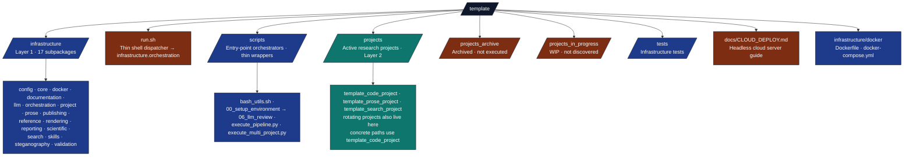

# PAI.md — Personal AI Infrastructure Context

## Identity

- **System**: Research Project Template
- **Role**: Standardized Research Execution Environment
- **Type**: Core Infrastructure / Skill
- **Version**: Default [`pipeline.yaml`](../infrastructure/core/pipeline/pipeline.yaml) defines a **10-stage** DAG (including LLM stages); `--core-only` runs **8** stages (LLM-tagged stages excluded). `run.sh` progress lines use `[0/9]` for clean plus `[1/9]`–`[9/9]` for nine tracked steps — see [`RUN_GUIDE.md`](RUN_GUIDE.md).
- **Signposting**: This repository is a PAI “template” node; it is intended to be self-describing via `AGENTS.md` and `docs/`.

---

## Purpose

This repository is the **canonical template** for all research projects in the Personal AI
Infrastructure (PAI). It provides a reproducible, zero-mock, agent-friendly environment for:

1. **Standardized Structure** — `infrastructure/` for generic tools, `projects/{name}/src/` for domain logic.
2. **Thin Orchestration** — Scripts coordinate; all business logic lives in src/ modules.
3. **Multi-Project Support** — Multiple independent research projects in a single repo.
4. **Zero-Mock Testing** — Absolute prohibition on mocks; tests use real execution only.
5. **Agent-Friendly Documentation** — Each documented directory carries `README.md` and `AGENTS.md` where the tree policy requires it; PAI-oriented context lives in root-adjacent `PAI.md` files (e.g. this file, [`../infrastructure/PAI.md`](../infrastructure/PAI.md), [`../scripts/PAI.md`](../scripts/PAI.md), [`../tests/PAI.md`](../tests/PAI.md), [`../projects/PAI.md`](../projects/PAI.md)), not in every subdirectory.
6. **Headless Cloud Deployment** — `./run.sh --pipeline` bootstraps uv automatically on any server.

---

## Architecture

**Counting note:** the tree below lists **15** Python packages under `infrastructure/` (core, documentation, llm, orchestration, project, prose, publishing, reference, rendering, reporting, scientific, search, skills, steganography, validation). The `config/`, `docker/`, and `logrotate.d/` directories ship config files rather than `__init__.py`, so they aren't Python packages. For a live count run `for d in infrastructure/*/; do [ -f "$d/__init__.py" ] && echo "$d"; done | wc -l`. See [docs/modules/modules-guide.md](modules/modules-guide.md) and [infrastructure/AGENTS.md](../infrastructure/AGENTS.md) for module-specific entry points.



---

## Usage for Agents

### Discover

```python
from infrastructure.project.discovery import discover_projects
projects = discover_projects(repo_root)
```

### Execute

```bash
# Full pipeline (auto-installs uv on headless servers)
./run.sh --pipeline

# Core pipeline (no LLM stages)
uv run python scripts/execute_pipeline.py --project template_code_project --core-only

# Specific project
./run.sh --project template_code_project --pipeline

# All projects
./run.sh --all-projects --pipeline
```

### Verify

```bash
# Always run tests before changes
uv run python scripts/01_run_tests.py --project template_code_project

# Validate markdown (exemplar path)
uv run python -m infrastructure.validation.cli markdown projects/template_code_project/manuscript/
```

Active project slugs: see [_generated/active_projects.md](_generated/active_projects.md) — do not duplicate that roster here.

### Document

- Update `AGENTS.md` when architectural patterns change.
- Update `PAI.md` when the system identity or purpose changes.
- Update `CLOUD_DEPLOY.md` when deployment requirements change.

---

## Environment Variables

| Variable | Default | Description |
|----------|---------|-------------|
| `MPLBACKEND` | `Agg` | Headless matplotlib (required on servers) |
| `UV_FROZEN` | `true` | Reproducible locked dependency installs |
| `LOG_LEVEL` | `1` | 0=DEBUG 1=INFO 2=WARN 3=ERROR |
| `PIPELINE_MODE` | `0` | Set to `1` by `run.sh` for non-interactive flags |
| `OLLAMA_HOST` | `http://localhost:11434` | LLM server URL |
| `LLM_MAX_INPUT_LENGTH` | `500000` | Max chars per LLM prompt |

---

## Architecture Linkage

| Layer | Location | Purpose |
|-------|----------|---------|
| Infrastructure | `infrastructure/` | Generic, reusable tools — 60%+ test coverage |
| Projects | `projects/{name}/src/` | Domain-specific science — 90%+ test coverage |
| Outputs | `output/{name}/` | Final deliverables (git-ignored) |
| Entry Points | `scripts/`, `run.sh` | Thin orchestrators only |

---

## Constraints

- **No Legacy** — Legacy methods are actively removed.
- **Real Tests** — No mocks allowed. Verified by `scripts/verify_no_mocks.py`.
- **Thin Orchestrators** — Scripts must not contain business logic.
- **Coverage** — Infrastructure ≥ 60%, Projects ≥ 90%.
- **PIPELINE_MODE** — Set automatically by `run.sh` for all non-interactive flags;
  triggers `ensure_uv()` + `uv sync` bootstrap on first run.

---

## Key References

- [`AGENTS.md`](AGENTS.md) — Documentation hub (`docs/`)
- [`../AGENTS.md`](../AGENTS.md) — Repository system reference (root)
- [`CLOUD_DEPLOY.md`](CLOUD_DEPLOY.md) — Headless cloud deployment guide
- [`RUN_GUIDE.md`](RUN_GUIDE.md) — Pipeline orchestration reference
- [`documentation-index.md`](documentation-index.md) — Full docs index
- [`../infrastructure/docker/Dockerfile`](../infrastructure/docker/Dockerfile) — Container specification
- [`../infrastructure/docker/docker-compose.yml`](../infrastructure/docker/docker-compose.yml) — Multi-service orchestration
