# docs/ - Documentation

> **Documentation hub** for the Research Project Template

**Quick Reference:** [Documentation Index](documentation-index.md) | [How To Use](core/how-to-use.md) | [Architecture](core/architecture.md) | [FAQ](reference/faq.md)

## Purpose

The `docs/` directory contains project documentation organized by purpose and audience. This is the central hub for all project documentation beyond code comments.

## Documentation Navigation Map

```mermaid
graph TD
    subgraph EntryPoints["📖 Entry Points"]
        README[README.md<br/>Project Overview<br/>Quick Start]
        DOC_INDEX[documentation-index.md<br/>Index<br/>All Docs Files]
        HOW_TO[core/how-to-use.md<br/>Usage Guide<br/>12 Skill Levels]
    end

    subgraph CoreDocs["📚 Core Documentation"]
        ARCH[core/architecture.md<br/>System Design]
        WORKFLOW[core/workflow.md<br/>Development Process]
        RULES[../.cursorrules/README.md<br/>Development Standards]
    end

    subgraph SkillLevels["🎓 Skill-Based Learning"]
        L1[guides/getting-started.md<br/>Levels 1-3: Beginner]
        L2[guides/figures-and-analysis.md<br/>Levels 4-6: Intermediate]
        L3[guides/testing-and-reproducibility.md<br/>Levels 7-9: Advanced]
        L4[guides/extending-and-automation.md<br/>Levels 10-12: Expert]
    end

    subgraph Operational["⚙️ Operational"]
        BUILD[operational/build-system.md<br/>Build Pipeline]
        TROUBLESHOOT[operational/troubleshooting-guide.md<br/>Fix Issues]
        CONFIG[operational/configuration.md<br/>Setup & Config]
    end

    subgraph Reference["📑 Reference"]
        FAQ[reference/faq.md<br/>Common Questions]
        CHEATSHEET[reference/quick-start-cheatsheet.md<br/>Command Reference]
        API[reference/api-reference.md<br/>API Docs]
    end

    subgraph Usage["📝 Usage & Examples"]
        EXAMPLES[usage/examples.md<br/>Usage Patterns]
        MARKDOWN[usage/markdown-template-guide.md<br/>Writing Guide]
        VISUAL[usage/visualization-guide.md<br/>Figures & Plots]
    end

    subgraph Advanced["🔬 Advanced Topics"]
        MODULES[modules/modules-guide.md<br/>9 Modules]
        ARCH_DOCS[architecture/two-layer-architecture.md<br/>System Architecture]
        BEST_PRACTICES[best-practices/best-practices.md<br/>Best Practices]
        PROMPTS[prompts/README.md<br/>AI Prompt Templates<br/>9 Expert Prompts]
    end

    README --> DOC_INDEX
    README --> HOW_TO
    DOC_INDEX --> CoreDocs
    DOC_INDEX --> SkillLevels
    DOC_INDEX --> Operational
    DOC_INDEX --> Reference
    DOC_INDEX --> Usage
    DOC_INDEX --> Advanced

    HOW_TO --> L1
    L1 --> L2
    L2 --> L3
    L3 --> L4

    ARCH --> WORKFLOW
    WORKFLOW --> RULES

    BUILD --> TROUBLESHOOT
    TROUBLESHOOT --> CONFIG

    FAQ --> CHEATSHEET
    CHEATSHEET --> API

    EXAMPLES --> MARKDOWN
    MARKDOWN --> VISUAL

    MODULES --> ARCH_DOCS
    ARCH_DOCS --> BEST_PRACTICES

    classDef entry fill:#e3f2fd,stroke:#1565c0,stroke-width:3px
    classDef core fill:#fff3e0,stroke:#e65100,stroke-width:2px
    classDef skill fill:#e8f5e8,stroke:#2e7d32,stroke-width:2px
    classDef operational fill:#f3e5f5,stroke:#4a148c,stroke-width:2px
    classDef reference fill:#fce4ec,stroke:#c2185b,stroke-width:2px
    classDef usage fill:#e0f2f1,stroke:#00695c,stroke-width:2px
    classDef advanced fill:#fff8e1,stroke:#f57f17,stroke-width:2px

    class EntryPoints entry
    class CoreDocs core
    class SkillLevels skill
    class Operational operational
    class Reference reference
    class Usage usage
    class Advanced advanced
```

## Directory Structure

Documentation is organized into modular subdirectories:

| Directory | Purpose | Key Files |
|-----------|---------|-----------|
| [`core/`](core/) | Essential documentation | how-to-use.md, architecture.md, workflow.md |
| [`guides/`](guides/) | Usage guides by skill level | getting-started.md, figures-and-analysis.md, testing-and-reproducibility.md, extending-and-automation.md |
| [`architecture/`](architecture/) | Architecture documentation | two-layer-architecture.md, thin-orchestrator-summary.md, decision-tree.md |
| [`usage/`](usage/) | Usage examples and patterns | examples.md, markdown-template-guide.md, visualization-guide.md, image-management.md |
| [`operational/`](operational/) | Operational workflows | build-system.md, reporting-guide.md, troubleshooting-guide.md, configuration.md + `logging/`, `troubleshooting/` |
| [`reference/`](reference/) | Reference materials | api-reference.md, faq.md, glossary.md, quick-start-cheatsheet.md, common-workflows.md |
| [`modules/`](modules/) | Module documentation | modules-guide.md, scientific-simulation-guide.md, pdf-validation.md + `guides/` (7 per-module guides) |
| [`development/`](development/) | Development & contribution | contributing.md, testing-guide.md, code-of-conduct.md, coverage-gaps.md |
| [`best-practices/`](best-practices/) | Best practices | best-practices.md, version-control.md, migration-guide.md, multi-project-management.md |
| [`prompts/`](prompts/) | AI prompt templates | manuscript_creation.md, code_development.md, test_creation.md, comprehensive_assessment.md |
| [`audit/`](audit/) | Audit reports | documentation-review-report.md, documentation-review-summary.md, filepath-audit-report.md |

## Quick Navigation

### New Users Start Here

1. [`../README.md`](../README.md) - Project overview
2. [`core/how-to-use.md`](core/how-to-use.md) - usage guide
3. [`guides/getting-started.md`](guides/getting-started.md) - Getting started (Levels 1-3)
4. [`reference/faq.md`](reference/faq.md) - Common questions

### Developers Start Here

1. [`core/architecture.md`](core/architecture.md) - System design
2. [`architecture/thin-orchestrator-summary.md`](architecture/thin-orchestrator-summary.md) - Architecture pattern
3. [`core/workflow.md`](core/workflow.md) - Development process
4. [`development/contributing.md`](development/contributing.md) - How to contribute
5. [`../.cursorrules/README.md`](../.cursorrules/README.md) - Development rules

## Development Rules Quick Access

Development standards are defined in the `.cursorrules/` directory. Start with:

- [`../.cursorrules/README.md`](../.cursorrules/README.md) - Quick reference and patterns
- [`../.cursorrules/AGENTS.md`](../.cursorrules/AGENTS.md) - development standards
- [`../.cursorrules/testing_standards.md`](../.cursorrules/testing_standards.md) - Testing patterns and coverage
- See [`documentation-index.md`](documentation-index.md) for rules reference

## Quick Links

| Need | Document |
|------|----------|
| Get started | [`core/how-to-use.md`](core/how-to-use.md) |
| Understand design | [`core/architecture.md`](core/architecture.md) |
| See examples | [`usage/examples.md`](usage/examples.md) |
| Find answers | [`reference/faq.md`](reference/faq.md) |
| Contribute | [`development/contributing.md`](development/contributing.md) |
| Report security issue | [`development/security.md`](development/security.md) |

## See Also

- [`AGENTS.md`](AGENTS.md) - Detailed documentation guide
- [`documentation-index.md`](documentation-index.md) - index
- [`prompts/README.md`](prompts/README.md) - AI prompt templates for development
- [`../AGENTS.md`](../AGENTS.md) - System documentation
