# docs/ - Documentation

> **Documentation hub** for the Research Project Template

**Quick Reference:** [Documentation Index](DOCUMENTATION_INDEX.md) | [How To Use](core/HOW_TO_USE.md) | [Architecture](core/ARCHITECTURE.md) | [FAQ](reference/FAQ.md)

## Purpose

The `docs/` directory contains comprehensive project documentation organized by purpose and audience. This is the central hub for all project documentation beyond code comments.

## Documentation Navigation Map

```mermaid
graph TD
    subgraph EntryPoints["📖 Entry Points"]
        README[README.md<br/>Project Overview<br/>Quick Start]
        DOC_INDEX[DOCUMENTATION_INDEX.md<br/>Complete Index<br/>All 89 Files]
        HOW_TO[core/HOW_TO_USE.md<br/>Complete Usage Guide<br/>12 Skill Levels]
    end

    subgraph CoreDocs["📚 Core Documentation"]
        ARCH[core/ARCHITECTURE.md<br/>System Design]
        WORKFLOW[core/WORKFLOW.md<br/>Development Process]
        RULES[../.cursorrules/README.md<br/>Development Standards]
    end

    subgraph SkillLevels["🎓 Skill-Based Learning"]
        L1[guides/GETTING_STARTED.md<br/>Levels 1-3: Beginner]
        L2[guides/INTERMEDIATE_USAGE.md<br/>Levels 4-6: Intermediate]
        L3[guides/ADVANCED_USAGE.md<br/>Levels 7-9: Advanced]
        L4[guides/EXPERT_USAGE.md<br/>Levels 10-12: Expert]
    end

    subgraph Operational["⚙️ Operational"]
        BUILD[operational/BUILD_SYSTEM.md<br/>Build Pipeline]
        TROUBLESHOOT[operational/TROUBLESHOOTING_GUIDE.md<br/>Fix Issues]
        CONFIG[operational/CONFIGURATION.md<br/>Setup & Config]
    end

    subgraph Reference["📑 Reference"]
        FAQ[reference/FAQ.md<br/>Common Questions]
        CHEATSHEET[reference/QUICK_START_CHEATSHEET.md<br/>Command Reference]
        API[reference/API_REFERENCE.md<br/>Complete API Docs]
    end

    subgraph Usage["📝 Usage & Examples"]
        EXAMPLES[usage/EXAMPLES.md<br/>Usage Patterns]
        MARKDOWN[usage/MARKDOWN_TEMPLATE_GUIDE.md<br/>Writing Guide]
        VISUAL[usage/VISUALIZATION_GUIDE.md<br/>Figures & Plots]
    end

    subgraph Advanced["🔬 Advanced Topics"]
        MODULES[modules/ADVANCED_MODULES_GUIDE.md<br/>7 Advanced Modules]
        ARCH_DOCS[architecture/TWO_LAYER_ARCHITECTURE.md<br/>System Architecture]
        BEST_PRACTICES[best-practices/BEST_PRACTICES.md<br/>Best Practices]
    end

    README --> DOC_INDEX
    README --> HOW_TO
    DOC_INDEX --> CoreDocs
    DOC_INDEX --> SkillLevels
    DOC_INDEX --> Operational
    DOC_INDEX --> Reference
    DOC_INDEX --> Usage
    DOC_INDEX --> Advanced

    HOW_TO --> L1
    L1 --> L2
    L2 --> L3
    L3 --> L4

    ARCH --> WORKFLOW
    WORKFLOW --> RULES

    BUILD --> TROUBLESHOOT
    TROUBLESHOOT --> CONFIG

    FAQ --> CHEATSHEET
    CHEATSHEET --> API

    EXAMPLES --> MARKDOWN
    MARKDOWN --> VISUAL

    MODULES --> ARCH_DOCS
    ARCH_DOCS --> BEST_PRACTICES

    classDef entry fill:#e3f2fd,stroke:#1565c0,stroke-width:3px
    classDef core fill:#fff3e0,stroke:#e65100,stroke-width:2px
    classDef skill fill:#e8f5e8,stroke:#2e7d32,stroke-width:2px
    classDef operational fill:#f3e5f5,stroke:#4a148c,stroke-width:2px
    classDef reference fill:#fce4ec,stroke:#c2185b,stroke-width:2px
    classDef usage fill:#e0f2f1,stroke:#00695c,stroke-width:2px
    classDef advanced fill:#fff8e1,stroke:#f57f17,stroke-width:2px

    class EntryPoints entry
    class CoreDocs core
    class SkillLevels skill
    class Operational operational
    class Reference reference
    class Usage usage
    class Advanced advanced
```

## Directory Structure

Documentation is organized into modular subdirectories:

| Directory | Purpose | Key Files |
|-----------|---------|-----------|
| [`core/`](core/) | Essential documentation | ../core/HOW_TO_USE.md, ../core/ARCHITECTURE.md, ../core/WORKFLOW.md |
| [`guides/`](guides/) | Usage guides by skill level | GETTING_STARTED.md, INTERMEDIATE_USAGE.md, ADVANCED_USAGE.md, EXPERT_USAGE.md |
| [`architecture/`](architecture/) | Architecture documentation | TWO_LAYER_ARCHITECTURE.md, THIN_ORCHESTRATOR_SUMMARY.md |
| [`usage/`](usage/) | Usage examples and patterns | EXAMPLES.md, MARKDOWN_TEMPLATE_GUIDE.md, VISUALIZATION_GUIDE.md |
| [`operational/`](operational/) | Operational workflows | BUILD_SYSTEM.md, TROUBLESHOOTING_GUIDE.md, CONFIGURATION.md |
| [`reference/`](reference/) | Reference materials | API_REFERENCE.md, FAQ.md, GLOSSARY.md, QUICK_START_CHEATSHEET.md |
| [`modules/`](modules/) | Advanced modules | ADVANCED_MODULES_GUIDE.md, SCIENTIFIC_SIMULATION_GUIDE.md |
| [`development/`](development/) | Development & contribution | CONTRIBUTING.md, TESTING_GUIDE.md, CODE_OF_CONDUCT.md |
| [`best-practices/`](best-practices/) | Best practices | BEST_PRACTICES.md, VERSION_CONTROL.md, MIGRATION_GUIDE.md |

## Quick Navigation

### New Users Start Here
1. [`../README.md`](../README.md) - Project overview
2. [`core/HOW_TO_USE.md`](core/HOW_TO_USE.md) - Complete usage guide
3. [`guides/GETTING_STARTED.md`](guides/GETTING_STARTED.md) - Getting started (Levels 1-3)
4. [`reference/FAQ.md`](reference/FAQ.md) - Common questions

### Developers Start Here
1. [`core/ARCHITECTURE.md`](core/ARCHITECTURE.md) - System design
2. [`architecture/THIN_ORCHESTRATOR_SUMMARY.md`](architecture/THIN_ORCHESTRATOR_SUMMARY.md) - Architecture pattern
3. [`core/WORKFLOW.md`](core/WORKFLOW.md) - Development process
4. [`development/CONTRIBUTING.md`](development/CONTRIBUTING.md) - How to contribute
5. [`../.cursorrules/README.md`](../.cursorrules/README.md) - Development rules

## Development Rules Quick Access

Development standards are defined in the `.cursorrules/` directory. Start with:

- [`../.cursorrules/README.md`](../.cursorrules/README.md) - Quick reference and patterns
- [`../.cursorrules/AGENTS.md`](../.cursorrules/AGENTS.md) - Complete development standards
- [`../.cursorrules/testing_standards.md`](../.cursorrules/testing_standards.md) - Testing patterns and coverage
- See [`DOCUMENTATION_INDEX.md`](DOCUMENTATION_INDEX.md) for complete rules reference

## Quick Links

| Need | Document |
|------|----------|
| Get started | [`core/HOW_TO_USE.md`](core/HOW_TO_USE.md) |
| Understand design | [`core/ARCHITECTURE.md`](core/ARCHITECTURE.md) |
| See examples | [`usage/EXAMPLES.md`](usage/EXAMPLES.md) |
| Find answers | [`reference/FAQ.md`](reference/FAQ.md) |
| Contribute | [`development/CONTRIBUTING.md`](development/CONTRIBUTING.md) |
| Report security issue | [`development/SECURITY.md`](development/SECURITY.md) |

## See Also

- [`AGENTS.md`](AGENTS.md) - Detailed documentation guide
- [`DOCUMENTATION_INDEX.md`](DOCUMENTATION_INDEX.md) - Complete index
- [`../AGENTS.md`](../AGENTS.md) - System documentation

