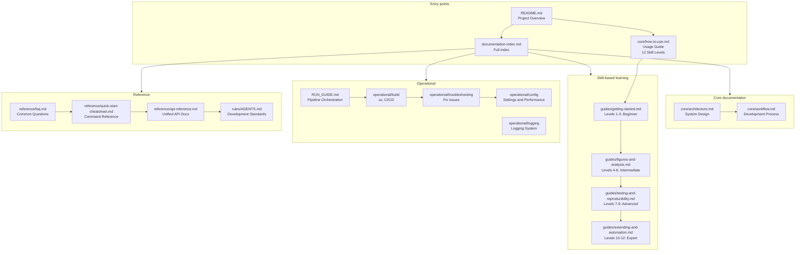

# docs/ - Documentation

> **Documentation hub** for the Research Project Template

**Forking the template?** Start here: the code and prose exemplars each ship a 5-minute walkthrough at [`projects/templates/template_code_project/docs/forking_guide.md`](../projects/templates/template_code_project/docs/forking_guide.md) (numerical research) and [`projects/templates/template_prose_project/docs/forking_guide.md`](../projects/templates/template_prose_project/docs/forking_guide.md) (editorial review). The Active Inference exemplar is documented at [`projects/templates/template_active_inference/README.md`](../projects/templates/template_active_inference/README.md). The AutoResearch exemplar is documented at [`projects/templates/template_autoresearch_project/README.md`](../projects/templates/template_autoresearch_project/README.md). The meta-template exemplar is documented at [`projects/templates/template_template/README.md`](../projects/templates/template_template/README.md). The drift checker that gates your fork against the template's contract is [`scripts/check_template_drift.py`](../scripts/check_template_drift.py) (run `uv run python scripts/check_template_drift.py` from the repo root).

**Quick Reference:** [Documentation Index](documentation-index.md) | [How To Use](core/how-to-use.md) | [Architecture](core/architecture.md) | [FAQ](reference/faq.md) | [GitHub / CI](../.github/README.md) | [Canonical Facts](_generated/COUNTS.md)

## Purpose

The `docs/` directory contains project documentation organized by purpose and audience. This is the central hub for all project documentation beyond code comments.

**`projects/` is a rotating set:** directories are promoted, archived, or moved to `projects/working/` over time. The only workspace **guaranteed** to stay in the tree as the **control-positive** layout for paths and commands is [`projects/templates/template_code_project/`](../projects/templates/template_code_project/). For the current discovered list, link [`_generated/active_projects.md`](_generated/active_projects.md)—do not treat any other sibling name as permanent.

Machine-generated snippets (including that authoritative list) live under [`_generated/`](_generated/README.md). Human-written pages should link there instead of copying project rosters.

## Documentation Navigation Map

```mermaid
graph TD
    subgraph EntryPoints["Entry points"]
        README[README.md<br/>Project Overview]
        DOC_INDEX[documentation-index.md<br/>Full Index]
        HOW_TO[core/how-to-use.md<br/>Usage Guide<br/>12 Skill Levels]
    end

    subgraph CoreDocs["Core documentation"]
        ARCH[core/architecture.md<br/>System Design]
        WORKFLOW[core/workflow.md<br/>Development Process]
    end

    subgraph SkillLevels["Skill-based learning"]
        L1[guides/getting-started.md<br/>Levels 1-3: Beginner]
        L2[guides/figures-and-analysis.md<br/>Levels 4-6: Intermediate]
        L3[guides/testing-and-reproducibility.md<br/>Levels 7-9: Advanced]
        L4[guides/extending-and-automation.md<br/>Levels 10-12: Expert]
    end

    subgraph Operational["Operational"]
        PIPELINE[RUN_GUIDE.md<br/>Pipeline Orchestration]
        BUILD[operational/build<br/>uv, CI/CD]
        TROUBLESHOOT[operational/troubleshooting<br/>Fix Issues]
        CONFIG[operational/config<br/>Settings and Performance]
        LOGGING[operational/logging<br/>Logging System]
    end

    subgraph Reference["Reference"]
        FAQ[reference/faq.md<br/>Common Questions]
        CHEATSHEET[reference/quick-start-cheatsheet.md<br/>Command Reference]
        API[reference/api-reference.md<br/>Unified API Docs]
        RULES[rules/AGENTS.md<br/>Development Standards]
    end

    README --> DOC_INDEX
    README --> HOW_TO
    DOC_INDEX --> CoreDocs
    DOC_INDEX --> SkillLevels
    DOC_INDEX --> Operational
    DOC_INDEX --> Reference

    HOW_TO --> L1
    L1 --> L2
    L2 --> L3
    L3 --> L4

    ARCH --> WORKFLOW

    PIPELINE --> BUILD
    BUILD --> TROUBLESHOOT
    TROUBLESHOOT --> CONFIG

    FAQ --> CHEATSHEET
    CHEATSHEET --> API
    API --> RULES
```

## Directory Structure

| Directory | Purpose | Key Contents |
|-----------|---------|--------------|
| [`core/`](core/) | Essential documentation | how-to-use.md, architecture.md, workflow.md |
| [`guides/`](guides/) | Skill-level guides (1-12) | getting-started, figures-and-analysis, testing, extending |
| [`architecture/`](architecture/) | System design | two-layer-architecture.md, thin-orchestrator, decision-tree |
| [`usage/`](usage/) | Content authoring & patterns | examples, markdown guide, style guide, visualization |
| [`operational/`](operational/) | Operational workflows | `build/`, `config/`, `logging/`, `troubleshooting/` |
| [`maintenance/`](maintenance/) | Long-horizon ops | private-projects-repo, ci-local, regression, archival, bundle |
| [`reference/`](reference/) | Reference materials | api-reference, faq, glossary, cheatsheet, workflows |
| [`modules/`](modules/) | Infrastructure modules | modules-guide, scientific simulation, pdf-validation, `guides/` |
| [`development/`](development/) | Development & contribution | contributing, security, roadmap, `testing/` sub-folder |
| [`best-practices/`](best-practices/) | Best practices | version-control, migration, multi-project, backup-recovery |
| [`prompts/`](prompts/) | AI prompt templates (see [prompts/AGENTS.md](prompts/AGENTS.md)) | manuscript, registry cross-refs, literature synthesis, code, test, feature, refactor, docs, infra, validation, assessment |
| [`security/`](security/) | Security & provenance | steganography, hashing, secure execution |
| [`rules/`](rules/) | Project Rules | AGENTS, README, testing, manuscript, etc. |
| [`streams/`](streams/) | Livestream & talk notes | timestamped session notes tied to releases or papers |
| [`_generated/`](_generated/) | Generated snippets | `AGENTS.md`, `active_projects.md` (discover_projects roster) |

## Quick Navigation

### New Users Start Here

1. [`../README.md`](../README.md) - Project overview
2. [`core/how-to-use.md`](core/how-to-use.md) - Usage guide
3. [`guides/getting-started.md`](guides/getting-started.md) - Getting started (Levels 1-3)
4. [`reference/faq.md`](reference/faq.md) - Common questions

### Creating a New Project

1. [`guides/new-project-setup.md`](guides/new-project-setup.md) - **Complete setup checklist** with all pitfalls
2. [`guides/manuscript-semantics.md`](guides/manuscript-semantics.md) - Canonical manuscript syntax (citations, cross-references, sections, `{{TOKEN}}` substitution) shared by all public template exemplars
3. [`architecture/thin-orchestrator-summary.md`](architecture/thin-orchestrator-summary.md) - Script pattern

### Developers Start Here

1. [`core/architecture.md`](core/architecture.md) - System design overview
2. [`architecture/two-layer-architecture.md`](architecture/two-layer-architecture.md) - Full architecture guide
3. [`architecture/thin-orchestrator-summary.md`](architecture/thin-orchestrator-summary.md) - Pattern details
4. [`core/workflow.md`](core/workflow.md) - Development process
5. [`development/contributing.md`](development/contributing.md) - How to contribute

## Quick Links

| Need | Document |
|------|----------|
| Get started | [`core/how-to-use.md`](core/how-to-use.md) |
| **Create a new project** | **[`guides/new-project-setup.md`](guides/new-project-setup.md)** |
| Understand design | [`architecture/two-layer-architecture.md`](architecture/two-layer-architecture.md) |
| See examples | [`usage/examples.md`](usage/examples.md) |
| Find answers | [`reference/faq.md`](reference/faq.md) |
| System reference (PAI) | [`PAI.md`](PAI.md) |
| Cloud deployment guide | [`CLOUD_DEPLOY.md`](CLOUD_DEPLOY.md) |
| Fix an issue | [`operational/troubleshooting/`](operational/troubleshooting/) |
| Contribute | [`development/contributing.md`](development/contributing.md) |
| Report security issue | [`development/security.md`](development/security.md) |
| Understand modules | [`modules/modules-guide.md`](modules/modules-guide.md) |
| Best practices | [`best-practices/best-practices.md`](best-practices/best-practices.md) |
| Security policies | [`security/README.md`](security/README.md) |
| Validate docs | [`../scripts/lint_docs.py`](../scripts/lint_docs.py) |

## Topic routing (canonical → deep dives)

| Topic | Start here | Deep dives |
|-------|------------|------------|
| Pipeline ops | [`RUN_GUIDE.md`](RUN_GUIDE.md) | [`operational/pipeline-control.md`](operational/pipeline-control.md), [`operational/runbook.md`](operational/runbook.md) |
| Methods orchestration | [`guides/methods-orchestration.md`](guides/methods-orchestration.md) | [`architecture/thin-orchestrator-summary.md`](architecture/thin-orchestrator-summary.md), [`RUN_GUIDE.md`](RUN_GUIDE.md) |
| Agent code navigation | [`guides/codegraph-local.md`](guides/codegraph-local.md), [`guides/leann-local.md`](guides/leann-local.md) | [`modules/guides/project-module.md`](modules/guides/project-module.md), [`architecture/thin-orchestrator-summary.md`](architecture/thin-orchestrator-summary.md) |
| Logging | [`operational/logging/output-design.md`](operational/logging/output-design.md) | [`operational/logging/python-logging.md`](operational/logging/python-logging.md), [`operational/logging/bash-logging.md`](operational/logging/bash-logging.md) (operational scripts only) |
| Secure / steganography | [`guides/secure-research-guide.md`](guides/secure-research-guide.md) → [`security/README.md`](security/README.md) | [`security/secure_execution.md`](security/secure_execution.md), [`modules/guides/steganography-module.md`](modules/guides/steganography-module.md) |
| Literature search | [`guides/literature-workflow-guide.md`](guides/literature-workflow-guide.md) | [`core/literature-data-flow.md`](core/literature-data-flow.md), [`modules/literature-search-and-references.md`](modules/literature-search-and-references.md), [`streams/inferant-stream-019-literature-search.md`](streams/inferant-stream-019-literature-search.md) (historical) |
| Development rules | [`rules/README.md`](rules/README.md) |
| Session notes (streams) | [`streams/README.md`](streams/README.md) |

## See Also

- [`AGENTS.md`](AGENTS.md) — Documentation hub (`docs/`)
- [`../AGENTS.md`](../AGENTS.md) — Repository system reference (root)
- [`documentation-index.md`](documentation-index.md) - Full file index
- [`prompts/README.md`](prompts/README.md) - AI prompt templates
- Agent skills manifest: `uv run python -m infrastructure.skills write` (writes `.cursor/skill_manifest.json` at repo root when run) · `uv run python -m infrastructure.skills check` — see [modules/guides/skills-module.md](modules/guides/skills-module.md)
- Active projects under [`../projects/`](../projects/) may ship a local docs tree (e.g. [`../projects/templates/template_code_project/docs/`](../projects/templates/template_code_project/docs/)); work-in-progress trees under [`../projects/working/`](../projects/working/) are not discovered until promoted. Authoritative slugs: [`_generated/active_projects.md`](_generated/active_projects.md)
