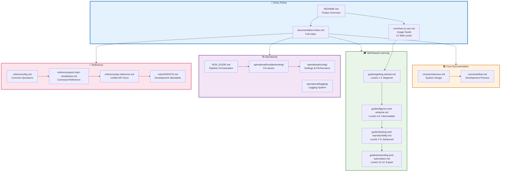

# docs/ - Documentation

> **Documentation hub** for the Research Project Template

**Quick Reference:** [Documentation Index](documentation-index.md) | [How To Use](core/how-to-use.md) | [Architecture](core/architecture.md) | [FAQ](reference/faq.md) | [GitHub / CI](../.github/README.md)

## Purpose

The `docs/` directory contains project documentation organized by purpose and audience. This is the central hub for all project documentation beyond code comments.

Machine-generated snippets (including the authoritative list of active `projects/` workspaces) live under [`_generated/`](_generated/README.md). Human-written pages should link there instead of copying project rosters; concrete examples should use [`projects/code_project/`](../projects/code_project/) as the control-positive layout.

## Documentation Navigation Map

```mermaid
graph TD
    subgraph EntryPoints["📖 Entry Points"]
        README[README.md<br/>Project Overview]
        DOC_INDEX[documentation-index.md<br/>Full Index]
        HOW_TO[core/how-to-use.md<br/>Usage Guide<br/>12 Skill Levels]
    end

    subgraph CoreDocs["📚 Core Documentation"]
        ARCH[core/architecture.md<br/>System Design]
        WORKFLOW[core/workflow.md<br/>Development Process]
    end

    subgraph SkillLevels["🎓 Skill-Based Learning"]
        L1[guides/getting-started.md<br/>Levels 1-3: Beginner]
        L2[guides/figures-and-analysis.md<br/>Levels 4-6: Intermediate]
        L3[guides/testing-and-reproducibility.md<br/>Levels 7-9: Advanced]
        L4[guides/extending-and-automation.md<br/>Levels 10-12: Expert]
    end

    subgraph Operational["⚙️ Operational"]
        PIPELINE[RUN_GUIDE.md<br/>Pipeline Orchestration]
        TROUBLESHOOT[operational/troubleshooting/<br/>Fix Issues]
        CONFIG[operational/config/<br/>Settings & Performance]
        LOGGING[operational/logging/<br/>Logging System]
    end

    subgraph Reference["📑 Reference"]
        FAQ[reference/faq.md<br/>Common Questions]
        CHEATSHEET[reference/quick-start-cheatsheet.md<br/>Command Reference]
        API[reference/api-reference.md<br/>Unified API Docs]
        RULES[rules/AGENTS.md<br/>Development Standards]
    end

    README --> DOC_INDEX
    README --> HOW_TO
    DOC_INDEX --> CoreDocs
    DOC_INDEX --> SkillLevels
    DOC_INDEX --> Operational
    DOC_INDEX --> Reference

    HOW_TO --> L1
    L1 --> L2
    L2 --> L3
    L3 --> L4

    ARCH --> WORKFLOW

    PIPELINE --> TROUBLESHOOT
    TROUBLESHOOT --> CONFIG

    FAQ --> CHEATSHEET
    CHEATSHEET --> API
    API --> RULES

    classDef entry fill:#e3f2fd,stroke:#1565c0,stroke-width:3px
    classDef core fill:#fff3e0,stroke:#e65100,stroke-width:2px
    classDef skill fill:#e8f5e8,stroke:#2e7d32,stroke-width:2px
    classDef operational fill:#f3e5f5,stroke:#4a148c,stroke-width:2px
    classDef reference fill:#fce4ec,stroke:#c2185b,stroke-width:2px

    class EntryPoints entry
    class CoreDocs core
    class SkillLevels skill
    class Operational operational
    class Reference reference
```

## Directory Structure

| Directory | Purpose | Key Contents |
|-----------|---------|--------------|
| [`core/`](core/) | Essential documentation | how-to-use.md, architecture.md, workflow.md |
| [`guides/`](guides/) | Skill-level guides (1-12) | getting-started, figures-and-analysis, testing, extending |
| [`architecture/`](architecture/) | System design | two-layer-architecture.md, thin-orchestrator, decision-tree |
| [`usage/`](usage/) | Content authoring & patterns | examples, markdown guide, style guide, visualization |
| [`operational/`](operational/) | Operational workflows | `config/`, `logging/`, `troubleshooting/` sub-folders |
| [`reference/`](reference/) | Reference materials | api-reference, faq, glossary, cheatsheet, workflows |
| [`modules/`](modules/) | Infrastructure modules | modules-guide, scientific simulation, pdf-validation, `guides/` |
| [`development/`](development/) | Development & contribution | contributing, security, roadmap, `testing/` sub-folder |
| [`best-practices/`](best-practices/) | Best practices | version-control, migration, multi-project, backup-recovery |
| [`prompts/`](prompts/) | AI prompt templates (9) | manuscript, code, test, feature, refactoring, assessment |
| [`security/`](security/) | Security & provenance | steganography, hashing, secure execution |
| [`audit/`](audit/) | Audit reports | documentation-review, filepath-audit |
| [`rules/`](rules/) | Project Rules | AGENTS, README, testing, manuscript, etc. |
| [`streams/`](streams/) | Livestream & talk notes | timestamped session notes tied to releases or papers |

## Quick Navigation

### New Users Start Here

1. [`../README.md`](../README.md) - Project overview
2. [`core/how-to-use.md`](core/how-to-use.md) - Usage guide
3. [`guides/getting-started.md`](guides/getting-started.md) - Getting started (Levels 1-3)
4. [`reference/faq.md`](reference/faq.md) - Common questions

### Creating a New Project

1. [`guides/new-project-setup.md`](guides/new-project-setup.md) - **Complete setup checklist** with all pitfalls
2. [`architecture/thin-orchestrator-summary.md`](architecture/thin-orchestrator-summary.md) - Script pattern

### Developers Start Here

1. [`core/architecture.md`](core/architecture.md) - System design overview
2. [`architecture/two-layer-architecture.md`](architecture/two-layer-architecture.md) - Full architecture guide
3. [`architecture/thin-orchestrator-summary.md`](architecture/thin-orchestrator-summary.md) - Pattern details
4. [`core/workflow.md`](core/workflow.md) - Development process
5. [`development/contributing.md`](development/contributing.md) - How to contribute

## Quick Links

| Need | Document |
|------|----------|
| Get started | [`core/how-to-use.md`](core/how-to-use.md) |
| **Create a new project** | **[`guides/new-project-setup.md`](guides/new-project-setup.md)** |
| Understand design | [`architecture/two-layer-architecture.md`](architecture/two-layer-architecture.md) |
| See examples | [`usage/examples.md`](usage/examples.md) |
| Find answers | [`reference/faq.md`](reference/faq.md) |
| Fix an issue | [`operational/troubleshooting/`](operational/troubleshooting/) |
| Contribute | [`development/contributing.md`](development/contributing.md) |
| Report security issue | [`development/security.md`](development/security.md) |

## See Also

- [`AGENTS.md`](AGENTS.md) - Documentation hub guide
- [`documentation-index.md`](documentation-index.md) - Full file index
- [`prompts/README.md`](prompts/README.md) - AI prompt templates
- [`../AGENTS.md`](../AGENTS.md) - System documentation
