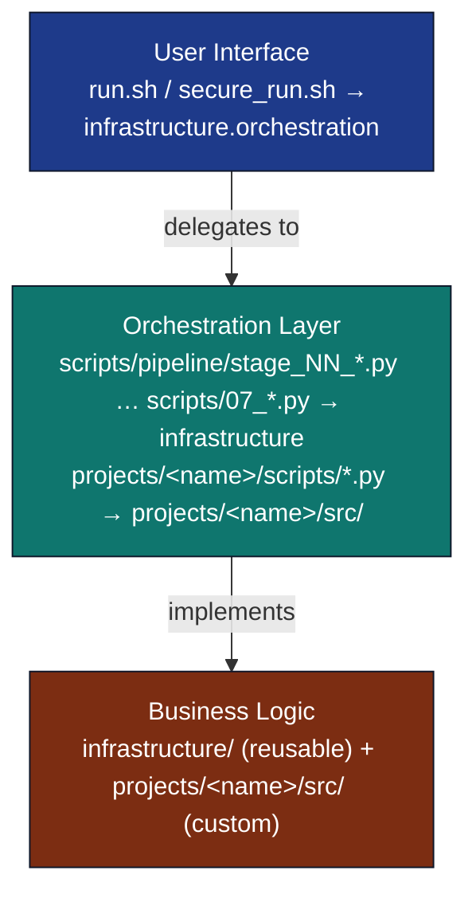
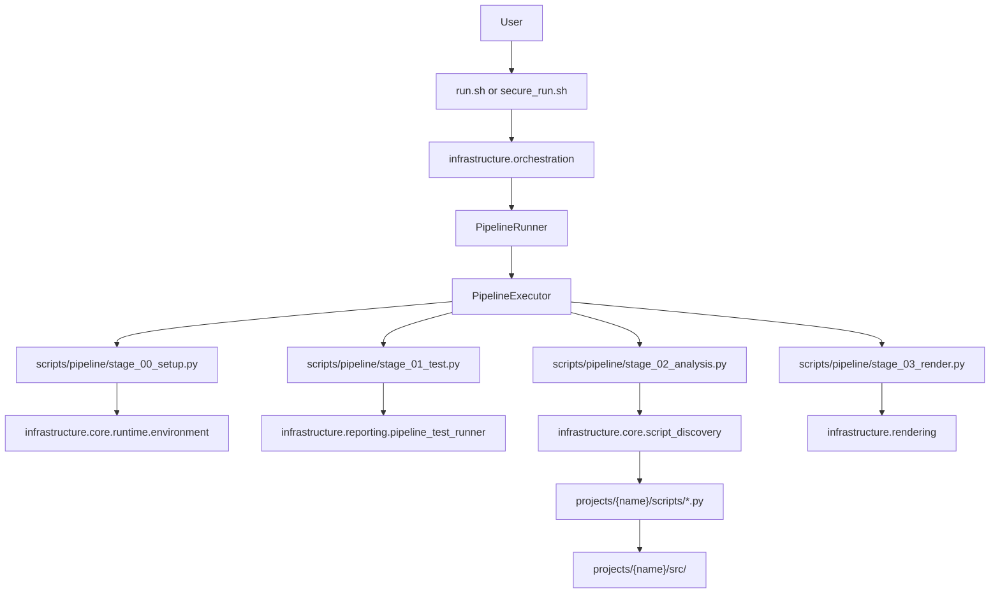

# Pipeline Orchestration Guide

## Overview

The Research Project Template provides **two main entry points** for pipeline operations:

1. **`run.sh`** - Main entry point for manuscript pipeline operations (interactive menu and flags)
2. **`uv run python scripts/runner/execute_pipeline.py --project {name} --core-only`** - Core pipeline via [`infrastructure/core/pipeline/pipeline.yaml`](../infrastructure/core/pipeline/pipeline.yaml): **8** DAG stages (clean → copy) with **`llm`-tagged and opt-in stages removed**. The default full run executes **12** core+science+LLM stages, while the YAML declares **16** stages including the opt-in ebook, metadata, bundle, and archival contracts.

## Thin Orchestration Architecture

The Research Project Template follows a **thin orchestrator pattern** where all business logic resides in `infrastructure/` and `projects/{name}/src/` modules, while entry points and scripts act as lightweight coordinators.

### Architecture Overview



### Key Principles

**Layer 1: Entry Points (Thin Orchestrators)**

- **`run.sh` / `secure_run.sh`**: Bootstrap `uv`, then `exec uv run python -m infrastructure.orchestration` (interactive menu, pipeline, multi-project, and secure subcommands)
- **`infrastructure.orchestration`**: `PipelineRunner` wrapping `PipelineExecutor`; menu rendering in `menu.py`
- **`execute_pipeline.py`**: Alternate non-interactive pipeline entry using `PipelineExecutor` directly
- **`execute_multi_project.py`**: Multi-project orchestration using `MultiProjectOrchestrator`
- **Purpose**: User interface and high-level coordination only

**Layer 2: Stage Scripts (Thin Orchestrators)**

- **`scripts/pipeline/stage_NN_*.py`–`scripts/09_*.py`**: Import from `infrastructure/` for business logic (numbered entry points; script numbers are not pipeline stage indices — `00`–`05` cover the core stages, `06_llm_review.py` backs the two `[llm]` stages, `07_generate_executive_report.py` runs in multi-project mode, and `08_executable_bundle.py`/`09_archive_publication.py` back the opt-in `[bundle]`/`[archival]` stages 10-11, which are declared in `pipeline.yaml` but excluded from default runs)
- **`projects/{name}/scripts/*.py`**: Import from `projects/{name}/src/` for business logic
- **Purpose**: Stage-specific coordination and I/O handling

**Layer 3: Business Logic (Actual Implementation)**

### Pipeline stage → infrastructure → project script map

Live test and coverage totals: [`docs/_generated/COUNTS.md`](_generated/COUNTS.md).

| Stage (default full run) | Root orchestrator | Primary infrastructure modules | Typical project script |
| --- | --- | --- | --- |
| 0 Clean outputs | built-in (`PipelineExecutor`) | `infrastructure.core.files` | — |
| 1 Environment setup | `scripts/pipeline/stage_00_setup.py` | `infrastructure.project.discovery` | — |
| 2 Infrastructure tests | `scripts/pipeline/stage_01_test.py --infra-only` | `infrastructure.core.test_runner` | — |
| 3 Project tests | `scripts/pipeline/stage_01_test.py --project-only` | `infrastructure.core.test_runner` | — |
| 4 Project analysis | `scripts/pipeline/stage_02_analysis.py` | `infrastructure.core.pipeline` | `projects/templates/<name>/scripts/*.py` |
| 5 PDF rendering | `scripts/pipeline/stage_03_render.py` | `infrastructure.rendering` | optional `render_*.py` in project |
| 6 Output validation | `scripts/pipeline/stage_04_validate.py` | `infrastructure.validation` | — |
| 7–8 LLM stages | `scripts/pipeline/stage_06_llm_review.py` | `infrastructure.llm` | — |
| 9 Copy outputs | `scripts/pipeline/stage_05_copy.py` | `infrastructure.core.files` | — |

Qualified discovery names (`templates/<name>`, `active/<name>`) resolve under
`projects/` via `infrastructure.project.discovery`.

- **`infrastructure/`**: Generic, reusable algorithms and utilities
- **`projects/{name}/src/`**: Project-specific scientific code and analysis
- **Purpose**: All computational logic and algorithms

### Orchestration Flow



### Benefits

- **Separation of concerns** — clear boundaries between orchestration and computation
- **Reusability** — infrastructure modules work across all projects
- **Testability** — business logic isolated and thoroughly tested
- **Maintainability** — changes to algorithms do not affect orchestration
- **Extensibility** — new projects inherit infrastructure

### Examples

**Correct: thin orchestrator pattern**

```python
# scripts/pipeline/stage_03_render.py (orchestrator)
from infrastructure.rendering import RenderManager

def run_render_pipeline():
    renderer = RenderManager()  # Import business logic
    pdf = renderer.render_pdf("manuscript.tex")  # Delegate computation
    return validate_output(pdf)  # Orchestrate validation
```

**Incorrect: violates architecture**

```python
# scripts/pipeline/stage_03_render.py (WRONG - implements logic)
def render_pdf_to_tex(content):
    # Business logic in orchestrator - WRONG!
    lines = content.split('\n')
    tex_lines = []
    for line in lines:
        if line.startswith('# '):
            tex_lines.append(f'\\section{{{line[2:]}}}')
        # ... complex rendering logic ...
    return '\n'.join(tex_lines)
```

## Multi-Project Support

The template now supports **multiple research projects** in a single repository. You can:

- **Run individual projects**: `./run.sh --project <name> --pipeline`
- **Run all projects sequentially**: `./run.sh --all-projects --pipeline`
- **Interactive project selection**: `./run.sh` (shows menu of available projects)

### Available Projects

Projects are discovered dynamically from `projects/` (see `infrastructure.project.discovery.discover_projects()`). **Authoritative names:** [_generated/active_projects.md](_generated/active_projects.md) (see [_generated/README.md](_generated/README.md) for policy and regeneration). **Examples in this guide** use **`template_code_project`** as the stable control-positive layout under `projects/`.

Archived and in-progress work lives under `projects/archive/` and
`projects/working/` and is not executed by default `./run.sh` discovery. Render
it explicitly with a qualified name such as `--project working/<name>`, or
deliberately restore it through optional sidecar `active/` when it should appear
in the normal menu.

Private work normally lives in the sibling repo configured by
`$TEMPLATE_PRIVATE_PROJECTS_ROOT`. The simplified sidecar uses `working/` and
`archive/` by default; optional legacy `active/`, `published/`, and `other/`
folders are still linked when present. `run.sh` auto-syncs existing lifecycle
folders into matching `template/projects/<subfolder>/` symlinks before
discovery. Use
`uv run python -m infrastructure.orchestration link-projects --dry-run` to
preview link changes, `TEMPLATE_PRIVATE_PROJECTS_ROOT` or
`.private_projects_root` to override the sibling repo, and
`TEMPLATE_SKIP_LINK_SYNC=1` to skip auto-sync for a command.

### Multi-Project Commands

```bash
# Interactive project selection
./run.sh

# Run specific project
./run.sh --project template_code_project --pipeline

# Run all projects sequentially
./run.sh --all-projects --pipeline

# Alternative orchestrator (all projects)
uv run python scripts/runner/execute_multi_project.py
```

## Entry Point 1: Manuscript Operations (`run.sh`)

`run.sh` is a thin bootstrap shell: it sources `scripts/shell/shell_bootstrap.sh`,
then `exec uv run python -m infrastructure.orchestration`. Bare `./run.sh`
opens the interactive menu; `uv run` syncs the workspace on demand. Invocations
with pipeline flags also run `uv sync` when `.venv` is missing.

For pipeline + steganography, use `./secure_run.sh --project <name>` or
`./run.sh --secure-run --project <name>` (see
[`docs/security/secure_execution.md`](security/secure_execution.md)).

### `shell_bootstrap.sh` (shared bootstrap)

Both [`run.sh`](../run.sh) and [`secure_run.sh`](../secure_run.sh) source
[`scripts/shell/shell_bootstrap.sh`](../scripts/shell/shell_bootstrap.sh) only — not
[`scripts/shell/bash_utils.sh`](../scripts/shell/bash_utils.sh) (operational backup/health scripts).

| Helper | Role |
| --- | --- |
| `setup_orchestration_sandbox_env` | Sets `MPLCONFIGDIR` and `UV_CACHE_DIR` under `$TMPDIR` for headless/cache-safe runs |
| `ensure_uv` | Locates or installs `uv` (quiet; no colored logging) |
| `print_uv_install_instructions` | Prints install guidance when `uv` is unavailable |

**`run.sh`-specific behaviour:**

- Internal `PIPELINE_MODE` (bash-local, **not exported**) triggers conditional `uv sync` when `.venv` is missing on pipeline-capable flags.
- **Argv shaping:** `--pipeline` / `--all-projects` → prepend `pipeline` subcommand; `--secure-run` → prepend `secure`; other flags forward verbatim to `python -m infrastructure.orchestration`.
- **`FEP_LEAN_GAUSS_WORKFLOWS`:** defaults to `1`; `--no-lean-workflows` sets it to `0`.

**`secure_run.sh`-specific behaviour:**

- Always runs `uv sync --group steganography` before exec (except `--help` fast path).
- No args → exit **2** with quick-start stderr; `--help` skips stego sync.
- Forwards all flags (including `--deterministic`) to the Python `secure` subcommand.

```bash
./run.sh
```

### Manuscript Menu

The menu is rendered by [`render_menu()`](../infrastructure/orchestration/menu.py) (`template_code_project` shown as an example project name):

```text
+========================================================================+
|    MANUSCRIPT PIPELINE  ·  thin orchestrator template                  |
|    project > template_code_project                                     |
+========================================================================+

   Single stages 0-7   ·   Presets 8 / 9 / f   ·   Multi a-d   ·   p · i · q
   Keys 0-5: setup, tests, analysis, render, validate, copy  |  6-7: LLM (Ollama)  |  8/9/f: pipelines  |  a-d: all projects
   Flow:  [0..5] script chain  +  (6,7) LLM  |  8/9/f DAG presets  |  a-d multi-project


  -- INDIVIDUAL STAGES - one script per key --------------------------------

   0  | Environment Setup              | 00_setup_environment.py
   1  | Run Tests                      | 01_run_tests.py (infra + project)
   2  | Run Analysis                   | 02_run_analysis.py
   3  | Render PDF                     | 03_render_pdf.py
   4  | Validate Output                | 04_validate_output.py
   5  | Copy Outputs                   | 05_copy_outputs.py
   6  | LLM Review                     | 06_llm_review.py reviews (Ollama)
   7  | LLM Translations               | 06_llm_review.py translations (Ollama)

  -- ORCHESTRATION - full DAG, current project -----------------------------

   8  | Core Pipeline                  | current project · infra on · LLM off · 8 stages
   9  | Full Pipeline                  | current project · infra on · LLM on · 10 stages
   f  | Full Pipeline (fast)           | current project · skip infra · LLM on

  -- MULTI-PROJECT - every discovered project ------------------------------

   a  | All projects full              | all projects · infra on · LLM on · report
   b  | All projects full (fast)       | all projects · skip infra · LLM on · report
   c  | All projects core              | all projects · infra on · LLM off · report
   d  | All projects core (fast)       | all projects · skip infra · LLM off · report

  -- PROJECT ---------------------------------------------------------------

   p  | Change Project
   i  | Show Project Info
   q  | Quit

--------------------------------------------------------------------------
  Infra tests: Layer-1 pytest (tests/infra_tests/), then project tests.
  LLM: optional Ollama stages; pipeline skips them when Ollama is unavailable.
  Executive report: written after all projects finish (keys a-d only).
--------------------------------------------------------------------------

  Tip: chain stage digits (e.g. 234 = analyze -> render -> validate); comma or space also work.
       use  p  to switch project  ·  i  for current name  ·  q  to quit.

  -- OTHER WORKFLOWS - opt-in, run directly (not in this menu) -------------

  Secure + watermark  | ./secure_run.sh --project <name>            (steganography PDF)
  Steganography only  | ./secure_run.sh --steganography-only        (re-watermark, no re-render)
  Ebook formats       | uv run python scripts/pipeline/stage_11_ebook.py --project <name>
  Metadata package    | uv run python scripts/pipeline/stage_12_metadata.py --project <name>
  Executable bundle   | uv run python scripts/runner/bundle_executable.py --project <name>
  Archival deposit    | uv run python scripts/runner/archive_publication.py --project <name>  (dry-run by default)
  Full release        | uv run python scripts/publish/publish_project_release.py --project <name> --tag vX --repo owner/repo
  Credential check    | uv run python -m infrastructure.publishing.credential_check --env-file .env
  Reproducible matrix | uv run python scripts/runner/run_matrix.py                (reads run.config)
  Repro bundle        | uv run python scripts/runner/repro_bundle.py build <name>
  See docs/guides/publishing-guide.md and docs/maintenance/archival-targets.md for details.
```

After the menu, the interactive loop prints a one-line key legend, a blank line, then `Choice: ` before reading input. Choosing **p** prints the project list to stdout and then `Choice [index / a=all / q=quit]: ` before reading the picker line.

Progress logs use a **pre-step** `[0/9] Clean Output Directories`, then **`[1/9]` through `[9/9]`** for the nine tracked steps in the default core+LLM path (see `STAGE_NAMES` in [`infrastructure/orchestration/menu.py`](../infrastructure/orchestration/menu.py); `run.sh` is a thin shell dispatcher into `infrastructure.orchestration`). The **Python executor** follows [`pipeline.yaml`](../infrastructure/core/pipeline/pipeline.yaml), which declares 16 stages total: 8 core, 2 science/provenance, 2 optional LLM, 2 opt-in ebook/metadata, and 2 opt-in bundle/archival stages.

### Manuscript Menu Options

#### Option 0: Environment Setup

Verifies the environment is ready for the pipeline.

- Checks Python version (requires >=3.10)
- Verifies dependencies are installed
- Confirms build tools (pandoc, xelatex) are available
- Validates directory structure
- Sets up environment variables

#### Option 1: Run Tests

Executes the test suite with coverage validation.

- Runs infrastructure tests (`tests/infra_tests/`) with 60%+ coverage threshold
- Runs project tests (`projects/{name}/tests/`) with 90%+ coverage threshold
- Generates HTML coverage reports for both suites
- Generates structured test reports (JSON, Markdown)

**Coverage Reports**: `htmlcov/index.html`

#### Option 2: Run Analysis

Executes project analysis scripts with progress tracking.

- Discovers scripts in `projects/{name}/scripts/`
- Executes each script in order with progress tracking
- Collects outputs to `projects/{name}/output/`

#### Option 3: Render PDF

Generates manuscript PDFs with progress tracking.

- Processes `projects/{name}/manuscript/` markdown files
- Converts to LaTeX via pandoc
- Compiles to PDF via xelatex
- Also runs analysis scripts first (option 2)

**Output**: `projects/{name}/output/pdf/`

#### Option 4: Validate Output

Validates build quality with reporting.

- Checks generated PDFs for issues
- Validates markdown references
- Checks figure integrity
- Generates validation reports (JSON, Markdown)

#### Option 5: Copy Outputs

Copies final deliverables into the repo-level `output/{name}/` tree (and related publishing outputs per project settings).

#### Option 6: LLM Review

Generates AI-powered manuscript reviews using local Ollama LLM.

- Checks Ollama availability and selects best model
- Extracts full text from combined PDF manuscript
- Generates executive summary, quality review, methodology review, and improvement suggestions
- Saves all reviews to `projects/{name}/output/llm/`

**Requires**: Running Ollama server with at least one model installed. Skips gracefully if unavailable.

#### Option 7: LLM Translations

Generates multi-language technical abstract translations.

- Translates abstract to configured languages (see `projects/{name}/manuscript/config.yaml`)
- Uses local Ollama LLM for translation
- Saves translations to `projects/{name}/output/llm/`

**Requires**: Running Ollama server and translation configuration in `config.yaml`.

#### Menu `8`: Core Pipeline

Runs `execute_pipeline.py` with **`--core-only`** (default [`pipeline.yaml`](../infrastructure/core/pipeline/pipeline.yaml): **8** stages, no LLM-tagged steps).

- Stops on first failure with clear error messages
- Suitable for CI/CD environments

#### Menu `9`: Full Pipeline

Runs the **full** default DAG (**10** stages in `pipeline.yaml`, including clean, both LLM stages, and copy).

- LLM stages are optional at runtime (exit code 2 skip) if Ollama is unavailable
- Bash progress lines use `[0/9]` for clean, then `[1/9]`–`[9/9]` for the nine entries in `STAGE_NAMES` in [`infrastructure/orchestration/menu.py`](../infrastructure/orchestration/menu.py) (see menu block above)

#### Menu `f`: Full Pipeline (fast)

Same as full pipeline but **skips infrastructure tests** (`--skip-infra` / fast path in `run.sh`).

### Manuscript Non-Interactive Mode

```bash
# Core Build Operations
./run.sh --pipeline          # Default full run (12 executed stages; pipeline.yaml declares 16 total)
./run.sh --pipeline --resume # Resume from last checkpoint
uv run python scripts/pipeline/stage_01_test.py --infra-only          # Run infrastructure tests only
uv run python scripts/pipeline/stage_01_test.py --project-only        # Run project tests only
uv run python scripts/pipeline/stage_03_render.py --project {name}      # Render PDF manuscript only

# LLM Operations (requires Ollama)
uv run python scripts/pipeline/stage_06_llm_review.py --reviews-only        # LLM manuscript review only (English)
uv run python scripts/pipeline/stage_06_llm_review.py --translations-only   # LLM translations only

# Show help
./run.sh --help
```

## Entry Point 2: Python Orchestrator (`scripts/runner/execute_pipeline.py`)

For programmatic access or CI/CD integration, use the Python orchestrator:

```bash
# Core pipeline (8 DAG stages in default pipeline.yaml — excludes LLM-tagged stages)
uv run python scripts/runner/execute_pipeline.py --project {name} --core-only
```

**Features**:

- **Eight** DAG stages by default: clean → setup → infrastructure tests → project tests → analysis → PDF → validation → copy. Omit infrastructure tests with `--skip-infra` (**seven** stages).
- No LLM-tagged stages (`06_llm_review.py` / `07_generate_executive_report.py` are not part of `--core-only`; `07` is for multi-project executive reporting)
- No LLM dependencies required for `--core-only`
- Suitable for automated environments
- Checkpoint/resume support: `uv run python scripts/runner/execute_pipeline.py --project {name} --core-only --resume`

### Core Pipeline Stages + Executive Reporting

The canonical pipeline-stage table (rendered from `pipeline.yaml`):

<!-- BEGIN:STAGE_TABLE -->
<!-- This block is generated from [`infrastructure/core/pipeline/pipeline.yaml`](../infrastructure/core/pipeline/pipeline.yaml) by `scripts/docgen/stage_table.py`. Do not hand-edit. Stage indices are **0-based positions in the YAML** and intentionally do **not** match the `scripts/NN_*.py` numeric prefixes (for example, stage 9 runs `05_copy_outputs.py`). -->

| Stage | Script | Tags | Failure mode |
| ----- | ------ | ---- | ------------ |
| **0** Clean Output Directories | built-in `_run_clean_outputs` | `core`, `clean` | soft fail |
| **1** Environment Setup | `scripts/pipeline/stage_00_setup.py` | `core` | hard fail |
| **2** Infrastructure Tests | `scripts/pipeline/stage_01_test.py --infra-only --verbose --infra-scope pipeline-smoke` | `core`, `tests` | configurable tolerance |
| **3** Project Tests | `scripts/pipeline/stage_01_test.py --project-only --verbose` | `core`, `tests` | configurable tolerance |
| **4** Project Analysis | `scripts/pipeline/stage_02_analysis.py` | `core` | hard fail |
| **5** Connector Search | `scripts/pipeline/stage_08_connector_search.py` | `science` | skipped if not configured |
| **6** Provenance Record | `scripts/pipeline/stage_09_provenance_record.py --stage Connector Search` | `provenance` | skipped if not configured |
| **7** PDF Rendering | `scripts/pipeline/stage_03_render.py` | `core` | hard fail |
| **8** Output Validation | `scripts/pipeline/stage_04_validate.py` | `core` | warning + report |
| **9** LLM Scientific Review | `scripts/pipeline/stage_06_llm_review.py --reviews-only` | `llm` | skipped if Ollama absent |
| **10** LLM Translations | `scripts/pipeline/stage_06_llm_review.py --translations-only` | `llm` | skipped if Ollama absent |
| **11** Copy Outputs | `scripts/pipeline/stage_05_copy.py` | `core` | soft fail |
| **12** Ebook Generation | `scripts/pipeline/stage_11_ebook.py` | `core`, `ebook` | soft fail |
| **13** Metadata Package | `scripts/pipeline/stage_12_metadata.py` | `core`, `metadata` | soft fail |
| **14** Executable Bundle | `scripts/runner/bundle_executable.py` | `bundle` | soft fail |
| **15** Archival Publication | `scripts/runner/archive_publication.py` | `archival` | soft fail |
<!-- END:STAGE_TABLE -->

The table above lists pipeline-position indices (0-based, as the executor sees them); the table below maps script *filename* prefixes to their high-level purpose:

| Script | Purpose |
|--------|---------|
| `00_setup_environment.py` | Environment setup & validation |
| `01_run_tests.py` | Run test suite (infrastructure + project) |
| `02_run_analysis.py` | Discover & run `projects/{name}/scripts/` |
| `03_render_pdf.py` | PDF rendering orchestration |
| `04_validate_output.py` | Output validation & reporting |
| `05_copy_outputs.py` | Copy final deliverables to `output/` |
| `06_llm_review.py` | LLM manuscript review & translations (optional, requires Ollama) |
| `07_generate_executive_report.py` | Executive summaries & dashboards (multi-project only) |

`--core-only` runs the executor stages through copy outputs and does **not** run `06` or `07`; those are optional or multi-project entry points.

## Entry Point Comparison

| Entry Point | Pipeline Stages | LLM Support | Use Case |
|-------------|----------------|--------------|----------|
| `./run.sh` | Main entry point | Optional | Interactive menu or manuscript pipeline with LLM |
| `./run.sh --pipeline` | Full DAG (**10** stages in default `pipeline.yaml`) | Optional | Manuscript pipeline with LLM stages present in the graph |
| `./run.sh --secure-run` | Same as `./secure_run.sh` via argv shaping | Optional | Secure subcommand from the main thin shell |
| `./secure_run.sh` | Full/core DAG + steganography | Optional | Dedicated secure entry; always `uv sync --group steganography` |
| `uv run python scripts/runner/execute_pipeline.py --project {name} --core-only` | Core DAG (**8** stages; LLM stages omitted) | None | Core pipeline, CI/CD automation |
| `uv run python scripts/runner/run_matrix.py` | Exactly the (project, stage) pairs declared in `run.config` | Per stage | **Reproducible subset runs** across several projects |

## Entry Point 3: Reproducible Run Matrix (`scripts/runner/run_matrix.py`)

The deterministic, version-controllable alternative to the interactive menu.
A top-level `run.config` (YAML) declares a matrix of **projects × stages** — the
exact subset of the pipeline to run, for exactly which projects. Stages always
execute in canonical pipeline order (analysis before render, etc.) regardless of
how they are listed, so a given `run.config` reproduces the same run every time.

```bash
# Uses ./run.config (or run.config.yaml). See run.config.example.yaml.
uv run python scripts/runner/run_matrix.py
uv run python scripts/runner/run_matrix.py --dry-run     # print the resolved plan, run nothing
uv run python scripts/runner/run_matrix.py --fail-fast   # stop at the first failing stage
uv run python scripts/runner/run_matrix.py --config path/to/other.yaml
```

`run.config` schema (see [`run.config.example.yaml`](../run.config.example.yaml)):

```yaml
version: 1
defaults:
  stages: [setup, project_tests, analysis, render_pdf, validate, copy]
runs:
  - project: templates/template_code_project      # qualified, bare, or sidecar path
  - project: working/my_paper
    stages: [render_pdf, validate]                # overrides defaults
```

A project reference may be a qualified name (`templates/template_code_project`),
a bare name (resolved to its canonical location), or a sidecar path stem
(`working/my_paper`); path traversal is rejected. Valid stage keys match
`execute_pipeline.py --stage`. The user's `run.config` is git-ignored (it may
reference private `working/` projects); only `run.config.example.yaml` is tracked.

## Usage Examples

### Interactive Mode

```bash
./run.sh   # main dispatcher (project menu + pipeline options)
```

### Non-Interactive Mode

```bash
# Run manuscript pipeline
./run.sh --pipeline

# Resume manuscript pipeline from checkpoint
./run.sh --pipeline --resume


# Run core pipeline (Python)
uv run python scripts/runner/execute_pipeline.py --project {name} --core-only
```

### Individual Stage Execution

Individual stages can also be run directly via Python:

```bash
uv run python scripts/pipeline/stage_00_setup.py            # Setup environment
uv run python scripts/pipeline/stage_01_test.py --project {name}   # Run tests only
uv run python scripts/pipeline/stage_01_test.py --project {name} --verbose  # Run tests with verbose output
uv run python scripts/pipeline/stage_02_analysis.py --project {name}       # Run project scripts
uv run python scripts/pipeline/stage_03_render.py --project {name}         # Render PDFs only
uv run python scripts/pipeline/stage_04_validate.py --project {name}    # Validate outputs only
uv run python scripts/pipeline/stage_05_copy.py --project {name}       # Copy final deliverables
uv run python scripts/pipeline/stage_06_llm_review.py --project {name}         # LLM manuscript review
uv run python scripts/pipeline/stage_06_llm_review.py --project {name} --reviews-only     # Reviews only
uv run python scripts/pipeline/stage_06_llm_review.py --project {name} --translations-only # Translations only
```

## Exit Codes

- **0**: Operation succeeded
- **1**: Operation failed - review errors and fix issues
- **2**: Operation skipped (e.g., Ollama not available for LLM review)

## Environment Variables

Root entry shells (`run.sh`, `secure_run.sh`) do **not** export `PROJECT_ROOT` or
`PYTHONPATH`. Pipeline stages set runtime paths via
[`set_environment_variables()`](../infrastructure/core/runtime/_packages.py)
and the test runner adds project `src/` when needed.

You can override logging or render toggles before running:

```bash
export LOG_LEVEL=0  # Enable debug logging
./run.sh --pipeline
```

### Logging variables

| Variable | Default | Description |
|----------|---------|-------------|
| `LOG_LEVEL` | `1` | `0`=DEBUG `1`=INFO `2`=WARN `3`=ERROR |
| `NO_EMOJI` | unset | Set to disable emoji in output |
| `STRUCTURED_LOGGING` | unset | Set to emit JSON log lines |
| `LOG_TERMINAL_VERBOSE` | unset | Restore the verbose `[ts] [LEVEL] msg` prefix on the terminal (the file always has it) — see [operational/logging/output-design.md](operational/logging/output-design.md) |

### Render-format variables

Format toggles default to PDF/HTML/Slides **on**, DOCX/EPUB **off**. Set
in `projects/{name}/manuscript/config.yaml` under `render.formats`, or
override per-run via env (env precedence beats yaml):

| Variable | Type | Default | Effect |
|----------|------|---------|--------|
| `ENABLE_PDF` | `0/1`,`true/false`,`yes/no` | `1` | Combined PDF + per-section LaTeX/PDF |
| `ENABLE_HTML` | same | `1` | Combined HTML index + per-section HTML |
| `ENABLE_SLIDES` | same | `1` | Per-section Beamer PDFs |
| `ENABLE_DOCX` | same | `0` | Combined Word document (`output/<project>/docx/`) |
| `ENABLE_EPUB` | same | `0` | Combined EPUB (`output/<project>/epub/`) |

See [`usage/output-formats.md`](usage/output-formats.md) for the full
configuration matrix.

### LLM Review Variables

| Variable | Default | Description |
|----------|---------|-------------|
| `LLM_MAX_INPUT_LENGTH` | `500000` | Max chars to send to LLM. Set to `0` for unlimited. |
| `LLM_REVIEW_TIMEOUT` | `300` | Timeout per review in seconds |
| `LLM_LONG_MAX_TOKENS` | `16384` | Maximum tokens per review response |

## Error Handling

The scripts use strict error handling:

- Stops immediately on first failure
- Provides clear error messages
- Shows which stage/operation failed
- Returns to menu after each operation (interactive mode)

**Example error output**:

```
✗ Infrastructure tests failed

  Operation completed in 45s

Press Enter to return to menu...
```

## Troubleshooting

### "Permission denied: ./run.sh"

Make the script executable:

```bash
chmod +x run.sh
```

### Tests fail with import errors

Verify each project has `projects/<name>/tests/conftest.py` with path bootstrap for that project's `src/` (and template root when needed). Do not rely on a repository-root `conftest.py` for project imports.

### Coverage threshold not met

Check `pyproject.toml` `[tool.coverage.report]` for coverage thresholds. Increase test coverage in `tests/` and `projects/{name}/tests/`.

### PDF rendering fails

Ensure pandoc and xelatex are installed:

```bash
# macOS
brew install pandoc
brew install --cask mactex

# Ubuntu/Debian
sudo apt-get install -y pandoc texlive-xetex texlive-fonts-recommended
```

For manuscripts that use **pandoc-crossref** syntax (`@sec:…`, `@tbl:…`, `@fig:…`), install the filter so it appears on `PATH` (the PDF combined renderer passes `--filter` when found). Example on macOS: `brew install pandoc-crossref`. If the binary is missing, the build still succeeds; cross-reference tokens are not expanded until the filter is installed.

### LLM review fails or skips

Ensure Ollama is running:

```bash
# Start Ollama server
ollama serve

# Install a model (if needed)
ollama pull gemma3:4b
```

## See Also

- [`scripts/README.md`](../scripts/README.md) — Stage orchestrators
- [`scripts/AGENTS.md`](../scripts/AGENTS.md) — `scripts/` technical guide
- [`AGENTS.md`](AGENTS.md) — Documentation hub (`docs/`)
- [`../AGENTS.md`](../AGENTS.md) — Repository system reference
- [`CLOUD_DEPLOY.md`](CLOUD_DEPLOY.md) — Headless / cloud server deployment
- [`core/workflow.md`](core/workflow.md) — Development workflow

---

## Headless / Cloud Server Deployment

For a fresh headless server (Ubuntu/Debian), all dependencies including `uv` are installed
automatically when you invoke any non-interactive pipeline flag:

```bash
# 1. Install system deps (LaTeX + git + curl)
sudo apt-get update && sudo apt-get install -y \
    curl git python3 pandoc \
    texlive-xetex texlive-latex-extra texlive-fonts-recommended

# 2. Clone the repository
git clone https://github.com/docxology/template.git && cd template

# 3. Run — uv is installed automatically, .venv is synced
./run.sh --pipeline
```

The `MPLBACKEND=Agg` environment variable is required on headless servers (no display):

```bash
export MPLBACKEND=Agg
./run.sh --pipeline
```

> **Full guide:** see [`CLOUD_DEPLOY.md`](CLOUD_DEPLOY.md) for system prerequisites,
> optional dependency groups, Docker alternative, Ollama setup, and troubleshooting.
