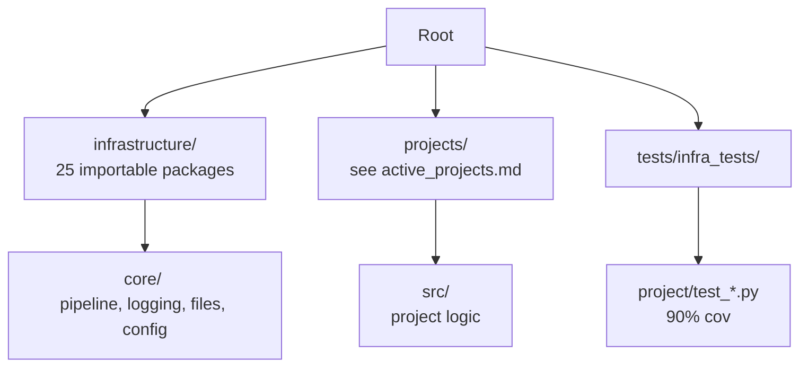

# Canonical Factsheet

> Auto-generated by `scripts/docgen/counts.py` from live repo state. Do not edit
> manually — run `uv run python scripts/docgen/counts.py --write` to refresh.

**Generated from live repo state on 2026-06-30 (UTC).** Volatile literals are re-derived on every run: tracked `infrastructure/` Python-file count via `git ls-files infrastructure | grep .py` (**668**), project-scope + publishing test collection via `pytest --collect-only` (**355** / **634**), the public exemplar roster, and the importable module list. The per-exemplar test/coverage snapshot table is a measured snapshot (see Test Status).

This file aggregates verifiable facts from discovery scripts, CI configuration, and test execution. Human-written documentation should link here rather than duplicate lists or numbers.

## Project Roster

**Always-present canonical exemplars** (the public exemplar projects guaranteed to live under `projects/`):

- `template_active_inference`
- `template_autopoiesis`
- `template_autoresearch_project`
- `template_autoscientists`
- `template_code_project`
- `template_eda_notebook`
- `template_gold_refinement`
- `template_literature_meta_analysis`
- `template_madlib`
- `template_methods_paper`
- `template_newspaper`
- `template_pools_rules_tools`
- `template_prose_project`
- `template_search_project`
- `template_sia`
- `template_storybook`
- `template_template`
- `template_textbook`

Private lifecycle projects live outside this public repo in a separate external repository (location set via `TEMPLATE_PRIVATE_PROJECTS_ROOT` or `.private_projects_root`). The simplified sidecar defaults to `working/` and `archive/`; optional `ongoing/` (long-lived projects with no publication target) plus legacy `active/`, `published/`, and `other/` folders are still recognized when present. `run.sh`/`infrastructure.orchestration` symlinks existing private lifecycle folders into same-named typed subfolders under `template/projects/` (`working/*` → `projects/working/*`, `ongoing/*` → `projects/ongoing/*`, `archive/*` → `projects/archive/*`, optional `active/*` → `projects/active/*`, …) before discovery/rendering; only `projects/templates/` and optional `projects/active/` are default-rendered, while `working/`, `ongoing/`, and `archive/` are non-rendered mirrors for explicit targeted work. Override with `TEMPLATE_PRIVATE_PROJECTS_ROOT` or `.private_projects_root`; disable auto-sync with `TEMPLATE_SKIP_LINK_SYNC=1`; inspect with `uv run python -m infrastructure.orchestration link-projects --dry-run`.

**Public CI/documentation project scope** (`projects/`, filtered through `infrastructure.project.public_scope`; authoritative snapshot → [`active_projects.md`](active_projects.md)):

- `template_active_inference`
- `template_autopoiesis`
- `template_autoresearch_project`
- `template_autoscientists`
- `template_code_project`
- `template_eda_notebook`
- `template_gold_refinement`
- `template_literature_meta_analysis`
- `template_madlib`
- `template_methods_paper`
- `template_newspaper`
- `template_pools_rules_tools`
- `template_prose_project`
- `template_search_project`
- `template_sia`
- `template_storybook`
- `template_template`
- `template_textbook`

`projects/_test_project/` is a stub layout used by validation tests only — omitted from `discover_projects()` (path may be absent in sparse checkouts; not a tracked exemplar tree).

**Work-in-progress projects** (`projects/working/`, not discovered/rendered): local-only symlinks to the private repo's `working/` projects — roster omitted from public docs; list with `ls projects/working/`.

**Ongoing projects** (`projects/ongoing/`, not discovered/rendered): local-only symlinks to the private repo's `ongoing/` projects — long-lived work with no publication target, roster omitted from public docs; render explicitly via the qualified name `ongoing/<name>`; list with `ls projects/ongoing/`.

**Archived projects** (`projects/archive/`, preserved but not executed): local-only symlinks to the private repo's `archive/` projects (roster omitted from public docs) — list with `ls projects/archive/`. `projects/published/` and `projects/other/` are optional legacy non-rendered lifecycle mirrors.

Regenerate [`active_projects.md`](active_projects.md) with:

```bash
uv run python scripts/docgen/active_projects.py
```

Default exemplar for paths: `projects/templates/template_code_project/`.

## Infrastructure Modules

Current importable Python subpackages under `infrastructure/` (25):

- autoresearch
- benchmark
- core
- doctor
- documentation
- fonds
- llm
- methods
- orchestration
- project
- prose
- provenance
- publishing
- reference
- rendering
- reporting
- research
- rules
- scientific
- search
- sia
- skills
- steganography
- tools
- validation

Plus `infrastructure/config/`, `infrastructure/docker/`, and `infrastructure/logrotate.d/` (configuration/documentation directories, not Python packages). Recount with:

```bash
find infrastructure -mindepth 1 -maxdepth 1 -type d -name '[!.]*' \
  -exec sh -c 'test -f "$1/__init__.py" && basename "$1"' sh {} \; | wc -l
```

Tracked Python modules (matches the drift gate):

```bash
git ls-files infrastructure | grep -c '\.py$'
```

(Last refreshed count: **668** on 2026-06-30 UTC — point-in-time; re-derive with the command above, the literal drifts as the tree changes.)

See `infrastructure/AGENTS.md` for module-specific function signatures and entry points.

## Test Status

```bash
uv run pytest tests/infra_tests/project/test_discovery.py -q
```

Current collection commands:

```bash
uv run pytest tests/infra_tests/project/ --collect-only -q --no-cov
uv run pytest tests/infra_tests/publishing/ --collect-only -q --no-cov
```

Result: **355** project-scope infrastructure tests collected and **634** publishing tests collected. Full behavioral gates still live in CI and in the verification commands listed by the relevant `AGENTS.md` files.

**Exemplar `pytest --collect-only` totals** (latest recorded measurements; table membership last updated 2026-07-06; `template_active_inference` coverage preserved from its 2026-06-05 project-local gate run — see note below):

| Project | Tests collected | `src/` line+branch coverage |
|---------|-----------------|----------------------------|
| `template_active_inference` | 382 | 91.35 % |
| `template_autopoiesis` | 493 | 96.41 % |
| `template_autoresearch_project` | 220 | 92.81 % |
| `template_autoscientists` | 87 | 99.60 % |
| `template_code_project` | 236 | 98.78 % |
| `template_eda_notebook` | 62 | 100.00 % |
| `template_gold_refinement` | 248 | 97.55 % |
| `template_literature_meta_analysis` | 772 | 96.74 % |
| `template_madlib` | 37 | 93.96 % |
| `template_methods_paper` | 79 | 98.97 % |
| `template_newspaper` | 53 | 94.37 % |
| `template_pools_rules_tools` | 204 | 90.95 % |
| `template_prose_project` | 78 | 100.00 % |
| `template_search_project` | 296 | 95.13 % |
| `template_sia` | 40 | 97.16 % |
| `template_storybook` | 10 | 93.92 % |
| `template_template` | 89 | 91.62 % |
| `template_textbook` | 112 | 96.73 % |

Collection counts come from per-project `uv run pytest tests/ --collect-only -q --no-cov` runs; coverage values come from the latest per-project coverage gates (`uv run pytest projects/templates/<name>/tests/ --cov=projects/templates/<name>/src`). Re-run the per-project coverage command after changing project `src/` or tests, then refresh this snapshot with `uv run python scripts/docgen/counts.py --write`. `template_active_inference` pins its own `.venv`/toolchain, so its coverage is re-derived in that environment, not from the repo-root interpreter. Orchestration modules (`analysis.py`, `figures.py`, `dashboard.py`, `manuscript_variables.py`) are in the coverage denominator for the code exemplar; `experiment_config.py` is the shared loader for `manuscript/config.yaml` → `experiment:`.

Drift-checker coverage: `uv run python scripts/audit/check_template_drift.py --strict`. Repo `scripts/` fat files emit **WARNING**; project `scripts/` fat files emit **ERROR** through the thin-orchestrator detectors. Per-exemplar detectors include function name drift, test class drift, `__all__` doc drift, coverage floor drift, dead links, oversize `src/*.py`, blanket `except Exception`, mocks in tests, and canonical-file presence.

**Thin-orchestrator gates:**

| Gate | Command | Threshold |
| --- | --- | --- |
| Exemplar drift | `uv run python scripts/audit/check_template_drift.py --strict` | 9+2 detectors |
| Module line count | `uv run python scripts/gates/module_line_count_check.py` | warn ≥800 / fail ≥950 (`infrastructure/`, `scripts/`); warn ≥150 / fail ≥250 (`projects/{exemplar}/scripts/` via `PUBLIC_PROJECT_NAMES`) |
| Unified health | `uv run python -m infrastructure.core.health` | optional `--gates=module-line-count` |
| Tracked projects | `uv run python scripts/audit/check_tracked_projects.py` | non-exemplar paths under `projects/` |
| Generated artifacts | `uv run python scripts/audit/check_tracked_generated_artifacts.py` | disposable `output/` trees |

Coverage gates (enforced in CI):

- infrastructure/ : >= 60% (measured baseline → [`docs/development/coverage-gaps.md`](../development/coverage-gaps.md))
- public template project `src/` trees : >= 90% (matrix project tests; public lint/type paths come from `uv run python -m infrastructure.project.public_scope source-paths`)

Run full suite with:

```bash
uv run python scripts/pipeline/stage_01_test.py --project template_code_project
```

## Command Conventions

Use `uv run` for reproducibility:

- Tests: `uv run python scripts/pipeline/stage_01_test.py --project <name>`
- Pipeline: `uv run python scripts/runner/execute_pipeline.py --project <name> --core-only`
- Interactive: `./run.sh`
- Specific test: `uv run pytest path/to/test.py::test_name -q`

Avoid raw `python3` or `pytest` in documentation.

## Output Layout

- Working outputs: `projects/{name}/output/`
- Final deliverables: `output/{name}/` (subdirectories per project: pdf/, figures/, data/, reports/)
- No root-level `output/pdf/` or `output/project_combined.md`

## Core Patterns

**Thin orchestrator**:

Scripts in `scripts/` and `projects/{name}/scripts/` import computation from `infrastructure.*` or `projects.{name}.src.*`. They handle only I/O, orchestration, and reporting.

**`template_code_project/src/` layout:**
- `optimizer.py`, `invariants.py` — math primitives, infrastructure-free
- `experiment_config.py` — `load_experiment_config()`; single parser for `manuscript/config.yaml` → `experiment:`
- `analysis.py` — experiment orchestration, stability/benchmark, validation, publishing, `main()`
- `figures.py` — matplotlib figure generators (uses `load_experiment_config`)
- `dashboard.py` — Plotly dashboard payload + HTML (`load_experiment_config`)
- `manuscript_variables.py` — `{{TOKEN}}` substitution (`load_experiment_config`, `quadratic_optimum`)

**No-mocks policy**: Tests use real computation, temp files (`tmp_path`), `pytest-httpserver` for HTTP, and `reportlab` for PDF tests.

**Reproducibility**: Fixed seeds, deterministic outputs, idempotent analysis scripts that skip if outputs exist.

## Pipeline Entry Points (from scripts/AGENTS.md)

See `scripts/AGENTS.md` for the pipeline entry-point inventory. The interactive menu's single source of truth is `infrastructure.orchestration.menu.MENU_OPTIONS`.

Key signatures:

- `execute_test_pipeline(...)` in `infrastructure.reporting.pipeline_test_runner`
- `discover_projects(root: Path) -> list[Project]`

## Validation Commands

```bash
uv run python -m infrastructure.validation.cli markdown projects/{name}/manuscript/
uv run python -m infrastructure.validation.cli pdf output/{name}/pdf/
```

## Structure



Link to this file from other documentation instead of repeating facts.

**Regeneration note:** Refresh [`active_projects.md`](active_projects.md) with `scripts/docgen/active_projects.py`. Re-derive this file with `uv run python scripts/docgen/counts.py --write` after meaningful CI or test-scale changes. Re-run `uv run python scripts/audit/check_template_drift.py --strict` and `uv run python scripts/gates/module_line_count_check.py` when drift or line-count gates change.
