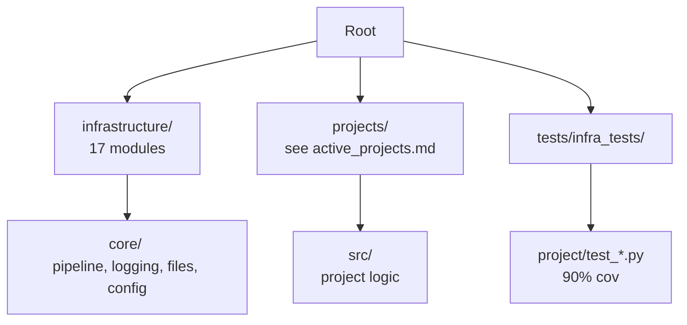

# Canonical Factsheet

**Generated from live repo state on 2026-05-03 (UTC).** Last measured runs: `generate_active_projects_doc.py`, `pytest tests/infra_tests/project/test_discovery.py --collect-only` (57 tests), `ls` of `projects/` and `infrastructure/`. Counts below for `fep_lean` are from the archived `projects_archive/fep_lean/` tree (see commands).

This file aggregates verifiable facts from discovery scripts, CI configuration, and test execution. Human-written documentation should link here rather than duplicate lists or numbers.

## Project Roster

**Always-present canonical exemplars** (the only three guaranteed to live under `projects/`):

- `template_code_project`
- `template_prose_project`
- `template_search_project`

**Active projects this checkout** (`projects/`, from `discover_projects()`; rotates):

- `template_code_project`
- `template_prose_project`
- `template_search_project`
- `actinf_policy_entanglement_lean` (rotating)
- `_test_project` (CI fixture; not a real research project)

Authoritative list (regenerated): [`active_projects.md`](active_projects.md).

**In-progress projects** (`projects_in_progress/`, not discovered until moved under `projects/`):

- biology_textbook
- cogant
- corym
- template
- trsc
- what_is_cogsec

**Archived projects** (`projects_archive/`, preserved but not executed): includes `fep_lean`, `act_inf_metaanalysis`, `cognitive_integrity`, and others — list with `ls projects_archive/`.

Regenerate [`active_projects.md`](active_projects.md) with:

```bash
uv run python scripts/generate_active_projects_doc.py
```

Default exemplar for paths: `projects/template_code_project/`.

## Infrastructure Modules

Current Python subpackages under `infrastructure/` (17):

- config
- core
- docker
- documentation
- llm
- orchestration
- project
- prose
- publishing
- reference
- rendering
- reporting
- scientific
- search
- skills
- steganography
- validation

Plus `infrastructure/logrotate.d/` (config dir, not a Python package). Recount with:

```bash
find infrastructure -maxdepth 1 -type d ! -path infrastructure ! -path infrastructure/logrotate.d | wc -l
```

Python modules on disk:

```bash
find infrastructure -name '*.py' -type f | wc -l
```

(Last refreshed count: **313** on 2026-05-03.)

See `infrastructure/AGENTS.md` for module-specific function signatures and entry points.

## Test Status

```bash
uv run pytest tests/infra_tests/project/test_discovery.py -q
```

Result: 57 passed in ~0.22s (real data, no mocks).

Coverage gates (enforced in CI):

- infrastructure/ : >= 60%
- projects/*/src/ : >= 90% (matrix project tests; excludes `projects/fep_lean/tests/` — see below)
- `projects/fep_lean/src/` : >= 89% (dedicated CI job `fep_lean (gauss + lake)` when `projects/fep_lean/lean/lean-toolchain` exists)

Run full suite with:

```bash
uv run python scripts/01_run_tests.py --project template_code_project
```

### fep_lean (archived — `projects_archive/fep_lean/`)

`fep_lean` is currently archived and not executed by the active pipeline. When present under `projects/`, it has its own coverage gate (≥89 %) and isolated `pyproject.toml`. Historical run from the archive tree:

```bash
cd projects_archive/fep_lean
uv run pytest tests/ --collect-only -q
uv run pytest tests/ -q --cov=src --cov-fail-under=89
```

Last historical collection: **285** tests across **28** modules (adds `tests/test_hermes_error_paths.py` — 9 `pytest-httpserver`-backed tests covering `HermesExplainer.preflight()` and `HermesConfig.fallback_models`). Parallelism: optional `FEP_LEAN_PREFETCH`, Stage 4 `ThreadPoolExecutor`, figure `ProcessPoolExecutor` (spawn; `FEP_LEAN_FIGURES_MP=0` forces serial); `pytest-xdist` and `pytest-httpserver` are dev dependencies. See `projects_archive/fep_lean/tests/AGENTS.md` and `projects_archive/fep_lean/docs/pipeline.md`.

**Hermes resilience (new):** `HermesConfig.fallback_models` is a first-class user-supplied OpenRouter chain (overrides `_FREE_MODEL_CHAIN`); `HermesExplainer.preflight()` runs one `max_tokens=1` probe at the start of Stage 4, flipping `cfg.enabled=False` on 4xx so credential failures surface in <10 s instead of ~12 min into the batch. Actionable 403 logs link to `https://openrouter.ai/settings/keys` and the Anthropic-direct fallback (`HERMES_API_BASE=https://api.anthropic.com/v1` + `ANTHROPIC_API_KEY`). See `projects/fep_lean/docs/troubleshooting.md#hermes-http-403--key-limit-exceeded`.

## Command Conventions

Use `uv run` for reproducibility:

- Tests: `uv run python scripts/01_run_tests.py --project <name>`
- Pipeline: `uv run python scripts/execute_pipeline.py --project <name> --core-only`
- Interactive: `./run.sh`
- Specific test: `uv run pytest path/to/test.py::test_name -q`

Avoid raw `python3` or `pytest` in documentation.

## Output Layout

- Working outputs: `projects/{name}/output/`
- Final deliverables: `output/{name}/` (subdirectories per project: pdf/, figures/, data/, reports/)
- No root-level `output/pdf/` or `output/project_combined.md`

## Core Patterns

**Thin orchestrator**:

Scripts in `scripts/` and `projects/{name}/scripts/` import computation from `infrastructure.*` or `projects.{name}.src.*`. They handle only I/O, orchestration, and reporting.

**No-mocks policy**: Tests use real computation, temp files (`tmp_path`), `pytest-httpserver` for HTTP, and `reportlab` for PDF tests.

**Reproducibility**: Fixed seeds, deterministic outputs, idempotent analysis scripts that skip if outputs exist.

## Pipeline Entry Points (from scripts/AGENTS.md)

See `scripts/AGENTS.md` for `PipelineStageDefinition` and `MENU_SCRIPT_MAPPING`.

Key signatures:

- `execute_test_pipeline(...)` in `infrastructure.reporting.pipeline_test_runner`
- `discover_projects(root: Path) -> list[Project]`

## Validation Commands

```bash
uv run python -m infrastructure.validation.cli markdown projects/{name}/manuscript/
uv run python -m infrastructure.validation.cli pdf output/{name}/pdf/
```

## Structure



Link to this file from other documentation instead of repeating facts.

**Regeneration note:** Refresh [`active_projects.md`](active_projects.md) with `scripts/generate_active_projects_doc.py`. Update this file after meaningful CI or test-scale changes (fep_lean counts, new gates), using measured `pytest` output rather than estimates.
