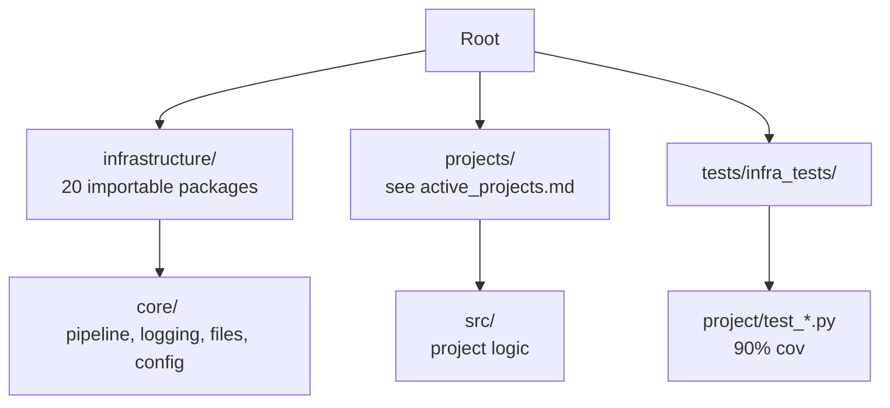

# Canonical Factsheet

**Generated from live repo state on 2026-06-11 (UTC).** Last measured runs: `generate_active_projects_doc.py`, `generate_architecture_overview.py`, `generate_publication_records_doc.py --refresh-external`, `generate_api_reference_doc.py --write`, `generate_stage_table_doc.py --write`, `infrastructure.skills write`, `infrastructure.skills write-index`, `find infrastructure -name '*.py' -type f | wc -l` (**554**), `pytest tests/infra_tests/project/ --collect-only -q --no-cov` (**229**), publishing suite collection/full run (**395**), exemplar project coverage gates (see Test Status), strict drift + line-count gates (see Thin-orchestrator gates below).

This file aggregates verifiable facts from discovery scripts, CI configuration, and test execution. Human-written documentation should link here rather than duplicate lists or numbers.

## Project Roster

**Always-present canonical exemplars** (the public exemplar projects guaranteed to live under `projects/`):

- `template_active_inference`
- `template_autoresearch_project`
- `template_autoscientists`
- `template_code_project`
- `template_newspaper`
- `template_prose_project`
- `template_sia`
- `template_template`
- `template_textbook`

Optional add-on: `projects/archive/template_search_project` (mirrored read-only from the private repo's `archive/`) can be copied under `projects/active/` for literature-search workflows.

Private lifecycle projects live outside this public repo in a separate external repository (location set via `TEMPLATE_PRIVATE_PROJECTS_ROOT` or `.private_projects_root`). The simplified sidecar defaults to `working/` and `archive/`; optional legacy `active/`, `published/`, and `other/` folders are still recognized when present. `run.sh`/`infrastructure.orchestration` symlinks existing private lifecycle folders into same-named typed subfolders under `template/projects/` (`working/*` → `projects/working/*`, `archive/*` → `projects/archive/*`, optional `active/*` → `projects/active/*`, …) before discovery/rendering; only `projects/templates/` and optional `projects/active/` are default-rendered, while `working/` and `archive/` are non-rendered mirrors for explicit targeted work. Override with `TEMPLATE_PRIVATE_PROJECTS_ROOT` or `.private_projects_root`; disable auto-sync with `TEMPLATE_SKIP_LINK_SYNC=1`; inspect with `uv run python -m infrastructure.orchestration link-projects --dry-run`.

**Public CI/documentation project scope** (`projects/`, filtered through `infrastructure.project.public_scope`; authoritative snapshot → [`active_projects.md`](active_projects.md)):

- `template_active_inference`
- `template_autoresearch_project`
- `template_autoscientists`
- `template_code_project`
- `template_newspaper`
- `template_prose_project`
- `template_sia`
- `template_template`
- `template_textbook`

`projects/_test_project/` is a stub layout used by validation tests only — omitted from `discover_projects()` (path may be absent in sparse checkouts; not a tracked exemplar tree).

**Work-in-progress projects** (`projects/working/`, not discovered/rendered): local-only symlinks to the private repo's `working/` projects — roster omitted from public docs; list with `ls projects/working/`.

**Archived projects** (`projects/archive/`, preserved but not executed): local-only symlinks to the private repo's `archive/` projects (roster omitted from public docs) — list with `ls projects/archive/`. `projects/published/` and `projects/other/` are optional legacy non-rendered lifecycle mirrors.

Regenerate [`active_projects.md`](active_projects.md) with:

```bash
uv run python scripts/generate_active_projects_doc.py
```

Default exemplar for paths: `projects/templates/template_code_project/`.

## Infrastructure Modules

Current importable Python subpackages under `infrastructure/` (20):

- autoresearch
- benchmark
- core
- doctor
- documentation
- llm
- methods
- orchestration
- project
- prose
- publishing
- reference
- rendering
- reporting
- scientific
- search
- sia
- skills
- steganography
- validation

Plus `infrastructure/config/`, `infrastructure/docker/`, and `infrastructure/logrotate.d/` (configuration/documentation directories, not Python packages). Recount with:

```bash
find infrastructure -mindepth 1 -maxdepth 1 -type d -name '[!.]*' \
  -exec sh -c 'test -f "$1/__init__.py" && basename "$1"' sh {} \; | wc -l
```

Python modules on disk:

```bash
find infrastructure -name '*.py' -type f | wc -l
```

(Last refreshed count: **554** on 2026-06-11 UTC — point-in-time; re-derive with the command above, the literal drifts as the tree changes.)

See `infrastructure/AGENTS.md` for module-specific function signatures and entry points.

## Test Status

```bash
uv run pytest tests/infra_tests/project/test_discovery.py -q
```

Current collection commands:

```bash
uv run pytest tests/infra_tests/project/ --collect-only -q --no-cov
uv run pytest tests/infra_tests/publishing/ --collect-only -q --no-cov
```

Result: **229** project-scope infrastructure tests collected and **395** publishing tests collected. Full behavioral gates still live in CI and in the verification commands listed by the relevant `AGENTS.md` files.

**Exemplar `pytest --collect-only` totals** (2026-05-27; `template_active_inference` re-derived 2026-06-05 after the v3.2.0 validation-spine additions):

| Project | Tests collected | `src/` line+branch coverage |
|---------|-----------------|----------------------------|
| `template_active_inference` | 343 | 91.35 % |
| `template_autoresearch_project` | 220 | 92.81 % |
| `template_autoscientists` | 79 | 99.59 % |
| `template_code_project` | 196 | 98.25 % |
| `template_newspaper` | 48 | 94.46 % |
| `template_prose_project` | 76 | 100.00 % |
| `template_sia` | 32 | 96.69 % |
| `template_template` | 84 | 91.53 % |
| `template_textbook` | 111 | 97.01 % |

Collection was refreshed with per-project `uv run pytest tests/ --collect-only -q --no-cov` runs. Coverage values come from the latest project coverage gates; re-run the per-project coverage command after changing project `src/` or tests. Orchestration modules (`analysis.py`, `figures.py`, `dashboard.py`, `manuscript_variables.py`) are in the coverage denominator for the code exemplar; `experiment_config.py` is the shared loader for `manuscript/config.yaml` → `experiment:`.

Drift-checker coverage: `uv run python scripts/check_template_drift.py --strict` completed with no drift on 2026-05-27. Repo `scripts/` fat files emit **WARNING**; project `scripts/` fat files emit **ERROR** through the thin-orchestrator detectors. Per-exemplar detectors include function name drift, test class drift, `__all__` doc drift, coverage floor drift, dead links, oversize `src/*.py`, blanket `except Exception`, mocks in tests, and canonical-file presence.

**Thin-orchestrator gates** (measured 2026-05-27):

| Gate | Command | Threshold |
| --- | --- | --- |
| Exemplar drift | `uv run python scripts/check_template_drift.py --strict` | 9+2 detectors |
| Module line count | `uv run python scripts/gates/module_line_count_check.py` | warn ≥800 / fail ≥950 (`infrastructure/`, `scripts/`); warn ≥150 / fail ≥250 (`projects/{exemplar}/scripts/` via `PUBLIC_PROJECT_NAMES`) |
| Unified health | `uv run python -m infrastructure.core.health` | optional `--gates=module-line-count` |
| Tracked projects | `uv run python scripts/check_tracked_projects.py` | non-exemplar paths under `projects/` |
| Generated artifacts | `uv run python scripts/check_tracked_generated_artifacts.py` | disposable `output/` trees |

Current line-count result: no failing or warning modules in `infrastructure/` or `scripts/` (gate thresholds: warn ≥800 / fail ≥950). Largest infra modules measured: `infrastructure/validation/integrity/link_extract.py` at 694 lines, `infrastructure/rendering/pipeline.py` at 685 lines, `infrastructure/validation/evidence_registry_collectors.py` at 307 lines (orchestrator `evidence_registry.py` at 453); `_pdf_combined_renderer.py` is a 49-line facade re-exporting `_pdf_combined_*.py` leaves.

Coverage gates (enforced in CI):

- infrastructure/ : >= 60% (measured baseline → [`docs/development/coverage-gaps.md`](../development/coverage-gaps.md))
- public template project `src/` trees : >= 90% (matrix project tests; public lint/type paths come from `uv run python -m infrastructure.project.public_scope source-paths`)

Run full suite with:

```bash
uv run python scripts/01_run_tests.py --project template_code_project
```

## Command Conventions

Use `uv run` for reproducibility:

- Tests: `uv run python scripts/01_run_tests.py --project <name>`
- Pipeline: `uv run python scripts/execute_pipeline.py --project <name> --core-only`
- Interactive: `./run.sh`
- Specific test: `uv run pytest path/to/test.py::test_name -q`

Avoid raw `python3` or `pytest` in documentation.

## Output Layout

- Working outputs: `projects/{name}/output/`
- Final deliverables: `output/{name}/` (subdirectories per project: pdf/, figures/, data/, reports/)
- No root-level `output/pdf/` or `output/project_combined.md`

## Core Patterns

**Thin orchestrator**:

Scripts in `scripts/` and `projects/{name}/scripts/` import computation from `infrastructure.*` or `projects.{name}.src.*`. They handle only I/O, orchestration, and reporting.

**`template_code_project/src/` layout:**
- `optimizer.py`, `invariants.py` — math primitives, infrastructure-free
- `experiment_config.py` — `load_experiment_config()`; single parser for `manuscript/config.yaml` → `experiment:`
- `analysis.py` — experiment orchestration, stability/benchmark, validation, publishing, `main()`
- `figures.py` — matplotlib figure generators (uses `load_experiment_config`)
- `dashboard.py` — Plotly dashboard payload + HTML (`load_experiment_config`)
- `manuscript_variables.py` — `{{TOKEN}}` substitution (`load_experiment_config`, `quadratic_optimum`)

**No-mocks policy**: Tests use real computation, temp files (`tmp_path`), `pytest-httpserver` for HTTP, and `reportlab` for PDF tests.

**Reproducibility**: Fixed seeds, deterministic outputs, idempotent analysis scripts that skip if outputs exist.

## Pipeline Entry Points (from scripts/AGENTS.md)

See `scripts/AGENTS.md` for the pipeline entry-point inventory. The interactive menu's single source of truth is `infrastructure.orchestration.menu.MENU_OPTIONS`.

Key signatures:

- `execute_test_pipeline(...)` in `infrastructure.reporting.pipeline_test_runner`
- `discover_projects(root: Path) -> list[Project]`

## Validation Commands

```bash
uv run python -m infrastructure.validation.cli markdown projects/{name}/manuscript/
uv run python -m infrastructure.validation.cli pdf output/{name}/pdf/
```

## Structure



Link to this file from other documentation instead of repeating facts.

**Regeneration note:** Refresh [`active_projects.md`](active_projects.md) with `scripts/generate_active_projects_doc.py`. Update this file after meaningful CI or test-scale changes using measured `pytest`/`find` output. Re-run `uv run python scripts/check_template_drift.py --strict` and `uv run python scripts/gates/module_line_count_check.py` when drift or line-count gates change.
