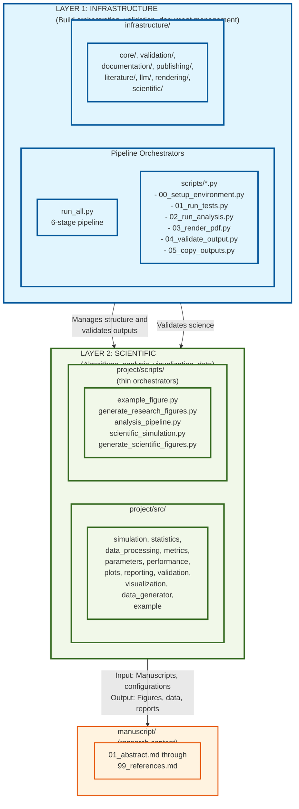

# Two-Layer Architecture Guide

## Overview

This research template implements a clear two-layer architecture separating generic build infrastructure from project-specific scientific content. This document explains the architecture, design rationale, and how to work within this structure.

## Quick Reference: Layer 1 vs Layer 2

| Aspect | **Layer 1: Infrastructure** | **Layer 2: Project** |
|--------|------------------------------|----------------------|
| **Location** | `infrastructure/` (root level) | `project/src/` (project-specific) |
| **Purpose** | Generic, reusable build tools | Domain-specific research code |
| **Scope** | Works with any project | Specific to this research |
| **Test Coverage** | 60% minimum (currently 83.33% - exceeds stretch goal!) | 90% minimum (currently 100% - perfect coverage!) |
| **Scripts** | `scripts/` (root, generic orchestrators) | `project/scripts/` (project orchestrators) |
| **Tests** | `tests/infrastructure/` (root level) | `project/tests/` (project-specific) |
| **Imports** | `from infrastructure.module import` | `from project.src.module import` |
| **Dependencies** | No project dependencies | Can import from infrastructure |
| **Examples** | PDF generation, validation, figure management | Algorithms, simulations, analysis |

## Architecture Layers

### [LAYER 1: INFRASTRUCTURE] Generic Build & Validation Tools

**Location:** `infrastructure/` (root level)

**Purpose:** Reusable tools and utilities that apply to any research project using this template. These handle:
- Build orchestration and PDF generation
- Document validation and quality checking
- Build artifact verification
- Environment reproducibility tracking
- Academic publishing assistance
- Figure and image management
- Markdown integration

**Modules:**
```
infrastructure/
├── core/                      # Core utilities
│   ├── exceptions.py         # Exception hierarchy
│   ├── logging_utils.py      # Unified logging
│   └── config_loader.py      # Configuration management
├── validation/                # Validation tools
│   ├── pdf_validator.py      # PDF rendering quality
│   ├── markdown_validator.py  # Markdown validation
│   └── integrity.py          # File and cross-reference integrity
├── documentation/             # Documentation tools
│   ├── glossary_gen.py       # API documentation generation
│   ├── figure_manager.py     # Figure numbering and references
│   ├── image_manager.py      # Image file management
│   └── markdown_integration.py # Markdown figure integration
├── publishing/                # Publishing tools
├── literature/               # Literature search
├── llm/                      # LLM integration
├── rendering/                # Multi-format rendering
└── scientific/               # Scientific dev tools
```

**Key Characteristics:**
- Generic and reusable across projects
- Handles template infrastructure concerns
- 60% minimum test coverage (currently achieving 83.33% - exceeds stretch goal!)
- No domain-specific logic
- Interfaces with project files (manuscript/, output/)

**Usage Pattern:**
```python
# Infrastructure usage from scripts
from infrastructure.documentation import FigureManager
from infrastructure.documentation import MarkdownIntegration

# These manage the document structure, not the science
fm = FigureManager()
fm.register_figure(
    filename="convergence_plot.png",
    caption="Algorithm convergence comparison",
    label="fig:convergence"
)
```

---

### [LAYER 2: PROJECT] Project-Specific Algorithms & Analysis

**Location:** `project/src/` (project-specific code), `project/scripts/` (project orchestrators)

**Purpose:** Domain-specific code implementing the research project's scientific algorithms, data processing, analysis, and visualization.

**Modules:**
```
project/src/
├── example.py                 # Basic operations (template example)
├── simulation.py              # Scientific simulation framework
├── statistics.py              # Statistical analysis
├── data_generator.py          # Synthetic data generation
├── data_processing.py         # Data preprocessing and cleaning
├── metrics.py                 # Performance metrics
├── parameters.py              # Parameter management
├── performance.py             # Convergence and scalability analysis
├── plots.py                   # Plot implementations
├── reporting.py               # Report generation
├── validation.py              # Result validation
└── visualization.py           # Visualization engine
```

**Scripts (thin orchestrators):**
```
project/scripts/
├── example_figure.py              # Basic figure generation
├── generate_research_figures.py   # Complex figures
├── analysis_pipeline.py           # Analysis workflow
├── scientific_simulation.py       # Simulation execution
└── generate_scientific_figures.py # Automated figure generation
```

**Key Characteristics:**
- Domain-specific and research-focused
- Implements algorithms and computations
- Calls infrastructure when needed
- 90% minimum test coverage (currently achieving 100% - perfect coverage!)
- Follows thin orchestrator pattern

**Usage Pattern:**
```python
# Project-specific usage from scripts
from project.src.simulation import SimpleSimulation
from project.src.statistics import calculate_descriptive_stats
from infrastructure.documentation import FigureManager

# Science: Run simulation and analysis
sim = SimpleSimulation()
results = sim.run()
stats = calculate_descriptive_stats(results)

# Infrastructure: Manage figures
fm = FigureManager()
fm.register_figure(
    filename="results.png",
    caption="Simulation results",
    label="fig:results"
)
```

---

## Layer Separation

### Architectural Boundaries



### Import Guidelines

**✅ Layer 1 → Layer 1:** Infrastructure modules can import from other infrastructure modules
```python
from infrastructure.documentation import FigureManager
from infrastructure.documentation import ImageManager
```

**✅ Layer 2 → Layer 1:** Project code can import infrastructure
```python
from project.src.visualization import plot_results
from infrastructure.documentation import FigureManager

# Use infrastructure for figure management
fig = plot_results(data)
fig.savefig("output/figures/results.png")

fm = FigureManager()
fm.register_figure(
    filename="results.png",
    caption="Results visualization",
    label="fig:results"
)
```

**✅ Layer 2 → Layer 2:** Project modules can import from other project modules
```python
from project.src.simulation import SimpleSimulation
from project.src.statistics import calculate_descriptive_stats
```

**❌ Layer 1 → Layer 2:** Infrastructure should NOT import project code
```python
# BAD: Build tools shouldn't depend on project-specific code
from infrastructure.validation.integrity import verify_output_integrity
from project.src.simulation import SimpleSimulation  # ❌ WRONG

# This breaks the abstraction and makes infrastructure project-specific
```

---

## Code Organization

### [LAYER 1] Infrastructure Structure

```
infrastructure/                # Root level - generic tools
├── __init__.py
├── AGENTS.md                  # Infrastructure documentation
├── README.md                  # Quick reference
├── core/                      # Core utilities
│   ├── exceptions.py
│   ├── logging_utils.py
│   └── config_loader.py
├── validation/                # Validation tools
│   ├── pdf_validator.py
│   ├── markdown_validator.py
│   └── integrity.py
├── documentation/             # Documentation tools
│   ├── glossary_gen.py
│   ├── figure_manager.py
│   ├── image_manager.py
│   └── markdown_integration.py
├── publishing/                # Publishing tools
├── literature/                # Literature search
├── llm/                       # LLM integration
├── rendering/                 # Multi-format rendering
└── scientific/                # Scientific dev tools
```

### [LAYER 2] Project Structure

```
project/                       # Project-specific code
├── src/                       # Project scientific code
│   ├── __init__.py
│   ├── AGENTS.md              # Project documentation
│   ├── README.md              # Quick reference
│   ├── example.py
│   ├── simulation.py
│   ├── statistics.py
│   ├── data_generator.py
│   ├── data_processing.py
│   ├── metrics.py
│   ├── parameters.py
│   ├── performance.py
│   ├── plots.py
│   ├── reporting.py
│   ├── validation.py
│   └── visualization.py
├── scripts/                   # Project orchestrators
│   ├── example_figure.py
│   ├── generate_research_figures.py
│   ├── analysis_pipeline.py
│   ├── scientific_simulation.py
│   └── generate_scientific_figures.py
└── tests/                     # Project tests
    ├── __init__.py
    ├── test_example.py
    ├── test_simulation.py
    ├── test_statistics.py
    └── ...
```

### Test Structure

```
tests/                         # Root level - infrastructure tests
├── conftest.py                # Test configuration
├── infrastructure/            # [LAYER 1] Infrastructure tests
│   ├── __init__.py
│   ├── test_build/
│   ├── test_validation/
│   ├── test_documentation/
│   └── ...
└── integration/               # Cross-layer tests
    ├── __init__.py
    ├── test_integration_pipeline.py
    └── ...

project/tests/                 # [LAYER 2] Project tests
├── __init__.py
├── test_example.py
├── test_simulation.py
├── test_statistics.py
└── ...
```

---

## Execution Flow

### Build Pipeline - Layer Transitions

```mermaid
flowchart TD
    START([User runs:<br/>python3 scripts/run_all.py]) --> CLEAN[STAGE 0: Clean Output Directories<br/>- Remove old outputs<br/>- Prepare fresh build]
    CLEAN --> STAGE00[STAGE 00: LAYER 1<br/>Setup Environment<br/>- Validate Python, dependencies<br/>- Check build tools]
    
    STAGE00 --> PHASE1[PHASE 1: LAYER 1<br/>Test Validation<br/>- Run tests/infrastructure/*.py<br/>- Run project/tests/*.py<br/>- Run tests/integration/*.py<br/>- Validate coverage requirements<br/>Report: [LAYER-1-INFRASTRUCTURE] Running]
    
    PHASE1 --> PHASE2[PHASE 2: LAYER 2<br/>Project Execution<br/>- Run project/scripts/*.py<br/>- Generate figures<br/>- Process data<br/>- Create outputs<br/>Report: [LAYER-2-PROJECT] Running]
    
    PHASE2 --> PHASE2_5[PHASE 2.5: LAYER 1<br/>Utilities<br/>- Generate API glossary<br/>- Validate markdown<br/>- Check cross-references<br/>Report: [LAYER-1-INFRASTRUCTURE] Running]
    
    PHASE2_5 --> PHASE3_5[PHASE 3-5: LAYER 1<br/>Document Generation<br/>- Generate LaTeX preamble<br/>- Build individual PDFs<br/>- Build combined PDF<br/>- Create HTML version<br/>Report: [LAYER-1-INFRASTRUCTURE] Building]
    
    PHASE3_5 --> PHASE6[PHASE 6: LAYER 1<br/>Validation<br/>- Validate PDF quality<br/>- Check for rendering issues<br/>Report: [LAYER-1-INFRASTRUCTURE] Done]
    
    PHASE6 --> SUCCESS([Success:<br/>All PDFs generated,<br/>all layers working])
    
    classDef layer1 fill:#e1f5fe,stroke:#01579b,stroke-width:2px
    classDef layer2 fill:#f1f8e9,stroke:#33691e,stroke-width:2px
    classDef success fill:#e8f5e8,stroke:#2e7d32,stroke-width:3px
    classDef start fill:#fff3e0,stroke:#e65100,stroke-width:2px
    
    class STAGE00,PHASE1,PHASE2_5,PHASE3_5,PHASE6 layer1
    class PHASE2 layer2
    class SUCCESS success
    class START start
```

### Logging Output Example

```
━━━ LAYER 1: Infrastructure Validation ━━━
[YYYY-MM-DD HH:MM:SS] [INFO] Running tests (infrastructure + scientific)
...tests output...
[YYYY-MM-DD HH:MM:SS] [INFO] ✅ All tests passed with adequate coverage

━━━ LAYER 2: Project Computation ━━━
[YYYY-MM-DD HH:MM:SS] [INFO] Executing project scripts...
[YYYY-MM-DD HH:MM:SS] [INFO] [LAYER-2-PROJECT] Starting analysis pipeline...
...script output...
[YYYY-MM-DD HH:MM:SS] [INFO] ✅ ALL project scripts executed successfully

━━━ LAYER 1: Infrastructure Validation ━━━
[YYYY-MM-DD HH:MM:SS] [INFO] Running repository utilities (glossary + markdown validation)
...validation output...
[YYYY-MM-DD HH:MM:SS] [INFO] ✅ Repository utilities completed

━━━ LAYER 1: Document Generation ━━━
[YYYY-MM-DD HH:MM:SS] [INFO] Step 3: Generating LaTeX preamble from markdown...
[YYYY-MM-DD HH:MM:SS] [INFO] Step 4: Discovering and building ALL markdown modules...
...PDF generation output...
[YYYY-MM-DD HH:MM:SS] [INFO] ✅ Combined document built successfully
```

---

## Adding New Code

### Decision Tree: Where Should Code Go?

```
┌─ Is this specific to our research project?
│  ├─ YES → Layer 2 (project/src/)
│  └─ NO  ─┐
│          └─ Is it about building/validating?
│             ├─ YES → Layer 1 (infrastructure/)
│             └─ NO  → Reconsider scope
│
├─ Examples that belong in Layer 2:
│  ├─ Simulation algorithms
│  ├─ Statistical analysis specific to our problem
│  ├─ Custom visualization for our data
│  ├─ Parameter sweeps for our experiment
│  └─ Domain-specific data processing
│
├─ Examples that belong in Layer 1:
│  ├─ PDF generation logic
│  ├─ Figure management and numbering
│  ├─ Document validation
│  ├─ Build artifact verification
│  ├─ Generic data processing utilities
│  └─ Cross-project templates
│
└─ Is your code reusable across projects?
   ├─ YES → Layer 1 (infrastructure/)
   └─ NO  → Layer 2 (project/src/)
```

### Adding a New Project Module

1. **Create the module:**
   ```bash
   vim project/src/new_algorithm.py
   ```

2. **Implement with type hints and docstrings:**
   ```python
   """New algorithm implementation."""
   from typing import List, Optional
   
   def analyze_data(data: List[float]) -> Optional[float]:
       """Analyze data.
       
       Args:
           data: Input data
           
       Returns:
           Analysis result
       """
       pass
   ```

3. **Write comprehensive tests:**
   ```bash
   vim project/tests/test_new_algorithm.py
   ```

4. **Add to project/src/__init__.py:**
   ```python
   from .new_algorithm import analyze_data
   ```

5. **Use in scripts:**
   ```python
   from project.src.new_algorithm import analyze_data
   ```

6. **Update documentation:**
   - Add to project/src/AGENTS.md
   - Add to project/src/README.md

### Adding a New Infrastructure Module

1. **Create the module:**
   ```bash
   vim infrastructure/validation/new_validator.py
   ```

2. **Implement generic, project-independent logic:**
   ```python
   """New validation tool."""
   
   def validate_output_structure(output_dir: str) -> bool:
       """Validate output directory structure."""
       pass
   ```

3. **Write comprehensive tests:**
   ```bash
   vim tests/infrastructure/test_validation/test_new_validator.py
   ```

4. **Document usage:**
   - Add to infrastructure/validation/AGENTS.md
   - Include usage examples

5. **Integrate with build pipeline:**
   - Update scripts/run_all.py if needed
   - Update infrastructure modules if applicable

---

## Testing Strategy

### Infrastructure Tests (tests/infrastructure/)

- Verify build orchestration works
- Test validation logic
- Check file integrity checking
- Validate PDF generation
- No dependency on scientific code

**Command:**
```bash
pytest tests/infrastructure/ --cov=infrastructure
```

### [LAYER 2] Project Tests (project/tests/)

- Test algorithms correctness
- Verify statistical computations
- Check data processing
- Validate visualization output
- No dependency on build infrastructure

**Command:**
```bash
pytest project/tests/ --cov=project/src
```

### Integration Tests (tests/integration/)

- End-to-end pipeline validation
- Script execution testing
- Layer interaction verification
- Output completeness checking

**Command:**
```bash
pytest tests/integration/ --cov=project/src --cov=infrastructure
```

### Full Test Suite

```bash
# All tests with coverage
pytest tests/ project/tests/ --cov=infrastructure --cov=project/src --cov-fail-under=70

# Generate coverage report
pytest tests/ project/tests/ --cov=infrastructure --cov=project/src --cov-report=html
open htmlcov/index.html
```

---

## Best Practices

### For Infrastructure Development

✅ **Do:**
- Write generic, reusable code
- Document with project-independent examples
- Test extensively with real scenarios
- Handle errors gracefully
- Provide clear logging

❌ **Don't:**
- Import scientific modules
- Assume specific research domain
- Skip tests to ship features
- Hardcode project-specific values
- Mix concerns (building vs. computation)

### For Scientific Development

✅ **Do:**
- Use infrastructure tools for document management
- Follow thin orchestrator pattern in project/scripts/
- Implement algorithms in project/src/ modules
- Test with real data
- Document domain-specific concepts

❌ **Don't:**
- Duplicate build/validation logic
- Implement document generation in scripts
- Skip layer abstraction
- Mix orchestration with computation
- Depend on infrastructure internals

### Logging Best Practices

```python
# In project scripts - mark layer transitions
import logging
logger = logging.getLogger(__name__)

logger.info("[LAYER-2-PROJECT] Starting simulation...")
logger.info("[LAYER-1-INFRASTRUCTURE] Using FigureManager for output...")
```

```bash
# In build scripts - mark phase transitions
log_info "━━━ LAYER 1: Infrastructure Validation ━━━"
log_info "━━━ LAYER 2: Scientific Computation ━━━"
```

---

## Migration from Flat Structure

If you have an old project with flat src/, migrating to the two-layer structure:

1. **Create packages:**
   ```bash
   mkdir -p infrastructure project/src
   ```

2. **Move modules:**
   - Infrastructure modules → infrastructure/
   - Project modules → project/src/

3. **Update imports:**
   - `from example import` → `from project.src.example import`
   - Build verification is handled by the validation module

4. **Update tests:**
   - Infrastructure tests → tests/infrastructure/
   - Project tests → project/tests/
   - Update conftest.py if needed

5. **Validate:**
   ```bash
   pytest tests/ project/tests/ --cov=infrastructure --cov=project/src
   python3 scripts/run_all.py
   ```

---

## Troubleshooting

### Import Errors

**Error:** `ModuleNotFoundError: No module named 'project.src'`

**Solution:** Ensure tests/conftest.py includes project/ on path:
```python
import sys
sys.path.insert(0, os.path.join(repo_root, "project"))
```

### Layer Violations

**Error:** Infrastructure module imports from project

**Solution:** Refactor to remove dependency or move code to appropriate layer

**Check:**
```bash
# Find infrastructure imports of project code
grep -r "from project.src import" infrastructure/
grep -r "import project.src" infrastructure/
```

### Mixed Concerns

**Error:** Build logic in project module

**Solution:** Move to infrastructure layer or extract into separate module

---

## References

### Architecture Documentation
- [ARCHITECTURE.md](ARCHITECTURE.md) - Complete system architecture overview
- [DECISION_TREE.md](../architecture/DECISION_TREE.md) - Code placement flowchart
- [THIN_ORCHESTRATOR_SUMMARY.md](../architecture/THIN_ORCHESTRATOR_SUMMARY.md) - Thin orchestrator pattern details

### Layer-Specific Documentation
- [infrastructure/AGENTS.md](../infrastructure/AGENTS.md) - Infrastructure layer documentation
- [infrastructure/README.md](../infrastructure/README.md) - Infrastructure quick reference
- [project/src/AGENTS.md](../project/src/AGENTS.md) - Project layer documentation
- [project/src/README.md](../project/src/README.md) - Project quick reference

### System Documentation
- [../AGENTS.md](../AGENTS.md) - Complete system documentation
- [../README.md](../README.md) - Project overview
- [HOW_TO_USE.md](HOW_TO_USE.md) - Complete usage guide

---

## Key Takeaway

**Layers separate concerns:**
- **[LAYER 1: INFRASTRUCTURE]** handles *how* research is documented and built
- **[LAYER 2: PROJECT]** focuses on *what* research is conducted

This separation makes code more modular, reusable, and maintainable.

## Quick Navigation

- **Understanding the architecture**: Start with the [Quick Reference](#quick-reference-layer-1-vs-layer-2) table above
- **Adding code**: See [Decision Tree](#decision-tree-where-should-code-go) section
- **Import patterns**: See [Import Guidelines](#import-guidelines) section
- **Testing**: See [Testing Strategy](#testing-strategy) section


