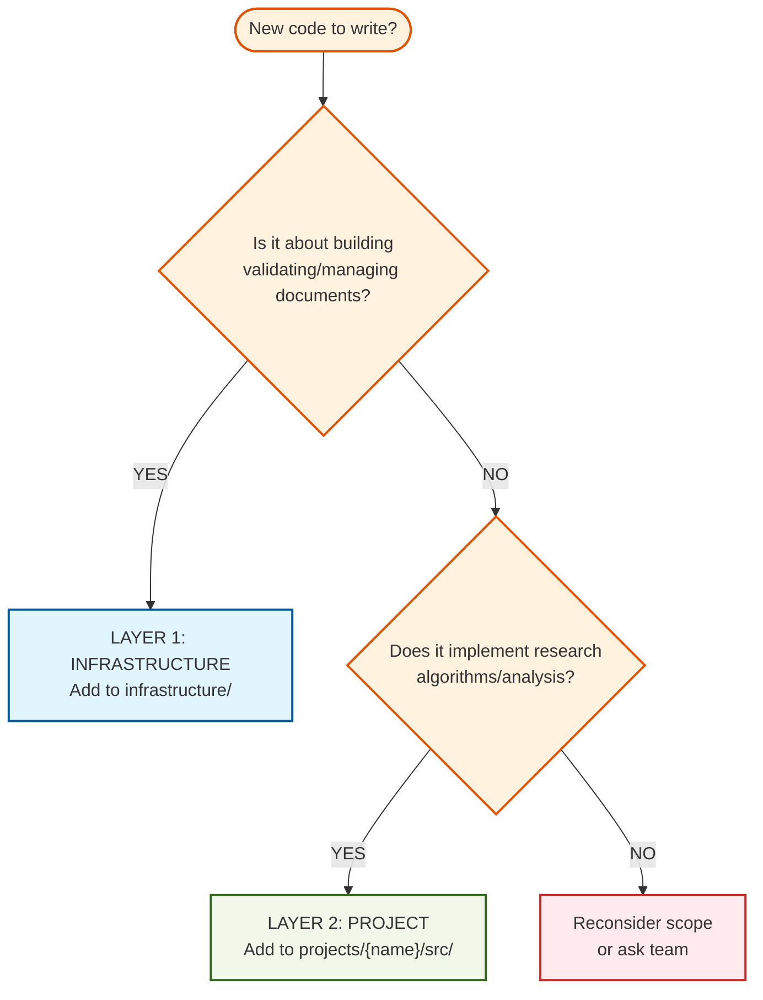
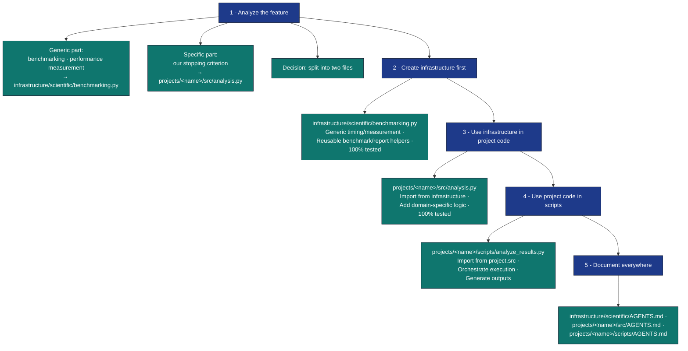
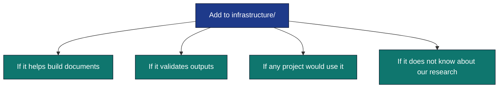
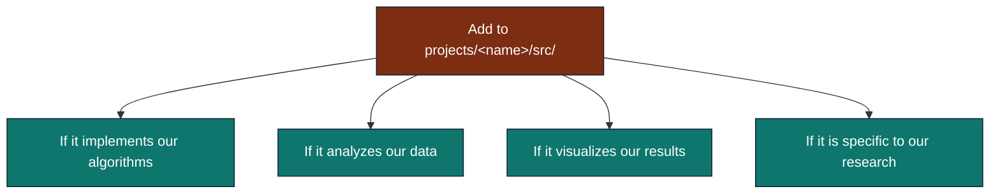

# Code Placement Decision Tree

Quick reference for determining where new code belongs in the two-layer architecture.

## Simple Decision Tree



---

## Detailed Examples

### Questions to Ask

**1. Will this code be used in EVERY research project using this template?**

- YES → Infrastructure
- NO → Scientific

**2. Does this code validate or build outputs?**

- YES → Infrastructure
- NO → Scientific

**3. Is this code specific to our research domain?**

- YES → Scientific
- NO → Infrastructure

**4. Does this code depend on knowing what our research is about?**

- YES → Scientific
- NO → Infrastructure

**5. Would another research group reuse this code unchanged?**

- YES → Infrastructure
- NO → Scientific

---

## Layer 1: Infrastructure Examples

### ✅ Belongs in infrastructure/

**Build and Document Management:**

- PDF generation and LaTeX compilation
- Markdown file processing and validation
- Figure numbering and cross-referencing
- Image file management and insertion
- Document quality checking
- Cross-reference validation

**Example: Figure Manager**

```python
# infrastructure/documentation/figure_manager.py

class FigureManager:
    """Manage figure numbering and references.
    
    This is infrastructure - works for ANY research project.
    """
    def register_figure(
        self,
        filename: str,
        caption: str,
        label: Optional[str] = None,
        section: Optional[str] = None,
        **kwargs
    ) -> FigureMetadata:
        """Register a figure with automatic numbering."""
        pass
    
    def generate_latex_figure_block(self, label: str) -> str:
        """Generate LaTeX figure block."""
        pass
```

**Publishing and Metadata:**

- DOI validation
- Citation generation (BibTeX, APA, etc.)
- Publication metadata extraction
- Academic profile integration

**Build Verification:**

- Build artifact checking
- Reproducibility verification
- Environment state capture
- File integrity validation

**Example: Integrity Verification**

```python
# infrastructure/validation/integrity/checks.py

def verify_output_integrity(
    output_dir: str,
    expected_files: List[str]
) -> bool:
    """Verify expected build artifacts exist.
    
    This is infrastructure - validates ANY project's outputs.
    """
    pass
```

### ❌ NOT Infrastructure

- Domain-specific algorithms
- Research-specific visualization
- Custom statistical analysis
- Project-specific data processing
- Experimental simulations

---

## Layer 2: Scientific Examples

### ✅ Belongs in projects/{name}/src/

**Algorithms and Computation:**

- Simulation implementations
- Statistical analysis
- Data processing specific to problem
- Optimization algorithms
- Model training/inference

**Example: Simulation**

```python
# projects/{name}/src/simulation.py

class MySimulation(SimulationBase):
    """Specific simulation for our research.
    
    This is scientific - implements OUR algorithm.
    """
    def step(self) -> None:
        """Execute one simulation step."""
        # Our specific algorithm here
        pass
```

**Data Generation and Processing:**

- Synthetic data generators for experiments
- Domain-specific preprocessing
- Feature extraction for analysis
- Dataset normalization

**Analysis and Reporting:**

- Statistical hypothesis testing
- Convergence analysis
- Performance metrics specific to problem
- Custom report generation

**Example: Analysis**

```python
# projects/{name}/src/analysis.py

def analyze_convergence(
    results: np.ndarray,
    tolerance: float
) -> Dict[str, Any]:
    """Analyze convergence of OUR algorithm.
    
    This is scientific - domain-specific analysis.
    """
    pass
```

**Visualization:**

- Domain-specific plots
- Research-specific visualizations
- Custom chart types for analysis
- Interactive visualizations

**Example: Plotting**

```python
# projects/{name}/src/plots.py

def plot_experimental_results(
    data: Dict[str, np.ndarray]
) -> plt.Figure:
    """Plot results specific to our experiments.
    
    This is scientific - domain-specific visualization.
    """
    pass
```

### ❌ NOT Scientific

- Generic figure numbering (→ Infrastructure)
- PDF generation (→ Infrastructure)
- Document validation (→ Infrastructure)
- Generic plotting utilities (could be infrastructure)
- Cross-project utilities (→ Infrastructure)

---

## Gray Areas

### When Code Could Go Either Way

**Data Processing:**

- Generic preprocessing → Infrastructure (e.g., `normalize_data`)
- Domain-specific preprocessing → Scientific (e.g., `preprocess_brain_scans`)

**Visualization:**

- Generic plotting → Infrastructure (e.g., `plot_scatter`)
- Domain-specific plots → Scientific (e.g., `plot_convergence_with_our_metric`)

**Metrics:**

- Generic metrics → Infrastructure (e.g., `calculate_accuracy`)
- Domain-specific metrics → Scientific (e.g., `calculate_domain_score`)

**Strategies:**

1. If unsure, ask: "Could we use this in another project?"
2. If yes → Infrastructure
3. If the generic version goes to Infrastructure, specific version stays in Scientific
4. Example:

   ```python
   # Infrastructure: Generic normalization
   from infrastructure.data_processing import normalize_data
   
   # Scientific: Use generic + add domain logic
   def preprocess_our_data(raw_data):
       normalized = normalize_data(raw_data)
       # Add our specific processing here
       return our_transform(normalized)
   ```

---

## Practical Workflow

### Starting a Feature

**Feature:** Add convergence analysis with custom stopping criterion



### Adding a New Data Processing Step

```mermaid
flowchart TB
    Q[Question: Where does this belong?]
    Q --> A1{For our specific<br/>problem?}
    A1 -- yes --> P1[Project layer<br/>projects/&lt;name&gt;/src/data_processing.py<br/><br/>def process_our_specific_data&#40;raw_data&#41;:<br/>&nbsp;&nbsp;&nbsp;&nbsp;pass]
    A1 -- no --> A2{Any research<br/>could use this?}
    A2 -- yes --> I1[Infrastructure layer<br/>infrastructure/scientific/data_processing.py<br/><br/>def normalize_data&#40;raw_data&#41;:<br/>&nbsp;&nbsp;&nbsp;&nbsp;pass]
    A2 -- both --> SPLIT{Generic + specific}
    SPLIT --> I2[Infrastructure: Generic version<br/>def normalize_data&#40;raw_data, method=&quot;zscore&quot;&#41;]
    SPLIT --> P2[Project: Specific usage<br/>def process_our_data&#40;raw_data&#41;:<br/>&nbsp;&nbsp;&nbsp;&nbsp;return normalize_data&#40;..., method=&quot;our_method&quot;&#41;]

    classDef q fill:#1e3a8a,stroke:#0f172a,color:#fff
    classDef p fill:#7c2d12,stroke:#0f172a,color:#fff
    classDef i fill:#0f766e,stroke:#0f172a,color:#fff
    class Q,A1,A2,SPLIT q
    class P1,P2 p
    class I1,I2 i
```



---

## Anti-Patterns

### ❌ Wrong: Infrastructure Imports Scientific

```python
# BAD: infrastructure/validation/integrity/checks.py
from project.src.simulation import MySimulation  # ❌ Don't do this!

def verify_scientific_output(sim: MySimulation):
    pass
```

**Problem:** Breaks abstraction, makes infrastructure project-specific

**Fix:** Move to scientific layer or refactor to use generic interfaces

### ❌ Wrong: Business Logic in Scripts

```python
# BAD: scripts/analysis.py
def custom_algorithm(data):
    # Complex algorithm here  ❌ Don't do this!
    pass

# Scripts should orchestrate, not compute
```

**Problem:** Violates thin orchestrator pattern

**Fix:** Move to projects/{name}/src/, import in script

### ❌ Wrong: Duplicate Code Across Layers

```python
# BAD: infrastructure/plots.py
def plot_convergence(data):
    pass

# BAD: projects/{name}/src/plots.py
def plot_convergence(data):  # ❌ Duplicate!
    pass
```

**Problem:** Maintenance nightmare, inconsistency

**Fix:** Keep in one layer, import from other if needed

### ❌ Wrong: Too Much in One Module

```python
# BAD: projects/{name}/src/everything.py - 2000+ lines
# Simulation, statistics, plotting, data processing...all mixed

# Better: Separate modules
# projects/{name}/src/simulation.py
# projects/{name}/src/statistics.py
# projects/{name}/src/plots.py
# projects/{name}/src/data_processing.py
```

**Problem:** Hard to test, understand, and maintain

**Fix:** One responsibility per module

---

## Common Questions

### "Where does utility function X go?"

1. Is it used by build/document generation? → Infrastructure
2. Is it used by scientific code? → Scientific
3. Is it used by both? → Both use each other appropriately
   - Generic version in Infrastructure
   - Specific version in Scientific
   - Scientific imports Infrastructure

### "Where should orchestration scripts go?"

- Build/document orchestration → scripts/
- Business logic → src/

Scripts should be thin orchestrators that import from src/.

### "Should scientific code be in src/ or scripts/?"

- **projects/{name}/src/** - Business logic, algorithms, computations (tested)
- **projects/{name}/scripts/** - Orchestration and I/O (thin orchestrators, calls projects/{name}/src/)

Rule: If it can be tested independently, it goes in src/.

### "How do I use infrastructure code in scientific code?"

```python
# projects/{name}/src/my_analysis.py
from infrastructure.documentation import FigureManager, MarkdownIntegration

def analyze_and_report(data):
    # Scientific computation
    results = run_analysis(data)
    
    # Use infrastructure for document management
    fm = FigureManager()
    fm.register_figure(
        filename="results.png",
        caption="Analysis results",
        label="fig:results"
    )
    
    return results
```

✅ This is fine - scientific uses infrastructure

### "How do I use scientific code in infrastructure code?"

❌ **Don't.**

Infrastructure should be generic and not depend on specific research.

If you need to, reconsider:

- Is the code really infrastructure?
- Should it be in scientific layer instead?
- Can you extract the generic parts?

---

## Testing Location

Choose based on WHAT you're testing, not WHERE:

```python
# Infrastructure code → tests/infra_tests/
# tests/infra_tests/documentation/test_figure_manager.py
def test_figure_numbering():
    fm = FigureManager()
    fm.register_figure(filename="a.png", caption="Figure A", label="fig:a")
    assert len(fm.figures) == 1

# Project code → projects/{name}/tests/
# projects/{name}/tests/test_simulation.py
def test_simulation_step():
    sim = MySimulation()
    sim.step()
    assert sim.time == 1.0

# Integration tests → tests/integration/
# tests/integration/test_full_pipeline.py
def test_script_execution():
    # Test that scientific scripts use infrastructure correctly
    pass
```

---

## Summary Matrix

| Aspect | Infrastructure | Scientific |
|--------|---|---|
| **Location** | `infrastructure/` | `projects/{name}/src/` |
| **Purpose** | Build & validation tools | Algorithms & analysis |
| **Reusable** | Across all projects | Project-specific |
| **Examples** | PDF generation, figure mgmt | Simulation, statistics |
| **Dependencies** | Other infrastructure | Infrastructure + other scientific |
| **Testing** | `tests/infra_tests/` | `projects/{name}/tests/` |
| **Scripts** | `scripts/*.py` | `scripts/*.py` |

---

## Quick Reference

**For Infrastructure:**



**For Project:**



---

When in doubt: **Ask yourself** — "Would another research group use this unchanged?" If yes → Infrastructure. If no → Scientific.


## See Also

- **[Two-Layer Architecture](../architecture/two-layer-architecture.md)** — Full system design overview
