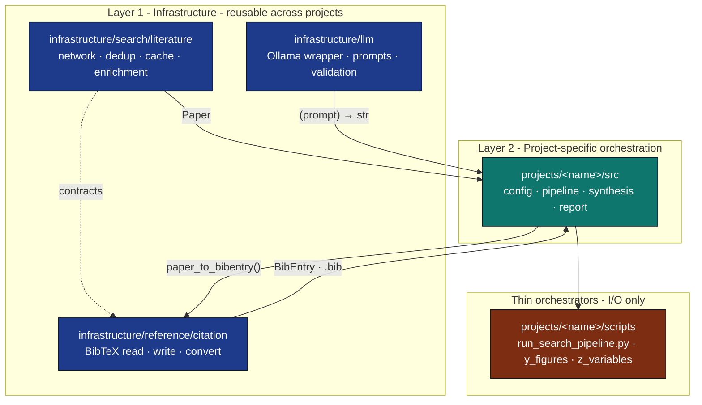

# Discovery → Export → Synthesis: A Three-Module Architecture

This note explains how `infrastructure/search/`,
`infrastructure/reference/`, and `infrastructure/llm/` compose into a
single agent-shaped workflow without violating the two-layer
architecture (Layer 1 = generic infrastructure, Layer 2 = project code).

## Constraint Recap

* All business logic lives in `infrastructure/` (generic) or
  `projects/<name>/src/` (domain-specific).
* `scripts/` are thin orchestrators.
* No mocks; all I/O is real (HTTP via `pytest-httpserver`, files via
  `tmp_path`).

The literature workflow could have collapsed into one mega-module. We
deliberately split it into **three** along orthogonal dependency lines:

## Why Three Modules

### 1. Different change cadences

* External APIs change quarterly → `search/`.
* BibTeX format is frozen by Pandoc → `reference/`.
* LLM prompts change weekly → project `src/`.

Splitting along this axis means an arXiv API breaking change cannot
break BibTeX rendering, and a prompt revision cannot regress search.

### 2. Different test strategies

* `search/` needs `pytest-httpserver` for HTTP backends.
* `reference/` needs zero network — pure data-in / data-out.
* `llm/` needs an Ollama instance for some tests (gracefully skipped in
  CI when absent).

Putting them together would force every test to bring up an HTTP server.

### 3. Different optional dependencies

* `search/` is stdlib only (`urllib`, `xml.etree`).
* `reference/` is stdlib only.
* `llm/` requires `requests` (already optional via the `[llm]` group).
* `FulltextFetcher` requires `pypdf` (already optional via `[rendering]`).

The split keeps each module installable in isolation.

## Boundaries

### `Paper` is the canonical record

Every search backend returns `Paper`; every consumer (BibTeX, LLM,
manuscript) accepts `Paper`. New backends do not need to know about
BibTeX. New citation styles do not need to know about HTTP. New LLM
prompts do not need to know about either.

### `BibDatabase` is the export contract

Citation keys are the public API across module boundaries: once a
`BibEntry` is in a `BibDatabase`, the manuscript references it by
`citation_key`. The Paper that produced it is gone.

### Errors are values, not exceptions

`SearchResult.errors: dict[str, str]` and `FetchResult.status` make
partial successes first-class. Callers decide what's fatal. The default
behaviour is "any data beats no data."

## Layer-2 Responsibility

A project that uses these modules (e.g.
[`projects/template_search_project/`](../../projects/template_search_project/))
owns:

1. The query (`config.yaml` or env-driven).
2. The choice of backends and enrichment level.
3. The prompts fed to `llm/`.
4. The figures / manuscript glue.

The infrastructure modules contain none of this. They are reusable across
any project that wants the search → bib → LLM shape.

## Anti-Patterns

These would re-couple the modules and undo the split:

* ❌ A `LiteratureClient.to_bibtex()` method calling
  `infrastructure.reference.citation` directly.
* ❌ A `paper_to_bibentry()` that fires off an enrichment fetch when the
  abstract is missing.
* ❌ An LLM prompt embedded in `search/literature/`.
* ❌ A `SearchResult` stored as BibTeX text.

If you catch yourself wanting any of these, push the orchestration into
`projects/<name>/scripts/`.

## See Also

* [`docs/architecture/two-layer-architecture.md`](two-layer-architecture.md)
* [`docs/architecture/thin-orchestrator-summary.md`](thin-orchestrator-summary.md)
* [`docs/core/literature-data-flow.md`](../core/literature-data-flow.md)
