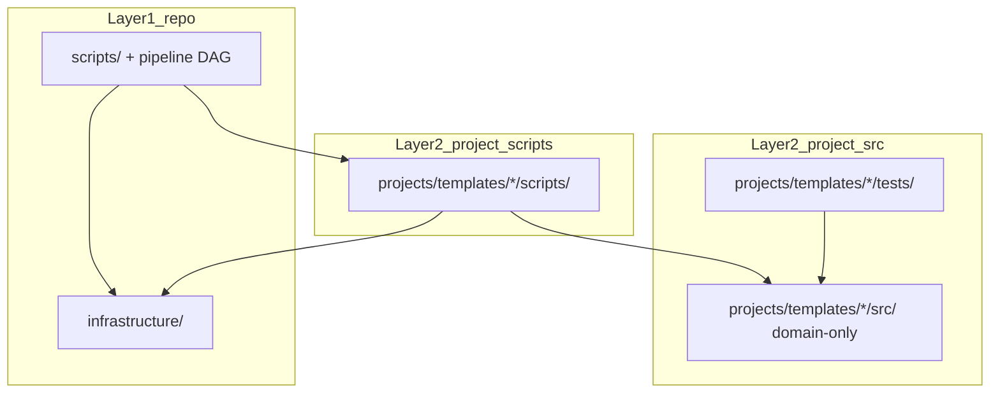

# Thin Orchestrator Pattern Implementation Summary

## Overview

This document summarizes the implementation of the **thin orchestrator pattern** in the project template, where scripts in `scripts/` are lightweight wrappers that import and use-tested methods from `infrastructure/` modules (for root scripts) or `projects/{name}/src/` modules (for project scripts). For related information, see **[`../core/how-to-use.md`](../core/how-to-use.md)** for usage guidance, **[`../core/architecture.md`](../core/architecture.md)**, **[`../core/workflow.md`](../core/workflow.md)**, and **[`../README.md`](../README.md)**.

## Architecture

### Three-ring orchestration (template exemplars)

Public template projects model three rings. Live counts and coverage figures
belong in [`docs/_generated/COUNTS.md`](../_generated/COUNTS.md) — link there
from README/AGENTS instead of embedding measured numbers.



| Ring | Location | Imports infrastructure? |
| --- | --- | --- |
| Pipeline | `scripts/00_*.py` … `infrastructure.orchestration` | Yes — generic orchestration |
| Project scripts | `projects/templates/<name>/scripts/` | Yes — thin coordinators |
| Project `src/` | `projects/templates/<name>/src/` | No (standalone exemplars); harness adapters documented in `manuscript/layer_contract.yaml` |

### Two-Layer Architecture

**Layer 1: Infrastructure (Generic - Reusable)**

- `infrastructure/` - Generic build/validation tools (reusable across projects)
- `scripts/` - Entry point orchestrators (thin wrappers that delegate to infrastructure)
- `tests/` - Infrastructure tests

**Layer 2: Project (Project-Specific - Customizable)**

- `projects/{name}/src/` - Research algorithms and analysis (domain-specific)
- `projects/{name}/scripts/` - Project analysis scripts (thin orchestrators)
- `projects/{name}/tests/` - Project test suite

### Root Scripts (scripts/)

Root-level scripts in `scripts/` are **maximally thin orchestrators** that:

- Import business logic from `infrastructure/` modules
- Coordinate pipeline stages
- Handle I/O and orchestration only
- Work with ANY project structure

**Example**: `scripts/01_run_tests.py` imports `parse_pytest_output()` from `infrastructure.reporting.pytest_output_parser` and `generate_test_report()` from `infrastructure.reporting.report_generator`, not implementing them locally.

### Project Scripts (projects/{name}/scripts/)

Project-specific scripts in `projects/{name}/scripts/` are thin orchestrators that:

- Import computation from `projects/{name}/src/` modules
- Import utilities from `infrastructure/` modules
- Orchestrate domain-specific workflows
- Handle I/O and visualization

**Example**: `projects/{name}/scripts/optimization_analysis.py` imports from `projects/{name}/src/` for computation (code exemplar).

### 2. **Documentation**

#### `scripts/README.md`

- **Purpose**: guide to the thin orchestrator pattern
- **Content**: Architecture, best practices, examples, and templates
- **Key Sections**: Import patterns, usage examples, do's and don'ts

#### Updated Main Documentation

- **`README.md`**: Emphasizes thin orchestrator architecture
- **`.cursorrules`**: Enforces thin orchestrator principles
- **`markdown-template-guide.md`**: Documents cross-referencing system

### 3. **Architectural Principles Established**

#### Clear Separation of Concerns

**Root Scripts (scripts/):**

- **MUST**: Import business logic from `infrastructure/` modules
- **MUST**: Coordinate pipeline stages only
- **MUST**: Handle I/O and orchestration only
- **MUST NOT**: Implement business logic (parsing, validation, discovery, etc.)
- **MUST NOT**: Import from `projects/{name}/src/` (root scripts are generic)

**Project Scripts (projects/{name}/scripts/):**

- **MUST**: Import computation from `projects/{name}/src/` modules
- **MUST**: Import utilities from `infrastructure/` modules
- **MUST**: Handle I/O, visualization, and orchestration
- **MUST NOT**: Implement algorithms (should be in `projects/{name}/src/`)
- **MUST NOT**: Duplicate business logic

**Infrastructure Modules:**

- **MUST**: Contain all reusable business logic
- **MUST**: Be tested
- **MUST**: Work with any project structure

## How It Works

### 1. **Root Script Import Pattern (scripts/)**

```python
# scripts/01_run_tests.py - Root orchestrator
from infrastructure.reporting.pipeline_test_runner import (
    INFRASTRUCTURE_TEST_SCOPES,
    execute_test_pipeline,
)

# Delegate all business logic to the infrastructure entry point;
# execute_test_pipeline internally parses pytest output and generates the report.
exit_code = execute_test_pipeline(
    project_name=args.project,
    repo_root=repo_root,
    run_infra=run_infra,
    run_project=run_project,
    infra_scope=args.infra_scope,
)
save_test_report_to_files(report, output_dir)
```

### 2. **Project Script Import Pattern (projects/{name}/scripts/)**

```python
# projects/{name}/scripts/optimization_analysis.py - Project orchestrator (code exemplar)
from projects.template_code_project.src.example import add_numbers, calculate_average  # From projects/{name}/src/
from infrastructure.documentation.figure_manager import FigureManager  # From infrastructure/

# Use projects/{name}/src/ methods for computation
data = [1, 2, 3, 4, 5]
avg = calculate_average(data)  # From projects.template_code_project.src.example

# Script handles visualization and output
fig, ax = plt.subplots()
ax.plot(data)
ax.set_title(f"Average: {avg}")
```

### 3. **Integration with Build System**

The `scripts/execute_pipeline.py` orchestrator automatically:

1. **Runs tests** with coverage requirements (ensuring infrastructure and project code work)
2. **Executes project scripts** (validating projects/{name}/src/ integration)
3. **Generates figures** (using tested projects/{name}/src/ methods)
4. **Builds PDFs** (using infrastructure rendering modules)
5. **Validates outputs** (using infrastructure validation modules)

## Benefits of This Architecture

### 1. **Maintainability**

- Single source of truth for business logic
- Changes to algorithms only happen in `@src/`
- Scripts automatically use updated functionality

### 2. **Testability**

- test coverage of core functionality
- Scripts can be tested by using real src/ imports with test data
- Integration testing validates the entire pipeline

### 3. **Reusability**

- Scripts can import and use any src/ method
- New algorithms in src/ are automatically available to scripts
- Consistent patterns across all scripts

### 4. **Clarity**

- Clear separation of concerns
- Scripts focus on orchestration, not computation
- Easy to understand what each component does

### 5. **Quality Assurance**

- Automated validation of src/ functionality
- Scripts automatically benefit from tested methods
- Build system ensures everything works together

## Examples of Proper Integration

### ✅ **Correct: Root Script Using Infrastructure**

```python
# scripts/01_run_tests.py - Root orchestrator
from infrastructure.reporting.pytest_output_parser import parse_pytest_output

# Use infrastructure methods for business logic
test_results = parse_pytest_output(stdout, stderr, exit_code)
```

### ✅ **Correct: Project Script Using projects/{name}/src/**

```python
# projects/{name}/scripts/optimization_analysis.py - Project orchestrator (code exemplar)
from projects.template_code_project.src.example import add_numbers, calculate_average  # From projects/{name}/src/

# Use projects/{name}/src/ methods for computation
result = add_numbers(5, 3)
avg = calculate_average([1, 2, 3, 4, 5])
```

### ❌ **Incorrect: Implementing Business Logic in Root Scripts**

```python
# scripts/01_run_tests.py - DON'T implement parsing logic
def parse_test_output(stdout, stderr, exit_code):
    # This should be in infrastructure.reporting.pytest_output_parser
    results = {'passed': 0, 'failed': 0}
    # ... parsing logic ...
    return results

# Should import from infrastructure instead:
from infrastructure.reporting.pytest_output_parser import parse_pytest_output
```

## Enforcement (2026-05)

Automated gates prevent regression into fat orchestrators:

| Gate | Location | Scope | Thresholds |
| --- | --- | --- | --- |
| **Line count** | `infrastructure/validation/line_count.py` via `scripts/gates/module_line_count_check.py` | `infrastructure/`, `scripts/`, `projects/*/scripts/` | infra/scripts: warn 800 / fail 950; project scripts: warn 150 / fail 250 |
| **Thin orchestrator drift** | `infrastructure/project/drift/orchestrator.py` via `scripts/check_template_drift.py` | `scripts/**/*.py`, exemplar `projects/*/scripts/` | ERROR when ≥200 lines + ≥3 non-trivial functions or embedded numpy/matplotlib/scipy blocks |
| **Repo scanner advisory** | `infrastructure/validation/repo/scanner.py` | whole repo | warns when scripts lack `infrastructure/` or `src/` imports |

Run locally:

```bash
uv run python scripts/gates/module_line_count_check.py
uv run python scripts/check_template_drift.py --strict
uv run python -m infrastructure.core.health
```

## Current Status

### ✅ **Implemented**

- [x] Root scripts import business logic from infrastructure/ modules
- [x] Project scripts import computation from projects/{name}/src/ modules
- [x] All business logic moved to infrastructure/ (test parsing, report generation, manuscript discovery, figure validation)
- [x] documentation of the pattern
- [x] Examples demonstrating proper integration
- [x] Build system validation
- [x] Figure generation with projects/{name}/src/ integration
- [x] PDF generation with infrastructure rendering modules
- [x] Line-count and drift checks wired into template drift + health gates

### 🔄 **Working Pipeline**

1. **Tests**: Ensure coverage of infrastructure and projects/{name}/src/ methods
2. **Root Scripts**: Import and use tested infrastructure/ methods
3. **Project Scripts**: Import and use tested projects/{name}/src/ methods
4. **Figures**: Generated using projects/{name}/src/ methods
5. **PDFs**: Generated using infrastructure rendering modules
6. **Validation**: pipeline validation using infrastructure validation modules

## Future Extensions

### Adding New Scripts

1. Follow the established import pattern
2. Import methods from relevant src/ modules
3. Use src/ methods for all computation
4. Handle only I/O, visualization, and orchestration
5. Include proper error handling and documentation

### Extending projects/{name}/src/ Modules

1. Add new mathematical functions to projects/{name}/src/
2. Ensure test coverage
3. Update scripts to use new functionality
4. Validate integration through build system

## Summary

The thin orchestrator pattern has been successfully implemented, establishing a clear two-layer architecture:

**Layer 1: Infrastructure (Generic - Reusable)**

- **`infrastructure/`** contains all reusable business logic with test coverage
- **`scripts/`** are maximally thin wrappers that import and use infrastructure/ methods
- **`tests/`** validates all infrastructure/ functionality

**Layer 2: Project (Project-Specific - Customizable)**

- **`projects/{name}/src/`** contains project-specific algorithms and analysis
- **`projects/{name}/scripts/`** are thin orchestrators that import from projects/{name}/src/ and infrastructure/
- **`projects/{name}/tests/`** validates all projects/{name}/src/ functionality

**Master Orchestrator:**

- **`scripts/execute_pipeline.py`** orchestrates the declared DAG pipeline

This architecture ensures:

- **Maintainability**: Single source of truth for business logic (infrastructure/ for generic, projects/{name}/src/ for project-specific)
- **Testability**: tested core functionality in both layers
- **Reusability**: Infrastructure modules work with any project; project scripts can use any projects/{name}/src/ method
- **Clarity**: Clear separation of concerns between generic infrastructure and project-specific code
- **Quality**: Automated validation of the entire system

The template now serves as a **demonstration** of how to create maintainable, testable, and well-architected research projects using the thin orchestrator pattern with proper separation between generic infrastructure and project-specific code.

For more details on architecture and workflow, see **[`../core/architecture.md`](../core/architecture.md)** and **[`../core/workflow.md`](../core/workflow.md)**.
