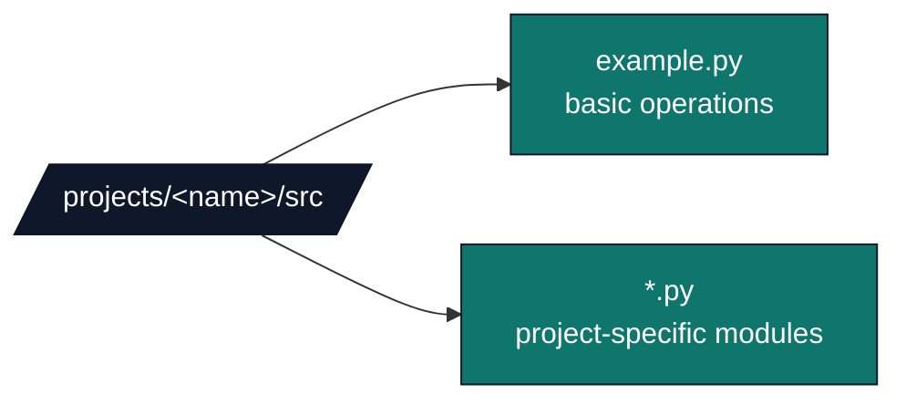
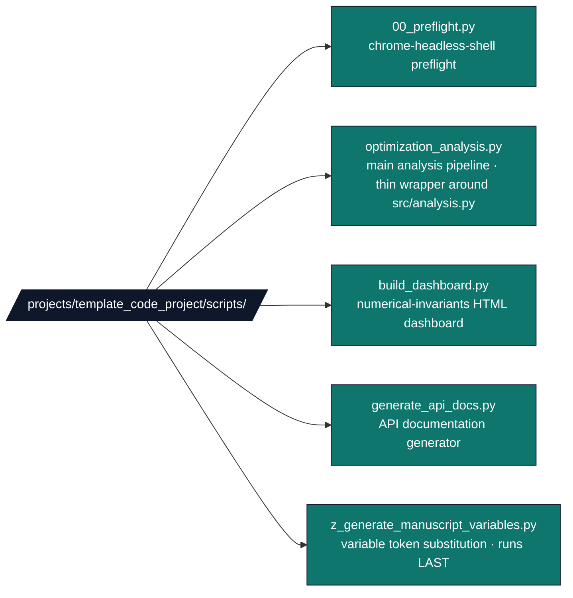
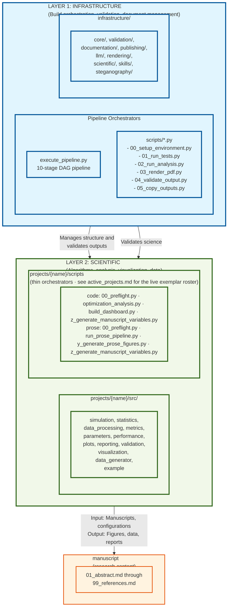
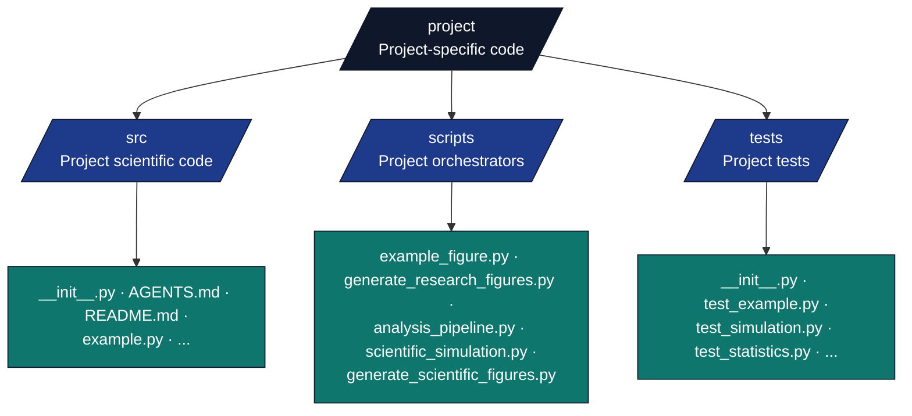
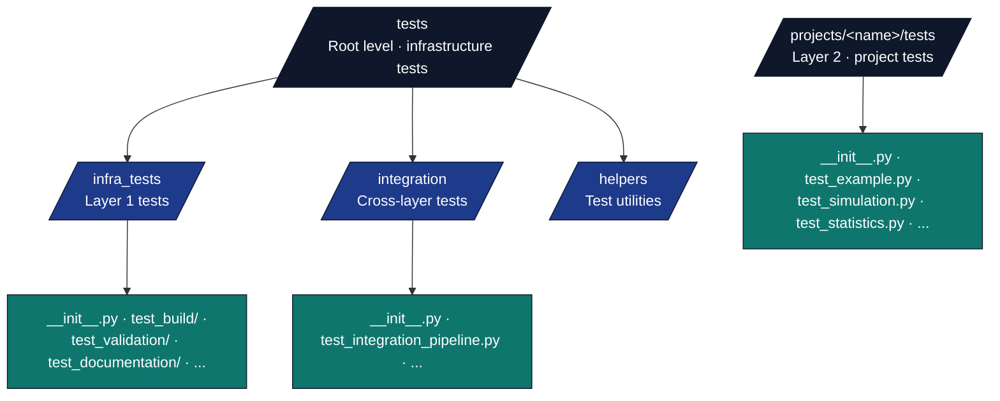
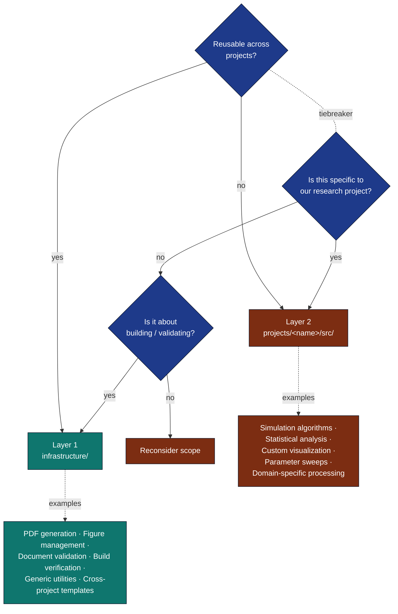

```mermaid
flowchart TB
    INFRA[/infrastructure/]
    INFRA --> CORE[/core<br/>exceptions · logging · config_loader/]
    INFRA --> VAL[/validation<br/>pdf · markdown · integrity/]
    INFRA --> DOC[/documentation<br/>figure · image · markdown integration · glossary/]
    INFRA --> PUB[/publishing<br/>academic publishing tools/]
    INFRA --> LLM[/llm<br/>LLM integration · literature workflows/]
    INFRA --> REND[/rendering<br/>multi-format · PDF · HTML · slides · DOCX · EPUB/]
    INFRA --> SCI[/scientific<br/>scientific dev tools/]
    INFRA --> SEARCH[/search<br/>multi-source literature search/]
    INFRA --> REF[/reference<br/>BibTeX I/O/]
    INFRA --> REP[/reporting<br/>pipeline reports/]
    INFRA --> STEG[/steganography<br/>secure PDF post-processing/]

    classDef root fill:#0f172a,stroke:#0f172a,color:#fff
    classDef pkg fill:#1e3a8a,stroke:#0f172a,color:#fff
    class INFRA root
    class CORE,VAL,DOC,PUB,LLM,REND,SCI,SEARCH,REF,REP,STEG pkg
```

# Two-Layer Architecture Guide

## Overview

This research template implements a clear two-layer architecture separating generic build infrastructure from project-specific scientific content. This document explains the architecture, design rationale, and how to work within this structure.

## Quick Reference: Layer 1 vs Layer 2

| Aspect | **Layer 1: Infrastructure** | **Layer 2: Project** |
|--------|------------------------------|----------------------|
| **Location** | `infrastructure/` (root level) | `projects/{name}/src/` (project-specific) |
| **Purpose** | Generic, reusable build tools | Domain-specific research code |
| **Scope** | Works with any project | Specific to this research |
| **Test Coverage** | 60% minimum for `infrastructure/` | 90% minimum for `projects/{name}/src/` |
| **Scripts** | `scripts/` (root, generic orchestrators) | `projects/{name}/scripts/` (project orchestrators) |
| **Tests** | `tests/infra_tests/` (root level) | `projects/{name}/tests/` (project-specific) |
| **Imports** | `from infrastructure.module import` | `from projects.{name}.src.module import` |
| **Dependencies** | No project dependencies | Can import from infrastructure |
| **Examples** | PDF generation, validation, figure management | Algorithms, simulations, analysis |

## Architecture Layers

### [LAYER 1: INFRASTRUCTURE] Generic Build & Validation Tools

**Location:** `infrastructure/` (root level)

**Purpose:** Reusable tools and utilities that apply to any research project using this template. These handle:

- Build orchestration and PDF generation
- Document validation and quality checking
- Build artifact verification
- Environment reproducibility tracking
- Academic publishing assistance
- Figure and image management
- Markdown integration

**Modules:**



**Key Characteristics:**

- Generic and reusable across projects
- Handles template infrastructure concerns
- 60% minimum test coverage for infrastructure (see [`docs/_generated/canonical_facts.md`](../_generated/canonical_facts.md) for measured status)
- No domain-specific logic
- Interfaces with project files (manuscript/, output/)

**Usage Pattern:**

```python
# Infrastructure usage from scripts
from infrastructure.documentation import FigureManager
from infrastructure.documentation import MarkdownIntegration

# These manage the document structure, not the science
fm = FigureManager()
fm.register_figure(
    filename="convergence_plot.png",
    caption="Algorithm convergence comparison",
    label="fig:convergence"
)
```

---

### [LAYER 2: PROJECT] Project-Specific Algorithms & Analysis

**Location:** `projects/{name}/src/` (project-specific code), `projects/{name}/scripts/` (project orchestrators)

**Purpose:** Domain-specific code implementing the research project's scientific algorithms, data processing, analysis, and visualization.

**Modules:**



**Scripts (thin orchestrators):**

> Each active exemplar has its own concrete `scripts/` layout — the names
> below are the **template_code_project** canonical roster as of May 2026
> (template_prose_project uses a parallel set: `run_prose_pipeline.py`,
> `y_generate_prose_figures.py`, `z_generate_manuscript_variables.py`,
> `00_preflight.py`).



The May 2026 hardening pass split `src/analysis.py` (was 1,718 lines)
into `src/analysis.py` (orchestration, ~960 lines) and `src/figures.py`
(the six `generate_*` plot functions + `apply_visualization_style` +
`VIZ_CONFIG`, ~870 lines). `analysis.py` re-exports every public name
from `figures.py` through a try/except shim so the existing
`scripts/optimization_analysis.py` and infrastructure-dependent test
classes keep working without changes.

**Key Characteristics:**

- Domain-specific and research-focused
- Implements algorithms and computations
- Calls infrastructure when needed
- 90% minimum test coverage for project `src/` (measure locally or see [`docs/_generated/canonical_facts.md`](../_generated/canonical_facts.md))
- Follows thin orchestrator pattern

**Usage Pattern:**

```python
# Project-specific usage from scripts
from projects.name.src.simulation import SimpleSimulation
from projects.name.src.statistics import calculate_descriptive_stats
from infrastructure.documentation import FigureManager

# Science: Run simulation and analysis
sim = SimpleSimulation()
results = sim.run()
stats = calculate_descriptive_stats(results)

# Infrastructure: Manage figures
fm = FigureManager()
fm.register_figure(
    filename="results.png",
    caption="Simulation results",
    label="fig:results"
)
```

---

## Layer Separation

### Architectural Boundaries



### Import Guidelines

**✅ Layer 1 → Layer 1:** Infrastructure modules can import from other infrastructure modules

```python
from infrastructure.documentation import FigureManager
from infrastructure.documentation import ImageManager
```

**✅ Layer 2 → Layer 1:** Project code can import infrastructure

```python
from projects.name.src.visualization import plot_results
from infrastructure.documentation import FigureManager

# Use infrastructure for figure management
fig = plot_results(data)
fig.savefig("output/figures/results.png")

fm = FigureManager()
fm.register_figure(
    filename="results.png",
    caption="Results visualization",
    label="fig:results"
)
```

**✅ Layer 2 → Layer 2:** Project modules can import from other project modules

```python
from projects.name.src.simulation import SimpleSimulation
from projects.name.src.statistics import calculate_descriptive_stats
```

**❌ Layer 1 → Layer 2:** Infrastructure should NOT import project code

```python
# BAD: Build tools shouldn't depend on project-specific code
from infrastructure.validation.integrity.checks import verify_output_integrity
from projects.name.src.simulation import SimpleSimulation  # ❌ WRONG

# This breaks the abstraction and makes infrastructure project-specific
```

---

## Code Organization

### [LAYER 1] Infrastructure Structure


File-level layout inside each package: see [`infrastructure/AGENTS.md`](../../infrastructure/AGENTS.md).

### [LAYER 2] Project Structure



### Test Structure



---

## Execution Flow

### Build Pipeline - Layer Transitions

```mermaid
flowchart TD
    START(["User runs:<br/>uv run python scripts/execute_pipeline.py --project {name} --core-only"]) --> CLEAN["STAGE 0: Clean Output Directories<br/>- Remove old outputs<br/>- Prepare fresh build"]
    CLEAN --> STAGE00["STAGE 00: LAYER 1<br/>Environment Setup<br/>- Validate Python, dependencies<br/>- Check build tools"]

    STAGE00 --> PHASE1["PHASE 1: LAYER 1<br/>Test Validation<br/>- Run tests/infra_tests<br/>- Run projects/{name}/tests<br/>- Run tests/integration<br/>- Validate coverage requirements<br/>Report: LAYER-1-INFRASTRUCTURE Running"]

    PHASE1 --> PHASE2["PHASE 2: LAYER 2<br/>Project Execution<br/>- Run projects/{name}/scripts/*.py<br/>- Generate figures<br/>- Process data<br/>- Create outputs<br/>Report: LAYER-2-PROJECT Running"]

    PHASE2 --> PHASE2_5["PHASE 2.5: LAYER 1<br/>Utilities<br/>- Generate API glossary<br/>- Validate markdown<br/>- Check cross-references<br/>Report: LAYER-1-INFRASTRUCTURE Running"]

    PHASE2_5 --> PHASE3_5["PHASE 3-5: LAYER 1<br/>Document Generation<br/>- Generate LaTeX preamble<br/>- Build individual PDFs<br/>- Build combined PDF<br/>- Create HTML version<br/>Report: LAYER-1-INFRASTRUCTURE Building"]

    PHASE3_5 --> PHASE6["PHASE 6: LAYER 1<br/>Validation<br/>- Validate PDF quality<br/>- Check for rendering issues<br/>Report: LAYER-1-INFRASTRUCTURE Done"]

    PHASE6 --> SUCCESS(["Success:<br/>All PDFs generated,<br/>all layers working"])

    classDef layer1 fill:#e1f5fe,stroke:#01579b,stroke-width:2px
    classDef layer2 fill:#f1f8e9,stroke:#33691e,stroke-width:2px
    classDef success fill:#e8f5e8,stroke:#2e7d32,stroke-width:3px
    classDef start fill:#fff3e0,stroke:#e65100,stroke-width:2px

    class STAGE00,PHASE1,PHASE2_5,PHASE3_5,PHASE6 layer1
    class PHASE2 layer2
    class SUCCESS success
    class START start
```



### Logging Output Example

```
━━━ LAYER 1: Infrastructure Validation ━━━
[YYYY-MM-DD HH:MM:SS] [INFO] Running tests (infrastructure + scientific)
...tests output...
[YYYY-MM-DD HH:MM:SS] [INFO] ✅ All tests passed with adequate coverage

━━━ LAYER 2: Project Computation ━━━
[YYYY-MM-DD HH:MM:SS] [INFO] Executing project scripts...
[YYYY-MM-DD HH:MM:SS] [INFO] [LAYER-2-PROJECT] Starting analysis pipeline...
...script output...
[YYYY-MM-DD HH:MM:SS] [INFO] ✅ ALL project scripts executed successfully

━━━ LAYER 1: Infrastructure Validation ━━━
[YYYY-MM-DD HH:MM:SS] [INFO] Running repository utilities (glossary + markdown validation)
...validation output...
[YYYY-MM-DD HH:MM:SS] [INFO] ✅ Repository utilities completed

━━━ LAYER 1: Document Generation ━━━
[YYYY-MM-DD HH:MM:SS] [INFO] Step 3: Generating LaTeX preamble from markdown...
[YYYY-MM-DD HH:MM:SS] [INFO] Step 4: Discovering and building ALL markdown modules...
...PDF generation output...
[YYYY-MM-DD HH:MM:SS] [INFO] ✅ Combined document built successfully
```

---

## Adding New Code

### Decision Tree: Where Should Code Go?



### Adding a New Project Module

1. **Create the module:**

   ```bash
   vim projects/{name}/src/new_algorithm.py
   ```

2. **Implement with type hints and docstrings:**

   ```python
   """New algorithm implementation."""
   from typing import List, Optional

   def analyze_data(data: List[float]) -> Optional[float]:
       """Analyze data.

       Args:
           data: Input data

       Returns:
           Analysis result
       """
       pass
   ```

3. **Write tests:**

   ```bash
   vim projects/{name}/tests/test_new_algorithm.py
   ```

4. **Add to projects/{name}/src/**init**.py:**

   ```python
   from .new_algorithm import analyze_data
   ```

5. **Use in scripts:**

   ```python
   from projects.name.src.new_algorithm import analyze_data
   ```

6. **Update documentation:**
   - Add to projects/{name}/src/AGENTS.md
   - Add to projects/{name}/src/README.md

### Adding a New Infrastructure Module

1. **Create the module:**

   ```bash
   vim infrastructure/validation/new_validator.py
   ```

2. **Implement generic, project-independent logic:**

   ```python
   """New validation tool."""

   def validate_output_structure(output_dir: str) -> bool:
       """Validate output directory structure."""
       pass
   ```

3. **Write tests:**

   ```bash
   vim tests/infra_tests/validation/test_pdf_validator.py
   ```

4. **Document usage:**
   - Add to infrastructure/validation/AGENTS.md
   - Include usage examples

5. **Integrate with build pipeline:**
   - Update scripts/execute_pipeline.py if needed
   - Update infrastructure modules if applicable

---

## Testing Strategy

### Infrastructure Tests (`tests/infra_tests/`)

- Verify build orchestration works
- Test validation logic
- Check file integrity checking
- Validate PDF generation
- No dependency on scientific code

**Command:**

```bash
uv run pytest tests/infra_tests/ --cov=infrastructure
```

### [LAYER 2] Project Tests (projects/{name}/tests/)

- Test algorithms correctness
- Verify statistical computations
- Check data processing
- Validate visualization output
- No dependency on build infrastructure

**Command:**

```bash
uv run pytest projects/{name}/tests/ --cov=projects/{name}/src
```

### Integration Tests (tests/integration/)

- End-to-end pipeline validation
- Script execution testing
- Layer interaction verification
- Output completeness checking

**Command:**

```bash
uv run pytest tests/integration/ --cov=projects/{name}/src --cov=infrastructure
```

### Full Test Suite

```bash
# All tests with coverage (75% combined-union all-projects gate (DEFAULT_FAIL_UNDER); per-suite gates are 60% infra / 90% project)
uv run pytest tests/ projects/{name}/tests/ --cov=infrastructure --cov=projects/{name}/src --cov-fail-under=75

# Generate coverage report
uv run pytest tests/ projects/{name}/tests/ --cov=infrastructure --cov=projects/{name}/src --cov-report=html
open htmlcov/index.html
```

---

## Best Practices

### For Infrastructure Development

✅ **Do:**

- Write generic, reusable code
- Document with project-independent examples
- Test extensively with real scenarios
- Handle errors gracefully
- Provide clear logging

❌ **Don't:**

- Import scientific modules
- Assume specific research domain
- Skip tests to ship features
- Hardcode project-specific values
- Mix concerns (building vs. computation)

### For Scientific Development

✅ **Do:**

- Use infrastructure tools for document management
- Follow thin orchestrator pattern in projects/{name}/scripts/
- Implement algorithms in projects/{name}/src/ modules
- Test with data
- Document domain-specific concepts

❌ **Don't:**

- Duplicate build/validation logic
- Implement document generation in scripts
- Skip layer abstraction
- Mix orchestration with computation
- Depend on infrastructure internals

### Logging Best Practices

```python
# In project scripts - mark layer transitions
import logging
logger = logging.getLogger(__name__)

logger.info("[LAYER-2-PROJECT] Starting simulation...")
logger.info("[LAYER-1-INFRASTRUCTURE] Using FigureManager for output...")
```

```bash
# In build scripts - mark phase transitions
log_info "━━━ LAYER 1: Infrastructure Validation ━━━"
log_info "━━━ LAYER 2: Scientific Computation ━━━"
```

---

## Migration from Flat Structure

If you have an old project with flat src/, migrating to the two-layer structure:

1. **Create packages:**

   ```bash
   mkdir -p infrastructure projects/{name}/src
   ```

2. **Move modules:**
   - Infrastructure modules → infrastructure/
   - Project modules → projects/{name}/src/

3. **Update imports:**
   - `from example import` → `from projects.{name}.src.example import`
   - Build verification is handled by the validation module

4. **Update tests:**
   - Infrastructure tests → tests/infra_tests/
   - Project tests → projects/{name}/tests/
   - Update conftest.py if needed

5. **Validate:**

   ```bash
   uv run pytest tests/ projects/{name}/tests/ --cov=infrastructure --cov=projects/{name}/src
   uv run python scripts/execute_pipeline.py --project {name} --core-only
   ```

---

## Troubleshooting

### Import Errors

**Error:** `ModuleNotFoundError: No module named 'project.src'`

**Solution:** Ensure tests/conftest.py includes projects/{name}/ on path:

```python
import sys
sys.path.insert(0, os.path.join(repo_root, "projects", project_name))
```

### Layer Violations

**Error:** Infrastructure module imports from project

**Solution:** Refactor to remove dependency or move code to appropriate layer

**Check:**

```bash
# Find infrastructure imports of project code
grep -r "from projects\." infrastructure/
grep -r "import projects\." infrastructure/
```

### Mixed Concerns

**Error:** Build logic in project module

**Solution:** Move to infrastructure layer or extract into separate module

---

## References

### Architecture Documentation

- [../core/architecture.md](../core/architecture.md) - system architecture overview
- [decision-tree.md](../architecture/decision-tree.md) - Code placement flowchart
- [thin-orchestrator-summary.md](../architecture/thin-orchestrator-summary.md) - Thin orchestrator pattern details

### Layer-Specific Documentation

- [infrastructure/AGENTS.md](../../infrastructure/AGENTS.md) - Infrastructure layer documentation
- [infrastructure/README.md](../../infrastructure/README.md) - Infrastructure quick reference
- [template_code_project/src/AGENTS.md](../../projects/template_code_project/src/AGENTS.md) - Project layer documentation
- [template_code_project/src/README.md](../../projects/template_code_project/src/README.md) - Project quick reference

### System Documentation

- [../AGENTS.md](../AGENTS.md) - system documentation
- [../README.md](../README.md) - Project overview
- [../core/how-to-use.md](../core/how-to-use.md) - usage guide

---

## Key Takeaway

**Layers separate concerns:**

- **[LAYER 1: INFRASTRUCTURE]** handles *how* research is documented and built
- **[LAYER 2: PROJECT]** focuses on *what* research is conducted

This separation makes code more modular, reusable, and maintainable.

## Quick Navigation

- **Understanding the architecture**: Start with the [Quick Reference](#quick-reference-layer-1-vs-layer-2) table above
- **Adding code**: See [Decision Tree](#decision-tree-where-should-code-go) section
- **Import patterns**: See [Import Guidelines](#import-guidelines) section
- **Testing**: See [Testing Strategy](#testing-strategy) section
