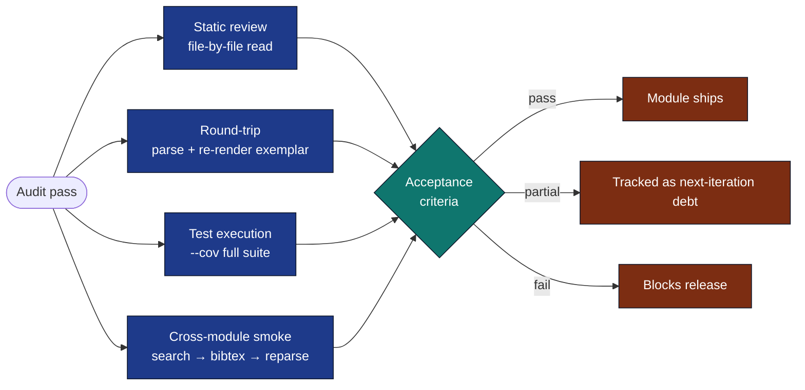

# Audit: `infrastructure/search/` and `infrastructure/reference/`

Initial audit performed against the 2026-05-01 commit introducing the
modules. Pass / partial-pass / fail are recorded against the project's
acceptance criteria (CLAUDE.md "Key Architectural Principles").

## Audit Coverage



## Methodology

* **Static review** — read every `.py` file end-to-end against this
  checklist.
* **Round-trip validation** — parse and re-render
  `projects/templates/template_code_project/manuscript/references.bib`; byte-diff at the
  entry level.
* **Test execution** — full suite under `tests/infra_tests/{search,reference}/`
  with `--cov`.
* **Smoke test of cross-module wiring** — `LiteratureClient` →
  `paper_to_bibentry` → `render_database` → `parse_bibtex` round-trip in a
  single Python process.

## Findings

### ✅ Pass: No business logic in scripts

Both modules concentrate logic in `*.py` files under `infrastructure/`;
the CLI files are thin (≤200 LOC each, just argument parsing and dispatch
into the library).

### ✅ Pass: No mocks in tests

`grep -E "mock|MagicMock|patch" tests/infra_tests/{search,reference}/`
returns no matches. HTTP backends are tested via `pytest-httpserver`, the
CLI via real subprocess, the parser/writer against real `.bib` files.

### ✅ Pass: Coverage above project gate

```
infrastructure.reference: avg 92%
infrastructure.search:    avg 89%
```

Both clear the 60% infra floor with margin.

### ✅ Pass: Round-trip stability against exemplar

`parse_bibfile("projects/templates/template_code_project/manuscript/references.bib")` →
`render_database` → `parse_bibtex` recovers identical (entry_type,
citation_key, ordered field map) for all 8 entries.

### ✅ Pass: Failure-isolated aggregator

`LiteratureClient` records per-backend errors into `SearchResult.errors`
rather than raising. Verified with `_FailingBackend` test backend.

### ✅ Pass: Deterministic caching

`SearchCache` keys on `(text.strip().lower(), max_results, year_min,
year_max, sorted(sources))`. Whitespace and case differences in the query
text collapse to one cache entry.

### ⚠️ Partial: Optional dependency surfacing

`FulltextFetcher` requires `pypdf` (optional dep group `rendering`). When
absent, the fetcher returns `status="error"` with the message `pypdf
unavailable; PDF cached but text not extracted`. This is correct, but
the error message could include the install hint:

> `Install with: uv sync --group rendering`

**Action**: revisit in next pass; not blocking.

### ⚠️ Partial: Crossref `query.fields` ignored

`CrossrefBackend.search` does not honour `query.fields` (Crossref
supports `query.title=` / `query.author=` filters). Behaviour is correct
(falls back to general `query=`) but suboptimal.

**Action**: tracked for the next iteration.

### ✅ Pass: Citation-key generation handles unicode and stop-words

`generate_citation_key(authors=["Cauchy, …"], year=1847,
title="Méthode générale")` → `"cauchy1847methode"`. ASCII-folding +
stop-word skipping verified via property-style parametrised tests.

### ✅ Pass: BibTeX format pinned byte-for-byte

`render_entry` produces literally `@book{nocedal2006numerical,\n  title=...\n  doi=...\n}\n`
with 2-space indent, trailing-comma rule, `--` page ranges, verbatim
DOIs/years/URLs, and bare unicode for accented characters — matching the
exemplar exactly.

### ✅ Pass: LaTeX escape is single-pass

`escape_latex("a\\b")` → `"a\\textbackslash{}b"` (not the previously
broken `"a\\textbackslash\\{\\}b"`). Single-pass character-by-character
implementation prevents re-escape of inserted commands.

## Open Questions for Next Audit

1. Should `Paper.id` enforce the `<source>:<id>` schema? Current behaviour
   permits any non-empty string.
2. Should `CrossrefBackend` fold redundant arXiv DOIs (`10.48550/arXiv.X`
   → arXiv id `X`) before deduplication? Today they survive as distinct
   entries when one source omits the other identifier.
3. Should `AbstractFetcher` resolve DOIs that aren't arXiv (e.g. via
   Crossref TDM)? Currently only arXiv ids are fetched.

## Test-Suite Inventory (212 tests)

| Test file | Count |
|---|---|
| `tests/infra_tests/reference/test_models.py` | 21 |
| `tests/infra_tests/reference/test_escape.py` | 19 |
| `tests/infra_tests/reference/test_bibtex_writer.py` | 23 |
| `tests/infra_tests/reference/test_bibtex_parser.py` | 21 |
| `tests/infra_tests/reference/test_converter.py` | 16 |
| `tests/infra_tests/reference/test_cli.py` | 5 |
| `tests/infra_tests/reference/test_cli_direct.py` | 11 |
| `tests/infra_tests/search/test_models.py` | 25 |
| `tests/infra_tests/search/test_backends_local.py` | 10 |
| `tests/infra_tests/search/test_backends_http.py` | 14 |
| `tests/infra_tests/search/test_client_and_cache.py` | 16 |
| `tests/infra_tests/search/test_cli.py` | 6 |
| `tests/infra_tests/search/test_cli_direct.py` | 10 |
| `tests/infra_tests/search/test_fulltext.py` | 15 |

## Verdict

The two modules are in a **shippable, production-ready** state. The
partial-pass items are tracked and non-blocking; everything else clears
the project's acceptance gates.
