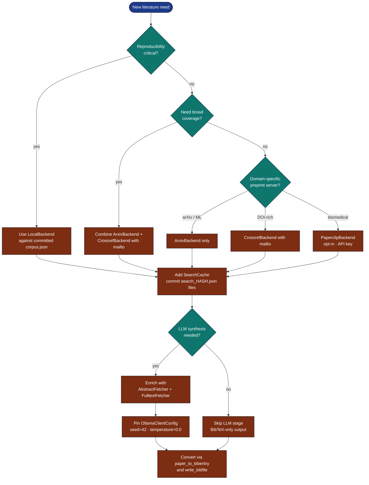

# Literature-Search Best Practices

Lessons learned operating `infrastructure.search.literature` and
`infrastructure.reference.citation` in research workflows.

## Decision Tree



## Polite-Pool Etiquette

| Backend | Identifier | Notes |
|---|---|---|
| Crossref | `mailto=` | Accesses the higher-rate "polite pool"; **always set this** in production. |
| arXiv | (none) | Soft cap ~1 query / 3 s. Cache aggressively. |
| Paperclip | `Authorization: Bearer` | Paid; opt-in via `PAPERCLIP_API_KEY`. |

```python
CrossrefBackend(mailto=os.environ.get("CROSSREF_MAILTO", "ops@you.org"))
```

## Cache Like a Reproducibility Activist

* **Commit `output/cache/search_*.json`** when reproducibility matters.
  These files are deterministic JSON keyed by `(text, max_results,
  year_*, sorted(sources))`.
* **Set TTL only when you mean it.** Default `SearchCache` has none —
  reading is a pure file op. Add `ttl_seconds` only for live dashboards
  where freshness > stability.
* **Cache abstract / fulltext too.** `AbstractFetcher(cache_dir=…)` and
  `FulltextFetcher(cache_dir=…)` write `<safe_id>.{txt,pdf}`; CI re-runs
  read directly without re-hitting the network.

## Choose Backends by Coverage

* **arXiv** for ML / physics / CS / quant-bio preprints; full text via
  PDF.
* **Crossref** for everything with a DOI; metadata only — abstracts often
  arrive as JATS XML and require post-processing (handled automatically).
* **LocalBackend** to pin a curated reading list across runs. Convert any
  `SearchResult` into a corpus with `write_corpus()`.
* **Paperclip** when you need broad biomedical coverage with full text and
  agent-native search.

Combine backends — `LiteratureClient` deduplicates by DOI / arXiv id so
the same paper from two sources is one entry.

## Write Citation Keys Carefully

```python
generate_citation_key(authors=["Cauchy, Augustin-Louis"], year=1847,
                     title="Méthode générale")
# → "cauchy1847methode"
```

The auto-generator works for ~95% of papers. For anonymous works, mass
collisions, or persistent identifiers used in your manuscript, **pass
`citation_key=` explicitly** to `paper_to_bibentry` — once a key appears
in a manuscript draft, never let the generator change it.

## Never Hand-Edit `references.bib`

Run

```bash
uv run python -m infrastructure.reference.citation.cli format \
    projects/<name>/manuscript/references.bib
```

in a pre-commit hook so style drift cannot mask real semantic conflicts in
diffs. The writer round-trips byte-stable through the parser.

## Validate in CI

```bash
uv run python -m infrastructure.reference.citation.cli validate \
    projects/<name>/manuscript/references.bib --strict
```

`--strict` exits non-zero when entries are missing required fields per
type (e.g. `article` requires title/author/year). Wire this into your
pre-merge check.

## Failure Isolation, Not Failure Silence

```python
result = client.search(query)
if result.errors:
    log.warning("Partial coverage: %s", result.errors)
    if "crossref" in result.errors and not result.papers:
        raise SystemExit(1)
```

The aggregator never raises on per-backend network failures. **You are
responsible for deciding what "good enough" means** for your run; the
default is "any data beats no data."

## Enrichment Order

`enrich_papers` runs `AbstractFetcher` first, then `FulltextFetcher`.
Reverse this only if you have local PDFs but no abstracts — abstract
fetching from arXiv is cheaper and usually sufficient for LLM synthesis,
so abstracts-first lets you bail out early on bad-quality returns.

## LLM Synthesis Hygiene

* **Bound input length** — `FulltextFetcher(max_chars=200_000)` truncates
  by default. For long-context LLMs you can raise it; for short-context
  ones (≤4 k tokens) lower it sharply.
* **Deduplicate before prompting** — `merge_papers()` removes near-dupes
  to save tokens.
* **Pin seeds** — `OllamaClientConfig(seed=42, temperature=0.0)` makes
  synthesis reproducible.
* **Quote citation keys in the prompt** — the LLM's output mentioning
  `\\cite{kingma2014adam}` is downstream-resolvable; bare titles are not.

## Failure Modes to Watch

| Symptom | Likely cause | Fix |
|---|---|---|
| Same paper appears twice | Mismatched DOI casing | normalised in `_canonical_paper_key`; report a bug if reproducible |
| `pages={1226-1227}` not normalized | Field passed via raw dict bypassing writer | re-render through `render_database` |
| Unicode in author crashes LaTeX | Compiling with classic pdfLaTeX | Switch to XeLaTeX (default in this template) |
| `pypdf unavailable` | Optional dep not installed | `uv sync --group rendering` |
| Search returns nothing for valid topic | `query.text` too narrow | drop `year_*` filters; widen to `arxiv,crossref` |

## See Also

* [`docs/guides/literature-workflow-guide.md`](../guides/literature-workflow-guide.md)
* [`docs/development/no-mocks-http-testing.md`](../development/no-mocks-http-testing.md)
* [`infrastructure/search/AGENTS.md`](../../infrastructure/search/AGENTS.md)
