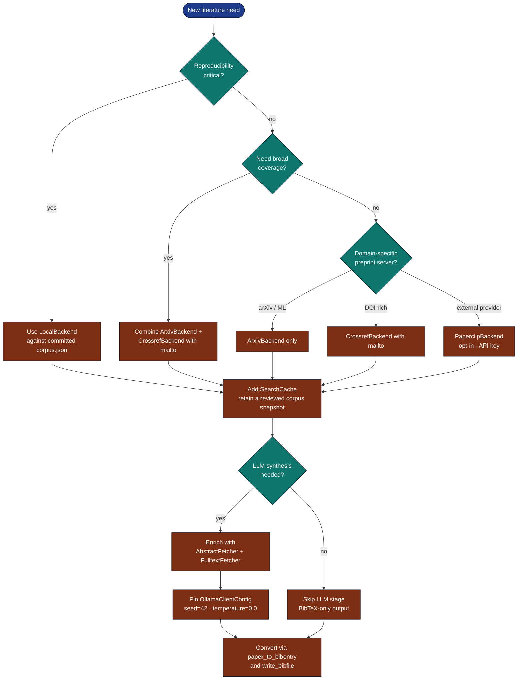

# Literature-Search Best Practices

Lessons learned operating `infrastructure.search.literature` and
`infrastructure.reference.citation` in research workflows.

## Decision Tree


```mermaid
flowchart TB
    START([New literature need]) --> Q1{Reproducibility<br/>critical?}
    Q1 -- yes --> LOCAL[Use LocalBackend<br/>against committed corpus.json]
    Q1 -- no --> Q2{Need broad<br/>coverage?}
    Q2 -- yes --> COMBO[Combine ArxivBackend +<br/>CrossrefBackend with mailto]
    Q2 -- no --> Q3{Domain-specific<br/>preprint server?}
    Q3 -- "arXiv / ML" --> AX[ArxivBackend only]
    Q3 -- "DOI-rich" --> CR[CrossrefBackend with mailto]
    Q3 -- external provider --> PC[PaperclipBackend<br/>opt-in · API key]

    LOCAL --> CACHE[Add SearchCache<br/>retain a reviewed corpus snapshot]
    COMBO --> CACHE
    AX --> CACHE
    CR --> CACHE
    PC --> CACHE

    CACHE --> Q4{LLM synthesis<br/>needed?}
    Q4 -- yes --> ENRICH[Enrich with<br/>AbstractFetcher + FulltextFetcher]
    Q4 -- no --> NOLLM[Skip LLM stage<br/>BibTeX-only output]

    ENRICH --> SEED[Pin OllamaClientConfig<br/>seed=42 · temperature=0.0]
    SEED --> EXPORT[Convert via paper_to_bibentry<br/>and write_bibfile]
    NOLLM --> EXPORT

    classDef start fill:#1e3a8a,stroke:#0f172a,color:#fff
    classDef path fill:#0f766e,stroke:#0f172a,color:#fff
    classDef terminal fill:#7c2d12,stroke:#0f172a,color:#fff
    class START start
    class Q1,Q2,Q3,Q4 path
    class LOCAL,COMBO,AX,CR,PC,CACHE,ENRICH,NOLLM,SEED,EXPORT terminal
```

## Polite-Pool Etiquette

| Backend | Identifier | Notes |
|---|---|---|
| Crossref | `mailto=` | Identifies the client for polite API use; set a monitored contact address in production. |
| arXiv | (none) | Respect the service's current API guidance and back off on throttling; cache repeated queries. |
| Paperclip | `X-API-Key` | Paid; opt-in via `PAPERCLIP_API_KEY`; the adapter posts MCP-style JSON-RPC to `/mcp`. |

```python
CrossrefBackend(mailto=os.environ.get("CROSSREF_MAILTO", "ops@you.org"))
```

## Cache Like a Reproducibility Activist

* **Treat `output/**/cache/` as runtime state.** The public template ignores
  search caches, and cache entries include retrieval-time metadata. Do not
  force-add them as publication evidence.
* **Promote a reviewed snapshot explicitly.** When exact replay matters,
  export the selected records to a project-owned corpus under a tracked,
  allowlisted source/evidence path (for example `data/curated_corpus.json`),
  record the query, sources, retrieval date, filters, deduplication and
  inclusion decisions, and replay it with `LocalBackend`.
* **Set TTL only when you mean it.** Default `SearchCache` has none —
  reading is a pure file op. Add `ttl_seconds` only for live dashboards
  where freshness > stability.
* **Cache abstract / fulltext too.** `AbstractFetcher(cache_dir=…)` and
  `FulltextFetcher(cache_dir=…)` write `<safe_id>.{txt,pdf}`; CI re-runs
  read directly without re-hitting the network.

## Choose Backends by Coverage

* **arXiv** for ML / physics / CS / quant-bio preprints; full text via
  PDF.
* **Crossref** for everything with a DOI; metadata only — abstracts often
  arrive as JATS XML and require post-processing (handled automatically).
* **LocalBackend** to pin a curated reading list across runs. Convert any
  `SearchResult` into a corpus with `write_corpus()`.
* **Paperclip** only when its configured external service and returned coverage
  match the review protocol. It is opt-in and does not, by itself, establish
  biomedical or full-text completeness.

Combine backends — `LiteratureClient` deduplicates by DOI / arXiv id so
the same paper from two sources is one entry.

## Write Citation Keys Carefully

```python
generate_citation_key(authors=["Cauchy, Augustin-Louis"], year=1847,
                     title="Méthode générale")
# → "cauchy1847methode"
```

The auto-generator is a convenience, not an accuracy estimate. Inspect
anonymous/corporate authors, transliteration, same-author/same-year collisions,
and missing dates. Pass `citation_key=` explicitly to `paper_to_bibentry` when
needed. Prefer stable keys after drafting starts, but correct a wrong key and
update every consumer rather than preserving an error.

## Curate the Canonical Bibliography

Do not patch a generated `references.bib` silently if the next generator run
will overwrite it. Put corrections in the curated input/override producer, or
record a deliberate manual correction and then normalize the canonical file.
Run:

```bash
uv run python -m infrastructure.reference.citation.cli format \
    projects/<name>/manuscript/references.bib
```

in a pre-commit hook so style drift cannot mask real semantic conflicts in
diffs. The writer round-trips byte-stable through the parser.

## Validate in CI

```bash
uv run python -m infrastructure.reference.citation.cli validate \
    projects/<name>/manuscript/references.bib --strict
```

`--strict` exits non-zero when entries are missing required fields per
type (e.g. `article` requires title/author/year). Wire this into your
pre-merge check.

Formatting and required-field checks do not establish existence or claim
support. Before submission, run the reference resolver with live access:

```bash
uv run python -m infrastructure.reference.verification verify \
    projects/<qualified-name>/manuscript/references.bib \
    --live --as-of-year <manuscript-year>
```

Treat `unchecked` and `unverifiable` as unfinished review. The resolver checks
indexed existence and metadata; a reviewer must still read the primary source,
confirm the adjacent proposition, assess evidence quality and applicability,
and check correction, expression-of-concern, and retraction status.

## Failure Isolation, Not Failure Silence

```python
result = client.search(query)
if result.errors:
    log.warning("Partial coverage: %s", result.errors)
    if "crossref" in result.errors and not result.papers:
        raise SystemExit(1)
```

The aggregator records per-backend failures instead of raising them. **You are
responsible for defining the minimum source coverage before retrieval.** A
partial result is not evidence that the search was complete. The CLI exits
non-zero on backend errors unless `--tolerate-errors` is explicitly supplied;
do not use that flag in a completeness gate without a documented exception.

## Enrichment Order

`enrich_papers` runs `AbstractFetcher` first, then `FulltextFetcher`.
Reverse this only if you have local PDFs but no abstracts — abstract
fetching from arXiv is cheaper and usually sufficient for LLM synthesis,
so abstracts-first lets you bail out early on bad-quality returns.

## LLM Synthesis Hygiene

* **Bound input length** — `FulltextFetcher(max_chars=200_000)` truncates
  by default. For long-context LLMs you can raise it; for short-context
  ones (≤4 k tokens) lower it sharply.
* **Deduplicate before prompting** — `merge_papers()` removes near-dupes
  to save tokens.
* **Record, do not overclaim, repeatability** —
  `OllamaClientConfig(seed=42, temperature=0.0)` reduces one source of
  variation, but model/runtime versions and hardware can still change output.
  Record model identity, prompt, parameters, input hashes, and output; do not
  call the synthesis byte-reproducible without a two-run comparison.
* **Quote citation keys in the prompt** — the LLM's output mentioning
  `[@kingma2014adam]` (Pandoc bracket-cite syntax, the manuscript convention —
  see [Manuscript Semantics](../guides/manuscript-semantics.md)) is
  downstream-resolvable; bare titles are not.
* **Treat synthesis as annotation, not evidence** — require every factual or
  comparative statement to resolve to inspected source text. Never cite an LLM
  synthesis in place of the underlying paper, and preserve disagreements,
  nulls, exclusions, and uncertainty instead of optimizing for a smooth
  narrative.

## Failure Modes to Watch

| Symptom | Likely cause | Fix |
|---|---|---|
| Same paper appears twice | Mismatched DOI casing | normalised in `_canonical_paper_key`; report a bug if reproducible |
| `pages={1226-1227}` not normalized | Field passed via raw dict bypassing writer | re-render through `render_database` |
| Unicode in author crashes LaTeX | Compiling with classic pdfLaTeX | Switch to XeLaTeX (default in this template) |
| `pypdf unavailable` | Optional dep not installed | `uv sync --group rendering` |
| Search returns nothing for valid topic | `query.text` too narrow | drop `year_*` filters; widen to `arxiv,crossref` |

## See Also

* [`docs/guides/literature-workflow-guide.md`](../guides/literature-workflow-guide.md)
* [`docs/development/no-mocks-http-testing.md`](../development/no-mocks-http-testing.md)
* [`infrastructure/search/AGENTS.md`](../../infrastructure/search/AGENTS.md)
