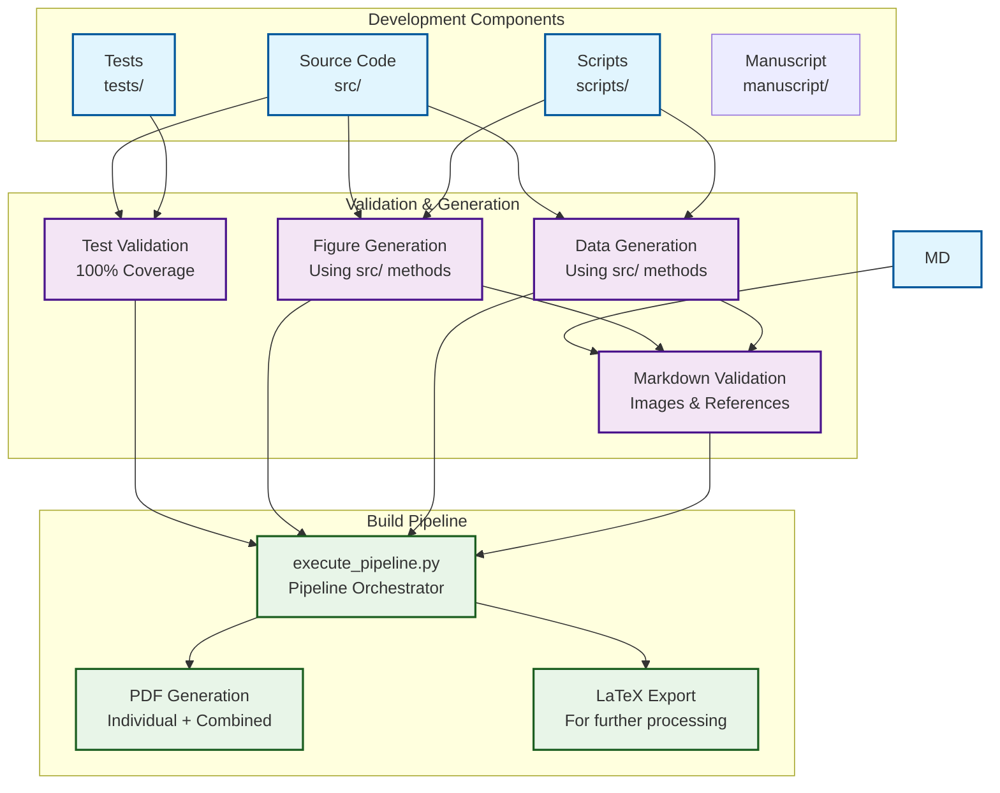
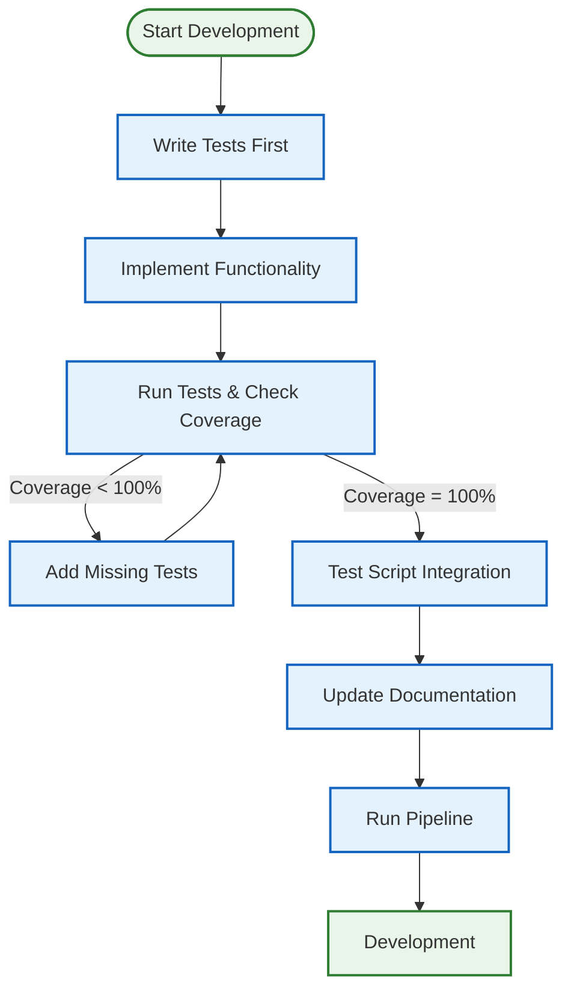
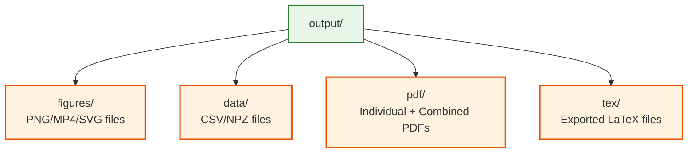

# Generic Project Development Workflow: The Pipeline Orchestrator Paradigm

> **development workflow** ensuring source code, tests, and documentation coherence

**Quick Reference:** [How To Use](../core/HOW_TO_USE.md) | [Architecture](../core/ARCHITECTURE.md) | [Common Workflows](../reference/COMMON_WORKFLOWS.md)

This document explains the development workflow that ensures source code, tests, and documentation remain in coherence.

**For related information:**
- **[How To Use](../core/HOW_TO_USE.md)** - usage guide from basic to advanced
- **[Architecture](../core/ARCHITECTURE.md)** - System design overview
- **[Thin Orchestrator Summary](../architecture/THIN_ORCHESTRATOR_SUMMARY.md)** - Pattern implementation details
- **[Common Workflows](../reference/COMMON_WORKFLOWS.md)** - Step-by-step recipes for common tasks

## Overview

The generic project template implements a **unified test-driven development paradigm** where:

- **Source code** implements mathematical functionality
- **Tests** validate all functionality with coverage (60% infra, 90% project minimum)
- **Scripts** are **thin orchestrators** that import and use `src/` methods
- **Documentation** references code and displays generated outputs
- **`scripts/execute_pipeline.py`** orchestrates the entire 6-stage pipeline

## Workflow Diagram



## How the Pipeline Orchestrator Works with Markdown and Code

The `scripts/execute_pipeline.py` orchestrator (or `./run.sh --pipeline`) executes 6 stages sequentially, ensuring coherence between all components:

### 1. Code Validation Phase
- **Runs all generation scripts** - This validates that `src/` code works correctly
- **Scripts import from src/** - Ensures no code duplication and validates imports
- **Generates figures and data** - Creates outputs that markdown will reference

### 2. Markdown Validation Phase
- **Validates all image references** - Ensures figures referenced in markdown exist
- **Checks internal links** - Validates equation labels and section anchors
- **Validates equation formatting** - Ensures proper LaTeX equation environments

### 3. Documentation Generation Phase
- **Auto-generates glossary** - Creates API table from current `src/` code
- **Updates documentation** - Keeps code-doc sync automatically

### 4. Output Generation Phase
- **Builds individual PDFs** - Creates per-section PDFs from validated markdown
- **Builds combined PDF** - Creates unified document from all sections
- **Exports LaTeX** - Provides LaTeX source for further processing

## Test Suite and Code Connections

The test suite ensures coverage of all modules and validates the entire pipeline:

### What Tests Validate
- **Mathematical correctness** - All functions produce expected results
- **Import compatibility** - Scripts can successfully import from `src/` modules
- **Output generation** - Figure and data generation works correctly
- **Deterministic execution** - All outputs are reproducible with fixed seeds
- **Path management** - Outputs go to correct directories

### Test-Driven Development Flow


1. **Write tests first** - Define expected behavior before implementation
2. **Implement functionality** - Write code to pass tests
3. **Validate integration** - Ensure scripts can use the code
4. **Update documentation** - Reflect changes in markdown
5. **Run pipeline** - Use `python3 scripts/execute_pipeline.py --core-only` to validate coherence

## Step-by-Step Workflow

### 1. Development Phase

```bash
# Always start with tests
uv run pytest tests/ --cov=src --cov-report=term-missing

# Check coverage (must be 100%)
coverage report

# Make code changes in src/
# Update corresponding tests
# Update documentation if needed
```

### 2. Validation Phase

```bash
# Run tests again to ensure changes work
uv run pytest

# Generate figures and data
uv run python project/scripts/example_figure.py
uv run python scripts/generate_research_figures.py

# Validate markdown integrity
python3 -m infrastructure.validation.cli markdown project/manuscript/
```

### 3. Integration Phase

```bash
# Run the pipeline (all 6 stages)
python3 scripts/execute_pipeline.py --core-only

# Or use unified interactive menu
./run.sh
```

The pipeline orchestrator executes 6 stages:
- **Stage 00**: Environment setup & validation
- **Stage 01**: Run tests with coverage (validates src/ code works)
- **Stage 02**: Execute analysis scripts (generates figures and data)
- **Stage 03**: Render PDFs from markdown (validates references, builds PDFs)
- **Stage 04**: Validate outputs (checks PDF quality and integrity)
- **Stage 05**: Copy final deliverables (copies to top-level output/)

## Key Components

### Source Code (`src/`)
- **`example.py`**: Basic mathematical functions (add, multiply, average, etc.)
- **`glossary_gen.py`**: API documentation generation utilities
- Additional modules can be added for specific project needs

**Critical Principle**: ALL business logic and algorithms must live in `src/` modules.

### Tests (`tests/`)
- **90% minimum coverage** for project/src/ (currently achieving 100% - coverage!)
- **60% minimum coverage** for infrastructure/ (currently achieving 83.33% - exceeds stretch goal!)
- **Real numerical examples** (no mocks)
- **Deterministic RNG seeds** for reproducibility
- **Fast and hermetic** execution

### Generation Scripts (`scripts/`)
- **Import from src/** modules (no code duplication)
- **Use src/ methods for all computation** (never implement algorithms)
- **Generate figures and data** deterministically
- **Print output paths** to stdout for manifest collection
- **Use headless plotting** (MPLBACKEND=Agg)

### Documentation (`manuscript/`)
- **References source code** using inline code formatting
- **Displays generated figures** from `output/figures/`
- **Passes validation** for images, references, and equations
- **Auto-updated glossary** from source API

### Output Structure (`output/`)
```
output/
├── figures/          # PNG/MP4/SVG files
├── data/             # CSV/NPZ files and manifests
├── pdf/              # Individual and combined PDFs
└── tex/              # Exported LaTeX files
```

## Validation Rules

### Markdown Validation
- All images must exist and be properly referenced
- Internal links must have valid anchors
- Equations must have unique labels
- No bare URLs (use informative link text)

### Code Validation
- All public APIs must have type hints
- No circular imports
- Consistent formatting and naming
- Error handling for edge cases

### Test Validation
- statement and branch coverage (90% project, 60% infra minimum)
- All tests must pass
- No network or file-system writes outside output/
- Deterministic execution

## Development Commands

```bash
# Install dependencies
uv sync

# Run tests with coverage
uv run pytest tests/ --cov=src --cov-report=term-missing

# Generate figures
uv run python project/scripts/example_figure.py
uv run python scripts/generate_research_figures.py

# Validate markdown
python3 -m infrastructure.validation.cli markdown project/manuscript/

# Build PDF pipeline
python3 scripts/execute_pipeline.py --core-only

# Clean all generated outputs (regeneratable)
# Pipeline automatically handles cleanup

# Check specific coverage
coverage report -m
```

## Output Management

### Output Management

The pipeline automatically manages outputs. All outputs are regenerated from markdown sources during the build process, ensuring consistency.

This script:
- Removes `output/` directory (all disposable)
- Preserves source code, tests, markdown, and scripts
- Provides clear instructions for regeneration

**Note**: All outputs are regeneratable from source, so cleaning is safe and often useful for troubleshooting or ensuring fresh builds.

### Output Directory Structure



All directories under `output/` are disposable and can be safely cleaned.

## Benefits of This Paradigm

1. **Coherence**: Source code, tests, and documentation stay synchronized
2. **Validation**: Automatic checking of all references and outputs
3. **Reproducibility**: Deterministic generation of all artifacts
4. **Maintainability**: Clear separation of concerns with unified workflow
5. **Quality**: test coverage enforced automatically
6. **Documentation**: Auto-generated API references and validation
7. **Thin Orchestrator Pattern**: Scripts use tested src/ methods, not duplicate logic

## Troubleshooting

### Common Issues

1. **Tests failing**: Check coverage and fix missing test cases
2. **Markdown validation errors**: Fix broken links, missing images, or duplicate labels
3. **Figure generation failures**: Ensure src/ modules work correctly
4. **PDF build errors**: Check pandoc and LaTeX installation

### Validation Commands

```bash
# Check what's failing
python3 -m infrastructure.validation.cli markdown project/manuscript/

# Regenerate specific figures
uv run python project/scripts/example_figure.py

# Check test coverage gaps
coverage report -m
```

## Key Connections to Remember

1. **src/ modules → tests/ validation → scripts/ generation → manuscript/ documentation**
2. **The pipeline orchestrator ensures all connections are valid before building outputs**
3. **Changes in any component must be reflected in all connected components**
4. **The test suite validates the entire pipeline, not just individual modules**
5. **Documentation is auto-generated where possible to maintain code-doc sync**
6. **Scripts are THIN ORCHESTRATORS that import and use src/ methods**
7. **Business logic lives ONLY in src/ - scripts handle orchestration and I/O**

## Thin Orchestrator Pattern

The workflow enforces a **thin orchestrator pattern** where:

- **`src/`** contains ALL business logic, algorithms, and mathematical implementations
- **`scripts/`** are lightweight wrappers that import and use `src/` methods
- **`tests/`** ensures coverage of all functionality
- **`scripts/execute_pipeline.py`** orchestrates the entire 6-stage pipeline

This ensures:
- **Maintainability**: Single source of truth for business logic
- **Testability**: tested core functionality
- **Reusability**: Scripts can use any `src/` method
- **Clarity**: Clear separation of concerns
- **Quality**: Automated validation of the entire system

This workflow ensures that the generic project template maintains the highest standards of code quality, documentation coherence, and maintainability while providing a clear, scalable structure for development and collaboration.

For more details on architecture and implementation, see **[`../core/ARCHITECTURE.md`](../core/ARCHITECTURE.md)** and **[`THIN_ORCHESTRATOR_SUMMARY.md`](../architecture/THIN_ORCHESTRATOR_SUMMARY.md)**.
