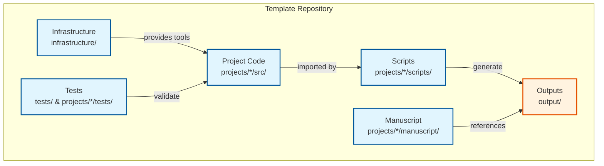

# 🏗️ System Architecture Overview

> Concise overview of the template's design — see linked documents for details

**Quick Reference:** [How To Use](how-to-use.md) | [Two-Layer Architecture](../architecture/two-layer-architecture.md) | [Workflow](workflow.md) | [Thin Orchestrator](../architecture/thin-orchestrator-summary.md)

## Architecture Summary

The Research Project Template uses a **Two-Layer Architecture** with a **Thin Orchestrator** pattern:

- **Layer 1 — Infrastructure** (`infrastructure/`): Generic, reusable build, validation, rendering, and reporting tools
- **Layer 2 — Projects** (`projects/{name}/`): Project-specific code, manuscripts, and outputs
- **Scripts** (`scripts/`, `projects/{name}/scripts/`): Thin orchestrators that import and use `src/` methods — never implement algorithms

For the complete architecture guide, see **[Two-Layer Architecture](../architecture/two-layer-architecture.md)**.

## Core Components

## Core pipeline (`--core-only`)

The default [`pipeline.yaml`](../../infrastructure/core/pipeline/pipeline.yaml) defines a DAG. With **`--core-only`**, stages tagged `llm` are omitted: **eight** core stages run (clean → setup → infra tests → project tests → analysis → PDF render → validate → copy). The **full** graph adds optional LLM review and translation stages (**ten** named stages total). `run.sh` may show an additional clean pre-step in logs.

| Order | Stage (from `pipeline.yaml`) |
|-------|------------------------------|
| 1 | Clean Output Directories |
| 2 | Environment Setup |
| 3 | Infrastructure Tests |
| 4 | Project Tests |
| 5 | Project Analysis |
| 6 | PDF Rendering |
| 7 | Output Validation |
| 8 | Copy Outputs |

Coverage gates: 90% for `projects/{name}/src/`, 60% for `infrastructure/` (see [`docs/_generated/canonical_facts.md`](../_generated/canonical_facts.md)). Full stage reference: [`RUN_GUIDE.md`](../RUN_GUIDE.md).

Run: `uv run python scripts/execute_pipeline.py --project {name} --core-only`

## Key Principles

1. **Single Source of Truth** — `src/` is the authoritative implementation
2. **Thin Orchestrators** — Scripts import `src/` methods, never duplicate logic
3. **Test-Driven** — Tests validate before implementation
4. **Reproducible** — Deterministic RNG, fixed seeds, headless plotting
5. **Automated Validation** — All components checked for coherence

## Detailed Documentation

| Topic | Document |
|-------|----------|
| Full architecture guide | [two-layer-architecture.md](../architecture/two-layer-architecture.md) |
| Thin orchestrator pattern | [thin-orchestrator-summary.md](../architecture/thin-orchestrator-summary.md) |
| Code placement decisions | [decision-tree.md](../architecture/decision-tree.md) |
| Development workflow | [workflow.md](workflow.md) |
| Pipeline orchestration | [RUN_GUIDE.md](../RUN_GUIDE.md) |
| API reference | [api-reference.md](../reference/api-reference.md) |

## Development Rules

- **[`docs/rules/AGENTS.md`](../rules/AGENTS.md)** — Development standards
- **[`docs/rules/infrastructure_modules.md`](../rules/infrastructure_modules.md)** — Infrastructure module development
- **[`docs/rules/README.md`](../rules/README.md)** — Quick reference and patterns

---

## Troubleshooting

### Layer Violation

**Symptom**: `ModuleNotFoundError` when infrastructure imports project code

**Solution**: Refactor - infrastructure must not depend on project code. Move shared logic to infrastructure.

### Import Errors

**Symptom**: Scripts fail with import errors

**Solution**:
- Use `uv run python` for proper environment
- Ensure conftest.py adds src/ to path
- Check thin orchestrator pattern: scripts import from src/, not implement

---

**Quick Reference**: [Troubleshooting Guide](../operational/troubleshooting/README.md)
