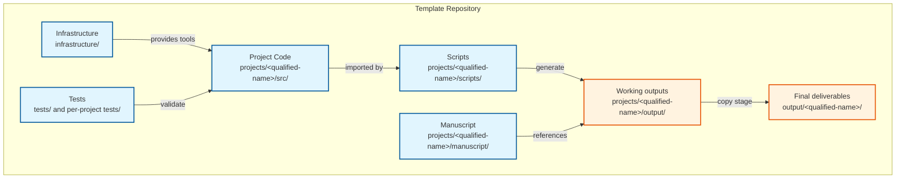

# 🏗️ System Architecture Overview

> Concise overview of the template's design — see linked documents for details

**Quick Reference:** [How To Use](how-to-use.md) | [Two-Layer Architecture](../architecture/two-layer-architecture.md) | [Workflow](workflow.md) | [Thin Orchestrator](../architecture/thin-orchestrator-summary.md)

## Architecture Summary

The Research Project Template uses a **Two-Layer Architecture** with a **Thin Orchestrator** pattern:

- **Layer 1 — Infrastructure** (`infrastructure/`): Generic, reusable build, validation, rendering, and reporting tools
- **Layer 2 — Projects** (`projects/<qualified-name>/`): Project-specific code, manuscripts, and outputs
- **Scripts** (`scripts/`, `projects/<qualified-name>/scripts/`): Thin orchestrators that import and use `src/` methods — never implement algorithms

A qualified name includes its lifecycle folder, for example
`templates/template_code_project` or `working/my_project`. Public/default
discovery is documented in
[`docs/_generated/active_projects.md`](../_generated/active_projects.md); do
not infer the current roster from local symlinks.

For the complete architecture guide, see **[Two-Layer Architecture](../architecture/two-layer-architecture.md)**.

## Core Components

```mermaid
graph TB
    subgraph "Template Repository"
        INFRA[Infrastructure<br/>infrastructure/] --> |"provides tools"| PROJECT
        PROJECT[Project Code<br/>projects/&lt;qualified-name&gt;/src/] --> |"imported by"| SCRIPTS[Scripts<br/>projects/&lt;qualified-name&gt;/scripts/]
        SCRIPTS --> |"generate"| WORKING[Working outputs<br/>projects/&lt;qualified-name&gt;/output/]
        WORKING --> |"copy stage"| OUTPUTS[Final deliverables<br/>output/&lt;qualified-name&gt;/]
        TESTS[Tests<br/>tests/ and per-project tests/] --> |"validate"| PROJECT
        MANUSCRIPT[Manuscript<br/>projects/&lt;qualified-name&gt;/manuscript/] --> |"references"| WORKING
    end

    classDef core fill:#e1f5fe,stroke:#01579b,stroke-width:2px
    classDef output fill:#fff3e0,stroke:#e65100,stroke-width:2px
    class INFRA,PROJECT,SCRIPTS,TESTS,MANUSCRIPT core
    class WORKING,OUTPUTS output
```

## Core pipeline (`--core-only`)

The default [`pipeline.yaml`](../../infrastructure/core/pipeline/pipeline.yaml)
defines the DAG. `--core-only` selects the core-tagged path and omits LLM and
other opt-in publication lanes. Because the declaration can evolve, use the
[generated canonical stage table](workflow.md#canonical-stage-table-generated)
for the current order, tags, and failure modes instead of relying on a copied
stage count.

Coverage gates: 90% for a project `src/` tree and 60% for `infrastructure/`
(see [`docs/_generated/COUNTS.md`](../_generated/COUNTS.md)). Full stage
reference: [`RUN_GUIDE.md`](../RUN_GUIDE.md).

Run the public control-positive exemplar:
`./run.sh pipeline --project templates/template_code_project --core-only`.

## Key Principles

1. **Single Source of Truth** — `src/` is the authoritative implementation
2. **Thin Orchestrators** — Scripts import `src/` methods, never duplicate logic
3. **Test-Driven** — Tests validate before implementation
4. **Reproducible** — Deterministic RNG, fixed seeds, headless plotting
5. **Automated Validation** — All components checked for coherence

## Detailed Documentation

| Topic | Document |
|-------|----------|
| Full architecture guide | [two-layer-architecture.md](../architecture/two-layer-architecture.md) |
| Thin orchestrator pattern | [thin-orchestrator-summary.md](../architecture/thin-orchestrator-summary.md) |
| Code placement decisions | [decision-tree.md](../architecture/decision-tree.md) |
| Development workflow | [workflow.md](workflow.md) |
| Pipeline orchestration | [RUN_GUIDE.md](../RUN_GUIDE.md) |
| API reference | [api-reference.md](../reference/api-reference.md) |

## Development Rules

- **[`docs/rules/AGENTS.md`](../rules/AGENTS.md)** — Development standards
- **[`docs/rules/infrastructure_modules.md`](../rules/infrastructure_modules.md)** — Infrastructure module development
- **[`docs/rules/README.md`](../rules/README.md)** — Quick reference and patterns

---

## Troubleshooting

### Layer Violation

**Symptom**: `ModuleNotFoundError` when infrastructure imports project code

**Solution**: Refactor - infrastructure must not depend on project code. Move shared logic to infrastructure.

### Import Errors

**Symptom**: Scripts fail with import errors

**Solution**:
- Use `uv run python` for proper environment
- Run the project suite through its configured environment rather than adding
  ad hoc `sys.path` mutations
- Use the import style already exercised by that project's tests and scripts
- Check the thin-orchestrator pattern: scripts import from `src/`; they do not
  implement project algorithms

---

**Quick Reference**: [Troubleshooting Guide](../operational/troubleshooting/README.md)
