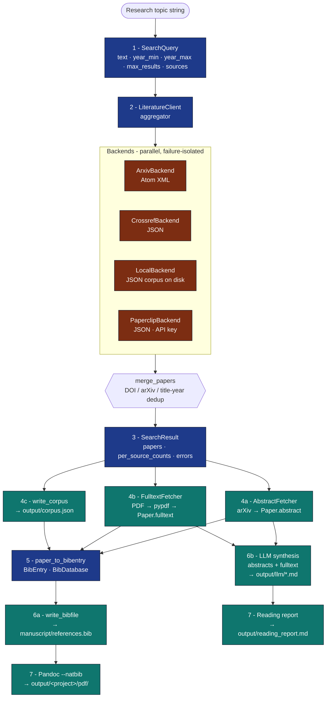
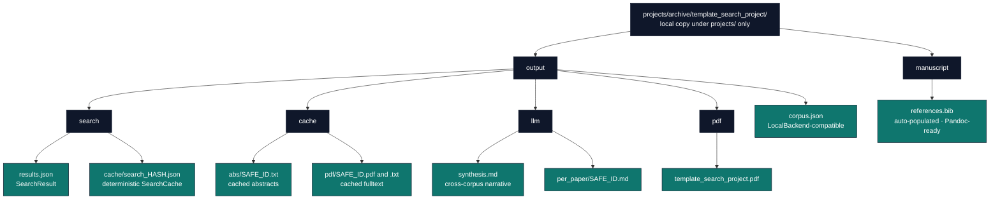

# Literature Data Flow

A core architectural diagram showing how a topic string becomes a citation
in a rendered PDF, and where every artifact lands.

## Stages

## On-Disk Layout

A typical run lands the following artefacts:

## Stage Idempotency

| Stage | Re-runs incur cost? | Caching mechanism |
|---|---|---|
| 2. Search | only on cache miss | `SearchCache` (JSON files keyed by query hash) |
| 4a. Abstract fetch | only on cache miss | `AbstractFetcher.cache_dir` |
| 4b. Fulltext fetch | only on cache miss | `FulltextFetcher.cache_dir` |
| 5. BibTeX export | always (fast, in-memory) | n/a |
| 6b. LLM synthesis | always unless `seed=` pinned and cache layered above | callers' responsibility |
| 7. PDF render | always; reads `references.bib` + figures | infrastructure pipeline |

## Failure Surfaces

* **Network outages** → `SearchResult.errors[backend_name] = message`; the
  search itself still returns whatever the surviving backends produced.
* **Corpus missing/corrupt** → `BackendError` raised by `LocalBackend`; CLI
  surfaces it but does not abort multi-backend searches.
* **PDF parse failure** → `FetchResult.status = "error"` with the message
  `pypdf unavailable; PDF cached but text not extracted`. The cached PDF
  is still on disk for downstream tooling.
* **BibTeX write conflict** → `paper_to_bibentry` uses deterministic key
  generation but does not detect collisions; callers should
  `db.find(key)` before `db.add(entry)` if uniqueness is critical.

## See Also

* [`docs/architecture/two-layer-architecture.md`](../architecture/two-layer-architecture.md) — generic Layer-1/Layer-2 split.
* [`docs/modules/literature-search-and-references.md`](../modules/literature-search-and-references.md) — module reference.
* [`docs/guides/literature-workflow-guide.md`](../guides/literature-workflow-guide.md) — hands-on walkthrough.
