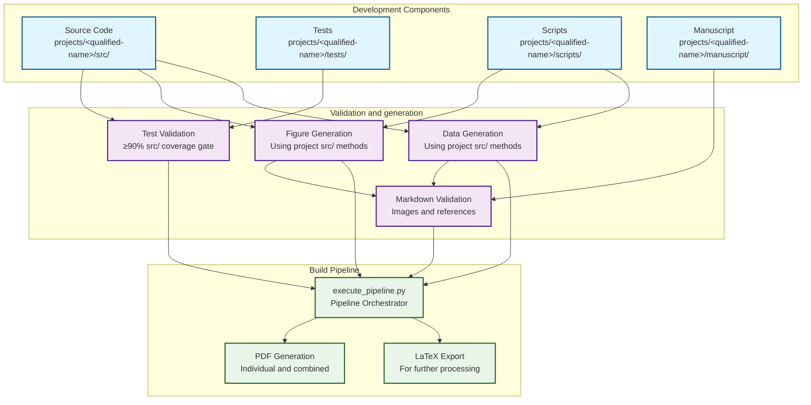
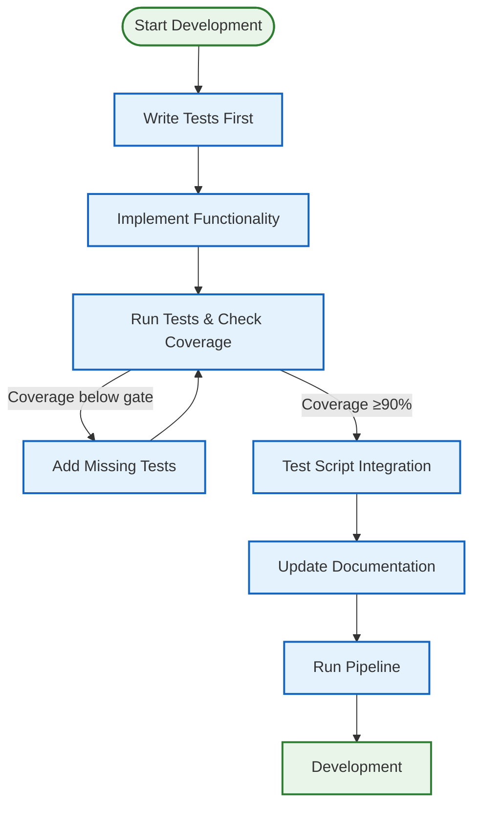
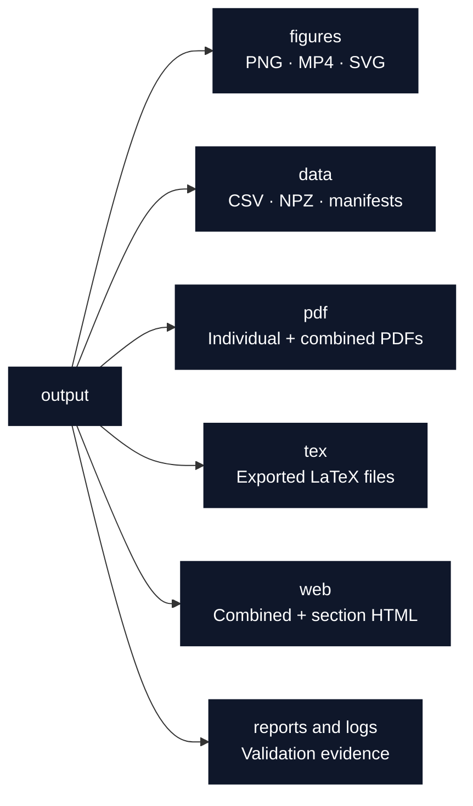

# Generic Project Development Workflow: The Pipeline Orchestrator Paradigm

> **development workflow** ensuring source code, tests, and documentation coherence

**Quick Reference:** [How To Use](../core/how-to-use.md) | [Architecture](../core/architecture.md) | [Common Workflows](../reference/common-workflows.md)

This document explains the development workflow that ensures source code, tests, and documentation remain in coherence.

**For related information:**

- **[How To Use](../core/how-to-use.md)** - usage guide from basic to advanced
- **[Architecture](../core/architecture.md)** - System design overview
- **[Thin Orchestrator Summary](../architecture/thin-orchestrator-summary.md)** - Pattern implementation details
- **[Common Workflows](../reference/common-workflows.md)** - Step-by-step recipes for common tasks

## Overview

The generic project template implements a **unified test-driven development paradigm** where:

- **Source code** implements mathematical functionality
- **Tests** validate all functionality with coverage (60% infra, 90% project minimum)
- **Scripts** are **thin orchestrators** that import and use
  `projects/<qualified-name>/src/` methods
- **`scripts/runner/execute_pipeline.py`** orchestrates the declarative DAG pipeline

## Workflow Diagram



## How the Pipeline Orchestrator Works with Markdown and Code

The `scripts/runner/execute_pipeline.py` orchestrator (or `./run.sh --pipeline`) executes the pipeline stages sequentially, ensuring coherence between all components:

### 1. Test phase

- **Runs infrastructure and project tests** before analysis
- **Enforces the configured coverage gates** for the selected surfaces
- **Validates real project behavior** without replacing scientific dependencies

### 2. Analysis and source hydration

- **Discovers project analysis scripts** and runs them as thin orchestrators
- **Generates figures, data, registries, and manuscript variables** from tested
  project code
- **Hydrates the render tree** from `output/data/manuscript_variables.json`
  unless hydration is explicitly skipped for a diagnostic render

### 3. Manuscript validation and rendering

- **Validates all image references** - Ensures figures referenced in markdown exist
- **Checks internal links** - Validates equation labels and section anchors
- **Validates equation formatting** - Ensures proper LaTeX equation environments
- **Builds enabled formats** from the hydrated manuscript tree

### 4. Project-defined documentation generation

- A project may include a glossary or API-doc generator among its analysis
  scripts. This is not a universal root-pipeline stage.
- The glossary CLI can also be run manually with explicit source and target
  paths; see the [modules guide](../modules/modules-guide.md#documentation-generation).

### 5. Validation and copy-out

- **Validates publication artifacts and provenance contracts**
- **Copies final deliverables** from the project working output to
  `output/<qualified-name>/`

## Test Suite and Code Connections

The test suite ensures coverage of all modules and validates the entire pipeline:

### What Tests Validate

- **Mathematical correctness** - All functions produce expected results
- **Import compatibility** - Scripts can successfully import from `projects/{name}/src/` modules
- **Output generation** - Figure and data generation works correctly
- **Deterministic execution** - All outputs are reproducible with fixed seeds
- **Path management** - Outputs go to correct directories

### Test-Driven Development Flow



1. **Write tests first** - Define expected behavior before implementation
2. **Implement functionality** - Write code to pass tests
3. **Validate integration** - Ensure scripts can use the code
4. **Update documentation** - Reflect changes in markdown
5. **Run pipeline** - Use
   `./run.sh pipeline --project templates/template_code_project --core-only`
   for the public control-positive exemplar

## Step-by-Step Workflow

### 1. Development Phase

```bash
# Always start with tests
uv run pytest projects/templates/template_code_project/tests/ --cov=projects/templates/template_code_project/src --cov-report=term-missing

# Check coverage (≥90% gate; live percentage per exemplar → docs/_generated/COUNTS.md)
uv run coverage report

# Make code changes in projects/<qualified-name>/src/
# Update corresponding tests
# Update documentation if needed
```

### 2. Validation Phase

```bash
# Run the infrastructure and selected project suites separately. Separate
# invocations avoid collisions between projects that each define tests/conftest.py.
uv run pytest tests/infra_tests/
uv run pytest projects/templates/template_code_project/tests/

# Generate figures and data
uv run python projects/templates/template_code_project/scripts/optimization_analysis.py
uv run python scripts/pipeline/stage_02_analysis.py --project templates/template_code_project

# Validate markdown integrity
uv run python -m infrastructure.validation.cli markdown projects/templates/template_code_project/manuscript/
```

### 3. Integration Phase

```bash
# Run the core pipeline (no LLM stages)
./run.sh pipeline --project templates/template_code_project --core-only

# Or use unified interactive menu
./run.sh
```

With `--core-only`, `PipelineExecutor` selects the **core** path. The exact
selection and order come from `pipeline.yaml`; use the generated table below
rather than a copied count. A normal full run may also select configured LLM
stages. `scripts/pipeline/stage_07_executive_report.py` is for multi-project /
executive reporting, not the default single-project stage list.

### Canonical stage table (generated)

<!-- BEGIN:STAGE_TABLE -->
<!-- This block is generated from [`infrastructure/core/pipeline/pipeline.yaml`](../../infrastructure/core/pipeline/pipeline.yaml) by `scripts/docgen/stage_table.py`. Do not hand-edit. Stage indices are **0-based positions in the YAML** and intentionally do **not** match the `scripts/pipeline/stage_NN_*.py` numeric prefixes (for example, stage 11, "Copy Outputs", runs `scripts/pipeline/stage_05_copy.py`). -->

| Stage | Script | Tags | Failure mode |
| ----- | ------ | ---- | ------------ |
| **0** Clean Output Directories | built-in `_run_clean_outputs` | `core`, `clean` | soft fail |
| **1** Environment Setup | `scripts/pipeline/stage_00_setup.py` | `core` | hard fail |
| **2** Infrastructure Tests | `scripts/pipeline/stage_01_test.py --infra-only --verbose --infra-scope pipeline-smoke` | `core`, `tests` | configurable tolerance |
| **3** Project Tests | `scripts/pipeline/stage_01_test.py --project-only --verbose` | `core`, `tests` | configurable tolerance |
| **4** Project Analysis | `scripts/pipeline/stage_02_analysis.py` | `core` | hard fail |
| **5** Connector Search | `scripts/pipeline/stage_08_connector_search.py` | `science` | skipped if not configured |
| **6** Provenance Record | `scripts/pipeline/stage_09_provenance_record.py --stage Connector Search` | `provenance` | skipped if not configured |
| **7** PDF Rendering | `scripts/pipeline/stage_03_render.py` | `core` | hard fail |
| **8** Output Validation | `scripts/pipeline/stage_04_validate.py` | `core` | PDF/bookends and artifact/provenance failures block; optional-format structure remains a warning + report |
| **9** LLM Scientific Review | `scripts/pipeline/stage_06_llm_review.py --reviews-only` | `llm` | skipped if Ollama absent |
| **10** LLM Translations | `scripts/pipeline/stage_06_llm_review.py --translations-only` | `llm` | skipped if Ollama absent |
| **11** Copy Outputs | `scripts/pipeline/stage_05_copy.py` | `core` | soft fail |
| **12** Ebook Generation | `scripts/pipeline/stage_11_ebook.py` | `core`, `ebook` | soft fail |
| **13** docxplus Export | `scripts/pipeline/stage_13_docxplus.py` | `core`, `docxplus` | soft fail |
| **14** Metadata Package | `scripts/pipeline/stage_12_metadata.py` | `core`, `metadata` | soft fail |
| **15** Executable Bundle | `scripts/runner/bundle_executable.py` | `bundle` | soft fail |
| **16** Archival Publication | `scripts/runner/archive_publication.py` | `archival` | soft fail |
<!-- END:STAGE_TABLE -->

## Key Components

### Source Code (`projects/{name}/src/`)

- **`optimizer.py`**, **`sweeps.py`**, **`invariants.py`**: Project-specific algorithms and computations
- Additional modules can be added for specific project needs

**Critical Principle**: ALL business logic and algorithms must live in `projects/{name}/src/` modules.

### Tests (`projects/{name}/tests/`)

- **90% minimum coverage** for `projects/{name}/src/` (live percentages per exemplar → [`../_generated/COUNTS.md`](../_generated/COUNTS.md))
- **60% minimum coverage** for `infrastructure/` (live percentage → `COUNTS.md`)
- **Real numerical examples** (no mocks)
- **Deterministic RNG seeds** for reproducibility
- **Fast and hermetic** execution

### Generation Scripts (`projects/{name}/scripts/`)

- **Import from project src/** modules (no code duplication)
- **Use project src/ methods for all computation** (never implement algorithms)
- **Generate figures and data** deterministically
- **Print output paths** to stdout for manifest collection
- **Use headless plotting** (MPLBACKEND=Agg)

### Documentation (`projects/<qualified-name>/manuscript/`)

- **References source code** using inline code formatting
- **Displays generated figures** from `output/figures/`
- **Passes validation** for images, references, and equations
- **Optionally generated glossary/API material** when the project declares a
  generator or the glossary CLI is run explicitly

<a id="project-working-output"></a>

### Project working output (`projects/<qualified-name>/output/`)



After the copy stage, final deliverables appear under
`output/<qualified-name>/`. The qualified name retains its lifecycle prefix;
for example, the public exemplar copies to
`output/templates/template_code_project/`.

## Validation Rules

### Markdown Validation

- All images must exist and be properly referenced
- Internal links must have valid anchors
- Equations must have unique labels
- No bare URLs (use informative link text)

### Code Validation

- All public APIs must have type hints
- No circular imports
- Consistent formatting and naming
- Error handling for edge cases

### Test Validation

- statement and branch coverage (90% project, 60% infra minimum)
- All tests must pass
- No network or file-system writes outside output/
- Deterministic execution

## Development Commands

The individual commands (test, generate figures, validate markdown, build pipeline) are
the same ones already shown per-phase in [Step-by-Step Workflow](#step-by-step-workflow)
above — see that section for the full development/validation/integration sequence.

Two commands specific to this section, not covered above:

```bash
# Install dependencies (first-time setup)
uv sync

# Check coverage with per-line detail (vs. the summary `coverage report` shown earlier)
uv run coverage report -m
```

Cleaning is a declared pipeline stage. It removes regeneratable working
artifacts according to the cleanup policy; there is no separate manual clean
step for the normal build.

## Output Management

The pipeline manages project working outputs and copied deliverables. Cleaning
is policy-driven: it preserves configured checkpoint/evidence directories and
some publication sidecars while removing other regeneratable artifacts. A
canonical public exemplar can also track deterministic publication evidence.

Do not treat every file named `output/` as disposable. Before manual deletion,
inspect the project's cleanup policy, tracked files, and provenance/release
contracts. Prefer a normal pipeline run to an ad hoc recursive delete.

### Output Directory Structure

The common layout is shown in the
[project working output diagram](#project-working-output).
Enabled formats and project-specific evidence can add further directories; see
[Output formats](../usage/output-formats.md).

## Benefits of This Paradigm

1. **Coherence**: Source code, tests, and documentation stay synchronized
2. **Validation**: Automatic checking of all references and outputs
3. **Reproducibility**: Deterministic generation of all artifacts
4. **Maintainability**: Clear separation of concerns with unified workflow
5. **Quality**: test coverage enforced automatically
6. **Documentation**: Validation of references and outputs
7. **Thin Orchestrator Pattern**: Scripts use tested `projects/{name}/src/` methods, not duplicate logic

## Troubleshooting

### Common Issues

1. **Tests failing**: Check coverage and fix missing test cases
2. **Markdown validation errors**: Fix broken links, missing images, or duplicate labels
3. **Figure generation failures**: Ensure src/ modules work correctly
4. **PDF build errors**: Check pandoc and LaTeX installation

### Test Import Errors

**Symptom**: `ModuleNotFoundError: No module named 'project.src'`

**Solution**: run through the repository environment (`uv run`), verify the
project's package/import configuration, and use the import convention already
exercised by its tests. Avoid one-off `sys.path` mutations in documentation or
production scripts.

### Coverage Below Threshold

**Symptom**: `CoverageWarning: 85% < 90% required`

**Solution**: Find uncovered lines and add tests:
```bash
uv run pytest --cov=src --cov-report=term-missing
```

### Thin Orchestrator Violation

**Symptom**: Business logic in scripts instead of src/

**Solution**: Move algorithms to src/ modules, scripts only handle I/O and visualization

### Validation Commands

```bash
# Check what's failing
uv run python -m infrastructure.validation.cli markdown projects/templates/template_code_project/manuscript/

# Regenerate specific figures
uv run python projects/templates/template_code_project/scripts/optimization_analysis.py

# Check test coverage gaps
uv run coverage report -m
```

## Key Connections to Remember

1. **`projects/<qualified-name>/src/` modules → per-project tests → analysis scripts → hydrated manuscript**
2. **The pipeline orchestrator ensures all connections are valid before building outputs**
3. **Changes in any component must be reflected in all connected components**
4. **The test suite validates the entire pipeline, not just individual modules**
5. **Documentation is validated against outputs to maintain coherence**
6. **Scripts are thin orchestrators that import and use project `src/` methods**
7. **Business logic lives only in project `src/`; scripts handle orchestration and I/O**

## Thin Orchestrator Pattern

The workflow enforces a **thin orchestrator pattern** where:

- **`projects/<qualified-name>/src/`** contains all business logic, algorithms, and mathematical implementations
- **`projects/<qualified-name>/scripts/`** contains lightweight wrappers that import and use project `src/` methods
- **`projects/<qualified-name>/tests/`** validates project functionality
- **`scripts/runner/execute_pipeline.py`** orchestrates the entire pipeline

This ensures:

- **Maintainability**: Single source of truth for business logic
- **Testability**: tested core functionality
- **Reusability**: Scripts can use any `projects/{name}/src/` method
- **Clarity**: Clear separation of concerns
- **Quality**: Automated validation of the entire system

This workflow ensures that the generic project template maintains the highest standards of code quality, documentation coherence, and maintainability while providing a clear, scalable structure for development and collaboration.

For more details on architecture and implementation, see **[`../core/architecture.md`](../core/architecture.md)** and **[`thin-orchestrator-summary.md`](../architecture/thin-orchestrator-summary.md)**.
