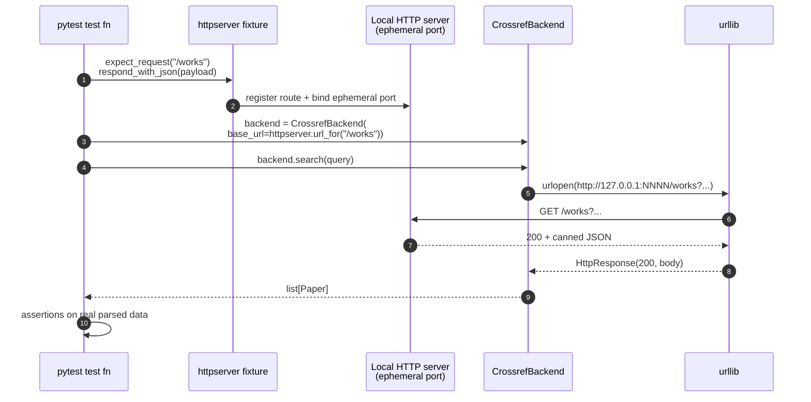

# No-Mocks HTTP Testing

The repository's testing policy (`CLAUDE.md` → "No Mocks Policy") forbids
`MagicMock`, `mocker.patch`, and `unittest.mock` everywhere. For HTTP-based
modules — including `infrastructure.search.literature` and any future
network-touching code — this is satisfied by **`pytest-httpserver`**, a
real local HTTP server fixture that listens on an ephemeral port.

This guide explains *why* and *how* the policy applies to HTTP code.

## Why no mocks for HTTP?

Mocked HTTP tests fail open: a backend whose mock is built around a
deprecated response shape will keep passing for years after the real API
changes. We have hit this exact failure mode in `desloppify`-related work
twice. Real-server tests:

* **Catch parser drift** — a Crossref schema bump changes a field, the
  test fixture (which is just a real JSON payload) is updated once, and
  every backend touching that schema is re-validated automatically.
* **Exercise the real HTTP stack** — `urllib`, headers, status codes,
  charsets, content types. Mocks always lie about at least one of these.
* **Document the contract** — the test payload is the canonical example.

## How a `pytest-httpserver` test executes



## The pattern

```python
import pytest
from pytest_httpserver import HTTPServer
from infrastructure.search.literature import CrossrefBackend, UrllibHttpClient
from infrastructure.search.literature.models import SearchQuery


def test_crossref_parses_real_payload(httpserver: HTTPServer):
    httpserver.expect_request("/works").respond_with_json({
        "message": {"items": [{
            "DOI": "10.1126/science.1213847",
            "title": ["Reproducible research"],
            "issued": {"date-parts": [[2011]]},
            "type": "journal-article",
            "score": 12.5,
        }]}
    })
    backend = CrossrefBackend(
        http_client=UrllibHttpClient(),
        base_url=httpserver.url_for("/works"),
    )
    results = backend.search(SearchQuery(text="reproducible research"))
    assert results[0].doi == "10.1126/science.1213847"
    assert results[0].year == 2011
```

Key points:

1. **`base_url` injection** — every HTTP backend accepts `base_url=` so
   tests redirect it to `httpserver.url_for(...)`.
2. **`http_client` injection** — also allowed if you need to short-circuit
   the network entirely (e.g. a fake that returns canned `HttpResponse`
   objects). Used sparingly; `pytest-httpserver` is preferred.
3. **Real payloads** — the test JSON / XML mirrors what the real API sends.
   Copy from a captured response when introducing a new backend.

## Mapping requests

```python
def test_query_string_is_forwarded(httpserver):
    httpserver.expect_request(
        "/works",
        query_string={"query": "x", "rows": "10"},
    ).respond_with_json({"message": {"items": []}})
    # Backend will only get a 200 if it sent the right query string.
```

`expect_request` understands `query_string=`, `headers=`, and `data=` — so
you can pin authorization headers (Paperclip) or POST bodies precisely.

## Failure injection

Network failures are also tested without mocks:

```python
def test_non_200_raises(httpserver):
    httpserver.expect_request("/works").respond_with_data(
        "internal error", status=500
    )
    backend = CrossrefBackend(base_url=httpserver.url_for("/works"))
    with pytest.raises(BackendError, match="HTTP 500"):
        backend.search(SearchQuery(text="x"))
```

Charset / content-type mismatches, malformed bodies, premature EOF — all
expressible via `respond_with_data`.

## Outside HTTP

The same principle applies elsewhere:

| Domain | No-mocks substitute |
|---|---|
| Filesystem | Real `tmp_path` fixture, real reads/writes. |
| Subprocess CLIs | Real `subprocess.run` against `python -m …`. |
| PDFs | Real `reportlab` to build fixtures, real `pypdf` to parse. |
| Time | `time.monotonic()` deltas; never patch `time.time`. |
| Random | Seed `numpy.random.default_rng(42)` and assert exact values. |

## When mocks are still tempting

If you find yourself reaching for `unittest.mock`, consider:

1. **Is there a fixture-friendly alternative?** Most "I just want to
   stub this thing" cases are actually "I haven't built a small real
   implementation."
2. **Is the dependency excessive?** A test that's hard to write without a
   mock often signals that the production code is doing too much. Split.
3. **Is the integration the point?** If you're testing wiring rather than
   logic, the unit you're trying to isolate probably belongs in an
   integration test where the real dependency is fine.

If after all that you still need a stand-in, build a **real fake** — a
small class implementing the same protocol — not a mock. The fake will
keep being useful as the code evolves; a mock won't.

## See Also

* [`tests/infra_tests/search/test_backends_http.py`](../../tests/infra_tests/search/test_backends_http.py) — exemplary `pytest-httpserver` use.
* [`tests/infra_tests/search/test_fulltext.py`](../../tests/infra_tests/search/test_fulltext.py) — same pattern for PDF fetching.
* `CLAUDE.md` → "No Mocks Policy" — top-level rules.
