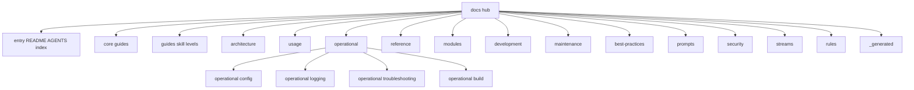

# Documentation index

This index lists documentation files in the Research Project Template by category.

**Project layout:** `projects/` is a **rotating** set of workspaces. The only path **guaranteed** for documentation examples is [`projects/templates/template_code_project/`](../projects/templates/template_code_project/). Authoritative current names: [`_generated/active_projects.md`](_generated/active_projects.md).

## Quick start by persona

### New user / content creator

1. **[README.md](../README.md)** - Project overview
2. **[guides/getting-started.md](guides/getting-started.md)** - Write your first document (Levels 1-3)
3. **[reference/quick-start-cheatsheet.md](reference/quick-start-cheatsheet.md)** - Essential commands
4. **[reference/common-workflows.md](reference/common-workflows.md)** - Step-by-step recipes
5. **[reference/faq.md](reference/faq.md)** - Common questions

### Developer / researcher

1. **[core/how-to-use.md](core/how-to-use.md)** - Usage guide (all 12 levels)
2. **[guides/figures-and-analysis.md](guides/figures-and-analysis.md)** - Figures and automation (Levels 4-6)
3. **[core/architecture.md](core/architecture.md)** - System design overview
4. **[architecture/thin-orchestrator-summary.md](architecture/thin-orchestrator-summary.md)** - Pattern implementation
5. **[core/workflow.md](core/workflow.md)** - Development process

### Contributor / maintainer

1. **[development/contributing.md](development/contributing.md)** - Contribution guidelines
2. **[development/contribution-map.md](development/contribution-map.md)** - Overlap checks and contribution strategy
3. **[rules/AGENTS.md](rules/AGENTS.md)** - Development standards
4. **[guides/testing-and-reproducibility.md](guides/testing-and-reproducibility.md)** - TDD workflow (Levels 7-9)
5. **[development/testing/testing-guide.md](development/testing/testing-guide.md)** - Testing requirements
6. **[development/code-of-conduct.md](development/code-of-conduct.md)** - Community standards

### Troubleshooter

1. **[operational/troubleshooting/](operational/troubleshooting/)** - Troubleshooting guides
2. **[reference/faq.md](reference/faq.md)** - Common questions and solutions
3. **[RUN_GUIDE.md](RUN_GUIDE.md)** - Pipeline orchestration and commands
4. **[operational/config/performance-optimization.md](operational/config/performance-optimization.md)** - Performance issues
5. **[operational/troubleshooting/common-errors.md](operational/troubleshooting/common-errors.md)** — Silent Stage 4 failure pattern

---

> [!IMPORTANT]
> **Multi-project pipeline pitfalls** (root venv deps, `matplotlib` in core deps, `project_config:` namespace, idempotency) — authoritative copy in [docs/AGENTS.md](AGENTS.md#learnings--known-issues) and [guides/new-project-setup.md](guides/new-project-setup.md#pitfall-6-root-venv).

## Topic routing (canonical → deep dives)

| Topic | Start here | Deep dives |
|-------|------------|------------|
| Pipeline ops | [RUN_GUIDE.md](RUN_GUIDE.md) | [operational/pipeline-control.md](operational/pipeline-control.md), [operational/runbook.md](operational/runbook.md) |
| Methods orchestration | [guides/methods-orchestration.md](guides/methods-orchestration.md) | [architecture/thin-orchestrator-summary.md](architecture/thin-orchestrator-summary.md), [RUN_GUIDE.md](RUN_GUIDE.md) |
| Agent code navigation | [guides/codegraph-local.md](guides/codegraph-local.md), [guides/leann-local.md](guides/leann-local.md) | [architecture/thin-orchestrator-summary.md](architecture/thin-orchestrator-summary.md), [reference/api-project-modules.md](reference/api-project-modules.md) |
| Logging | [operational/logging/output-design.md](operational/logging/output-design.md) | [operational/logging/python-logging.md](operational/logging/python-logging.md), [operational/logging/bash-logging.md](operational/logging/bash-logging.md) |
| Secure / steganography | [guides/secure-research-guide.md](guides/secure-research-guide.md) | [security/README.md](security/README.md), [security/secure_execution.md](security/secure_execution.md) |
| Literature search | [guides/literature-workflow-guide.md](guides/literature-workflow-guide.md) | [core/literature-data-flow.md](core/literature-data-flow.md), [modules/literature-search-and-references.md](modules/literature-search-and-references.md) |
| Web search (Exa) | [modules/guides/search-module.md](modules/guides/search-module.md#exa-web-search-exa) | [../infrastructure/search/exa/CAPABILITIES.md](../infrastructure/search/exa/CAPABILITIES.md) |
| Deep research (OpenAI/Gemini, paid opt-in) | [../infrastructure/search/deep_research/README.md](../infrastructure/search/deep_research/README.md) | [../infrastructure/search/deep_research/AGENTS.md](../infrastructure/search/deep_research/AGENTS.md), [../infrastructure/search/SKILL.md](../infrastructure/search/SKILL.md) |

**Module package counts:** link [modules/modules-guide.md](modules/modules-guide.md) or regenerate from `infrastructure/` discovery — do not hand-edit competing literals across hub pages.

---

## Development rules

Development standards are documented in **`docs/rules/`**. The Cursor IDE entry rule is the repository root **[`.cursorrules`](../.cursorrules)** file:

- **[`rules/AGENTS.md`](rules/AGENTS.md)** - Overview and navigation guide
- **[`rules/README.md`](rules/README.md)** - Quick reference and patterns
- **[`rules/error_handling.md`](rules/error_handling.md)** - Exception handling patterns
- **[`rules/security.md`](rules/security.md)** - Security standards
- **[`rules/python_logging.md`](rules/python_logging.md)** - Logging standards
- **[`rules/infrastructure_modules.md`](rules/infrastructure_modules.md)** - Infrastructure module development
- **[`rules/testing_standards.md`](rules/testing_standards.md)** - Testing patterns
- **[`rules/documentation_standards.md`](rules/documentation_standards.md)** - Documentation writing guide
- **[`rules/memory_and_decision_records.md`](rules/memory_and_decision_records.md)** - Decision-memory and rationale tiering
- **[`rules/type_hints_standards.md`](rules/type_hints_standards.md)** - Type annotation patterns
- **[`rules/llm_standards.md`](rules/llm_standards.md)** - LLM/Ollama integration
- **[`rules/code_style.md`](rules/code_style.md)** - Code formatting
- **[`rules/git_workflow.md`](rules/git_workflow.md)** - Git workflow
- **[`rules/api_design.md`](rules/api_design.md)** - API design
- **[`rules/manuscript_style.md`](rules/manuscript_style.md)** - Manuscript formatting
- **[`rules/reporting.md`](rules/reporting.md)** - Reporting module standards
- **[`rules/refactoring.md`](rules/refactoring.md)** - Refactoring standards
- **[`rules/folder_structure.md`](rules/folder_structure.md)** - Folder structure

---

## Core documentation

- **[README.md](../README.md)** - Main project overview and quick start
- **[Documentation hub (`docs/AGENTS.md`)](AGENTS.md)**
- **[Repository system (`AGENTS.md` at repo root)](../AGENTS.md)**
- **[CLOUD_DEPLOY.md](CLOUD_DEPLOY.md)** - Headless / cloud server deployment
- **[PAI.md](PAI.md)** - Personal AI Infrastructure (PAI) context
- **[RUN_GUIDE.md](RUN_GUIDE.md)** - Pipeline orchestration reference
- **[../.github/README.md](../.github/README.md)** - **GitHub**: Actions workflows, Dependabot, issue/PR templates, mirroring CI locally
- **[_generated/](_generated/README.md)** — folder policy; **[_generated/AGENTS.md](_generated/AGENTS.md)** — technical notes for this directory (hand-maintained). **Generated artefacts** (regenerated by their named script — never hand-edit): **[active_projects.md](_generated/active_projects.md)** (single source of truth for `projects/` roster — do not copy elsewhere), **[exemplar_roster.md](_generated/exemplar_roster.md)** (per-exemplar "when to use" differentiation map — `scripts/docgen/exemplar_roster.py`, sync test-enforced), **[architecture_overview.svg / .mmd](_generated/architecture_overview.svg)**, **[publication_records.md](_generated/publication_records.md)** (public exemplar GitHub/Zenodo/config matrix), **[coverage_history.md](_generated/coverage_history.md)**, **[skills_index.md](_generated/skills_index.md)**, **[last-run-summary.md](_generated/last-run-summary.md)** (canonical end-of-run multi-project summary — schema: [operational/logging/output-design.md](operational/logging/output-design.md)). **Maintained facts/snapshots:** **[COUNTS.md](_generated/COUNTS.md)** and historical **[hermes_knowledge_audit.json](_generated/hermes_knowledge_audit.json)**.
- **Agent skills manifest** — `uv run python -m infrastructure.skills write` (default output: `.cursor/skill_manifest.json`) · `uv run python -m infrastructure.skills check` — see [modules/guides/skills-module.md](modules/guides/skills-module.md)
- **Open Gauss naming** — [reference/opengauss-naming.md](reference/opengauss-naming.md) (math-inc `gauss` CLI vs Huawei DBMS; does not require `fep_lean` on disk)
- **[core/how-to-use.md](core/how-to-use.md)** - Usage guide (all 12 levels)
- **[how-to-use.md](how-to-use.md)** - Signpost stub redirecting to the canonical `core/how-to-use.md`
- **[core/literature-data-flow.md](core/literature-data-flow.md)** - Literature search and data pipeline overview
- **[accessibility.md](accessibility.md)** - Accessibility notes for generated documentation and diagrams

### Quick Reference

- **[reference/copypasta.md](reference/copypasta.md)** - Ready-to-use sharing content
- **[reference/copypasta-diagrams.md](reference/copypasta-diagrams.md)** - Diagram copypasta blocks
- **[reference/copypasta-outreach.md](reference/copypasta-outreach.md)** - Outreach/social copypasta
- **[reference/faq.md](reference/faq.md)** - FAQs
- **[reference/quick-start-cheatsheet.md](reference/quick-start-cheatsheet.md)** - Essential commands
- **[reference/common-workflows.md](reference/common-workflows.md)** - Step-by-step recipes
- **[reference/glossary.md](reference/glossary.md)** - Glossary of terms
- **[reference/opengauss-naming.md](reference/opengauss-naming.md)** - math-inc `gauss` CLI vs Huawei DBMS
- **[reference/api-project-modules.md](reference/api-project-modules.md)** - Project module API reference

---

## Architecture and design

- **[core/architecture.md](core/architecture.md)** - System design overview
- **[architecture/two-layer-architecture.md](architecture/two-layer-architecture.md)** - Two-layer architecture guide
- **[architecture/thin-orchestrator-summary.md](architecture/thin-orchestrator-summary.md)** - Thin orchestrator pattern
- **[architecture/decision-tree.md](architecture/decision-tree.md)** - Code placement decisions
- **[architecture/adrs/000-two-layer-architecture.md](architecture/adrs/000-two-layer-architecture.md)** - ADR-000: Two-layer architecture
- **[architecture/adrs/001-thin-orchestrator-pattern.md](architecture/adrs/001-thin-orchestrator-pattern.md)** - ADR-001: Thin orchestrator pattern
- **[architecture/adrs/002-declarative-dag-pipeline.md](architecture/adrs/002-declarative-dag-pipeline.md)** - ADR-002: Declarative DAG pipeline
- **[architecture/adrs/003-multi-format-rendering-and-toggles.md](architecture/adrs/003-multi-format-rendering-and-toggles.md)** - ADR-003: Multi-format rendering and toggles
- **[architecture/adrs/004-zero-mock-testing-policy.md](architecture/adrs/004-zero-mock-testing-policy.md)** - ADR-004: Zero-mock testing policy
- **[architecture/adrs/005-decision-memory-and-adversarial-validation.md](architecture/adrs/005-decision-memory-and-adversarial-validation.md)** - ADR-005: Decision memory and adversarial validation
- **[core/workflow.md](core/workflow.md)** - Development workflow
- **[architecture/testing-strategy.md](architecture/testing-strategy.md)** - Testing strategy overview
- **[architecture/discovery-export-synthesis.md](architecture/discovery-export-synthesis.md)** - Discovery and export patterns
- **[architecture/migration-from-flat.md](architecture/migration-from-flat.md)** - Migration from flat layout

---

## Usage guides

### Skill-Level Guides

- **[guides/startup-and-setup.md](guides/startup-and-setup.md)** - Complete install + validation procedure (copy-pasteable steps for humans and agents)
- **[guides/getting-started.md](guides/getting-started.md)** - Levels 1-3 (Beginner)
- **[guides/manuscript-semantics.md](guides/manuscript-semantics.md)** - Canonical manuscript syntax (citations, cross-references, sections, tokens) shared by public template exemplars
- **[guides/methods-orchestration.md](guides/methods-orchestration.md)** - Connect methods prose, pipeline contracts, artifacts, and evidence registries
- **[guides/codegraph-local.md](guides/codegraph-local.md)** - Optional local CodeGraph indexing for agent code navigation and impact checks
- **[guides/leann-local.md](guides/leann-local.md)** - Optional local LEANN semantic retrieval for agent navigation and impact checks
- **[guides/figures-and-analysis.md](guides/figures-and-analysis.md)** - Levels 4-6 (Intermediate)
- **[guides/testing-and-reproducibility.md](guides/testing-and-reproducibility.md)** - Levels 7-9 (Advanced)
- **[guides/extending-and-automation.md](guides/extending-and-automation.md)** - Levels 10-12 (Expert)
- **[guides/new-project-setup.md](guides/new-project-setup.md)** - New project checklist (all learnings)
- **[guides/new-project-one-shot-prompt.md](guides/new-project-one-shot-prompt.md)** - One-shot LLM prompt for new `projects/{name}/` (primary exemplar: [`projects/templates/template_code_project/`](../projects/templates/template_code_project/); other active names: [_generated/active_projects.md](_generated/active_projects.md))
- **[guides/llm-integration-guide.md](guides/llm-integration-guide.md)** - AI-assisted research with Ollama
- **[guides/publishing-guide.md](guides/publishing-guide.md)** - Publishing workflow across the 12-platform registry (DOI, Zenodo, GitHub, arXiv, PyPI, IPFS, Software Heritage, Hugging Face, OSF, static hosts), credential verification, and README status compilation
- **[guides/zenodo-doi-strategy.md](guides/zenodo-doi-strategy.md)** - Concept vs version DOI layout for Zenodo deposits
- **[guides/secure-research-guide.md](guides/secure-research-guide.md)** - PDF watermarking, provenance, and integrity
- **[../projects/templates/template_code_project/README.md](../projects/templates/template_code_project/README.md)** - Control-positive exemplar under `projects/`

### Content Authoring

- **[usage/examples.md](usage/examples.md)** - Project customization examples
- **[usage/examples-showcase.md](usage/examples-showcase.md)** - Real-world examples
- **[usage/template-description.md](usage/template-description.md)** - Template overview
- **[usage/markdown-template-guide.md](usage/markdown-template-guide.md)** - Markdown authoring
- **[usage/manuscript-numbering-system.md](usage/manuscript-numbering-system.md)** - Section numbering
- **[usage/style-guide.md](usage/style-guide.md)** - Equations, figures, tables
- **[usage/image-management.md](usage/image-management.md)** - Image handling
- **[usage/visualization-guide.md](usage/visualization-guide.md)** - Publication-quality figures
- **[usage/output-formats.md](usage/output-formats.md)** - Per-format render toggles (PDF, HTML, slides, DOCX, EPUB)

### Scientific Computing

- **[modules/scientific-simulation-guide.md](modules/scientific-simulation-guide.md)** - Simulation system
- **[best-practices/literature-search-best-practices.md](best-practices/literature-search-best-practices.md)** - Literature search patterns and best practices
- **[guides/literature-workflow-guide.md](guides/literature-workflow-guide.md)** - Literature workflow step-by-step

---

## Development and maintenance

- **[development/contributing.md](development/contributing.md)** - Contribution guidelines
- **[development/contribution-map.md](development/contribution-map.md)** - Overlap checks and practical contribution strategy
- **[development/code-of-conduct.md](development/code-of-conduct.md)** - Community standards
- **[development/security.md](development/security.md)** - Security policy
- **[development/roadmap.md](development/roadmap.md)** - Development roadmap
- **[development/coverage-gaps.md](development/coverage-gaps.md)** - Coverage analysis
- **[development/testing/testing-guide.md](development/testing/testing-guide.md)** - Testing framework
- **[development/testing/testing-with-credentials.md](development/testing/testing-with-credentials.md)** - Credential testing
- **[development/no-mocks-http-testing.md](development/no-mocks-http-testing.md)** - HTTP testing without mocks
- **[development/validation_gates.md](development/validation_gates.md)** - Validation gates
- **[development/code-review-checklist.md](development/code-review-checklist.md)** - Eight-criterion review checklist (clarity, composability, functionality/SSOT, testability, validation, documentation, conventions, reproducibility)
- **[development/optional-dependencies.md](development/optional-dependencies.md)** - Optional dependency + capability matrix (which extras unlock which features)
- **[maintenance/README.md](maintenance/README.md)** - Maintenance hub index
- **[maintenance/private-projects-repo.md](maintenance/private-projects-repo.md)** - Sibling private project lifecycle (required `working/` + `archive/`, optional legacy `active/`, `published/`, `other/`) and symlink sync into `projects/`
- **[maintenance/toolchain-migration.md](maintenance/toolchain-migration.md)** - Toolchain migration notes
- **[maintenance/regression-testing.md](maintenance/regression-testing.md)** - Regression testing workflow
- **[maintenance/archival-targets.md](maintenance/archival-targets.md)** - Stage 13 archival providers
- **[maintenance/ci-local.md](maintenance/ci-local.md)** - Local CI reproduction (`scripts/shell/ci_local.sh`)
- **[maintenance/stage-10-executable-bundle.md](maintenance/stage-10-executable-bundle.md)** - Stage 12 executable bundle design (file predates the Ebook/Metadata stage insertion; kept its original name)
- **[maintenance/local-only-template-exemplars.md](maintenance/local-only-template-exemplars.md)** - Local-only exemplar policy (`LOCAL_ONLY_TEMPLATE_NAMES`)
- **[maintenance/doc-mega-decomposition.md](maintenance/doc-mega-decomposition.md)** - Policy for splitting oversized documentation mega-files
- **[maintenance/review-remediation-2026-07.md](maintenance/review-remediation-2026-07.md)** - Multi-lens review remediation plan (R1–R18 items with acceptance lines)

---

## Advanced modules

- **[modules/modules-guide.md](modules/modules-guide.md)** - Layer-1 module overview; live package counts come from [`_generated/COUNTS.md`](_generated/COUNTS.md)
- **[reference/api-reference.md](reference/api-reference.md)** - Unified API documentation
- **[modules/pdf-validation.md](modules/pdf-validation.md)** - PDF validation system
- **[modules/literature-search-and-references.md](modules/literature-search-and-references.md)** - Literature search and reference pipeline

### Per-Module Guides (`modules/guides/`)

- **[modules/guides/config-module.md](modules/guides/config-module.md)**
- **[modules/guides/autoresearch-module.md](modules/guides/autoresearch-module.md)**
- **[modules/guides/benchmark-module.md](modules/guides/benchmark-module.md)**
- **[modules/guides/core-module.md](modules/guides/core-module.md)**
- **[modules/guides/docker-module.md](modules/guides/docker-module.md)**
- **[modules/guides/documentation-module.md](modules/guides/documentation-module.md)**
- **[modules/guides/integrity-module.md](modules/guides/integrity-module.md)**
- **[modules/guides/llm-module.md](modules/guides/llm-module.md)**
- **[modules/guides/project-module.md](modules/guides/project-module.md)**
- **[modules/guides/publishing-module.md](modules/guides/publishing-module.md)** - 12-platform registry, DOI/citations, credential verification, README status compilation, multi-platform upload dispatch
- **[modules/guides/rendering-module.md](modules/guides/rendering-module.md)**
- **[modules/guides/reporting-module.md](modules/guides/reporting-module.md)**
- **[modules/guides/scientific-module.md](modules/guides/scientific-module.md)**
- **[modules/guides/skills-module.md](modules/guides/skills-module.md)**
- **[modules/guides/steganography-module.md](modules/guides/steganography-module.md)**
- **[modules/guides/validation-module.md](modules/guides/validation-module.md)**
- **[modules/guides/doctor-module.md](modules/guides/doctor-module.md)**
- **[modules/guides/orchestration-module.md](modules/guides/orchestration-module.md)**
- **[modules/guides/prose-module.md](modules/guides/prose-module.md)**
- **[modules/guides/search-module.md](modules/guides/search-module.md)**
- **[modules/guides/reference-module.md](modules/guides/reference-module.md)**
- **[modules/guides/methods-module.md](modules/guides/methods-module.md)**
- **[modules/guides/sia-module.md](modules/guides/sia-module.md)**

---

## Operational guides

### Pipeline & CI/CD

- **[RUN_GUIDE.md](RUN_GUIDE.md)** - Pipeline orchestration and stage reference
- **[operational/pipeline-control.md](operational/pipeline-control.md)** - Advisory stage contracts, HITL commands, hooks, manifests, evidence registry, run lessons, and benchmarks
- **[.github/README.md](../.github/README.md)** - Repository CI/CD and contribution automation
- **template_code_project / CI paths** — Use [`projects/templates/template_code_project/`](../projects/templates/template_code_project/) when listed under [`_generated/active_projects.md`](_generated/active_projects.md); WIP copies live under `projects/working/` only when you place them there

### Build & dependency docs (`operational/build/`)

- **[operational/build/README.md](operational/build/README.md)** - Index
- **[operational/build/build-system.md](operational/build/build-system.md)** - Build system
- **[operational/build/build-performance.md](operational/build/build-performance.md)** - Build performance
- **[operational/build/build-history.md](operational/build/build-history.md)** - Build history
- **[operational/build/ci-cd-integration.md](operational/build/ci-cd-integration.md)** - CI/CD integration
- **[operational/build/dependency-management.md](operational/build/dependency-management.md)** - Dependency management
- **[plans/README.md](plans/README.md)** - Strategic plans and architecture decisions
- **Live doc linter** — `scripts/audit/lint_docs.py`: `uv run python scripts/audit/lint_docs.py` ([script entrypoint](../scripts/audit/lint_docs.py)) — repo-wide mermaid block validation + cross-link integrity + sibling-doc consistency; replaces the older point-in-time `scripts/audit_filepaths.py` snapshots
- **Template drift checker** — `scripts/audit/check_template_drift.py`: `uv run python scripts/audit/check_template_drift.py` ([script entrypoint](../scripts/audit/check_template_drift.py)) — 10 per-exemplar detectors + 2 repo-level checks (`check_repo_docs_hardcoded_counts` against `docs/` and the thin-orchestrator `check_repo_scripts`)
- **Audit replacement note** — dated audit snapshots were retired from public docs; use the live linters above as the canonical reference, or git history for point-in-time reports
- **[guides/fork-an-exemplar.md](guides/fork-an-exemplar.md)** - Top-level entry: pick the right exemplar and start a 5-minute fork

### Configuration & Performance (`operational/config/`)

- **[operational/config/configuration.md](operational/config/configuration.md)** - Configuration system (Lean exemplar under `projects/templates/template_active_inference/`; paths under `projects/templates/template_code_project/`)
- **[reference/opengauss-naming.md](reference/opengauss-naming.md)** - Open Gauss naming (`gauss` CLI vs Huawei DBMS) — same page as the Open Gauss entry near line 90; listed twice intentionally (theme list + file table)
- **[operational/config/checkpoint-resume.md](operational/config/checkpoint-resume.md)** - Checkpoint system
- **[operational/config/performance-optimization.md](operational/config/performance-optimization.md)** - Performance tuning

### Logging (`operational/logging/`)

- **[operational/logging/](operational/logging/)** - Comprehensive logging guide
- **[operational/logging/python-logging.md](operational/logging/python-logging.md)** - Python logging
- **[operational/logging/bash-logging.md](operational/logging/bash-logging.md)** - Bash logging
- **[operational/logging/logging-patterns.md](operational/logging/logging-patterns.md)** - Cross-language patterns
- **[operational/logging/output-design.md](operational/logging/output-design.md)** - Output design: terminal vs file, summary schema, verbosity dial

### Troubleshooting (`operational/troubleshooting/`)

- **[operational/troubleshooting/](operational/troubleshooting/)** - Diagnostic flowchart and approach
- **[operational/troubleshooting/common-errors.md](operational/troubleshooting/common-errors.md)** - Error patterns
- **[operational/troubleshooting/build-tools.md](operational/troubleshooting/build-tools.md)** - Build tool issues
- **[operational/troubleshooting/test-failures.md](operational/troubleshooting/test-failures.md)** - Test debugging
- **[operational/troubleshooting/environment-setup.md](operational/troubleshooting/environment-setup.md)** - Environment setup
- **[operational/troubleshooting/recovery-procedures.md](operational/troubleshooting/recovery-procedures.md)** - Recovery
- **[operational/troubleshooting/llm-review.md](operational/troubleshooting/llm-review.md)** - LLM review issues
- **[operational/troubleshooting/llm-diagnostics.md](operational/troubleshooting/llm-diagnostics.md)** - LLM diagnostics

### Other Operational Guides

- **[operational/reporting-guide.md](operational/reporting-guide.md)** - Reporting system
- **[operational/overview.md](operational/overview.md)** - Operational overview
- **[operational/runbook.md](operational/runbook.md)** - Runbook for operational procedures
- **[operational/error-handling-guide.md](operational/error-handling-guide.md)** - Error handling patterns
- **[operational/docker.md](operational/docker.md)** - Docker containerization
- **[operational/config-wizard.md](operational/config-wizard.md)** - Environment setup wizard
- **[operational/template-usage.md](operational/template-usage.md)** - Template usage patterns
- **[operational/diagrams.md](operational/diagrams.md)** - Operational diagrams
- **[operational/maintenance.md](operational/maintenance.md)** - Log rotation, backups, dependency updates
- **[operational/performance/benchmarking-guide.md](operational/performance/benchmarking-guide.md)** - Benchmarking guide

---

## Reference materials

- **[best-practices/best-practices.md](best-practices/best-practices.md)** - Consolidated best practices
- **[best-practices/version-control.md](best-practices/version-control.md)** - Git workflows
- **[best-practices/multi-project-management.md](best-practices/multi-project-management.md)** - Multi-project setup (roster → [_generated/active_projects.md](_generated/active_projects.md); optional per-project docs e.g. [`projects/templates/template_code_project/docs/`](../projects/templates/template_code_project/docs/))
- **[best-practices/migration-guide.md](best-practices/migration-guide.md)** - Migration from other templates
- **[best-practices/backup-recovery.md](best-practices/backup-recovery.md)** - Backup strategies

---

## Security and provenance

- **[security/README.md](security/README.md)** - Security overview
- **[security/steganography.md](security/steganography.md)** - Alpha-channel watermarking and QR codes
- **[security/hashing_and_manifests.md](security/hashing_and_manifests.md)** - SHA-256/512 hashing and manifests
- **[security/secure_execution.md](security/secure_execution.md)** - `secure_run.sh` orchestration and threat model
- **[security/literature-fetch-security.md](security/literature-fetch-security.md)** - Security for literature fetching

---

## AI prompt templates

- **[prompts/README.md](prompts/README.md)** - Navigation guide
- **[prompts/SKILL.md](prompts/SKILL.md)** - Hub router (`template-workflows`)
- **[prompts/MODE_REGISTRY.md](prompts/MODE_REGISTRY.md)** - Workflow-skill mode registry
- **[prompts/COMPOSITION.md](prompts/COMPOSITION.md)** - Workflow composition map (how prompt skills chain together)
- **[prompts/startup/SKILL.md](prompts/startup/SKILL.md)** - Startup / environment-bootstrap workflow skill
- **[prompts/_skill-eval/README.md](prompts/_skill-eval/README.md)** - Synthetic workflow-skill benchmark workspace
- **[prompts/manuscript-creation/SKILL.md](prompts/manuscript-creation/SKILL.md)** - Manuscript creation
- **[prompts/manuscript-cross-references/SKILL.md](prompts/manuscript-cross-references/SKILL.md)** - Registry/token manuscript cross-references
- **[prompts/manuscript-claim-verification/SKILL.md](prompts/manuscript-claim-verification/SKILL.md)** - Triple-check manuscript claims (max effort/tools)
- **[prompts/literature-synthesis/SKILL.md](prompts/literature-synthesis/SKILL.md)** - Literature synthesis LLM blocks
- **[prompts/code-development/SKILL.md](prompts/code-development/SKILL.md)** - Code development
- **[prompts/test-creation/SKILL.md](prompts/test-creation/SKILL.md)** - Test creation
- **[prompts/feature-addition/SKILL.md](prompts/feature-addition/SKILL.md)** - Feature addition
- **[prompts/refactoring/SKILL.md](prompts/refactoring/SKILL.md)** - Refactoring
- **[prompts/documentation-creation/SKILL.md](prompts/documentation-creation/SKILL.md)** - Documentation creation
- **[prompts/infrastructure-module/SKILL.md](prompts/infrastructure-module/SKILL.md)** - Infrastructure modules
- **[prompts/validation-quality/SKILL.md](prompts/validation-quality/SKILL.md)** - Validation and QA
- **[prompts/comprehensive-assessment/SKILL.md](prompts/comprehensive-assessment/SKILL.md)** - Assessment and review
- **[prompts/reproducibility-audit/SKILL.md](prompts/reproducibility-audit/SKILL.md)** - Determinism and regenerate-from-clean audit
- **[prompts/pipeline-debugging/SKILL.md](prompts/pipeline-debugging/SKILL.md)** - Pipeline DAG-stage failure triage
- **[prompts/academic-paper/SKILL.md](prompts/academic-paper/SKILL.md)** - Academic paper authoring
- **[prompts/academic-paper-reviewer/SKILL.md](prompts/academic-paper-reviewer/SKILL.md)** - Academic paper review
- **[prompts/academic-pipeline/SKILL.md](prompts/academic-pipeline/SKILL.md)** - Full academic pipeline
- **[prompts/agentic-use/SKILL.md](prompts/agentic-use/SKILL.md)** - Agentic-use planning
- **[prompts/deep-research/SKILL.md](prompts/deep-research/SKILL.md)** - Deep research synthesis
- **[prompts/methods-orchestration/SKILL.md](prompts/methods-orchestration/SKILL.md)** - Methods orchestration

### Prompt reference deep-dives (`prompts/*/references/`)

- **[prompts/code-development/references/patterns.md](prompts/code-development/references/patterns.md)** - Code-development prompt patterns
- **[prompts/feature-addition/references/checklist.md](prompts/feature-addition/references/checklist.md)** - Feature-addition checklist
- **[prompts/literature-synthesis/references/prompt-blocks.md](prompts/literature-synthesis/references/prompt-blocks.md)** - Literature-synthesis prompt blocks
- **[prompts/manuscript-creation/references/structure-checklist.md](prompts/manuscript-creation/references/structure-checklist.md)** - Manuscript structure checklist
- **[prompts/test-creation/references/patterns.md](prompts/test-creation/references/patterns.md)** - Test patterns (no mocks)

---

## Streams and talks

- **[streams/README.md](streams/README.md)** - Navigation index for livestream/talk notes
- **[streams/inferant-stream-018-1.md](streams/inferant-stream-018-1.md)** - InferAnt #018.1 — March 2026 stream on the Zenodo paper
- **[streams/inferant-stream-019-literature-search.md](streams/inferant-stream-019-literature-search.md)** - InferAnt #019 — Literature search pipeline and tools

---

## Directory structure

---

## Documentation maintenance notes

- Documentation is intended to be evergreen; when behaviour changes, we may include dated notes so it’s clear which guidance is newer.
- Each sub-directory has a `README.md` (user-facing) and `AGENTS.md` (technical guide).
- Documentation is verified for accuracy and completeness on an ongoing basis.

For the most up-to-date information, see the individual documentation files linked above.

<!-- foam-orphan-nav:start (auto-managed: links sub-docs so they are reachable) -->

## Directory & sub-document map

Navigation links to in-tree documents (keeps them discoverable):

- [Capability Surfaces — the agent-operable contract](architecture/capability-surfaces.md)
- [Publishing readiness — what we can upload today vs. what needs a token](maintenance/publishing-readiness.md)
- [Software Heritage archival — docxology repositories](maintenance/software-heritage-archival.md)
- [docs/streams/ — Stream and Talk Notes](streams/AGENTS.md)

<!-- foam-orphan-nav:end -->
