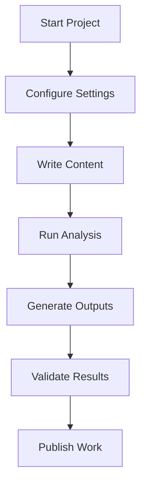

# Usage Guides Documentation

## Overview

The `docs/guides/` directory contains progressive usage guides organized by skill level and complexity. These guides provide practical, hands-on instructions for using the Research Project Template effectively.

## Directory Structure

```
docs/guides/
├── AGENTS.md                   # This technical documentation
├── TESTING_AND_REPRODUCIBILITY.md           # Testing and reproducibility patterns (Levels 7-9)
├── EXTENDING_AND_AUTOMATION.md             # Extending and automation techniques (Levels 10-12)
├── GETTING_STARTED.md          # Basic usage guide (Levels 1-3)
├── FIGURES_AND_ANALYSIS.md       # Figures and analysis (Levels 4-6)
├── README.md                   # Quick reference for guides
```

## Guide Organization

### Progressive Skill Levels

**Getting Started (Levels 1-3):**
- Basic template usage and setup
- Fundamental concepts and workflows
- Essential commands and procedures
- Simple project customization

**Intermediate Usage (Levels 4-6):**
- Advanced configuration options
- Custom analysis script development
- Multi-format output generation
- Basic extension and modification

**Advanced Usage (Levels 7-9):**
- Complex project architectures
- Advanced customization techniques
- Performance optimization
- Integration with external tools

**Expert Usage (Levels 10-12):**
- Template extension and modification
- Advanced architectural patterns
- Custom infrastructure development
- Large-scale project management

## Guide Content Standards

### Practical Focus

**Show, Don't Tell Philosophy:**
```bash
# Good: Complete working example
$ python3 scripts/03_render_pdf.py
INFO: Loading configuration from project/manuscript/config.yaml
INFO: Generating PDF with LaTeX rendering engine
INFO: PDF generated successfully: output/pdf/project_combined.pdf

# View results
open output/pdf/project_combined.pdf

# Expected output structure:
# output/
# ├── pdf/project_combined.pdf     (main manuscript)
# ├── pdf/01_abstract.pdf          (individual sections)
# ├── pdf/02_introduction.pdf
# └── pdf/03_methodology.pdf
```

**Avoid Theoretical Content:**
```markdown
<!-- Bad: Theoretical explanation -->
The system uses a two-layer architecture that separates infrastructure from project-specific code. This design enables reusability and maintainability.

<!-- Good: Practical demonstration -->
Create your first research project:

```bash
# 1. Set up project structure
mkdir my_research && cd my_research
cp -r /path/to/template/* .

# 2. Configure your project
vim project/manuscript/config.yaml

# 3. Write your research
vim project/manuscript/01_introduction.md

# 4. Generate outputs
python3 scripts/03_render_pdf.py
```
```

### Complete Examples

**Runnable Code Examples:**
```python
# Complete working example from GETTING_STARTED.md
from infrastructure.core import load_config

# Load your project configuration
config = load_config()

# Access configuration values
print(f"Project: {config.get('project_title', 'My Research')}")
print(f"Author: {config.get('author_name', 'Researcher')}")

# Output:
# Project: Novel Machine Learning Framework
# Author: Dr. Jane Smith
```

**Command Sequences:**
```bash
# Complete workflow from FIGURES_AND_ANALYSIS.md
# 1. Set up environment
python3 scripts/00_setup_environment.py

# 2. Run tests to ensure everything works
python3 scripts/01_run_tests.py

# 3. Execute your analysis
python3 scripts/02_run_analysis.py

# 4. Generate manuscript
python3 scripts/03_render_pdf.py

# 5. Validate outputs
python3 scripts/04_validate_output.py

# 6. Copy final deliverables
python3 scripts/05_copy_outputs.py
```

### Error Handling Examples

**Common Issues and Solutions:**
```bash
# Problem: PDF generation fails
$ python3 scripts/03_render_pdf.py
ERROR: LaTeX compilation failed

# Solution: Check LaTeX installation
$ which xelatex
/usr/local/bin/xelatex

# Install missing packages
$ sudo tlmgr install multirow cleveref doi

# Retry generation
$ python3 scripts/03_render_pdf.py
SUCCESS: PDF generated at output/pdf/project_combined.pdf
```

### Progressive Complexity

**Level-Appropriate Content:**

**Beginner (Getting Started):**
- Basic concepts only
- Step-by-step tutorials
- No assumptions about prior knowledge
- Complete command sequences

**Intermediate (Levels 4-6):**
- Configuration customization
- Basic scripting concepts
- Understanding of core architecture
- Simple extension patterns

**Advanced (Levels 7-9):**
- Complex configuration scenarios
- Custom module development
- Performance tuning
- External tool integration

**Expert (Levels 10-12):**
- Template modification
- Advanced architectural patterns
- Custom infrastructure components
- Large-scale deployment strategies

## Guide Maintenance

### Content Updates

**Regular Review Cycle:**
- Monthly review of all guides
- Update examples for new features
- Validate all command sequences
- Test examples in clean environments

**Version Synchronization:**
- Update guides with each major release
- Mark deprecated features
- Add migration guides for breaking changes
- Maintain backward compatibility examples

### Quality Assurance

**Example Validation:**
```bash
# Test all command examples
./validate_guide_examples.sh docs/guides/

# Check example output accuracy
python3 validate_examples.py docs/guides/GETTING_STARTED.md

# Lint markdown formatting
markdownlint docs/guides/*.md
```

**Cross-Reference Validation:**
- Ensure internal links work
- Verify external references are current
- Check related documentation links
- Validate API references

## Guide Structure Standards

### Standard Template

**Consistent Structure:**
```markdown
# Guide Title (Level X-Y)

> Brief description of what users will accomplish

## Prerequisites

What users need before starting:
- System requirements
- Prior knowledge
- Installed dependencies

## Step-by-Step Instructions

### Step 1: Initial Setup
Detailed instructions with examples.

### Step 2: Basic Configuration
Configuration options and examples.

### Step 3: Core Workflow
Main usage patterns.

## Common Issues

### Problem: Error Message
Solution with complete commands.

### Problem: Unexpected Behavior
Diagnosis and resolution steps.

## Next Steps

What to learn next:
- Related guides
- Advanced topics
- Further reading
```

### Visual Aids

**Diagrams and Flowcharts:**


**File Structure Illustrations:**
```
project/
├── manuscript/          # Your research content
│   ├── 01_abstract.md
│   ├── 02_introduction.md
│   └── config.yaml      # Project configuration
├── src/                 # Research algorithms
│   ├── analysis.py
│   └── visualization.py
└── scripts/             # Analysis workflows
    └── run_analysis.py
```

## Content Categories

### Setup and Configuration

**Environment Setup:**
- System requirements and installation
- Dependency management
- Environment configuration
- Initial project setup

**Project Configuration:**
- Configuration file management
- Environment variable usage
- Custom settings and options
- Configuration validation

### Content Creation

**Manuscript Writing:**
- Markdown formatting and structure
- Cross-referencing techniques
- Figure and table integration
- Citation management

**Analysis Development:**
- Script creation and organization
- Data processing workflows
- Visualization techniques
- Result validation

### Output Generation

**PDF Generation:**
- LaTeX compilation setup
- Formatting customization
- Error diagnosis and resolution
- Quality optimization

**Alternative Formats:**
- HTML generation and hosting
- Presentation slide creation
- Web publication options
- Format-specific customization

### Extension and Customization

**Project Extension:**
- Adding new analysis modules
- Custom script development
- Integration with external tools
- Workflow customization

**Template Modification:**
- Infrastructure extension
- Custom rendering engines
- Advanced configuration patterns
- Large-scale adaptations

## User Journey Mapping

### Beginner Journey

**Getting Started → Intermediate:**
1. **Installation and Setup** (Getting Started)
   - System requirements
   - Template installation
   - Basic project creation

2. **First Project** (Getting Started)
   - Content creation
   - Basic configuration
   - Output generation

3. **Customization** (Intermediate)
   - Advanced configuration
   - Custom analysis scripts
   - Output customization

### Advanced Journey

**Intermediate → Expert:**
1. **Complex Projects** (Advanced)
   - Multi-part manuscripts
   - Complex analysis workflows
   - Performance optimization

2. **Extension Development** (Advanced)
   - Custom module creation
   - External tool integration
   - Advanced customization

3. **Template Modification** (Expert)
   - Infrastructure extension
   - Architectural changes
   - Large-scale deployment

## Guide Metrics

### Usage Analytics

**Guide Effectiveness:**
- Time to complete guided tasks
- Success rates for examples
- Common failure points
- User feedback and ratings

**Content Quality:**
- Example accuracy and completeness
- Command success rates
- Link validity
- Update frequency compliance

### Continuous Improvement

**Feedback Integration:**
- User issue reports and questions
- Guide usage patterns
- Completion rate analysis
- A/B testing for improvements

**Content Evolution:**
- Feature update integration
- Technology stack updates
- Best practice incorporation
- Accessibility improvements

## Integration with Other Documentation

### Documentation Flow

**Guide Hierarchy:**
```
GETTING_STARTED.md → FIGURES_AND_ANALYSIS.md → TESTING_AND_REPRODUCIBILITY.md → EXTENDING_AND_AUTOMATION.md
       ↓                      ↓                       ↓                      ↓
   core/HOW_TO_USE.md → operational/ guides → development/ guides → architecture/
```

**Cross-References:**
- Link to detailed documentation
- Reference related guides
- Point to troubleshooting resources
- Connect to API documentation

### Content Synchronization

**Version Consistency:**
- Keep guides in sync with template versions
- Update examples for new features
- Maintain backward compatibility
- Archive outdated content appropriately

**Related Documentation Links:**
- [`../core/HOW_TO_USE.md`](../core/HOW_TO_USE.md) - Complete usage guide
- [`../operational/`](../operational/) - Operational procedures
- [`../reference/`](../reference/) - Reference materials
- [`../development/`](../development/) - Development guides

## See Also

**Guide Navigation:**
- [`GETTING_STARTED.md`](GETTING_STARTED.md) - Basic usage guide
- [`FIGURES_AND_ANALYSIS.md`](FIGURES_AND_ANALYSIS.md) - Intermediate features
- [`TESTING_AND_REPRODUCIBILITY.md`](TESTING_AND_REPRODUCIBILITY.md) - Advanced techniques
- [`EXTENDING_AND_AUTOMATION.md`](EXTENDING_AND_AUTOMATION.md) - Expert-level usage

**System Documentation:**
- [`../AGENTS.md`](../AGENTS.md) - Complete system overview
- [`../DOCUMENTATION_INDEX.md`](../DOCUMENTATION_INDEX.md) - Documentation index
- [`../../AGENTS.md`](../../AGENTS.md) - Root system documentation