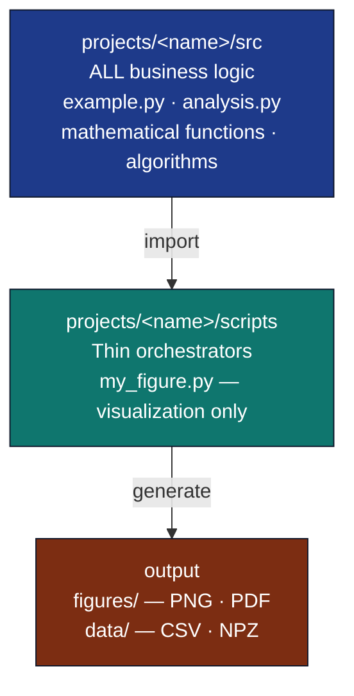
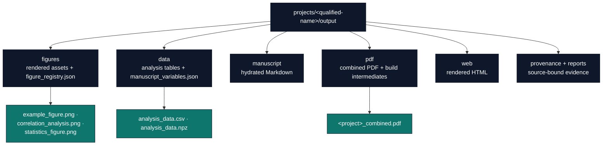

# 🔧 Figures and Analysis Guide

> **Add figures and automation** to your research project

**Previous**: [Getting Started](getting-started.md) (Levels 1-3) | **Next**: [Testing and Reproducibility](testing-and-reproducibility.md) (Levels 7-9)

This guide covers **Levels 4-6** of the Research Project Template for users ready to add custom figures, data analysis, and automated workflows. Examples use synthetic data; replace them with a documented, source-owned analysis contract before making empirical claims.

## 📚 What You'll Learn

By the end of this guide, you'll be able to:

- ✅ Generate figures from data using scripts
- ✅ Understand and apply the thin orchestrator pattern
- ✅ Add new Python modules with proper testing
- ✅ Create data analysis pipelines
- ✅ Automate workflows

**Estimated Time:** 1-2 days

## 🎯 Prerequisites

- Completed [Getting Started Guide](getting-started.md)
- Basic Python programming knowledge
- Understanding of matplotlib or similar visualization library
- Text editor configured for Python

## 📖 Table of Contents

- [Level 4: Add Basic Figures](#level-4-add-basic-figures)
- [Level 5: Basic Data Analysis](#level-5-basic-data-analysis)
- [Level 6: Automated Workflows](#level-6-automated-workflows)
- [What to Read Next](#what-to-read-next)

---

## Level 4: Add Basic Figures

**Goal**: Generate figures from data using the thin orchestrator pattern

**Time**: 3-4 hours

### Understanding the Thin Orchestrator Pattern

**Core Principle**: Scripts orchestrate, `projects/{name}/src/` implements.



**Why This Pattern?**

- **Maintainability**: Business logic in one place
- **Testability**: Test logic without visualization
- **Reusability**: Use same logic in multiple scripts
- **Clarity**: Clear separation of concerns

**See [thin-orchestrator-summary.md](../architecture/thin-orchestrator-summary.md) for details.**

### Using Existing Figure Scripts

The template includes example scripts:

```bash
# Run exemplar analysis script (figures + data under project output/)
uv run python projects/templates/template_code_project/scripts/optimization_analysis.py

# Or run all project scripts via the pipeline stage
uv run python scripts/pipeline/stage_02_analysis.py \
  --project templates/template_code_project
```

**What they demonstrate**:

- Importing from `projects/{name}/src/` modules
- Using tested methods for computation
- Handling only visualization and I/O
- Printing output paths for build system

### Anatomy of a Thin Orchestrator Script

```python
#!/usr/bin/env python3
"""Example demonstrating thin orchestrator pattern."""

import os
import matplotlib
matplotlib.use('Agg')  # Headless backend
import matplotlib.pyplot as plt

# IMPORT from src/ - never implement algorithms here.
# `example.py` (calculate_average/find_maximum/find_minimum) is an illustrative
# stand-in for an analysis module you add to src/; the statistics.py and
# correlation.py modules used later in this guide ARE built step by step below.
from projects.templates.template_code_project.src.example import calculate_average, find_maximum, find_minimum

def main():
    # Sample data
    data = [1.2, 2.3, 1.8, 3.4, 2.1]

    # USE src/ methods for computation - NEVER implement here
    avg = calculate_average(data)  # illustrative: src/example.py
    max_val = find_maximum(data)   # illustrative: src/example.py
    min_val = find_minimum(data)   # illustrative: src/example.py

    # Script ONLY handles visualization
    fig, ax = plt.subplots(figsize=(8, 6))
    ax.plot(data, marker='o', label='Data')
    ax.axhline(avg, color='r', linestyle='--', label=f'Average: {avg:.2f}')
    ax.axhline(max_val, color='g', linestyle=':', label=f'Max: {max_val:.2f}')
    ax.axhline(min_val, color='b', linestyle=':', label=f'Min: {min_val:.2f}')
    ax.legend()
    ax.set_title('Data Analysis')
    ax.set_xlabel('Index')
    ax.set_ylabel('Value')

    # Save output
    output_dir = 'projects/templates/template_code_project/output/figures'
    os.makedirs(output_dir, exist_ok=True)
    output_path = os.path.join(output_dir, 'my_analysis.png')
    fig.savefig(output_path, dpi=300, bbox_inches='tight')
    plt.close(fig)

    # Print path for build system manifest
    print(output_path)

if __name__ == '__main__':
    main()
```

**Key Points**:

1. ✅ **Import** from `projects/{name}/src/` - line 8
2. ✅ **Use** tested methods - lines 14-16
3. ✅ **Handle** visualization only - lines 18-28
4. ✅ **Save** to output directory - lines 30-34
5. ✅ **Print** path for manifest - line 37

### Creating Your Own Figure Script

**Step 1: Plan your figure**

- What data will you visualize?
- What computations are needed?
- What type of plot (line, scatter, bar, etc.)?

**Step 2: Ensure business logic exists in `projects/{name}/src/`**

If computation logic doesn't exist, add it to `projects/{name}/src/` first:

```python
# projects/templates/template_code_project/src/statistics.py
import math
from collections.abc import Sequence


def _validated(values: Sequence[float]) -> tuple[float, ...]:
    data = tuple(float(value) for value in values)
    if len(data) < 2:
        raise ValueError("sample statistics require at least two observations")
    if not all(math.isfinite(value) for value in data):
        raise ValueError("observations must be finite")
    return data


def calculate_mean(values: Sequence[float]) -> float:
    """Return the arithmetic mean of a validated sample."""
    data = _validated(values)
    return sum(data) / len(data)


def calculate_sample_variance(values: Sequence[float]) -> float:
    """Return variance with the sample denominator, n - 1."""
    data = _validated(values)
    mean = sum(data) / len(data)
    return sum((value - mean) ** 2 for value in data) / (len(data) - 1)


def calculate_sample_std_dev(values: Sequence[float]) -> float:
    """Return sample standard deviation."""
    return math.sqrt(calculate_sample_variance(values))
```

**Step 3: Create tests (coverage required)**

```python
# projects/templates/template_code_project/tests/test_statistics.py
import pytest

from projects.templates.template_code_project.src.statistics import (
    calculate_mean,
    calculate_sample_std_dev,
    calculate_sample_variance,
)

def test_calculate_sample_statistics():
    values = [1, 2, 3, 4, 5]
    assert calculate_mean(values) == pytest.approx(3.0)
    assert calculate_sample_variance(values) == pytest.approx(2.5)
    assert calculate_sample_std_dev(values) == pytest.approx(1.58113883)


@pytest.mark.parametrize("values", [[], [1.0], [1.0, float("nan")]])
def test_sample_statistics_reject_invalid_inputs(values):
    with pytest.raises(ValueError):
        calculate_sample_variance(values)
```

**Step 4: Run tests**

```bash
uv run pytest projects/templates/template_code_project/tests/test_statistics.py --cov=projects/templates/template_code_project/src --cov-report=term-missing
```

**Step 5: Create thin orchestrator script**

```python
# projects/templates/template_code_project/scripts/statistics_figure.py
#!/usr/bin/env python3
import os
import matplotlib
matplotlib.use('Agg')
import matplotlib.pyplot as plt
import numpy as np

from projects.templates.template_code_project.src.statistics import (
    calculate_mean,
    calculate_sample_std_dev,
)

def main():
    # Generate sample data
    rng = np.random.default_rng(42)
    data = rng.normal(0, 1, 100)

    # Use src/ method for computation
    mean = calculate_mean(data.tolist())
    sample_sd = calculate_sample_std_dev(data.tolist())

    # Script handles visualization only
    fig, ax = plt.subplots()
    ax.hist(data, bins=20, alpha=0.7, label='Data')
    ax.axvline(mean, color='black', label=f'Mean: {mean:.2f}')
    ax.axvline(mean + sample_sd, color='r', linestyle='--', label=f'Mean + SD: {mean + sample_sd:.2f}')
    ax.axvline(mean - sample_sd, color='r', linestyle='--', label=f'Mean - SD: {mean - sample_sd:.2f}')
    ax.legend()
    ax.set_title('Distribution with Standard Deviation')

    # Save
    output_path = 'projects/templates/template_code_project/output/figures/statistics_figure.png'
    os.makedirs(os.path.dirname(output_path), exist_ok=True)
    fig.savefig(output_path, dpi=300, bbox_inches='tight')
    plt.close(fig)

    # Print for manifest
    print(output_path)

if __name__ == '__main__':
    main()
```

**Step 6: Run script**

```bash
uv run python projects/templates/template_code_project/scripts/statistics_figure.py
```

**Step 7: Add to manuscript**

Use the portable Markdown figure form. The first bracketed sentence becomes the
visible caption and is also the current HTML renderer's source for a derived
`alt` attribute; store a separately authored `metadata.alt_text` in the figure
registry and inspect both rendered HTML and PDF.

```markdown
{#fig:statistics width=80%}
```

Generate the caption tokens from the same analysis record that produced the
figure. Do not hand-copy sample size, estimates, uncertainty, units, or model
settings into the manuscript. A statistical caption should also identify the
population/sample, interval or error-bar definition, and any exclusions or
transformations needed to interpret the panel.

### Common Figure Types

**Line Plot**:

```python
ax.plot(x_data, y_data, marker='o', label='Series')
```

**Scatter Plot**:

```python
ax.scatter(x_data, y_data, alpha=0.5)
```

**Bar Chart**:

```python
ax.bar(categories, values)
```

**Histogram**:

```python
ax.hist(data, bins=30, alpha=0.7)
```

**Subplots**:

```python
fig, (ax1, ax2) = plt.subplots(1, 2, figsize=(12, 5))
ax1.plot(x1, y1)
ax2.plot(x2, y2)
```

**See [matplotlib documentation](https://matplotlib.org/stable/gallery/index.html) for more examples.**

---

## Level 5: Basic Data Analysis

**Goal**: Add data analysis capabilities with proper testing

**Time**: 4-6 hours

### Extending Source Code

When adding new analysis capabilities:

1. **Design the API** - What functions do you need?
2. **Write tests first** (TDD) - Define expected behavior
3. **Implement in `projects/{name}/src/`** - Write the business logic
4. **Achieve required coverage** - Test all critical code paths (90% project, 60% infra)
5. **Use in scripts** - Create thin orchestrators

### Example: Correlation Analysis

**Step 1: Design API**

```python
# What do we need?
# - calculate_correlation(x, y) -> float
# - calculate_r_squared(x, y) -> float
# - linear_regression(x, y) -> (slope, intercept)
```

**Step 2: Write tests first**

```python
# projects/templates/template_code_project/tests/test_correlation.py
import pytest
from projects.templates.template_code_project.src.correlation import calculate_correlation, calculate_r_squared, linear_regression

def test_calculate_correlation_perfect():
    """Test positive correlation."""
    x = [1, 2, 3, 4, 5]
    y = [2, 4, 6, 8, 10]
    corr = calculate_correlation(x, y)
    assert abs(corr - 1.0) < 1e-10

def test_calculate_correlation_negative():
    """Test negative correlation."""
    x = [1, 2, 3, 4, 5]
    y = [10, 8, 6, 4, 2]
    corr = calculate_correlation(x, y)
    assert abs(corr - (-1.0)) < 1e-10

def test_calculate_r_squared():
    """Test R-squared calculation."""
    x = [1, 2, 3, 4, 5]
    y = [2, 4, 6, 8, 10]
    r2 = calculate_r_squared(x, y)
    assert abs(r2 - 1.0) < 1e-10

def test_linear_regression():
    """Test linear regression."""
    x = [1, 2, 3, 4, 5]
    y = [2, 4, 6, 8, 10]
    slope, intercept = linear_regression(x, y)
    assert abs(slope - 2.0) < 1e-10
    assert abs(intercept - 0.0) < 1e-10


@pytest.mark.parametrize(
    ("x", "y"),
    [([], []), ([1], [2]), ([1, 2], [1]), ([1, 1], [2, 3])],
)
def test_regression_rejects_undefined_inputs(x, y):
    with pytest.raises(ValueError):
        linear_regression(x, y)
```

**Step 3: Implement in `projects/{name}/src/`**

```python
# projects/templates/template_code_project/src/correlation.py
"""Correlation and simple-regression analysis functions."""

import math
from collections.abc import Sequence


def _validated_pair(
    x: Sequence[float], y: Sequence[float]
) -> tuple[tuple[float, ...], tuple[float, ...]]:
    x_values = tuple(float(value) for value in x)
    y_values = tuple(float(value) for value in y)
    if len(x_values) != len(y_values):
        raise ValueError("x and y must have equal lengths")
    if len(x_values) < 2:
        raise ValueError("at least two paired observations are required")
    if not all(math.isfinite(value) for value in (*x_values, *y_values)):
        raise ValueError("observations must be finite")
    return x_values, y_values

def calculate_correlation(x: Sequence[float], y: Sequence[float]) -> float:
    """Calculate Pearson correlation coefficient.

    Args:
        x: First variable
        y: Second variable

    Returns:
        Correlation coefficient between -1 and 1
    """
    x_values, y_values = _validated_pair(x, y)
    n = len(x_values)
    mean_x = sum(x_values) / n
    mean_y = sum(y_values) / n

    numerator = sum((x_values[i] - mean_x) * (y_values[i] - mean_y) for i in range(n))
    denominator_x = sum((value - mean_x) ** 2 for value in x_values) ** 0.5
    denominator_y = sum((value - mean_y) ** 2 for value in y_values) ** 0.5
    if denominator_x == 0 or denominator_y == 0:
        raise ValueError("correlation is undefined for a constant variable")

    return numerator / (denominator_x * denominator_y)

def calculate_r_squared(x: Sequence[float], y: Sequence[float]) -> float:
    """Return squared Pearson correlation for paired observations.

    Args:
        x: Independent variable
        y: Dependent variable

    Returns:
        R-squared value between 0 and 1
    """
    corr = calculate_correlation(x, y)
    return corr ** 2

def linear_regression(x: Sequence[float], y: Sequence[float]) -> tuple[float, float]:
    """Perform simple linear regression.

    Args:
        x: Independent variable
        y: Dependent variable

    Returns:
        Tuple of (slope, intercept)
    """
    x_values, y_values = _validated_pair(x, y)
    n = len(x_values)
    mean_x = sum(x_values) / n
    mean_y = sum(y_values) / n

    numerator = sum((x_values[i] - mean_x) * (y_values[i] - mean_y) for i in range(n))
    denominator = sum((value - mean_x) ** 2 for value in x_values)
    if denominator == 0:
        raise ValueError("regression is undefined when x is constant")

    slope = numerator / denominator
    intercept = mean_y - slope * mean_x

    return slope, intercept
```

**Step 4: Run tests**

```bash
uv run pytest projects/templates/template_code_project/tests/test_correlation.py --cov=projects/templates/template_code_project/src --cov-report=term-missing
```

Ensure coverage requirements are met before proceeding.

**Step 5: Use in scripts**

```python
# projects/templates/template_code_project/scripts/correlation_analysis.py
#!/usr/bin/env python3
import os
import matplotlib
matplotlib.use('Agg')
import matplotlib.pyplot as plt
import numpy as np

from projects.templates.template_code_project.src.correlation import calculate_correlation, linear_regression  # illustrative: from your project's src/

def main():
    # Generate sample data
    rng = np.random.default_rng(42)
    x = np.linspace(0, 10, 50)
    y = 2 * x + 1 + rng.normal(0, 1, 50)

    # Use projects/{name}/src/ methods for computation
    corr = calculate_correlation(x.tolist(), y.tolist())
    slope, intercept = linear_regression(x.tolist(), y.tolist())

    # Script handles visualization only
    fig, ax = plt.subplots(figsize=(8, 6))
    ax.scatter(x, y, alpha=0.5, label='Synthetic observations')
    ax.plot(x, slope * x + intercept, 'r-', label='Fitted line')
    ax.set_title('Illustrative simple linear regression')
    ax.set_xlabel('X')
    ax.set_ylabel('Y')
    ax.legend()
    ax.grid(True, alpha=0.3)

    # Save
    output_path = 'projects/templates/template_code_project/output/figures/correlation_analysis.png'
    os.makedirs(os.path.dirname(output_path), exist_ok=True)
    fig.savefig(output_path, dpi=300, bbox_inches='tight')
    plt.close(fig)

    # Print for manifest
    print(output_path)

if __name__ == '__main__':
    main()
```

### Saving Data Files

In addition to figures, save the exact analysis table and a machine-readable
summary containing the estimator definitions, sample size, units, exclusions,
seed/stream identity, configuration hash, input hash, and software revision.
The manuscript-variable producer and figure-caption producer should consume
that summary rather than recomputing or transcribing display values.

```python
import numpy as np
import csv

# Save as NPZ (NumPy compressed)
np.savez('projects/templates/template_code_project/output/data/analysis_data.npz',
         x=x, y=y, correlation=corr)

# Save as CSV (portable)
with open('projects/templates/template_code_project/output/data/analysis_data.csv', 'w', newline='') as f:
    writer = csv.writer(f)
    writer.writerow(['x', 'y'])
    writer.writerows(zip(x, y))

# Print both paths
print('projects/templates/template_code_project/output/data/analysis_data.npz')
print('projects/templates/template_code_project/output/data/analysis_data.csv')
```

---

## Level 6: Automated Workflows

**Goal**: Automate research workflows

**Time**: 2-3 hours

### Understanding the Build Pipeline

The pipeline orchestrator (`scripts/runner/execute_pipeline.py`) executes the
project's declared pipeline:

```bash
uv run python scripts/runner/execute_pipeline.py \
  --project <qualified-name> --core-only
```

Use a qualified name such as `templates/template_code_project` or
`working/<name>`. The repository/project `pipeline.yaml` is the ground truth for
stage selection and ordering. A normal core run covers setup, separate
infrastructure and project tests, analysis, manuscript hydration/rendering,
validation, and output copying; optional projects can declare additional
stages. Do not copy measured duration, test counts, or stage counts into prose.
Record them from the current run when they are relevant evidence.

For result-bearing work, keep the producer order explicit:

1. resolve and hash inputs/configuration;
2. run tested analysis and write data summaries/figure files;
3. write `manuscript_variables.json` and the figure registry from those outputs;
4. hydrate `output/manuscript/`;
5. render; and
6. validate the rendered artifacts and write provenance/release receipts.

**See [RUN_GUIDE.md](../RUN_GUIDE.md) for pipeline breakdown and stage reference.**

### Output Directory Structure



Runtime checkpoints, logs, and build intermediates are disposable. A public
exemplar may intentionally track deterministic final artifacts, figures,
analysis data, hydrated manuscript sources, and evidence registries. Follow the
project's output policy: never delete or hand-edit canonical evidence merely
because it lives under `output/`.

### Automating Your Workflow

**Basic workflow**:

```bash
# 1. Edit source code
vim projects/<subfolder>/<name>/src/my_module.py

# 2. Write tests
vim projects/templates/template_code_project/tests/test_my_module.py

# 3. Run tests
uv run pytest projects/templates/template_code_project/tests/test_my_module.py --cov=projects/templates/template_code_project/src

# 4. Create/update script
vim projects/templates/template_code_project/scripts/my_figure.py

# 5. Run build
uv run python scripts/runner/execute_pipeline.py \
  --project <qualified-name> --core-only

# 6. View result (top-level output after copy outputs)
open output/templates/template_code_project/pdf/template_code_project_combined.pdf
```

**Advanced workflow with validation**:

```bash
# 1. Full rebuild with validation (recommended declared core selection)
uv run python scripts/runner/execute_pipeline.py \
  --project <qualified-name> --core-only

# Or use unified interactive menu
./run.sh

# Focused, source-current manuscript preflight
uv run python -m infrastructure.validation.cli prerender \
  projects/<subfolder>/<name>/manuscript --repo-root .
uv run python scripts/pipeline/stage_04_validate.py \
  --project <qualified-name>
```

### Creating Custom Build Entry Points

Keep a custom entry point thin: select a project/stage and delegate to the
canonical Python orchestration APIs or stage commands. Do not bypass hydration,
Pandoc filters, reference processing, provenance, or validation with a raw
one-file `pandoc` command and then call that artifact publishable. For a focused
rebuild, use declared stages:

```bash
uv run python scripts/runner/execute_pipeline.py \
  --project <qualified-name> --stage analysis
uv run python scripts/runner/execute_pipeline.py \
  --project <qualified-name> --stage render_pdf
uv run python scripts/runner/execute_pipeline.py \
  --project <qualified-name> --stage validate
```

### Batch Processing Multiple Datasets

The following is an architectural sketch, not a drop-in script: implement and
test `load_data`, `generate_figure`, and `save_results_table` in the project's
`src/` package, then keep the entry point limited to path resolution and calls.
Record per-dataset inclusion/exclusion decisions and do not silently omit a
failed dataset from the reported denominator.

```python
# scripts/batch_analysis.py
#!/usr/bin/env python3
import os
from correlation import calculate_correlation, linear_regression

def process_dataset(filename):
    """Process single dataset."""
    # Load data
    data = load_data(filename)  # Implement as needed

    # Use src/ methods
    corr = calculate_correlation(data['x'], data['y'])
    slope, intercept = linear_regression(data['x'], data['y'])

    # Generate figure
    generate_figure(data, corr, slope, intercept, filename)

    return corr, slope, intercept

def main():
    datasets = ['data1.csv', 'data2.csv', 'data3.csv']
    results = {}

    for dataset in datasets:
        print(f"Processing {dataset}...")
        results[dataset] = process_dataset(dataset)

    # Save summary
    save_results_table(results)

if __name__ == '__main__':
    main()
```

---

## Troubleshooting

### Figure Generation Fails

**Symptom**: Script runs but no figure appears

**Check**:
- Ensure output directory exists: `os.makedirs(output_dir, exist_ok=True)`
- Verify matplotlib backend is set: `matplotlib.use('Agg')`
- Check file permissions on output directory

**Solution**:
```python
import os
output_dir = 'projects/templates/template_code_project/output/figures'
os.makedirs(output_dir, exist_ok=True)  # Create if missing
fig.savefig(os.path.join(output_dir, 'figure.png'), dpi=300)
```

### Import Errors in Scripts

**Symptom**: `ModuleNotFoundError: No module named 'projects.templates.template_code_project.src'`

**Cause**: Script run outside of project context

**Solution**: Use `uv run` to ensure proper Python path:
```bash
uv run python projects/templates/template_code_project/scripts/my_figure.py
```

### Matplotlib Display Errors

**Symptom**: `RuntimeError: Invalid DISPLAY` or hangs on `plt.show()`

**Solution**:
```python
import matplotlib
matplotlib.use('Agg')  # Must be BEFORE pyplot import
import matplotlib.pyplot as plt
```

Also set in environment:
```bash
export MPLBACKEND=Agg
```

### Cross-Reference Shows ?? in PDF

**Symptom**: Figure reference shows as `??` in compiled PDF

**Cause**: The manuscript label/reference is missing or mismatched, the figure
registry lacks that exact label, or the Pandoc cross-reference pass did not run.
Registering metadata alone does not insert a label into manuscript Markdown.

**Solution**:
```markdown
{#fig:my-figure}

As shown in [@fig:my-figure], ...
```

Use the identical `fig:my-figure` label in the generated figure registry, then
run both checks:

```bash
uv run python -m infrastructure.validation.cli prerender \
  projects/<subfolder>/<name>/manuscript --repo-root .
uv run python -m infrastructure.validation.cli publication-audit \
  --project <qualified-name> --rendered --strict \
  --require-figure-accessibility --format markdown
```

### Data File Not Found

**Symptom**: `FileNotFoundError: data.csv`

**Solution**: Use absolute paths with project root:
```python
from pathlib import Path
PROJECT_ROOT = Path(__file__).resolve().parents[1]
data_path = PROJECT_ROOT / "data" / "data.csv"
```

---

## Quick Tips

### Performance Optimization

1. **Cache expensive computations**

```python
import functools

@functools.lru_cache(maxsize=None)
def expensive_calculation(x):
    # Computation here
    return result
```

1. **Use vectorized operations** (NumPy)

```python
# Slow
result = [x**2 for x in data]

# Fast
result = np.array(data) ** 2
```

1. **Parallel processing** (when appropriate)

```python
from multiprocessing import Pool

with Pool() as pool:
    results = pool.map(process_dataset, datasets)
```

### Common Mistakes to Avoid

| Mistake | Problem | Solution |
|---------|---------|----------|
| **Implementing logic in scripts** | Not testable, duplicated code | Move to `projects/{name}/src/`, test thoroughly |
| **Not testing edge cases** | Fails on data | Test empty lists, single values, etc. |
| **Hardcoded paths** | Breaks on other systems | Use `os.path.join()`, relative paths |
| **Resetting global RNG state** | Hidden coupling between tests/analyses | Pass a `numpy.random.Generator` or an explicit seed into tested source code |
| **Hand-copying statistics into captions** | Figure and prose drift | Generate caption tokens/registry metadata from the analysis summary |
| **Treating caption as alt text** | Inadequate nonvisual description | Author registry `metadata.alt_text`, add a long description when needed, and inspect rendered outputs |
| **Ignoring coverage gaps** | Untested code paths | Check `--cov-report=term-missing` |

### Best Practices

1. ✅ **Always import from `projects/{name}/src/`** - Never implement algorithms in scripts
2. ✅ **Test before scripting** - Ensure `projects/{name}/src/` code works first
3. ✅ **Use descriptive names** - `calculate_correlation` not `calc_corr`
4. ✅ **Add docstrings** - Document parameters and return values
5. ✅ **Pass explicit RNG state** - Record seed, stream, generator, and software environment
6. ✅ **Save figures, data, and estimand metadata** - Enable independent interpretation
7. ✅ **Generate captions and variables from the same summary** - Prevent transcription drift
8. ✅ **Register caption, provenance, and distinct alt text** - Validate and inspect accessibility
9. ✅ **Print output paths** - Let orchestration collect produced artifacts

### Infrastructure Tools for Figures

The infrastructure layer provides utilities that automate figure management:

```python
from infrastructure.documentation import FigureManager

# Register figure metadata at the project-owned path. The manuscript still
# needs a matching {#fig:convergence} label.
manager = FigureManager(
    registry_file="projects/templates/template_code_project/output/figures/figure_registry.json"
)
manager.register_figure(
    filename="convergence.png",
    caption="Objective value across recorded optimization iterations.",
    label="fig:convergence",
    generated_by="projects.templates.template_code_project.src.analysis.generate",
    metadata={
        "alt_text": "Line chart of objective value by iteration for each configured method.",
        "source": "analysis summary identifier or hash",
    },
)
```

For a pipeline-generated set, prefer
`infrastructure.documentation.publish_generated_figures`: it validates the
declared filenames before mirroring files and atomically writing the envelope
registry. The accessibility gate checks that alt text is present; a human must
still judge whether the text conveys the figure's purpose and salient pattern.

For performance measurement of your analysis code:

```python
from infrastructure.scientific import benchmark_function

result = benchmark_function(my_analysis_func, test_inputs=[data1, data2], iterations=50)
print(f"Observed execution time: {result.execution_time:.4f}s")
```

Wall-clock benchmarks are environment-dependent. Record hardware, software,
warm-up, repetitions, aggregation, and uncertainty; do not promote one local
observation into a general performance claim.

See the [Documentation Module Guide](../modules/guides/documentation-module.md) and [Scientific Module Guide](../modules/guides/scientific-module.md) for full API details.

---

## What to Read Next

### If you're ready to

**Learn test-driven development**
→ Read **[Testing and Reproducibility Guide](../guides/testing-and-reproducibility.md)** (Levels 7-9)

**Build custom architectures**
→ Read **[Extending and Automation Guide](../guides/extending-and-automation.md)** (Levels 10-12)

**Understand the architecture deeply**
→ Read **[Architecture Guide](../core/architecture.md)**

**See the thin orchestrator pattern in detail**
→ Read **[Thin Orchestrator Summary](../architecture/thin-orchestrator-summary.md)**

**Find specific workflows**
→ Read **[Common Workflows](../reference/common-workflows.md)**

### Related Documentation

- **[Quick Start Cheatsheet](../reference/quick-start-cheatsheet.md)** - Essential commands
- **[Glossary](../reference/glossary.md)** - Terms and definitions
- **[Pipeline Orchestration](../RUN_GUIDE.md)** - pipeline stages and commands
- **[Examples Showcase](../usage/examples-showcase.md)** - Real-world applications
- **[Documentation Index](../documentation-index.md)** - reference

---

## Success Checklist

After completing this guide, you should be able to:

- [x] Generate custom figures using thin orchestrator pattern
- [x] Add new analysis modules to `projects/{name}/src/` with tests
- [x] Achieve required test coverage for new code
- [x] Save both figures and data files
- [x] Generate manuscript variables, captions, and registry metadata from analysis outputs
- [x] Report statistical definitions, units, denominators, exclusions, and uncertainty
- [x] Author separate caption and alt text and inspect rendered HTML/PDF
- [x] Run automated build pipelines
- [x] Create custom build scripts for specific workflows

**Congratulations!** You've mastered figures and analysis. Ready for test-driven development? Check out **[Testing and Reproducibility](../guides/testing-and-reproducibility.md)**.

---

**Need help?** Check the **[FAQ](../reference/faq.md)** or **[Common Workflows](../reference/common-workflows.md)**

**Quick Reference**: [Cheatsheet](../reference/quick-start-cheatsheet.md) | [Glossary](../reference/glossary.md)
