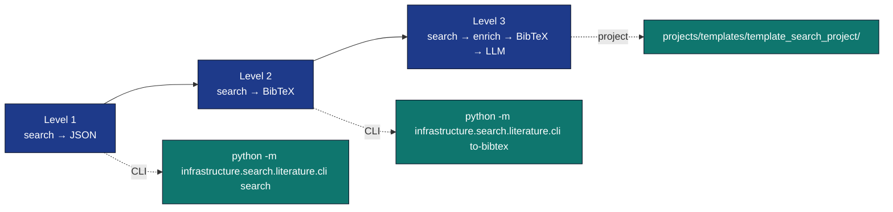

# Literature Workflow Guide

This guide walks through three increasingly complete uses of the
literature-search and reference modules. By the end you will have a working
pipeline that turns a topic string into a populated `references.bib`,
cached abstracts/PDFs, and an LLM-summarised reading report.




## 0. Prerequisites

```bash
uv sync                                    # base infrastructure
uv sync --group rendering                  # adds pypdf for full-text extraction
ollama serve & ollama pull gemma3:4b       # only needed for the LLM step
```

## 1. Quick search → JSON

```bash
uv run python -m infrastructure.search.literature.cli search \
    "Bayesian neural network calibration" \
    --source arxiv,crossref \
    --max-results 10 \
    --output output/search/calibration.json
```

The output is a `SearchResult` JSON (`{query, papers, per_source_counts,
errors}`). The `errors` key tells you whether any backend was unreachable;
the search itself never throws on transient failure.

Pass `--cache-dir output/search/cache` once and subsequent identical
queries become deterministic file reads — important for CI.

## 2. Search → BibTeX

```bash
uv run python -m infrastructure.search.literature.cli to-bibtex \
    "Bayesian neural network calibration" \
    --source arxiv,crossref \
    --max-results 25 \
    --output projects/my_project/manuscript/references.bib
```

The emitted file is byte-compatible with the exemplar
[`projects/templates/template_code_project/manuscript/references.bib`](../../projects/templates/template_code_project/manuscript/references.bib),
so Pandoc with `--natbib` picks it up unchanged.

## 3. Search → Enriched Corpus → LLM Synthesis

```python
from pathlib import Path
from infrastructure.search.literature import (
    LiteratureClient, SearchQuery, ArxivBackend, CrossrefBackend,
    AbstractFetcher, FulltextFetcher, write_corpus,
)
from infrastructure.reference.citation import paper_to_bibentry, write_bibfile
from infrastructure.reference.citation.models import BibDatabase
from infrastructure.llm import LLMClient, OllamaClientConfig

OUT = Path("output/literature_demo")
OUT.mkdir(parents=True, exist_ok=True)

# Discover.
client = LiteratureClient([
    ArxivBackend(),
    CrossrefBackend(mailto="you@example.org"),
])
result = client.search(
    SearchQuery(text="Bayesian neural network calibration", max_results=20)
)

# Enrich (real fetches, cached on disk; no mocks).
abstracts = AbstractFetcher(cache_dir=OUT / "cache" / "abs")
fulltext = FulltextFetcher(cache_dir=OUT / "cache" / "pdf")
for paper in result.papers:
    abstracts.fetch(paper)
    fulltext.fetch(paper)

# Persist a curated corpus + BibTeX.
write_corpus(result.papers, OUT / "corpus.json")
db = BibDatabase()
for paper in result.papers:
    db.add(paper_to_bibentry(paper))
write_bibfile(OUT / "references.bib", db)

# Synthesise with Ollama.
llm = LLMClient(OllamaClientConfig(default_model="gemma3:4b"))
joined = "\n\n".join(
    f"### {p.title}\n{p.abstract or ''}" for p in result.papers if p.abstract
)
prompt = (
    "You are a literature analyst. Summarise the key methods, common "
    "assumptions, and disagreements across the following abstracts.\n\n"
    + joined
)
report = llm.query(prompt)  # LLMClient.query(prompt) -> str
(OUT / "synthesis.md").write_text(report, encoding="utf-8")
```

## Reproducibility

Three knobs make this workflow deterministic in CI:

1. **Cache the search.** `SearchCache` keys on `(text, max_results, year_*,
   sorted(sources))`; commit `output/cache/search_*.json` for stable replay.
2. **Cache enrichment.** `AbstractFetcher(cache_dir=...)` and
   `FulltextFetcher(cache_dir=...)` write `.txt` / `.pdf` per paper id.
3. **Pin the LLM seed.** `OllamaClientConfig(seed=42)` ensures the
   synthesis step replays identically (within Ollama's determinism limits).

## Rate Limits

* **Crossref** — pass `mailto=` for the polite pool; otherwise occasional 429s.
* **arXiv** — soft cap ≈ 1 query/3 s; cache aggressively.
* **Paperclip** — paid; never enabled by default. Set `PAPERCLIP_API_KEY` to
  opt in.

## See Also

* [`docs/modules/literature-search-and-references.md`](../modules/literature-search-and-references.md) — module reference.
* [`projects/templates/template_search_project/`](../../projects/templates/template_search_project/) — fully wired exemplar project.
* [`docs/development/no-mocks-http-testing.md`](../development/no-mocks-http-testing.md) — testing conventions.
