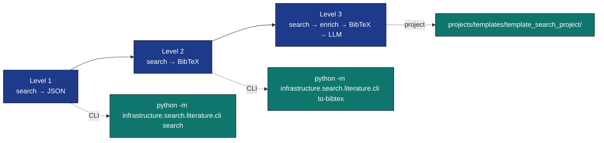

# Literature Workflow Guide

This guide walks through three increasingly complete uses of the
literature-search and reference modules. By the end you will have a working
pipeline that turns a topic string into a candidate corpus, a curated
`references.bib`, cached retrieval material, and an LLM-assisted reading report.
Discovery output and synthesis are inputs to scholarly review, not evidence of
search completeness or support for manuscript claims.


```mermaid
flowchart LR
    LV1[Level 1<br/>search → JSON] --> LV2[Level 2<br/>search → BibTeX]
    LV2 --> LV3[Level 3<br/>search → enrich → BibTeX → LLM]
    LV1 -. CLI .-> CLI1[python -m infrastructure.search.literature.cli search]
    LV2 -. CLI .-> CLI2[python -m infrastructure.search.literature.cli to-bibtex]
    LV3 -. project .-> PROJ[projects/templates/template_search_project/]

    classDef level fill:#1e3a8a,stroke:#0f172a,color:#fff
    classDef tool fill:#0f766e,stroke:#0f172a,color:#fff
    class LV1,LV2,LV3 level
    class CLI1,CLI2,PROJ tool
```


## 0. Prerequisites

```bash
uv sync                                    # base infrastructure
uv sync --group rendering                  # adds pypdf for full-text extraction
ollama serve & ollama pull gemma3:4b       # only needed for the LLM step
```

## 1. Quick search → JSON

```bash
uv run python -m infrastructure.search.literature.cli search \
    "Bayesian neural network calibration" \
    --source arxiv,crossref \
    --max-results 10 \
    --output output/search/calibration.json
```

The output is a `SearchResult` JSON (`{query, papers, per_source_counts,
errors}`). The `errors` key tells you whether any backend was unreachable. The
client isolates per-backend failures; the CLI exits non-zero when errors are
present unless `--tolerate-errors` is explicitly supplied. Preserve that
failure in a review ledger rather than treating partial results as complete.

Pass `--cache-dir output/search/cache` once and subsequent identical
queries become deterministic file reads — important for CI.

## 2. Search → BibTeX

```bash
uv run python -m infrastructure.search.literature.cli to-bibtex \
    "Bayesian neural network calibration" \
    --source arxiv,crossref \
    --max-results 25 \
    --output projects/my_project/manuscript/references.bib
```

The emitted file is byte-compatible with the exemplar
[`projects/templates/template_code_project/manuscript/references.bib`](../../projects/templates/template_code_project/manuscript/references.bib),
so Pandoc with `--natbib` picks it up unchanged.

## 3. Search → Enriched Corpus → LLM Synthesis

```python
from pathlib import Path
from infrastructure.search.literature import (
    LiteratureClient, SearchQuery, ArxivBackend, CrossrefBackend,
    AbstractFetcher, FulltextFetcher, write_corpus,
)
from infrastructure.reference.citation import paper_to_bibentry, write_bibfile
from infrastructure.reference.citation.models import BibDatabase
from infrastructure.llm import LLMClient, OllamaClientConfig

OUT = Path("output/literature_demo")
OUT.mkdir(parents=True, exist_ok=True)

# Discover.
client = LiteratureClient([
    ArxivBackend(),
    CrossrefBackend(mailto="you@example.org"),
])
result = client.search(
    SearchQuery(text="Bayesian neural network calibration", max_results=20)
)

# Enrich (real fetches, cached on disk; no mocks).
abstracts = AbstractFetcher(cache_dir=OUT / "cache" / "abs")
fulltext = FulltextFetcher(cache_dir=OUT / "cache" / "pdf")
for paper in result.papers:
    abstracts.fetch(paper)
    fulltext.fetch(paper)

# Persist candidate records; curate and verify them before manuscript use.
write_corpus(result.papers, OUT / "corpus.json")
db = BibDatabase()
for paper in result.papers:
    db.add(paper_to_bibentry(paper))
write_bibfile(OUT / "references.bib", db)

# Synthesise with Ollama.
llm = LLMClient(OllamaClientConfig(default_model="gemma3:4b"))
joined = "\n\n".join(
    f"### {p.title}\n{p.abstract or ''}" for p in result.papers if p.abstract
)
prompt = (
    "You are a literature analyst. Summarise the key methods, common "
    "assumptions, and disagreements across the following abstracts.\n\n"
    + joined
)
report = llm.query(prompt)  # LLMClient.query(prompt) -> str
(OUT / "synthesis.md").write_text(report, encoding="utf-8")
```

Record the query, backend set, retrieval date, filters, per-source errors,
deduplication rule, screening decisions, model identity, prompt, parameters,
and input/output hashes. The LLM report is a derived annotation: every factual
or comparative statement promoted into the manuscript must be checked against
the primary source, and disagreements, null results, and exclusions must remain
visible.

Validate the curated bibliography and then verify indexed existence/metadata:

```bash
uv run python -m infrastructure.reference.citation.cli validate \
  projects/<qualified-name>/manuscript/references.bib --strict
uv run python -m infrastructure.reference.verification verify \
  projects/<qualified-name>/manuscript/references.bib \
  --live --as-of-year <manuscript-year>
```

`unchecked` or `unverifiable` is not a pass. Index resolution still does not
prove that a source supports an adjacent claim or replace manual correction,
expression-of-concern, and retraction checks.

## Reproducibility

Three knobs make this workflow deterministic in CI:

1. **Cache the search.** `SearchCache` keys on `(text, max_results, year_*,
   sorted(sources))`; treat `output/**/cache/` as ignored runtime state. For a
   citable replay, promote the reviewed records to a tracked, project-owned
   corpus (for example `data/curated_corpus.json`) and use `LocalBackend`.
2. **Cache enrichment.** `AbstractFetcher(cache_dir=...)` and
   `FulltextFetcher(cache_dir=...)` write `.txt` / `.pdf` per paper id.
3. **Control and measure the LLM step.** `OllamaClientConfig(seed=42,
   temperature=0.0)` reduces variation but does not guarantee identical output
   across model/runtime versions or hardware. Record the environment and
   compare two runs before making a reproducibility claim.

## Rate Limits

* **Crossref** — pass a monitored `mailto=` contact and obey current service
  guidance; handle 429 responses explicitly.
* **arXiv** — obey current API guidance, back off when throttled, and cache
  repeated requests.
* **Paperclip** — paid; never enabled by default. Set `PAPERCLIP_API_KEY` to
  opt in.

## See Also

* [`docs/modules/literature-search-and-references.md`](../modules/literature-search-and-references.md) — module reference.
* [`projects/templates/template_search_project/`](../../projects/templates/template_search_project/) — fully wired exemplar project.
* [`docs/development/no-mocks-http-testing.md`](../development/no-mocks-http-testing.md) — testing conventions.
