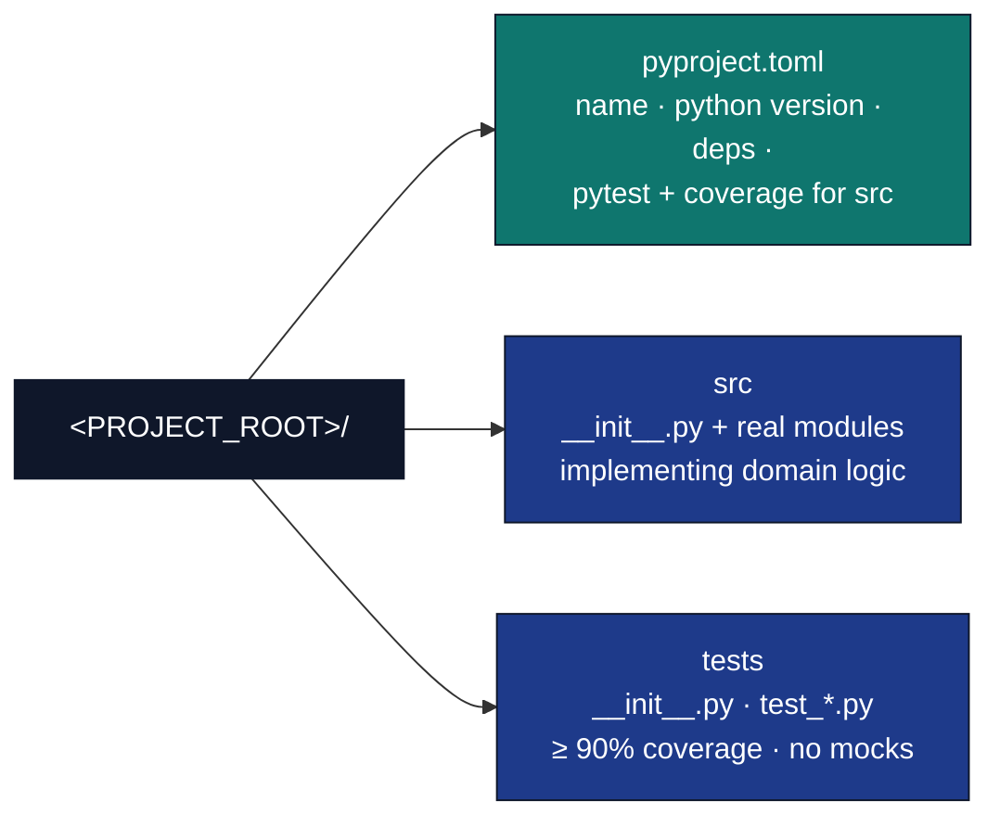

# One-shot LLM prompt: new qualified project

Use this prompt when you want a model to scaffold a full project in one pass. Anchor layout and conventions on the control-positive exemplar [`projects/templates/template_code_project/`](../../projects/templates/template_code_project/).

**Checklist and pitfalls:** [new-project-setup.md](new-project-setup.md)

**Other active workspaces** (alternate packaging or manuscript depth) live under `projects/`; names are listed in [_generated/active_projects.md](../_generated/active_projects.md). Do not copy that list into this prompt—inspect those trees in the repo if you need a second reference.

## Positive control (read or attach in your IDE)

| Control | Path | Role |
| -------- | ----- | ----- |
| A | [projects/templates/template_code_project](../../projects/templates/template_code_project/) | Flat `src/` modules, `scripts/` orchestrators, standard manuscript sections, reproducible figures/data, `tests/` layout |

## Prompt (copy from below into your assistant)

````text
You are working inside the docxology/template monorepo. Scaffold a project at <PROJECT_ROOT> with qualified name <QUALIFIED_PROJECT>. For a deliberately public, reusable exemplar, use PROJECT_ROOT=projects/templates/<PROJECT_SLUG> and QUALIFIED_PROJECT=templates/<PROJECT_SLUG>. Private research belongs in the configured external sidecar (normally working/<PROJECT_SLUG>) and is linked into projects/working/<PROJECT_SLUG>; never add that local mirror to git. Match the shape and discipline of projects/templates/template_code_project/: flat src modules, thin analysis orchestrators, source-bound manuscript hydration, reproducible figures/data, tests with conftest path and MPLBACKEND=Agg if using matplotlib, at least 90% coverage on <PROJECT_ROOT>/src, and no prohibited mock framework.

Required layout (must exist):



Strongly recommended (match the exemplar):

- scripts/ — thin orchestrators only: import from src, write outputs under <PROJECT_ROOT>/output/, print paths for manifests where applicable.
- manuscript/ — config.yaml, preamble.md, references.bib, ordered *.md sections.
- docs/ — small hub (architecture, testing notes) if non-obvious.
- Root AGENTS.md for the project + README.md where helpful; subdirectory AGENTS.md/README.md only where the exemplar does.

Rules:

1. No unittest.mock, MagicMock, or pytest monkeypatch of domain code — use real data, temp files, subprocess, or pytest-httpserver for HTTP.
2. Coverage: configure tool.coverage.run and fail_under in pyproject.toml like the exemplar; exercise all new src lines.
3. Imports: use from src... in scripts/tests as in template_code_project; infrastructure imports allowed; never import another projects/* package.
4. Reproducibility: pass explicit local RNG state; record seed, stream/generator, inputs, config, environment, and comparison tolerance. A seed alone is not a reproducibility claim. Use headless plotting (MPLBACKEND=Agg) where relevant.
5. Naming: <PROJECT_SLUG> is lowercase snake_case; package name in pyproject.toml aligns with repo conventions.
6. Decision memory: follow docs/rules/memory_and_decision_records.md. Use `WHY:` comments only for counterintuitive local choices, project TODO/ISA notes for active plans, generated docs for volatile counts/rosters, and negative-control tests for verifier-like gates.
7. Dynamic manuscript values: every computed count, estimate, uncertainty, percentage, benchmark, date/version, table cell, and result-bearing caption fragment must be generated from typed source outputs. Implement src/manuscript_variables.py plus scripts/z_generate_manuscript_variables.py; write output/data/manuscript_variables.json and hydrate output/manuscript. Use uppercase {{TOKEN_NAME}} placeholders in authored Markdown. Add a completeness test and fail when source outputs or tokens are missing; do not silently substitute plausible values.
8. Figures: generate each figure and its visible caption from the same analysis summary. Write output/figures/figure_registry.json with stable label, filename, caption, generated_by, source metadata, and separately authored metadata.alt_text. Use color-independent encodings, units, uncertainty/error-bar definitions, and long descriptions for complex figures. Inspect rendered HTML and PDF; registry presence is not an adequacy review.
9. Statistics: define population/sample, estimand, estimator, denominator, exclusions, missing-data policy, transformations, multiplicity handling, interval/error-bar meaning, software/model version, and uncertainty. Preserve missing, unavailable, excluded, not-run, and zero as distinct states. Keep exploratory, confirmatory, simulation, and benchmark claims separate.
10. Scholarship: cite primary sources adjacent to externally supported claims, keep citation keys resolvable, and verify that each source actually supports the bounded wording. Identifier resolution does not prove claim support or correction/retraction status. Never invent citations, DOIs, findings, novelty, or consensus.
11. Provenance order: inputs/config -> tests/analysis -> tables/figures -> manuscript variables/figure registry -> hydrated manuscript -> rendered artifacts -> validation/provenance/release receipts. Fix producers and regenerate; never hand-edit downstream evidence to clear a gate.

One-shot deliverables (do all in one pass):

1. Full directory tree and files for <PROJECT_ROOT>/ as above.
2. Minimal but real domain implementation in src/ (not stubs), with typed public APIs and logging via infrastructure.core.logging.utils.get_logger where appropriate.
3. Tests that prove core behavior and meet coverage.
4. At least one scripts/*.py orchestrator if the manuscript or pipeline expects figures/data (optional if the idea is purely non-computational — state that explicitly in the manuscript and skip scripts).
5. Manuscript markdown + config.yaml metadata (title and author placeholders are acceptable only when conspicuously labelled), a variables producer, source-bound captions/tables, bibliography, and figure accessibility/provenance records coherent with the code and tests.
6. Tests for scientific/statistical edge cases, manuscript-token completeness, figure-registry/file agreement, deterministic replay at the declared tolerance, and negative controls for every new validator.
7. Short note in project README.md with these exact qualified commands: uv run pytest <PROJECT_ROOT>/tests/ --cov=<PROJECT_ROOT>/src --cov-fail-under=90; uv run python scripts/pipeline/stage_01_test.py --project <QUALIFIED_PROJECT>; uv run python scripts/pipeline/stage_02_analysis.py --project <QUALIFIED_PROJECT>; and the pre-render, evidence, and publication-audit commands from docs/guides/new-project-setup.md.
8. A final claim-evidence inventory: each intended manuscript claim, its source artifact/citation, limitations, status, and the producer/test/gate that protects it. Mark unavailable evidence as blocked; do not fill gaps with model inference.

Project idea — append only below this line (do not edit text above):

<PASTE THE CONTRIBUTOR'S PROJECT IDEA HERE: 1–3 sentences on topic, intended claims/artifacts, and any constraints.>
````

## After pasting

1. Replace `<PROJECT_SLUG>`, `<PROJECT_ROOT>`, and `<QUALIFIED_PROJECT>`. Choose a public template path only when the project is intentionally safe and reusable as open-source exemplar material.
2. Append the contributor’s idea in the last line only.
3. Run the checklist in [new-project-setup.md](new-project-setup.md) before relying on the full pipeline (root venv deps, matplotlib in core deps if needed, and so on).
