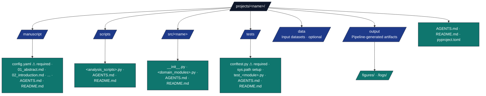

# New Project Setup Checklist

Complete checklist for creating a new project workspace in the Docxology Template. Lessons are framed around folder patterns and the stable exemplar [`projects/templates/template_code_project/`](../../projects/templates/template_code_project/).

For a copy-paste LLM scaffold anchored on that exemplar, see [new-project-one-shot-prompt.md](new-project-one-shot-prompt.md). Other active layouts under `projects/` are listed in [_generated/active_projects.md](../_generated/active_projects.md). For archived reference trees (not run by default), see `projects/archive/`.

> **Key Principle**: A project is auto-discovered when it is under
> `projects/`, has `src/` with at least one Python file, and has `tests/`.
> `manuscript/config.yaml` supplies metadata and render settings; it is not
> the discovery predicate by itself. No infrastructure changes are needed for a
> structurally valid project.
>
> **3-Directory Lifecycle**: Projects live in one of three directories: `projects/` (active, rendered by `./run.sh`), `projects/working/` (WIP, not auto-discovered), or `projects/archive/` (completed/paused, not auto-discovered). Move projects freely between directories; only what is in `projects/` is rendered.

---

## Troubleshooting

### Project Not Discovered

**Symptom**: Project doesn't appear in `./run.sh` menu

**Cause**: The project is outside `projects/`, lacks `src/`, lacks `tests/`,
or has no Python files under `src/`. Missing `manuscript/config.yaml` does not
prevent low-level discovery, but it leaves metadata and render configuration
incomplete for normal pipeline use.

**Solution**: Put the project under `projects/<name>/`, create `src/` and
`tests/`, add at least one `.py` file under `src/`, and add
`manuscript/config.yaml` before rendering.

### Test Import Errors

**Symptom**: `ModuleNotFoundError: No module named '<package>'`

**Cause**: Missing or incorrect `tests/conftest.py`

**Solution**:
```python
import os
import sys
os.environ.setdefault("MPLBACKEND", "Agg")
ROOT = os.path.abspath(os.path.join(os.path.dirname(__file__), ".."))
SRC = os.path.join(ROOT, "src")
if SRC not in sys.path:
    sys.path.insert(0, SRC)
```

### Stage 4 Fails Silently

**Symptom**: `4 stages, <2s` - Analysis stage fails immediately

**Cause**: Project-specific packages missing from root venv

**Diagnosis & Fix**:
```bash
# Check which packages are missing
.venv/bin/python -c "import scipy"  # Replace with your package

# Add to root pyproject.toml dependencies
uv sync
```

### Config Warning Spam

**Symptom**: `WARNING: Unknown config key 'X'` on every run

**Cause**: Non-standard keys in config.yaml

**Solution**: Nest project-specific keys under the canonical
`project_config:` mapping, or register a first-class schema extension when the
key should be validated explicitly.

---

## 1. Directory Scaffold



---

## 2. Critical Setup Files

### `tests/conftest.py` — **Required**

Without this file, pytest cannot import your `src/` modules.

```python
"""Pytest configuration for <project_name> tests."""

import os
import sys

# Force headless backend for matplotlib in tests
os.environ.setdefault("MPLBACKEND", "Agg")

# Add src/ to path so we can import project modules
ROOT = os.path.abspath(os.path.join(os.path.dirname(__file__), ".."))
SRC = os.path.join(ROOT, "src")
if SRC not in sys.path:
    sys.path.insert(0, SRC)
```

> **Lesson learned**: Omitting `conftest.py` causes `ModuleNotFoundError: No module named '<package>'` when running tests via `pytest` or the pipeline's `01_run_tests.py`. The pipeline's test runner adds `src/` via `PYTHONPATH`, but pytest's collection phase happens before that can take effect for direct `pytest` invocations.

### Optional `scripts/setup_hook.py` — **cross-platform bootstrap**

The pipeline may run an optional hook during environment setup (Stage 0 / 1) to
install toolchains, fetch assets, or verify prerequisites. See
[`infrastructure/project/setup_hook.py`](../../infrastructure/project/setup_hook.py).

| Hook file | Platforms |
| --- | --- |
| `projects/<name>/scripts/setup_hook.py` | **Use this** for Linux, macOS, and **Windows** (including GitHub Actions `windows-latest`). |
| `projects/<name>/scripts/setup_hook.sh` | POSIX only. **Skipped on Windows** with a warning — not available in pure Windows shells. |

For CI that exercises Windows, ship **`setup_hook.py`**, not only `.sh`. An optional
`setup_hook.yaml` manifest next to the hook can declare `required_tools`, `required_env`,
and timeouts (see [`infrastructure/project/AGENTS.md`](../../infrastructure/project/AGENTS.md)).

### `pyproject.toml` — Minimum Viable

```toml
[project]
name = "<project-name>"
version = "1.0.0"
description = "Short description"
readme = "README.md"
requires-python = ">=3.12"
dependencies = [
    "matplotlib>=3.10.0",
    # Add your project-specific deps here
]

[tool.pytest.ini_options]
testpaths = ["tests"]
python_files = "test_*.py"

[tool.coverage.run]
source = ["src/<package_name>"]
```

### `manuscript/config.yaml` — Minimum Viable

```yaml
paper:
  title: "Your Paper Title"
  version: "1.0"
  date: "2026-03-07"

authors:
  - name: "Author Name"
    corresponding: true

testing:
  max_test_failures: 0
  max_infra_test_failures: 3
  max_project_test_failures: 0

# Per-format render toggles. PDF/HTML/Slides default on; DOCX/EPUB default
# off. See docs/usage/output-formats.md for the full reference.
render:
  formats:
    pdf: true
    html: true
    slides: true
    docx: false   # set true to emit a Microsoft Word document
    epub: false   # set true to emit an EPUB e-reader bundle
```

> Public template exemplars ship with this block populated. New projects should mirror the structure; omitting the block falls back to defaults (PDF/HTML/Slides on, DOCX/EPUB off).

---

## 3. Common Pitfalls and Solutions

### Pitfall 1: `functools.partial` objects lack `__name__`

**Symptom**: `AttributeError: 'functools.partial' object has no attribute '__name__'`

**Where it hits**: `infrastructure/scientific/stability.py`, `infrastructure/scientific/benchmarking.py` — when passing `functools.partial` (created by `make_quadratic_problem`) to `check_numerical_stability` or `benchmark_function`.

**Fix pattern**:

```python
# ❌ Breaks on functools.partial
function_name = func.__name__

# ✅ Works on any callable
function_name = getattr(func, "__name__",
    getattr(getattr(func, "func", None), "__name__", repr(func)))
```

**Lesson**: Always use `getattr` chains when accessing `__name__` on callable parameters.

### Pitfall 2: Undefined module-level constants

**Symptom**: `NameError: name 'project_root' is not defined`

**Where it hits**: Any script that uses `project_root` in functions but only defines it inside `if __name__ == "__main__":`.

**Fix**: Define module-level constants at the top of the file:

```python
from pathlib import Path

project_root = Path(__file__).resolve().parent.parent
```

### Pitfall 3: Missing `MPLBACKEND` in tests

**Symptom**: Tests hang or crash when matplotlib tries to open a display window.

**Fix**: Set in `conftest.py`:

```python
os.environ.setdefault("MPLBACKEND", "Agg")
```

### Pitfall 4: Broken imports in pipeline scripts

**Symptom**: Pipeline stage fails immediately with `ImportError`.

**Example**: `02_run_analysis.py` imported `format_error_with_suggestions` from `infrastructure.core.logging.logging_utils`, but this symbol was never defined.

**Prevention**:

- Always test pipeline stage scripts standalone: `uv run python scripts/02_run_analysis.py --project <name>`
- Check that all imports resolve before committing.
- Use `__all__` in `__init__.py` to make the public API explicit.

### Pitfall 5: Emoji glyphs missing from matplotlib fonts

**Symptom**: `UserWarning: Glyph XXXXX (\\N{CLIPBOARD}) missing from font(s) DejaVu Sans`

**Fix**: Replace emoji characters with text labels in matplotlib figures. DejaVu Sans does not include emoji glyphs.

<a id="pitfall-6-root-venv"></a>

### Pitfall 6: Project-specific packages absent from root venv → silent Stage 4 failure

**Symptom**: `❌ project_name: 4 stages, 7.7s` — Stage 4 (Analysis) fails in under 1 second. No import error appears in the console because it is swallowed by subprocess capture.

**Root cause**: Your project's `pyproject.toml` lists packages (`scipy`, `pandas`, `wordcloud`, `rdflib`, `scikit-learn`, `networkx`, `requests`) but the project has no local `.venv/`. Analysis scripts therefore run under the **root** `.venv`, which lacks those packages.

**Rule**: If `projects/<name>/.venv` does **not** exist, every package in `projects/<name>/pyproject.toml#dependencies` must also be in the root `pyproject.toml`.

**Fix**:

```toml
# Root pyproject.toml — add all project-specific packages here
[project]
dependencies = [
  "numpy>=1.22",
  "pyyaml>=6.0",
  "matplotlib>=3.7",
  # project-specific requirements (no local .venv)
  "scipy>=1.10.0",
  "pandas>=2.0.0",
  "networkx>=3.0",
  "requests>=2.31.0",
  "rdflib>=7.0.0",
  "wordcloud>=1.9.0",
  "scikit-learn>=1.3.0",
]
```

```bash
uv sync   # installs newly declared packages
```

**Diagnosis**:

```bash
# Check whether root venv has the packages:
.venv/bin/python -c "import scipy, pandas, wordcloud, rdflib, sklearn, networkx" 2>&1

# Run the analysis script directly to see the actual error:
.venv/bin/python projects/<name>/scripts/01_*.py
```

### Pitfall 7: `matplotlib` in optional dependency group, not core

**Symptom**: `ModuleNotFoundError: No module named 'matplotlib'` in analysis scripts, even though it's in `pyproject.toml`.

**Root cause**: `matplotlib` was listed under `[project.optional-dependencies] dashboard` instead of `[project.dependencies]`. `uv sync` (default) does not install optional groups.

**Fix**: Move `matplotlib` to core:

```toml
[project]
dependencies = [
  "matplotlib>=3.7",  # ← core, not [project.optional-dependencies]
]
```

### Pitfall 8: Unknown keys in `config.yaml` fire warnings on every run

**Symptom**: Pipeline prints 6+ `WARNING: Unknown config key 'X' in .../config.yaml` lines on every test and setup stage.

**Root cause**: The infrastructure's config loader validates keys against a known schema. Project-specific keys (e.g., `search`, `knowledge_graph`, `pipeline_stages`, `llm_extraction`, `hypothesis_definitions`, `subfield_keywords`) that are not in the shared schema trigger warnings.

**Fix options**:

1. Remove non-standard top-level keys from `config.yaml` (preferred for warnings hygiene).
2. Store project-specific config in a separate file (e.g., `project_config.yaml`) read directly by project scripts.
3. Register the key in the infrastructure config schema if it truly belongs there.

**Example** — `subfield_keywords` warning with suggestion:

```text
WARNING: Unknown config key 'subfield_keywords' in .../config.yaml — did you mean 'keywords'?
```

This is non-fatal, but noisy across every pipeline stage.

---

## 4. Thin Orchestrator Rules for `scripts/`

| Rule | Description |
|------|-------------|
| **No domain logic** | Import ALL logic from `src/<package>/` |
| **Configuration-driven** | Read from `config.yaml` or env vars |
| **Stateless** | No persistent state between invocations |
| **Logged** | Use `get_logger(__name__)` for all output |
| **`PROJECT_DIR`-aware** | Read `os.environ.get("PROJECT_DIR", ...)` for path resolution |
| **`MPLBACKEND=Agg`** | Always set headless matplotlib |

---

## 5. Documentation Duality Checklist

Every directory must have:

| File | Audience | Content |
|------|----------|---------|
| `README.md` | Humans | Purpose, quick start, directory table |
| `AGENTS.md` | AI agents | API tables, dependency graphs, patterns |

> **Lesson**: Missing AGENTS.md files cause AI agents to repeatedly re-discover project structure instead of reading cached knowledge.

---

## 6. Test Suite Requirements

| Requirement | Standard |
|-------------|----------|
| Coverage threshold | ≥90% for project code |
| Zero-Mock policy | No `unittest.mock`, no `MagicMock`, no `@patch` |
| Markers | `@pytest.mark.requires_ollama` for service-dependent tests |
| Timeouts | 60s+ for integration tests |
| Path computation | `REPO_ROOT = Path(__file__).resolve().parent.parent.parent.parent` |
| Assertions | Use minimum-count checks (`≥N`) for forward compatibility |

---

## 7. Pipeline Integration Verification

After creating your project, verify each pipeline stage:

```bash
# 1. Tests pass
uv run python scripts/01_run_tests.py --project <name>

# 2. Analysis scripts execute
uv run python scripts/02_run_analysis.py --project <name>

# 3. Full pipeline
./run.sh  # Select your project, then option 9

# 4. With steganography
./secure_run.sh --project <name>
```

> **Lesson**: Always test each stage independently before running the full pipeline. A failure in Stage 4 (Analysis) will mask issues in later stages.
